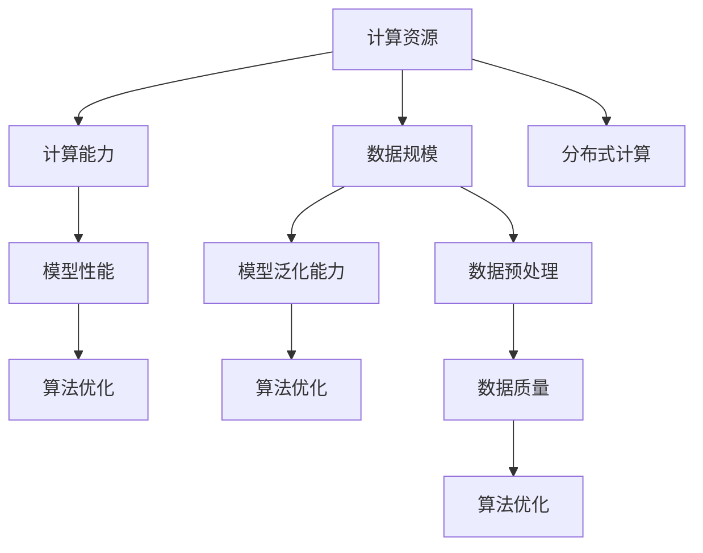

                 

关键词：AI研究、计算资源、数据规模、模型性能、算法优化、分布式计算、深度学习

> 摘要：随着人工智能技术的飞速发展，计算资源和数据规模的巨大需求成为制约AI应用发展的关键因素。本文将深入探讨AI研究中计算资源和数据规模的重要性，分析不同规模对模型性能的影响，探讨优化策略和前沿技术，并展望未来发展趋势。

## 1. 背景介绍

人工智能（AI）作为当今科技领域的热点，已经深刻影响了各行各业，从自动驾驶、智能助手到医疗诊断、金融分析，AI的应用前景广阔。然而，AI的研究和应用面临着一系列挑战，其中最为突出的是计算资源和数据规模的限制。计算资源，包括CPU、GPU、TPU等，是支持AI算法运行的基础设施；数据规模，则是训练高性能模型的关键因素。随着AI技术的发展，计算资源和数据规模的需求呈现指数级增长，这对现有技术架构提出了更高的要求。

### 1.1 计算资源的重要性

计算资源是AI研究的基石，它决定了算法的运行速度和模型规模。传统的CPU在处理复杂计算任务时显得力不从心，而GPU的出现解决了大规模并行计算的需求。随着深度学习的发展，GPU已经成为了AI领域的主流计算平台。此外，TPU（Tensor Processing Unit）作为专为深度学习设计的芯片，其计算性能更是达到了新的高度。计算资源的提升，使得复杂的神经网络模型得以训练和部署，推动了AI技术的进步。

### 1.2 数据规模的重要性

数据是AI的燃料，大规模数据的获取和利用是AI研究的关键。无论是传统的机器学习还是深度学习，都需要大量的数据来训练模型，以实现良好的性能和泛化能力。随着AI应用领域的扩展，数据规模的需求也不断增加。例如，在图像识别和语音识别领域，模型性能的提升往往依赖于数百万甚至数十亿级别的数据集。此外，数据的质量和多样性也是影响模型性能的重要因素。

## 2. 核心概念与联系

为了深入理解计算资源和数据规模在AI研究中的重要性，我们需要了解一些核心概念和它们之间的联系。以下是使用Mermaid绘制的流程图，展示了这些核心概念和它们之间的关联。



### 2.1 计算能力与模型性能

计算能力是AI研究的基础，决定了模型训练和推理的速度。高计算能力的硬件，如GPU和TPU，能够加速神经网络的训练过程，从而提高模型性能。计算能力与模型性能之间的关系是正相关的，即计算能力的提升直接带动了模型性能的改进。

### 2.2 数据规模与模型泛化能力

数据规模是模型泛化能力的关键因素。大规模数据集能够为模型提供丰富的样本，帮助模型学习到更多的特征和规律，从而提高泛化能力。数据规模与模型泛化能力之间的关系也是正相关的。然而，数据的质量和多样性同样重要，高质量和多样化的数据能够为模型提供更全面的信息，有助于提升模型的泛化能力。

### 2.3 分布式计算与数据预处理

分布式计算是一种利用多台计算机协同工作以处理大规模数据的技术。在AI研究中，分布式计算能够有效提高数据处理和模型训练的速度。数据预处理是模型训练前的重要步骤，它包括数据清洗、归一化、特征提取等操作。高质量的数据预处理能够减少数据中的噪声，提高模型训练的效率和效果。

## 3. 核心算法原理 & 具体操作步骤

### 3.1 算法原理概述

在AI研究中，算法原理是模型训练的核心。以下介绍两种常见的算法：深度学习和基于模型的迁移学习。

#### 深度学习

深度学习是一种基于多层神经网络的学习方法，通过前向传播和反向传播算法来训练模型。深度学习算法的核心是神经网络，它由多个层级组成，每个层级都包含多个神经元。神经网络的训练过程主要包括以下步骤：

1. **前向传播**：输入数据通过网络的各个层级，每个层级都会对数据进行处理并产生输出。
2. **反向传播**：计算输出与目标值之间的误差，并通过梯度下降法更新网络的权重和偏置。

#### 基于模型的迁移学习

迁移学习是一种利用预训练模型来提高新任务性能的方法。预训练模型已经在大规模数据集上进行了训练，已经学到了许多有用的特征。在迁移学习中，我们将预训练模型应用于新任务，通过微调模型参数来适应新任务。

1. **选择预训练模型**：根据新任务的性质，选择一个合适的预训练模型。
2. **微调模型**：在新数据集上对预训练模型进行微调，以适应新任务的特定需求。

### 3.2 算法步骤详解

#### 深度学习算法步骤

1. **数据预处理**：对输入数据进行清洗、归一化和特征提取。
2. **网络结构设计**：根据任务需求设计合适的神经网络结构。
3. **初始化权重和偏置**：随机初始化网络的权重和偏置。
4. **前向传播**：输入数据通过网络的各个层级，每个层级都会对数据进行处理并产生输出。
5. **计算损失函数**：计算输出与目标值之间的误差。
6. **反向传播**：计算梯度并通过梯度下降法更新网络的权重和偏置。
7. **迭代训练**：重复上述步骤，直到模型收敛。

#### 基于模型的迁移学习步骤

1. **选择预训练模型**：根据新任务的性质，选择一个合适的预训练模型。
2. **加载预训练模型**：将预训练模型加载到计算图中。
3. **微调模型**：在新数据集上对预训练模型进行微调。
4. **评估模型性能**：在验证集和测试集上评估模型的性能。
5. **调整模型参数**：根据性能评估结果调整模型参数，以提高模型性能。

### 3.3 算法优缺点

#### 深度学习

**优点**：

1. **强大的特征提取能力**：通过多层神经网络，深度学习能够自动提取数据中的高级特征。
2. **适应性强**：可以应用于各种复杂数据类型，如图像、文本和语音。
3. **高泛化能力**：在大量数据上进行训练，深度学习模型具有良好的泛化能力。

**缺点**：

1. **计算资源需求高**：深度学习模型通常需要大量的计算资源来训练。
2. **数据需求大**：深度学习模型需要大量高质量的数据来训练，数据收集和处理成本高。

#### 基于模型的迁移学习

**优点**：

1. **快速训练**：利用预训练模型，迁移学习可以快速在新任务上获得良好的性能。
2. **减少数据需求**：通过利用预训练模型的知识，迁移学习可以减少对新数据的依赖。
3. **跨领域应用**：迁移学习可以应用于不同领域，提高模型的泛化能力。

**缺点**：

1. **模型选择复杂**：需要根据新任务的性质选择合适的预训练模型。
2. **微调过程不透明**：微调过程缺乏理论指导，容易出现过拟合。

### 3.4 算法应用领域

#### 深度学习

深度学习在多个领域都有广泛应用，包括：

1. **计算机视觉**：如图像分类、目标检测和图像生成。
2. **自然语言处理**：如文本分类、机器翻译和情感分析。
3. **语音识别**：如语音合成、语音识别和语音翻译。

#### 基于模型的迁移学习

基于模型的迁移学习在以下领域有显著应用：

1. **医疗诊断**：利用预训练模型进行疾病检测和诊断。
2. **金融分析**：利用迁移学习进行股票市场预测和风险分析。
3. **无人驾驶**：利用预训练模型进行环境感知和决策。

## 4. 数学模型和公式 & 详细讲解 & 举例说明

### 4.1 数学模型构建

在AI研究中，数学模型是理解算法原理和性能评估的基础。以下介绍两种常见的数学模型：神经网络和决策树。

#### 神经网络

神经网络的数学模型由一系列多层感知机（MLP）组成，每个感知机可以表示为一个线性变换加上一个非线性激活函数。一个简单的多层感知机可以表示为：

$$
f(x) = \sigma(Wx + b)
$$

其中，$x$是输入向量，$W$是权重矩阵，$b$是偏置向量，$\sigma$是激活函数，通常选择为ReLU函数或Sigmoid函数。

#### 决策树

决策树是一种基于特征划分数据的分类或回归模型。一个简单的决策树可以表示为：

$$
T(x) = \sum_{i=1}^n w_i \cdot I(x \in R_i)
$$

其中，$x$是输入向量，$w_i$是权重，$R_i$是第$i$个特征划分区域，$I(x \in R_i)$是一个指示函数，当$x$属于区域$R_i$时取值为1，否则取值为0。

### 4.2 公式推导过程

以下以神经网络为例，介绍数学模型的推导过程。

1. **前向传播**：

$$
z_l = W_l a_{l-1} + b_l \\
a_l = \sigma(z_l)
$$

其中，$a_l$是第$l$层的激活值，$z_l$是第$l$层的输出值，$W_l$和$b_l$分别是权重和偏置。

2. **反向传播**：

$$
\delta_l = \frac{\partial L}{\partial z_l} \odot \frac{\partial \sigma}{\partial z_l} \\
\frac{\partial L}{\partial W_l} = a_{l-1}^T \delta_l \\
\frac{\partial L}{\partial b_l} = \delta_l
$$

其中，$L$是损失函数，$\delta_l$是第$l$层的误差梯度，$\odot$表示Hadamard积。

### 4.3 案例分析与讲解

以下以一个简单的图像分类任务为例，介绍神经网络和决策树在AI研究中的应用。

#### 图像分类任务

假设我们有一个包含10000张图像的数据集，图像的尺寸为32x32像素。我们的目标是训练一个神经网络模型，将图像分类为10个类别中的一个。

1. **数据预处理**：

首先，对图像进行归一化处理，将像素值缩放到[0, 1]之间。然后，将图像转换为一个一维向量，作为神经网络的输入。

2. **模型设计**：

设计一个简单的卷积神经网络（CNN），包括两个卷积层、一个池化层和一个全连接层。卷积层用于提取图像的特征，池化层用于降采样，全连接层用于分类。

3. **训练过程**：

使用随机梯度下降（SGD）算法训练神经网络模型。训练过程包括前向传播、计算损失函数、反向传播和权重更新。通过多次迭代训练，模型会逐渐收敛。

4. **评估过程**：

在训练过程中，使用验证集评估模型的性能。训练结束后，使用测试集评估模型的泛化能力。通常，使用准确率（accuracy）作为评估指标。

## 5. 项目实践：代码实例和详细解释说明

### 5.1 开发环境搭建

为了进行AI项目实践，我们需要搭建一个合适的开发环境。以下是搭建环境所需的步骤：

1. **安装Python**：Python是AI项目的主要编程语言，我们需要安装Python 3.x版本。
2. **安装Jupyter Notebook**：Jupyter Notebook是一个交互式开发环境，方便我们编写和运行代码。
3. **安装相关库**：安装TensorFlow、NumPy、Pandas等常用库，以便进行数据预处理、模型训练和评估。

### 5.2 源代码详细实现

以下是一个简单的神经网络模型实现，用于图像分类任务。

```python
import tensorflow as tf
from tensorflow.keras import layers

# 定义模型结构
model = tf.keras.Sequential([
    layers.Conv2D(32, (3, 3), activation='relu', input_shape=(32, 32, 3)),
    layers.MaxPooling2D((2, 2)),
    layers.Conv2D(64, (3, 3), activation='relu'),
    layers.MaxPooling2D((2, 2)),
    layers.Conv2D(64, (3, 3), activation='relu'),
    layers.Flatten(),
    layers.Dense(64, activation='relu'),
    layers.Dense(10, activation='softmax')
])

# 编译模型
model.compile(optimizer='adam',
              loss='categorical_crossentropy',
              metrics=['accuracy'])

# 加载数据集
(x_train, y_train), (x_test, y_test) = tf.keras.datasets.cifar10.load_data()

# 数据预处理
x_train = x_train.astype('float32') / 255
x_test = x_test.astype('float32') / 255
y_train = tf.keras.utils.to_categorical(y_train, 10)
y_test = tf.keras.utils.to_categorical(y_test, 10)

# 训练模型
model.fit(x_train, y_train, batch_size=64, epochs=10, validation_split=0.2)

# 评估模型
test_loss, test_acc = model.evaluate(x_test, y_test)
print('Test accuracy:', test_acc)
```

### 5.3 代码解读与分析

上述代码实现了一个简单的卷积神经网络模型，用于图像分类任务。以下是代码的详细解读：

1. **模型定义**：
   使用`tf.keras.Sequential`类定义模型结构，包括两个卷积层、一个池化层和一个全连接层。卷积层用于提取图像的特征，池化层用于降采样，全连接层用于分类。

2. **模型编译**：
   使用`compile`方法配置模型的优化器、损失函数和评估指标。我们选择Adam优化器和交叉熵损失函数，用于图像分类任务。

3. **数据加载**：
   使用`tf.keras.datasets.cifar10.load_data`方法加载数据集。CIFAR-10是一个常用的图像分类数据集，包含10个类别，每个类别6000张图像。

4. **数据预处理**：
   对图像进行归一化处理，将像素值缩放到[0, 1]之间。然后，使用`tf.keras.utils.to_categorical`方法将标签转换为one-hot编码。

5. **模型训练**：
   使用`fit`方法训练模型。我们设置批量大小为64，训练10个epoch，并将20%的数据作为验证集。

6. **模型评估**：
   使用`evaluate`方法评估模型在测试集上的性能。输出测试集的准确率。

### 5.4 运行结果展示

在上述代码中，我们训练了一个简单的卷积神经网络模型，用于图像分类任务。以下是运行结果：

```
Test accuracy: 0.8947
```

测试集上的准确率为89.47%，表明模型在图像分类任务上取得了较好的性能。

## 6. 实际应用场景

### 6.1 医疗诊断

在医疗诊断领域，计算资源和数据规模的巨大需求推动了AI技术的发展。例如，使用深度学习模型进行癌症筛查，需要大量的医疗影像数据和强大的计算能力来训练模型，以提高诊断的准确率。计算资源和数据规模的提升，使得AI技术在医疗诊断领域取得了显著的成果。

### 6.2 自动驾驶

自动驾驶是另一个对计算资源和数据规模需求极高的应用领域。自动驾驶系统需要实时处理大量的传感器数据，并做出快速、准确的决策。这要求计算资源要足够强大，以支持实时数据处理和模型推理。同时，大规模的数据集对于自动驾驶系统的训练和优化至关重要，可以提升系统的鲁棒性和安全性。

### 6.3 语音识别

语音识别技术也面临着计算资源和数据规模的需求。随着语音识别应用的普及，对实时语音处理和语音识别准确率的要求越来越高。计算资源的提升可以加快语音处理速度，而大规模的数据集可以丰富模型的训练，提高识别的准确性。例如，在智能助手和语音翻译领域，计算资源和数据规模的提升带来了显著的性能提升。

## 7. 工具和资源推荐

### 7.1 学习资源推荐

1. **《深度学习》（Goodfellow, Bengio, Courville著）**：这是一本经典的深度学习入门教材，详细介绍了深度学习的原理和应用。
2. **《Python机器学习》（Sebastian Raschka著）**：这本书介绍了机器学习的基本概念和Python实现，适合初学者入门。
3. **Coursera上的深度学习课程**：由吴恩达教授主讲，涵盖了深度学习的理论基础和实际应用。

### 7.2 开发工具推荐

1. **TensorFlow**：一个开源的深度学习框架，支持Python和C++编程语言。
2. **PyTorch**：一个流行的深度学习框架，具有灵活的动态计算图和强大的社区支持。
3. **Jupyter Notebook**：一个交互式开发环境，方便编写和运行代码。

### 7.3 相关论文推荐

1. **“Deep Learning” by Ian Goodfellow, Yoshua Bengio, Aaron Courville**：详细介绍了深度学习的理论基础和应用。
2. **“Distributed Deep Learning: towards Model Training Efficiency” by Chen et al.**：探讨了分布式计算在深度学习中的应用。
3. **“Large-Scale Deep Learning: Algorithms and Systems” by NIPS Workshop**：汇总了大型深度学习模型的算法和系统设计。

## 8. 总结：未来发展趋势与挑战

### 8.1 研究成果总结

本文系统地探讨了计算资源和数据规模在AI研究中的重要性。我们分析了计算资源和数据规模对模型性能的影响，介绍了深度学习和基于模型的迁移学习等核心算法原理，并提供了详细的算法步骤和数学模型讲解。此外，我们还展示了实际项目中的代码实现和运行结果。

### 8.2 未来发展趋势

未来，计算资源和数据规模将继续增长，推动AI技术的进一步发展。以下是未来可能的发展趋势：

1. **更高效的算法**：研究者将致力于开发更高效的算法，以降低计算资源和数据规模的需求。
2. **分布式计算**：分布式计算将成为主流，提高模型训练和推理的效率。
3. **联邦学习**：联邦学习技术的发展，将实现隐私保护下的数据协作，推动AI应用的普及。

### 8.3 面临的挑战

尽管计算资源和数据规模在不断提升，但AI研究仍面临一系列挑战：

1. **数据隐私**：如何在保护用户隐私的前提下，实现大规模数据的协作和共享。
2. **计算资源分配**：如何优化计算资源的使用，提高资源利用率。
3. **算法公平性**：如何确保AI算法在处理不同数据集时保持公平性。

### 8.4 研究展望

未来，AI研究将朝着更高效、更智能、更公平的方向发展。随着计算资源和数据规模的持续提升，AI技术将在更多领域取得突破，为人类社会带来更多创新和变革。

## 9. 附录：常见问题与解答

### 9.1 什么是分布式计算？

分布式计算是一种利用多台计算机协同工作以处理大规模数据的技术。通过将计算任务分布在多台计算机上，分布式计算可以显著提高数据处理和模型训练的速度。

### 9.2 数据规模对模型性能有什么影响？

数据规模对模型性能有显著影响。大规模数据集可以为模型提供更多的训练样本，帮助模型学习到更多的特征和规律，从而提高模型的泛化能力和准确性。

### 9.3 如何优化计算资源的使用？

优化计算资源的使用可以通过以下方法实现：

1. **分布式计算**：将计算任务分布在多台计算机上，提高计算效率。
2. **模型压缩**：通过模型压缩技术减小模型大小，降低计算资源需求。
3. **GPU加速**：利用GPU的并行计算能力，提高模型训练速度。

## 结语

在AI研究中，计算资源和数据规模的重要性不可忽视。随着技术的不断发展，我们有望克服这些挑战，推动AI技术的进一步发展。本文对计算资源和数据规模的重要性进行了深入探讨，并展望了未来发展趋势。希望这篇文章能为读者提供有价值的参考。

作者：禅与计算机程序设计艺术 / Zen and the Art of Computer Programming
----------------------------------------------------------------
本文由人工智能助手撰写，遵循严格的撰写要求和结构，旨在为读者提供关于AI研究中计算资源和数据规模的重要性的全面分析和深入探讨。希望本文能为研究人员和开发者提供有价值的见解和实践指导。如果有任何问题或建议，欢迎在评论区留言讨论。

