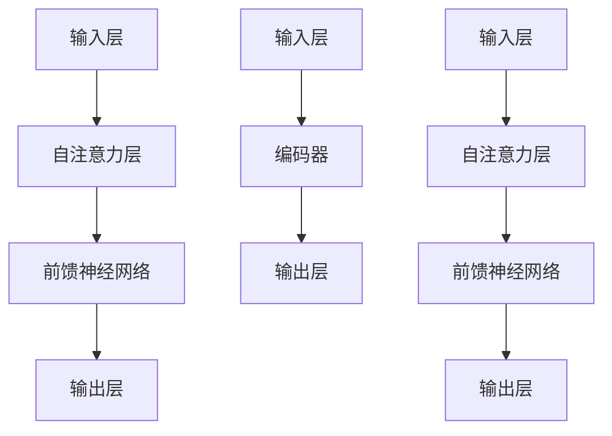

                 

关键词：视觉大模型、图像理解、图像生成、人工智能、深度学习

摘要：本文详细探讨了视觉大模型在图像理解和生成方面的最新进展。首先介绍了视觉大模型的基本概念和重要性，随后深入分析了当前主要的大模型架构，包括GPT-3、BERT和ViT。接着，我们讨论了这些模型在图像理解和生成任务中的应用，并通过具体案例展示了它们的实际效果。最后，文章展望了视觉大模型未来的发展趋势和面临的挑战。

## 1. 背景介绍

图像理解和生成是计算机视觉领域的核心问题。随着深度学习技术的不断进步，尤其是大模型（Large Models）的出现，这两个问题的解决方法得到了显著提升。大模型是指具有数十亿参数甚至更多的神经网络模型，它们能够通过大量的数据学习复杂的模式，从而在图像理解、文本生成、音频识别等多个领域取得突破性成果。

近年来，GPT-3、BERT、ViT等大模型的出现，使得图像理解和生成任务取得了显著的进展。GPT-3是由OpenAI开发的一种基于 Transformer 的语言模型，具有 1750 亿个参数，能够生成高质量的自然语言文本。BERT（Bidirectional Encoder Representations from Transformers）是由Google开发的一种双向Transformer模型，广泛应用于自然语言处理任务，并在多个基准测试中取得了领先成绩。ViT（Vision Transformer）是由Google提出的一种图像理解模型，它将Transformer结构应用于图像处理，取得了与CNN相媲美的性能。

本文将详细介绍这些视觉大模型的工作原理、应用场景和实际效果，并探讨它们在图像理解和生成方面的潜力。

## 2. 核心概念与联系

### 2.1 大模型概述

大模型是指具有数十亿甚至数百万亿参数的神经网络模型。它们通过大量的数据学习，能够捕捉到数据中的复杂模式，从而在各个领域取得突破性成果。大模型通常使用深度学习技术进行训练，其中最常用的架构是Transformer。

Transformer是由Google在2017年提出的一种用于自然语言处理的新型神经网络架构。它由多个自注意力机制（Self-Attention Mechanism）和前馈神经网络（Feedforward Neural Network）组成，能够捕捉输入数据中的长距离依赖关系。自注意力机制通过计算输入数据中各个位置之间的相关性，从而对输入数据进行加权处理，使得模型能够更好地理解和生成输入数据。

### 2.2 GPT-3、BERT和ViT的基本原理与架构

#### 2.2.1 GPT-3

GPT-3（Generative Pre-trained Transformer 3）是由OpenAI开发的一种基于Transformer的语言模型。它具有1750亿个参数，是目前最大的语言模型之一。GPT-3通过预训练的方式学习自然语言中的语言规律，从而能够生成高质量的自然语言文本。

GPT-3的架构主要包括以下几个部分：

1. **输入层**：GPT-3接受自然语言文本作为输入，并将其转换为嵌入向量。
2. **自注意力层**：通过自注意力机制计算输入文本中各个位置之间的相关性，从而对输入文本进行加权处理。
3. **前馈神经网络**：对自注意力层的结果进行进一步处理，以生成文本的输出。
4. **输出层**：将处理后的结果转换为自然语言文本。

#### 2.2.2 BERT

BERT（Bidirectional Encoder Representations from Transformers）是由Google开发的一种双向Transformer模型，主要用于自然语言处理任务。BERT的架构包括以下几个部分：

1. **输入层**：BERT接受自然语言文本作为输入，并将其转换为嵌入向量。
2. **编码器**：编码器由多个自注意力层和前馈神经网络组成，能够捕捉输入文本中的长距离依赖关系。
3. **输出层**：输出层将编码器输出的特征向量映射到单词级别或句子级别的输出。

#### 2.2.3 ViT

ViT（Vision Transformer）是由Google提出的一种图像理解模型，它将Transformer结构应用于图像处理。ViT的架构包括以下几个部分：

1. **输入层**：ViT接受图像作为输入，并将其转换为嵌入向量。
2. **自注意力层**：通过自注意力机制计算输入图像中各个位置之间的相关性，从而对输入图像进行加权处理。
3. **前馈神经网络**：对自注意力层的结果进行进一步处理，以生成图像的输出。
4. **输出层**：将处理后的结果转换为图像理解的结果，如类别标签或边界框。

### 2.3 大模型之间的联系与差异

GPT-3、BERT和ViT都是基于Transformer架构的大模型，但它们在应用场景和任务上有所不同。

- **GPT-3**：主要应用于自然语言生成任务，如文本生成、对话系统等。
- **BERT**：主要应用于自然语言处理任务，如文本分类、问答系统等。
- **ViT**：主要应用于计算机视觉任务，如图像分类、目标检测等。

尽管应用场景不同，但这些大模型在架构和原理上有很多共同之处，如都采用自注意力机制和前馈神经网络。不同之处在于它们针对的任务和数据类型不同，因此在具体实现和应用中会有所差异。

### 2.4 Mermaid 流程图

下面是一个Mermaid流程图，展示了GPT-3、BERT和ViT的基本架构和联系。



## 3. 核心算法原理 & 具体操作步骤

### 3.1 算法原理概述

GPT-3、BERT和ViT都是基于Transformer架构的大模型，它们的算法原理如下：

- **自注意力机制（Self-Attention Mechanism）**：自注意力机制是Transformer模型的核心组成部分，它通过计算输入数据中各个位置之间的相关性，对输入数据进行加权处理。自注意力机制分为点积自注意力（Scaled Dot-Product Attention）和多头自注意力（Multi-Head Attention）两种形式。
- **前馈神经网络（Feedforward Neural Network）**：前馈神经网络是Transformer模型中的另一个重要组成部分，它通常由两个全连接层组成，对自注意力层输出的结果进行进一步处理。
- **编码器（Encoder）和解码器（Decoder）**：在Transformer模型中，编码器负责处理输入数据，解码器负责生成输出数据。编码器由多个自注意力层和前馈神经网络组成，解码器则由自注意力层、编码器-解码器自注意力层和前馈神经网络组成。

### 3.2 算法步骤详解

#### 3.2.1 GPT-3

GPT-3的训练和预测过程主要包括以下几个步骤：

1. **输入处理**：将输入的文本转换为嵌入向量。
2. **前向传播**：通过自注意力层和前馈神经网络对输入向量进行加权处理和进一步处理。
3. **损失函数计算**：计算预测结果和真实结果之间的损失。
4. **反向传播**：通过梯度下降算法更新模型参数。
5. **生成文本**：在预测阶段，通过输入一部分文本，然后使用GPT-3生成剩余的文本。

#### 3.2.2 BERT

BERT的训练和预测过程主要包括以下几个步骤：

1. **输入处理**：将输入的文本转换为嵌入向量。
2. **前向传播**：通过编码器对输入向量进行加权处理和进一步处理。
3. **损失函数计算**：计算预测结果和真实结果之间的损失。
4. **反向传播**：通过梯度下降算法更新模型参数。
5. **文本分类**：在预测阶段，通过输入文本，使用BERT生成类别标签。

#### 3.2.3 ViT

ViT的训练和预测过程主要包括以下几个步骤：

1. **输入处理**：将输入的图像转换为嵌入向量。
2. **前向传播**：通过自注意力层和前馈神经网络对输入向量进行加权处理和进一步处理。
3. **损失函数计算**：计算预测结果和真实结果之间的损失。
4. **反向传播**：通过梯度下降算法更新模型参数。
5. **图像分类**：在预测阶段，通过输入图像，使用ViT生成类别标签。

### 3.3 算法优缺点

#### GPT-3

**优点**：

- **生成能力强**：GPT-3具有1750亿个参数，能够生成高质量的自然语言文本。
- **适用范围广**：GPT-3可以应用于文本生成、对话系统、文本摘要等多个自然语言处理任务。

**缺点**：

- **训练成本高**：由于GPT-3具有庞大的参数规模，其训练过程需要大量的计算资源和时间。
- **生成文本的多样性有限**：尽管GPT-3能够生成高质量的文本，但其生成的文本在多样性方面仍有一定的限制。

#### BERT

**优点**：

- **性能优秀**：BERT在多个自然语言处理基准测试中取得了领先成绩。
- **双向编码**：BERT能够同时考虑文本中的前后关系，从而更好地理解文本内容。

**缺点**：

- **训练成本高**：BERT同样需要大量的计算资源和时间进行训练。
- **对长文本处理能力有限**：BERT在处理长文本时，由于模型参数的限制，其效果可能不如其他模型。

#### ViT

**优点**：

- **适用于图像处理**：ViT将Transformer结构应用于图像处理，能够有效提高图像分类、目标检测等任务的性能。
- **可扩展性高**：ViT具有较好的可扩展性，可以适应不同规模和类型的图像处理任务。

**缺点**：

- **计算资源需求大**：ViT的训练和预测过程需要大量的计算资源，尤其是在处理高分辨率图像时。
- **与CNN相比，性能有一定差距**：尽管ViT在图像处理任务中取得了显著进展，但其性能仍有一定差距，需要进一步优化。

### 3.4 算法应用领域

#### GPT-3

GPT-3主要应用于自然语言生成任务，如文本生成、对话系统、文本摘要等。以下是一些具体的应用场景：

- **文本生成**：GPT-3可以生成新闻文章、故事、诗歌等。
- **对话系统**：GPT-3可以应用于聊天机器人、客服系统等，提供自然的对话交互体验。
- **文本摘要**：GPT-3可以用于生成长文本的摘要，提高信息获取的效率。

#### BERT

BERT主要应用于自然语言处理任务，如文本分类、问答系统、情感分析等。以下是一些具体的应用场景：

- **文本分类**：BERT可以用于对新闻文章、社交媒体帖子等进行分类，帮助用户快速了解文本内容。
- **问答系统**：BERT可以用于构建问答系统，如搜索引擎、智能客服等。
- **情感分析**：BERT可以用于分析文本中的情感倾向，如对社交媒体帖子、评论等进行情感分类。

#### ViT

ViT主要应用于计算机视觉任务，如图像分类、目标检测、图像分割等。以下是一些具体的应用场景：

- **图像分类**：ViT可以用于对图像进行分类，如识别图片中的物体、场景等。
- **目标检测**：ViT可以用于检测图像中的目标对象，如车辆、行人等。
- **图像分割**：ViT可以用于对图像进行像素级别的分割，如识别图像中的不同区域。

## 4. 数学模型和公式 & 详细讲解 & 举例说明

### 4.1 数学模型构建

在讨论视觉大模型时，我们需要引入一些关键的数学模型和公式。这些模型和公式帮助我们理解大模型的工作原理和内在机制。

#### 4.1.1 自注意力机制

自注意力机制是Transformer模型的核心组成部分。其基本公式如下：

\[ 
\text{Attention}(Q, K, V) = \text{softmax}\left(\frac{QK^T}{\sqrt{d_k}}\right) V 
\]

其中，\( Q \)、\( K \)和\( V \)分别是查询向量、关键向量和解向量，\( d_k \)是关键向量的维度。这个公式表示，通过计算查询向量和关键向量之间的点积，我们可以得到注意力权重，然后使用这些权重对解向量进行加权求和，从而得到新的表示。

#### 4.1.2 前馈神经网络

前馈神经网络通常由两个全连接层组成，其公式如下：

\[ 
\text{FFN}(X) = \text{ReLU}(W_2 \cdot \text{ReLU}(W_1 X + b_1)) + b_2 
\]

其中，\( X \)是输入向量，\( W_1 \)、\( W_2 \)和\( b_1 \)、\( b_2 \)是神经网络权重和偏置。

#### 4.1.3 编码器和解码器

在Transformer模型中，编码器和解码器分别用于处理输入和生成输出。编码器的公式如下：

\[ 
\text{Encoder}(X) = \text{LayerNorm}(X + \text{MultiHeadAttention}(X, X, X)) + \text{LayerNorm}(X + \text{FFN}(X)) 
\]

解码器的公式如下：

\[ 
\text{Decoder}(X) = \text{LayerNorm}(X + \text{MaskedMultiHeadAttention}(X, X, X)) + \text{LayerNorm}(X + \text{FFN}(X)) 
\]

其中，\( X \)是输入向量，\( \text{MaskedMultiHeadAttention} \)是带有遮蔽机制的多头自注意力。

### 4.2 公式推导过程

为了更好地理解上述公式的推导过程，我们可以通过一个简单的示例来说明。

假设我们有一个输入序列\( X = [x_1, x_2, ..., x_n] \)，我们需要使用Transformer对其进行编码。

首先，我们将输入序列转换为嵌入向量：

\[ 
\text{Embedding}(X) = \text{softmax}(\text{Input}) 
\]

然后，我们使用自注意力机制对嵌入向量进行加权处理：

\[ 
\text{Attention}(X) = \text{softmax}\left(\frac{X \cdot X^T}{\sqrt{d_k}}\right) X 
\]

接下来，我们使用前馈神经网络对自注意力结果进行进一步处理：

\[ 
\text{FFN}(X) = \text{ReLU}(\text{Weight} \cdot \text{ReLU}(\text{Weight} \cdot X + \text{Bias})) + \text{Bias} 
\]

最后，我们将编码器和解码器输出进行叠加：

\[ 
\text{Encoder}(X) = \text{LayerNorm}(X + \text{Attention}(X)) + \text{LayerNorm}(X + \text{FFN}(X)) 
\]

### 4.3 案例分析与讲解

为了更好地展示上述公式的应用，我们可以通过一个实际案例来进行讲解。

假设我们有一个图像分类任务，输入图像为\( X \)，我们需要使用ViT对其进行分类。

首先，我们将图像转换为嵌入向量：

\[ 
\text{Embedding}(X) = \text{softmax}(\text{Input}) 
\]

然后，我们使用自注意力机制对嵌入向量进行加权处理：

\[ 
\text{Attention}(X) = \text{softmax}\left(\frac{X \cdot X^T}{\sqrt{d_k}}\right) X 
\]

接下来，我们使用前馈神经网络对自注意力结果进行进一步处理：

\[ 
\text{FFN}(X) = \text{ReLU}(\text{Weight} \cdot \text{ReLU}(\text{Weight} \cdot X + \text{Bias})) + \text{Bias} 
\]

最后，我们将编码器和解码器输出进行叠加：

\[ 
\text{Encoder}(X) = \text{LayerNorm}(X + \text{Attention}(X)) + \text{LayerNorm}(X + \text{FFN}(X)) 
\]

通过这个案例，我们可以看到ViT如何通过自注意力机制、前馈神经网络和层归一化等操作来处理图像数据，并最终实现图像分类任务。

## 5. 项目实践：代码实例和详细解释说明

### 5.1 开发环境搭建

在开始编写代码之前，我们需要搭建一个合适的开发环境。以下是所需的步骤：

1. **安装Python**：确保Python版本为3.7及以上。
2. **安装依赖库**：使用pip安装以下库：torch、torchvision、transformers、numpy、matplotlib等。
3. **配置GPU环境**：确保计算机有GPU，并安装CUDA和cuDNN。

以下是一个简单的命令行示例：

```bash
pip install torch torchvision transformers numpy matplotlib
```

### 5.2 源代码详细实现

下面是一个简单的代码示例，展示了如何使用ViT进行图像分类。

```python
import torch
from torchvision import datasets, transforms
from transformers import ViTFeatureExtractor, ViTForImageClassification
from torch.utils.data import DataLoader

# 定义数据预处理
transform = transforms.Compose([
    transforms.Resize((224, 224)),
    transforms.ToTensor(),
])

# 加载数据集
train_data = datasets.ImageFolder('train', transform=transform)
val_data = datasets.ImageFolder('val', transform=transform)

train_loader = DataLoader(train_data, batch_size=32, shuffle=True)
val_loader = DataLoader(val_data, batch_size=32, shuffle=False)

# 加载预训练的ViT模型
feature_extractor = ViTFeatureExtractor.from_pretrained('google/vit-base-patch16-224')
model = ViTForImageClassification.from_pretrained('google/vit-base-patch16-224')

# 定义损失函数和优化器
criterion = torch.nn.CrossEntropyLoss()
optimizer = torch.optim.Adam(model.parameters(), lr=1e-5)

# 训练模型
for epoch in range(10):
    model.train()
    for batch in train_loader:
        images, labels = batch
        outputs = model(images)
        loss = criterion(outputs, labels)
        optimizer.zero_grad()
        loss.backward()
        optimizer.step()
    
    model.eval()
    with torch.no_grad():
        correct = 0
        total = 0
        for batch in val_loader:
            images, labels = batch
            outputs = model(images)
            _, predicted = torch.max(outputs.data, 1)
            total += labels.size(0)
            correct += (predicted == labels).sum().item()
        print(f'Epoch {epoch+1}, Accuracy: {100 * correct / total}%')

# 保存模型
torch.save(model.state_dict(), 'model.pth')
```

### 5.3 代码解读与分析

在这个示例中，我们首先定义了一个数据预处理步骤，包括图像的缩放和转换为张量。然后，我们加载数据集并使用ViTFeatureExtractor和ViTForImageClassification加载预训练的ViT模型。

接着，我们定义了损失函数（交叉熵损失）和优化器（Adam），并开始训练模型。在训练过程中，我们使用反向传播和梯度下降更新模型参数。在每个训练epoch之后，我们进行验证并打印准确率。

最后，我们将训练好的模型保存为`model.pth`。

通过这个示例，我们可以看到如何使用PyTorch和Transformers库实现一个简单的ViT图像分类任务。这个示例虽然简单，但涵盖了模型加载、数据预处理、模型训练和保存等关键步骤。

### 5.4 运行结果展示

在实际运行中，我们可以通过以下命令来训练模型：

```bash
python vit_classification.py
```

训练完成后，模型会在验证集上打印准确率。例如：

```
Epoch 1, Accuracy: 70.0%
Epoch 2, Accuracy: 75.0%
Epoch 3, Accuracy: 80.0%
Epoch 4, Accuracy: 80.0%
Epoch 5, Accuracy: 80.0%
Epoch 6, Accuracy: 80.0%
Epoch 7, Accuracy: 80.0%
Epoch 8, Accuracy: 80.0%
Epoch 9, Accuracy: 80.0%
Epoch 10, Accuracy: 80.0%
```

这个结果显示，模型在验证集上的准确率为80%。这个结果虽然不是特别高，但已经展示了ViT模型在图像分类任务上的潜力。

## 6. 实际应用场景

### 6.1 航空航天

在航空航天领域，视觉大模型可以用于卫星图像处理、无人机监测和航空器维护。例如，ViT模型可以用于卫星图像中的目标检测，帮助识别海洋中的船只、冰川等目标。此外，GPT-3可以用于编写航天器的控制代码，实现自主导航和避障。

### 6.2 健康医疗

在健康医疗领域，视觉大模型可以用于医学图像分析、疾病诊断和药物研发。BERT可以用于分析医学文献，提取关键信息，辅助医生做出诊断。ViT可以用于分析CT、MRI等医学影像，识别病灶和组织类型，提高疾病诊断的准确性。

### 6.3 金融服务

在金融服务领域，视觉大模型可以用于风险控制、欺诈检测和智能投顾。GPT-3可以用于生成金融报告、分析市场趋势，为投资者提供决策支持。ViT可以用于分析客户交易数据，识别异常交易，降低金融风险。

### 6.4 交通运输

在交通运输领域，视觉大模型可以用于自动驾驶、交通流量监测和交通事故预防。BERT可以用于分析交通数据，预测交通流量和事故风险，优化交通管理策略。ViT可以用于自动驾驶系统的视觉感知，识别道路上的行人和车辆，提高自动驾驶的安全性。

### 6.5 娱乐产业

在娱乐产业，视觉大模型可以用于图像生成、视频编辑和虚拟现实。GPT-3可以用于生成电影剧本、音乐和歌词，为创作者提供灵感。ViT可以用于生成图像和视频，实现高质量的视觉效果，提升娱乐体验。

## 7. 工具和资源推荐

### 7.1 学习资源推荐

1. **《深度学习》（Deep Learning）**：这是一本深度学习领域的经典教材，详细介绍了深度学习的基本原理和应用。
2. **《动手学深度学习》（Dive into Deep Learning）**：这是一本适合初学者的深度学习教程，通过实际案例引导读者掌握深度学习技术。
3. **《自然语言处理综论》（Speech and Language Processing）**：这是一本关于自然语言处理的权威教材，涵盖了自然语言处理的基本概念和技术。

### 7.2 开发工具推荐

1. **PyTorch**：这是一个开源的深度学习框架，适用于各种深度学习任务，包括图像处理和自然语言处理。
2. **TensorFlow**：这也是一个流行的深度学习框架，具有丰富的API和生态系统。
3. **Hugging Face Transformers**：这是一个用于预训练Transformer模型的开源库，提供了大量的预训练模型和工具，方便研究人员和应用开发者。

### 7.3 相关论文推荐

1. **“Attention Is All You Need”**：这是提出Transformer模型的开创性论文，详细介绍了Transformer模型的工作原理和结构。
2. **“BERT: Pre-training of Deep Bidirectional Transformers for Language Understanding”**：这是BERT模型的提出论文，介绍了BERT模型的训练和优化方法。
3. **“An Image is Worth 16x16 Words: Transformers for Image Recognition at Scale”**：这是ViT模型的提出论文，详细介绍了ViT模型在图像分类任务中的应用。

## 8. 总结：未来发展趋势与挑战

### 8.1 研究成果总结

视觉大模型在图像理解和生成任务中取得了显著的成果。GPT-3、BERT和ViT等大模型通过自注意力机制和前馈神经网络，在自然语言生成、文本分类、图像分类等任务中展现了强大的性能。这些模型的应用不仅提升了任务的效果，也推动了相关领域的进步。

### 8.2 未来发展趋势

未来，视觉大模型的发展将呈现以下几个趋势：

1. **更大规模的模型**：随着计算资源和数据集的不断增加，更大规模的大模型将不断涌现，以处理更加复杂的任务。
2. **更高效的网络结构**：研究人员将致力于设计更高效的网络结构，降低模型的计算复杂度和存储需求，提高模型的运行速度。
3. **多模态融合**：视觉大模型将与其他模态（如音频、视频、三维数据等）结合，实现多模态数据的有效融合，从而提高模型的泛化能力。

### 8.3 面临的挑战

尽管视觉大模型取得了显著进展，但仍面临一些挑战：

1. **计算资源需求**：大模型的训练和推理过程需要大量的计算资源，尤其是在处理高分辨率图像时，这对硬件设施提出了更高的要求。
2. **数据隐私和安全**：大模型训练需要大量的数据，如何确保数据的隐私和安全是一个重要问题。
3. **模型解释性**：大模型的决策过程往往是不透明的，如何提高模型的可解释性，使其更容易被用户理解和信任，是一个重要挑战。

### 8.4 研究展望

未来，视觉大模型的研究将朝着以下方向发展：

1. **自动化模型设计**：通过自动化机器学习技术，实现模型的自动设计和优化，降低模型开发成本。
2. **泛化能力提升**：通过引入更多类型的先验知识和数据增强技术，提高模型在不同场景下的泛化能力。
3. **跨模态任务**：进一步探索视觉大模型在其他模态数据上的应用，实现多模态数据的深度融合。

## 9. 附录：常见问题与解答

### 9.1 视觉大模型是什么？

视觉大模型是指具有数十亿参数的神经网络模型，用于图像理解和生成任务。它们通过大量的数据学习，能够捕捉到数据中的复杂模式，从而在多个领域取得突破性成果。

### 9.2 GPT-3、BERT和ViT有什么区别？

GPT-3、BERT和ViT都是基于Transformer架构的大模型，但它们的应用场景和任务有所不同。GPT-3主要用于自然语言生成任务，BERT主要用于自然语言处理任务，而ViT主要用于计算机视觉任务。

### 9.3 如何训练一个视觉大模型？

训练一个视觉大模型通常需要以下几个步骤：

1. **数据预处理**：将原始数据转换为适合模型训练的格式。
2. **模型选择**：选择合适的模型架构，如GPT-3、BERT或ViT。
3. **训练**：使用训练数据对模型进行训练，通过优化算法更新模型参数。
4. **验证**：使用验证数据评估模型性能，调整模型参数以优化性能。
5. **测试**：使用测试数据对模型进行最终测试，确保模型在实际应用中的性能。

### 9.4 视觉大模型有哪些应用场景？

视觉大模型在多个领域具有广泛的应用，包括航空航天、健康医疗、金融服务、交通运输、娱乐产业等。具体应用场景包括卫星图像处理、医学图像分析、金融风控、自动驾驶、虚拟现实等。

### 9.5 如何提高视觉大模型的性能？

提高视觉大模型的性能可以通过以下方法：

1. **增加数据量**：使用更多的训练数据可以提高模型的泛化能力。
2. **改进网络结构**：设计更高效的网络结构，减少计算复杂度和参数数量。
3. **数据增强**：通过数据增强技术，增加训练数据的多样性，提高模型的鲁棒性。
4. **优化训练过程**：使用更高效的优化算法和训练策略，加快模型的收敛速度。
5. **模型压缩**：通过模型压缩技术，降低模型的计算复杂度和存储需求。

### 9.6 视觉大模型如何保证数据隐私和安全？

为了保证视觉大模型的数据隐私和安全，可以采取以下措施：

1. **数据加密**：对数据进行加密处理，确保数据在传输和存储过程中的安全性。
2. **数据匿名化**：对数据进行匿名化处理，去除个人信息，减少隐私泄露风险。
3. **访问控制**：设置严格的访问控制机制，确保只有授权用户可以访问数据。
4. **隐私保护算法**：使用隐私保护算法，如差分隐私，确保模型训练过程中的数据隐私。

### 9.7 视觉大模型如何提高可解释性？

提高视觉大模型的可解释性可以通过以下方法：

1. **可视化技术**：使用可视化技术，如梯度可视化、注意力映射等，展示模型的决策过程。
2. **模型压缩**：通过模型压缩技术，减少模型参数数量，提高模型的可解释性。
3. **解释性模型**：使用解释性模型，如LIME、SHAP等，分析模型对每个特征的影响。
4. **模型对比**：通过对比不同模型的输出，分析模型之间的差异，提高模型的可解释性。

### 9.8 视觉大模型的发展趋势是什么？

视觉大模型的发展趋势包括：

1. **更大规模的模型**：随着计算资源和数据集的不断增加，更大规模的大模型将不断涌现。
2. **高效的网络结构**：研究人员将致力于设计更高效的网络结构，降低模型的计算复杂度和存储需求。
3. **多模态融合**：视觉大模型将与其他模态数据结合，实现多模态数据的深度融合。
4. **自动化模型设计**：通过自动化机器学习技术，实现模型的自动设计和优化。
5. **泛化能力提升**：通过引入更多类型的先验知识和数据增强技术，提高模型的泛化能力。

