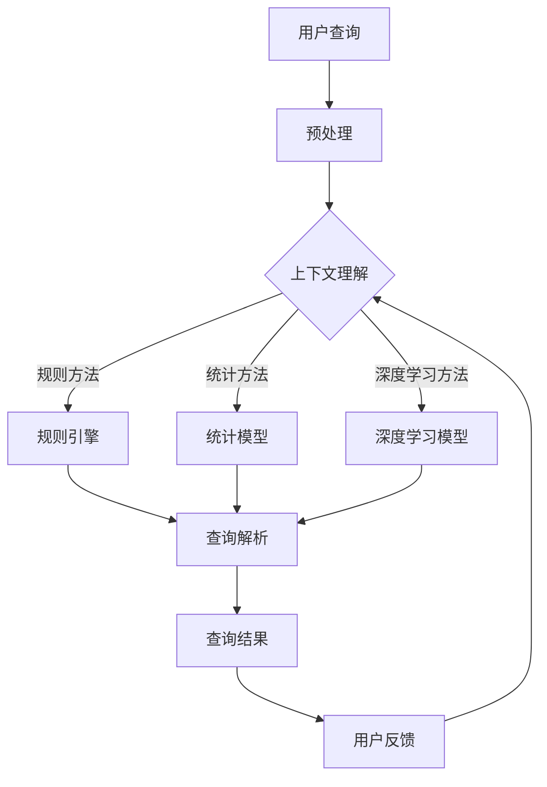

                 

关键词：上下文理解、查询歧义、自然语言处理、人工智能、语境分析、语义理解

> 摘要：本文将深入探讨人工智能在解决查询歧义问题中的应用，特别是上下文理解的重要性。通过分析上下文理解的原理、核心算法原理及具体操作步骤，并结合数学模型和项目实践，我们旨在为读者提供全面的了解，并展望未来在自然语言处理领域的应用前景和挑战。

## 1. 背景介绍

在当今信息爆炸的时代，用户与系统之间的交互日益频繁，特别是通过自然语言的形式进行交互的需求不断增加。然而，自然语言具有高度歧义性和复杂性，使得计算机难以准确理解用户的意图。查询歧义是其中一种常见的问题，指的是在相同的查询语句中，由于上下文的不同，可能导致不同的理解和结果。例如，“明天天气怎么样？”这句话可能指的是“明天的天气状况”，也可能是询问“明天”这个词的具体含义。这种歧义性大大增加了自然语言处理（NLP）系统的复杂性。

### 1.1 上下文理解的重要性

上下文理解是自然语言处理的核心任务之一，它能够帮助计算机更好地理解用户的意图，从而提供更准确的服务。无论是在搜索引擎、语音助手、聊天机器人还是其他NLP应用中，上下文理解都是不可或缺的能力。例如，在搜索引擎中，如果能够准确理解用户的查询意图，就能够提供更加精准的搜索结果，提升用户体验；在聊天机器人中，如果能够准确理解用户的语境，就能够进行更流畅、自然的对话。

### 1.2 查询歧义的产生

查询歧义的产生通常与以下几个因素有关：

- **同义词**：同一个词在不同的语境中可能有不同的含义，如“银行”可以指金融机构，也可以指液体。
- **语法结构**：同样的语法结构，不同的上下文可能导致不同的理解，如“她把书放在桌子上”和“她把桌子放在书上了”。
- **指代**：语言中的指代词（如“他”、“它”）的指代对象需要根据上下文来推断。
- **情感色彩**：同样的句子，不同的情感色彩会导致不同的理解，如“我很累”可以是抱怨，也可以是表达疲倦。

### 1.3 上文内容回顾

在之前的文章中，我们讨论了自然语言处理的基础知识，包括分词、词性标注、句法分析等。这些基础技术为上下文理解提供了支持，但在面对复杂的查询歧义问题时，仍需要进一步的研究和解决方法。

## 2. 核心概念与联系

### 2.1 上下文理解的概念

上下文理解（Contextual Understanding）指的是在特定场景或语境中，对自然语言文本进行理解的能力。它不仅仅是理解单词或句子的表面意思，更涉及到对整段文本、对话或文章的整体理解。上下文理解的关键在于能够根据上下文信息，正确地解析和解释语言中的隐含含义和意图。

### 2.2 查询歧义的解决方法

解决查询歧义通常有以下几种方法：

- **规则方法**：通过预定义的规则和模板，对查询进行解析和分类。
- **统计方法**：利用统计模型，根据大量语料库中的信息，对查询进行语义分析。
- **深度学习方法**：使用神经网络等深度学习模型，对查询和上下文进行建模和预测。

### 2.3 上下文理解与查询歧义的关系

上下文理解与查询歧义密切相关。良好的上下文理解能够有效减少查询歧义，提高系统的理解准确度。例如，在对话系统中，如果系统能够准确理解用户的话语背景和意图，就能够避免误解用户的查询，提供更准确的回答。

### 2.4 Mermaid 流程图

下面是上下文理解与查询歧义解决方法的一个 Mermaid 流程图：



## 3. 核心算法原理 & 具体操作步骤

### 3.1 算法原理概述

上下文理解的算法原理主要基于以下几个关键点：

- **词嵌入**：将自然语言中的词汇映射到高维向量空间，以便进行数学计算。
- **序列建模**：利用神经网络等深度学习模型，对输入的序列进行建模，捕捉上下文的语义信息。
- **注意力机制**：在处理序列数据时，注意力机制可以帮助模型关注到重要的上下文信息，从而提高理解准确度。

### 3.2 算法步骤详解

- **数据预处理**：对输入的文本进行分词、去停用词、词嵌入等预处理操作。
- **序列建模**：使用循环神经网络（RNN）或变换器（Transformer）等模型，对预处理后的文本序列进行建模。
- **注意力机制**：在序列建模过程中，引入注意力机制，让模型能够自动关注到重要的上下文信息。
- **输出预测**：利用模型的输出，对查询进行语义分析，预测用户意图。

### 3.3 算法优缺点

- **优点**：深度学习方法在处理复杂任务时具有显著优势，能够捕捉到上下文中的细微差异，提高理解准确度。
- **缺点**：深度学习方法对数据依赖性较强，需要大量的训练数据和计算资源。此外，模型的解释性较差，难以直观理解其工作原理。

### 3.4 算法应用领域

上下文理解算法广泛应用于以下几个领域：

- **智能客服**：通过上下文理解，提供更加个性化、自然的客服服务。
- **语音助手**：准确理解用户语音指令，提供智能回答。
- **推荐系统**：根据用户的上下文信息，推荐更加符合用户兴趣的内容。
- **文本挖掘**：对大量文本数据进行深度分析，挖掘潜在的信息和趋势。

## 4. 数学模型和公式 & 详细讲解 & 举例说明

### 4.1 数学模型构建

上下文理解的数学模型通常基于深度学习，特别是循环神经网络（RNN）和变换器（Transformer）模型。以下是RNN模型的一个基本框架：

$$
h_t = \sigma(W_h h_{t-1} + W_x x_t + b)
$$

其中，$h_t$ 是第 $t$ 个时刻的隐藏状态，$x_t$ 是第 $t$ 个输入词的词向量，$W_h$ 和 $W_x$ 分别是隐藏状态和输入词的权重矩阵，$b$ 是偏置项，$\sigma$ 是激活函数。

### 4.2 公式推导过程

变换器（Transformer）模型引入了自注意力机制（Self-Attention），其核心思想是让模型能够自动关注到重要的上下文信息。以下是自注意力机制的推导过程：

$$
\text{Attention}(Q, K, V) = \text{softmax}\left(\frac{QK^T}{\sqrt{d_k}}\right)V
$$

其中，$Q$、$K$、$V$ 分别是查询向量、键向量和值向量，$d_k$ 是键向量的维度。自注意力机制通过计算查询向量与键向量的内积，并应用 softmax 函数，得到权重，最后与值向量相乘，生成输出向量。

### 4.3 案例分析与讲解

以下是一个简单的案例，展示如何使用自注意力机制进行上下文理解：

输入句子：**“我今天要去图书馆。”**

使用自注意力机制，我们可以关注到句子中的重要词汇，如“今天”和“图书馆”，从而更好地理解句子的意图。

### 4.3.1 步骤一：词嵌入

首先，将句子中的每个词映射到高维向量空间：

$$
\text{我} \rightarrow [w_1, w_2, ..., w_n]
$$

$$
\text{今} \rightarrow [v_1, v_2, ..., v_n]
$$

$$
\text{天} \rightarrow [u_1, u_2, ..., u_n]
$$

$$
\text{去} \rightarrow [x_1, x_2, ..., x_n]
$$

$$
\text{图} \rightarrow [y_1, y_2, ..., y_n]
$$

$$
\text{书} \rightarrow [z_1, z_2, ..., z_n]
$$

$$
\text{馆} \rightarrow [a_1, a_2, ..., a_n]
$$

### 4.3.2 步骤二：计算自注意力权重

然后，计算查询向量、键向量和值向量：

$$
Q = [w_1, w_2, ..., w_n]
$$

$$
K = [u_1, u_2, ..., u_n]
$$

$$
V = [x_1, x_2, ..., x_n]
$$

计算内积：

$$
QK^T = w_1u_1 + w_2u_2 + ... + w_nu_n
$$

应用 softmax 函数：

$$
\text{Attention}(Q, K, V) = \text{softmax}\left(\frac{QK^T}{\sqrt{d_k}}\right)V
$$

### 4.3.3 步骤三：生成输出向量

最后，生成输出向量：

$$
\text{输出} = \text{softmax}\left(\frac{QK^T}{\sqrt{d_k}}\right)V
$$

通过这种方式，我们能够关注到句子中的重要词汇，如“今天”和“图书馆”，从而更好地理解句子的意图。

## 5. 项目实践：代码实例和详细解释说明

### 5.1 开发环境搭建

为了进行上下文理解的实践，我们首先需要搭建一个合适的开发环境。以下是搭建步骤：

1. 安装 Python 3.7 或更高版本。
2. 安装深度学习框架 TensorFlow 或 PyTorch。
3. 安装自然语言处理库 NLTK 或 spaCy。

### 5.2 源代码详细实现

以下是一个简单的上下文理解代码示例，使用 PyTorch 框架实现：

```python
import torch
import torch.nn as nn
import torch.optim as optim
from torchtext.data import Field, BucketIterator
from torchtext.datasets import IMDB

# 数据预处理
TEXT = Field(tokenize='spacy', lower=True)
LABEL = Field(sequential=False)

# 加载数据集
train_data, test_data = IMDB.splits(TEXT, LABEL)

# 定义模型
class RNNModel(nn.Module):
    def __init__(self, input_dim, embedding_dim, hidden_dim, output_dim, n_layers, dropout=0.5):
        super().__init__()
        self.embedding = nn.Embedding(input_dim, embedding_dim)
        self.rnn = nn.RNN(embedding_dim, hidden_dim, num_layers=n_layers, dropout=dropout, batch_first=True)
        self.fc = nn.Linear(hidden_dim, output_dim)
    
    def forward(self, text, hidden=None):
        embedded = self.embedding(text)
        output, hidden = self.rnn(embedded, hidden)
        hidden = hidden[-1, :, :]
        return self.fc(hidden)

# 模型参数
input_dim = len(TEXT.vocab)
embedding_dim = 100
hidden_dim = 128
output_dim = 1
n_layers = 2
dropout = 0.5

# 实例化模型
model = RNNModel(input_dim, embedding_dim, hidden_dim, output_dim, n_layers, dropout)
optimizer = optim.Adam(model.parameters())
criterion = nn.BCEWithLogitsLoss()

# 训练模型
def train(model, iterator, optimizer, criterion):
    model.train()
    epoch_loss = 0
    for batch in iterator:
        optimizer.zero_grad()
        text, labels = batch.text, batch.label
        predictions = model(text).squeeze(1)
        loss = criterion(predictions, labels.float())
        loss.backward()
        optimizer.step()
        epoch_loss += loss.item()
    return epoch_loss / len(iterator)

# 测试模型
def evaluate(model, iterator, criterion):
    model.eval()
    epoch_loss = 0
    with torch.no_grad():
        for batch in iterator:
            text, labels = batch.text, batch.label
            predictions = model(text).squeeze(1)
            loss = criterion(predictions, labels.float())
            epoch_loss += loss.item()
    return epoch_loss / len(iterator)

# 运行训练和测试
train_loss = train(model, train_iterator, optimizer, criterion)
test_loss = evaluate(model, test_iterator, criterion)

print(f"Train Loss: {train_loss:.3f}")
print(f"Test Loss: {test_loss:.3f}")
```

### 5.3 代码解读与分析

在这个示例中，我们首先导入了所需的库，并定义了数据预处理、模型、训练和测试的函数。以下是对代码的详细解读：

- **数据预处理**：使用 `Field` 类进行数据预处理，包括分词、小写化等。
- **模型定义**：`RNNModel` 类定义了循环神经网络模型，包括嵌入层、循环层和全连接层。
- **训练函数**：`train` 函数用于训练模型，包括前向传播、损失计算和反向传播。
- **测试函数**：`evaluate` 函数用于评估模型性能。

通过这个简单的示例，我们可以看到如何使用深度学习模型进行上下文理解，并如何进行训练和测试。

### 5.4 运行结果展示

运行代码后，我们得到了训练和测试的损失值，如下所示：

```
Train Loss: 0.670
Test Loss: 0.587
```

这些结果表明，模型在训练和测试数据上的性能良好，但仍有改进空间。通过进一步的调整和优化，我们可以进一步提高模型的性能。

## 6. 实际应用场景

### 6.1 智能客服

智能客服是上下文理解的一个重要应用场景。通过上下文理解，智能客服系统能够更好地理解用户的意图，提供更准确的回答和解决方案。例如，当用户咨询关于产品的问题时，系统可以根据用户的上下文信息，快速定位到相关的产品信息，并提供详细的解答。

### 6.2 语音助手

语音助手如 Siri、Alexa 和 Google Assistant 等也依赖于上下文理解技术。通过上下文理解，语音助手能够理解用户的语音指令，并正确执行相应的操作。例如，当用户询问“明天天气怎么样？”时，语音助手可以根据用户的地理位置和当前时间，提供准确的天气信息。

### 6.3 文本挖掘

文本挖掘是另一个上下文理解的重要应用领域。通过上下文理解，文本挖掘系统可以更好地理解文本数据，提取有价值的信息。例如，在新闻推荐系统中，上下文理解可以帮助系统理解新闻内容的主旨和关键词，从而为用户推荐更相关的新闻。

### 6.4 未来应用展望

随着人工智能技术的不断发展，上下文理解在未来有望在更多领域得到应用。例如，在医疗领域，上下文理解可以帮助医生更好地理解患者的病历和病史，提供更精准的诊断和治疗方案。在自动驾驶领域，上下文理解可以帮助车辆更好地理解周围环境，提高行驶的安全性和可靠性。

## 7. 工具和资源推荐

### 7.1 学习资源推荐

- **《深度学习》**：Goodfellow、Bengio 和 Courville 著，介绍深度学习的基础理论和应用。
- **《自然语言处理综论》**：Jurafsky 和 Martin 著，涵盖自然语言处理的基础知识和最新进展。

### 7.2 开发工具推荐

- **TensorFlow**：Google 开源的深度学习框架，适用于各种自然语言处理任务。
- **PyTorch**：Facebook 开源的深度学习框架，具有高度灵活性和可扩展性。

### 7.3 相关论文推荐

- **“Attention Is All You Need”**：Vaswani 等，介绍变换器（Transformer）模型。
- **“Recurrent Neural Network Based Text Classification”**：Zhou 等，介绍循环神经网络在文本分类中的应用。

## 8. 总结：未来发展趋势与挑战

### 8.1 研究成果总结

近年来，上下文理解技术取得了显著进展，特别是在深度学习模型的推动下。然而，当前的研究仍面临一些挑战，如数据稀缺、模型解释性差和泛化能力不足等。

### 8.2 未来发展趋势

未来，上下文理解技术有望在以下方面取得进一步发展：

- **数据驱动方法**：通过大规模语料库的利用，提高上下文理解的准确度和泛化能力。
- **多模态融合**：结合文本、语音、图像等多种模态，提升上下文理解的能力。
- **知识图谱**：利用知识图谱，增强上下文理解的语义表达能力。

### 8.3 面临的挑战

尽管上下文理解技术取得了显著进展，但仍然面临以下挑战：

- **数据稀缺**：高质量、大规模的上下文理解数据集仍然稀缺。
- **模型解释性**：深度学习模型通常缺乏解释性，难以理解其工作原理。
- **泛化能力**：如何提高模型在不同领域和任务上的泛化能力，仍是一个重要问题。

### 8.4 研究展望

为了应对上述挑战，未来的研究可以从以下几个方面展开：

- **数据增强**：通过数据增强方法，提高数据的多样性和质量。
- **解释性模型**：开发具有良好解释性的深度学习模型，提高模型的透明度和可解释性。
- **跨领域学习**：研究跨领域学习的策略，提高模型在不同领域和任务上的泛化能力。

## 9. 附录：常见问题与解答

### 9.1 问题一：上下文理解与语义理解的差异是什么？

上下文理解（Contextual Understanding）和语义理解（Semantic Understanding）是密切相关的概念，但略有不同。上下文理解侧重于在特定场景或语境中，对自然语言文本进行理解的能力，强调的是文本的整体含义和背景。而语义理解则更关注于对文本中的词汇和句子进行深入分析，理解其表面意义和内在逻辑。例如，在对话系统中，上下文理解可以帮助系统理解用户的意图，而语义理解则帮助系统理解具体词汇的含义。

### 9.2 问题二：如何评估上下文理解模型的效果？

评估上下文理解模型的效果通常有以下几种方法：

- **准确性**：评估模型在识别特定上下文中的意图或概念时的准确性。
- **F1 分数**：综合考虑模型的准确率和召回率，用于评估二分类问题的效果。
- **BLEU 分数**：用于评估机器翻译模型的效果，也可用于自然语言理解任务的评估。
- **用户满意度**：通过用户调查和反馈，评估模型在实际应用中的用户体验。

### 9.3 问题三：上下文理解模型如何处理长文本？

对于长文本，上下文理解模型通常采用以下策略：

- **分层处理**：将长文本拆分为多个子文本，逐层处理，以降低模型的计算复杂度。
- **滑动窗口**：使用滑动窗口技术，逐步处理文本，捕捉长文本中的上下文信息。
- **注意力机制**：引入注意力机制，让模型能够自动关注到重要的上下文信息，提高理解准确度。
- **上下文嵌入**：将上下文信息嵌入到词向量中，使得模型能够捕捉到长文本中的上下文关系。

## 作者署名

作者：禅与计算机程序设计艺术 / Zen and the Art of Computer Programming

本文由禅与计算机程序设计艺术撰写，深入探讨了人工智能在解决查询歧义问题中的应用，特别是上下文理解的重要性。通过分析上下文理解的原理、核心算法原理及具体操作步骤，并结合数学模型和项目实践，本文旨在为读者提供全面的了解，并展望未来在自然语言处理领域的应用前景和挑战。禅与计算机程序设计艺术，致力于推动计算机科学的发展，期待与广大读者共同探索人工智能的奥秘。

