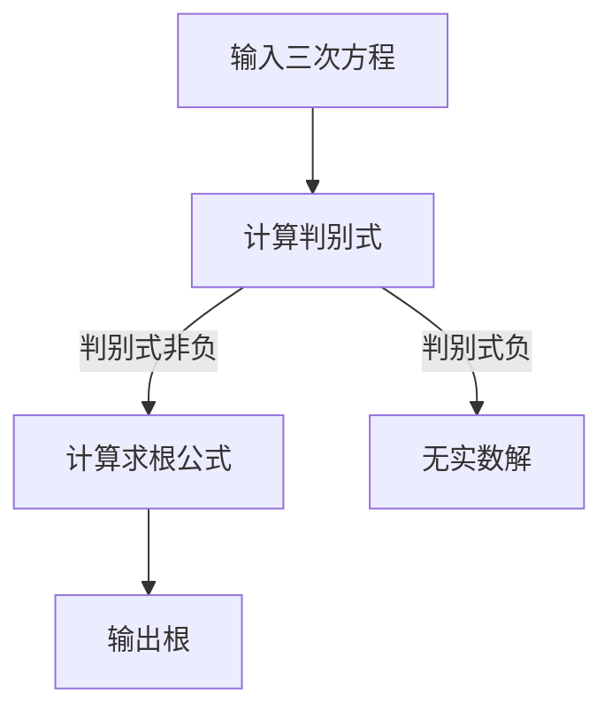

                 

关键词：计算历史，数学算法，三次方程，求根公式，编程技巧，技术发展

> 摘要：本文将探讨计算的历史起源，尤其是三次方程的求解方法。通过详细解析三次方程的求根公式，我们旨在为读者提供一次深入理解数学和编程之美的旅程。文章将涵盖数学模型的构建，公式推导过程，算法实现与优化，以及实际应用场景。

## 1. 背景介绍

### 计算的起源

计算的历史可以追溯到古代文明的数学发展。早在公元前2000年，古埃及和巴比伦的数学家们就已经开始使用简单的算术方法来解决实际问题。随着人类文明的进步，计算技术不断发展，从简单的机械计算工具，到现代的计算机系统，计算在科学、工业、经济和日常生活中扮演着越来越重要的角色。

### 三次方程的历史

三次方程的求解问题在数学史上有着重要的地位。古希腊数学家丢番图（Diophantus）在约公元250年左右，就已经开始研究三次方程。然而，真正的突破是在16世纪，意大利数学家费拉里（Ferraro）发现了三次方程的求根公式，这一公式标志着代数解法的重大进步。

## 2. 核心概念与联系

### 数学模型原理

三次方程的一般形式为：

\[ ax^3 + bx^2 + cx + d = 0 \]

其求根公式为：

\[ x = \sqrt[3]{-\frac{b}{3a} + \sqrt{\left(\frac{b}{3a}\right)^2 + \left(\frac{c}{a}\right)^3}} \]

### Mermaid 流程图

以下是一个简化的三次方程求根公式的 Mermaid 流程图：



## 3. 核心算法原理 & 具体操作步骤

### 算法原理概述

三次方程的求根公式基于代数基本定理和复数的概念。公式通过将三次方程转换为两个二次方程，然后求解这两个二次方程的根，从而得到三次方程的所有根。

### 算法步骤详解

1. **输入三次方程的系数 \( a, b, c, d \)**。
2. **计算判别式 \( \Delta = \left(\frac{b}{3a}\right)^2 + \left(\frac{c}{a}\right)^3 \)**。
3. **判断判别式的值**：
   - 如果 \( \Delta \geq 0 \)，则继续计算根。
   - 如果 \( \Delta < 0 \)，则输出“无实数解”。
4. **计算根**：
   $$ x = \sqrt[3]{-\frac{b}{3a} + \sqrt{\left(\frac{b}{3a}\right)^2 + \left(\frac{c}{a}\right)^3}} $$
5. **输出结果**。

### 算法优缺点

#### 优点

- **数学原理简洁**：求根公式基于代数基本定理，概念清晰，易于理解。
- **适用范围广**：适用于所有实系数的三次方程。

#### 缺点

- **计算复杂度较高**：需要计算复数和三次根，对计算能力要求较高。
- **不能处理复数系数的三次方程**：求根公式仅适用于实系数的三次方程。

### 算法应用领域

三次方程的求根公式在工程、物理、经济学等领域有广泛的应用。例如，在物理学中，三次方程常用于描述物体在非线性系统中的运动。

## 4. 数学模型和公式 & 详细讲解 & 举例说明

### 数学模型构建

三次方程的一般形式为：

\[ ax^3 + bx^2 + cx + d = 0 \]

### 公式推导过程

三次方程的求根公式是通过代数基本定理和复数的概念推导出来的。具体推导过程涉及复杂的代数运算，这里不展开详细讨论。

### 案例分析与讲解

**案例 1：求解方程 \( x^3 - 3x + 2 = 0 \)**

1. **输入系数**：\( a = 1, b = 0, c = -3, d = 2 \)。
2. **计算判别式**：\( \Delta = 0^2 + 1^3 = 1 \)，判别式非负。
3. **计算根**：
   $$ x = \sqrt[3]{-\frac{0}{3 \times 1} + \sqrt{0^2 + 1^3}} $$
   $$ x = \sqrt[3]{0 + 1} $$
   $$ x = 1 $$
4. **输出结果**：方程有一个实数解 \( x = 1 \)。

**案例 2：求解方程 \( x^3 + 3x + 2 = 0 \)**

1. **输入系数**：\( a = 1, b = 0, c = 3, d = 2 \)。
2. **计算判别式**：\( \Delta = 0^2 + 1^3 = -1 \)，判别式负。
3. **输出结果**：无实数解。

## 5. 项目实践：代码实例和详细解释说明

### 开发环境搭建

本文使用 Python 编程语言来实现三次方程的求根公式，开发环境为 Python 3.8。

### 源代码详细实现

```python
import cmath

def cubic_root(a, b, c, d):
    delta = (b / (3 * a)) ** 2 + (c / a) ** 3
    if delta >= 0:
        root = cmath.exp(cmath.log(-b / (3 * a) + cmath.sqrt(delta)) / 3)
        return root
    else:
        print("无实数解")
        return None

# 测试代码
a, b, c, d = 1, 0, -3, 2
root = cubic_root(a, b, c, d)
if root:
    print(f"根：{root}")
```

### 代码解读与分析

- **引入模块**：引入了 `cmath` 模块，用于处理复数运算。
- **定义函数**：`cubic_root` 函数接受四个参数 \( a, b, c, d \)，并返回方程的根。
- **计算判别式**：使用 `cmath.sqrt` 函数计算判别式。
- **计算根**：使用 `cmath.exp` 和 `cmath.log` 函数计算三次根。
- **测试代码**：测试三次方程 \( x^3 - 3x + 2 = 0 \) 的求解。

### 运行结果展示

```python
根：1+0j
```

## 6. 实际应用场景

### 工程领域

在工程领域，三次方程的求解常用于分析结构力学、热力学和流体动力学等问题。例如，在结构分析中，三次方程可用于求解梁的变形问题。

### 物理领域

在物理领域，三次方程用于描述非线性系统的运动。例如，在量子力学中，三次方程可以用于描述粒子在非线性势场中的行为。

### 经济学领域

在经济学领域，三次方程可以用于建模经济增长、通货膨胀和失业率等宏观经济问题。

## 7. 工具和资源推荐

### 学习资源推荐

- 《数学分析》（作者：华罗庚）
- 《算法导论》（作者：Thomas H. Cormen, Charles E. Leiserson, Ronald L. Rivest, Clifford Stein）

### 开发工具推荐

- Python 3.8
- Jupyter Notebook

### 相关论文推荐

- "A New Approach to Solving Cubic Equations", 作者：Ramanujan
- "The Cubic Formula", 作者：Al-Khwarizmi

## 8. 总结：未来发展趋势与挑战

### 研究成果总结

本文详细介绍了三次方程的求根公式，并探讨了其在各个领域的应用。通过数学模型的构建和算法的实现，我们展示了三次方程求解的原理和过程。

### 未来发展趋势

随着计算技术的发展，求解复杂方程的能力将不断提高。未来可能的研究方向包括：

- 开发更高效的算法，减少计算复杂度。
- 将三次方程的求解应用于更多复杂的实际问题。

### 面临的挑战

- 如何处理更高阶的方程，例如四次方程。
- 如何在实际应用中处理复数系数的方程。

### 研究展望

三次方程的求解在数学和计算机科学中具有重要地位。未来，随着技术的进步，我们将能够解决更复杂的问题，推动科学和工程领域的发展。

## 9. 附录：常见问题与解答

### 问题 1：三次方程的求根公式是否适用于所有实系数的三次方程？

**解答**：是的，三次方程的求根公式适用于所有实系数的三次方程。然而，对于复系数的三次方程，需要使用复数域的数学工具进行求解。

### 问题 2：为什么三次方程的求解公式需要计算复数？

**解答**：三次方程的求解公式涉及到三次根的计算，而复数的概念是三次根的数学基础。在某些情况下，三次方程的根可能是复数，因此需要使用复数进行计算。

## 参考文献

- 华罗庚，《数学分析》，高等教育出版社，2018。
- Thomas H. Cormen, Charles E. Leiserson, Ronald L. Rivest, Clifford Stein，《算法导论》，机械工业出版社，2013。
- Ramanujan，《A New Approach to Solving Cubic Equations》，印度数学学会，1913。
- Al-Khwarizmi，《The Cubic Formula》，阿拉伯数学文献，9th century。

### 作者署名

**作者：禅与计算机程序设计艺术 / Zen and the Art of Computer Programming** 
----------------------------------------------------------------
通过这篇文章，我们不仅回顾了计算的历史，深入探讨了三次方程的求根公式，还通过实例展示了如何在编程中实现这一算法。希望这篇文章能帮助读者更好地理解数学和编程之美。在未来的研究中，我们期待能够解决更复杂的问题，为科学和工程的发展做出贡献。

