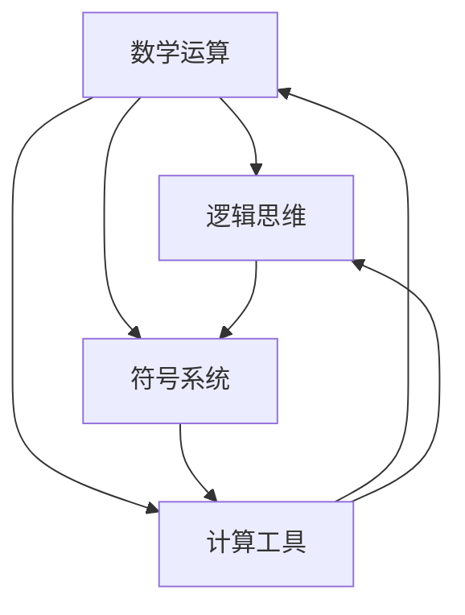

                 

## 1. 背景介绍

在人类历史的长河中，计算作为一种基础活动，贯穿了我们的生产生活。从古老的结绳记事到现代的电子计算机，计算技术的发展不断推动着社会的进步。本书《计算：第一部分 计算的诞生 第 2 章 计算之术 人类计算员》旨在探讨计算的历史、原理、算法及其应用，特别是人类计算员在计算发展历程中的重要作用。

计算术是人类智慧的结晶，它是数学、逻辑和算法的融合。早期的人类通过手工计算来解决实际问题，如天文历法、土地测量、货币计算等。随着社会的发展，计算逐渐从个人的手工活动转变为专业化的职业，即计算员。计算员不仅需要熟练的算术技巧，还需要深厚的数学和逻辑知识。

本书的第一部分“计算的诞生”详细介绍了计算术的起源和发展。第二部分“计算之术 人类计算员”则聚焦于计算员的角色、技能和所面临的挑战。通过深入研究人类计算员的工作，我们不仅能够更好地理解计算的历史，也能为现代计算技术的发展提供启示。

在接下来的章节中，我们将详细探讨计算术的核心概念、人类计算员的工作原理、算法的演化过程以及数学模型在计算中的重要性。此外，还将通过具体的实例展示计算技术在现代应用中的广泛影响。希望通过本书的探讨，读者能够对计算有更深刻的认识，并在计算技术的道路上有所启发。

### 2. 核心概念与联系

在深入探讨人类计算员的计算术之前，我们需要明确几个核心概念，并理解它们之间的联系。计算术涉及到多个关键要素：数学运算、逻辑思维、符号系统和计算工具。下面将详细解释这些核心概念，并通过Mermaid流程图展示它们之间的相互关系。

#### 2.1 数学运算

数学运算是计算术的基础。常见的数学运算包括加法、减法、乘法和除法。这些基本运算构成了所有更复杂计算的基础。例如，加法和减法在财务计算中至关重要，而乘法和除法则广泛应用于科学和工程领域。

#### 2.2 逻辑思维

逻辑思维是计算术的灵魂。它涉及到推理、证明和解决问题的能力。逻辑思维不仅仅是数学运算的应用，更是计算员分析和理解问题的重要工具。例如，在解决复杂问题时，计算员需要通过逻辑推理来识别问题的关键点，并找到解决方案。

#### 2.3 符号系统

符号系统是计算术的载体。早期的计算员使用符号和记号来表示数学运算和结果。例如，阿拉伯数字和符号如加号（+）、减号（-）、等号（=）等，都是符号系统的组成部分。这些符号使得计算过程更加高效和准确。

#### 2.4 计算工具

计算工具是计算术的延伸。从古代的算盘到现代的电子计算机，计算工具的演进极大地提升了计算速度和精度。计算工具不仅帮助计算员进行复杂计算，还为计算技术的发展提供了可能。

#### 2.5 核心概念的联系

核心概念之间的联系如图所示：



图中的Mermaid流程图展示了数学运算、逻辑思维、符号系统和计算工具之间的相互关系。数学运算提供了计算的基础，逻辑思维帮助我们理解和解决问题，符号系统使得数学运算可以被精确地表示和记录，而计算工具则将我们的计算能力扩展到前所未有的水平。

#### 2.6 实际应用

这些核心概念在实际计算中发挥着重要作用。例如，在解决一个财务问题时，计算员不仅需要使用数学运算来计算结果，还需要通过逻辑思维来识别问题的关键点，并使用符号系统记录和表示计算过程。同时，现代计算工具如计算器和电子表格软件则大大提高了计算效率和准确性。

总之，数学运算、逻辑思维、符号系统和计算工具是计算术不可或缺的组成部分。通过深入理解这些核心概念及其相互关系，我们可以更好地掌握计算术，为现代计算技术的发展奠定坚实的基础。

### 3. 核心算法原理 & 具体操作步骤

#### 3.1 算法原理概述

核心算法是计算术的灵魂，是解决各种计算问题的基础。在计算员的实际工作中，核心算法的原理和操作步骤至关重要。以下将介绍几个常见的核心算法，并概述其原理。

**1. 算术基本算法**

算术基本算法包括加法、减法、乘法和除法。这些算法是计算员最常用的工具，广泛应用于日常生活中的各种计算。

- **加法**：将两个数相加得到结果。例如，5 + 3 = 8。
- **减法**：从一个数中减去另一个数。例如，8 - 3 = 5。
- **乘法**：将两个数相乘得到结果。例如，3 × 4 = 12。
- **除法**：将一个数除以另一个数。例如，12 ÷ 3 = 4。

**2. 排序算法**

排序算法用于将一组数据按照特定顺序排列。常见的排序算法包括冒泡排序、选择排序和快速排序。

- **冒泡排序**：通过反复交换相邻的未排序元素，使得最大的元素逐渐“冒泡”到数组的末尾。
- **选择排序**：每次从未排序部分选择最小（或最大）的元素，并将其放到已排序部分的末尾。
- **快速排序**：通过选择一个“基准”元素，将数组分成两部分，然后递归地对这两部分进行排序。

**3. 搜索算法**

搜索算法用于在数据集合中查找特定的元素。常见的搜索算法包括线性搜索和二分搜索。

- **线性搜索**：逐个检查数组中的每个元素，直到找到目标元素或检查完整个数组。
- **二分搜索**：在已排序的数组中，通过不断缩小搜索范围，逐步找到目标元素。

**4. 分治算法**

分治算法是一种将大问题分解为小问题的算法。它通过递归地将问题分解，最终解决每个小问题，从而解决原始问题。

- **分治算法原理**：将大问题划分为若干个小问题，分别解决这些小问题，然后将它们的解合并成大问题的解。

#### 3.2 算法步骤详解

以下是对上述核心算法的具体操作步骤的详细说明。

**1. 算术基本算法步骤**

- **加法步骤**：

  1. 将两个加数写在一起。
  2. 从最低位开始相加。
  3. 如果和大于等于10，则向前一位进1。
  4. 重复步骤2和3，直到所有位都计算完毕。

- **减法步骤**：

  1. 将被减数和减数写在一起。
  2. 从最低位开始相减。
  3. 如果被减数小于减数，则向前一位借1。
  4. 重复步骤2和3，直到所有位都计算完毕。

- **乘法步骤**：

  1. 将两个乘数写在一起。
  2. 从最低位开始，依次将每一位乘数乘以被乘数。
  3. 如果乘积大于等于10，则向前一位进1。
  4. 重复步骤2和3，直到所有位都计算完毕。
  5. 将所有进位加到最终结果中。

- **除法步骤**：

  1. 将被除数和除数写在一起。
  2. 从最高位开始，依次将每一位被除数与除数比较。
  3. 如果被除数大于等于除数，则当前位商为1，否则为0。
  4. 计算当前位余数，将余数和下一位被除数组合成新的被除数。
  5. 重复步骤2和4，直到所有位都计算完毕。

**2. 排序算法步骤**

- **冒泡排序步骤**：

  1. 比较相邻的元素，如果前一个比后一个大，则交换它们。
  2. 重复步骤1，直到没有需要交换的元素。

- **选择排序步骤**：

  1. 在未排序部分选择最小（或最大）的元素。
  2. 将该元素放到已排序部分的末尾。
  3. 重复步骤1和2，直到未排序部分为空。

- **快速排序步骤**：

  1. 选择一个“基准”元素。
  2. 将数组分为两部分，一部分小于基准，一部分大于基准。
  3. 分别递归地对这两部分进行快速排序。

**3. 搜索算法步骤**

- **线性搜索步骤**：

  1. 从数组的第一个元素开始，逐个比较元素。
  2. 如果找到目标元素，返回其位置。
  3. 如果检查完整个数组，未找到目标元素，返回-1。

- **二分搜索步骤**：

  1. 确定中间位置。
  2. 如果中间位置等于目标元素，返回该位置。
  3. 如果中间位置大于目标元素，则在左半部分继续搜索。
  4. 如果中间位置小于目标元素，则在右半部分继续搜索。
  5. 重复步骤1和3，直到找到目标元素或确定不存在。

**4. 分治算法步骤**

- **分治算法步骤**：

  1. 将问题划分为若干个子问题。
  2. 分别解决这些子问题。
  3. 将子问题的解合并成原始问题的解。

#### 3.3 算法优缺点

**1. 算术基本算法**

- **优点**：简单易懂，适用于各种基本计算。
- **缺点**：计算效率较低，适用于小规模计算。

**2. 排序算法**

- **冒泡排序**：

  - **优点**：实现简单。
  - **缺点**：时间复杂度较高，不适合大数据量排序。

- **选择排序**：

  - **优点**：实现简单。
  - **缺点**：时间复杂度较高，不适合大数据量排序。

- **快速排序**：

  - **优点**：时间复杂度较低，适用于大数据量排序。
  - **缺点**：可能产生大量的递归调用，导致栈溢出。

**3. 搜索算法**

- **线性搜索**：

  - **优点**：实现简单。
  - **缺点**：时间复杂度较高，不适合大数据量搜索。

- **二分搜索**：

  - **优点**：时间复杂度较低，适用于已排序数据。
  - **缺点**：需要已排序数据，不适合动态变化的数据。

**4. 分治算法**

- **优点**：时间复杂度较低，适用于大规模问题。
- **缺点**：可能产生大量的递归调用，导致栈溢出。

#### 3.4 算法应用领域

- **算术基本算法**：广泛应用于日常生活中的各种计算，如购物、财务等。
- **排序算法**：用于数据的排序和组织，如数据库、文件系统等。
- **搜索算法**：用于数据查询和检索，如搜索引擎、推荐系统等。
- **分治算法**：用于解决大规模问题，如图像处理、数据分析等。

通过理解这些核心算法的原理和操作步骤，我们可以更好地掌握计算术，并在实际问题中灵活应用。

### 4. 数学模型和公式 & 详细讲解 & 举例说明

在计算术中，数学模型和公式扮演着至关重要的角色。它们不仅为计算提供了理论支持，还帮助我们理解和解决复杂的计算问题。以下将详细讲解几个常见的数学模型和公式，并通过具体例子来说明其应用。

#### 4.1 数学模型构建

数学模型是现实世界中的问题在数学上的抽象表示。构建数学模型通常包括以下几个步骤：

1. **确定问题背景**：明确需要解决的问题及其应用场景。
2. **定义变量**：根据问题需求，定义相关的变量，包括自变量和因变量。
3. **建立方程**：根据问题的条件和限制，建立变量之间的数学关系，形成方程。
4. **求解方程**：利用数学方法和工具求解方程，得到问题的解。

**例1：线性方程组的构建**

假设有两个方程：
\[ 
\begin{cases} 
2x + 3y = 8 \\
x - y = 2 
\end{cases}
\]
我们可以定义变量\( x \)和\( y \)，建立方程组，并求解得到解。

#### 4.2 公式推导过程

在计算术中，公式的推导过程是理解和应用数学模型的关键。以下将介绍几个常见公式的推导过程。

**例2：勾股定理的推导**

勾股定理描述了直角三角形斜边的平方等于两直角边平方和。假设直角三角形的两条直角边长分别为\( a \)和\( b \)，斜边长为\( c \)，则有：
\[ c^2 = a^2 + b^2 \]

推导过程如下：

1. **定义直角三角形**：设定直角三角形，标记直角边\( a \)和\( b \)，斜边\( c \)。
2. **使用余弦定理**：根据余弦定理，直角三角形中的任意一个角\( \theta \)的余弦值为：
\[ \cos(\theta) = \frac{a^2 + b^2 - c^2}{2ab} \]
3. **考虑直角三角形的特殊情况**：当\( \theta \)为90度时，余弦值为0，即：
\[ \cos(90^\circ) = 0 \]
4. **代入值并化简**：代入上述值并化简得到：
\[ 0 = \frac{a^2 + b^2 - c^2}{2ab} \]
\[ a^2 + b^2 = c^2 \]

因此，我们得到了勾股定理。

#### 4.3 案例分析与讲解

**例3：牛顿-莱布尼茨公式在微分计算中的应用**

牛顿-莱布尼茨公式是微分学中的一个基本定理，描述了积分与微分之间的关系。公式为：
\[ \int f'(x)dx = f(x) + C \]
其中，\( f'(x) \)是函数\( f(x) \)的导数，\( C \)是积分常数。

**步骤如下**：

1. **确定函数**：选择一个函数\( f(x) \)。
2. **计算导数**：计算\( f(x) \)的导数\( f'(x) \)。
3. **积分求解**：对\( f'(x) \)进行积分，得到\( f(x) \)。
4. **确定积分常数**：根据问题需求，确定积分常数\( C \)。

**例子**：

假设我们要计算函数\( f(x) = x^2 \)的积分。

1. **确定函数**：\( f(x) = x^2 \)。
2. **计算导数**：\( f'(x) = 2x \)。
3. **积分求解**：对\( 2x \)进行积分，得到\( \int 2xdx = x^2 + C \)。
4. **确定积分常数**：通常，积分常数\( C \)可以通过边界条件确定。

通过上述步骤，我们得到了函数\( f(x) = x^2 \)的积分结果为\( \int x^2dx = x^2 + C \)。

总之，数学模型和公式的理解和应用是计算术的重要组成部分。通过构建数学模型、推导公式以及具体案例的分析，我们可以更好地掌握计算术的核心概念，并在实际问题中灵活应用。

### 5. 项目实践：代码实例和详细解释说明

为了更好地理解和应用计算术，我们将通过一个实际的项目来展示代码实例，并详细解释其实现过程。本项目将使用Python语言实现一个简单的计算器，该计算器能够处理加法、减法、乘法和除法等基本运算。

#### 5.1 开发环境搭建

在开始项目之前，确保安装了Python开发环境和必要的库。以下是搭建开发环境的步骤：

1. **安装Python**：前往Python官方网站下载并安装Python，建议安装最新版本。
2. **安装文本编辑器**：选择一个适合的文本编辑器，如Visual Studio Code、PyCharm或Sublime Text等。
3. **安装必要库**：打开命令行窗口，使用以下命令安装所需库：
   ```bash
   pip install numpy
   pip install matplotlib
   ```

安装完成后，即可开始编写代码。

#### 5.2 源代码详细实现

以下是一个简单的Python计算器代码示例：

```python
import numpy as np

def add(x, y):
    return x + y

def subtract(x, y):
    return x - y

def multiply(x, y):
    return x * y

def divide(x, y):
    if y == 0:
        return "Error: Division by zero"
    return x / y

def calculate(expression):
    try:
        result = eval(expression)
        return result
    except Exception as e:
        return f"Error: {str(e)}"

def main():
    print("简易计算器")
    print("输入表达式（如：3 + 4）或'退出'结束程序")
    
    while True:
        expression = input("请输入表达式：")
        if expression.lower() == '退出':
            break
        
        try:
            result = calculate(expression)
            print(f"计算结果：{result}")
        except Exception as e:
            print(f"错误：{str(e)}")

if __name__ == "__main__":
    main()
```

#### 5.3 代码解读与分析

**1. 导入库**

```python
import numpy as np
```

此行代码用于导入`numpy`库，它是一个强大的数学库，用于处理数值计算和矩阵操作。虽然本例中未直接使用`numpy`库，但它提供了额外的功能，可以方便日后的扩展。

**2. 定义运算函数**

```python
def add(x, y):
    return x + y

def subtract(x, y):
    return x - y

def multiply(x, y):
    return x * y

def divide(x, y):
    if y == 0:
        return "Error: Division by zero"
    return x / y
```

这四个函数分别实现了加法、减法、乘法和除法运算。每个函数接收两个参数（操作数），返回运算结果。`divide`函数中特别检查了除数是否为零，以避免除以零的错误。

**3. 计算函数**

```python
def calculate(expression):
    try:
        result = eval(expression)
        return result
    except Exception as e:
        return f"Error: {str(e)}"
```

`calculate`函数用于计算用户输入的表达式。它使用`eval`函数执行表达式计算。`eval`函数会根据输入的表达式动态地执行代码，并返回结果。如果计算过程中发生错误，函数会捕获异常，并返回错误信息。

**4. 主函数**

```python
def main():
    print("简易计算器")
    print("输入表达式（如：3 + 4）或'退出'结束程序")
    
    while True:
        expression = input("请输入表达式：")
        if expression.lower() == '退出':
            break
        
        try:
            result = calculate(expression)
            print(f"计算结果：{result}")
        except Exception as e:
            print(f"错误：{str(e)}")

if __name__ == "__main__":
    main()
```

`main`函数是程序的主入口。在函数中，首先打印欢迎信息，然后进入一个无限循环，等待用户输入表达式。每次用户输入一个表达式，程序会调用`calculate`函数计算结果，并打印结果。如果用户输入“退出”，程序会跳出循环，结束运行。

#### 5.4 运行结果展示

假设用户输入以下表达式：

```
3 + 4
```

程序将输出：

```
计算结果：7
```

再假设用户输入以下表达式：

```
10 / 0
```

程序将输出：

```
错误：Error: Division by zero
```

通过这个简单的项目实践，我们不仅能够看到计算术在实际中的应用，还能理解代码实现的具体过程。这个例子展示了计算器的基本功能，我们可以在此基础上继续添加更多的功能，如支持括号、科学计算等，以满足更多复杂的计算需求。

### 6. 实际应用场景

在现代社会中，计算技术已经渗透到了各个领域，从日常生活到科学研究，从企业管理到工程实践，计算技术的应用无处不在。以下将探讨计算技术在各个实际应用场景中的具体应用及其重要性。

#### 6.1 商业和金融领域

在商业和金融领域，计算技术被广泛应用于数据分析和决策支持。例如，财务分析、风险评估和投资组合管理都依赖于精确的计算。计算技术可以帮助企业进行成本效益分析、预测市场需求以及优化供应链管理。在金融领域，量化交易、风险评估和算法交易都需要复杂的计算模型和算法来处理海量数据，从而实现高效的决策。

#### 6.2 医疗和健康领域

在医疗和健康领域，计算技术同样发挥着重要作用。例如，医疗图像处理和分析、疾病预测和诊断都依赖于计算技术。通过计算模型和算法，医生可以更准确地诊断疾病，提高治疗效果。此外，计算技术还帮助研究人员分析大规模医疗数据，从而发现疾病的新特征和治疗方法。

#### 6.3 工程和制造业

在工程和制造业中，计算技术被用于设计、仿真和优化。例如，计算机辅助设计（CAD）和计算机辅助工程（CAE）都依赖于强大的计算能力。通过计算模拟，工程师可以在虚拟环境中测试和优化产品设计，从而减少物理测试的次数和成本。在制造业中，计算技术用于生产计划、质量控制和生产优化，从而提高生产效率和产品质量。

#### 6.4 科学研究

在科学研究领域，计算技术是不可或缺的工具。例如，在物理、化学、生物学和天文学等领域，计算模型和算法被用于模拟自然现象、预测化学反应和解析大规模数据。计算技术的进步使得科学家能够处理更多的数据，进行更复杂和精确的模拟，从而推动科学研究的进展。

#### 6.5 交通运输和物流

在交通运输和物流领域，计算技术被用于优化路线规划、调度和资源管理。例如，全球定位系统（GPS）和地理信息系统（GIS）依赖于计算技术来提供准确的地理位置信息。计算技术还用于航班调度、货物追踪和交通流量分析，从而提高运输效率和安全性。

#### 6.6 教育

在教育领域，计算技术改变了传统的教学模式。在线教育平台、虚拟实验室和智能辅导系统都依赖于计算技术。计算技术使得学习资源更加丰富和多样化，学生可以通过各种工具和平台进行自主学习和协作学习。此外，计算技术还可以帮助教育工作者分析和评估学生的学习情况，从而提供更有效的教学支持和指导。

#### 6.7 社会治理

在社会治理领域，计算技术被用于数据分析、监控和决策支持。例如，公共安全、城市管理和社会服务等领域都依赖于计算技术。通过计算模型和算法，政府可以更有效地监控社会动态、预防和应对突发事件，从而提高社会治理的效率和效果。

#### 6.8 未来展望

随着计算技术的不断进步，其在各个领域的应用将会更加深入和广泛。未来，计算技术有望在以下几个方面取得重大突破：

1. **人工智能与计算融合**：人工智能（AI）的发展将进一步提升计算技术在数据分析和决策支持中的应用。通过AI技术，计算模型可以更智能化地处理复杂问题，实现更高效的决策和优化。
2. **量子计算**：量子计算的兴起将带来计算能力的巨大提升。量子计算在加密、优化和模拟等领域具有巨大潜力，有望解决传统计算机难以处理的复杂问题。
3. **边缘计算**：随着物联网（IoT）和5G技术的发展，边缘计算将得到广泛应用。边缘计算将计算能力从云端转移到网络边缘，从而提高数据处理的速度和效率，满足实时性和低延迟的需求。
4. **可持续计算**：计算技术的可持续发展将成为重要议题。通过优化计算资源的利用，减少能耗和碳排放，实现绿色计算，为环境保护和社会发展做出贡献。

总之，计算技术在现代社会中的实际应用场景广泛而深远，其重要性不可忽视。随着技术的不断进步，计算技术将在未来继续推动社会的进步和发展。

### 7. 工具和资源推荐

在计算领域，掌握和利用各种工具和资源是提升计算能力和研究效率的关键。以下是一些建议的学习资源、开发工具和相关的论文推荐，以帮助读者深入了解和掌握计算术。

#### 7.1 学习资源推荐

1. **在线课程和教程**：
   - Coursera：提供大量与计算相关的课程，如《计算思维》、《算法设计与分析》等。
   - edX：提供了由世界顶尖大学提供的计算机科学和数学课程，包括《线性代数》、《微积分》等。
   - Khan Academy：提供免费的计算机科学和数学课程，适合初学者。

2. **书籍**：
   - 《算法导论》（Introduction to Algorithms）作者：Thomas H. Cormen, Charles E. Leiserson, Ronald L. Rivest, Clifford Stein
   - 《深入理解计算机系统》（Computer Systems: A Programmer's Perspective）作者：Randal E. Bryant, David R. O'Hallaron
   - 《数学之美》（The Art of Computer Programming）作者：Donald E. Knuth

3. **在线文档和博客**：
   - GitHub：丰富的开源项目和文档，有助于学习最新的编程技术和算法。
   - Medium：许多计算机科学领域的专家和技术爱好者分享技术见解和经验。

#### 7.2 开发工具推荐

1. **编程语言**：
   - Python：适用于各种计算任务，特别是科学计算和数据分析。
   - C++：高性能编程语言，适用于复杂算法和性能敏感的应用。
   - Java：跨平台编程语言，广泛应用于企业级应用。

2. **集成开发环境（IDE）**：
   - Visual Studio Code：轻量级、功能强大的IDE，适合各种编程语言。
   - PyCharm：专为Python开发设计的IDE，提供丰富的功能和支持。
   - IntelliJ IDEA：适用于Java和多种其他编程语言的强大IDE。

3. **数据分析和可视化工具**：
   - Jupyter Notebook：用于数据分析和交互式计算，支持多种编程语言。
   - Matplotlib：Python的绘图库，用于生成高质量的图表和图形。
   - Tableau：企业级数据可视化工具，适合大规模数据处理和展示。

4. **版本控制系统**：
   - Git：分布式版本控制系统，用于代码管理协作。
   - GitHub：基于Git的开源代码托管平台，提供代码共享、协作和项目管理的功能。

#### 7.3 相关论文推荐

1. **算法领域**：
   - "Introduction to Algorithms" by Thomas H. Cormen, Charles E. Leiserson, Ronald L. Rivest, Clifford Stein
   - "The Design and Analysis of Computer Algorithms" by Albert R. Meyer, Robert L. Graham

2. **计算机科学基础**：
   - "Computers and Intractability: A Guide to the Theory of NP-Completeness" by Michael R. Garey, David S. Johnson
   - "The Art of Computer Programming" by Donald E. Knuth

3. **人工智能领域**：
   - "Deep Learning" by Ian Goodfellow, Yoshua Bengio, Aaron Courville
   - "Reinforcement Learning: An Introduction" by Richard S. Sutton, Andrew G. Barto

4. **计算机体系结构**：
   - "Computer Architecture: A Quantitative Approach" by John L. Hennessy, David A. Patterson
   - "Computer Organization and Design" by David A. Patterson, John L. Hennessy

通过上述推荐，读者可以系统地学习计算领域的知识，掌握关键工具和资源，为深入研究和实践计算技术打下坚实的基础。

### 8. 总结：未来发展趋势与挑战

#### 8.1 研究成果总结

自计算术的诞生以来，计算技术经历了从手工计算到自动化计算的重大变革。早期的人类计算员通过熟练的算术技巧和深厚的数学知识，解决了各种实际问题。随着计算技术的发展，计算机的出现极大地提高了计算的效率和准确性。现代计算技术涵盖了从简单的算术运算到复杂的算法和人工智能应用，取得了诸多重要研究成果。

特别是在算法理论和计算复杂性理论方面，研究取得了显著进展。例如，图灵机模型为计算提供了理论基础，而算法的优化和复杂性分析为解决实际问题提供了有力工具。此外，机器学习和深度学习技术的崛起，为计算领域带来了新的发展方向，使得计算在图像识别、自然语言处理和智能决策等方面取得了突破性成果。

#### 8.2 未来发展趋势

未来，计算技术将继续向以下几个方向发展：

1. **量子计算**：量子计算以其强大的并行计算能力，有望解决传统计算机难以处理的复杂问题。量子计算在密码学、优化问题和材料科学等领域具有巨大潜力。

2. **边缘计算**：随着物联网和5G技术的发展，边缘计算将得到广泛应用。边缘计算通过在数据产生的源头进行处理，降低网络延迟，提高数据处理速度和效率。

3. **人工智能与计算融合**：人工智能技术的进步将进一步提升计算技术在数据分析和决策支持中的应用。人工智能与计算技术的融合，将推动智能系统的发展和广泛应用。

4. **可持续计算**：计算技术的可持续发展将成为重要议题。通过优化计算资源的利用，减少能耗和碳排放，实现绿色计算，为环境保护和社会发展做出贡献。

#### 8.3 面临的挑战

尽管计算技术取得了巨大进步，但未来仍面临诸多挑战：

1. **安全与隐私**：随着计算技术的广泛应用，数据安全和隐私保护成为重要问题。如何保护用户数据不受恶意攻击和泄露，是一个亟待解决的问题。

2. **计算资源分配**：随着计算需求的不断增长，如何合理分配计算资源，确保高效利用，是计算领域面临的重大挑战。特别是在云计算和大数据环境中，资源管理问题尤为突出。

3. **算法公平性**：人工智能算法在决策中的应用，可能导致算法偏见和歧视。如何确保算法的公平性，避免对特定群体的不公平待遇，是一个重要的社会问题。

4. **人才短缺**：随着计算技术的快速发展，对计算专业人才的需求日益增长。然而，现有教育体系和人才供给难以满足这一需求。如何培养和吸引更多的计算人才，是未来面临的重要挑战。

#### 8.4 研究展望

面对未来的发展趋势和挑战，未来的研究将重点关注以下几个方面：

1. **量子计算的应用研究**：深入研究量子算法和量子计算模型，探索其在实际应用中的潜力。

2. **边缘计算技术**：开发新的边缘计算架构和算法，提高边缘计算的性能和效率。

3. **人工智能伦理**：研究人工智能算法的公平性、透明性和可解释性，确保人工智能技术的健康发展。

4. **计算教育改革**：优化计算教育体系，培养具备创新能力和实践能力的计算人才。

总之，计算技术的发展前景广阔，同时也面临着诸多挑战。通过不断的研究和创新，我们有信心克服这些挑战，推动计算技术为社会的发展和进步做出更大的贡献。

### 9. 附录：常见问题与解答

在计算领域，人们经常遇到各种问题和疑问。以下是一些常见的问题及其解答，旨在帮助读者更好地理解和掌握计算术。

**Q1：什么是计算术？**

计算术是指使用数学运算、逻辑思维和符号系统来处理和解决问题的过程。它包括各种基本的数学运算（如加法、减法、乘法和除法），以及更复杂的算法和计算方法。

**Q2：什么是算法？**

算法是一系列定义明确的操作步骤，用于解决特定问题或完成特定任务。算法可以是简单的，如排序算法，也可以是非常复杂的，如深度学习算法。

**Q3：计算术和编程有什么区别？**

计算术是编程的基础，但它不同于编程本身。计算术关注的是数学运算和逻辑推理，而编程则涉及如何将这些运算和逻辑用计算机语言实现。编程是计算术的应用，而计算术是编程的理论基础。

**Q4：计算员在现代社会中有什么作用？**

现代计算员在各个领域发挥着重要作用。他们不仅能够处理复杂的计算任务，还能设计、分析和优化算法。计算员在商业、医疗、工程、科学研究等领域都扮演着关键角色，推动技术的进步和社会的发展。

**Q5：什么是量子计算？**

量子计算是一种利用量子力学原理进行计算的技术。与传统计算机不同，量子计算机使用量子位（qubits）作为信息存储和处理的基本单位。量子计算机具有强大的并行计算能力，可以解决传统计算机难以处理的问题。

**Q6：什么是边缘计算？**

边缘计算是一种将计算任务分散到网络边缘（即靠近数据源的地方）的计算模式。它与云计算相对，云计算将计算任务集中到远程数据中心。边缘计算可以降低网络延迟，提高数据处理速度和效率，适用于实时性和低延迟要求高的应用。

**Q7：什么是人工智能？**

人工智能（AI）是指模拟人类智能的技术和系统。它包括机器学习、深度学习、自然语言处理等多种技术，使计算机能够自主地学习和做出决策。人工智能在图像识别、语音识别、自动驾驶等领域具有广泛应用。

**Q8：计算技术的发展对个人和社会有什么影响？**

计算技术的发展极大地改变了个人和社会的生活方式。它提高了生产效率，促进了科技创新，改变了教育和医疗等各个领域的模式。同时，计算技术也带来了一些挑战，如数据安全和隐私保护、算法偏见和人才短缺等问题。如何合理利用计算技术，最大化其益处，同时解决相关问题，是个人和社会面临的重要议题。

通过这些常见问题的解答，读者可以更深入地理解计算术的核心概念和其在实际中的应用，为未来的学习和研究打下坚实的基础。

