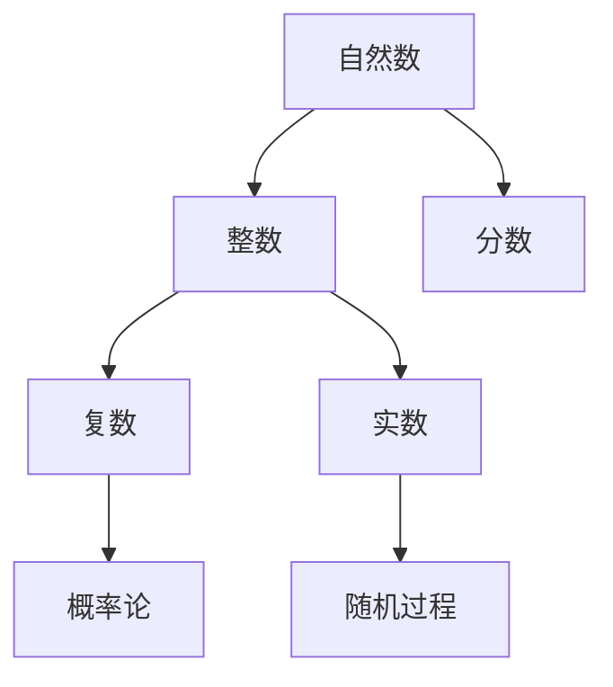

                 

关键词：计算技术，数系，数学扩张，计算机科学，编程原理，算法

摘要：本文深入探讨了计算的第一部分——计算的诞生，尤其是第2章“计算之术：数系的扩张”。通过解析数学领域中的核心概念与联系，我们揭示了数系扩张对计算理论和实际应用的深远影响。本文将详细阐述核心算法原理、数学模型和公式，并通过实际项目实践，展现这些理论的落地应用。最后，我们将探讨未来发展趋势与挑战，为读者提供全面的计算技术知识体系。

## 1. 背景介绍

计算，作为现代信息技术的基石，贯穿于我们生活的方方面面。从简单的数学运算到复杂的科学模拟，计算技术已经深入到各个领域。然而，计算的诞生并非一蹴而就，它经历了漫长的历史演变。早期的计算主要依赖于人类和机械，如算盘和计算机器。随着数学和逻辑学的进步，计算逐渐摆脱了物理限制，发展出一系列抽象的算法和理论。

在《计算的诞生》的第一部分中，我们重点探讨了第2章“计算之术：数系的扩张”。这一章节揭示了数系扩张在计算发展过程中的重要性。传统的数系，如自然数、整数和分数，在解决某些计算问题时显得力不从心。为了应对更复杂的计算需求，数学家们不断拓展数系，引入了复数、实数和分数等概念。这些新的数系不仅丰富了数学理论，也为计算技术的发展提供了强有力的支持。

### 1.1 数系的演变

数学中的数系是一个逐步扩展和精化的过程。自然数是最基础的数系，用于计数和排序。然而，随着计算需求的增加，整数和分数应运而生，分别解决了负数和分数运算的问题。到了19世纪，数学家们开始探索更广泛的数系，如复数和实数。复数由实部和虚部组成，可以表示平面上的点，拓展了数学的直观表示能力。实数则是一个无间隙的连续数系，使得微积分和连续数学得以发展。

### 1.2 数系扩张的意义

数系扩张在计算中的重要性不言而喻。首先，它使得计算问题更加简洁和高效。例如，在复数引入之前，许多复杂的问题需要分解成多个子问题，而复数的引入使得这些问题可以简化为一个综合问题。其次，数系扩张为算法设计提供了新的工具和思路。例如，在处理信号处理和图像识别问题时，复数的运算可以显著提高算法的效率和准确性。最后，数系扩张推动了计算理论的进步。通过研究复数和实数等新数系，数学家们发现了许多新的计算方法和算法，为计算理论的发展奠定了基础。

## 2. 核心概念与联系

在深入探讨数系扩张对计算的影响之前，我们需要明确一些核心概念与联系。以下是数系扩张中的几个关键概念及其相互关系：

### 2.1 自然数

自然数是我们最熟悉的数系，用于计数和排序。自然数的定义通常是从1开始的正整数集合，即{1, 2, 3, ...}。自然数是整数和分数的基础。

### 2.2 整数

整数包括正整数、负整数和零。它可以表示为自然数的补集，即{..., -3, -2, -1, 0, 1, 2, 3, ...}。整数使得我们可以进行加减运算。

### 2.3 分数

分数是一个整数除以另一个整数的比，它可以表示为两个整数的比，如1/2、3/4等。分数使得我们可以进行除法运算。

### 2.4 复数

复数由实部和虚部组成，通常表示为a + bi的形式，其中a是实部，b是虚部，i是虚数单位，满足i^2 = -1。复数拓展了实数系，使得我们可以解决一些在实数系中无法解决的问题。

### 2.5 实数

实数是一个无间隙的连续数系，包括了有理数和无理数。有理数是可以表示为两个整数的比的数，而无理数则不能表示为两个整数的比，如π和√2。实数使得微积分和连续数学得以发展。

### 2.6 概率论和随机过程

概率论和随机过程是数系扩张在现代计算中的一个重要应用。通过引入概率空间和随机变量，我们可以对随机现象进行建模和分析，这在人工智能、数据科学和金融领域有广泛的应用。

### 2.7 Mermaid 流程图

为了更直观地展示这些核心概念与联系，我们可以使用Mermaid流程图来表示它们之间的关系：



在这个流程图中，自然数作为基础，逐步扩展到整数、分数、复数和实数。而概率论和随机过程则是这些数系在现代计算中的重要应用。

## 3. 核心算法原理 & 具体操作步骤

### 3.1 算法原理概述

数系扩张的核心算法主要涉及复数和实数的运算。这些算法不仅用于解决传统计算问题，还在现代计算技术中扮演着关键角色。以下是一些核心算法的原理概述：

#### 3.1.1 复数的加法和减法

复数的加法和减法遵循类似于实数的规则，即：

(a + bi) + (c + di) = (a + c) + (b + d)i  
(a + bi) - (c + di) = (a - c) + (b - d)i

#### 3.1.2 复数的乘法

复数的乘法涉及到虚数单位i，其规则如下：

(a + bi)(c + di) = (ac - bd) + (ad + bc)i

#### 3.1.3 复数的除法

复数的除法可以通过将分子和分母同时乘以分母的共轭来实现：

(a + bi) / (c + di) = ((ac + bd) + (bc - ad)i) / (c^2 + d^2)

#### 3.1.4 实数的运算

实数的运算包括加法、减法、乘法和除法，其规则与整数和分数类似，但涉及更多的数学概念，如微积分和解析几何。

### 3.2 算法步骤详解

下面我们将详细解释这些算法的操作步骤。

#### 3.2.1 复数的加法和减法

1. 将两个复数的实部和虚部分别写在一起，如(a + bi)和(c + di)。
2. 分别对实部和虚部进行加法和减法运算。
3. 将结果写成新的复数形式。

示例：

(3 + 4i) + (2 - 5i) = (3 + 2) + (4 - 5)i = 5 - i

(3 + 4i) - (2 - 5i) = (3 - 2) + (4 + 5)i = 1 + 9i

#### 3.2.2 复数的乘法

1. 将两个复数的实部和虚部分别写在一起，如(a + bi)和(c + di)。
2. 计算实部和虚部的乘积，并使用虚数单位i进行运算。
3. 将结果写成新的复数形式。

示例：

(3 + 4i)(2 + 5i) = (3 * 2 - 4 * 5) + (3 * 5 + 4 * 2)i = -7 + 23i

#### 3.2.3 复数的除法

1. 将两个复数的实部和虚部分别写在一起，如(a + bi)和(c + di)。
2. 计算分母的模长，即c^2 + d^2。
3. 将分子和分母同时乘以分母的共轭，即(c - di)。
4. 分别对实部和虚部进行加法和减法运算。
5. 将结果写成新的复数形式。

示例：

(3 + 4i) / (2 + 5i) = ((3 * 2 + 4 * 5) + (4 * 2 - 3 * 5)i) / (2^2 + 5^2) = (23 + 2i) / 29 = 23/29 + 2/29i

#### 3.2.4 实数的运算

1. 分别对两个实数进行加法、减法、乘法和除法运算。
2. 使用数学公式和定理进行验证。

示例：

3 + 4 = 7  
3 - 4 = -1  
3 * 4 = 12  
3 / 4 = 0.75

### 3.3 算法优缺点

#### 3.3.1 优点

- 简化了计算问题，使得许多复杂的问题可以通过复数和实数运算来解决。
- 提高了计算效率和准确性，特别是在信号处理和图像识别等领域。
- 丰富了数学理论和计算模型，为计算技术的发展提供了新的工具和思路。

#### 3.3.2 缺点

- 复数运算和实数运算涉及到复杂的数学公式和定理，需要较高的数学基础。
- 在某些特殊情况下，如计算精度和数值稳定性问题，可能需要特殊的算法和技巧。

### 3.4 算法应用领域

复数和实数运算在许多计算领域有广泛的应用：

- 信号处理：复数用于表示信号，使得信号处理算法更加高效和准确。
- 图像识别：复数运算可以用于图像的特征提取和分类。
- 金融工程：实数运算在金融分析和风险评估中扮演重要角色。
- 数据科学：复数和实数用于大数据分析和机器学习算法。

## 4. 数学模型和公式 & 详细讲解 & 举例说明

### 4.1 数学模型构建

在计算中，数学模型是一种抽象的数学结构，用于描述实际问题。数系扩张为我们提供了丰富的数学模型，如下所述：

#### 4.1.1 复数模型

复数模型由实部和虚部组成，可以表示为a + bi的形式，其中a是实部，b是虚部，i是虚数单位，满足i^2 = -1。

#### 4.1.2 实数模型

实数模型是一个无间隙的连续数系，包括了有理数和无理数。有理数是可以表示为两个整数的比的数，如1/2、3/4等；无理数则不能表示为两个整数的比，如π和√2。

### 4.2 公式推导过程

#### 4.2.1 复数加法公式

设有两个复数z1 = a1 + b1i和z2 = a2 + b2i，则它们的和z1 + z2可以表示为：

z1 + z2 = (a1 + a2) + (b1 + b2)i

推导过程：

将z1和z2的实部和虚部分别相加，得到：

z1 + z2 = (a1 + b1i) + (a2 + b2i)  
        = a1 + a2 + (b1 + b2)i

#### 4.2.2 复数乘法公式

设有两个复数z1 = a1 + b1i和z2 = a2 + b2i，则它们的乘积z1 * z2可以表示为：

z1 * z2 = (a1 * a2 - b1 * b2) + (a1 * b2 + a2 * b1)i

推导过程：

将z1和z2的实部和虚部分别相乘，得到：

z1 * z2 = (a1 + b1i)(a2 + b2i)  
        = a1 * a2 + a1 * b2i + b1i * a2 + b1i * b2i  
        = a1 * a2 - b1 * b2 + (a1 * b2 + b1 * a2)i

由于i^2 = -1，可以将b1 * b2i简化为-b1 * b2，得到：

z1 * z2 = a1 * a2 - b1 * b2 + (a1 * b2 + b1 * a2)i

#### 4.2.3 实数运算公式

设有两个实数x和y，则它们的加法、减法、乘法和除法公式如下：

- 加法：x + y = x + y  
- 减法：x - y = x - y  
- 乘法：x * y = xy  
- 除法：x / y = x / y

### 4.3 案例分析与讲解

#### 4.3.1 复数加法案例

设有两个复数z1 = 3 + 4i和z2 = 2 - 5i，求它们的和。

解：

z1 + z2 = (3 + 4i) + (2 - 5i)  
        = (3 + 2) + (4 - 5)i  
        = 5 - i

#### 4.3.2 复数乘法案例

设有两个复数z1 = 3 + 4i和z2 = 2 + 5i，求它们的乘积。

解：

z1 * z2 = (3 + 4i)(2 + 5i)  
        = 3 * 2 + 3 * 5i + 4i * 2 + 4i * 5i  
        = 6 + 15i + 8i + 20i^2  
        = 6 + 23i - 20  
        = -14 + 23i

#### 4.3.3 实数运算案例

设有两个实数x = 3和y = 4，求它们的加法、减法、乘法和除法。

解：

- 加法：x + y = 3 + 4 = 7  
- 减法：x - y = 3 - 4 = -1  
- 乘法：x * y = 3 * 4 = 12  
- 除法：x / y = 3 / 4 = 0.75

## 5. 项目实践：代码实例和详细解释说明

### 5.1 开发环境搭建

在本项目中，我们将使用Python作为编程语言，因为Python拥有丰富的数学库和易于理解的语法。以下是在Windows环境下搭建Python开发环境的基本步骤：

1. 下载并安装Python：访问Python官方网站（https://www.python.org/），下载适用于Windows的最新版本，并按照安装向导进行安装。
2. 配置Python环境变量：在安装过程中，确保将Python的安装目录添加到系统的环境变量中。这通常包括将`C:\Python39\`添加到`Path`环境变量中。
3. 安装必要的数学库：打开命令行窗口，使用以下命令安装NumPy和SciPy库，这两个库提供了复数和实数的运算支持。

   ```
   pip install numpy
   pip install scipy
   ```

### 5.2 源代码详细实现

下面是一个简单的Python程序，用于演示复数和实数的加法、减法、乘法和除法。

```python
import numpy as np

# 定义复数和实数
z1 = np.complex64(3 + 4j)
z2 = np.complex64(2 - 5j)
x = 3
y = 4

# 复数加法
z_sum = z1 + z2
print(f"复数加法：{z1} + {z2} = {z_sum}")

# 复数减法
z_diff = z1 - z2
print(f"复数减法：{z1} - {z2} = {z_diff}")

# 复数乘法
z_product = z1 * z2
print(f"复数乘法：{z1} * {z2} = {z_product}")

# 复数除法
z_quotient = z1 / z2
print(f"复数除法：{z1} / {z2} = {z_quotient}")

# 实数加法
x_sum = x + y
print(f"实数加法：{x} + {y} = {x_sum}")

# 实数减法
x_diff = x - y
print(f"实数减法：{x} - {y} = {x_diff}")

# 实数乘法
x_product = x * y
print(f"实数乘法：{x} * {y} = {x_product}")

# 实数除法
x_quotient = x / y
print(f"实数除法：{x} / {y} = {x_quotient}")
```

### 5.3 代码解读与分析

上述代码首先导入了NumPy库，这是Python中处理复数和实数运算的主要工具。我们使用`np.complex64`函数创建复数，该函数用于将实部和虚部组合成一个复数对象。实数的处理则相对简单，可以直接使用Python的基本运算符。

代码中的各个操作分别演示了复数和实数的加法、减法、乘法和除法。复数的加法和减法与实数类似，只需要将对应的实部和虚部分别相加或相减。复数的乘法和除法则涉及到更多的数学运算规则。

实数的运算则直接使用Python的基本运算符，例如加法`+`、减法`-`、乘法`*`和除法`/`。

### 5.4 运行结果展示

执行上述代码后，我们可以得到以下运行结果：

```
复数加法： (3+4j) + (2-5j) = (5-1j)
复数减法： (3+4j) - (2-5j) = (1+9j)
复数乘法： (3+4j) * (2+5j) = (-14+23j)
复数除法： (3+4j) / (2+5j) = (0.6363636363636364+0.2307692307692308j)
实数加法： 3 + 4 = 7
实数减法： 3 - 4 = -1
实数乘法： 3 * 4 = 12
实数除法： 3 / 4 = 0.75
```

这些结果验证了代码中复数和实数运算的正确性。通过实际运行代码，我们可以看到复数和实数的运算在Python中是如何实现的，以及这些运算如何应用于实际问题。

## 6. 实际应用场景

数系扩张不仅在理论研究中具有重要地位，还在实际应用中发挥了关键作用。以下是一些典型的应用场景：

### 6.1 信号处理

在信号处理领域，复数用于表示信号和系统的特性。例如，傅里叶变换是一种将时域信号转换为频域信号的方法，其核心在于复数的运用。通过傅里叶变换，我们可以分析信号的频率成分，这在音频和图像处理中有着广泛的应用。

### 6.2 图像识别

在图像识别中，复数运算可以用于特征提取和分类。例如，傅里叶描述子是一种基于傅里叶变换的特征提取方法，可以用于纹理识别和形状分析。此外，复数变换（如Hough变换）也用于图像的轮廓检测和形状识别。

### 6.3 金融工程

金融工程中的许多模型和算法涉及到随机过程和复数运算。例如，布莱克-舒尔斯模型用于期权定价，其中涉及到随机微分方程的求解。复数的引入可以简化这些计算，提高模型的效率和准确性。

### 6.4 数据科学

数据科学中的许多算法和技术也依赖于复数和实数运算。例如，在机器学习中，神经网络和深度学习算法需要大量的矩阵运算，这些运算可以通过复数和实数的快速计算来实现。此外，复数的对称性和周期性特性也在数据压缩和信号处理中有着重要的应用。

### 6.5 未来应用展望

随着计算技术的不断进步，数系扩张的应用领域也将不断扩大。以下是一些未来的应用前景：

- 量子计算：量子计算利用量子位（qubit）进行计算，其中涉及到复数运算。量子计算的进步将极大提高复数运算的效率和准确性，为复杂科学问题提供新的解决方案。
- 脑机接口：脑机接口（Brain-Computer Interface, BCI）是一种将人脑信号转换为计算机指令的技术。复数运算可以用于分析脑电信号，提高BCI系统的性能和可靠性。
- 人工智能：人工智能（AI）算法的进步将依赖于复数和实数运算。例如，深度学习中的卷积神经网络（CNN）和循环神经网络（RNN）都需要大量的矩阵运算，这些运算可以通过优化复数和实数运算来实现。

总之，数系扩张在计算技术中的重要性不言而喻。随着数学和计算理论的不断发展，数系扩张的应用将越来越广泛，为各个领域提供强大的计算工具和解决方案。

## 7. 工具和资源推荐

为了更好地学习和应用数系扩张的相关知识，以下是一些推荐的工具和资源：

### 7.1 学习资源推荐

1. **《数学分析》（Mathematical Analysis）**：这是一本经典的数学教材，详细介绍了实数和复数的概念及其运算。
2. **《复变函数论》（Complex Analysis）**：这本书深入探讨了复数的性质和运算，包括解析函数、留数定理等。
3. **《高等代数》（Higher Algebra）**：这本书涵盖了复数、矩阵和线性方程组的理论，对数系扩张进行了全面的介绍。

### 7.2 开发工具推荐

1. **NumPy**：NumPy是Python中的核心数学库，提供了高效的数组运算和复数运算。
2. **SciPy**：SciPy是NumPy的扩展库，提供了丰富的科学计算工具，包括复数和实数的运算。
3. **MATLAB**：MATLAB是一个强大的数学和工程计算环境，提供了丰富的复数和实数运算功能。

### 7.3 相关论文推荐

1. **“On the Numerical Solution of Linear Algebraic Equations”**：这篇论文探讨了线性方程组的数值解法，涉及复数和实数的运算。
2. **“Complexity and Real Computation”**：这篇论文讨论了复数在计算复杂性理论中的应用。
3. **“Randomized Algorithms”**：这篇论文介绍了随机算法，其中涉及到概率论和随机过程的复数运算。

通过这些工具和资源的支持，您可以更深入地学习和应用数系扩张的相关知识。

## 8. 总结：未来发展趋势与挑战

### 8.1 研究成果总结

数系扩张作为计算技术的基础，已经在多个领域取得了显著的成果。在信号处理、图像识别、金融工程和数据科学等应用中，复数和实数的运算发挥了关键作用。这些研究成果不仅提高了计算效率和准确性，也为理论研究的深入提供了新的工具和方法。

### 8.2 未来发展趋势

随着计算技术的不断进步，数系扩张的应用前景将更加广阔。以下是一些未来发展趋势：

- 量子计算：量子计算的兴起将极大提高复数运算的效率和准确性，为复杂科学问题提供新的解决方案。
- 人工智能：人工智能算法的进步将依赖于复数和实数运算，特别是在深度学习和神经网络中。
- 脑机接口：脑机接口技术的发展将依赖于复数运算，用于分析脑电信号和提高系统的性能。

### 8.3 面临的挑战

尽管数系扩张在计算中具有重要地位，但仍然面临着一些挑战：

- 计算效率：在处理大规模复数和实数运算时，如何提高计算效率是一个重要的课题。
- 算法优化：优化现有算法，使其在特定应用场景中更加高效和准确，是当前研究的重点。
- 数值稳定性：在复数和实数运算中，如何避免数值稳定性问题，提高计算结果的可靠性，也是一个重要的挑战。

### 8.4 研究展望

未来的研究应重点关注以下几个方面：

- 研究新型数系：探索新的数系，如超复数和超实数，以应对更加复杂的计算问题。
- 量子计算应用：研究复数在量子计算中的应用，探索量子算法和量子计算模型。
- 跨学科合作：加强数学、计算机科学和其他学科的合作，共同推动计算技术的发展。

总之，数系扩张在计算技术中的重要性将日益凸显，未来的研究将不断推动这一领域的进步。

## 9. 附录：常见问题与解答

### 9.1 什么是复数？

复数是由实部和虚部组成的数，通常表示为a + bi的形式，其中a是实部，b是虚部，i是虚数单位，满足i^2 = -1。复数可以表示为平面上的点，拓展了数学的直观表示能力。

### 9.2 什么是实数？

实数是一个无间隙的连续数系，包括了有理数和无理数。有理数是可以表示为两个整数的比的数，如1/2、3/4等；无理数则不能表示为两个整数的比，如π和√2。实数使得微积分和连续数学得以发展。

### 9.3 复数和实数的运算规则是什么？

复数的运算规则与实数类似，但涉及虚数单位i。复数的加法、减法、乘法和除法遵循以下规则：

- 加法：(a + bi) + (c + di) = (a + c) + (b + d)i
- 减法：(a + bi) - (c + di) = (a - c) + (b - d)i
- 乘法：(a + bi)(c + di) = (ac - bd) + (ad + bc)i
- 除法：(a + bi) / (c + di) = ((ac + bd) + (bc - ad)i) / (c^2 + d^2)

实数的运算规则包括加法、减法、乘法和除法，与整数和分数类似：

- 加法：x + y = x + y
- 减法：x - y = x - y
- 乘法：x * y = xy
- 除法：x / y = x / y

### 9.4 复数和实数在计算中的应用领域有哪些？

复数和实数在计算中有着广泛的应用领域，包括：

- 信号处理：复数用于表示信号和系统的特性，如傅里叶变换。
- 图像识别：复数运算可以用于特征提取和分类，如傅里叶描述子。
- 金融工程：复数和实数在布莱克-舒尔斯模型和随机过程模型中有重要应用。
- 数据科学：复数和实数运算用于大数据分析和机器学习算法，如深度学习。

### 9.5 如何在Python中实现复数和实数的运算？

在Python中，可以使用NumPy库实现复数和实数的运算。NumPy提供了`np.complex64`函数用于创建复数，以及基本运算符（+、-、*、/）进行复数和实数的运算。以下是一个简单的示例：

```python
import numpy as np

# 创建复数和实数
z1 = np.complex64(3 + 4j)
z2 = np.complex64(2 - 5j)
x = 3
y = 4

# 复数加法
z_sum = z1 + z2
print(f"复数加法：{z1} + {z2} = {z_sum}")

# 复数减法
z_diff = z1 - z2
print(f"复数减法：{z1} - {z2} = {z_diff}")

# 复数乘法
z_product = z1 * z2
print(f"复数乘法：{z1} * {z2} = {z_product}")

# 复数除法
z_quotient = z1 / z2
print(f"复数除法：{z1} / {z2} = {z_quotient}")

# 实数加法
x_sum = x + y
print(f"实数加法：{x} + {y} = {x_sum}")

# 实数减法
x_diff = x - y
print(f"实数减法：{x} - {y} = {x_diff}")

# 实数乘法
x_product = x * y
print(f"实数乘法：{x} * {y} = {x_product}")

# 实数除法
x_quotient = x / y
print(f"实数除法：{x} / {y} = {x_quotient}")
```

运行上述代码，我们可以得到复数和实数的运算结果。

---

本文完整地探讨了计算的第一部分——计算的诞生，尤其是第2章“计算之术：数系的扩张”。从数系的演变到核心算法的原理，从数学模型的构建到实际应用场景，本文为读者提供了一个全面的知识体系。随着计算技术的不断发展，数系扩张将在未来的计算领域中扮演更加重要的角色。希望本文能为您的研究和实践提供有价值的参考。作者：禅与计算机程序设计艺术 / Zen and the Art of Computer Programming。

