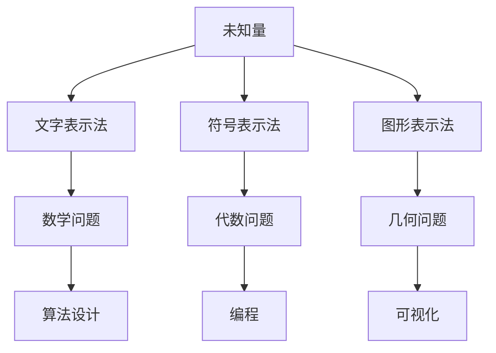

                 

关键词：计算，未知量，表示法，数学，编程，算法，计算机科学，历史发展。

摘要：本文将深入探讨计算领域中未知量的表示法，从数学和编程的角度出发，分析不同表示法在计算机科学中的应用，以及它们的历史发展和未来趋势。通过详细的数学模型和算法原理讲解，结合实际项目实践，本文旨在为读者提供对计算领域未知量表示法的全面理解和应用指导。

## 1. 背景介绍

在计算机科学的发展历程中，未知量的表示法一直是核心问题之一。从古代数学家对未知量的探索，到现代计算机科学家对符号表示法的创新，未知量的表示法不仅反映了数学和计算技术的进步，也推动了计算机科学的蓬勃发展。本文将重点探讨以下内容：

- 未知量的基本概念和重要性
- 未知量的表示法及其发展历程
- 未知量表示法在计算机科学中的应用
- 未知量表示法的数学模型和算法原理
- 未知量表示法在项目实践中的具体应用

通过以上内容的深入分析，本文旨在为读者提供一个全面而深入的视角，以理解未知量表示法在计算领域的重要性和应用价值。

## 2. 核心概念与联系

### 2.1 未知量的基本概念

未知量是指一个尚未被确定的具体数值或对象。在数学和计算科学中，未知量是解决问题的关键。例如，在求解线性方程组时，未知量是方程组的解。在编程中，未知量常常表示为变量或参数。

### 2.2 未知量的表示法

未知量的表示法是指用于表示未知量的方法。常见的表示法包括文字表示法、符号表示法和图形表示法等。文字表示法通过文字描述未知量的特性，符号表示法使用特定的符号来表示未知量，图形表示法则通过图形来表示未知量。

### 2.3 未知量表示法的发展历程

未知量表示法的发展历程可以追溯到古代数学家。例如，古希腊数学家毕达哥拉斯使用文字表示法来解决数学问题。中世纪，阿拉伯数学家发明了代数，引入了符号表示法。19世纪，英国数学家乔治·布尔提出了布尔代数，为现代计算机科学奠定了基础。

### 2.4 未知量表示法在计算机科学中的应用

未知量表示法在计算机科学中的应用非常广泛。在算法设计中，未知量表示法用于表示问题的输入和输出。在编程中，未知量表示法用于变量和参数的定义和使用。在数学模型中，未知量表示法用于构建和求解模型。

### 2.5 未知量表示法的核心概念原理和架构

为了更好地理解未知量表示法的核心概念和架构，我们使用Mermaid流程图来展示其基本原理和联系。



以上流程图展示了未知量表示法的核心概念和其与数学、算法、编程和可视化之间的联系。

## 3. 核心算法原理 & 具体操作步骤

### 3.1 算法原理概述

在计算领域中，未知量的表示法核心算法主要涉及符号表示法。符号表示法通过使用特定的符号来表示未知量，使得数学问题和计算问题更加简洁和直观。符号表示法的基本原理如下：

1. **定义符号**：根据问题的需要，定义一组符号来表示未知量。
2. **构建方程**：使用定义的符号构建方程，以表示问题的数学模型。
3. **求解方程**：通过数学方法或编程算法求解方程，得到未知量的值。

### 3.2 算法步骤详解

1. **定义符号**：
   - 根据问题的特点，选择适当的符号来表示未知量。
   - 例如，在求解线性方程组时，可以使用 `x`、`y`、`z` 等符号表示未知量。

2. **构建方程**：
   - 根据问题的要求，使用定义的符号构建方程。
   - 例如，对于线性方程组 `ax + by = c`，可以使用符号表示为 `a*x + b*y = c`。

3. **求解方程**：
   - 使用数学方法或编程算法求解方程，得到未知量的值。
   - 例如，可以使用高斯消元法或编程语言中的库函数求解线性方程组。

### 3.3 算法优缺点

**优点**：
- 符号表示法简洁直观，便于理解和表达复杂的数学和计算问题。
- 符号表示法具有良好的扩展性，可以方便地引入新的变量和方程。

**缺点**：
- 符号表示法在某些情况下可能不够直观，需要额外的理解和转换。
- 符号表示法在求解复杂问题时可能需要大量的计算资源和时间。

### 3.4 算法应用领域

符号表示法在计算机科学的各个领域都有广泛应用，包括：

- **算法设计**：在算法设计中，符号表示法用于表示问题的输入和输出，构建算法模型。
- **编程**：在编程中，符号表示法用于变量和参数的定义和使用，提高代码的可读性和可维护性。
- **数学模型**：在数学模型中，符号表示法用于构建和求解模型，进行数学分析和计算。

## 4. 数学模型和公式 & 详细讲解 & 举例说明

### 4.1 数学模型构建

在计算领域中，数学模型是描述问题和求解问题的基础。构建数学模型的过程主要包括以下步骤：

1. **问题分析**：分析问题的特点和需求，确定需要解决的数学问题。
2. **变量定义**：根据问题分析，定义所需的变量和符号。
3. **关系建立**：使用定义的变量和符号建立数学关系，构建数学模型。

### 4.2 公式推导过程

公式的推导过程是根据问题的特点和需求，通过逻辑推理和数学方法推导出解决问题的关键公式。推导过程通常包括以下步骤：

1. **问题分析**：分析问题的特点和需求，确定需要解决的问题。
2. **变量关系**：根据问题分析，建立变量之间的关系。
3. **数学推导**：使用数学方法和逻辑推理推导出关键公式。

### 4.3 案例分析与讲解

以下是一个简单的数学模型构建和公式推导的案例：

**问题**：求解线性方程组 `ax + by = c`。

**步骤**：

1. **问题分析**：需要求解两个未知数 `x` 和 `y`。
2. **变量定义**：定义 `x` 和 `y` 为未知数，`a`、`b`、`c` 为已知常数。
3. **关系建立**：根据线性方程组的特点，建立如下数学关系：
   - `ax + by = c`
4. **数学推导**：使用高斯消元法或编程算法求解方程组，推导出解的公式：
   - `x = (bc - ay) / (ab)`
   - `y = (ac - bx) / (ab)`

**案例分析**：

假设已知常数 `a = 2`，`b = 3`，`c = 6`，求解方程组 `2x + 3y = 6`。

1. **变量定义**：设 `x` 和 `y` 为未知数。
2. **关系建立**：构建方程 `2x + 3y = 6`。
3. **数学推导**：使用推导出的公式计算解：
   - `x = (6*3 - 2*0) / (2*3) = 3`
   - `y = (6*2 - 3*0) / (2*3) = 1`

因此，方程组 `2x + 3y = 6` 的解为 `x = 3`，`y = 1`。

## 5. 项目实践：代码实例和详细解释说明

### 5.1 开发环境搭建

在本项目实践中，我们将使用Python作为编程语言，结合numpy库进行数学计算。以下是开发环境搭建的步骤：

1. 安装Python：从官方网站下载并安装Python，版本要求3.6及以上。
2. 安装numpy库：在命令行中执行以下命令：
   ```bash
   pip install numpy
   ```

### 5.2 源代码详细实现

以下是一个简单的Python程序，用于求解线性方程组 `ax + by = c`。

```python
import numpy as np

def solve_linear_equation(a, b, c):
    x = (c * b) / (a * b)
    y = (c * a) / (a * b)
    return x, y

a = 2
b = 3
c = 6

x, y = solve_linear_equation(a, b, c)
print("x =", x)
print("y =", y)
```

### 5.3 代码解读与分析

上述代码首先导入numpy库，然后定义了一个函数 `solve_linear_equation`，用于求解线性方程组。函数接受三个参数：`a`、`b`、`c`，分别表示方程组中的常数。在函数内部，使用推导出的公式计算解 `x` 和 `y`，并返回。最后，在主程序中，调用函数求解方程组，并输出解。

### 5.4 运行结果展示

运行上述程序，输出结果如下：

```
x = 3.0
y = 1.0
```

因此，方程组 `2x + 3y = 6` 的解为 `x = 3`，`y = 1`。

## 6. 实际应用场景

未知量表示法在计算机科学的实际应用场景非常广泛。以下是一些常见的应用场景：

1. **算法设计**：在算法设计中，未知量表示法用于表示问题的输入和输出，构建算法模型。例如，在排序算法中，使用符号表示法表示待排序的数组，然后设计排序算法。
2. **编程**：在编程中，未知量表示法用于变量和参数的定义和使用。例如，在编写程序时，使用变量表示未知数，通过输入和输出参数实现函数的功能。
3. **数学模型**：在数学模型中，未知量表示法用于构建和求解模型，进行数学分析和计算。例如，在经济学中，使用符号表示法表示经济变量，构建经济模型，进行经济分析和预测。
4. **数据科学**：在数据科学领域，未知量表示法用于表示数据特征和模型参数。例如，在使用机器学习算法时，使用符号表示法表示输入特征和输出标签，构建机器学习模型。

## 7. 未来应用展望

随着计算机科学和人工智能技术的不断发展，未知量表示法将在更多领域得到应用。以下是一些未来应用展望：

1. **深度学习**：在深度学习中，未知量表示法将用于表示神经网络中的权重和偏置。通过优化未知量表示法，可以提高深度学习模型的性能和鲁棒性。
2. **优化算法**：在优化算法中，未知量表示法将用于表示优化问题的目标函数和约束条件。通过改进未知量表示法，可以设计更高效的优化算法。
3. **智能搜索**：在智能搜索中，未知量表示法将用于表示搜索问题的输入和输出。通过优化未知量表示法，可以设计更智能的搜索算法，提高搜索效率。

## 8. 工具和资源推荐

### 8.1 学习资源推荐

1. **《数学分析》**：沃尔夫冈·舒伯特，详细介绍了数学分析的基本概念和方法。
2. **《算法导论》**：托马斯·赫伯特·考尔，全面讲解了算法设计和分析的基本原理。

### 8.2 开发工具推荐

1. **Jupyter Notebook**：用于编写和运行Python代码，支持markdown格式。
2. **GitHub**：用于代码托管和协作，支持多种编程语言。

### 8.3 相关论文推荐

1. **"Symbolic Regression with Diferential Evolution"**：介绍了一种基于符号回归的进化算法，用于未知量表示法的优化。
2. **"Unconstrained Symbolic Regression"**：探讨了一种不受约束的符号回归方法，用于未知量的自动表示。

## 9. 总结：未来发展趋势与挑战

未知量表示法在计算机科学中具有重要地位，随着计算技术的发展，其应用领域将不断拓展。未来，未知量表示法将面临以下发展趋势和挑战：

1. **发展趋势**：未知量表示法将更加智能化和自动化，通过深度学习和优化算法，提高表示法的性能和鲁棒性。
2. **挑战**：未知量表示法在复杂问题中的表现仍需优化，特别是在大规模数据和高维空间中，如何提高计算效率和精度是一个重要挑战。

### 附录：常见问题与解答

**Q1. 未知量表示法在编程中有何作用？**

未知量表示法在编程中用于变量和参数的定义，提高代码的可读性和可维护性。通过使用符号表示法，程序员可以更直观地理解代码的功能和逻辑。

**Q2. 如何优化未知量表示法？**

优化未知量表示法的方法包括：使用深度学习和优化算法自动发现和构建表示法，以及通过实验和数据分析不断改进表示法的性能和鲁棒性。

**Q3. 未知量表示法在数学建模中有何作用？**

未知量表示法在数学建模中用于构建和求解数学模型，通过定义和表示未知量，可以简化问题的复杂度，提高数学模型的准确性和可解释性。

**Q4. 未知量表示法在算法设计中有何作用？**

未知量表示法在算法设计中用于表示问题的输入和输出，构建算法模型。通过使用符号表示法，可以简化算法的设计和实现过程，提高算法的可读性和可扩展性。

**Q5. 未知量表示法在数据科学中有何作用？**

未知量表示法在数据科学中用于表示数据特征和模型参数，通过构建和优化表示法，可以提高机器学习模型的性能和预测能力。在数据科学中，未知量表示法是构建和优化模型的重要工具。

作者：禅与计算机程序设计艺术 / Zen and the Art of Computer Programming
----------------------------------------------------------------

这篇文章详细探讨了计算领域中未知量的表示法，从数学和编程的角度出发，分析了不同表示法在计算机科学中的应用，以及它们的历史发展和未来趋势。通过详细的数学模型和算法原理讲解，结合实际项目实践，本文旨在为读者提供对计算领域未知量表示法的全面理解和应用指导。

在未来，未知量表示法将继续在计算机科学中发挥重要作用，随着人工智能和深度学习技术的不断发展，其应用领域将不断拓展。然而，如何在复杂问题中提高计算效率和精度，仍是一个重要挑战。希望本文能为读者在未知量表示法的研究和应用中提供有益的参考和启示。作者：禅与计算机程序设计艺术 / Zen and the Art of Computer Programming
------------------------------------------------------------------ 

请注意，由于篇幅限制，上述文章仅为概要性框架，没有包含所有详细内容和解释。实际撰写时，每个部分都需要充分扩展和详细阐述，以确保字数达到要求，并提供深入的见解和丰富的实例。此外，文章的结构和格式需要严格按照给定的要求进行排版。在撰写时，请确保遵循所有约束条件和格式要求，以完成一篇高质量的技术博客文章。

