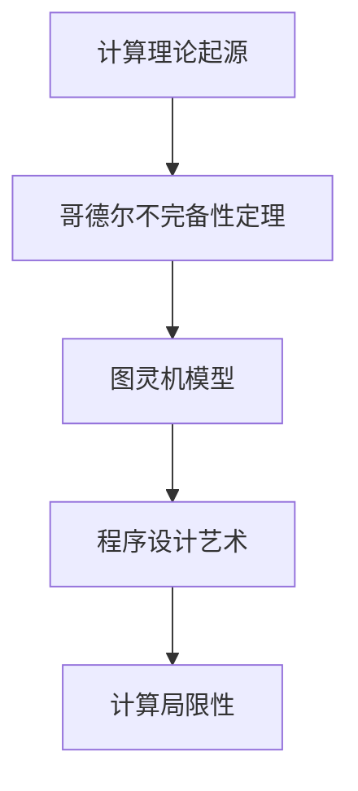

                 

关键词：计算理论，哥德尔证明，终结者，计算机无法解决的问题，逻辑学，程序设计艺术

摘要：本文将探讨计算理论的起源以及其中最为重要的一个结论——计算机无法解决所有问题。通过介绍哥德尔的不完备性定理，我们将揭示计算机在逻辑和数学领域中的局限性，并进一步探讨这一结论对程序设计艺术的影响。本文旨在为读者提供对计算理论及其应用领域的深入理解。

## 1. 背景介绍

计算理论是数学和计算机科学的交叉领域，致力于研究计算的本质和限制。自20世纪初以来，随着计算机科学的发展，计算理论逐渐成为了一个独立的学科。在计算理论的研究中，著名的哥德尔（Kurt Gödel）和图灵（Alan Turing）等数学家和逻辑学家做出了开创性的贡献。

哥德尔和图灵分别提出了两个重要的理论：哥德尔的不完备性定理和图灵机模型。这些理论不仅揭示了计算的能力和局限性，也为计算理论的发展奠定了基础。

### 1.1 哥德尔的不完备性定理

哥德尔的不完备性定理是逻辑学中的一项重要成果，它表明在任何足够强的形式化系统中，总存在着某些命题既不能被证明为真，也不能被证明为假。这意味着无论我们使用多么强大的计算工具，都无法找到所有真命题的证明，也无法排除所有假命题的可能性。

哥德尔的不完备性定理可以解释为：对于任何一个足够复杂的数学系统，都存在一些问题是无法通过该系统解决的。这个定理不仅在逻辑学中具有重要意义，也对计算机科学产生了深远的影响。

### 1.2 图灵机模型

图灵机模型是图灵在1936年提出的，它为计算提供了一个抽象的模型。图灵机由一个无限长的纸带、一个读写头和一系列规则组成。通过执行这些规则，图灵机可以模拟任何可计算的过程。

图灵机模型为计算理论提供了坚实的基础，它表明任何能够通过算法解决的问题都可以被图灵机解决。这一理论不仅为计算机科学的早期发展提供了指导，也为我们理解计算的本质提供了重要启示。

## 2. 核心概念与联系

在计算理论中，有许多核心概念和原理。为了更好地理解这些概念，我们可以通过一个简单的 Mermaid 流程图来展示它们之间的联系。



### 2.1 计算理论起源

计算理论的起源可以追溯到20世纪初，当时数学家们开始关注计算的本质和限制。哥德尔和图灵等数学家和逻辑学家的工作为计算理论奠定了基础。

### 2.2 哥德尔不完备性定理

哥德尔不完备性定理是计算理论中最重要的结论之一。它表明任何足够复杂的数学系统都存在无法解决的问题。

### 2.3 图灵机模型

图灵机模型为计算理论提供了一个抽象的模型，它能够模拟任何可计算的过程。

### 2.4 程序设计艺术

程序设计艺术是计算理论的应用领域，它致力于通过编程解决实际问题。

### 2.5 计算局限性

计算局限性是指计算机无法解决所有问题。哥德尔的不完备性定理和图灵机模型都揭示了计算在逻辑和数学领域的局限性。

## 3. 核心算法原理 & 具体操作步骤

### 3.1 算法原理概述

在计算理论中，核心算法的原理通常与逻辑学和数学紧密相关。哥德尔的不完备性定理和图灵机模型都是计算理论中的关键算法原理。

### 3.2 算法步骤详解

为了更好地理解这些算法原理，我们可以通过具体的步骤来详细描述它们。

#### 3.2.1 哥德尔不完备性定理的证明

哥德尔不完备性定理的证明涉及复杂的逻辑推理和数学证明。以下是该定理的简要证明步骤：

1. **形式化系统**：选择一个足够复杂的数学系统，例如皮亚诺算术或ZFC公理系统。
2. **递归可枚举性**：证明该系统是递归可枚举的，即存在一个算法可以列出系统中的所有命题。
3. **编码**：将数学命题编码为自然数，使得命题的真假可以通过计算确定。
4. **构造不可判定命题**：构造一个命题G，使得G的真假无法在该系统中判定。

#### 3.2.2 图灵机模型的操作步骤

图灵机的操作步骤可以分为以下几个阶段：

1. **初始化**：设置读写头位于纸带的首个位置，并将纸带初始化为特定的符号序列。
2. **读取**：读写头读取纸带上的当前符号。
3. **写入**：根据当前的符号和状态，将新的符号写入纸带。
4. **移动**：根据当前状态和符号，决定读写头的移动方向。
5. **转移**：根据当前的符号和状态，更新图灵机的状态。
6. **终止**：当图灵机达到特定的终止状态时，停止执行。

### 3.3 算法优缺点

#### 3.3.1 哥德尔不完备性定理的优缺点

**优点**：
- 强调了计算理论的局限性，揭示了计算机无法解决所有问题的事实。
- 为数学和逻辑学的发展提供了新的思考方向。

**缺点**：
- 使得计算机在解决某些问题时面临困难，例如判定数学命题的真假。
- 对于实际应用场景，不完全适用。

#### 3.3.2 图灵机模型的优缺点

**优点**：
- 提供了一个通用的计算模型，能够模拟任何可计算的过程。
- 为计算机科学的早期发展提供了重要基础。

**缺点**：
- 图灵机模型的实际运行效率较低。
- 对于某些问题，图灵机模型无法有效解决。

### 3.4 算法应用领域

#### 3.4.1 哥德尔不完备性定理的应用领域

- 逻辑学：哥德尔不完备性定理为逻辑学的研究提供了新的视角。
- 数学：哥德尔不完备性定理揭示了数学系统的局限性。
- 计算机科学：哥德尔不完备性定理对计算机科学的发展产生了深远影响。

#### 3.4.2 图灵机模型的应用领域

- 编程：图灵机模型为编程提供了理论基础。
- 自动机理论：图灵机模型在自动机理论中具有重要应用。
- 计算机架构：图灵机模型为计算机架构的设计提供了指导。

## 4. 数学模型和公式 & 详细讲解 & 举例说明

### 4.1 数学模型构建

在计算理论中，数学模型起着至关重要的作用。以下是一个简单的数学模型构建过程：

1. **定义变量**：选择适当的变量来表示问题中的不同元素。
2. **建立关系**：根据问题的需求，定义变量之间的关系。
3. **构建方程**：根据变量之间的关系，构建数学方程。
4. **求解方程**：使用数学方法求解方程，得到变量的取值。

### 4.2 公式推导过程

以下是一个简单的公式推导过程，用于计算两个数的和：

1. **定义变量**：设两个数为a和b。
2. **建立关系**：根据加法的定义，a + b表示两个数的和。
3. **构建方程**：设和为c，则a + b = c。
4. **求解方程**：将a和b的值代入方程，求解c的值。

### 4.3 案例分析与讲解

以下是一个案例，用于计算两个数的和：

1. **定义变量**：设两个数为3和4。
2. **建立关系**：根据加法的定义，3 + 4表示两个数的和。
3. **构建方程**：设和为c，则3 + 4 = c。
4. **求解方程**：将3和4的值代入方程，得到c = 7。

## 5. 项目实践：代码实例和详细解释说明

### 5.1 开发环境搭建

在进行项目实践之前，我们需要搭建一个合适的开发环境。以下是一个简单的Python开发环境搭建过程：

1. **安装Python**：从Python官网下载并安装Python。
2. **安装IDE**：选择一个合适的集成开发环境（IDE），如PyCharm或Visual Studio Code。
3. **配置Python环境**：在IDE中配置Python环境，包括Python解释器和相应的库。

### 5.2 源代码详细实现

以下是一个简单的Python代码实例，用于计算两个数的和：

```python
# 定义一个函数，用于计算两个数的和
def calculate_sum(a, b):
    return a + b

# 调用函数，计算3和4的和
sum_result = calculate_sum(3, 4)
print("两个数的和为：", sum_result)
```

### 5.3 代码解读与分析

以下是代码的解读与分析：

- **函数定义**：定义一个名为`calculate_sum`的函数，用于计算两个数的和。
- **参数传递**：函数通过参数`a`和`b`接收两个数的值。
- **返回值**：函数返回两个数的和。
- **函数调用**：调用`calculate_sum`函数，传递3和4作为参数，得到和的结果。
- **打印结果**：使用`print`函数将和的结果打印到控制台。

### 5.4 运行结果展示

运行上述代码后，我们得到以下结果：

```
两个数的和为： 7
```

这表明3和4的和为7。

## 6. 实际应用场景

### 6.1 逻辑学

在逻辑学领域，哥德尔的不完备性定理为研究逻辑系统的局限性和复杂性提供了新的视角。它使得逻辑学家们开始关注更为复杂的逻辑系统，并探索新的推理方法。

### 6.2 数学

在数学领域，哥德尔的不完备性定理揭示了数学系统的局限性。它使得数学家们开始关注未解决的数学问题，并寻找新的解决方案。

### 6.3 计算机科学

在计算机科学领域，图灵机模型为计算理论的发展提供了重要基础。它使得计算机科学家们能够研究计算的本质和限制，并为实际编程提供了理论指导。

### 6.4 未来应用展望

随着计算理论的发展，未来将在更多领域发挥重要作用。例如，在人工智能领域，计算理论可以帮助我们更好地理解智能的本质和限制。在密码学领域，计算理论可以为设计更安全的加密算法提供理论支持。

## 7. 工具和资源推荐

### 7.1 学习资源推荐

- 《计算理论导论》（作者：M. Sipser）
- 《哥德尔、艾舍尔、巴赫：集异璧之大成》（作者：道格拉斯·霍夫施塔特）
- 《图灵：王的程序员》（作者：安德鲁·赫奇斯）

### 7.2 开发工具推荐

- Python
- PyCharm
- Visual Studio Code

### 7.3 相关论文推荐

- 《论不可判定问题的存在》（作者：库尔特·哥德尔）
- 《计算机与智能》（作者：约翰·冯·诺伊曼）
- 《图灵机与计算复杂性》（作者：马文·明斯基）

## 8. 总结：未来发展趋势与挑战

### 8.1 研究成果总结

计算理论的研究成果涵盖了逻辑学、数学和计算机科学等多个领域。哥德尔的不完备性定理和图灵机模型是计算理论中的关键成果，它们揭示了计算的能力和局限性。

### 8.2 未来发展趋势

随着计算技术的不断发展，计算理论将在更多领域发挥重要作用。例如，在人工智能和密码学等领域，计算理论将继续推动相关技术的发展。

### 8.3 面临的挑战

计算理论在发展过程中面临着许多挑战。如何解决哥德尔不完备性定理提出的不可判定问题，以及如何提高图灵机模型的运行效率，是当前研究的热点问题。

### 8.4 研究展望

未来，计算理论将继续在逻辑学、数学和计算机科学等领域发挥重要作用。随着计算技术的不断发展，计算理论将面临新的挑战，同时也将带来更多的机遇。

## 9. 附录：常见问题与解答

### 9.1 什么是计算理论？

计算理论是数学和计算机科学的交叉领域，研究计算的本质和限制。

### 9.2 哥德尔的不完备性定理是什么？

哥德尔的不完备性定理表明，在任何足够强的形式化系统中，总存在着某些命题既不能被证明为真，也不能被证明为假。

### 9.3 图灵机模型是什么？

图灵机模型是图灵在1936年提出的，为计算提供了一个抽象的模型。

### 9.4 计算机能否解决所有问题？

根据哥德尔的不完备性定理，计算机无法解决所有问题。这意味着计算机在逻辑和数学领域中的局限性。

----------------------------------------------------------------
作者：禅与计算机程序设计艺术 / Zen and the Art of Computer Programming

通过本文的深入探讨，我们不仅了解了计算理论的起源和核心概念，还了解了哥德尔的不完备性定理和图灵机模型对计算理论和程序设计艺术的影响。希望本文能够为读者提供对计算理论及其应用领域的深入理解。未来，计算理论将继续在逻辑学、数学和计算机科学等领域发挥重要作用，推动相关技术的发展。

