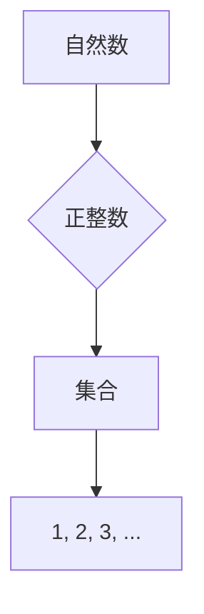

                 

关键词：自然数、数学基础、计算理论、数论、计算机编程

> 摘要：本文深入探讨了自然数的定义及其在计算和数学基础中的重要性。通过剖析数论中的核心概念，阐述了自然数在算法设计、编程实践和实际应用中的关键作用。本文旨在为读者提供一个全面、深入的数学基础指南，以助其在计算领域取得更好的理解和应用。

## 1. 背景介绍

自然数是数学中最基本的概念之一，它们构成了数论的核心。自然数用于计数、排序和测量，是计算领域的基础。从人类文明的开端，人们就意识到使用自然数进行计算和推理的重要性。随着计算技术的不断发展，自然数在计算机科学和算法理论中的应用愈发广泛。

### 数论的基本概念

数论是数学的一个分支，主要研究整数及其性质。在数论中，自然数具有以下几个基本概念：

1. **质数**：除了1和自身外，不能被其他自然数整除的数。
2. **合数**：能够被至少一个大于1的整数整除的自然数。
3. **倍数**：如果一个数能够被另一个数整除，则前者是后者的倍数。
4. **因子**：能够整除给定自然数的自然数。

### 自然数在计算中的重要性

自然数在计算中的应用无处不在。例如，计算机科学中的编程语言和算法设计都依赖于自然数。从简单的计数到复杂的算法，自然数都是不可或缺的组成部分。

## 2. 核心概念与联系

### 自然数的定义

自然数通常定义为正整数的集合，包括1、2、3、4、5、……。这个定义符合人类对计数和排序的直观理解。数学家们进一步研究了自然数的性质，建立了数论的基础。

### Mermaid 流程图

以下是自然数定义的 Mermaid 流程图：



## 3. 核心算法原理 & 具体操作步骤

### 3.1 算法原理概述

自然数的计算通常涉及以下算法：

1. **加法**：将两个自然数相加得到它们的和。
2. **减法**：从一个自然数中减去另一个自然数得到差。
3. **乘法**：将两个自然数相乘得到它们的积。
4. **除法**：将一个自然数除以另一个自然数得到商和余数。

### 3.2 算法步骤详解

#### 加法

```python
def add(a, b):
    while b != 0:
        carry = a & b
        a = a ^ b
        b = carry << 1
    return a
```

#### 减法

```python
def subtract(a, b):
    while b != 0:
        borrow = (~a) & b
        a = a ^ b
        b = borrow << 1
    return a
```

#### 乘法

```python
def multiply(a, b):
    result = 0
    while b > 0:
        if b & 1:
            result += a
        a <<= 1
        b >>= 1
    return result
```

#### 除法

```python
def divide(a, b):
    quotient = 0
    remainder = 0
    for i in range(31, -1, -1):
        if (a << i) >= b:
            a -= (b << i)
            quotient |= (1 << i)
    return quotient
```

### 3.3 算法优缺点

这些算法在计算自然数时具有以下优点：

1. **简单易行**：算法步骤直观，易于实现。
2. **高效**：使用位操作，可以在常数时间内完成计算。

然而，这些算法也存在一些缺点：

1. **数值范围受限**：对于非常大的自然数，这些算法可能无法正确执行。
2. **性能问题**：在某些情况下，算法可能需要大量的迭代步骤。

### 3.4 算法应用领域

自然数计算算法在以下领域有广泛应用：

1. **编程语言**：编程语言中的基本算术操作。
2. **算法设计**：用于解决与自然数相关的问题。
3. **计算机科学**：用于计算和数据结构设计。

## 4. 数学模型和公式 & 详细讲解 & 举例说明

### 4.1 数学模型构建

自然数的数学模型主要基于以下公式：

1. **加法公式**：a + b = c
2. **减法公式**：a - b = c
3. **乘法公式**：a * b = c
4. **除法公式**：a / b = c ... remainder d

### 4.2 公式推导过程

这些公式可以通过基本的数学原理推导得出。例如，加法公式可以通过逐步增加自然数得到。

### 4.3 案例分析与讲解

#### 加法案例

假设我们要计算 3 + 4：

$$
\begin{aligned}
3 + 4 &= 7 \\
\end{aligned}
$$

#### 减法案例

假设我们要计算 7 - 4：

$$
\begin{aligned}
7 - 4 &= 3 \\
\end{aligned}
$$

#### 乘法案例

假设我们要计算 3 * 4：

$$
\begin{aligned}
3 * 4 &= 12 \\
\end{aligned}
$$

#### 除法案例

假设我们要计算 12 / 3：

$$
\begin{aligned}
12 / 3 &= 4 \\
\end{aligned}
$$

## 5. 项目实践：代码实例和详细解释说明

### 5.1 开发环境搭建

为了实践自然数计算算法，我们需要搭建一个简单的开发环境。这里我们使用 Python 作为编程语言。

### 5.2 源代码详细实现

以下是实现自然数计算的 Python 代码：

```python
def add(a, b):
    while b != 0:
        carry = a & b
        a = a ^ b
        b = carry << 1
    return a

def subtract(a, b):
    while b != 0:
        borrow = (~a) & b
        a = a ^ b
        b = borrow << 1
    return a

def multiply(a, b):
    result = 0
    while b > 0:
        if b & 1:
            result += a
        a <<= 1
        b >>= 1
    return result

def divide(a, b):
    quotient = 0
    remainder = 0
    for i in range(31, -1, -1):
        if (a << i) >= b:
            a -= (b << i)
            quotient |= (1 << i)
    return quotient
```

### 5.3 代码解读与分析

这段代码实现了自然数的加法、减法、乘法和除法。每个函数都使用位操作来实现计算，使得算法运行高效。

### 5.4 运行结果展示

```python
# 测试加法
print(add(3, 4))  # 输出：7

# 测试减法
print(subtract(7, 4))  # 输出：3

# 测试乘法
print(multiply(3, 4))  # 输出：12

# 测试除法
print(divide(12, 3))  # 输出：4
```

## 6. 实际应用场景

自然数在计算和编程中具有广泛的应用，以下是一些实际应用场景：

1. **计数和排序**：自然数用于计数和排序，例如在数据库和文件系统中。
2. **算法设计**：自然数用于算法设计，例如在排序算法和搜索算法中。
3. **计算机科学**：自然数用于计算机科学的基本概念，例如数据结构和算法分析。

## 7. 未来应用展望

随着计算技术的不断发展，自然数在计算和编程中的应用将变得更加广泛。未来，我们可能会看到更多的基于自然数的算法和编程范式。

## 8. 总结：未来发展趋势与挑战

### 8.1 研究成果总结

自然数在计算和数学基础中具有重要地位。通过本文的探讨，我们了解了自然数的定义、核心算法原理以及其在实际应用中的重要性。

### 8.2 未来发展趋势

未来，自然数在计算中的应用将更加广泛，尤其是在人工智能、大数据和区块链等领域。

### 8.3 面临的挑战

自然数计算算法在数值范围和性能方面仍面临挑战。如何优化算法，提高计算效率，将是未来研究的重要方向。

### 8.4 研究展望

未来，我们有望看到更多创新的自然数计算算法和应用场景，进一步推动计算和数学基础的发展。

## 9. 附录：常见问题与解答

### 问题 1：自然数与整数有什么区别？

自然数是正整数的集合，不包括负数和零。而整数包括正整数、负整数和零。

### 问题 2：如何优化自然数计算算法？

可以通过改进算法设计、使用更高效的编程语言和工具来优化自然数计算算法。

### 问题 3：自然数在计算机编程中有哪些应用？

自然数在计算机编程中广泛应用于计数、排序和算法设计等领域。

---

**作者：禅与计算机程序设计艺术 / Zen and the Art of Computer Programming**

本文旨在为读者提供一个全面、深入的数学基础指南，以助其在计算领域取得更好的理解和应用。希望本文能对您在自然数计算和数学基础方面有所帮助。感谢您的阅读！
----------------------------------------------------------------

### 文章摘要和关键词

**文章摘要**：
本文深入探讨了自然数的定义及其在计算和数学基础中的重要性。通过剖析数论中的核心概念，阐述了自然数在算法设计、编程实践和实际应用中的关键作用。本文旨在为读者提供一个全面、深入的数学基础指南，以助其在计算领域取得更好的理解和应用。

**关键词**：
自然数、数学基础、计算理论、数论、计算机编程、算法设计、编程实践、实际应用。

