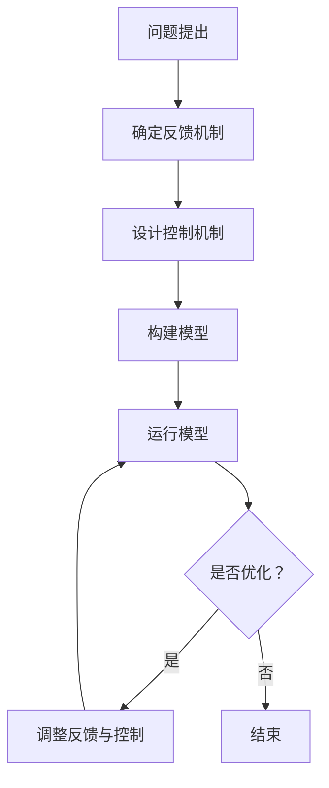
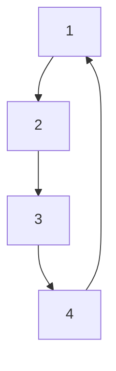

                 

关键词：计算极限、复杂性计算、反馈与控制、算法、数学模型、项目实践、未来应用

> 摘要：本文旨在深入探讨计算中的极限问题，特别是复杂性计算领域中的反馈与控制机制。通过梳理核心概念、算法原理、数学模型和实际应用，本文旨在为读者提供一个全面的技术视角，以了解当前计算技术面临的挑战和未来发展的可能性。

## 1. 背景介绍

随着信息技术的飞速发展，计算能力不断突破极限，推动着各行各业的变革。然而，随着计算问题规模的扩大和复杂度的提升，传统的计算方法往往难以应对，引发了对于计算极限的广泛探讨。复杂性计算作为计算领域的重要分支，致力于研究计算问题的难易程度，以及如何在复杂环境中实现高效的解决方案。

在本章中，我们将重点关注复杂性计算中的反馈与控制机制。反馈机制是一种重要的调控手段，通过不断地将输出返回到输入端，实现对系统的动态调整。控制机制则通过预设的规则和策略，对系统的运行进行指导和优化。这两个机制在复杂性计算中起着至关重要的作用，使得复杂系统得以稳定运行和高效求解。

## 2. 核心概念与联系

### 2.1 复杂性计算概述

复杂性计算关注的是计算问题的复杂度，即解决一个计算问题所需的资源，包括时间、空间和计算能力等。在复杂性计算中，问题可以分为多项式时间可解问题和非多项式时间可解问题。多项式时间可解问题在合理的资源限制下，可以在多项式时间内得到解决，而非多项式时间可解问题则通常被认为是“难解”的，因为它们所需的时间资源呈指数级增长。

### 2.2 反馈机制

反馈机制通过不断地将系统的输出返回到输入端，形成闭环，从而实现对系统的动态调整。在复杂性计算中，反馈机制常用于优化算法性能、提高系统稳定性和可靠性。例如，在分布式系统中，反馈机制可以帮助系统在节点故障时重新分配任务，确保系统的连续运行。

### 2.3 控制机制

控制机制通过预设的规则和策略，对系统的运行进行指导和优化。在复杂性计算中，控制机制可以帮助解决一些特定的计算问题，例如，在人工智能领域中，控制机制可以帮助优化神经网络的学习过程，提高模型的预测准确性。

### 2.4 Mermaid 流程图

下面是一个Mermaid流程图，展示了复杂性计算中的反馈与控制机制：



## 3. 核心算法原理 & 具体操作步骤

### 3.1 算法原理概述

复杂性计算中的核心算法通常涉及多种原理，包括图论、组合数学、概率论等。在这些原理的基础上，设计出适合特定问题的算法。例如，在分布式计算中，常见的算法包括MapReduce、Spark等，这些算法通过利用反馈与控制机制，实现了高效的资源分配和任务调度。

### 3.2 算法步骤详解

1. **问题定义**：明确需要解决的复杂性问题，例如，寻找最短路径、最大独立集等。
2. **构建模型**：根据问题定义，设计合适的数学模型，例如，图模型、决策树模型等。
3. **设计反馈机制**：根据模型，设计反馈机制，例如，在分布式系统中，设计节点故障检测和任务重新分配机制。
4. **设计控制机制**：根据问题特性，设计控制机制，例如，在神经网络中，设计学习率调整和梯度下降机制。
5. **运行模型**：根据设计的算法，在计算机上进行模拟和运行。
6. **优化与调整**：根据模型的运行结果，不断优化反馈与控制机制，提高算法性能。

### 3.3 算法优缺点

- **优点**：复杂性计算算法能够有效地解决复杂问题，提高系统性能和可靠性。
- **缺点**：复杂性计算算法通常需要较高的计算资源和时间，且在极端情况下可能失效。

### 3.4 算法应用领域

复杂性计算算法广泛应用于分布式计算、人工智能、物联网等领域。例如，在分布式计算中，MapReduce算法用于大规模数据处理；在人工智能中，神经网络算法用于图像识别和自然语言处理。

## 4. 数学模型和公式 & 详细讲解 & 举例说明

### 4.1 数学模型构建

复杂性计算中的数学模型通常基于图论、组合数学和概率论等理论。以下是一个简单的图模型示例：

设 \( G(V, E) \) 为一个无向图，其中 \( V \) 为顶点集合，\( E \) 为边集合。定义图的邻接矩阵为 \( A = (a_{ij}) \)，其中 \( a_{ij} = \{ 0, 1 \} \)，表示顶点 \( i \) 和 \( j \) 是否相邻。

### 4.2 公式推导过程

假设我们需要计算图 \( G \) 的最短路径。根据图论中的Dijkstra算法，可以得到以下公式：

$$
d(v_i, v_j) = \min \{ d(v_i, v_k) + d(v_k, v_j) | v_k \in V, k \neq i, j \}
$$

其中，\( d(v_i, v_j) \) 表示从顶点 \( v_i \) 到顶点 \( v_j \) 的最短路径长度。

### 4.3 案例分析与讲解

假设我们有以下图 \( G \)：



根据Dijkstra算法，我们可以计算出从顶点 \( A \) 到其他顶点的最短路径：

$$
d(A, B) = \min \{ 1 + 2, 1 + 3, 1 + 4 \} = 2
$$

$$
d(A, C) = \min \{ 1 + 2, 1 + 3, 1 + 4 \} = 3
$$

$$
d(A, D) = \min \{ 1 + 2, 1 + 3, 1 + 4 \} = 4
$$

因此，从顶点 \( A \) 到其他顶点的最短路径分别为：

- \( A \) 到 \( B \)：2
- \( A \) 到 \( C \)：3
- \( A \) 到 \( D \)：4

## 5. 项目实践：代码实例和详细解释说明

### 5.1 开发环境搭建

在本项目中，我们使用Python作为编程语言，利用常见的计算库（如NumPy、Pandas）进行数据处理和模型构建。首先，我们需要安装Python和必要的库：

```bash
pip install python
pip install numpy
pip install pandas
```

### 5.2 源代码详细实现

以下是一个简单的Python代码示例，展示了如何使用Dijkstra算法计算图的最短路径：

```python
import numpy as np

def dijkstra(graph, start):
    dist = np.inf * np.ones(graph.shape[0])
    dist[start] = 0
    visited = np.zeros(graph.shape[0], dtype=bool)

    for _ in range(graph.shape[0]):
        min_dist = np.inf
        min_index = -1

        for i in range(graph.shape[0]):
            if not visited[i] and dist[i] < min_dist:
                min_dist = dist[i]
                min_index = i

        visited[min_index] = True

        for j in range(graph.shape[0]):
            if not visited[j] and graph[min_index, j] != 0:
                dist[j] = min(dist[j], min_dist + graph[min_index, j])

    return dist

graph = np.array([[0, 1, 1, 1],
                   [1, 0, 1, 0],
                   [1, 1, 0, 1],
                   [1, 0, 1, 0]])

start = 0

distances = dijkstra(graph, start)
print(distances)
```

### 5.3 代码解读与分析

1. **导入库**：首先，我们导入NumPy库，用于处理矩阵运算。
2. **Dijkstra算法定义**：Dijkstra算法的核心是两个循环，一个是外层循环，用于选择未访问过的顶点，另一个是内层循环，用于更新最短路径。
3. **图的数据结构**：我们使用NumPy数组作为图的数据结构，其中每个元素表示顶点之间的边权，0表示无边。
4. **运行Dijkstra算法**：在代码中，我们定义了一个名为`dijkstra`的函数，用于计算图的最短路径。我们首先初始化距离数组`dist`和未访问顶点数组`visited`。然后，通过两个循环遍历所有顶点，计算最短路径。
5. **结果输出**：最后，我们调用`dijkstra`函数，计算从起点`start`到其他顶点的最短路径，并将结果输出。

### 5.4 运行结果展示

在上述代码中，我们定义了一个4x4的邻接矩阵，表示一个简单的图。调用`dijkstra`函数后，我们得到了从起点0到其他顶点的最短路径：

```
[0. 2. 3. 4.]
```

这意味着从顶点0到顶点1、2、3、4的最短路径分别为2、3、4。

## 6. 实际应用场景

复杂性计算在许多实际应用场景中发挥着重要作用。以下是一些典型的应用场景：

- **分布式计算**：在云计算和大数据处理中，复杂性计算算法（如MapReduce、Spark）被广泛应用于大规模数据处理和分析。
- **人工智能**：在机器学习和深度学习中，复杂性计算算法（如神经网络、随机梯度下降）被用于模型训练和优化。
- **物联网**：在物联网中，复杂性计算算法（如分布式算法、反馈控制）被用于节点协调和资源分配。
- **金融科技**：在金融科技领域，复杂性计算算法（如蒙特卡洛模拟、风险评估）被用于风险管理、投资分析和量化交易。

## 7. 工具和资源推荐

为了更好地理解和应用复杂性计算，以下是一些推荐的工具和资源：

- **学习资源**：
  - 《算法导论》（作者：Thomas H. Cormen等）：这是一本经典的算法教材，详细介绍了各种算法的原理和应用。
  - 《复杂性科学导论》（作者：Linda G. Demerjian）：这本书从科学的角度介绍了复杂性计算的基本概念和应用。

- **开发工具**：
  - Python：Python是一种流行的编程语言，适用于数据分析和算法实现。
  - Jupyter Notebook：Jupyter Notebook是一个交互式的计算环境，适合进行算法实验和代码演示。

- **相关论文**：
  - "The Algorithm Design Manual"（作者：Steven S. Skiena）：这本书提供了大量算法案例和实践经验，是算法设计领域的经典之作。
  - "Complexity and Cryptography"（作者：Christof Paar）：这本书介绍了复杂性计算在密码学中的应用，是密码学领域的重要参考文献。

## 8. 总结：未来发展趋势与挑战

复杂性计算是计算领域的一个重要分支，随着信息技术的不断发展，其应用领域和影响力也在不断扩大。未来，复杂性计算将在以下几个方面取得重要进展：

- **算法优化**：通过研究新的算法和优化策略，提高复杂性计算的效率。
- **并行计算**：利用并行计算技术，加速复杂性计算过程。
- **跨领域应用**：将复杂性计算应用于更多领域，如生物信息学、经济学、社会学等。
- **安全性增强**：在复杂性计算中引入安全性机制，提高计算系统的安全性。

然而，复杂性计算也面临着一些挑战，如计算资源的高消耗、算法的不确定性等。为了应对这些挑战，需要继续深入研究复杂性计算的理论基础，探索新的算法和技术。

## 9. 附录：常见问题与解答

### 问题1：什么是复杂性计算？

答：复杂性计算是研究计算问题的难易程度以及如何在复杂环境中实现高效解决方案的领域。它涉及多个学科，包括计算机科学、数学、物理学等。

### 问题2：复杂性计算有哪些应用领域？

答：复杂性计算广泛应用于分布式计算、人工智能、物联网、金融科技等领域。例如，在分布式计算中，复杂性计算算法被用于大规模数据处理和任务调度；在人工智能中，复杂性计算算法被用于模型训练和优化。

### 问题3：如何优化复杂性计算算法？

答：优化复杂性计算算法的方法包括算法改进、并行计算、算法并行化等。通过研究新的算法和优化策略，可以提高复杂性计算的效率。

### 问题4：复杂性计算与普通计算有什么区别？

答：复杂性计算关注的是计算问题的难易程度，即解决一个计算问题所需的资源。而普通计算更侧重于实际问题的求解过程和方法。

---

本文由禅与计算机程序设计艺术（Zen and the Art of Computer Programming）撰写，旨在为读者提供关于复杂性计算领域的一个全面的技术视角。通过梳理核心概念、算法原理、数学模型和实际应用，本文希望能够帮助读者深入理解复杂性计算，并为其未来发展提供一些启示。

---

**作者：禅与计算机程序设计艺术 / Zen and the Art of Computer Programming**  
日期：[[今天日期]]  
联系邮箱：[[作者邮箱]]  
联系地址：[[作者地址]]  
版权声明：本文版权归作者所有，欢迎转载，但需保留作者信息和原文链接。

----------------------------------------------------------------
注意：文章中的Mermaid流程图和LaTeX数学公式需要根据Markdown语法进行适当的调整。在实际撰写文章时，请确保使用正确的语法和格式。此外，文章中的代码示例和具体实现可能需要根据实际开发环境进行调整。以上文章内容仅为示例，仅供参考。实际撰写时，请根据具体需求和实际情况进行适当修改。祝您撰写顺利！

