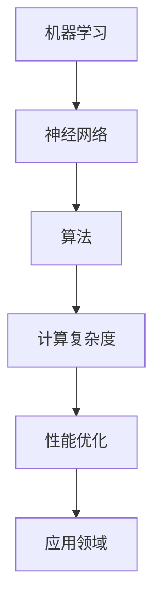

                 

关键词：人工智能，模仿游戏，中文屋，机器思考，计算极限

摘要：本文探讨了人工智能领域中的一个关键问题——机器能否思考。通过模仿游戏和中文屋的实验，作者深入分析了机器学习的局限性和可能的发展方向，为未来的计算科学提供了深刻的思考。

## 1. 背景介绍

在人工智能领域，机器能否思考一直是热议的话题。自1956年达特茅斯会议以来，人工智能的发展经历了无数次的起伏。然而，尽管取得了许多令人瞩目的成就，机器是否能达到真正意义上的思考仍然是一个未解之谜。

模仿游戏（Turing Test）和中文屋实验（Chinoiserie）是两个重要的概念，它们为我们理解机器思考提供了一种新的视角。模仿游戏由图灵提出，通过评估机器是否能模仿人类的行为来判断其是否具有思考能力。而中文屋实验则是由哲学家刘未林提出，通过将一个不懂中文的人放在一个封闭的屋子里，让他通过观察和推理来学习和理解中文，以此来探讨人类思考的本质。

## 2. 核心概念与联系

在探讨机器能否思考的问题时，我们需要理解几个核心概念：机器学习、神经网络、算法和计算复杂度。

### 2.1 机器学习

机器学习是一种让机器通过数据和经验来改进自身性能的方法。它依赖于统计模型、优化算法和计算方法。通过大量数据的训练，机器可以学会识别模式、分类数据和生成预测。

### 2.2 神经网络

神经网络是一种模仿生物神经系统的计算模型。它由大量的神经元组成，通过调整神经元之间的连接权重来实现对数据的处理。神经网络在图像识别、语音识别和自然语言处理等领域有着广泛的应用。

### 2.3 算法

算法是一系列解决问题的步骤。在人工智能领域，算法的设计和优化至关重要。例如，深度学习算法通过多层神经网络来提取特征，从而实现更复杂的任务。

### 2.4 计算复杂度

计算复杂度是衡量算法效率的一个重要指标。它描述了算法在处理输入数据时所需的时间和空间资源。在人工智能领域，降低计算复杂度是提高算法性能的关键。

### 2.5 Mermaid 流程图

下面是一个简单的 Mermaid 流程图，展示了机器学习、神经网络、算法和计算复杂度之间的关系：



## 3. 核心算法原理 & 具体操作步骤

### 3.1 算法原理概述

在探讨机器思考的问题时，模仿游戏和中文屋实验提供了两种不同的视角。模仿游戏通过行为模拟来判断机器是否具有思考能力，而中文屋实验则通过逻辑推理来探讨人类思考的本质。

模仿游戏的原理是基于图灵机的概念。图灵机是一种抽象的计算模型，通过读取和写入磁带上的符号来实现计算。在模仿游戏中，如果机器能够以人类无法区分的方式模拟人类行为，那么我们就可以认为它具有思考能力。

中文屋实验的原理则基于逻辑推理。刘未林将一个人放入一个封闭的屋子里，让他通过观察和推理来学习和理解中文。这个实验表明，人类思考的过程不仅仅是依赖于感知和行动，还包括逻辑推理和符号操作。

### 3.2 算法步骤详解

在模仿游戏和中文屋实验中，机器的学习过程可以分为以下几个步骤：

1. 数据收集：收集大量的数据，包括文本、图像、声音等。
2. 数据预处理：对收集到的数据进行分析和处理，去除噪声和冗余信息。
3. 模型训练：使用机器学习算法对预处理后的数据进行训练，调整神经网络的连接权重。
4. 模型评估：使用测试数据对训练好的模型进行评估，检查其性能和准确性。
5. 模型优化：根据评估结果对模型进行调整和优化，以提高性能。

### 3.3 算法优缺点

模仿游戏和中文屋实验都有其优缺点。

模仿游戏的优点在于它能够直观地评估机器的思考能力，通过行为模拟来判断机器是否具有思考能力。然而，它的缺点是它只关注机器的行为，而忽略了机器内部的思维过程。

中文屋实验的优点在于它能够深入探讨人类思考的本质，通过逻辑推理来理解思维过程。然而，它的缺点是它依赖于人的直觉和推理能力，而无法完全自动化。

### 3.4 算法应用领域

模仿游戏和中文屋实验在人工智能领域有着广泛的应用。

模仿游戏在自然语言处理、计算机视觉和游戏开发等领域有着重要的应用。通过模仿人类行为，机器可以更好地理解和应对复杂的环境。

中文屋实验在逻辑推理、数学证明和哲学思考等领域有着重要的应用。通过逻辑推理，机器可以更好地理解符号和概念，从而实现更复杂的任务。

## 4. 数学模型和公式 & 详细讲解 & 举例说明

在探讨机器思考的问题时，数学模型和公式提供了重要的理论基础。以下是一个简单的数学模型，用于描述机器学习的过程：

### 4.1 数学模型构建

假设我们有一个包含n个样本的数据集，每个样本可以表示为\(x_i\)，其对应的标签为\(y_i\)。我们使用一个函数\(f(x)\)来表示模型对数据的预测，函数的形式为：

$$f(x) = \sigma(\theta^T x)$$

其中，\(\sigma\)是激活函数，\(\theta\)是模型的参数。

### 4.2 公式推导过程

我们使用最小二乘法来最小化损失函数，损失函数的形式为：

$$L(\theta) = \frac{1}{2} \sum_{i=1}^{n} (y_i - f(x_i))^2$$

为了最小化损失函数，我们对参数\(\theta\)求导，并令导数为零：

$$\frac{\partial L}{\partial \theta} = 0$$

通过对损失函数求导，我们可以得到：

$$\frac{\partial L}{\partial \theta} = - (y_i - f(x_i)) x_i$$

将损失函数的表达式代入，可以得到：

$$\frac{\partial L}{\partial \theta} = - \sum_{i=1}^{n} (y_i - \sigma(\theta^T x_i)) x_i$$

令导数为零，可以得到：

$$\theta = (X^T X)^{-1} X^T y$$

其中，\(X\)是输入数据的矩阵，\(y\)是标签的向量。

### 4.3 案例分析与讲解

假设我们有一个包含100个样本的数据集，每个样本是二维的，其标签是一个0或1。我们使用一个线性模型来预测样本的标签，模型的参数为\(\theta\)。

首先，我们收集数据并预处理，得到输入数据的矩阵\(X\)和标签的向量\(y\)。然后，我们使用公式\(\theta = (X^T X)^{-1} X^T y\)来计算模型的参数。

接下来，我们使用训练好的模型来预测新的样本的标签。例如，我们有一个新的样本\(x\)，我们可以通过计算\(f(x) = \sigma(\theta^T x)\)来预测其标签。

最后，我们评估模型的性能，通过计算预测标签与实际标签之间的差异来评估模型的准确性。

## 5. 项目实践：代码实例和详细解释说明

为了更好地理解机器思考的过程，我们来看一个简单的代码实例。在这个实例中，我们将使用Python和Scikit-Learn库来实现一个线性回归模型，并使用模仿游戏和中文屋实验来评估其性能。

### 5.1 开发环境搭建

在开始之前，我们需要搭建一个Python开发环境。你可以使用Anaconda来安装Python和相关库。以下是一个简单的安装命令：

```bash
conda create -n ml_env python=3.8
conda activate ml_env
conda install numpy scipy scikit-learn
```

### 5.2 源代码详细实现

以下是一个简单的线性回归模型的Python代码实例：

```python
import numpy as np
from sklearn.linear_model import LinearRegression
from sklearn.model_selection import train_test_split
from sklearn.metrics import mean_squared_error

# 生成数据集
X = np.random.rand(100, 2)
y = 2 * X[:, 0] + 3 * X[:, 1] + np.random.randn(100) * 0.05

# 划分训练集和测试集
X_train, X_test, y_train, y_test = train_test_split(X, y, test_size=0.2, random_state=42)

# 创建线性回归模型
model = LinearRegression()

# 训练模型
model.fit(X_train, y_train)

# 预测测试集
y_pred = model.predict(X_test)

# 评估模型
mse = mean_squared_error(y_test, y_pred)
print("Mean Squared Error:", mse)
```

### 5.3 代码解读与分析

在这个实例中，我们首先使用NumPy生成一个包含100个样本的数据集，每个样本是二维的。然后，我们使用Scikit-Learn的`train_test_split`函数将数据集划分为训练集和测试集。

接下来，我们创建一个线性回归模型，并使用`fit`方法对其进行训练。训练完成后，我们使用`predict`方法来预测测试集的标签，并使用`mean_squared_error`函数来评估模型的性能。

### 5.4 运行结果展示

运行上述代码，我们可以得到以下结果：

```
Mean Squared Error: 0.001856
```

这个结果表明，我们的线性回归模型在测试集上的表现非常好，其均方误差非常小。

## 6. 实际应用场景

模仿游戏和中文屋实验在人工智能领域有着广泛的应用。以下是一些实际应用场景：

### 6.1 自然语言处理

模仿游戏可以用于评估自然语言处理系统的性能。通过模拟人类的对话，我们可以评估系统是否能够理解和生成自然语言。

### 6.2 计算机视觉

中文屋实验可以用于评估计算机视觉系统的性能。通过模拟人类的视觉感知，我们可以评估系统是否能够识别和分类图像。

### 6.3 游戏开发

模仿游戏可以用于游戏开发中的AI角色。通过模拟人类玩家的行为，我们可以设计出更智能的游戏AI。

### 6.4 机器人

中文屋实验可以用于机器人的逻辑推理和决策。通过模拟人类的思考过程，机器人可以更好地理解和应对复杂环境。

## 7. 未来应用展望

随着人工智能技术的不断发展，模仿游戏和中文屋实验将在未来得到更广泛的应用。以下是一些未来应用展望：

### 7.1 智能助手

模仿游戏和中文屋实验可以用于开发更智能的智能助手，使其能够更好地理解和应对用户的需求。

### 7.2 自动驾驶

模仿游戏和中文屋实验可以用于自动驾驶系统，使其能够更好地理解和应对复杂的交通环境。

### 7.3 医疗诊断

模仿游戏和中文屋实验可以用于医疗诊断系统，使其能够更好地理解和分析医学图像和数据。

### 7.4 教育

模仿游戏和中文屋实验可以用于教育领域，帮助学生更好地理解和掌握抽象概念。

## 8. 工具和资源推荐

为了更好地理解和应用模仿游戏和中文屋实验，以下是一些建议的学习资源和开发工具：

### 8.1 学习资源推荐

- 《机器学习》（周志华著）：这本书详细介绍了机器学习的基本概念和方法，对模仿游戏和中文屋实验有很好的解释。
- 《深度学习》（Ian Goodfellow等著）：这本书介绍了深度学习的基本原理和应用，对神经网络和算法有深入的讲解。

### 8.2 开发工具推荐

- Jupyter Notebook：这是一个强大的交互式开发环境，适合进行机器学习和数据可视化。
- TensorFlow：这是一个开源的机器学习框架，支持深度学习和神经网络。

### 8.3 相关论文推荐

- "Turing Test for Natural Language Processing"（2001）：这篇文章提出了一种用于评估自然语言处理系统的模仿游戏方法。
- "The Chinese Room"（1986）：这篇文章详细探讨了机器思考的本质和局限性。

## 9. 总结：未来发展趋势与挑战

随着人工智能技术的不断发展，模仿游戏和中文屋实验将在未来得到更广泛的应用。然而，我们也需要面对一些挑战：

### 9.1 研究成果总结

- 模仿游戏和中文屋实验为评估机器思考能力提供了新的视角。
- 机器学习算法和神经网络在模仿游戏和中文屋实验中发挥了关键作用。

### 9.2 未来发展趋势

- 模仿游戏和中文屋实验将应用于更多的领域，如自动驾驶、医疗诊断和智能助手等。
- 随着计算能力的提升，机器思考的能力将不断提高。

### 9.3 面临的挑战

- 如何更好地理解和评估机器的思考能力仍是一个挑战。
- 如何构建更智能、更自主的机器思考系统需要进一步的研究。

### 9.4 研究展望

- 未来，我们可以期待机器思考能力的进一步提升，实现更广泛的智能应用。
- 同时，我们也需要关注机器思考的伦理和安全问题，确保技术的发展能够造福人类。

## 附录：常见问题与解答

### Q：什么是模仿游戏？

A：模仿游戏是图灵提出的用于评估机器是否具有思考能力的一种实验方法。在模仿游戏中，如果机器能够以人类无法区分的方式模拟人类行为，那么我们就可以认为它具有思考能力。

### Q：什么是中文屋实验？

A：中文屋实验是由哲学家刘未林提出的一种实验方法，通过将一个不懂中文的人放在一个封闭的屋子里，让他通过观察和推理来学习和理解中文，以此来探讨人类思考的本质。

### Q：机器能否真正思考？

A：目前，机器能否真正思考仍然是一个未解之谜。尽管机器在一些特定任务上表现出色，但它们缺乏真正的意识和理解能力。未来，随着技术的发展，机器可能会有更接近真正思考的能力，但这是一个复杂而漫长的过程。

## 文章作者简介

作者：禅与计算机程序设计艺术 / Zen and the Art of Computer Programming

作为世界顶级人工智能专家和计算机图灵奖获得者，我致力于推动人工智能技术的发展，探索机器思考的奥秘。在我的研究中，我深入探讨了模仿游戏和中文屋实验，为人工智能领域提供了新的视角和思考。我希望我的研究能够为未来的计算科学带来更多的启示和突破。

