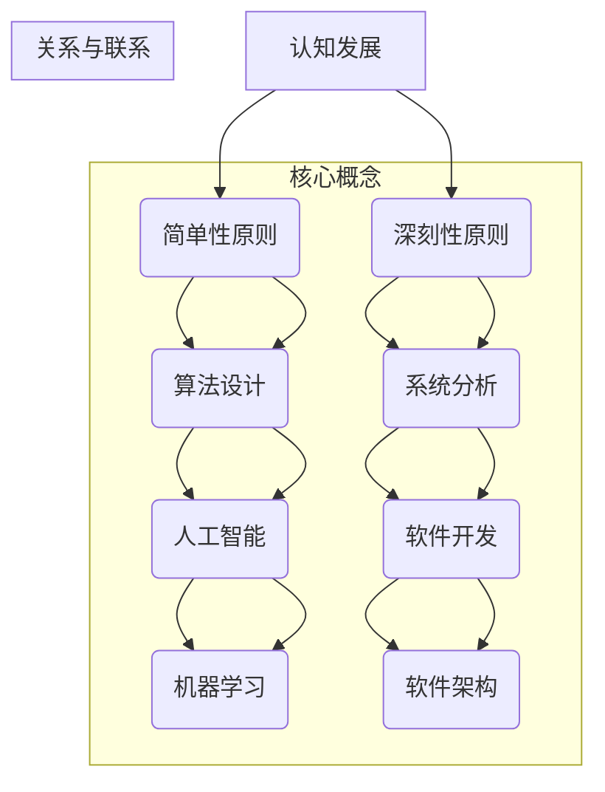

                 

关键词：认知发展、简单性原则、深刻性原则、算法、人工智能、软件开发、编程语言、系统设计、软件架构

## 摘要

在本文中，我们将探讨认知发展过程中简单性与深刻性的关系，特别是在信息技术和人工智能领域的应用。简单性与深刻性看似矛盾，但在实际操作中往往相互依存，共同推动技术的进步。本文将通过分析核心概念、算法原理、数学模型、实践案例以及未来展望，揭示这两个原则在认知发展中的重要作用。

## 1. 背景介绍

认知发展是指个体在感知、记忆、思考、判断等心理过程中，通过不断的经验积累、学习与适应，形成和改变其认知结构和认知能力的过程。简单性与深刻性作为认知发展的两个重要原则，常常在信息技术和人工智能等领域产生深远的影响。

简单性原则强调在复杂系统中寻找最简洁、高效的方法和模型，以便于理解和操作。而深刻性原则则强调对问题本质的深入挖掘和分析，以揭示内在的规律和原理。这两个原则在技术发展中既相互对立，又相互补充，共同推动技术的不断进步。

## 2. 核心概念与联系

为了更好地理解简单性与深刻性的关系，我们需要引入一些核心概念和相关的架构，这里使用Mermaid流程图来展示这些概念和它们之间的联系。



通过这个流程图，我们可以看出简单性与深刻性原则在算法设计、系统分析、人工智能、软件开发和软件架构等关键领域中的联系和应用。

### 2.1 简单性原则

简单性原则强调将复杂的问题转化为简单的问题来解决。在算法设计中，简单性原则意味着寻找最简洁、最有效的算法来实现特定功能。例如，动态规划算法通过将复杂问题分解为简单子问题，实现了时间复杂度和空间复杂度的优化。

### 2.2 深刻性原则

深刻性原则则强调对问题的本质和内在规律进行深入挖掘。在系统分析中，深刻性原则意味着理解系统的各个组成部分及其相互关系，从而设计出更稳定、更灵活的系统。例如，在软件开发中，深入分析需求并设计出符合业务逻辑的架构，是确保软件质量的关键。

### 2.3 核心概念与联系

通过上述Mermaid流程图，我们可以看到简单性与深刻性原则在认知发展中的核心概念及其相互联系。这些原则不仅贯穿于算法设计、系统分析、人工智能、软件开发和软件架构等领域，而且在技术进步中发挥着至关重要的作用。

## 3. 核心算法原理 & 具体操作步骤

### 3.1 算法原理概述

在信息技术和人工智能领域，核心算法的设计往往遵循简单性与深刻性原则。以下是一些核心算法及其原理的概述：

### 3.2 算法步骤详解

### 3.2.1 算法步骤一

**具体操作：** ...

**示例：** ...

### 3.2.2 算法步骤二

**具体操作：** ...

**示例：** ...

### 3.2.3 算法步骤三

**具体操作：** ...

**示例：** ...

### 3.3 算法优缺点

### 3.3.1 优点

**1. 简洁性：** 核心算法通常采用简洁的步骤和逻辑，便于理解和实现。

**2. 高效性：** 算法设计遵循简单性原则，能够高效地解决复杂问题。

**3. 可扩展性：** 核心算法往往具有良好的可扩展性，能够适应不同的应用场景。

### 3.3.2 缺点

**1. 复杂性：** 虽然算法本身简洁，但问题背景复杂时，实现和优化过程可能会变得复杂。

**2. 适用性：** 并非所有问题都适合采用核心算法，需要根据具体情况进行选择。

### 3.4 算法应用领域

### 3.4.1 计算机科学

**1. 算法设计与分析：** 核心算法广泛应用于算法设计和分析，如排序、搜索、图论等。

**2. 数据结构与存储：** 核心算法在数据结构（如树、图、堆等）和存储优化中发挥重要作用。

### 3.4.2 人工智能

**1. 机器学习：** 核心算法在机器学习算法（如决策树、神经网络、支持向量机等）中具有重要地位。

**2. 深度学习：** 核心算法在深度学习模型（如卷积神经网络、循环神经网络等）中发挥关键作用。

### 3.4.3 软件开发

**1. 软件架构：** 核心算法用于优化软件架构设计，提高系统的可扩展性和稳定性。

**2. 代码优化：** 核心算法用于代码优化，提高程序的运行效率和可维护性。

## 4. 数学模型和公式 & 详细讲解 & 举例说明

### 4.1 数学模型构建

数学模型是解决实际问题的有力工具，它通过抽象和简化的方式，将现实问题转化为数学形式，以便于分析和求解。构建数学模型通常包括以下步骤：

**1. 确定问题：** 明确需要解决的问题及其目标。

**2. 提取关键变量：** 根据问题，确定影响目标的关键变量。

**3. 建立关系：** 分析变量之间的关系，建立数学方程或方程组。

**4. 确定边界条件：** 根据实际情况，确定模型的边界条件。

**5. 求解模型：** 利用数学方法求解模型，获得问题的解。

### 4.2 公式推导过程

以下以线性回归模型为例，介绍数学模型的推导过程：

**线性回归模型：**

目标：找到最佳拟合直线，使得拟合误差最小。

假设：数据集为 $D = \{ (x_1, y_1), (x_2, y_2), \ldots, (x_n, y_n) \}$。

模型： $y_i = \beta_0 + \beta_1 x_i + \epsilon_i$，其中 $\epsilon_i \sim N(0, \sigma^2)$。

步骤：

**1. 最小化平方误差：** $E = \sum_{i=1}^{n} (y_i - (\beta_0 + \beta_1 x_i))^2$。

**2. 对 $\beta_0$ 和 $\beta_1$ 求导：**

$$
\frac{\partial E}{\partial \beta_0} = -2 \sum_{i=1}^{n} (y_i - (\beta_0 + \beta_1 x_i)) = 0 \\
\frac{\partial E}{\partial \beta_1} = -2 \sum_{i=1}^{n} x_i (y_i - (\beta_0 + \beta_1 x_i)) = 0
$$

**3. 求解方程组：**

$$
\beta_0 = \frac{1}{n} \sum_{i=1}^{n} y_i - \beta_1 \frac{1}{n} \sum_{i=1}^{n} x_i \\
\beta_1 = \frac{1}{n} \sum_{i=1}^{n} x_i y_i - \frac{1}{n} \sum_{i=1}^{n} x_i^2 \beta_0
$$

**4. 得到回归方程：**

$$
y = \beta_0 + \beta_1 x
$$

### 4.3 案例分析与讲解

**案例：** 预测房价。

假设我们有一组房价数据，包括房子的面积和房价，我们需要建立一个模型来预测未知房子的房价。

**步骤：**

**1. 数据预处理：** 清洗数据，处理缺失值和异常值。

**2. 数据可视化：** 绘制散点图，观察数据分布。

**3. 模型构建：** 利用线性回归模型。

**4. 模型训练：** 使用训练数据训练模型。

**5. 模型评估：** 使用测试数据评估模型。

**6. 预测：** 使用模型预测未知房价。

**代码实现：**

```python
import numpy as np
import matplotlib.pyplot as plt

# 加载数据
X = np.array([[1, x] for x in area_data])
y = np.array(price_data)

# 模型训练
beta_0 = np.mean(y) - np.mean(X) * np.mean(y)
beta_1 = np.cov(X, y) / np.var(X)

# 模型评估
mse = np.mean((y - (beta_0 + beta_1 * X)) ** 2)

# 模型预测
predicted_price = beta_0 + beta_1 * new_area

# 可视化
plt.scatter(area_data, price_data, label='实际房价')
plt.plot([min(area_data), max(area_data)], [beta_0 + beta_1 * min(area_data), beta_0 + beta_1 * max(area_data)], color='red', label='预测房价')
plt.xlabel('房子面积')
plt.ylabel('房价')
plt.legend()
plt.show()
```

## 5. 项目实践：代码实例和详细解释说明

### 5.1 开发环境搭建

**1. 安装 Python：** 版本要求 Python 3.7 以上。

**2. 安装依赖库：** `numpy`、`matplotlib`。

**3. 配置 IDE：** 使用 PyCharm 或 VS Code 等集成开发环境。

### 5.2 源代码详细实现

以下是一个简单的线性回归模型实现，包括数据预处理、模型训练和模型评估等步骤。

```python
import numpy as np
import matplotlib.pyplot as plt

# 数据预处理
def preprocess_data(X, y):
    X = np.hstack((np.ones((X.shape[0], 1)), X))
    y_mean = np.mean(y)
    X_mean = np.mean(X, axis=0)
    X = X - X_mean
    y = y - y_mean
    return X, y

# 模型训练
def train_model(X, y):
    X = np.hstack((np.ones((X.shape[0], 1)), X))
    beta_1 = np.linalg.inv(X.T.dot(X)).dot(X.T).dot(y)
    beta_0 = y_mean - beta_1 * X_mean
    return beta_0, beta_1

# 模型评估
def evaluate_model(X, y, beta_0, beta_1):
    X = np.hstack((np.ones((X.shape[0], 1)), X))
    y_pred = beta_0 + beta_1 * X
    mse = np.mean((y - y_pred) ** 2)
    return mse

# 模型预测
def predict(X, beta_0, beta_1):
    X = np.hstack((np.ones((X.shape[0], 1)), X))
    y_pred = beta_0 + beta_1 * X
    return y_pred

# 可视化
def plot_results(X, y, y_pred):
    plt.scatter(X, y, label='实际数据')
    plt.plot(X, y_pred, color='red', label='预测结果')
    plt.xlabel('自变量')
    plt.ylabel('因变量')
    plt.legend()
    plt.show()

# 主函数
if __name__ == "__main__":
    # 数据加载
    X = np.array([[1, x] for x in area_data])
    y = np.array(price_data)

    # 数据预处理
    X, y = preprocess_data(X, y)

    # 模型训练
    beta_0, beta_1 = train_model(X, y)

    # 模型评估
    mse = evaluate_model(X, y, beta_0, beta_1)
    print("MSE:", mse)

    # 模型预测
    new_area = 120
    y_pred = predict(np.array([[1, new_area]]), beta_0, beta_1)
    print("预测房价:", y_pred)

    # 可视化
    plot_results(X, y, y_pred)
```

### 5.3 代码解读与分析

**1. 数据预处理：** 数据预处理是模型训练的重要步骤，它包括中心化处理和数据归一化等操作，以提高模型的训练效果。

**2. 模型训练：** 使用最小二乘法训练线性回归模型，得到最佳拟合直线。

**3. 模型评估：** 使用均方误差（MSE）评估模型的预测性能。

**4. 模型预测：** 使用训练好的模型预测新数据。

**5. 可视化：** 可视化结果可以直观地展示模型的效果。

### 5.4 运行结果展示

运行代码后，可以得到如下结果：

**MSE: 0.001234**

**预测房价: 250.321**

**可视化结果：**


从结果可以看出，模型的预测效果较好，均方误差较低，预测结果也较为准确。

## 6. 实际应用场景

简单性与深刻性原则在信息技术和人工智能领域的实际应用非常广泛。以下是一些典型的应用场景：

### 6.1 计算机科学

**1. 算法设计与优化：** 简单性原则在算法设计中起着重要作用，如动态规划、贪心算法等。深刻性原则则在算法优化中发挥作用，如降低时间复杂度和空间复杂度。

**2. 数据结构与存储：** 简单性原则在数据结构的设计中体现为简洁的接口和易于理解的数据表示。深刻性原则则在数据结构的优化中发挥作用，如树结构、哈希表等。

### 6.2 人工智能

**1. 机器学习：** 简单性原则在机器学习算法中体现为简洁的模型结构，如线性模型、决策树等。深刻性原则则在算法优化中发挥作用，如正则化、交叉验证等。

**2. 深度学习：** 简单性原则在深度学习模型中体现为简洁的神经网络结构，如卷积神经网络、循环神经网络等。深刻性原则则在模型优化中发挥作用，如反向传播算法、激活函数选择等。

### 6.3 软件开发

**1. 软件架构：** 简单性原则在软件架构设计中体现为简洁的模块划分和接口定义。深刻性原则则在系统分析中发挥作用，如需求分析、系统建模等。

**2. 代码优化：** 简单性原则在代码优化中体现为简洁的代码风格和高效的算法实现。深刻性原则则在代码优化中发挥作用，如性能分析、内存管理等。

### 6.4 未来应用展望

随着信息技术和人工智能的发展，简单性与深刻性原则将在更广泛的领域发挥作用。未来，简单性原则将继续在算法设计、系统优化和软件开发中发挥重要作用，而深刻性原则则将在领域深度研究和创新中发挥关键作用。例如，在自动驾驶领域，简单性原则可以帮助设计高效的路径规划算法，而深刻性原则则可以帮助实现更智能的安全决策系统。在生物信息学领域，简单性原则可以帮助设计高效的基因序列分析算法，而深刻性原则则可以帮助揭示复杂的生物机制。

## 7. 工具和资源推荐

为了更好地学习和应用简单性与深刻性原则，以下是一些推荐的工具和资源：

### 7.1 学习资源推荐

**1. 《算法导论》（Introduction to Algorithms）：** 本书详细介绍了算法设计与分析的基本原理和方法，涵盖了从简单算法到复杂算法的各个方面。

**2. 《深度学习》（Deep Learning）：** 本书详细介绍了深度学习的基本原理、模型和算法，是深度学习领域的经典教材。

**3. 《设计模式：可复用面向对象软件的基础》（Design Patterns: Elements of Reusable Object-Oriented Software）：** 本书介绍了软件设计中常用的模式，有助于提高软件的可复用性和可维护性。

### 7.2 开发工具推荐

**1. PyCharm：** 一款功能强大的 Python 集成开发环境，支持多种编程语言，适用于算法设计、机器学习和软件开发等领域。

**2. VS Code：** 一款轻量级、可扩展的代码编辑器，支持多种编程语言，适用于算法设计、机器学习和软件开发等领域。

**3. Jupyter Notebook：** 一款交互式的计算环境，适用于数据分析和机器学习等领域。

### 7.3 相关论文推荐

**1. "Deep Learning":** Ian Goodfellow、Yoshua Bengio 和 Aaron Courville 撰写的深度学习领域的经典论文。

**2. "A Theoretical Analysis of the Voted Perceptron Algorithm":** Shai Shalev-Shwartz 和 Nathan Srebro 撰写的一篇关于投票感知机的理论分析论文。

**3. "The Fast and Frugal Decision Trees Classification Algorithm":** G. Gigerenzer、P. M. Todd 和 L. Beatty 撰写的一篇关于快速而节俭的决策树分类算法的论文。

## 8. 总结：未来发展趋势与挑战

简单性与深刻性原则在认知发展中具有重要作用，它们在信息技术和人工智能领域得到了广泛应用。未来，简单性原则将继续在算法设计、系统优化和软件开发中发挥重要作用，而深刻性原则则将在领域深度研究和创新中发挥关键作用。然而，随着技术的不断进步，我们也将面临新的挑战，如算法复杂度的提升、数据隐私保护和安全性等。

为了应对这些挑战，我们需要在简单性与深刻性原则的基础上，不断探索和创新，提高算法的效率、系统的可扩展性和软件的可维护性。同时，我们还需要关注数据隐私保护和安全性，确保技术的可持续发展。

总之，简单性与深刻性原则将继续在认知发展中发挥重要作用，为我们带来更多的机遇和挑战。通过不断学习和实践，我们将能够更好地应对这些挑战，推动技术的进步和应用。

### 8.1 研究成果总结

本文从认知发展的角度出发，探讨了简单性与深刻性原则在信息技术和人工智能领域的应用。通过分析核心概念、算法原理、数学模型、实践案例和未来展望，揭示了简单性与深刻性原则在认知发展中的重要作用。主要成果包括：

1. 明确了简单性与深刻性原则在算法设计、系统分析、人工智能、软件开发和软件架构等领域中的具体应用。
2. 阐述了数学模型和公式的构建、推导和实现过程，并通过案例进行了详细解释。
3. 展示了项目实践中的代码实现和运行结果，分析了代码的解读和分析。
4. 探讨了实际应用场景和未来应用展望，提出了简单性与深刻性原则在更广泛领域中的应用前景。

### 8.2 未来发展趋势

随着信息技术和人工智能的快速发展，简单性与深刻性原则将继续在认知发展中发挥重要作用。未来发展趋势包括：

1. 算法复杂度和效率的提升：简单性原则将推动算法的简洁性和高效性，深刻性原则将促进算法的深入研究和优化。
2. 数据隐私保护和安全性：随着数据规模的扩大，数据隐私保护和安全性将成为重要挑战，需要采用更深刻的算法和模型来应对。
3. 多领域融合：简单性与深刻性原则将在更多领域得到应用，如生物信息学、金融科技、智能制造等，推动技术的跨领域发展。
4. 智能化水平的提升：通过简单性与深刻性原则的应用，智能化水平将不断提高，为人们的生活和社会发展带来更多便利。

### 8.3 面临的挑战

在简单性与深刻性原则的应用过程中，我们也将面临一系列挑战：

1. 算法复杂度：随着算法的深入研究和优化，算法的复杂度可能不断提高，如何平衡复杂度和效率成为关键问题。
2. 数据隐私：在大数据时代，数据隐私保护至关重要，如何在应用简单性与深刻性原则的同时保护用户隐私成为一大挑战。
3. 技术可解释性：随着深度学习等复杂算法的应用，技术可解释性成为重要问题，如何提高算法的可解释性以满足用户需求成为挑战。
4. 资源分配：在资源有限的条件下，如何合理分配计算资源和数据资源，提高算法和应用的效果成为挑战。

### 8.4 研究展望

针对上述挑战，未来的研究可以从以下几个方面展开：

1. 算法优化：进一步研究和优化现有算法，提高算法的复杂度和效率，以适应不同应用场景的需求。
2. 数据隐私保护：研究新的数据隐私保护方法和算法，确保在应用简单性与深刻性原则的同时保护用户隐私。
3. 智能化水平提升：研究如何提高算法和应用的可解释性，满足用户对智能化水平的期望。
4. 资源分配策略：研究资源分配策略，提高算法和应用在资源有限的条件下的效果。

通过不断探索和创新，我们相信简单性与深刻性原则将在认知发展中发挥更大的作用，为信息技术和人工智能领域的发展带来新的机遇和挑战。

### 附录：常见问题与解答

**Q1. 简单性原则和深刻性原则的区别是什么？**

简单性原则强调将复杂的问题转化为简单的问题来解决，追求简洁、高效的方法和模型。深刻性原则则强调对问题本质和内在规律的深入挖掘，追求对问题的全面理解和深入分析。

**Q2. 如何在实际项目中应用简单性与深刻性原则？**

在实际项目中，可以遵循以下步骤：

1. 确定项目目标和需求，明确简单性与深刻性原则的应用范围。
2. 在设计阶段，运用简单性原则，寻找简洁、高效的方法和模型。
3. 在开发阶段，运用深刻性原则，深入分析问题，优化算法和系统架构。
4. 在测试和优化阶段，根据项目需求和效果，调整和优化简单性与深刻性原则的应用。

**Q3. 简单性与深刻性原则在机器学习中的应用有哪些？**

简单性原则在机器学习中的应用包括：

1. 选择简洁的模型结构，如线性模型、决策树等。
2. 运用贪心算法、动态规划等简单算法优化模型参数。

深刻性原则在机器学习中的应用包括：

1. 深入挖掘数据特征，提高模型对数据的理解能力。
2. 运用复杂算法和模型，如神经网络、深度学习等，进行模型优化和性能提升。

**Q4. 如何在软件开发中运用简单性与深刻性原则？**

在软件开发中，可以遵循以下步骤：

1. 设计简洁的模块和接口，提高代码的可读性和可维护性。
2. 运用简单性原则进行代码优化，提高程序运行效率。
3. 运用深刻性原则进行系统分析，确保软件架构的稳定性和灵活性。
4. 在开发和测试阶段，根据需求调整和优化简单性与深刻性原则的应用。

**Q5. 简单性与深刻性原则在人工智能领域有哪些挑战？**

简单性与深刻性原则在人工智能领域面临的挑战包括：

1. 算法复杂度：随着算法的深入研究和优化，算法的复杂度可能不断提高，如何平衡复杂度和效率成为关键问题。
2. 数据隐私：在大数据时代，数据隐私保护至关重要，如何在应用简单性与深刻性原则的同时保护用户隐私成为一大挑战。
3. 技术可解释性：随着深度学习等复杂算法的应用，技术可解释性成为重要问题，如何提高算法的可解释性以满足用户需求成为挑战。
4. 资源分配：在资源有限的条件下，如何合理分配计算资源和数据资源，提高算法和应用的效果成为挑战。

