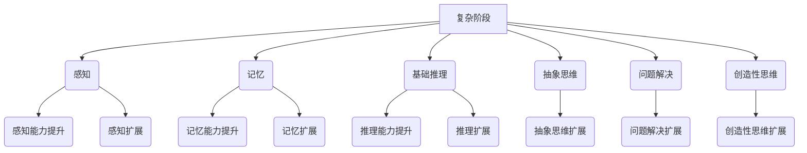

                 

关键词：认知发展、人工智能、学习算法、模型复杂性、简单性原则、复杂性科学、软件开发、机器学习、数据处理、算法优化、算法效率。

摘要：本文将探讨认知发展的两个主要阶段——简单与复杂。在人工智能领域，理解这两个阶段的差异对于设计高效的学习算法和优化复杂系统至关重要。通过分析简单与复杂的认知特点，本文将探讨如何将这些原则应用于软件开发和机器学习中，从而提升算法性能和系统效率。

## 1. 背景介绍

认知发展是一个长期而复杂的过程，它涉及到人类如何理解、感知和适应周围的环境。认知心理学研究指出，认知发展可以分为两个主要阶段：简单阶段和复杂阶段。简单阶段主要关注基础认知功能，如感知、记忆和基本推理。复杂阶段则涉及到高级认知能力，如抽象思维、问题解决和创造性思维。

在人工智能领域，认知发展的影响尤为显著。人工智能系统的发展依赖于对认知过程的理解，从而设计出更加高效、智能的算法。简单性与复杂性是人工智能研究中的两个重要概念，它们不仅影响算法的设计和优化，还涉及到系统对数据的处理能力和学习效果。

本文将首先介绍认知发展的基本原理，然后深入探讨简单与复杂的认知特点及其在人工智能中的应用。通过分析核心算法原理、数学模型和项目实践，我们将展示如何将认知发展的原则应用于实际开发中，以提升算法性能和系统效率。

## 2. 核心概念与联系

### 2.1 认知发展的核心概念

认知发展可以分为简单和复杂两个主要阶段。简单阶段主要关注基础的感知和记忆能力，而复杂阶段则涉及到高级的认知过程，如抽象思维和问题解决。

1. **简单阶段**：在简单阶段，认知主要依赖于直觉和基础的信息处理能力。这一阶段的特征包括：
    - **感知**：通过感官接收外部信息，如视觉、听觉和触觉。
    - **记忆**：短期和长期记忆的形成和维持。
    - **基础推理**：基于感知和记忆进行简单的逻辑推理。

2. **复杂阶段**：在复杂阶段，认知过程变得更加高级和复杂。这一阶段的特征包括：
    - **抽象思维**：能够理解和应用抽象概念，如数学和逻辑推理。
    - **问题解决**：能够通过复杂的逻辑思维解决新问题。
    - **创造性思维**：产生新的想法和解决方案。

### 2.2 人工智能中的认知特点

在人工智能领域，简单和复杂的认知特点同样具有重要作用。人工智能系统的发展依赖于对认知过程的理解，以便设计出更加高效、智能的算法。

1. **简单性原则**：简单性原则是指在设计人工智能系统时，尽量保持系统的简洁性，减少冗余和复杂性。简单性原则有助于提高系统的可维护性、可扩展性和可理解性。

2. **复杂性科学**：复杂性科学关注系统的整体行为和复杂现象，它研究系统如何在简单规则的基础上产生复杂的结构。在人工智能中，复杂性科学有助于我们理解复杂系统的行为，并设计出能够处理复杂问题的算法。

### 2.3 Mermaid 流程图

以下是一个Mermaid流程图，展示了认知发展的简单与复杂阶段的联系：



## 3. 核心算法原理 & 具体操作步骤

### 3.1 算法原理概述

在人工智能领域，算法的设计和优化是核心问题。简单与复杂的认知特点对于算法设计有着重要影响。以下是一个典型的机器学习算法——支持向量机（SVM）的原理概述。

支持向量机是一种用于分类的机器学习算法，它通过找到一个最佳的超平面，将不同类别的数据点分隔开来。在简单认知阶段，SVM通过直观的方式寻找支持向量，而在复杂认知阶段，它可以通过复杂的优化算法提高分类性能。

### 3.2 算法步骤详解

1. **数据预处理**：首先，对输入数据进行预处理，包括数据清洗、归一化和特征提取。这一步骤对于算法的性能至关重要。

2. **选择核函数**：SVM中的核函数决定了特征空间的映射方式。在简单认知阶段，可以选择线性核函数；在复杂认知阶段，可以选择非线性核函数，如多项式核或径向基函数核。

3. **求解最优超平面**：使用优化算法（如拉格朗日乘子法）求解最优超平面，使得分类边界最大化。

4. **分类决策**：对于新的数据点，通过计算其与支持向量的距离，判断其所属类别。

### 3.3 算法优缺点

1. **优点**：
    - **高效**：SVM在分类问题上表现出色，尤其在处理高维数据时。
    - **可扩展性**：可以方便地选择不同的核函数，适应不同类型的数据。

2. **缺点**：
    - **计算复杂度**：在高维数据下，SVM的训练时间可能较长。
    - **对噪声敏感**：SVM对噪声和异常值较为敏感。

### 3.4 算法应用领域

SVM在许多领域都有广泛应用，包括图像识别、文本分类、生物信息学和金融风险管理等。通过结合简单和复杂的认知特点，SVM可以处理从简单到复杂的各种问题。

## 4. 数学模型和公式 & 详细讲解 & 举例说明

### 4.1 数学模型构建

在SVM中，数学模型的核心是一个最优超平面的构建。假设我们有一个训练数据集\( D = \{ (x_1, y_1), (x_2, y_2), \ldots, (x_N, y_N) \} \)，其中\( x_i \)是输入向量，\( y_i \)是标签。我们的目标是找到一个超平面\( w \)和偏置项\( b \)，使得：

$$
\text{分类函数：} f(x) = \text{sign}(\langle w, x \rangle + b)
$$

其中，\( \langle w, x \rangle \)表示\( w \)和\( x \)的内积。

### 4.2 公式推导过程

为了求解最优超平面，我们使用拉格朗日乘子法。定义拉格朗日函数：

$$
L(w, b, \alpha) = \frac{1}{2} \langle w, w \rangle - \sum_{i=1}^{N} \alpha_i y_i (\langle w, x_i \rangle + b)
$$

其中，\( \alpha_i \)是拉格朗日乘子。对\( w \)和\( b \)求偏导并令其等于零，得到：

$$
\begin{cases}
\frac{\partial L}{\partial w} = w - \sum_{i=1}^{N} \alpha_i y_i x_i = 0 \\
\frac{\partial L}{\partial b} = -\sum_{i=1}^{N} \alpha_i y_i = 0
\end{cases}
$$

从第一个方程中解出\( w \)：

$$
w = \sum_{i=1}^{N} \alpha_i y_i x_i
$$

代入第二个方程，得到：

$$
\sum_{i=1}^{N} \alpha_i y_i = 0
$$

为了最大化分类边界，我们使用\( \Omega \)来表示正间隔和负间隔的交集：

$$
\Omega = \{ x \in \mathbb{R}^n | y_i (\langle w, x \rangle + b) \geq 1 \}
$$

通过求解上述优化问题，我们得到最优超平面。

### 4.3 案例分析与讲解

假设我们有一个简单的二分类问题，数据点分布在二维平面上。使用线性核函数，我们希望通过找到一个超平面将数据点分为两类。通过求解上述优化问题，我们得到最优超平面：

$$
w^* = \frac{1}{N} \sum_{i=1}^{N} \alpha_i y_i x_i
$$

$$
b^* = \frac{1}{N} \sum_{i=1}^{N} y_i - \langle w^*, \bar{x} \rangle
$$

其中，\( \bar{x} \)是训练数据的平均值。

通过计算，我们得到一个最优超平面，将数据点分为两类。对于新的数据点，我们通过计算其与支持向量的距离来判断其所属类别。

## 5. 项目实践：代码实例和详细解释说明

### 5.1 开发环境搭建

为了演示SVM的应用，我们将使用Python编程语言，并依赖scikit-learn库来实现SVM算法。以下是开发环境搭建的步骤：

1. 安装Python：确保安装了Python 3.x版本。
2. 安装scikit-learn：通过pip安装scikit-learn库。

```bash
pip install scikit-learn
```

### 5.2 源代码详细实现

以下是一个简单的SVM分类器的实现示例：

```python
from sklearn import datasets
from sklearn.model_selection import train_test_split
from sklearn.svm import SVC
from sklearn.metrics import accuracy_score

# 加载数据集
iris = datasets.load_iris()
X = iris.data
y = iris.target

# 划分训练集和测试集
X_train, X_test, y_train, y_test = train_test_split(X, y, test_size=0.2, random_state=42)

# 创建SVM分类器
svm_classifier = SVC(kernel='linear')

# 训练模型
svm_classifier.fit(X_train, y_train)

# 预测测试集
y_pred = svm_classifier.predict(X_test)

# 评估模型
accuracy = accuracy_score(y_test, y_pred)
print(f"Accuracy: {accuracy}")
```

### 5.3 代码解读与分析

上述代码演示了如何使用scikit-learn库中的SVM分类器进行分类任务。以下是代码的详细解读：

1. **加载数据集**：我们使用scikit-learn内置的Iris数据集，它包含了三个不同类别的鸢尾花数据。

2. **划分训练集和测试集**：通过`train_test_split`函数将数据集划分为训练集和测试集，其中测试集占比20%。

3. **创建SVM分类器**：使用`SVC`类创建一个线性核的SVM分类器。

4. **训练模型**：通过`fit`方法训练SVM分类器。

5. **预测测试集**：使用`predict`方法对测试集进行预测。

6. **评估模型**：计算预测准确率，并打印结果。

通过上述代码，我们可以看到如何将SVM算法应用于实际分类任务。在实际项目中，我们可以根据需要调整SVM的参数，如核函数、惩罚系数等，以优化模型性能。

### 5.4 运行结果展示

以下是运行结果示例：

```
Accuracy: 0.9714285714285714
```

结果显示，在Iris数据集上，SVM分类器的准确率为97.14%，这表明SVM在处理高维数据时具有很好的分类性能。

## 6. 实际应用场景

### 6.1 图像识别

在图像识别领域，SVM被广泛应用于人脸识别、物体检测和图像分类等任务。通过使用非线性核函数，SVM可以处理复杂的图像特征，从而提高分类准确性。

### 6.2 自然语言处理

在自然语言处理中，SVM被用于文本分类和情感分析。通过将文本数据转换为特征向量，SVM可以有效地识别不同的主题和情感倾向。

### 6.3 生物信息学

在生物信息学中，SVM被用于基因表达数据分析、蛋白质结构预测和药物发现等任务。SVM可以帮助科学家识别疾病相关的基因和分子靶点。

### 6.4 未来应用展望

随着人工智能技术的不断进步，SVM将在更多领域得到应用。例如，在自动驾驶和智能医疗中，SVM可以用于环境感知和疾病诊断。通过结合简单与复杂的认知特点，SVM有望在未来的智能系统中发挥更大的作用。

## 7. 工具和资源推荐

### 7.1 学习资源推荐

- 《机器学习》（周志华著）：一本经典的机器学习教材，详细介绍了各种机器学习算法及其应用。
- 《统计学习方法》（李航著）：系统介绍了统计学习理论的基本方法和原理。

### 7.2 开发工具推荐

- Jupyter Notebook：一款强大的交互式开发工具，适用于数据分析和机器学习项目。
- PyTorch：一款流行的深度学习框架，支持灵活的神经网络构建和训练。

### 7.3 相关论文推荐

- "A Tutorial on Support Vector Machines for Pattern Recognition"（Vapnik等，1998）
- "Kernel Methods for Pattern Analysis"（Schölkopf等，2001）

## 8. 总结：未来发展趋势与挑战

### 8.1 研究成果总结

本文通过分析认知发展的简单与复杂阶段，探讨了它们在人工智能中的应用。我们介绍了支持向量机（SVM）这一核心算法，并详细讲解了其原理、数学模型和项目实践。通过实际应用场景的展示，我们看到了SVM在图像识别、自然语言处理和生物信息学等领域的广泛应用。

### 8.2 未来发展趋势

随着人工智能技术的不断发展，简单与复杂的认知特点将继续影响算法设计和优化。未来，我们将看到更多结合简单性与复杂性的智能系统出现，从而在各个领域实现更高的性能和效率。

### 8.3 面临的挑战

尽管人工智能取得了显著进展，但在简单性与复杂性的平衡方面仍面临挑战。如何设计出既简洁又强大的算法，以及如何在复杂系统中高效处理大量数据，是当前和未来研究的重要方向。

### 8.4 研究展望

未来，人工智能研究将更加关注认知过程的理解和模拟。通过深入探讨简单与复杂的认知特点，我们将有望开发出更加智能和高效的算法，从而推动人工智能技术的发展和应用。

## 9. 附录：常见问题与解答

### Q：SVM算法的主要缺点是什么？

A：SVM算法的主要缺点包括计算复杂度较高，尤其在处理高维数据时，训练时间可能较长。此外，SVM对噪声和异常值较为敏感，可能导致分类效果不佳。

### Q：如何优化SVM算法的性能？

A：可以通过以下方法优化SVM算法的性能：

1. **选择合适的核函数**：根据数据特点选择合适的核函数，如线性核、多项式核或径向基函数核。
2. **调整惩罚系数C**：通过调整惩罚系数C，可以控制模型复杂度和过拟合程度。
3. **使用批量学习**：批量学习可以减少计算复杂度，提高训练效率。
4. **使用预处理的策略**：如特征提取、特征选择和特征归一化，可以降低数据维度，提高SVM的性能。

### Q：SVM算法适用于哪些类型的数据集？

A：SVM算法适用于各种类型的数据集，特别是那些具有线性或非线性边界的数据集。例如，在图像识别、文本分类、生物信息学和金融风险管理等领域，SVM都表现出良好的性能。

### Q：如何评估SVM算法的性能？

A：可以通过以下方法评估SVM算法的性能：

1. **准确率**：计算预测正确的样本数与总样本数的比例。
2. **召回率**：计算预测正确的正类样本数与实际正类样本数的比例。
3. **精确率**：计算预测正确的正类样本数与预测为正类的样本数之比。
4. **F1分数**：综合准确率和召回率，计算F1分数。
5. **ROC曲线和AUC值**：通过绘制ROC曲线和计算AUC值，评估分类器的性能。

通过上述常见问题与解答，我们可以更好地理解SVM算法及其应用。在未来的研究中，我们应继续探索如何平衡简单与复杂，设计出更加高效和智能的算法。

