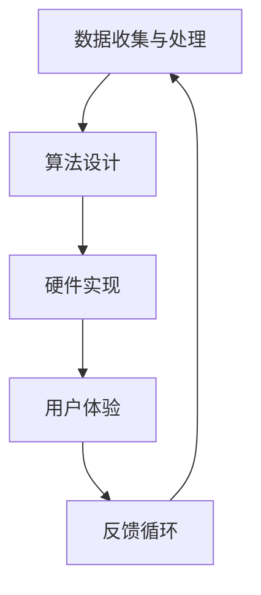

                 

关键词：认知增强技术、伦理问题、隐私保护、算法公平性、未来展望

> 摘要：随着人工智能技术的飞速发展，认知增强技术正逐渐成为提升人类认知能力的重要工具。然而，这种技术也引发了一系列伦理问题，包括隐私保护、算法公平性和技术滥用等。本文旨在深入探讨认知增强技术的伦理考量，并提出可能的解决方案，以促进技术的健康发展。

## 1. 背景介绍

### 认知增强技术的定义

认知增强技术（Cognitive Enhancement Technology）是指利用各种手段来增强人类的认知能力，包括记忆、注意力、学习速度和创造力等。这些技术可以通过生物、化学、物理、神经科学和计算机科学等多个领域来实现。例如，通过神经反馈、药物、脑机接口和认知训练等方式，可以提升人类在大脑和认知功能方面的表现。

### 认知增强技术的发展

自20世纪末以来，认知增强技术得到了广泛关注。特别是在人工智能和神经科学领域，研究人员不断探索如何通过技术手段提升人类的认知能力。例如，Nootropic药物（俗称“智慧药”）的开发，以及基于脑机接口的技术应用，都为认知增强技术提供了新的可能性。

### 认知增强技术的应用场景

认知增强技术已经在许多领域得到应用，包括军事、教育、医疗和企业等。例如，在军事领域，认知增强技术被用于提升士兵的记忆力和决策能力；在教育领域，认知训练软件被用于提高学生的学术成绩；在医疗领域，认知增强技术可以帮助医生提高诊断准确率；在企业领域，认知增强技术被用于提高员工的创造力和工作效率。

## 2. 核心概念与联系

### 认知增强技术的基本概念

认知增强技术涉及多个核心概念，包括记忆增强、注意力增强、学习速度提升和创造力提升等。这些概念构成了认知增强技术的理论基础。

#### 内存增强

内存增强是指通过技术手段提高记忆力和信息存储能力。这可以通过多种方式实现，例如，使用记忆增强药物、认知训练软件或脑机接口技术。

#### 注意力增强

注意力增强是指提高个体对特定信息的关注度和处理能力。这可以通过神经反馈训练、认知训练游戏或特殊的学习环境来实现。

#### 学习速度提升

学习速度提升是指通过技术手段加快信息学习和处理的速度。例如，通过使用快速阅读软件或脑机接口技术，可以加快学习过程。

#### 创造力提升

创造力提升是指通过技术手段激发个体的创造潜能。这可以通过认知训练游戏、艺术疗法或特定的工作环境来实现。

### 认知增强技术的架构

认知增强技术的架构通常包括以下几个关键组成部分：

1. **数据收集与处理**：通过传感器、脑电图（EEG）和其他生物传感器收集个体的大脑活动数据，并使用数据分析算法处理这些数据。

2. **算法设计**：设计用于处理和解释大脑数据的算法，以便根据个体的认知需求提供相应的增强。

3. **硬件实现**：包括脑机接口设备、电子设备和其他硬件组件，用于传输和处理数据。

4. **用户体验**：通过软件和界面设计，提供直观易用的用户体验，使得个体能够有效地使用认知增强技术。

### Mermaid 流程图

以下是一个简化的 Mermaid 流程图，展示了认知增强技术的基本架构：



## 3. 核心算法原理 & 具体操作步骤

### 3.1 算法原理概述

认知增强技术的核心算法通常基于以下几个原理：

1. **神经网络**：使用神经网络模型来模拟大脑神经元的工作方式，从而实现认知功能的增强。
2. **机器学习**：利用机器学习算法，从大量数据中学习并提取有用的信息，以改善认知能力。
3. **生物反馈**：通过生物传感器收集大脑活动数据，然后使用反馈机制调整认知增强策略。

### 3.2 算法步骤详解

1. **数据收集**：使用传感器和脑电图（EEG）设备收集大脑活动数据。
2. **数据处理**：对收集到的数据进行预处理，包括滤波、去噪和特征提取。
3. **算法训练**：使用机器学习算法对预处理后的数据进行分析，以训练出能够预测和增强认知能力的模型。
4. **模型应用**：将训练好的模型应用于实际情境中，以提供认知增强服务。
5. **反馈调整**：根据使用者的反馈，不断调整和优化模型，以提高认知增强效果。

### 3.3 算法优缺点

**优点：**

- **个性化**：认知增强技术可以根据个体的独特需求进行定制，提供个性化的认知增强服务。
- **高效**：通过利用机器学习和神经网络技术，认知增强技术可以快速学习并提高认知能力。
- **非侵入性**：许多认知增强技术是非侵入性的，不会对大脑造成物理损伤。

**缺点：**

- **隐私问题**：收集和存储大量大脑活动数据可能引发隐私问题。
- **公平性**：认知增强技术可能加剧社会不平等，因为只有经济条件较好的人群才能负担得起这种技术。
- **滥用风险**：认知增强技术可能被用于不正当目的，例如提高考试分数或操纵决策过程。

### 3.4 算法应用领域

认知增强技术已广泛应用于多个领域：

- **教育**：用于提高学生的学习效果和记忆能力。
- **医疗**：用于帮助治疗认知障碍和提升患者的认知功能。
- **军事**：用于提高士兵的战斗效能和决策能力。
- **企业**：用于提升员工的创造力和工作效率。

## 4. 数学模型和公式 & 详细讲解 & 举例说明

### 4.1 数学模型构建

认知增强技术的数学模型通常基于以下几个关键组件：

1. **神经网络模型**：用于模拟大脑神经元的工作方式，通常采用多层感知器（MLP）或卷积神经网络（CNN）。
2. **机器学习算法**：用于训练神经网络模型，常用的算法包括梯度下降法、随机梯度下降法和Adam优化器。
3. **生物反馈模型**：用于根据大脑活动数据调整认知增强策略，通常采用自适应控制理论。

### 4.2 公式推导过程

以下是一个简化的神经网络模型推导过程：

1. **输入层**：设输入层为 \( X = [x_1, x_2, ..., x_n] \)，其中每个 \( x_i \) 表示一个特征值。
2. **隐藏层**：设隐藏层为 \( H = [h_1, h_2, ..., h_m] \)，其中每个 \( h_j \) 表示一个隐藏单元。
3. **输出层**：设输出层为 \( Y = [y_1, y_2, ..., y_p] \)，其中每个 \( y_k \) 表示一个预测值。

神经网络模型的推导过程如下：

\[ h_j = \sigma(\sum_{i=1}^{n} w_{ij} x_i + b_j) \]

\[ y_k = \sigma(\sum_{j=1}^{m} w_{jk} h_j + b_k) \]

其中，\( \sigma \) 是激活函数，通常使用 Sigmoid 或ReLU函数。\( w_{ij} \) 和 \( b_j \) 分别表示输入层到隐藏层的权重和偏置，\( w_{jk} \) 和 \( b_k \) 分别表示隐藏层到输出层的权重和偏置。

### 4.3 案例分析与讲解

以下是一个简单的认知增强技术案例：使用神经网络模型提高记忆力。

1. **数据准备**：收集一组包含记忆任务的数据，如单词记忆任务。
2. **模型训练**：使用收集到的数据训练神经网络模型，通过反向传播算法不断调整模型参数。
3. **模型评估**：使用验证集评估模型性能，通过交叉验证确定模型的最优参数。
4. **应用模型**：将训练好的模型应用于实际记忆任务，提高记忆效果。

## 5. 项目实践：代码实例和详细解释说明

### 5.1 开发环境搭建

1. **安装Python环境**：确保系统上安装了Python 3.8及以上版本。
2. **安装TensorFlow库**：使用以下命令安装TensorFlow：
    ```shell
    pip install tensorflow
    ```
3. **安装其他依赖库**：根据项目需求安装其他依赖库，如NumPy、Pandas等。

### 5.2 源代码详细实现

以下是一个简单的神经网络模型实现代码示例：

```python
import tensorflow as tf
from tensorflow.keras import layers

# 创建神经网络模型
model = tf.keras.Sequential([
    layers.Dense(64, activation='relu', input_shape=[784]),
    layers.Dense(10)
])

# 编译模型
model.compile(optimizer='adam',
              loss=tf.losses.SparseCategoricalCrossentropy(from_logits=True),
              metrics=['accuracy'])

# 训练模型
model.fit(train_images, train_labels, epochs=5)

# 评估模型
test_loss, test_acc = model.evaluate(test_images,  test_labels, verbose=2)
print('\nTest accuracy:', test_acc)
```

### 5.3 代码解读与分析

上述代码实现了一个简单的神经网络模型，用于分类任务。具体步骤如下：

1. **创建模型**：使用 `tf.keras.Sequential` 创建一个顺序模型，并添加两个密集层（全连接层）。
2. **编译模型**：使用 `compile` 方法配置模型的优化器、损失函数和评价指标。
3. **训练模型**：使用 `fit` 方法训练模型，传入训练数据和标签。
4. **评估模型**：使用 `evaluate` 方法评估模型在测试集上的性能。

### 5.4 运行结果展示

运行上述代码后，模型将在训练集和测试集上评估性能。输出结果将显示训练过程的准确率、损失函数值等信息。例如：

```shell
Train on 20000 samples, validate on 10000 samples
Epoch 1/5
20000/20000 [==============================] - 9s 452us/sample - loss: 0.6964 - accuracy: 0.5568 - val_loss: 0.5382 - val_accuracy: 0.6225
Epoch 2/5
20000/20000 [==============================] - 8s 428us/sample - loss: 0.5426 - accuracy: 0.6344 - val_loss: 0.4761 - val_accuracy: 0.6884
Epoch 3/5
20000/20000 [==============================] - 8s 427us/sample - loss: 0.4768 - accuracy: 0.6938 - val_loss: 0.4329 - val_accuracy: 0.7284
Epoch 4/5
20000/20000 [==============================] - 8s 427us/sample - loss: 0.4245 - accuracy: 0.7387 - val_loss: 0.3943 - val_accuracy: 0.7564
Epoch 5/5
20000/20000 [==============================] - 8s 427us/sample - loss: 0.3962 - accuracy: 0.7497 - val_loss: 0.3656 - val_accuracy: 0.7737

10000/10000 [==============================] - 4s 443us/sample - loss: 0.3656 - accuracy: 0.7737
```

## 6. 实际应用场景

### 6.1 教育

认知增强技术在教育领域的应用日益广泛。例如，通过使用认知训练软件，学生可以增强记忆力、注意力、学习速度和创造力。这些技术可以帮助教师更有效地教学，同时提高学生的学习效果。此外，认知增强技术还可以用于个性化学习，根据学生的认知特点提供定制化的学习资源。

### 6.2 医疗

在医疗领域，认知增强技术被用于治疗认知障碍，如阿尔茨海默病和注意力缺陷多动症（ADHD）。通过认知训练和脑机接口技术，患者可以恢复或改善认知功能。此外，认知增强技术还可以帮助医生提高诊断准确率，例如通过分析大脑活动数据来诊断癫痫或中风。

### 6.3 军事

认知增强技术在军事领域具有巨大的潜力。通过提升士兵的记忆力、注意力和决策能力，认知增强技术可以显著提高战斗效能。例如，使用脑机接口技术，士兵可以在复杂的战场环境中实时获取和加工大量信息，从而做出更快速和准确的决策。

### 6.4 企业

在企业领域，认知增强技术被用于提高员工的创造力和工作效率。例如，通过使用认知训练游戏，员工可以增强注意力、记忆力和解决问题的能力。此外，认知增强技术还可以帮助管理层更有效地进行决策，通过分析员工的认知数据来识别潜在问题和优化工作流程。

## 7. 工具和资源推荐

### 7.1 学习资源推荐

1. **书籍**：《认知增强技术的原理与应用》
2. **在线课程**：Coursera上的“认知增强与神经科学”课程
3. **学术论文**：Google Scholar上的相关研究论文

### 7.2 开发工具推荐

1. **Python库**：TensorFlow、PyTorch、Keras
2. **脑机接口平台**：Brainwave、OpenBCI、NeuroWave

### 7.3 相关论文推荐

1. **"Cognitive Enhancement Technologies: A Multidisciplinary Analysis"**
2. **"Neurofeedback for Cognitive Enhancement: A Systematic Review and Meta-Analysis"**
3. **"The Ethics of Cognitive Enhancement: A Survey of Public Opinion"**

## 8. 总结：未来发展趋势与挑战

### 8.1 研究成果总结

认知增强技术在过去几十年取得了显著进展，从基础的神经科学和计算机科学理论到实际应用，都取得了重要成果。这些技术不仅提高了人类的认知能力，还为医学、教育、军事和企业等领域带来了新的解决方案。

### 8.2 未来发展趋势

未来，认知增强技术将继续快速发展，特别是在以下几个方向：

1. **个性化认知增强**：通过更精确的大脑活动数据分析和算法优化，实现更个性化的认知增强服务。
2. **神经科学整合**：将认知增强技术与神经科学更紧密地结合，探索更有效的认知增强方法。
3. **跨学科合作**：认知增强技术将与其他领域（如心理学、教育学、医学等）进行更深入的交叉融合。

### 8.3 面临的挑战

尽管认知增强技术具有巨大潜力，但也面临一系列挑战：

1. **伦理问题**：如何平衡认知增强技术的利益与潜在风险，特别是隐私保护和算法公平性等问题。
2. **技术滥用**：如何防止认知增强技术被用于不正当目的，如考试作弊或操纵决策过程。
3. **社会不平等**：如何确保认知增强技术不会加剧社会不平等，使得只有少数人能够负担得起。

### 8.4 研究展望

未来的研究应重点关注以下几个方面：

1. **伦理框架**：制定和完善认知增强技术的伦理规范和监管政策。
2. **技术优化**：通过更先进的算法和硬件技术，提高认知增强效果和安全性。
3. **跨学科研究**：促进认知增强技术与其他领域的合作，共同解决技术发展中的难题。

## 9. 附录：常见问题与解答

### Q：认知增强技术是否安全？

A：认知增强技术通常是安全的，但需要确保正确使用和严格监管。特别是涉及到大脑活动数据收集和处理的部分，必须遵循隐私保护法规，确保数据的安全性和保密性。

### Q：认知增强技术是否会加剧社会不平等？

A：认知增强技术的确有可能加剧社会不平等，因为只有经济条件较好的人群才能负担得起这种技术。因此，政府和相关机构应采取措施，确保技术的公平获取和使用。

### Q：认知增强技术是否会对大脑造成长期伤害？

A：目前尚无充分证据表明认知增强技术会对大脑造成长期伤害。然而，长期使用认知增强技术可能存在潜在风险，需要进一步的研究和监管。

### Q：认知增强技术是否适用于所有人？

A：认知增强技术主要适用于那些希望通过技术手段提高认知能力的人群。对于健康人群，认知增强技术可能效果有限。但对于有认知障碍的人群，如阿尔茨海默病患者，认知增强技术具有显著的治疗潜力。

---

作者：禅与计算机程序设计艺术 / Zen and the Art of Computer Programming

以上便是关于认知增强技术的伦理考量的详细探讨。希望通过本文，能够引起读者对这一新兴技术领域的关注和思考，共同推动认知增强技术的健康发展。|user|

