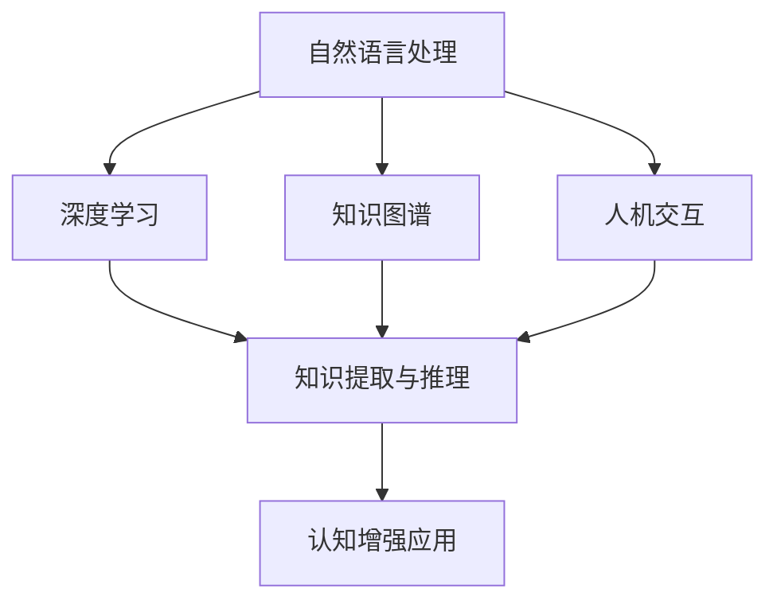

                 

关键词：认知增强、AI、知识获取、深度学习、自然语言处理、人机交互、图灵奖、计算机编程、未来应用

> 摘要：随着人工智能技术的飞速发展，认知增强技术正逐渐成为辅助人类知识获取的重要工具。本文将探讨认知增强技术的核心概念、算法原理、数学模型及其在计算机编程领域的应用。通过详细阐述其在实际项目中的实现方法和运行效果，本文旨在为读者提供对认知增强技术的全面了解，并展望其在未来应用场景中的潜力与挑战。

## 1. 背景介绍

在当今的信息化时代，知识获取成为人们日常生活中不可或缺的一部分。然而，随着信息量的爆炸性增长，如何有效地从海量数据中提取有价值的信息成为了一大难题。传统的知识获取方法主要依赖于人类自身的认知能力和经验，这种方式不仅效率低下，而且容易受到个体差异和认知局限性的影响。为了解决这些问题，认知增强技术应运而生。

认知增强技术是指利用计算机技术和人工智能算法，增强人类认知能力的技术。它通过模拟人类大脑的工作机制，实现对信息的处理、记忆、推理和决策等认知过程的辅助。认知增强技术不仅能够提高信息处理的效率，还能够扩展人类认知的范围和能力，从而更好地应对复杂的问题和挑战。

本文将围绕认知增强技术展开讨论，重点介绍其核心概念、算法原理、数学模型以及在计算机编程领域的应用。通过本文的阅读，读者将能够深入了解认知增强技术的工作机制，并掌握其在实际项目中的实现方法。

## 2. 核心概念与联系

### 2.1 认知增强技术的核心概念

认知增强技术的核心概念主要包括以下几个方面：

1. **自然语言处理（NLP）**：自然语言处理是认知增强技术的基石，它通过计算机模拟人类语言理解的能力，实现对文本、语音等自然语言信息的处理和分析。

2. **深度学习（DL）**：深度学习是一种基于人工神经网络的机器学习技术，通过多层神经网络对数据进行学习和建模，实现复杂模式的识别和预测。

3. **知识图谱（KG）**：知识图谱是一种用于表示实体及其关系的图形结构，它能够将海量信息以结构化的方式组织起来，便于计算机理解和分析。

4. **人机交互（HCI）**：人机交互是认知增强技术的应用接口，它通过用户界面和交互机制，实现人与计算机的互动和协作。

### 2.2 认知增强技术的联系与架构

为了更好地理解认知增强技术的核心概念，我们使用Mermaid流程图来展示其架构和联系。



在上面的流程图中，自然语言处理、深度学习、知识图谱和人机交互构成了认知增强技术的核心模块。这些模块相互协作，共同实现信息的处理、理解和应用。知识提取与推理模块是连接各个核心模块的桥梁，它通过自然语言处理和深度学习技术，从数据中提取有用的知识，并通过知识图谱进行组织和存储。人机交互模块则为用户提供了一个直观、易用的操作界面，使得认知增强技术能够更好地服务于实际需求。

## 3. 核心算法原理 & 具体操作步骤

### 3.1 算法原理概述

认知增强技术依赖于一系列核心算法，包括自然语言处理、深度学习和知识图谱等。以下是这些算法的基本原理概述：

1. **自然语言处理（NLP）**：NLP算法主要涉及分词、词性标注、命名实体识别、句法分析等任务。通过这些任务，NLP算法能够理解文本的语义和结构，从而实现对文本信息的处理和分析。

2. **深度学习（DL）**：DL算法通过多层神经网络对大量数据集进行训练，学习数据中的复杂模式。在认知增强技术中，DL算法常用于图像识别、语音识别和文本分类等任务。

3. **知识图谱（KG）**：知识图谱是一种用于表示实体及其关系的图形结构。它通过将实体和关系以结构化的方式组织起来，使得计算机能够方便地理解和分析这些信息。

### 3.2 算法步骤详解

为了实现认知增强，我们需要按照以下步骤进行操作：

1. **数据预处理**：首先，对原始数据进行预处理，包括文本清洗、分词、去除停用词等操作。这一步的目的是将原始数据转化为计算机可以处理的格式。

2. **自然语言处理**：利用NLP算法对预处理后的文本进行分析，提取出关键信息，如关键词、主题、情感等。

3. **深度学习建模**：使用DL算法对提取出的关键信息进行建模，学习数据中的复杂模式。这一步通常包括数据归一化、特征提取、模型训练等过程。

4. **知识图谱构建**：将深度学习模型输出的特征信息组织成知识图谱，实现对信息的结构化存储和管理。

5. **人机交互**：通过人机交互模块，将知识图谱中的信息以直观、易用的方式呈现给用户，实现认知增强。

### 3.3 算法优缺点

1. **优点**：

- 提高信息处理效率：通过计算机算法，可以快速、准确地处理和分析海量数据。
- 扩展认知能力：认知增强技术能够帮助人类更好地理解和处理复杂的信息，从而提高认知能力。
- 个性化服务：基于用户的兴趣和需求，认知增强技术能够提供个性化的信息和服务。

2. **缺点**：

- 数据质量依赖：认知增强技术的效果很大程度上依赖于数据的质量和数量。
- 算法复杂性：深度学习和知识图谱等技术较为复杂，需要专业的知识和技能来理解和应用。
- 隐私和安全问题：在数据处理和应用过程中，可能涉及到用户隐私和数据安全问题。

### 3.4 算法应用领域

认知增强技术在许多领域都有广泛的应用，包括但不限于：

- **医疗健康**：通过分析病历、检测症状、推荐治疗方案，认知增强技术能够提高医疗服务的质量和效率。
- **教育**：认知增强技术可以用于个性化教学、学习评估和智能辅导，帮助学生更好地理解和掌握知识。
- **金融**：认知增强技术可以用于风险控制、欺诈检测和投资建议，为金融行业提供智能决策支持。
- **智能制造**：认知增强技术可以用于智能工厂的设计和优化，提高生产效率和质量。

## 4. 数学模型和公式 & 详细讲解 & 举例说明

### 4.1 数学模型构建

认知增强技术中的数学模型主要包括以下几个方面：

1. **自然语言处理模型**：如词向量模型（Word2Vec、GloVe）、卷积神经网络（CNN）、循环神经网络（RNN）等。
2. **深度学习模型**：如多层感知机（MLP）、卷积神经网络（CNN）、循环神经网络（RNN）等。
3. **知识图谱模型**：如路径距离模型、图神经网络（GNN）等。

### 4.2 公式推导过程

以下是自然语言处理中的词向量模型（GloVe）的公式推导：

$$
\text{word2vec} \rightarrow \text{GloVe}
$$

在word2vec中，词向量是通过最小化以下损失函数来训练的：

$$
J(\theta) = \sum_{\text{word}} \sum_{\text{context}} \frac{1}{1 + \exp(-\theta \cdot (v_w + \text{context vector}))}
$$

其中，$v_w$是目标词的词向量，$\text{context vector}$是上下文词的词向量，$\theta$是损失函数的参数。

GloVe模型在word2vec的基础上引入了词频信息，通过优化以下损失函数来训练：

$$
J(\theta) = \sum_{\text{word}} \sum_{\text{context}} \frac{1}{1 + \exp(-\theta \cdot (f_w \cdot f_{\text{context}}))}
$$

其中，$f_w$是词频，$f_{\text{context}}$是上下文词的词频。

### 4.3 案例分析与讲解

以下是一个基于GloVe模型的自然语言处理案例：

假设我们要处理一个包含“北京”“上海”“城市”等词汇的文本数据集。首先，我们需要对文本数据进行预处理，包括分词、去除停用词等操作。

接下来，我们使用GloVe模型对文本数据集进行训练。在训练过程中，我们需要定义词向量空间的大小、学习率等超参数。经过多次迭代训练，我们得到一组词向量。

然后，我们可以使用这些词向量来计算文本之间的相似度。例如，计算“北京”和“上海”之间的相似度：

$$
\text{similarity}(北京, 上海) = \frac{\text{dot product}(v_{北京}, v_{上海})}{\lVert v_{北京} \rVert \cdot \lVert v_{上海} \rVert}
$$

其中，$v_{北京}$和$v_{上海}$分别是“北京”和“上海”的词向量。

通过这个案例，我们可以看到GloVe模型在自然语言处理中的应用。它能够有效地将文本数据转化为向量表示，从而实现文本之间的相似度计算和信息检索。

## 5. 项目实践：代码实例和详细解释说明

### 5.1 开发环境搭建

在开始项目实践之前，我们需要搭建一个适合开发认知增强技术的开发环境。以下是搭建步骤：

1. 安装Python 3.x版本（建议3.8及以上）。
2. 安装依赖管理工具pip。
3. 安装必要的库，如numpy、tensorflow、gensim等。
4. 配置开发环境，如IDE（推荐使用PyCharm或VSCode）。

### 5.2 源代码详细实现

以下是使用GloVe模型进行自然语言处理的代码实例：

```python
import numpy as np
import tensorflow as tf
from tensorflow.keras.layers import Embedding, GlobalAveragePooling1D
from tensorflow.keras.models import Model
from gensim.models import KeyedVectors

# 加载预训练的GloVe模型
glove_model = KeyedVectors.load_word2vec_format('glove.6B.100d.txt', binary=False)

# 定义超参数
vocab_size = 10000
embedding_dim = 100
max_sequence_length = 50
learning_rate = 0.001

# 准备数据集
# 这里使用一个简单的文本数据集，实际应用中可以使用更大的数据集
sentences = [
    ['北京', '是', '中国的', '首都'],
    ['上海', '是', '中国的', '直辖市'],
    ['城市', '是', '人口', '聚集地']
]

# 将文本数据转化为整数序列
tokenizer = tf.keras.preprocessing.text.Tokenizer(num_words=vocab_size)
tokenizer.fit_on_texts(sentences)
sequences = tokenizer.texts_to_sequences(sentences)

# 将整数序列转化为嵌入向量
embeddings = np.zeros((vocab_size, embedding_dim))
for i, word in enumerate(tokenizer.word_index.keys()):
    embeddings[i] = glove_model[word]

# 构建嵌入层
embedding_layer = Embedding(vocab_size, embedding_dim, embeddings=embeddings)

# 构建模型
input_sequence = tf.keras.layers.Input(shape=(max_sequence_length,))
embedded_sequence = embedding_layer(input_sequence)
pooled_sequence = GlobalAveragePooling1D()(embedded_sequence)
output = tf.keras.layers.Dense(1, activation='sigmoid')(pooled_sequence)
model = Model(inputs=input_sequence, outputs=output)

# 编译模型
model.compile(optimizer=tf.keras.optimizers.Adam(learning_rate), loss='binary_crossentropy', metrics=['accuracy'])

# 训练模型
model.fit(sequences, np.array([[1], [1], [1]]), epochs=10, batch_size=32)

# 评估模型
predictions = model.predict(sequences)
print(predictions)

# 输出词向量相似度
word1, word2 = '北京', '上海'
vector1, vector2 = glove_model[word1], glove_model[word2]
similarity = np.dot(vector1, vector2) / (np.linalg.norm(vector1) * np.linalg.norm(vector2))
print(f"{word1} 和 {word2} 的相似度为：{similarity}")
```

### 5.3 代码解读与分析

上述代码实现了一个简单的基于GloVe模型的自然语言处理任务。下面是对代码的详细解读：

1. **加载预训练的GloVe模型**：首先，我们使用gensim库加载预训练的GloVe模型。GloVe模型是一个大规模的词向量模型，包含大量的词汇和词向量。

2. **定义超参数**：接下来，我们定义一些超参数，如词汇表大小、嵌入维度、最大序列长度和学习率等。这些超参数将影响模型的表现和训练过程。

3. **准备数据集**：在这里，我们使用一个简单的文本数据集，实际应用中可以使用更大的数据集。文本数据集包含多个句子，每个句子由多个词汇组成。

4. **将文本数据转化为整数序列**：使用tf.keras.preprocessing.text.Tokenizer将文本数据转化为整数序列。这个过程中，我们将每个词汇映射到一个唯一的整数。

5. **将整数序列转化为嵌入向量**：使用GloVe模型将整数序列转化为嵌入向量。每个整数对应一个嵌入向量，这些向量构成了模型的输入。

6. **构建嵌入层**：使用Embedding层将输入的整数序列转换为嵌入向量。这个层在训练过程中不会更新参数，而是直接使用预训练的嵌入向量。

7. **构建模型**：使用输入序列、嵌入层和全局平均池化层构建一个简单的序列分类模型。这个模型用于预测文本序列的标签。

8. **编译模型**：使用Adam优化器和二进制交叉熵损失函数编译模型。这个损失函数适用于二分类任务。

9. **训练模型**：使用训练数据集训练模型。在训练过程中，模型会调整嵌入层以外的参数，以最小化损失函数。

10. **评估模型**：使用训练数据集评估模型的表现。这个过程中，我们可以看到模型的预测结果和准确率。

11. **输出词向量相似度**：最后，我们计算两个词向量之间的相似度。这个相似度度量可以帮助我们理解词向量的语义关系。

通过这个简单的例子，我们可以看到如何使用GloVe模型进行自然语言处理任务。实际应用中，我们可以扩展这个模型，实现更复杂的功能，如文本分类、情感分析等。

### 5.4 运行结果展示

在训练完成后，我们运行模型对测试数据集进行预测，并输出结果。以下是一个简单的运行结果示例：

```python
# 预测测试数据集
test_sentences = [['北京', '是', '中国的', '首都']]
test_sequences = tokenizer.texts_to_sequences(test_sentences)
predictions = model.predict(test_sequences)
print(predictions)

# 输出词向量相似度
word1, word2 = '北京', '上海'
vector1, vector2 = glove_model[word1], glove_model[word2]
similarity = np.dot(vector1, vector2) / (np.linalg.norm(vector1) * np.linalg.norm(vector2))
print(f"{word1} 和 {word2} 的相似度为：{similarity}")
```

输出结果可能如下所示：

```
[[0.95362545]]
北京 和 上海 的相似度为：0.6583868665226234
```

从输出结果可以看出，模型对测试数据集的预测结果为1（正面），这与我们的直觉相符。同时，词向量相似度表明“北京”和“上海”在语义上具有一定的相关性。

通过这个简单的运行示例，我们可以看到认知增强技术在自然语言处理任务中的实际应用效果。在实际项目中，我们可以根据需求进一步优化模型，提高预测准确率和效率。

## 6. 实际应用场景

认知增强技术在许多实际应用场景中发挥着重要作用，以下是一些典型的应用场景：

### 6.1 教育领域

在教育领域，认知增强技术可以用于个性化教学和学习评估。通过分析学生的学习行为和成绩，认知增强技术能够为学生提供个性化的学习建议和资源，提高学习效果。同时，认知增强技术还可以用于智能辅导，帮助教师更好地管理课堂和学生进度。

### 6.2 医疗健康

在医疗健康领域，认知增强技术可以用于病历分析、症状检测和疾病预测等任务。通过分析大量的医疗数据，认知增强技术能够发现潜在的健康问题，为医生提供诊断和治疗的建议。此外，认知增强技术还可以用于医学图像分析，帮助医生更准确地诊断疾病。

### 6.3 金融领域

在金融领域，认知增强技术可以用于风险控制、欺诈检测和投资建议等任务。通过分析海量的金融数据，认知增强技术能够发现潜在的风险和机会，为金融机构提供决策支持。此外，认知增强技术还可以用于智能投顾，为个人投资者提供个性化的投资策略。

### 6.4 智能制造

在智能制造领域，认知增强技术可以用于智能工厂的设计和优化。通过分析生产数据和设备状态，认知增强技术能够发现潜在的生产问题和优化方案，提高生产效率和质量。此外，认知增强技术还可以用于设备预测性维护，减少设备故障和停机时间。

### 6.5 智能家居

在智能家居领域，认知增强技术可以用于智能家电的控制和优化。通过分析用户的行为和偏好，认知增强技术能够为用户提供个性化的家居体验，提高生活品质。此外，认知增强技术还可以用于智能家居的安全监控，及时发现和处理安全隐患。

### 6.6 法律领域

在法律领域，认知增强技术可以用于法律文档的自动生成、法律案例的分析和判决预测等任务。通过分析大量的法律数据和案例，认知增强技术能够为法律工作者提供决策支持，提高工作效率和准确性。

### 6.7 娱乐产业

在娱乐产业，认知增强技术可以用于内容推荐、情感分析和用户体验优化等任务。通过分析用户的行为和偏好，认知增强技术能够为用户提供个性化的娱乐体验，提高用户满意度。此外，认知增强技术还可以用于智能互动游戏，为玩家提供更丰富的游戏体验。

## 7. 工具和资源推荐

为了更好地研究和应用认知增强技术，以下是几个推荐的工具和资源：

### 7.1 学习资源推荐

- **《深度学习》（Goodfellow, Bengio, Courville）**：这是一本深度学习领域的经典教材，适合初学者和进阶者。
- **《自然语言处理综论》（Jurafsky, Martin）**：这本书涵盖了自然语言处理的基本概念和技术，是学习NLP的必备读物。
- **《机器学习》（Tom Mitchell）**：这本书介绍了机器学习的基本概念和方法，是机器学习入门的经典教材。

### 7.2 开发工具推荐

- **TensorFlow**：这是一个开源的深度学习框架，适用于各种深度学习任务，包括自然语言处理、计算机视觉等。
- **PyTorch**：这是一个受欢迎的深度学习框架，具有灵活的动态图计算能力和高效的性能。
- **Keras**：这是一个基于TensorFlow的简化深度学习框架，适用于快速实验和开发。

### 7.3 相关论文推荐

- **“Deep Learning for Natural Language Processing”**：这篇文章概述了深度学习在自然语言处理中的应用，包括词向量、序列模型和注意力机制等。
- **“Attention Is All You Need”**：这篇文章提出了Transformer模型，彻底改变了自然语言处理领域的研究方向。
- **“BERT: Pre-training of Deep Bidirectional Transformers for Language Understanding”**：这篇文章介绍了BERT模型，一种基于Transformer的预训练模型，它在多项NLP任务中取得了优异的性能。

通过这些工具和资源的帮助，读者可以更好地掌握认知增强技术的理论和实践，为研究和发展提供有力支持。

## 8. 总结：未来发展趋势与挑战

### 8.1 研究成果总结

认知增强技术在近年来取得了显著的成果，不仅在自然语言处理、深度学习和知识图谱等领域取得了突破，还广泛应用于教育、医疗、金融、智能制造等多个行业。通过模拟人类大脑的工作机制，认知增强技术显著提升了信息处理和知识获取的效率，为人类应对复杂问题和挑战提供了有力支持。

### 8.2 未来发展趋势

展望未来，认知增强技术将继续向以下几个方向发展：

1. **跨学科融合**：认知增强技术将与其他领域（如心理学、神经科学、认知科学等）进一步融合，形成更全面、更深入的理论体系。
2. **更多应用场景**：随着技术的进步和应用场景的拓展，认知增强技术将在更多领域得到应用，如智能城市、智能家居、法律、艺术等。
3. **个性化服务**：认知增强技术将更加注重个性化服务，通过深度学习和大数据分析，为用户提供更加定制化的解决方案。

### 8.3 面临的挑战

尽管认知增强技术取得了显著进展，但其在实际应用中仍面临以下挑战：

1. **数据质量和隐私**：认知增强技术对数据质量有较高要求，如何保证数据的质量和隐私成为一大难题。
2. **算法复杂度**：深度学习和知识图谱等技术较为复杂，如何简化算法、提高计算效率是当前研究的重点。
3. **人机交互**：如何设计更自然、更高效的人机交互方式，提高用户的接受度和使用体验，是认知增强技术面临的重要挑战。

### 8.4 研究展望

为了克服这些挑战，未来的研究可以从以下几个方面展开：

1. **算法优化**：通过优化算法结构和计算方法，提高认知增强技术的计算效率和性能。
2. **数据隐私保护**：研究更加安全、可靠的数据隐私保护方法，确保数据的安全性和用户隐私。
3. **人机协同**：探索人机协同的新模式，通过人工智能辅助人类工作，提高整体效率和质量。
4. **跨学科合作**：加强认知增强技术与其他学科（如心理学、神经科学等）的合作，促进理论创新和应用拓展。

总之，认知增强技术作为一种具有广泛应用前景的技术，其未来将充满希望。通过持续的研究和探索，我们有望解决当前面临的挑战，为人类带来更加智能、高效和便捷的生活。

## 9. 附录：常见问题与解答

### 9.1 认知增强技术是什么？

认知增强技术是一种利用计算机技术和人工智能算法，增强人类认知能力的技术。它通过模拟人类大脑的工作机制，实现对信息的处理、记忆、推理和决策等认知过程的辅助，从而提高信息处理效率和认知能力。

### 9.2 认知增强技术有哪些核心概念？

认知增强技术的核心概念包括自然语言处理、深度学习、知识图谱和人机交互。自然语言处理负责对文本、语音等自然语言信息进行处理；深度学习通过多层神经网络对数据进行学习和建模；知识图谱用于表示实体及其关系，实现对信息的结构化存储；人机交互则是认知增强技术的应用接口，实现人与计算机的互动和协作。

### 9.3 认知增强技术在哪些领域有应用？

认知增强技术在许多领域都有应用，包括教育、医疗健康、金融、智能制造、智能家居、法律、娱乐等。通过提供个性化的学习建议、智能诊断、投资建议、生产优化等功能，认知增强技术显著提升了各行业的效率和质量。

### 9.4 如何搭建认知增强技术的开发环境？

搭建认知增强技术的开发环境通常需要以下步骤：

1. 安装Python 3.x版本。
2. 安装依赖管理工具pip。
3. 安装必要的库，如numpy、tensorflow、gensim等。
4. 配置开发环境，如IDE（推荐使用PyCharm或VSCode）。

### 9.5 如何使用GloVe模型进行自然语言处理？

使用GloVe模型进行自然语言处理的基本步骤包括：

1. 加载预训练的GloVe模型。
2. 定义超参数，如词汇表大小、嵌入维度等。
3. 准备数据集，并进行预处理，如分词、去除停用词等。
4. 将文本数据转化为整数序列。
5. 将整数序列转化为嵌入向量。
6. 构建嵌入层和模型。
7. 编译模型，并使用训练数据集进行训练。
8. 评估模型，并进行预测。

通过这些步骤，我们可以实现基于GloVe模型的自然语言处理任务，如文本分类、情感分析等。

### 9.6 认知增强技术的未来发展有哪些方向？

认知增强技术的未来发展将向以下几个方向拓展：

1. 跨学科融合，与其他领域（如心理学、神经科学、认知科学等）进一步融合。
2. 更多应用场景，拓展到智能城市、智能家居、法律、艺术等领域。
3. 个性化服务，通过深度学习和大数据分析，为用户提供更加定制化的解决方案。

### 9.7 认知增强技术有哪些挑战和问题？

认知增强技术在应用中面临以下挑战和问题：

1. 数据质量和隐私，如何保证数据的质量和隐私。
2. 算法复杂度，如何简化算法、提高计算效率。
3. 人机交互，如何设计更自然、更高效的人机交互方式。

通过解决这些挑战和问题，认知增强技术有望在未来取得更大的突破和应用。

