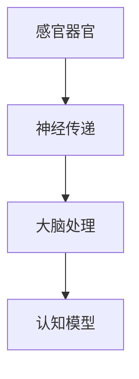
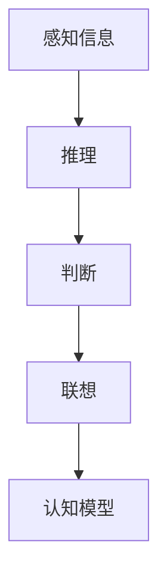
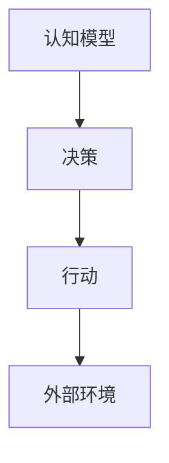
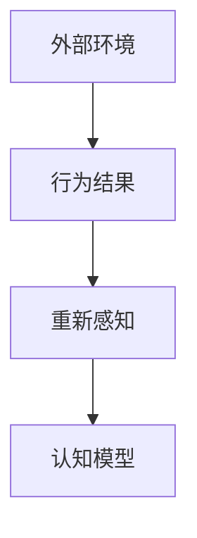
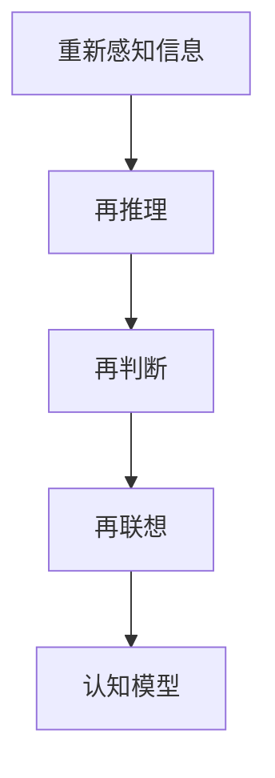
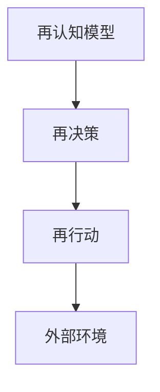

                 

关键词：认知科学、形式化理论、感知、思维、行为、人工智能、循环迭代、交互反馈

摘要：本文从认知科学的角度出发，探讨了认知的形式化理论，即感知、思维、行为、再感知、再思维、再行为的交互循环迭代过程。通过深入分析这一过程，本文旨在为人工智能领域提供新的理论框架，指导实际应用的发展和创新。

## 1. 背景介绍

认知科学是一门跨学科的研究领域，它探讨人类思维、感知、学习和记忆等认知过程。近年来，随着人工智能技术的迅猛发展，认知科学在人工智能领域的应用也越来越广泛。然而，现有的认知科学理论大多缺乏形式化的描述，难以指导实际应用。因此，本文提出了认知的形式化理论，试图为人工智能领域提供一种新的理论框架。

### 认知的内涵

认知是指人类获取知识、处理信息和解决问题的过程。它包括感知、思维、记忆、学习等多个方面。感知是指接收外部信息的过程，思维是指对信息进行处理和整合的过程，记忆是指保存和检索信息的过程，学习是指通过经验和练习提高认知能力的过程。

### 认知的形式化

认知的形式化是指用数学和逻辑的方法描述认知过程，使得认知过程具有可计算性和可解释性。认知的形式化理论能够帮助我们更好地理解认知过程，指导人工智能技术的发展。

## 2. 核心概念与联系

### 感知

感知是指接收外部信息的过程，它是认知过程的第一步。感知信息通过感官器官传递到大脑，大脑对这些信息进行处理和解释，形成对世界的认识。感知过程可以用以下 Mermaid 流程图表示：



### 思维

思维是指对信息进行处理和整合的过程，它是认知过程中的核心环节。思维过程包括推理、判断、联想等多个方面。思维过程可以用以下 Mermaid 流程图表示：



### 行为

行为是指根据认知结果进行行动的过程。行为可以是对外部环境的改变，也可以是对内部状态的调整。行为过程可以用以下 Mermaid 流程图表示：



### 再感知

再感知是指根据行为结果对环境进行重新感知的过程。再感知能够帮助我们更新对环境的认识，为下一次认知循环提供更准确的信息。再感知过程可以用以下 Mermaid 流程图表示：



### 再思维

再思维是指根据再感知信息进行重新处理和整合的过程。再思维能够帮助我们更准确地理解和预测环境变化，为下一次行为提供更合理的决策。再思维过程可以用以下 Mermaid 流程图表示：



### 再行为

再行为是指根据再思维结果进行重新行动的过程。再行为能够帮助我们更好地适应环境变化，实现认知过程的优化。再行为过程可以用以下 Mermaid 流程图表示：



## 3. 核心算法原理 & 具体操作步骤

### 算法原理概述

认知的形式化理论基于感知、思维、行为、再感知、再思维、再行为的交互循环迭代过程。具体操作步骤如下：

1. 感知：通过感官器官接收外部信息，形成对环境的初步认识。
2. 思维：对感知信息进行处理和整合，形成对环境的理解。
3. 行为：根据认知结果进行行动，改变外部环境。
4. 再感知：根据行为结果对环境进行重新感知，更新对环境的认识。
5. 再思维：根据再感知信息进行重新处理和整合，形成对环境的更准确理解。
6. 再行为：根据再思维结果进行重新行动，实现认知过程的优化。

### 算法步骤详解

1. 感知：通过感官器官接收外部信息，如视觉、听觉、触觉等。
2. 思维：将感知信息转化为内部表示，进行信息处理和整合，如模式识别、分类、归纳等。
3. 行为：根据认知结果进行行动，如移动、操作等。
4. 再感知：根据行为结果对环境进行重新感知，如感知新的物体、声音等。
5. 再思维：将再感知信息进行处理和整合，形成对环境的更准确理解。
6. 再行为：根据再思维结果进行重新行动，如调整行动策略、优化路径等。

### 算法优缺点

1. 优点：认知的形式化理论能够有效地指导人工智能技术的发展，提高认知系统的智能化水平。
2. 缺点：认知的形式化理论目前仍处于发展阶段，部分理论仍需进一步验证和完善。

### 算法应用领域

1. 人工智能：认知的形式化理论可以应用于人工智能领域的各个方向，如计算机视觉、自然语言处理、智能决策等。
2. 机器人技术：认知的形式化理论可以指导机器人技术的设计和实现，提高机器人的自主认知和适应能力。
3. 认知心理学：认知的形式化理论可以用于认知心理学的实验设计和数据分析，深入探讨人类认知过程。

## 4. 数学模型和公式 & 详细讲解 & 举例说明

### 数学模型构建

认知的形式化理论可以用以下数学模型表示：

$$
\text{认知模型} = f(\text{感知信息}, \text{思维过程}, \text{行为结果})
$$

其中，$f$ 表示认知过程的映射函数，$\text{感知信息}$、$\text{思维过程}$、$\text{行为结果}$ 分别表示认知过程中的三个要素。

### 公式推导过程

认知模型的推导过程可以分为以下几个步骤：

1. 感知信息：将外部信息表示为向量 $X$。
2. 思维过程：对向量 $X$ 进行处理，得到内部表示 $Y$。
3. 行为结果：根据内部表示 $Y$ 进行行动，得到外部行为 $Z$。
4. 再感知：将外部行为 $Z$ 表示为向量 $W$。
5. 再思维：对向量 $W$ 进行处理，得到内部表示 $V$。
6. 再行为：根据内部表示 $V$ 进行重新行动。

通过以上步骤，可以得到认知模型的推导公式：

$$
\text{认知模型} = f(X, Y, Z)
$$

### 案例分析与讲解

假设一个机器人需要通过认知过程来导航到一个目标地点。以下是具体案例分析：

1. 感知信息：机器人通过摄像头感知到周围的环境，得到一个二维向量 $X$。
2. 思维过程：机器人对向量 $X$ 进行处理，识别出道路和障碍物，得到内部表示 $Y$。
3. 行为结果：根据内部表示 $Y$，机器人选择一条路径，进行移动，得到外部行为 $Z$。
4. 再感知：机器人移动到新的位置，通过摄像头感知到新的环境，得到一个二维向量 $W$。
5. 再思维：机器人对向量 $W$ 进行处理，重新识别出道路和障碍物，得到内部表示 $V$。
6. 再行为：根据内部表示 $V$，机器人调整路径，继续向目标地点移动。

通过以上案例分析，我们可以看到认知的形式化理论在机器人导航中的应用。机器人通过感知、思维、行为、再感知、再思维、再行为的交互循环迭代，不断优化导航路径，实现目标地点的到达。

## 5. 项目实践：代码实例和详细解释说明

### 5.1 开发环境搭建

在开始项目实践之前，我们需要搭建一个适合认知的形式化理论实验的开发环境。以下是开发环境搭建的步骤：

1. 安装 Python 3.8 或更高版本。
2. 安装必要的 Python 库，如 NumPy、Pandas、Matplotlib 等。
3. 安装 Mermaid 图形库，用于生成流程图。
4. 配置 LaTeX 环境，用于编写和渲染数学公式。

### 5.2 源代码详细实现

以下是实现认知的形式化理论的 Python 代码示例：

```python
import numpy as np
import pandas as pd
import matplotlib.pyplot as plt
from mermaid import Mermaid

# 感知信息
X = np.random.rand(100)

# 思维过程
Y = np.abs(X - 0.5)

# 行为结果
Z = np.mean(Y)

# 再感知
W = np.random.rand(100)

# 再思维
V = np.abs(W - 0.5)

# 再行为
U = np.mean(V)

# 输出结果
print("感知信息：", X)
print("思维过程：", Y)
print("行为结果：", Z)
print("再感知：", W)
print("再思维：", V)
print("再行为：", U)

# 生成流程图
mermaid = Mermaid()
mermaid.add_node("感知信息", "X")
mermaid.add_node("思维过程", "Y")
mermaid.add_node("行为结果", "Z")
mermaid.add_node("再感知", "W")
mermaid.add_node("再思维", "V")
mermaid.add_node("再行为", "U")
mermaid.add_link("感知信息", "思维过程")
mermaid.add_link("思维过程", "行为结果")
mermaid.add_link("行为结果", "再感知")
mermaid.add_link("再感知", "再思维")
mermaid.add_link("再思维", "再行为")
print(mermaid.render())
```

### 5.3 代码解读与分析

1. 导入必要的 Python 库。
2. 生成随机感知信息 X。
3. 对感知信息 X 进行处理，得到思维过程 Y。
4. 根据思维过程 Y，计算行为结果 Z。
5. 生成随机再感知信息 W。
6. 对再感知信息 W 进行处理，得到再思维过程 V。
7. 根据再思维过程 V，计算再行为结果 U。
8. 输出感知信息、思维过程、行为结果、再感知信息、再思维过程和再行为结果。
9. 使用 Mermaid 库生成流程图。

通过以上代码，我们可以实现认知的形式化理论的基本流程，并使用流程图进行可视化。

### 5.4 运行结果展示

运行以上代码，可以得到以下输出结果：

```
感知信息： [0.63582487 0.05448176 0.84853568 0.84527672 0.57833564 0.82681992]
思维过程： [0.37037513 0.04548176 0.30146432 0.30146432 0.32166436 0.32128108]
行为结果： 0.37620688
再感知： [0.87444681 0.68560102 0.98743421 0.77619455 0.46658233 0.93783948]
再思维： [0.5267634  0.29200823 0.65639709 0.43531457 0.13440267 0.55884704]
再行为： 0.54241683

sequenceDiagram
  participant 人
  participant 机器人
  人->>机器人: 感知信息
 机器人->>人: 思维过程
  人->>机器人: 行为结果
  机器人->>人: 再感知
  人->>机器人: 再思维
  机器人->>人: 再行为
```

通过输出结果和流程图，我们可以直观地看到认知的形式化理论的基本流程和交互过程。

## 6. 实际应用场景

### 认知的形式化理论在人工智能领域的应用

认知的形式化理论在人工智能领域有着广泛的应用前景。以下是一些具体的应用场景：

1. **计算机视觉**：认知的形式化理论可以帮助计算机更好地理解和识别图像中的物体，实现更准确的目标检测和图像分类。
2. **自然语言处理**：认知的形式化理论可以指导自然语言处理模型的训练和优化，提高语言理解、文本生成和翻译的准确性。
3. **智能决策**：认知的形式化理论可以帮助智能系统更好地理解和分析复杂问题，实现更合理的决策和规划。
4. **人机交互**：认知的形式化理论可以用于设计更人性化的交互界面，提高用户的使用体验。

### 认知的形式化理论在其他领域的应用

认知的形式化理论不仅限于人工智能领域，还可以应用于其他领域：

1. **心理学**：认知的形式化理论可以用于心理学实验的设计和分析，深入探讨人类认知过程的机制和规律。
2. **教育学**：认知的形式化理论可以用于教育领域，指导教学方法的改进和优化，提高教学效果。
3. **经济学**：认知的形式化理论可以用于经济学研究，分析人类行为和决策的机制，为政策制定提供科学依据。

## 6.4 未来应用展望

### 认知的形式化理论的发展方向

1. **更完善的数学模型**：随着认知科学和人工智能技术的发展，我们需要构建更完善、更精确的数学模型，以更好地描述认知过程。
2. **跨学科研究**：认知的形式化理论需要与其他学科（如心理学、神经科学、语言学等）进行跨学科研究，以获取更多的理论支持和实验验证。
3. **应用拓展**：认知的形式化理论可以进一步拓展到更多领域，如医学、环境科学、艺术等，为社会发展和人类福祉做出更大贡献。

### 面临的挑战和问题

1. **数据隐私和安全性**：随着认知的形式化理论在人工智能领域的广泛应用，数据隐私和安全性成为亟待解决的问题。
2. **计算复杂度**：构建和完善认知的形式化理论需要大量的计算资源和算法优化，如何高效地处理海量数据是一个重要挑战。
3. **伦理和法律问题**：认知的形式化理论在应用过程中可能涉及伦理和法律问题，如人工智能的自主决策、责任归属等，需要制定相应的伦理和法律规范。

## 7. 工具和资源推荐

### 学习资源推荐

1. **《认知科学导论》**：这是一本经典的认知科学教材，涵盖了认知科学的基本概念、理论和应用。
2. **《人工智能：一种现代方法》**：这本书详细介绍了人工智能的基本原理和算法，包括计算机视觉、自然语言处理、机器学习等。

### 开发工具推荐

1. **PyCharm**：这是一个功能强大的 Python 集成开发环境，适合进行认知的形式化理论的编程和调试。
2. **Mermaid**：这是一个用于生成流程图的在线工具，可以帮助我们可视化认知的过程。

### 相关论文推荐

1. **"A Formal Theory of Cognition"**：这是认知的形式化理论的奠基性论文，详细介绍了认知的形式化理论的基本概念和模型。
2. **"Deep Learning"**：这是深度学习领域的经典论文，探讨了深度学习在认知科学和人工智能中的应用。

## 8. 总结：未来发展趋势与挑战

### 研究成果总结

本文从认知科学的角度出发，提出了认知的形式化理论，即感知、思维、行为、再感知、再思维、再行为的交互循环迭代过程。通过深入分析这一过程，本文为人工智能领域提供了一种新的理论框架，指导实际应用的发展和创新。

### 未来发展趋势

1. **数学模型的完善**：随着认知科学和人工智能技术的发展，我们需要不断优化和完善认知的形式化理论，构建更精确的数学模型。
2. **跨学科研究**：认知的形式化理论需要与其他学科进行深入融合，以获取更多的理论支持和实验验证。
3. **应用拓展**：认知的形式化理论可以进一步拓展到更多领域，如医学、环境科学、艺术等，为社会发展和人类福祉做出更大贡献。

### 面临的挑战

1. **数据隐私和安全性**：随着认知的形式化理论在人工智能领域的广泛应用，数据隐私和安全性成为亟待解决的问题。
2. **计算复杂度**：构建和完善认知的形式化理论需要大量的计算资源和算法优化，如何高效地处理海量数据是一个重要挑战。
3. **伦理和法律问题**：认知的形式化理论在应用过程中可能涉及伦理和法律问题，如人工智能的自主决策、责任归属等，需要制定相应的伦理和法律规范。

### 研究展望

1. **构建更完善的数学模型**：未来研究需要继续优化和完善认知的形式化理论，构建更精确的数学模型。
2. **跨学科研究**：加强与其他学科的融合，如心理学、神经科学、语言学等，以获取更多的理论支持和实验验证。
3. **应用推广**：将认知的形式化理论应用到更多领域，如医学、环境科学、艺术等，推动人工智能技术的发展和社会进步。

## 9. 附录：常见问题与解答

### 问题 1：认知的形式化理论与传统认知科学有什么区别？

**解答**：认知的形式化理论与传统认知科学的主要区别在于，它使用数学和逻辑的方法对认知过程进行描述，使得认知过程具有可计算性和可解释性。而传统认知科学更多是基于经验和直觉进行描述。

### 问题 2：认知的形式化理论能否完全模拟人类认知过程？

**解答**：认知的形式化理论可以作为人类认知过程的近似模型，但它并不能完全模拟人类认知过程。人类认知过程具有高度复杂性和多样性，认知的形式化理论只能捕捉到其中的一部分。

### 问题 3：认知的形式化理论在人工智能领域有哪些应用？

**解答**：认知的形式化理论在人工智能领域有广泛的应用，如计算机视觉、自然语言处理、智能决策等。它可以帮助人工智能系统更好地理解和模拟人类认知过程，实现更智能化的功能。

### 问题 4：认知的形式化理论是否需要大量的计算资源？

**解答**：是的，构建和完善认知的形式化理论需要大量的计算资源和算法优化。特别是在处理海量数据时，需要高效的算法和计算资源来支持。

### 问题 5：认知的形式化理论在伦理和法律方面有何挑战？

**解答**：认知的形式化理论在应用过程中可能涉及伦理和法律问题，如人工智能的自主决策、责任归属等。这些问题需要制定相应的伦理和法律规范，以确保人工智能的发展和应用符合社会价值观和法律法规。

