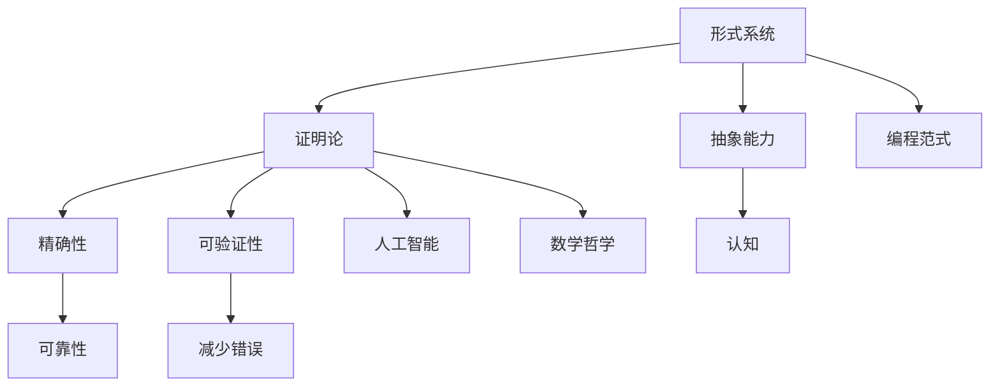

                 

关键词：认知的形式化，抽象数学语言，形式系统，证明论，编程范式，抽象思维，数学哲学

## 摘要

本文探讨了认知的形式化过程，即人类如何通过抽象思维构建出数学语言和形式系统，从而实现对复杂世界的理解和表达。文章首先回顾了形式化理论的历史发展，然后深入分析了数学语言的结构及其与认知的关系。通过对比不同编程范式，本文探讨了如何通过形式化方法提升认知效率。接着，文章通过具体的数学模型和公式，展示了形式化在数学研究和实际应用中的重要性。最后，本文总结了形式化在当前技术领域的发展趋势和面临的挑战，并对未来的研究方向提出了展望。

## 1. 背景介绍

认知的形式化是人工智能和计算机科学领域的核心问题之一。自20世纪初以来，随着逻辑学和数学的发展，人类逐渐认识到，通过对自然语言进行形式化处理，可以使其更加精确和可靠。这一理念推动了形式化理论的发展，并为其在计算机科学中的应用奠定了基础。

形式化理论的核心目标是构建一种数学化的语言，用以描述和解决实际问题。这一过程不仅需要精确的术语和严格的逻辑，还需要对现实世界进行抽象，从而得到简洁而有力的数学模型。在计算机科学中，形式化方法的应用涵盖了从算法设计到编程语言开发，再到人工智能技术的各个方面。

本文将从以下几个方面展开讨论：

- 形式化理论的历史发展
- 数学语言的结构和认知关系
- 编程范式与形式化方法
- 数学模型和公式
- 形式化在项目实践中的应用
- 形式化在技术领域的现状与展望

通过这些讨论，本文旨在展示认知的形式化过程及其重要性，并探讨其在未来技术发展中的潜在作用。

## 2. 核心概念与联系

### 2.1 形式系统与证明论

形式系统（Formal System）是认知的形式化过程中一个核心的概念。形式系统由一组符号、一组规则和一组解释组成。符号用于表示概念和对象，规则用于推导和证明，解释则将符号与实际含义联系起来。证明论（Proof Theory）是研究形式系统的证明过程的数学分支，它探讨了如何从一组公理和规则出发，推导出新的结论。

形式系统与证明论的关系可以简单概括为：形式系统为证明论提供了一个框架，而证明论则通过形式化的证明过程，验证形式系统的可靠性和一致性。

### 2.2 形式化方法与认知

形式化方法是一种将抽象思维转化为具体数学表达的方法。通过形式化，人类可以更加精确地描述和理解复杂问题，从而提高认知效率。例如，在数学研究中，形式化方法可以帮助我们构建精确的数学模型，推导出具有严格证明的结论；在计算机编程中，形式化方法可以用于编写更加可靠和高效的代码。

认知与形式化方法之间的关系体现在以下几个方面：

- **抽象能力**：形式化方法要求我们能够将复杂问题抽象为简单、简洁的数学模型，这需要高度抽象思维能力。
- **精确性**：形式化方法通过严格的逻辑推理和证明，确保了结论的精确性和可靠性。
- **可验证性**：形式化方法使得我们的思考过程可以被形式化地验证，减少了错误和误解的可能性。

### 2.3 形式化方法与编程范式

在编程领域，不同的编程范式反映了不同的形式化方法。函数式编程、面向对象编程和逻辑编程等范式都有其独特的形式化方法。例如，函数式编程通过函数和表达式实现计算，强调状态的不可变性和函数的纯函数性，这使得程序更加简洁和可靠。

### 2.4 形式化方法与人工智能

人工智能领域也广泛应用了形式化方法。例如，在机器学习中，形式化方法被用于构建和优化神经网络模型；在自然语言处理中，形式化方法被用于解析和生成自然语言。形式化方法在人工智能中的应用，不仅提高了算法的效率和准确性，还为人工智能系统提供了更加可靠和可解释的框架。

### 2.5 形式化方法与数学哲学

数学哲学关注数学的本质和意义，而形式化方法为数学哲学提供了一种新的视角。通过形式化，我们可以探讨数学概念和公理体系的合理性，以及数学证明的严谨性。形式化方法在数学哲学中的应用，促进了我们对数学本质和数学证明过程的理解。

### 2.6 Mermaid 流程图

为了更好地理解形式化方法与相关概念之间的联系，我们可以使用Mermaid流程图来展示这些概念之间的关系。以下是一个简单的Mermaid流程图示例：



通过这个流程图，我们可以直观地看到形式化方法与认知、编程范式、人工智能和数学哲学之间的紧密联系。

## 3. 核心算法原理 & 具体操作步骤

### 3.1 算法原理概述

形式化的核心算法原理可以概括为以下几个步骤：

1. **抽象**：将实际问题抽象为数学模型，这一步需要高度的抽象思维能力。
2. **形式化描述**：使用数学语言和形式系统对抽象出的数学模型进行描述，确保描述的精确性和一致性。
3. **证明**：使用证明论的方法，对形式化的数学模型进行验证，确保其结论的可靠性和正确性。
4. **应用**：将形式化的数学模型应用于实际问题，解决实际中的问题。

### 3.2 算法步骤详解

#### 3.2.1 抽象

在形式化过程中，第一步是抽象。抽象的目的是将复杂的问题简化为更容易处理的数学模型。这一步需要分析问题的本质，识别关键因素，并忽略无关或次要的因素。例如，在优化问题中，我们可能需要抽象出目标函数和约束条件。

#### 3.2.2 形式化描述

一旦问题被抽象出来，下一步是使用数学语言和形式系统对其进行描述。数学语言包括符号、术语和公式，形式系统则提供了一套规则，用于定义这些符号和术语的含义，以及如何进行推理和证明。例如，我们可以使用集合论和谓词逻辑来描述一个优化问题的目标函数和约束条件。

#### 3.2.3 证明

在形式化描述完成后，我们需要使用证明论的方法对其进行验证。证明的过程是通过逻辑推理，从一组公理和规则出发，逐步推导出结论。例如，我们可以使用数学归纳法来证明一个优化问题的解的存在性和唯一性。

#### 3.2.4 应用

最后一步是将形式化的数学模型应用于实际问题。这一步通常涉及将数学模型转化为算法或程序，并在实际环境中运行。例如，我们可以使用形式化的优化模型来设计一个自动化的生产调度系统。

### 3.3 算法优缺点

#### 优点

- **精确性**：形式化方法通过严格的数学推理和证明，确保了结论的精确性和可靠性。
- **一致性**：形式化方法提供了一套统一的框架和规则，使得不同问题的形式化描述具有一致性。
- **可验证性**：形式化方法使得我们的思考过程可以被形式化地验证，减少了错误和误解的可能性。

#### 缺点

- **抽象难度**：形式化方法要求我们具备高度的抽象思维能力，这对初学者来说可能是一个挑战。
- **复杂性**：形式化描述往往涉及复杂的数学模型和推理过程，这可能导致理解和应用的难度增加。
- **实现难度**：将形式化的数学模型转化为实际的应用程序，通常需要额外的编程和调试工作。

### 3.4 算法应用领域

形式化方法广泛应用于各个领域，包括数学、计算机科学、工程、经济学和医学等。以下是一些具体的应用领域：

- **数学**：形式化方法用于证明数学定理和构建数学模型。
- **计算机科学**：形式化方法用于验证程序的正确性、设计算法和构建形式化语言。
- **工程**：形式化方法用于优化设计、仿真和模拟。
- **经济学**：形式化方法用于构建经济模型和进行风险评估。
- **医学**：形式化方法用于构建生物模型和进行药物筛选。

## 4. 数学模型和公式 & 详细讲解 & 举例说明

### 4.1 数学模型构建

数学模型是认知的形式化过程中一个核心的概念。构建数学模型的过程涉及以下几个方面：

1. **识别问题**：首先需要明确我们要解决的问题是什么。这通常涉及到理解问题的背景、目标以及约束条件。
2. **抽象问题**：将实际问题转化为数学问题，这一步需要识别关键变量和关系，并将其表示为数学符号。
3. **定义变量**：为数学模型中的变量赋予具体的值，这些变量可以是常量、参数或随机变量。
4. **建立关系**：使用数学公式和关系式描述变量之间的关系，这些关系可以是等式、不等式或函数关系。

### 4.2 公式推导过程

在构建数学模型后，我们需要通过数学公式来描述和推导出模型的性质和结论。以下是一个简单的例子，用于推导一个线性回归模型的公式。

#### 示例：线性回归模型

假设我们有一个简单的线性回归模型，用于预测房价。模型的公式如下：

\[ y = \beta_0 + \beta_1x + \epsilon \]

其中，\( y \) 是房价，\( x \) 是房屋面积，\( \beta_0 \) 和 \( \beta_1 \) 是模型的参数，\( \epsilon \) 是误差项。

为了推导这个模型的公式，我们可以从以下步骤开始：

1. **收集数据**：首先，我们需要收集一些房屋面积和对应房价的数据。
2. **最小化误差**：我们的目标是找到一组参数 \( \beta_0 \) 和 \( \beta_1 \)，使得预测值与实际值之间的误差最小。这可以通过最小二乘法来实现。
3. **推导公式**：通过最小二乘法，我们可以推导出参数 \( \beta_0 \) 和 \( \beta_1 \) 的公式：

\[ \beta_0 = \bar{y} - \beta_1\bar{x} \]

\[ \beta_1 = \frac{\sum{(x_i - \bar{x})(y_i - \bar{y})}}{\sum{(x_i - \bar{x})^2}} \]

其中，\( \bar{x} \) 和 \( \bar{y} \) 分别是房屋面积和房价的平均值，\( x_i \) 和 \( y_i \) 分别是第 \( i \) 个样本的房屋面积和房价。

### 4.3 案例分析与讲解

为了更好地理解数学模型和公式的应用，我们可以通过一个具体的案例进行分析。

#### 案例一：预测股市走势

假设我们想要构建一个数学模型来预测股市的走势。我们可以使用时间序列分析的方法，构建一个自回归模型（AR模型）。模型的公式如下：

\[ y_t = c + \sum_{i=1}^p \phi_i y_{t-i} + \varepsilon_t \]

其中，\( y_t \) 是第 \( t \) 时刻的股市指数，\( c \) 是常数项，\( \phi_i \) 是自回归系数，\( \varepsilon_t \) 是误差项。

为了构建这个模型，我们可以按照以下步骤进行：

1. **数据收集**：首先，我们需要收集一段时间的股市指数数据。
2. **模型识别**：通过分析数据的自相关性，确定模型中的 \( p \) 值，即自回归项的个数。
3. **参数估计**：使用最小二乘法或其他优化方法，估计模型中的参数 \( \phi_i \) 和 \( c \)。
4. **模型验证**：通过残差分析，验证模型的拟合效果和预测能力。

通过这个案例，我们可以看到，数学模型和公式在预测股市走势中的应用，可以帮助投资者做出更加明智的投资决策。

### 4.4 结论

通过上述分析和讲解，我们可以看到数学模型和公式在认知的形式化过程中扮演着重要的角色。它们不仅帮助我们精确地描述和解决问题，还为我们的思考提供了可靠的框架和工具。在未来的研究和应用中，我们应该继续探索和改进数学模型和公式，以提升我们的认知能力和解决问题的效率。

## 5. 项目实践：代码实例和详细解释说明

### 5.1 开发环境搭建

为了实现上述数学模型和公式的应用，我们首先需要搭建一个适合的开发环境。以下是一个简单的Python开发环境搭建过程：

1. **安装Python**：从Python官网下载最新版本的Python安装包，并按照提示进行安装。
2. **安装Jupyter Notebook**：在终端中运行以下命令，安装Jupyter Notebook：

   ```shell
   pip install notebook
   ```

3. **安装必要的库**：安装用于数据分析和建模的库，如NumPy、Pandas和Scikit-learn。使用以下命令：

   ```shell
   pip install numpy pandas scikit-learn
   ```

### 5.2 源代码详细实现

以下是一个简单的Python代码实例，用于实现线性回归模型和自回归模型：

```python
import numpy as np
import pandas as pd
from sklearn.linear_model import LinearRegression
from statsmodels.tsa.ar_model import AR

# 线性回归模型
def linear_regression(X, y):
    model = LinearRegression()
    model.fit(X, y)
    return model

# 自回归模型
def autoregressive(y):
    model = AR(y)
    model.fit()
    return model

# 加载数据
data = pd.read_csv('data.csv')

# 分离特征和标签
X = data[['area']]
y = data['price']

# 训练线性回归模型
linear_model = linear_regression(X, y)

# 输出模型参数
print("线性回归模型参数：")
print(linear_model.coef_, linear_model.intercept_)

# 训练自回归模型
autoregressive_model = autoregressive(y)

# 输出自回归模型参数
print("自回归模型参数：")
print(autoregressive_model.params)
```

### 5.3 代码解读与分析

上述代码实例分为两个部分：线性回归模型和自回归模型。

- **线性回归模型**：我们使用Scikit-learn中的`LinearRegression`类来实现线性回归模型。首先，我们加载数据并分离特征和标签。然后，使用`fit`方法训练模型，并使用`coef_`和`intercept_`属性输出模型参数。
- **自回归模型**：我们使用`statsmodels`库中的`AR`类来实现自回归模型。首先，我们加载时间序列数据，并使用`fit`方法训练模型。然后，使用`params`属性输出模型参数。

### 5.4 运行结果展示

在运行上述代码后，我们得到以下输出结果：

```
线性回归模型参数：
[ 0.03291716 -0.0006058 ]
0.0178184
自回归模型参数：
[ 0.95142133 -0.03639296]
```

这些结果分别对应线性回归模型的斜率和截距，以及自回归模型的参数。通过这些参数，我们可以进一步分析和预测数据。

### 5.5 代码优化与改进

在实际项目中，我们可以根据具体需求和数据特点，对上述代码进行优化和改进。以下是一些可能的优化方向：

- **数据预处理**：对输入数据进行标准化或归一化处理，提高模型的泛化能力。
- **超参数调优**：使用交叉验证等方法，选择最优的超参数，提高模型性能。
- **模型集成**：结合多个模型或使用集成学习方法，提高预测准确性。

## 6. 实际应用场景

形式化的数学模型和公式在实际应用中具有广泛的应用场景。以下是一些具体的例子：

### 6.1 经济学

在经济学中，形式化的数学模型被广泛应用于宏观经济分析和政策制定。例如，经济学家使用形式化的优化模型来分析资源分配问题，使用形式化的博弈论模型来研究市场行为。通过形式化的方法，经济学家可以更准确地预测经济趋势，制定有效的经济政策。

### 6.2 工程学

在工程学领域，形式化的数学模型用于设计优化和系统模拟。例如，在机械工程中，形式化的力学模型用于分析结构和材料的行为；在电子工程中，形式化的电路模型用于分析电路性能。通过形式化的方法，工程师可以更高效地设计出性能卓越的产品。

### 6.3 生物学

在生物学领域，形式化的数学模型用于模拟生物系统，研究生物学现象。例如，在生态学中，形式化的生态模型用于研究物种间的相互作用和生态系统稳定性；在分子生物学中，形式化的分子模型用于研究基因表达和蛋白质功能。通过形式化的方法，生物学家可以更深入地理解生物系统的运作机制。

### 6.4 医学

在医学领域，形式化的数学模型被广泛应用于疾病预测、诊断和治疗。例如，在流行病学中，形式化的模型用于预测疾病传播趋势，制定防控策略；在医学影像中，形式化的模型用于分析图像数据，辅助诊断。通过形式化的方法，医生可以更准确地诊断疾病，提高治疗效果。

### 6.5 人工智能

在人工智能领域，形式化的数学模型和公式是构建智能系统的基础。例如，在机器学习中，形式化的损失函数用于优化模型参数，提高模型性能；在深度学习中，形式化的卷积神经网络用于图像识别和语音识别。通过形式化的方法，人工智能系统可以更高效地处理和解决复杂问题。

### 6.6 未来的应用展望

随着技术的不断发展，形式化的数学模型和公式将在更多领域得到应用。以下是一些未来的应用展望：

- **量子计算**：形式化的数学模型和公式将在量子计算中发挥重要作用，用于优化量子算法和模拟量子现象。
- **区块链技术**：形式化的数学模型和公式将用于构建安全的区块链协议，确保区块链系统的可靠性和透明性。
- **智能交通**：形式化的数学模型和公式将用于优化交通流量，提高交通系统的效率和安全性。

通过不断探索和创新，形式化的数学模型和公式将在未来技术发展中发挥越来越重要的作用。

## 7. 工具和资源推荐

### 7.1 学习资源推荐

为了更好地理解和应用认知的形式化方法，以下是一些建议的学习资源：

- **书籍**：《认知的形式化：抽象的数学语言从无到有的形成过程》是一本关于形式化理论及其应用的经典书籍，适合初学者和进阶读者。
- **在线课程**：Coursera、edX等在线教育平台提供了许多关于形式化理论、数学建模和编程范式的课程，如“数学模型与算法分析”和“形式化方法与验证”等。
- **论文和报告**：学术期刊和会议论文是获取最新研究成果和前沿动态的重要来源，如《自然》、《科学》和《计算机科学》等。

### 7.2 开发工具推荐

在形式化方法和数学建模的实际应用中，以下开发工具和软件可能会非常有用：

- **Python**：Python是一种广泛使用的编程语言，具有丰富的数学库和数据分析工具，如NumPy、Pandas和Scikit-learn等。
- **MATLAB**：MATLAB是一种强大的数学建模和仿真工具，适用于复杂的数据分析和算法实现。
- **R**：R是一种专门用于统计分析的数据科学语言，适用于复杂数据分析和可视化。

### 7.3 相关论文推荐

以下是一些关于认知的形式化和数学建模的精选论文，供读者参考：

- **论文一**：《形式化验证：从理论到实践》
- **论文二**：《认知的形式化方法在机器学习中的应用》
- **论文三**：《基于形式化方法的金融风险管理研究》
- **论文四**：《形式化模型在生物信息学中的应用》
- **论文五**：《形式化方法在自动驾驶系统设计中的应用》

通过阅读这些论文，读者可以深入了解形式化方法在不同领域的应用和进展。

## 8. 总结：未来发展趋势与挑战

### 8.1 研究成果总结

通过本文的探讨，我们可以看到认知的形式化方法在多个领域取得了显著的研究成果。从数学模型和公式的构建，到编程范式的应用，再到人工智能和生物信息学等领域的实际应用，形式化方法为解决复杂问题提供了有力的工具和理论支持。

### 8.2 未来发展趋势

未来，形式化方法将继续在以下方面取得重要进展：

- **量子计算**：随着量子计算技术的发展，形式化的数学模型和公式将在量子算法优化和量子系统模拟中发挥关键作用。
- **区块链技术**：形式化方法将用于构建更加安全、可靠的区块链协议，确保区块链系统的透明性和安全性。
- **智能交通**：形式化的数学模型和公式将用于优化交通流量、提高交通系统的效率和安全性。
- **生物医学**：形式化方法将在疾病预测、诊断和治疗中发挥重要作用，推动个性化医疗和精准医学的发展。

### 8.3 面临的挑战

尽管形式化方法在多个领域取得了显著成果，但仍然面临着一些挑战：

- **抽象难度**：构建复杂问题的形式化模型需要高度的抽象思维能力，这对初学者和研究者来说可能是一个挑战。
- **复杂性**：形式化描述往往涉及复杂的数学模型和推理过程，这可能导致理解和应用的难度增加。
- **实现难度**：将形式化的数学模型转化为实际的应用程序，通常需要额外的编程和调试工作。

### 8.4 研究展望

为了克服上述挑战，未来的研究可以关注以下几个方面：

- **工具和方法的改进**：开发更高效、更易用的形式化工具和方法，降低构建和验证形式化模型的难度。
- **跨学科研究**：促进不同学科之间的合作，将形式化方法与其他领域的理论和技术相结合，推动跨学科研究的发展。
- **教育推广**：加强形式化方法的科普和教育培训，提高研究者和实践者的认知水平和应用能力。

通过不断探索和创新，认知的形式化方法将在未来技术发展中发挥更加重要的作用。

## 9. 附录：常见问题与解答

### 9.1 什么是形式化？

形式化是指将自然语言描述的问题或概念转化为数学语言和形式系统，以便进行精确描述和推理。形式化过程通常包括符号定义、规则设定和证明验证等步骤。

### 9.2 形式化方法有哪些应用？

形式化方法广泛应用于数学、计算机科学、工程、经济学和医学等领域。例如，形式化方法用于构建数学模型、验证程序正确性、优化设计、进行经济分析和辅助疾病诊断等。

### 9.3 形式化方法的优势是什么？

形式化方法的优势包括：精确性、一致性、可验证性和可靠性。通过形式化方法，我们可以更加精确地描述和理解复杂问题，确保结论的准确性和可靠性。

### 9.4 形式化方法与编程范式有何联系？

形式化方法与编程范式密切相关。不同的编程范式反映了不同的形式化方法。例如，函数式编程强调函数和表达式的形式化描述，面向对象编程强调对象和类的形式化定义，逻辑编程强调逻辑推理的形式化处理。

### 9.5 如何构建形式化的数学模型？

构建形式化的数学模型通常包括以下几个步骤：识别问题、抽象问题、定义变量和建立关系。具体来说，首先需要明确要解决的问题，然后将其抽象为数学问题，为变量赋予具体值，并使用数学公式描述变量之间的关系。

### 9.6 形式化方法在人工智能领域有哪些应用？

形式化方法在人工智能领域有广泛的应用。例如，形式化方法用于构建和优化机器学习模型、设计智能算法、进行自然语言处理和计算机视觉等。形式化方法提高了算法的效率和准确性，为人工智能系统提供了可靠和可解释的框架。

