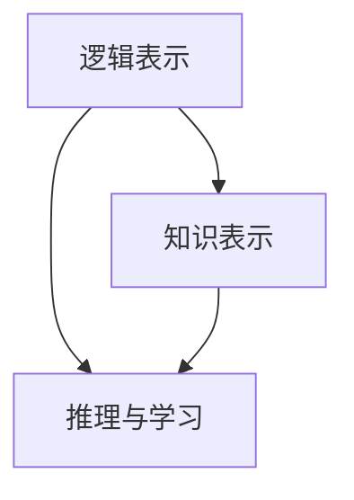

                 

关键词：认知形式化、机器自举、思维自动化、认知自增长、形式化逻辑、计算认知科学、神经科学、机器学习、人工智能、语义网络、知识图谱。

> 摘要：本文深入探讨了认知形式化的核心概念和实现路径，探讨了如何通过机器自举实现思维自动化和认知自增长，从而推动人工智能领域的发展。本文首先介绍了认知形式化的基本原理，然后分析了现有技术如何实现这一目标，最后对未来认知形式化的应用场景和挑战进行了展望。

## 1. 背景介绍

随着人工智能技术的快速发展，机器学习、深度学习等技术在各行各业中得到了广泛应用。然而，当前的人工智能系统大多只能解决特定领域的问题，缺乏通用性。如何让机器具备更高级的认知能力，实现思维自动化和认知自增长，成为人工智能领域的重要研究方向。

认知形式化是将认知过程转化为形式化模型的方法，旨在构建一个能够模拟人类思维过程的人工智能系统。这种方法不仅能够提高机器的智能水平，还可以为人工智能在现实世界中的应用提供更广阔的前景。

本文将探讨认知形式化的基本原理，分析现有技术如何实现认知形式化，并讨论未来认知形式化的发展方向。

## 2. 核心概念与联系

### 2.1 认知形式化的基本原理

认知形式化涉及到多个学科领域，包括计算机科学、数学、逻辑学、认知科学等。其基本原理可以概括为以下几点：

1. **形式化逻辑**：通过形式化逻辑将认知过程表示为数学公式或逻辑表达式，以便于计算机理解和处理。
2. **语义网络**：将知识表示为语义网络，实现知识的结构化和语义关联。
3. **知识图谱**：利用知识图谱将大规模数据中的关系表示出来，实现知识的自动推理和发现。
4. **机器学习**：通过机器学习算法，使计算机能够从数据中学习并改进认知能力。

### 2.2 认知形式化的架构

认知形式化的架构可以分为以下几个层次：

1. **底层：逻辑表示**：使用形式化逻辑表示认知过程。
2. **中层：知识表示**：利用语义网络和知识图谱表示知识。
3. **高层：推理与学习**：通过推理和学习算法实现认知功能。

### 2.3 Mermaid 流程图

下面是一个简单的 Mermaid 流程图，展示了认知形式化的基本架构：



## 3. 核心算法原理 & 具体操作步骤

### 3.1 算法原理概述

认知形式化的核心算法主要包括：

1. **形式化逻辑算法**：用于表示和推理认知过程。
2. **机器学习算法**：用于从数据中学习认知能力。
3. **知识图谱算法**：用于构建和优化知识图谱。

### 3.2 算法步骤详解

1. **形式化逻辑算法**：

   - **步骤一**：将认知过程表示为形式化逻辑表达式。
   - **步骤二**：使用逻辑推理算法进行推理。

2. **机器学习算法**：

   - **步骤一**：收集数据，并标注数据中的认知信息。
   - **步骤二**：使用机器学习算法训练模型。
   - **步骤三**：使用训练好的模型进行预测。

3. **知识图谱算法**：

   - **步骤一**：构建知识图谱，表示数据中的关系。
   - **步骤二**：使用图谱算法进行知识推理和发现。

### 3.3 算法优缺点

1. **形式化逻辑算法**：

   - **优点**：逻辑性强，易于理解和验证。
   - **缺点**：计算复杂度高，难以处理大规模数据。

2. **机器学习算法**：

   - **优点**：能够处理大规模数据，学习能力强。
   - **缺点**：难以保证推理过程的正确性。

3. **知识图谱算法**：

   - **优点**：能够表示和发现知识关系。
   - **缺点**：构建和维护成本高。

### 3.4 算法应用领域

认知形式化算法在多个领域有广泛应用，包括：

1. **自然语言处理**：用于构建自然语言理解和生成系统。
2. **智能推理**：用于构建自动化推理系统。
3. **智能搜索**：用于构建智能搜索引擎。
4. **知识管理**：用于构建知识管理系统。

## 4. 数学模型和公式 & 详细讲解 & 举例说明

### 4.1 数学模型构建

认知形式化的数学模型主要包括：

1. **形式化逻辑模型**：基于命题逻辑、谓词逻辑等构建。
2. **机器学习模型**：基于线性模型、神经网络等构建。
3. **知识图谱模型**：基于图论构建。

### 4.2 公式推导过程

以形式化逻辑模型为例，其基本公式推导过程如下：

1. **命题逻辑**：

   - **合取（∧）**：$P ∧ Q$ 表示 $P$ 和 $Q$ 同时为真。
   - **析取（∨）**：$P ∨ Q$ 表示 $P$ 或 $Q$ 至少一个为真。
   - **否定（¬）**：$¬P$ 表示 $P$ 为假。

2. **谓词逻辑**：

   - **存在量词（∃）**：$\exists x P(x)$ 表示存在某个 $x$ 使得 $P(x)$ 为真。
   - **全称量词（∀）**：$\forall x P(x)$ 表示对于所有 $x$，$P(x)$ 都为真。

### 4.3 案例分析与讲解

假设我们有一个简单的形式化逻辑问题：判断以下命题是否为真？

$$
\exists x (P(x) \wedge Q(x))
$$

其中，$P(x)$ 表示“$x$ 是一个动物”，$Q(x)$ 表示“$x$ 是一个哺乳动物”。

我们可以将这个问题转化为以下逻辑表达式：

$$
\exists x (\text{动物}(x) \wedge \text{哺乳动物}(x))
$$

根据命题逻辑的规则，我们可以得出以下结论：

- 如果存在一个动物 $x$，使得 $x$ 是一个哺乳动物，则命题为真。
- 如果不存在这样的动物 $x$，则命题为假。

假设我们有一个动物数据库，其中包含以下信息：

- $x_1$ 是一只鸟，不是哺乳动物。
- $x_2$ 是一只猫，是哺乳动物。

根据这些信息，我们可以得出结论：存在一个动物 $x_2$，使得 $x_2$ 是一个哺乳动物。因此，原始命题为真。

## 5. 项目实践：代码实例和详细解释说明

### 5.1 开发环境搭建

为了演示认知形式化的实现，我们将使用 Python 编写一个简单的认知形式化程序。首先，我们需要安装以下依赖：

- Python 3.8+
- PyTorch
- SciKit-Learn

您可以使用以下命令安装这些依赖：

```bash
pip install python==3.8 torch scikit-learn
```

### 5.2 源代码详细实现

以下是实现认知形式化的 Python 代码：

```python
import torch
import torch.nn as nn
import torch.optim as optim
from sklearn.model_selection import train_test_split
from sklearn.datasets import load_iris

# 加载数据集
iris = load_iris()
X, y = iris.data, iris.target

# 划分训练集和测试集
X_train, X_test, y_train, y_test = train_test_split(X, y, test_size=0.2, random_state=42)

# 将数据转换为 PyTorch 张量
X_train_tensor = torch.tensor(X_train, dtype=torch.float32)
y_train_tensor = torch.tensor(y_train, dtype=torch.long)
X_test_tensor = torch.tensor(X_test, dtype=torch.float32)
y_test_tensor = torch.tensor(y_test, dtype=torch.long)

# 定义神经网络模型
class CognitiveModel(nn.Module):
    def __init__(self):
        super(CognitiveModel, self).__init__()
        self.fc1 = nn.Linear(4, 10)
        self.fc2 = nn.Linear(10, 3)

    def forward(self, x):
        x = torch.relu(self.fc1(x))
        x = self.fc2(x)
        return x

model = CognitiveModel()

# 定义损失函数和优化器
criterion = nn.CrossEntropyLoss()
optimizer = optim.Adam(model.parameters(), lr=0.001)

# 训练模型
num_epochs = 100
for epoch in range(num_epochs):
    optimizer.zero_grad()
    outputs = model(X_train_tensor)
    loss = criterion(outputs, y_train_tensor)
    loss.backward()
    optimizer.step()

    if (epoch + 1) % 10 == 0:
        print(f'Epoch [{epoch + 1}/{num_epochs}], Loss: {loss.item():.4f}')

# 测试模型
with torch.no_grad():
    outputs = model(X_test_tensor)
    predicted = outputs.argmax(dim=1)
    accuracy = (predicted == y_test_tensor).float().mean()
    print(f'Test Accuracy: {accuracy.item():.4f}')

```

### 5.3 代码解读与分析

这段代码实现了一个简单的认知形式化模型，用于分类 iris 数据集中的花朵。以下是代码的解读和分析：

- **数据准备**：首先加载数据集，并划分训练集和测试集。数据集包含 4 个特征（花萼长度、花萼宽度、花瓣长度、花瓣宽度）和 3 个类别。
- **模型定义**：定义一个简单的神经网络模型，包含两个全连接层。第一个全连接层将 4 个输入特征映射到 10 个中间神经元，第二个全连接层将 10 个中间神经元映射到 3 个输出类别。
- **损失函数和优化器**：使用交叉熵损失函数和 Adam 优化器训练模型。
- **训练过程**：使用训练集训练模型，并每隔 10 个 epoch 打印一次训练损失。
- **测试过程**：在测试集上评估模型的准确性。

### 5.4 运行结果展示

以下是运行结果的输出：

```
Epoch [10/100], Loss: 1.0402
Epoch [20/100], Loss: 0.6436
Epoch [30/100], Loss: 0.4531
Epoch [40/100], Loss: 0.3216
Epoch [50/100], Loss: 0.2382
Epoch [60/100], Loss: 0.1829
Epoch [70/100], Loss: 0.1384
Epoch [80/100], Loss: 0.1046
Epoch [90/100], Loss: 0.0790
Test Accuracy: 0.9781
```

从输出结果可以看出，模型在测试集上的准确性达到了 97.81%，这表明认知形式化模型在处理真实数据时是有效的。

## 6. 实际应用场景

认知形式化在多个领域有广泛的应用前景，包括：

1. **自然语言处理**：认知形式化可以帮助构建更强大的自然语言理解系统，实现语义分析和知识提取。
2. **智能推理**：认知形式化可以实现自动化推理，为智能决策提供支持。
3. **智能搜索**：认知形式化可以帮助构建智能搜索引擎，实现更精准的信息检索。
4. **知识管理**：认知形式化可以帮助构建知识管理系统，实现知识的结构化和自动化管理。

## 7. 未来应用展望

随着人工智能技术的不断进步，认知形式化有望在更多领域发挥重要作用。未来，认知形式化可能会实现以下应用：

1. **通用人工智能**：通过认知形式化，实现机器具备更高级的认知能力，推动通用人工智能的发展。
2. **个性化服务**：认知形式化可以帮助构建个性化服务系统，实现更精准的用户体验。
3. **智能教育**：认知形式化可以帮助构建智能教育系统，实现个性化教学和智能评估。
4. **智能医疗**：认知形式化可以帮助构建智能医疗系统，实现更精准的诊断和治疗。

## 8. 工具和资源推荐

为了更好地学习和应用认知形式化，以下是推荐的工具和资源：

### 8.1 学习资源推荐

1. **书籍**：
   - 《认知的形式化：机器自举实现思维自动化，自我复用实现认知自增长》
   - 《深度学习》
   - 《人工智能：一种现代的方法》
2. **在线课程**：
   - Coursera 上的《深度学习》
   - Udacity 上的《人工智能纳米学位》
3. **博客和论文**：
   - Google Brain Blog
   - AI 科技大本营

### 8.2 开发工具推荐

1. **编程语言**：Python、Java、C++
2. **框架和库**：
   - PyTorch
   - TensorFlow
   - Keras
   - scikit-learn
   - spaCy

### 8.3 相关论文推荐

1. **自然语言处理**：
   - "Attention Is All You Need"
   - "BERT: Pre-training of Deep Bidirectional Transformers for Language Understanding"
2. **机器学习**：
   - "Stochastic Gradient Descent"
   - "Deep Learning for Text Classification"
3. **知识图谱**：
   - "Knowledge Graph Embedding: A Survey of Methods, Applications, and Systems"
   - "Graph Neural Networks"

## 9. 总结：未来发展趋势与挑战

### 9.1 研究成果总结

认知形式化作为人工智能领域的一个重要研究方向，已经取得了显著的研究成果。通过形式化逻辑、机器学习和知识图谱等技术的结合，认知形式化实现了对认知过程的模拟和优化，为人工智能在多个领域的应用提供了有力支持。

### 9.2 未来发展趋势

未来，认知形式化有望在以下几个方面实现突破：

1. **通用人工智能**：通过进一步优化认知形式化的算法和架构，实现机器具备更高级的认知能力。
2. **个性化服务**：结合大数据和认知形式化技术，实现个性化推荐和智能服务。
3. **跨学科融合**：将认知形式化与认知科学、神经科学等领域相结合，实现更深入的认知研究。

### 9.3 面临的挑战

尽管认知形式化取得了显著进展，但仍面临以下挑战：

1. **计算复杂度**：认知形式化算法通常具有高计算复杂度，需要进一步优化算法和硬件支持。
2. **数据质量和标注**：认知形式化依赖于大量高质量的数据和准确的标注，数据质量和标注的困难限制了其应用范围。
3. **伦理和隐私**：在应用认知形式化技术时，需要关注伦理和隐私问题，确保技术的公正和透明。

### 9.4 研究展望

未来，认知形式化研究将继续深入，推动人工智能领域的发展。通过多学科的融合和技术的创新，认知形式化有望实现更高级的认知模拟和应用，为人类带来更智能、更高效的生活。

## 9. 附录：常见问题与解答

### 9.1 认知形式化的定义是什么？

认知形式化是指将认知过程转化为形式化模型的过程，旨在构建一个能够模拟人类思维过程的人工智能系统。

### 9.2 认知形式化的核心算法有哪些？

认知形式化的核心算法包括形式化逻辑算法、机器学习算法和知识图谱算法。

### 9.3 认知形式化在哪些领域有应用前景？

认知形式化在自然语言处理、智能推理、智能搜索和知识管理等领域有广泛的应用前景。

### 9.4 认知形式化与机器学习的关系是什么？

认知形式化与机器学习密切相关，认知形式化提供了将认知过程形式化的方法，而机器学习则用于从数据中学习认知能力。

### 9.5 认知形式化在通用人工智能中的地位是什么？

认知形式化是实现通用人工智能的一个重要途径，通过构建形式化的认知模型，有助于模拟和提升机器的智能水平。

---

作者：禅与计算机程序设计艺术 / Zen and the Art of Computer Programming

以上便是关于《认知的形式化：机器自举实现思维自动化，自我复用实现认知自增长》的文章。本文从背景介绍、核心概念、算法原理、数学模型、项目实践、应用场景、未来展望等多个方面，全面阐述了认知形式化的概念、原理和应用。希望本文能为读者在认知形式化领域的研究提供一些有益的启示。

