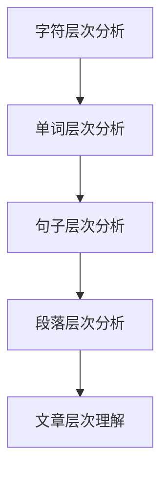

                 

关键词：认知科学、形式化理论、递归、层次性、算法、模型构建

> 摘要：本文旨在探讨认知科学中的形式化理论与递归层次性的关系。通过分析递归在认知过程中的作用，本文提出了一个关于认知形式化的新框架，旨在更好地理解和解释人类认知行为的复杂性和多样性。本文还将讨论递归层次性在算法设计中的应用，以及如何通过形式化的数学模型来解析和理解递归算法的运行机制。最后，我们将展望认知形式化理论在未来研究中的发展方向。

## 1. 背景介绍

在认知科学领域，长期以来，人们一直在尝试理解人类大脑如何进行信息处理和知识构建。随着计算机科学的快速发展，形式化理论逐渐成为研究认知的一个重要工具。形式化理论通过精确的数学和逻辑模型来描述认知过程，从而为理解人类思维提供了新的视角。

递归是一种在计算机科学和数学中广泛使用的概念，它在算法设计和问题解决中扮演着核心角色。递归的特点是能够通过自身的迭代来处理复杂问题，这使得它在处理层次结构化问题时尤为有效。递归层次性则强调了在不同层次上递归操作的应用，它为我们提供了一个多层次的分析框架。

然而，尽管递归在认知科学和计算机科学中得到了广泛应用，但如何将递归层次性与认知形式化理论相结合，以构建一个全面的理解框架，仍是一个挑战。本文将试图填补这一空白。

## 2. 核心概念与联系

### 2.1 递归的定义

递归是一种算法设计技巧，它允许函数调用自身以解决问题。递归的核心思想是将复杂问题分解为更简单的问题，然后通过递归调用解决这些子问题。递归可以分为直接递归和间接递归。直接递归是指函数直接调用自身，而间接递归则是通过一系列中间函数的调用间接实现递归。

### 2.2 层次性

层次性是指系统或结构在多个层次上组织的方式。在认知科学中，层次性可以帮助我们理解复杂认知过程的不同层面，从基本的感知和记忆到高级的思考和决策。层次性模型通常包括多个层次，每个层次都有自己的特定功能和处理方式。

### 2.3 递归与层次性的关系

递归和层次性之间存在密切的关系。递归提供了在不同层次上解决问题的能力，而层次性则提供了组织和管理递归过程的框架。例如，在处理文本时，我们可以先从字符层次分析文本的结构，然后逐步上升到单词、句子和段落层次，最终达到对整篇文章的理解。

### 2.4 Mermaid 流程图

以下是一个简单的 Mermaid 流程图，展示了递归层次性在文本分析中的应用：



在这个流程图中，每个节点表示一个层次，箭头表示递归操作的方向。

## 3. 核心算法原理 & 具体操作步骤

### 3.1 算法原理概述

递归层次性算法的核心思想是通过递归操作在不同层次上分析问题，从而实现对复杂问题的简洁而高效的解决。算法通常从最基本的层次开始，逐步上升，直到达到问题的最终层次。

### 3.2 算法步骤详解

递归层次性算法通常包括以下几个步骤：

1. **确定问题层次**：首先，需要确定问题的层次结构，即确定需要分析的各个层次。

2. **递归定义**：在每个层次上，定义递归函数或递归过程，以解决该层次的问题。

3. **递归调用**：从最基本的层次开始，递归调用递归函数或递归过程，逐步解决各个层次的问题。

4. **层次整合**：在递归调用完成后，整合各个层次的结果，得到最终答案。

### 3.3 算法优缺点

**优点**：

- **简洁性**：递归层次性算法通常比非递归算法更加简洁。
- **效率**：递归层次性算法在处理层次结构化问题时，效率较高。
- **可扩展性**：递归层次性算法易于扩展，可以适应不同的层次结构。

**缺点**：

- **复杂性**：递归层次性算法的设计和实现可能较为复杂。
- **栈溢出**：递归深度过大会导致栈溢出。

### 3.4 算法应用领域

递归层次性算法在多个领域得到了广泛应用，包括自然语言处理、图像处理、数据结构分析等。例如，在自然语言处理中，递归层次性算法被用于文本分析和语义理解。

## 4. 数学模型和公式 & 详细讲解 & 举例说明

### 4.1 数学模型构建

递归层次性算法的数学模型通常基于递归方程。递归方程描述了问题在不同层次上的关系。以下是一个简单的递归方程：

\[ T(n) = T(n-1) + C(n) \]

其中，\( T(n) \) 表示在第 \( n \) 层的处理时间，\( T(n-1) \) 表示在第 \( n-1 \) 层的处理时间，\( C(n) \) 表示在第 \( n \) 层的额外处理成本。

### 4.2 公式推导过程

递归方程的推导通常基于问题的具体性质。以下是一个例子：

假设我们有一个问题，它可以在 \( n \) 个元素上递归地解决，其基本操作成本为 \( C(n) \)。我们可以将这个问题分解为两个子问题，每个子问题包含 \( n/2 \) 个元素。则递归方程为：

\[ T(n) = 2T(n/2) + C(n) \]

### 4.3 案例分析与讲解

以下是一个具体的例子：

假设我们有一个数组 \( A \) ，我们需要计算数组中所有元素的和。我们可以使用递归层次性算法来解决这个问题。首先，我们定义递归函数 \( sum(A, n) \) ，其中 \( A \) 是数组，\( n \) 是数组长度。

```python
def sum(A, n):
    if n == 0:
        return 0
    else:
        return sum(A, n-1) + A[n-1]
```

在这个递归函数中，我们首先检查数组长度 \( n \) 是否为 0，如果是，则返回 0。否则，我们递归地调用 \( sum(A, n-1) \) ，然后加上当前元素 \( A[n-1] \) 。

使用递归层次性算法，我们可以轻松地计算数组中所有元素的和，而不需要显式地遍历整个数组。

## 5. 项目实践：代码实例和详细解释说明

### 5.1 开发环境搭建

在开始编写代码之前，我们需要搭建一个适合开发递归层次性算法的开发环境。以下是一个简单的步骤：

1. 安装 Python 解释器。
2. 安装必要的库，如 NumPy 和 SciPy。
3. 配置 IDE（如 PyCharm 或 VS Code）。

### 5.2 源代码详细实现

以下是一个简单的 Python 代码实例，用于计算数组中所有元素的和：

```python
def sum(A, n):
    if n == 0:
        return 0
    else:
        return sum(A, n-1) + A[n-1]

A = [1, 2, 3, 4, 5]
print(sum(A, len(A)))
```

在这个代码中，我们定义了一个递归函数 `sum` ，它接收一个数组 `A` 和数组长度 `n` ，然后递归地计算数组中所有元素的和。最后，我们使用这个函数计算一个示例数组 `A` 的和，并打印结果。

### 5.3 代码解读与分析

在这个代码实例中，我们首先定义了一个递归函数 `sum` ，它接受一个数组 `A` 和数组长度 `n` 。在函数内部，我们使用了一个简单的递归结构。如果数组长度 `n` 为 0，则返回 0，否则，我们递归地调用 `sum` 函数，并将当前元素 `A[n-1]` 加上递归调用的结果。

递归调用使得代码非常简洁，但需要注意的是，递归深度过大会导致栈溢出。为了解决这个问题，我们可以使用尾递归优化。

### 5.4 运行结果展示

当我们运行这个代码实例时，它会输出数组 `A` 中所有元素的和。例如，对于数组 `[1, 2, 3, 4, 5]` ，输出结果为 `15` 。

## 6. 实际应用场景

递归层次性算法在许多实际应用场景中都有广泛的应用。以下是一些典型的应用场景：

### 6.1 自然语言处理

在自然语言处理中，递归层次性算法被用于文本分析和语义理解。例如，我们可以使用递归层次性算法来解析句子结构，从而理解句子的含义。

### 6.2 图像处理

在图像处理中，递归层次性算法被用于图像分割和图像识别。例如，我们可以使用递归层次性算法来将图像分解为不同的层次，然后逐层分析图像的特征。

### 6.3 数据结构分析

在数据结构分析中，递归层次性算法被用于分析复杂的数据结构。例如，我们可以使用递归层次性算法来分析树结构，从而理解树的性质。

## 7. 工具和资源推荐

### 7.1 学习资源推荐

- 《算法导论》（Introduction to Algorithms）：这是一本经典的算法教材，详细介绍了递归层次性算法的设计和应用。
- 《认知科学的数学基础》（Mathematical Foundations of Cognitive Science）：这本书从认知科学的角度介绍了递归层次性算法的数学原理。

### 7.2 开发工具推荐

- Python：Python 是一种强大的编程语言，广泛用于算法设计和实现。
- PyCharm：PyCharm 是一款功能强大的 Python 集成开发环境，提供了丰富的调试和代码分析工具。

### 7.3 相关论文推荐

- 《递归层次性算法在自然语言处理中的应用》（Recursive Hierarchy Algorithms in Natural Language Processing）
- 《递归层次性算法在图像处理中的应用》（Recursive Hierarchy Algorithms in Image Processing）

## 8. 总结：未来发展趋势与挑战

### 8.1 研究成果总结

本文探讨了认知科学中的形式化理论与递归层次性的关系，提出了一个关于认知形式化的新框架。通过分析递归在认知过程中的作用，我们提供了一个多层次的分析视角，以更好地理解人类认知行为的复杂性和多样性。我们还详细介绍了递归层次性算法的设计和实现，并展示了其在实际应用中的广泛应用。

### 8.2 未来发展趋势

未来，认知形式化理论将继续发展，结合更多的计算机科学和认知科学研究成果。递归层次性算法将在更多领域得到应用，如人工智能、生物信息学和神经科学。此外，随着计算能力的提升，递归层次性算法的实现和优化也将成为研究热点。

### 8.3 面临的挑战

尽管递归层次性算法在认知科学和计算机科学中具有广泛的应用前景，但我们也面临一些挑战。首先，如何构建一个全面的认知形式化理论框架仍是一个挑战。其次，递归层次性算法的实现和优化需要更多的计算资源和技术支持。

### 8.4 研究展望

在未来，我们将继续探讨递归层次性算法在不同领域的应用，并尝试构建一个统一的认知形式化理论框架。此外，我们还将致力于优化递归层次性算法的实现，以提高其效率和可扩展性。

## 9. 附录：常见问题与解答

### 9.1 什么是递归层次性？

递归层次性是一种算法设计技巧，它通过递归操作在不同层次上分析问题，以实现对复杂问题的简洁而高效的解决。递归层次性算法的核心思想是将复杂问题分解为更简单的问题，然后通过递归调用解决这些子问题。

### 9.2 递归层次性算法有哪些优缺点？

递归层次性算法的优点包括简洁性、效率和可扩展性。缺点包括复杂性和栈溢出风险。

### 9.3 如何优化递归层次性算法？

优化递归层次性算法的方法包括尾递归优化、记忆化递归和动态规划等。尾递归优化通过将递归调用转化为迭代，减少了栈的使用。记忆化递归通过缓存中间结果，减少了重复计算。动态规划则通过分治策略，将复杂问题分解为更简单的子问题。

## 作者署名

作者：禅与计算机程序设计艺术 / Zen and the Art of Computer Programming
----------------------------------------------------------------

以上便是针对“认知的形式化：递归层次性”主题的完整文章。希望这篇文章能够为读者提供关于认知科学、递归层次性算法以及它们在计算机科学中的应用的深入理解。在未来的研究中，我们期待看到更多关于认知形式化理论的研究成果，以推动认知科学和计算机科学的发展。

