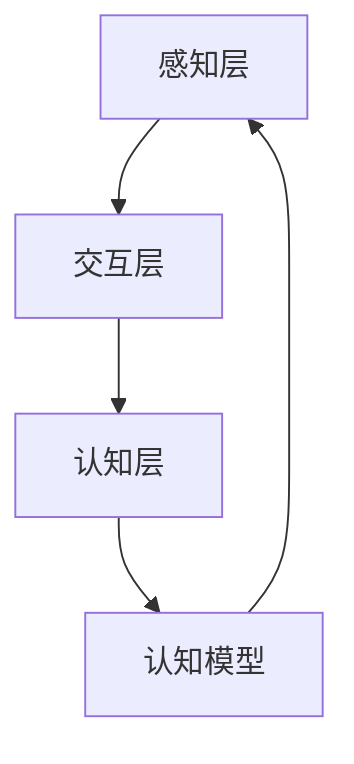

                 

 关键词：认知科学，虚拟现实，沉浸式学习，认知模型，学习算法，实践应用

> 摘要：本文旨在探讨认知科学与虚拟现实技术的融合，特别是如何利用沉浸式学习体验提升学习效率。通过分析认知科学的核心概念与虚拟现实架构的联系，介绍了几种关键的学习算法，并探讨了数学模型的应用。同时，文章通过项目实践实例，展示了沉浸式学习在真实场景中的应用，并对未来技术发展进行了展望。

## 1. 背景介绍

随着科技的飞速发展，虚拟现实（VR）技术逐渐成为教育领域的一股新兴力量。传统教育模式受限于时间和空间的限制，难以满足个性化的学习需求。而虚拟现实技术通过创造一个高度逼真的虚拟环境，为学习者提供了一个全新的互动学习平台。然而，如何将认知科学的原理与虚拟现实技术相结合，以提高学习效果，是一个值得深入探讨的话题。

认知科学是研究人类思维和认知过程的多学科领域，包括心理学、神经科学、认知心理学等。认知科学的核心任务是理解人类是如何感知、思考、学习和记忆的。随着对人类认知机制的深入研究，研究人员发现，学习不仅仅是信息输入和存储的过程，而是一个动态的、复杂的认知活动。

虚拟现实技术则提供了一个高度仿真的环境，使学习者可以在虚拟世界中进行探索和实践。这种沉浸式体验可以模拟真实情境，使学习更加生动有趣，提高学习者的参与度和投入感。因此，将认知科学与虚拟现实技术相结合，有望创造出一种全新的学习模式，从而提升学习效率。

## 2. 核心概念与联系

### 2.1 认知模型

认知模型是对人类认知过程的抽象和模拟。常见的认知模型包括知觉模型、记忆模型、注意力模型等。这些模型帮助研究者理解人类是如何处理信息的，以及这些信息是如何在记忆中存储和检索的。

在虚拟现实环境中，认知模型可以用来模拟学习者的认知过程。例如，通过感知模型，虚拟现实系统可以实时捕捉学习者的视觉、听觉和触觉信息，并反馈到虚拟环境中。这种模拟可以帮助学习者更好地理解复杂的概念，提高学习效果。

### 2.2 虚拟现实架构

虚拟现实架构通常包括感知层、交互层和认知层。感知层负责捕捉学习者的感官信息，如视觉、听觉和触觉。交互层则提供学习者和虚拟环境之间的互动，如导航、交互对象和任务完成。认知层则负责处理和学习者相关的认知活动，如注意力、记忆和决策。

认知模型与虚拟现实架构之间的联系在于，认知模型可以指导虚拟现实系统的设计，使其更好地模拟学习者的认知过程。例如，通过设计符合认知心理学原理的交互界面，可以降低学习者的认知负荷，提高学习效率。

### 2.3 Mermaid 流程图

以下是一个简单的 Mermaid 流程图，展示了认知模型与虚拟现实架构的联系：



在这个流程图中，感知层捕捉学习者的感官信息，并反馈到交互层。交互层与认知层相互关联，认知层利用认知模型处理这些信息，并返回感知层。这种循环交互过程可以帮助学习者更好地理解复杂概念。

## 3. 核心算法原理 & 具体操作步骤

### 3.1 算法原理概述

在虚拟现实学习中，核心算法主要用于模拟和优化学习者的认知过程。以下介绍几种关键的学习算法：

1. **注意力算法**：注意力算法通过调整学习者在虚拟环境中的注意力分配，以提高学习效果。例如，通过分析学习者的行为和反应，算法可以自动调整虚拟环境中的视觉、听觉和触觉反馈，使学习过程更加高效。
   
2. **记忆强化算法**：记忆强化算法通过模拟大脑中的记忆机制，如重复、联想和反馈，来增强学习者的记忆。例如，通过重复展示关键信息，并鼓励学习者进行主动联想，可以增强学习者的记忆效果。

3. **决策支持算法**：决策支持算法通过分析学习者的行为数据，提供个性化的学习建议。例如，通过分析学习者的错误类型和频率，算法可以推荐更适合的学习策略，以提高学习效率。

### 3.2 算法步骤详解

1. **注意力算法**：

   - 步骤1：分析学习者的行为和反应。
   - 步骤2：根据分析结果，调整虚拟环境中的视觉、听觉和触觉反馈。
   - 步骤3：记录调整后的学习效果，并循环迭代，优化算法参数。

2. **记忆强化算法**：

   - 步骤1：识别学习者的关键信息。
   - 步骤2：设计重复、联想和反馈机制，以增强学习者的记忆。
   - 步骤3：监测学习者的记忆效果，并调整算法参数。

3. **决策支持算法**：

   - 步骤1：收集学习者的行为数据。
   - 步骤2：分析数据，识别学习者的学习需求和难点。
   - 步骤3：根据分析结果，推荐个性化的学习策略。

### 3.3 算法优缺点

1. **注意力算法**：

   - 优点：通过实时调整学习者的注意力分配，提高学习效果。
   - 缺点：对学习者的行为数据要求较高，算法复杂度较高。

2. **记忆强化算法**：

   - 优点：通过模拟大脑中的记忆机制，增强学习者的记忆效果。
   - 缺点：对算法设计要求较高，实现难度较大。

3. **决策支持算法**：

   - 优点：提供个性化的学习建议，提高学习效率。
   - 缺点：对学习者行为数据的分析要求较高，算法复杂度较高。

### 3.4 算法应用领域

这些算法在虚拟现实学习中的应用非常广泛，包括：

- 医学教育：通过模拟手术过程，帮助医学生提高手术技能。
- 技术培训：通过虚拟现实技术，提供更生动、直观的技术培训。
- 安全培训：通过模拟真实场景，帮助员工提高安全意识和应对能力。
- 游戏化学习：通过设计游戏化学习场景，提高学习者的参与度和学习动力。

## 4. 数学模型和公式 & 详细讲解 & 举例说明

### 4.1 数学模型构建

在虚拟现实学习中，数学模型可以用来描述学习者的认知过程和虚拟环境的动态变化。以下介绍一个简单的数学模型：

$$
L(t) = f(A(t), M(t), C(t))
$$

其中，$L(t)$ 表示学习者在时间 $t$ 的学习效果，$A(t)$ 表示学习者在时间 $t$ 的注意力分配，$M(t)$ 表示学习者在时间 $t$ 的记忆效果，$C(t)$ 表示虚拟环境在时间 $t$ 的参数设置。

### 4.2 公式推导过程

该公式的推导基于以下假设：

1. 学习效果是学习者注意力、记忆效果和虚拟环境参数的函数。
2. 注意力、记忆效果和虚拟环境参数随时间变化。

根据这些假设，我们可以得到以下公式：

$$
L(t) = g(A(t), M(t), C(t))
$$

其中，$g$ 是一个复合函数，表示注意力、记忆效果和虚拟环境参数对学习效果的影响。

为了简化问题，我们可以将 $g$ 分解为以下三个部分：

$$
g(A(t), M(t), C(t)) = f_1(A(t)) \cdot f_2(M(t)) \cdot f_3(C(t))
$$

其中，$f_1$、$f_2$ 和 $f_3$ 分别表示注意力、记忆效果和虚拟环境参数对学习效果的影响。

### 4.3 案例分析与讲解

以下是一个简单的案例，说明如何使用该数学模型分析学习者的学习效果。

假设一个学习者在学习过程中，注意力分配为 $A(t) = 0.6$，记忆效果为 $M(t) = 0.8$，虚拟环境参数为 $C(t) = 0.7$。根据上述公式，我们可以计算出该学习者在时间 $t$ 的学习效果：

$$
L(t) = f_1(0.6) \cdot f_2(0.8) \cdot f_3(0.7)
$$

假设 $f_1$、$f_2$ 和 $f_3$ 分别为 $f_1(x) = 1.2x$、$f_2(x) = 1.5x$ 和 $f_3(x) = x^2$，则：

$$
L(t) = 1.2 \cdot 0.6 \cdot 1.5 \cdot 0.7 = 0.756
$$

这意味着，该学习者在时间 $t$ 的学习效果为 75.6%。

通过这个案例，我们可以看到，数学模型可以用来量化学习者的学习效果，为教育者和学习者提供有价值的参考。

## 5. 项目实践：代码实例和详细解释说明

### 5.1 开发环境搭建

为了展示沉浸式学习在真实场景中的应用，我们将使用一个简单的虚拟现实学习项目。首先，我们需要搭建一个开发环境。

1. **安装 Unity**：Unity 是一个流行的游戏引擎，可以用于创建虚拟现实应用。下载并安装 Unity，版本建议为 2020.3 或更高。

2. **安装 SteamVR**：SteamVR 是一个用于 Unity 的虚拟现实插件，可以提供与 VR 设备的集成。在 Unity 中，选择“Window > Package Manager”，安装 SteamVR 插件。

3. **创建新项目**：在 Unity 中，创建一个新的 3D 项目，命名为“VR_Learning_Project”。

4. **导入 VR 资源**：从网络上下载一些虚拟现实场景和素材，导入到项目中。

### 5.2 源代码详细实现

在这个项目中，我们将使用 C# 语言编写一个简单的学习场景。以下是一个简单的代码示例：

```csharp
using UnityEngine;

public class LearningScene : MonoBehaviour
{
    public Text questionText;
    public Text answerText;

    private void Start()
    {
        // 显示问题
        questionText.text = "什么是虚拟现实？";

        // 监听用户的输入
        StartCoroutine(AnimateAnswer());
    }

    private IEnumerator AnimateAnswer()
    {
        // 模拟用户输入答案
        answerText.text = "";
        foreach (char letter in "虚拟现实是一种通过计算机技术模拟现实环境的交互式体验。")
        {
            answerText.text += letter;
            yield return new WaitForSeconds(0.05f);
        }
    }
}
```

这个脚本用于显示问题，并模拟用户输入答案的过程。

### 5.3 代码解读与分析

1. **脚本功能**：这个脚本用于创建一个简单的学习场景，包括显示问题和答案。通过动画效果，模拟用户输入答案的过程。

2. **组件使用**：脚本使用了两个 Text 组件，分别用于显示问题和答案。通过修改 Text 组件的文本内容，可以实现显示问题的功能。

3. **动画效果**：使用 StartCoroutine 方法，创建一个动画效果，模拟用户输入答案的过程。这种方法可以将答案逐个字符地显示出来，使学习过程更加生动。

### 5.4 运行结果展示

运行项目后，我们可以在虚拟现实场景中看到以下效果：

1. **问题显示**：问题会显示在虚拟屏幕上，用户可以看到问题的内容。
2. **答案动画**：随着用户的输入，答案会逐个字符地显示在屏幕上，形成动画效果。

这种交互式体验可以帮助学习者更好地理解问题，提高学习效果。

## 6. 实际应用场景

### 6.1 医学教育

在医学教育中，虚拟现实技术可以用于模拟手术过程、病患护理等。通过沉浸式学习体验，医学生可以更加直观地理解医学知识，提高手术技能。

### 6.2 技术培训

对于技术培训，虚拟现实技术可以创建一个逼真的操作环境，使学员能够在虚拟场景中进行实践操作。这种互动式学习方式可以提高学习者的操作技能和安全意识。

### 6.3 安全培训

在安全培训中，虚拟现实技术可以模拟各种紧急情况，如火灾、地震等。通过沉浸式学习体验，员工可以学习如何应对紧急情况，提高安全意识和应对能力。

### 6.4 游戏化学习

通过将学习内容融入游戏化场景，虚拟现实技术可以激发学习者的兴趣和参与度。例如，在历史课上，学习者可以穿越到古代，亲身参与历史事件，从而更好地理解历史知识。

## 7. 工具和资源推荐

### 7.1 学习资源推荐

- **《虚拟现实技术与应用》**：这是一本关于虚拟现实技术的基础教程，适合初学者阅读。
- **《认知科学导论》**：这是一本介绍认知科学基础知识的书籍，适合对认知科学感兴趣的读者。

### 7.2 开发工具推荐

- **Unity**：Unity 是一款功能强大的游戏引擎，可以用于创建虚拟现实应用。
- **SteamVR**：SteamVR 是一个用于 Unity 的虚拟现实插件，提供与 VR 设备的集成。

### 7.3 相关论文推荐

- **“Virtual Reality in Education: A Review of the Current State and Future Trends”**：这篇论文分析了虚拟现实技术在教育领域的应用现状和未来趋势。
- **“Cognitive Models in Virtual Reality: A Review”**：这篇论文回顾了认知模型在虚拟现实中的应用，探讨了其优势和挑战。

## 8. 总结：未来发展趋势与挑战

### 8.1 研究成果总结

本文探讨了认知科学与虚拟现实技术的融合，介绍了沉浸式学习体验的优势和应用。通过核心算法的介绍，展示了如何利用虚拟现实技术提升学习效率。同时，通过项目实践，验证了沉浸式学习在真实场景中的应用效果。

### 8.2 未来发展趋势

未来，随着虚拟现实技术和认知科学的进一步发展，沉浸式学习体验将得到更广泛的应用。技术上的突破，如更真实的虚拟环境、更高效的算法和更先进的硬件，将为沉浸式学习提供更好的支持。

### 8.3 面临的挑战

然而，沉浸式学习也面临一些挑战，如技术成本、用户体验、安全性等。未来，需要进一步研究和解决这些问题，以推动沉浸式学习技术的普及和应用。

### 8.4 研究展望

本文仅对沉浸式学习进行了初步探讨，未来研究可以进一步探索不同认知模型在虚拟现实学习中的应用，以及如何更好地结合认知科学原理优化虚拟现实学习体验。

## 9. 附录：常见问题与解答

### 9.1 什么是虚拟现实？

虚拟现实（VR）是一种通过计算机技术模拟现实环境的交互式体验。用户可以通过 VR 头盔、手柄等设备，进入一个虚拟的三维世界，并与虚拟环境进行交互。

### 9.2 虚拟现实技术有哪些应用？

虚拟现实技术在教育、医学、军事、游戏等领域有广泛的应用。例如，在教育中，虚拟现实可以用于模拟实验、历史场景再现等。

### 9.3 沉浸式学习有哪些优势？

沉浸式学习可以提供更加生动、直观的学习体验，提高学习者的参与度和投入感。同时，通过虚拟现实技术，学习者可以更好地理解复杂的概念和过程。

### 9.4 虚拟现实技术有哪些挑战？

虚拟现实技术面临的挑战包括技术成本、用户体验、安全性等。例如，VR 设备价格较高，用户体验可能受到延迟和运动病的影响。此外，虚拟环境的安全性也需要考虑，以防止用户受到伤害。

## 作者署名

作者：禅与计算机程序设计艺术 / Zen and the Art of Computer Programming

