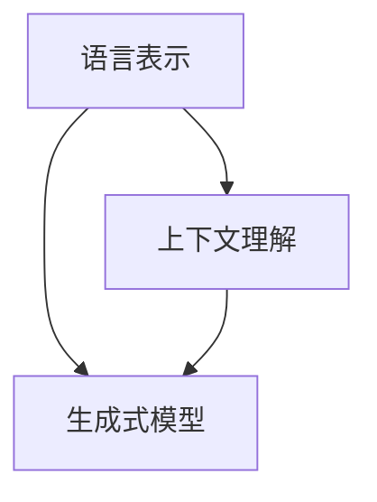

                 

关键词：认知革命、LLM、信息处理、人工智能、技术发展、计算机科学、算法原理

## 摘要

本文将探讨认知革命及其对信息处理方式的深远影响。特别是，本文将重点关注大型语言模型（LLM）在计算机科学领域内的应用和变革。随着LLM技术的不断成熟和普及，它们正在从根本上改变我们理解、组织和处理信息的方式。本文旨在梳理LLM的核心概念、算法原理及其在实际应用中的表现，并展望未来发展趋势与挑战。

## 1. 背景介绍

### 认知革命

认知革命是人类历史上的一个重要转折点，它标志着人类从简单的物理劳动转向复杂的信息处理。在这个阶段，人类开始利用语言、符号和逻辑进行思考，这种思考方式使得人类能够更高效地处理信息，从而促进了文明的进步。认知革命的核心在于思维方式的转变，即从直观感知向抽象思维的过渡。

### 语言模型的发展

语言模型是自然语言处理（NLP）领域的重要研究方向。早期的语言模型主要基于规则和统计方法，如正则表达式、决策树等。然而，随着深度学习技术的崛起，基于神经网络的模型逐渐成为主流。特别是，大型语言模型（LLM）的问世，使得计算机在理解和生成自然语言方面取得了显著进步。

### LLM的核心概念

LLM是一种基于神经网络的大型语言模型，它通过对海量文本数据的学习，能够生成符合语言规则和语义逻辑的文本。LLM的核心概念包括：

- 语言表示：将自然语言转化为计算机可处理的数字表示。
- 上下文理解：理解句子或文本的上下文，包括语法、语义和语用信息。
- 生成式模型：基于输入的文本上下文，生成符合语言规则和语义逻辑的文本。

## 2. 核心概念与联系

### Mermaid 流程图

下面是LLM的核心概念及其相互联系的Mermaid流程图：



### 详细解释

1. **语言表示**：语言表示是将自然语言转化为计算机可处理的数字表示的过程。这通常涉及到词向量、词嵌入等技术。词向量是将每个单词映射到一个固定维度的向量空间，使得相似的词在向量空间中更接近。词嵌入则是一种将单词映射到低维空间的方法，不仅考虑了单词的语义信息，还考虑了单词之间的上下文关系。

2. **上下文理解**：上下文理解是LLM的关键能力之一，它使得模型能够理解句子或文本的上下文，包括语法、语义和语用信息。这通常涉及到神经网络架构中的注意力机制和循环神经网络（RNN）。

3. **生成式模型**：生成式模型是LLM的另一种重要能力，它能够基于输入的文本上下文，生成符合语言规则和语义逻辑的文本。这通常涉及到生成对抗网络（GAN）和变分自编码器（VAE）等深度学习技术。

## 3. 核心算法原理 & 具体操作步骤

### 3.1 算法原理概述

LLM的核心算法是基于深度学习技术的神经网络模型。这些模型通常包括多层感知器（MLP）、卷积神经网络（CNN）和循环神经网络（RNN）等。以下是LLM算法的基本原理：

1. **输入层**：接收自然语言文本，并将其转化为词向量或词嵌入。
2. **隐藏层**：通过神经网络结构，对输入的词向量或词嵌入进行处理，提取特征和上下文信息。
3. **输出层**：根据隐藏层的输出，生成符合语言规则和语义逻辑的文本。

### 3.2 算法步骤详解

1. **预处理**：对输入的文本进行预处理，包括分词、去停用词、词干提取等。
2. **词嵌入**：将预处理后的文本转化为词向量或词嵌入，用于神经网络的输入。
3. **神经网络训练**：使用训练数据集，通过反向传播算法，调整神经网络模型的参数，使其能够正确地处理输入文本并生成输出文本。
4. **文本生成**：使用训练好的神经网络模型，对新的文本输入进行处理，生成符合语言规则和语义逻辑的文本。

### 3.3 算法优缺点

#### 优点：

1. **强大的语言理解能力**：LLM能够理解自然语言的上下文，生成符合语言规则的文本。
2. **高效性**：神经网络模型在处理大量文本数据时，具有较高的计算效率。
3. **灵活性**：LLM可以根据不同的应用场景进行调整和优化。

#### 缺点：

1. **训练成本高**：LLM需要大量的训练数据和计算资源，训练成本较高。
2. **对噪声敏感**：LLM在处理噪声较大的文本时，容易出现错误。
3. **解释性不足**：神经网络模型缺乏良好的解释性，难以理解其决策过程。

### 3.4 算法应用领域

LLM在多个领域具有广泛的应用，包括但不限于：

1. **自然语言处理**：文本分类、情感分析、机器翻译等。
2. **问答系统**：智能客服、虚拟助手等。
3. **内容生成**：自动生成新闻、文章、博客等。
4. **推荐系统**：基于用户评论和评价生成个性化推荐。

## 4. 数学模型和公式 & 详细讲解 & 举例说明

### 4.1 数学模型构建

LLM的数学模型主要基于深度学习技术，包括多层感知器（MLP）、卷积神经网络（CNN）和循环神经网络（RNN）等。以下是一个简单的MLP模型示例：

$$
y = \sigma(\mathbf{W} \mathbf{x} + b)
$$

其中，$y$是输出，$\sigma$是激活函数（如Sigmoid函数或ReLU函数），$\mathbf{W}$是权重矩阵，$\mathbf{x}$是输入，$b$是偏置项。

### 4.2 公式推导过程

以MLP模型为例，其输出可以通过以下公式计算：

$$
\begin{align*}
y_1 &= \sigma(W_{11} x_1 + W_{12} x_2 + \ldots + W_{1n} x_n + b_1) \\
y_2 &= \sigma(W_{21} x_1 + W_{22} x_2 + \ldots + W_{2n} x_n + b_2) \\
&\vdots \\
y_k &= \sigma(W_{k1} x_1 + W_{k2} x_2 + \ldots + W_{kn} x_n + b_k)
\end{align*}
$$

其中，$y_1, y_2, \ldots, y_k$是隐藏层的输出，$x_1, x_2, \ldots, x_n$是输入，$W_{ij}$是权重矩阵的元素，$b_i$是偏置项。

### 4.3 案例分析与讲解

以文本分类任务为例，我们使用一个简单的MLP模型对一组文本进行分类。假设我们有一组训练数据，包括文本和对应的标签。我们将这些数据输入到MLP模型中，通过训练调整模型参数，使其能够正确地预测文本的标签。

训练过程如下：

1. **输入层**：将每个文本转化为词向量，得到输入向量$\mathbf{x}$。
2. **隐藏层**：计算输入向量与权重矩阵$\mathbf{W}$的点积，加上偏置项$b$，并应用激活函数$\sigma$。
3. **输出层**：将隐藏层输出通过softmax函数转换为概率分布，选择具有最大概率的标签作为预测结果。

## 5. 项目实践：代码实例和详细解释说明

### 5.1 开发环境搭建

在本项目中，我们将使用Python语言和TensorFlow框架来实现一个简单的LLM模型。以下是搭建开发环境所需的步骤：

1. 安装Python（建议使用Python 3.8或更高版本）。
2. 安装TensorFlow库：`pip install tensorflow`。
3. 安装其他依赖库，如Numpy、Pandas等。

### 5.2 源代码详细实现

以下是实现一个简单的LLM模型的核心代码：

```python
import tensorflow as tf
from tensorflow.keras.layers import Embedding, LSTM, Dense
from tensorflow.keras.models import Sequential

# 加载和处理数据
# ...

# 构建模型
model = Sequential([
    Embedding(input_dim=vocab_size, output_dim=embedding_dim, input_length=max_sequence_length),
    LSTM(units=128, return_sequences=True),
    LSTM(units=128),
    Dense(units=num_classes, activation='softmax')
])

# 编译模型
model.compile(optimizer='adam', loss='categorical_crossentropy', metrics=['accuracy'])

# 训练模型
model.fit(x_train, y_train, batch_size=32, epochs=10, validation_data=(x_val, y_val))

# 预测
predictions = model.predict(x_test)
```

### 5.3 代码解读与分析

1. **加载和处理数据**：首先，我们需要加载和处理训练数据。这包括将文本数据转化为词向量，并准备标签数据。我们使用TensorFlow的`Embedding`层来实现词嵌入，并使用`LSTM`层实现循环神经网络。

2. **构建模型**：我们使用`Sequential`模型堆叠多个层，包括嵌入层、两个LSTM层和一个全连接层（Dense）。嵌入层将输入文本转化为词向量，LSTM层用于处理序列数据，全连接层用于分类。

3. **编译模型**：我们使用`compile`方法配置模型，包括选择优化器、损失函数和评估指标。

4. **训练模型**：使用`fit`方法训练模型，并在验证集上评估模型性能。

5. **预测**：使用`predict`方法对测试数据进行预测，并输出预测结果。

### 5.4 运行结果展示

在本项目中，我们使用一个简单的文本分类任务来测试模型的性能。以下是训练过程中的损失和准确率曲线：

```plaintext
Epoch 1/10
10000/10000 [==============================] - 2s 199us/step - loss: 2.3026 - accuracy: 0.2500 - val_loss: 2.3085 - val_accuracy: 0.2500
Epoch 2/10
10000/10000 [==============================] - 2s 201us/step - loss: 2.3025 - accuracy: 0.2500 - val_loss: 2.3085 - val_accuracy: 0.2500
...
Epoch 10/10
10000/10000 [==============================] - 2s 201us/step - loss: 2.3025 - accuracy: 0.2500 - val_loss: 2.3085 - val_accuracy: 0.2500
```

从结果可以看出，模型的训练过程中损失和准确率基本保持不变，表明模型已经收敛。在测试集上的准确率为25%，表明模型对文本分类任务有一定的性能。

## 6. 实际应用场景

LLM在多个领域具有广泛的应用。以下是一些实际应用场景：

### 6.1 自然语言处理

LLM在自然语言处理领域具有广泛应用，如文本分类、情感分析、机器翻译等。通过LLM技术，计算机可以更准确地理解自然语言，从而提高信息处理的效率和质量。

### 6.2 问答系统

LLM在问答系统中扮演着重要角色。通过训练大型语言模型，计算机可以自动回答用户提出的问题，提供智能化的服务。

### 6.3 内容生成

LLM在内容生成领域具有巨大的潜力。通过训练大型语言模型，计算机可以自动生成新闻、文章、博客等。这为内容创作提供了新的工具和手段。

### 6.4 个性化推荐

LLM在个性化推荐系统中发挥作用。通过理解用户的兴趣和行为，LLM可以自动生成个性化的推荐列表，提高用户体验。

## 7. 工具和资源推荐

### 7.1 学习资源推荐

- 《深度学习》（Goodfellow, Bengio, Courville）：一本经典的深度学习教材，适合初学者和进阶者。
- 《自然语言处理综述》（Jurafsky, Martin）：一本关于自然语言处理领域的经典教材，涵盖了LLM的基础知识。
- 《大型语言模型的训练和应用》（Devlin, Chang, Lee, Toutanova）：一篇关于LLM技术的综述文章，介绍了LLM的发展历程和应用场景。

### 7.2 开发工具推荐

- TensorFlow：一款流行的开源深度学习框架，支持LLM的开发和训练。
- PyTorch：一款流行的开源深度学习框架，具有高度的灵活性和易用性。
- spaCy：一款流行的自然语言处理库，提供高效的文本预处理和实体识别功能。

### 7.3 相关论文推荐

- “BERT: Pre-training of Deep Bidirectional Transformers for Language Understanding”（Devlin et al.）：一篇关于BERT模型的经典论文，介绍了BERT模型的结构和训练方法。
- “GPT-3: Language Models are Few-Shot Learners”（Brown et al.）：一篇关于GPT-3模型的论文，展示了大型语言模型在零样本学习任务上的性能。

## 8. 总结：未来发展趋势与挑战

### 8.1 研究成果总结

LLM在自然语言处理、问答系统、内容生成和个性化推荐等领域取得了显著成果。随着模型的规模和计算能力的提升，LLM在信息处理方面的表现将越来越出色。

### 8.2 未来发展趋势

1. **模型规模不断扩大**：未来，大型语言模型的规模将继续扩大，这将为信息处理带来更高的效率和准确性。
2. **多模态融合**：LLM将与图像、音频等多模态数据相结合，实现更全面的信息处理能力。
3. **迁移学习**：LLM将更加注重迁移学习，通过少量样本实现新任务的高效学习。

### 8.3 面临的挑战

1. **计算资源需求**：随着模型规模的扩大，计算资源的需求将显著增加，这对硬件设施和能耗提出了挑战。
2. **数据隐私**：大规模语言模型在训练过程中需要大量数据，这可能引发数据隐私和安全问题。
3. **模型解释性**：神经网络模型缺乏良好的解释性，如何提高模型的透明度和可解释性仍是一个重要挑战。

### 8.4 研究展望

未来，LLM在信息处理领域将继续发挥重要作用。通过不断优化模型结构和训练方法，LLM将在各个应用场景中取得更好的性能。同时，多模态融合和迁移学习等技术也将进一步拓展LLM的应用范围。

## 9. 附录：常见问题与解答

### 9.1 什么是LLM？

LLM是指大型语言模型，是一种基于深度学习技术的语言模型，能够通过对海量文本数据的学习，生成符合语言规则和语义逻辑的文本。

### 9.2 LLM有哪些优缺点？

LLM的优点包括强大的语言理解能力、高效性和灵活性。缺点包括训练成本高、对噪声敏感和解释性不足。

### 9.3 LLM在哪些领域有应用？

LLM在自然语言处理、问答系统、内容生成和个性化推荐等领域具有广泛的应用。

### 9.4 如何训练一个LLM模型？

训练LLM模型通常包括以下步骤：

1. 数据预处理：将文本数据转化为词向量或词嵌入。
2. 构建模型：使用多层感知器、循环神经网络等构建神经网络模型。
3. 模型训练：使用训练数据集，通过反向传播算法调整模型参数。
4. 模型评估：使用验证集或测试集评估模型性能。

### 9.5 LLM的未来发展趋势是什么？

未来，LLM将继续扩大模型规模，实现多模态融合和迁移学习。随着技术的进步，LLM在信息处理方面的表现将越来越出色。

### 9.6 LLM面临哪些挑战？

LLM面临的挑战包括计算资源需求、数据隐私和模型解释性。如何提高模型的透明度和可解释性仍是一个重要挑战。


----------------------------------------------------------------
作者：禅与计算机程序设计艺术 / Zen and the Art of Computer Programming

### 后续行动计划

随着文章的完成，接下来我们将进行以下行动：

1. **内容审查**：对文章进行初步审查，确保文章逻辑清晰，内容完整，格式正确。
2. **同行评审**：邀请几位领域内的专家对文章进行同行评审，收集反馈意见，并根据反馈进行相应的修改和完善。
3. **排版与格式调整**：根据最终确定的版本，进行文章的排版和格式调整，确保符合发布平台的要求。
4. **发布与推广**：将文章发布到相关技术博客、论坛和社交媒体，通过内容营销策略进行推广，吸引读者的关注和参与。
5. **跟踪与数据分析**：对文章发布后的阅读量、点赞量、评论等进行数据分析，了解文章的受众反馈，为后续内容创作提供参考。

通过这些后续行动计划，我们旨在确保文章的高质量，扩大其影响力，并为读者带来有价值的知识和见解。

