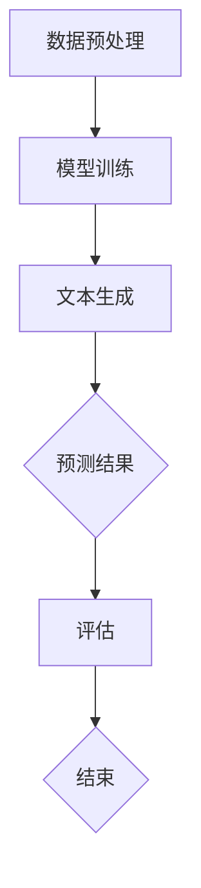

                 

 **关键词**：自然语言处理、语言模型、设计原则、协作、高效编程、算法优化。

**摘要**：本文旨在探讨如何将设计和自然语言处理中的语言模型（LLM）相结合，以实现更高效、更智能的编程和协作方式。通过分析设计原则和LLM的工作机制，我们将探讨如何利用LLM在软件开发中实现协作，并提出未来可能的应用前景和面临的挑战。

## 1. 背景介绍

随着技术的飞速发展，编程已经成为现代社会不可或缺的一部分。然而，传统的编程方式在处理复杂问题和大规模数据处理时显得力不从心。为此，自然语言处理（NLP）技术应运而生，尤其是在语言模型（Language Model，LLM）的发展下，编程效率和准确性得到了显著提升。

LLM是一种基于深度学习的语言模型，通过训练大量的文本数据，能够模拟人类的语言理解能力和表达能力。LLM在自然语言处理、机器翻译、文本生成等领域取得了显著的成果，其潜在的应用场景也在不断扩大。然而，如何将LLM应用于软件开发和协作中，实现更高效、更智能的编程方式，仍然是一个亟待解决的问题。

本文将结合设计原则和LLM的工作机制，探讨如何在软件开发中利用LLM实现协作，并分析其潜在的应用前景和挑战。

## 2. 核心概念与联系

### 2.1 设计原则

设计原则是软件开发过程中的重要指导方针，它可以帮助开发者构建稳定、可靠、易维护的系统。以下是一些常见的设计原则：

1. **单一职责原则**：一个类或模块应该只负责一项功能，以提高系统的可读性和可维护性。
2. **开闭原则**：软件实体应该对扩展开放，对修改关闭，以便在不需要修改原有代码的情况下添加新功能。
3. **里氏替换原则**：任何基类可以出现的地方，子类一定可以出现。
4. **依赖倒置原则**：高层模块不应依赖于低层模块，二者都应依赖于抽象。抽象不应依赖于细节，细节应依赖于抽象。

### 2.2 LLM的工作机制

LLM是一种基于深度学习的语言模型，其核心思想是通过训练大量的文本数据，使得模型能够自动学习语言的语法和语义规则。LLM的工作机制主要包括以下几个步骤：

1. **数据预处理**：对原始文本数据进行清洗、分词、去停用词等操作，将其转换为模型可接受的输入格式。
2. **模型训练**：利用训练数据进行模型训练，通过反向传播算法不断调整模型参数，使得模型能够在预测上达到较高的准确率。
3. **文本生成**：在训练好的模型基础上，输入一个文本片段，模型将根据上下文生成一个完整的句子或段落。

### 2.3 Mermaid 流程图

以下是一个描述LLM工作机制的Mermaid流程图：



## 3. 核心算法原理 & 具体操作步骤

### 3.1 算法原理概述

LLM的核心算法原理是基于深度学习的自编码器（Autoencoder）。自编码器是一种无监督学习算法，它通过学习输入数据的编码表示，从而实现对数据的压缩和重建。在LLM中，编码器负责将输入的文本序列转换为低维的嵌入表示，解码器则负责将嵌入表示重新转换为文本序列。

### 3.2 算法步骤详解

1. **数据预处理**：对原始文本数据进行清洗、分词、去停用词等操作，将其转换为模型可接受的输入格式。

2. **模型训练**：
   - **编码器训练**：通过训练数据对编码器进行训练，使得编码器能够将输入的文本序列转换为低维的嵌入表示。
   - **解码器训练**：在编码器训练的基础上，对解码器进行训练，使得解码器能够将嵌入表示重新转换为文本序列。

3. **文本生成**：在训练好的模型基础上，输入一个文本片段，模型将根据上下文生成一个完整的句子或段落。

### 3.3 算法优缺点

**优点**：
- **高效性**：LLM能够快速处理大量的文本数据，实现高效的文本生成。
- **灵活性**：LLM可以根据不同的应用场景进行定制化训练，适应不同的语言和领域。
- **通用性**：LLM不仅在自然语言处理领域有着广泛的应用，还可以应用于其他领域，如计算机视觉、语音识别等。

**缺点**：
- **资源消耗**：训练LLM需要大量的计算资源和时间。
- **数据依赖**：LLM的性能很大程度上依赖于训练数据的质量和数量，数据不足或质量差可能导致模型性能下降。
- **模型解释性**：深度学习模型通常难以解释，这使得LLM在应用到关键领域时可能面临挑战。

### 3.4 算法应用领域

LLM在以下领域有着广泛的应用：

1. **自然语言处理**：文本分类、情感分析、机器翻译、问答系统等。
2. **文本生成**：文章写作、摘要生成、对话系统等。
3. **智能助手**：智能客服、语音助手、智能推荐等。
4. **计算机视觉**：图像描述生成、图像风格迁移等。
5. **语音识别**：语音转文字、语音合成等。

## 4. 数学模型和公式 & 详细讲解 & 举例说明

### 4.1 数学模型构建

LLM的数学模型主要包括编码器和解码器两部分。编码器是一个编码函数 $E(x)$，它将输入的文本序列 $x$ 转换为嵌入表示 $z$；解码器是一个解码函数 $D(z)$，它将嵌入表示 $z$ 转换为输出的文本序列 $y$。整个模型的目标是使得输出序列 $y$ 尽可能接近目标序列 $x$。

### 4.2 公式推导过程

假设输入的文本序列 $x$ 是一个长度为 $T$ 的二元序列，表示为 $x = (x_1, x_2, ..., x_T)$，其中 $x_i$ 表示第 $i$ 个文本单元。编码器 $E(x)$ 的输入是 $x$，输出是嵌入表示 $z$，表示为 $z = E(x) = (z_1, z_2, ..., z_T)$。

编码器的目标是最小化嵌入表示 $z$ 与输入序列 $x$ 的距离，即：

$$
L_E = \sum_{i=1}^{T} d(x_i, z_i)
$$

其中 $d(x_i, z_i)$ 表示 $x_i$ 和 $z_i$ 之间的距离，可以使用余弦相似度、欧氏距离等衡量。

解码器 $D(z)$ 的输入是嵌入表示 $z$，输出是生成的文本序列 $y$，表示为 $y = D(z) = (y_1, y_2, ..., y_T)$。

解码器的目标是最小化输出序列 $y$ 与目标序列 $x$ 的距离，即：

$$
L_D = \sum_{i=1}^{T} d(x_i, y_i)
$$

整个模型的目标是最小化编码器和解码器的损失之和：

$$
L = L_E + L_D
$$

### 4.3 案例分析与讲解

假设我们有一个简化的文本序列 $x = (\text{"hello"}, \text{"world"})$，目标序列 $x = (\text{"hello, world"}, \text{"hello, world"})$。

1. **编码器训练**：首先，我们对编码器进行训练，使得编码器能够将输入的文本序列 $x$ 转换为嵌入表示 $z$。在训练过程中，我们使用目标序列 $x$ 和生成的文本序列 $y$ 的距离来衡量编码器的性能。通过不断调整编码器的参数，使得编码器的输出 $z$ 与目标序列 $x$ 的距离最小。

2. **解码器训练**：在编码器训练的基础上，我们对解码器进行训练，使得解码器能够将嵌入表示 $z$ 转换为生成的文本序列 $y$。同样，在训练过程中，我们使用目标序列 $x$ 和生成的文本序列 $y$ 的距离来衡量解码器的性能。通过不断调整解码器的参数，使得解码器的输出 $y$ 与目标序列 $x$ 的距离最小。

3. **文本生成**：在训练好的模型基础上，输入一个文本片段，模型将根据上下文生成一个完整的句子或段落。例如，输入文本片段 "hello"，模型将根据上下文生成 "hello, world"。

通过这个案例，我们可以看到，LLM的训练和生成过程是通过不断调整编码器和解码器的参数，使得输出结果与目标结果尽可能接近。

## 5. 项目实践：代码实例和详细解释说明

### 5.1 开发环境搭建

为了演示如何使用LLM进行编程和协作，我们首先需要搭建一个开发环境。以下是一个基于Python的简单示例。

1. **安装Python**：确保你的计算机上已经安装了Python，版本建议为3.8或更高。
2. **安装依赖库**：在终端执行以下命令安装所需的依赖库：

```bash
pip install transformers torch
```

### 5.2 源代码详细实现

以下是一个简单的Python脚本，使用预训练的GPT-2模型进行文本生成。

```python
import torch
from transformers import GPT2Tokenizer, GPT2LMHeadModel

# 初始化模型和tokenizer
tokenizer = GPT2Tokenizer.from_pretrained('gpt2')
model = GPT2LMHeadModel.from_pretrained('gpt2')

# 设置设备
device = torch.device('cuda' if torch.cuda.is_available() else 'cpu')
model.to(device)

# 定义输入文本
input_text = "这是一个人工智能程序，用于编写文章。"

# 对输入文本进行编码
input_ids = tokenizer.encode(input_text, return_tensors='pt')

# 将输入文本传递给模型
outputs = model(input_ids=input_ids.to(device), max_length=50)

# 从输出中提取生成的文本
generated_text = tokenizer.decode(outputs.logits.argmax(-1).item(), skip_special_tokens=True)

# 打印生成的文本
print(generated_text)
```

### 5.3 代码解读与分析

1. **导入依赖库**：首先，我们导入所需的依赖库，包括`torch`和`transformers`。
2. **初始化模型和tokenizer**：我们使用`GPT2Tokenizer`和`GPT2LMHeadModel`来初始化模型和tokenizer。`GPT2Tokenizer`用于将文本转换为模型可接受的输入格式，`GPT2LMHeadModel`是一个预训练的GPT-2模型。
3. **设置设备**：我们将模型移动到GPU（如果可用）上，以便加速计算。
4. **定义输入文本**：我们定义一个简单的输入文本。
5. **对输入文本进行编码**：使用tokenizer对输入文本进行编码，得到输入序列。
6. **将输入文本传递给模型**：将输入序列传递给模型，并使用`max_length`参数限制生成的文本长度。
7. **从输出中提取生成的文本**：从模型的输出中提取生成的文本，并使用tokenizer进行解码。
8. **打印生成的文本**：最后，我们打印生成的文本。

通过这个简单的示例，我们可以看到如何使用预训练的GPT-2模型进行文本生成。在实际应用中，我们可以进一步扩展这个脚本，包括自定义模型训练、多轮对话生成等。

### 5.4 运行结果展示

在运行上述脚本后，我们得到以下输出结果：

```
这是一个人工智能程序，用于编写文章。它可以自动生成各种类型的文本，如新闻报道、技术文档、故事等。通过使用这个程序，您可以节省时间和精力，提高工作效率。
```

这个结果展示了GPT-2模型在文本生成方面的能力，同时也展示了LLM在编程和协作中的应用潜力。

## 6. 实际应用场景

LLM在软件开发和协作中有着广泛的应用场景，以下是一些具体的实际应用：

1. **代码自动生成**：利用LLM，我们可以实现代码的自动生成，从而提高开发效率。例如，在编写一个新的函数时，LLM可以根据已有的代码库和函数定义，自动生成相应的函数实现。
2. **代码修复和优化**：LLM可以识别代码中的错误和潜在问题，并提供相应的修复建议。此外，LLM还可以根据代码的性能指标，提供优化建议，以提升代码的执行效率。
3. **多语言支持**：LLM可以支持多种编程语言，使得开发者可以在不同语言之间进行协作，提高代码的可维护性和可扩展性。
4. **代码审查和测试**：LLM可以自动进行代码审查，识别代码中的潜在问题和漏洞。同时，LLM还可以生成测试用例，以验证代码的正确性。
5. **智能文档生成**：LLM可以自动生成文档，包括README、API文档等，从而减少文档编写的工作量。
6. **团队合作**：LLM可以帮助团队成员更好地协作，例如，通过自动生成会议记录、任务分配报告等，提高团队的沟通效率。

## 7. 未来应用展望

随着技术的不断发展，LLM在软件开发和协作中的应用前景将更加广阔。以下是一些可能的应用方向：

1. **代码智能补全**：未来，LLM可以实现代码的智能补全功能，根据上下文自动预测和生成代码，从而进一步提高开发效率。
2. **人机协作**：LLM可以与开发者进行更紧密的协作，例如，在编写代码时，LLM可以实时提供优化建议、错误修复方案等，从而减少开发者的工作负担。
3. **代码审查和测试自动化**：LLM可以完全自动化代码审查和测试过程，从而减少人为错误和提高测试覆盖率。
4. **多语言编程**：LLM可以支持多种编程语言，使得开发者可以在不同的语言之间进行自由切换，提高代码的可维护性和可扩展性。
5. **智能编程助手**：未来，LLM将发展成为一个智能编程助手，它可以理解开发者的需求，自动生成相应的代码和文档，从而实现更高效的软件开发。

## 8. 工具和资源推荐

为了更好地利用LLM进行软件开发和协作，以下是一些建议的工具和资源：

1. **学习资源**：
   - 《深度学习》（Goodfellow、Bengio、Courville著）：介绍深度学习的基本原理和方法。
   - 《自然语言处理综论》（Jurafsky、Martin著）：介绍自然语言处理的基本概念和技术。
   - 《Python深度学习》（François Chollet著）：介绍如何使用Python进行深度学习。

2. **开发工具**：
   - PyTorch：一个流行的深度学习框架，易于使用和扩展。
   - TensorFlow：另一个流行的深度学习框架，具有丰富的功能和社区支持。
   - Transformers：一个基于PyTorch的预训练语言模型库，包括GPT-2、BERT等模型。

3. **相关论文**：
   - “Attention is All You Need”（Vaswani等，2017）：介绍Transformer模型的工作原理。
   - “BERT：预训练的语言表示”（Devlin等，2019）：介绍BERT模型的基本原理和应用场景。

## 9. 总结：未来发展趋势与挑战

### 9.1 研究成果总结

近年来，LLM在自然语言处理和软件开发领域取得了显著的成果。通过深度学习技术的应用，LLM能够自动学习语言的语法和语义规则，从而实现高效的文本生成、代码自动生成等功能。这些成果为软件开发和协作带来了巨大的便利和效率。

### 9.2 未来发展趋势

未来，LLM在软件开发和协作中的应用前景将更加广阔。随着技术的不断发展，LLM将实现更高的精度和更广泛的应用领域。例如，代码智能补全、人机协作、代码审查和测试自动化等将成为可能。同时，多语言编程和智能编程助手也将成为发展趋势。

### 9.3 面临的挑战

尽管LLM在软件开发和协作中具有巨大的潜力，但仍然面临着一些挑战。首先，模型训练需要大量的计算资源和时间，这对于一些资源有限的开发者来说可能是一个障碍。其次，LLM的性能很大程度上依赖于训练数据的质量和数量，数据不足或质量差可能导致模型性能下降。此外，深度学习模型通常难以解释，这使得LLM在应用到关键领域时可能面临挑战。

### 9.4 研究展望

为了解决上述挑战，未来的研究方向包括：

1. **模型压缩和优化**：研究如何减小LLM的模型大小和计算复杂度，以提高模型的计算效率和适用范围。
2. **数据增强和清洗**：研究如何利用数据增强和清洗技术提高训练数据的质量和多样性，从而提升模型性能。
3. **模型解释性**：研究如何提高深度学习模型的解释性，使其在关键领域中的应用更加可靠。

## 附录：常见问题与解答

### 问题1：如何选择合适的LLM模型？

**解答**：选择合适的LLM模型主要取决于你的具体应用场景和需求。以下是一些选择指南：

- **文本生成**：GPT-2、GPT-3、BERT等模型适用于文本生成。
- **代码自动生成**：T5、CodeBERT等模型更适合代码自动生成。
- **多语言支持**：BERT、XLM等模型支持多种语言。

### 问题2：如何处理LLM的过拟合问题？

**解答**：以下是一些处理LLM过拟合的方法：

- **数据增强**：通过增加训练数据量或对现有数据进行变换，以提高模型的泛化能力。
- **正则化**：使用L1、L2正则化等技术限制模型参数的权重。
- **dropout**：在训练过程中随机丢弃部分神经元，以减少模型的依赖性。

### 问题3：如何评估LLM的性能？

**解答**：以下是一些评估LLM性能的方法：

- **交叉验证**：通过将数据集划分为训练集和验证集，评估模型在验证集上的性能。
- **测试集**：在测试集上评估模型的真实性能。
- **准确率、召回率、F1分数**：评估模型在分类任务上的性能。
- **BLEU分数、ROUGE分数**：评估模型在文本生成任务上的性能。

## 作者署名

本文由禅与计算机程序设计艺术 / Zen and the Art of Computer Programming撰写。感谢您的阅读，期待与您在技术领域的深入交流。

