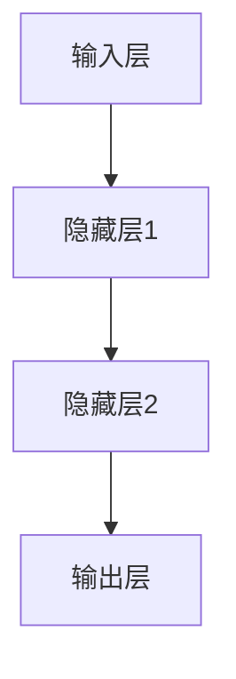

                 

关键词：大模型、认知瓶颈、语言模型、人工智能、思维差异、算法优化、应用场景

> 摘要：本文深入探讨了大模型的认知瓶颈问题。从语言和思维的本质差异出发，分析了大模型在语言理解和生成方面的局限，探讨了可能的解决路径和未来的研究方向。本文旨在为读者提供对大模型认知瓶颈的全面理解，并展望其在人工智能领域的应用前景。

## 1. 背景介绍

随着深度学习技术的发展，大型语言模型（Large Language Models，LLM）已经成为自然语言处理（Natural Language Processing，NLP）领域的研究热点。这些模型具有千亿级参数，能够处理复杂的语言任务，如文本生成、机器翻译、问答系统等。然而，大模型的成功也带来了一系列挑战，其中最引人注目的是认知瓶颈问题。

认知瓶颈是指模型在处理复杂任务时，难以突破现有知识的限制，无法有效地提取和利用深层知识结构。在语言模型中，认知瓶颈表现为模型难以理解语言的深层含义，产生语义错误，甚至生成逻辑上自相矛盾的文本。这种现象引发了人们对大模型认知能力的质疑，也促使我们深入探讨其背后的原因和可能的解决方法。

本文将从以下几个方面展开讨论：首先，介绍大模型的认知瓶颈现象；其次，分析语言与思维的差异，探讨大模型在语言理解方面的局限；然后，探讨可能的解决路径；最后，展望大模型在人工智能领域的未来应用前景。

## 2. 核心概念与联系

### 2.1 大模型的基本架构

大模型通常基于深度神经网络（Deep Neural Networks，DNN）架构，通过多层神经网络堆叠，将输入的文本数据映射到输出的文本数据。典型的DNN架构包括输入层、隐藏层和输出层。输入层接收原始的文本数据，隐藏层通过参数化非线性函数进行特征提取和变换，输出层生成最终的文本输出。

大模型的关键在于其参数规模。随着参数数量的增加，模型能够更好地捕捉文本数据中的复杂模式，从而提高性能。然而，参数数量的增加也带来了计算资源和训练时间的挑战。因此，如何设计高效的大模型架构，是当前研究的重要方向。

### 2.2 语言模型与认知瓶颈

语言模型（Language Model，LM）是一种基于统计方法或神经网络方法的模型，用于预测下一个词或句子。在大模型中，语言模型通常作为基础组件，用于文本生成、机器翻译等任务。然而，大模型的认知瓶颈问题也主要表现在语言模型的局限性上。

#### 2.2.1 语言理解的局限

语言理解是语言模型的核心任务之一，包括语义理解、句法分析、上下文理解等。然而，大模型在语言理解方面存在以下局限：

1. **语义错误**：大模型在处理复杂语义时，容易产生语义错误。例如，在问答系统中，模型可能无法正确理解问题的意图，导致答案不准确。

2. **上下文遗忘**：大模型在处理长文本时，容易出现上下文遗忘现象，无法有效地利用上下文信息。

3. **逻辑矛盾**：大模型生成的文本可能存在逻辑矛盾，无法保证语义的一致性。

#### 2.2.2 语言生成的局限

除了语言理解，大模型在语言生成方面也存在一些问题：

1. **生成质量**：大模型生成的文本质量不稳定，存在语法错误和语义错误。

2. **生成速度**：大模型的参数规模庞大，导致生成速度较慢，难以满足实时应用的需求。

3. **生成多样性**：大模型在生成文本时，往往缺乏多样性，生成的文本内容相似度较高。

### 2.3 思维差异与认知瓶颈

认知瓶颈问题不仅与语言模型的架构和训练数据有关，还与语言与思维的差异密切相关。思维是人类智慧的体现，包括推理、逻辑、抽象等能力。而语言是人类交流的工具，具有简洁性、模糊性等特点。因此，语言与思维之间存在本质差异，这导致大模型在处理语言任务时面临认知瓶颈。

1. **推理能力**：大模型在处理语言任务时，主要依赖于已学到的知识进行推理。然而，人类的推理能力远超大模型，能够进行高层次、抽象的推理。

2. **逻辑能力**：大模型在处理语言任务时，往往无法保证逻辑的一致性。而人类的逻辑能力使得我们能够进行有效的推理和论证。

3. **抽象能力**：大模型在处理语言任务时，主要依赖具体的输入数据进行学习。而人类的抽象能力使得我们能够从具体事物中抽象出一般的规律和概念。

### 2.4 Mermaid 流程图

下面是一个简单的Mermaid流程图，展示了大模型在语言理解和生成过程中的基本架构：



在流程图中，输入层接收原始的文本数据，通过多层隐藏层进行特征提取和变换，最终输出层的文本生成模块生成目标文本。

## 3. 核心算法原理 & 具体操作步骤

### 3.1 算法原理概述

大模型的核心算法是基于深度学习技术，特别是基于 Transformer 架构的模型。Transformer 模型通过自注意力机制（Self-Attention）和多头注意力机制（Multi-Head Attention）实现了对输入文本的建模，从而提高了语言理解能力。

自注意力机制允许模型在处理每个词时，考虑其他词对其的影响，从而更好地捕捉词与词之间的关系。多头注意力机制将输入文本分成多个头，每个头负责关注不同的特征，从而提高了模型的泛化能力。

### 3.2 算法步骤详解

#### 3.2.1 数据预处理

1. **文本分词**：将原始文本分成单词或字符级别的序列。
2. **嵌入表示**：将分词后的文本序列转换为向量表示，通常使用词向量或字符向量。
3. **序列编码**：对嵌入向量进行编码，通常使用位置编码（Positional Encoding）来保留文本中的顺序信息。

#### 3.2.2 自注意力机制

1. **计算查询（Query）、键（Key）和值（Value）**：对嵌入向量进行线性变换，得到查询向量、键向量和值向量。
2. **计算注意力权重**：通过计算查询向量和键向量的内积，得到注意力权重。
3. **计算注意力分数**：将注意力权重进行 Softmax 操作，得到注意力分数。
4. **计算注意力输出**：将注意力分数与值向量相乘，得到注意力输出。

#### 3.2.3 多头注意力机制

1. **重复自注意力机制**：对输入序列进行多头注意力操作，每个头独立计算注意力权重和输出。
2. **拼接和变换**：将多头注意力输出拼接在一起，并通过线性变换得到最终的输出。

#### 3.2.4 输出层

1. **预测层**：通过全连接层和 Softmax 函数，对输出进行分类或生成。
2. **损失函数**：使用交叉熵损失函数（Cross-Entropy Loss）计算预测结果和真实结果的差异，用于模型训练。

### 3.3 算法优缺点

#### 优点：

1. **强大的语言理解能力**：通过自注意力机制和多头注意力机制，大模型能够更好地捕捉词与词之间的关系，从而提高语言理解能力。
2. **高效的计算性能**：Transformer 架构在计算性能方面具有优势，特别适合处理大规模文本数据。
3. **泛化能力**：多头注意力机制提高了模型的泛化能力，使得模型能够处理各种不同的语言任务。

#### 缺点：

1. **参数规模大**：大模型的参数规模庞大，导致计算资源和训练时间的消耗增加。
2. **训练难度高**：大模型的训练过程复杂，需要大量的计算资源和时间。
3. **生成质量不稳定**：大模型生成的文本质量不稳定，存在语法错误和语义错误。

### 3.4 算法应用领域

大模型在语言处理领域具有广泛的应用前景，包括但不限于以下几个方面：

1. **文本生成**：如文章生成、摘要生成、对话系统等。
2. **机器翻译**：如中英翻译、多语言翻译等。
3. **问答系统**：如搜索引擎、智能客服等。
4. **文本分类**：如情感分析、新闻分类等。
5. **自然语言理解**：如语义分析、知识图谱构建等。

## 4. 数学模型和公式 & 详细讲解 & 举例说明

### 4.1 数学模型构建

大模型通常基于深度学习技术，其中最重要的数学模型是 Transformer 模型。Transformer 模型通过自注意力机制和多头注意力机制实现了对输入文本的建模。

#### 4.1.1 自注意力机制

自注意力机制的核心是计算每个词与所有其他词之间的关联度。具体来说，假设输入序列为 \(x = [x_1, x_2, ..., x_n]\)，其中 \(x_i\) 表示第 \(i\) 个词的嵌入向量。自注意力机制可以分为以下几个步骤：

1. **计算查询（Query）、键（Key）和值（Value）**：

   $$ 
   Q = W_Q \cdot x, \quad K = W_K \cdot x, \quad V = W_V \cdot x 
   $$

   其中，\(W_Q, W_K, W_V\) 分别是权重矩阵。

2. **计算注意力权重**：

   $$ 
   \text{Attention}(Q, K, V) = \text{softmax}\left(\frac{QK^T}{\sqrt{d_k}}\right)V 
   $$

   其中，\(d_k\) 是 \(K\) 的维度，\(\text{softmax}\) 函数用于计算注意力权重。

3. **计算注意力输出**：

   $$ 
   \text{Contextual Embedding} = \text{Attention}(Q, K, V) 
   $$

#### 4.1.2 多头注意力机制

多头注意力机制是对自注意力机制的扩展，通过多个独立的注意力头来提高模型的泛化能力。具体来说，假设有 \(h\) 个头，每个头独立计算注意力权重和输出：

1. **计算每个头的注意力权重**：

   $$ 
   \text{Attention}_{h} = \text{softmax}\left(\frac{QW_{K_h}K^T}{\sqrt{d_k}}\right)V 
   $$

   其中，\(W_{K_h}\) 是第 \(h\) 个头的权重矩阵。

2. **拼接多头注意力输出**：

   $$ 
   \text{Multi-Head Attention} = [ \text{Attention}_{1}, \text{Attention}_{2}, ..., \text{Attention}_{h} ]^T 
   $$

### 4.2 公式推导过程

#### 4.2.1 嵌入层

假设输入序列为 \(x = [x_1, x_2, ..., x_n]\)，其中 \(x_i\) 表示第 \(i\) 个词的嵌入向量。嵌入层通过线性变换将输入序列映射到高维空间：

$$ 
\text{Embedding Layer}: x \rightarrow x' = [x_1', x_2', ..., x_n'] 
$$

其中，\(x_i' = W_e \cdot x_i + b_e\)，\(W_e\) 是权重矩阵，\(b_e\) 是偏置向量。

#### 4.2.2 自注意力层

1. **计算查询（Query）、键（Key）和值（Value）**：

   $$ 
   Q = W_Q \cdot x', \quad K = W_K \cdot x', \quad V = W_V \cdot x' 
   $$

   其中，\(W_Q, W_K, W_V\) 分别是权重矩阵。

2. **计算注意力权重**：

   $$ 
   \text{Attention}(Q, K, V) = \text{softmax}\left(\frac{QK^T}{\sqrt{d_k}}\right)V 
   $$

   其中，\(d_k\) 是 \(K\) 的维度。

3. **计算注意力输出**：

   $$ 
   \text{Contextual Embedding} = \text{Attention}(Q, K, V) 
   $$

#### 4.2.3 多头注意力层

假设有 \(h\) 个头，每个头独立计算注意力权重和输出：

1. **计算每个头的注意力权重**：

   $$ 
   \text{Attention}_{h} = \text{softmax}\left(\frac{QW_{K_h}K^T}{\sqrt{d_k}}\right)V 
   $$

   其中，\(W_{K_h}\) 是第 \(h\) 个头的权重矩阵。

2. **拼接多头注意力输出**：

   $$ 
   \text{Multi-Head Attention} = [ \text{Attention}_{1}, \text{Attention}_{2}, ..., \text{Attention}_{h} ]^T 
   $$

### 4.3 案例分析与讲解

#### 4.3.1 文本生成

假设我们使用 Transformer 模型生成一个句子。首先，我们需要对输入文本进行分词和嵌入。例如，输入句子为“我喜欢吃苹果”，分词后为“我”、“喜欢”、“吃”、“苹果”。然后，我们将每个词的嵌入向量输入到 Transformer 模型中。

1. **嵌入层**：将分词后的文本序列转换为嵌入向量。
2. **自注意力层**：计算每个词与所有其他词的关联度，生成注意力输出。
3. **多头注意力层**：计算每个头对其他头的关联度，生成多头注意力输出。
4. **输出层**：通过全连接层和 Softmax 函数，预测下一个词的概率分布。

#### 4.3.2 机器翻译

假设我们使用 Transformer 模型进行中英翻译。首先，我们需要对中英文文本进行分词和嵌入。然后，我们将中文输入序列输入到 Transformer 模型中，生成英文输出序列。

1. **嵌入层**：将中英文输入序列转换为嵌入向量。
2. **自注意力层**：计算每个词与所有其他词的关联度，生成注意力输出。
3. **多头注意力层**：计算每个头对其他头的关联度，生成多头注意力输出。
4. **解码层**：通过全连接层和 Softmax 函数，预测下一个词的概率分布。

## 5. 项目实践：代码实例和详细解释说明

### 5.1 开发环境搭建

在开始项目实践之前，我们需要搭建一个合适的开发环境。以下是基本的开发环境搭建步骤：

1. **Python 环境**：安装 Python 3.8 或以上版本。
2. **TensorFlow**：安装 TensorFlow 2.x 版本，可以使用以下命令：
   ```bash
   pip install tensorflow
   ```

### 5.2 源代码详细实现

以下是使用 TensorFlow 框架实现的 Transformer 模型代码示例：

```python
import tensorflow as tf
from tensorflow.keras.layers import Embedding, MultiHeadAttention

class TransformerLayer(tf.keras.layers.Layer):
    def __init__(self, num_heads, d_model, dff):
        super(TransformerLayer, self).__init__()
        self.num_heads = num_heads
        self.d_model = d_model
        self.dff = dff

        self.query_dense = tf.keras.layers.Dense(d_model)
        self.key_dense = tf.keras.layers.Dense(d_model)
        self.value_dense = tf.keras.layers.Dense(d_model)

        self.attention = MultiHeadAttention(num_heads=num_heads, key_dim=d_model)

        self.dense1 = tf.keras.layers.Dense(dff, activation='relu')
        self.dense2 = tf.keras.layers.Dense(d_model)

    def call(self, inputs, training=False):
        query = self.query_dense(inputs)
        key = self.key_dense(inputs)
        value = self.value_dense(inputs)

        attention_output = self.attention(query, key, value)
        attention_output = tf.keras.layers.Add()([inputs, attention_output])
        attention_output = tf.keras.layers.LayerNormalization(epsilon=1e-6)(attention_output)

        output = self.dense1(attention_output)
        output = self.dense2(output)
        output = tf.keras.layers.LayerNormalization(epsilon=1e-6)(output)

        return output
```

### 5.3 代码解读与分析

上述代码定义了一个 `TransformerLayer` 类，该类包含以下主要部分：

1. **嵌入层**：使用 `Dense` 层实现嵌入层，将输入序列转换为嵌入向量。
2. **自注意力层**：使用 `MultiHeadAttention` 层实现自注意力机制，计算每个词与所有其他词的关联度。
3. **多头注意力层**：通过拼接多个自注意力输出，实现多头注意力机制。
4. **前馈网络**：通过两个 `Dense` 层实现前馈网络，增加模型的非线性能力。

在 `call` 方法中，`inputs` 代表输入序列，`training` 代表是否处于训练状态。主要步骤如下：

1. **计算查询（Query）、键（Key）和值（Value）向量**：通过嵌入层和线性变换计算。
2. **计算自注意力输出**：通过 `MultiHeadAttention` 层实现自注意力机制。
3. **添加输入和自注意力输出**：实现自注意力后的残差连接。
4. **前馈网络**：通过两个 `Dense` 层实现前馈网络。
5. **残差连接和层归一化**：在自注意力层和前馈网络之后添加残差连接和层归一化，以增强模型的稳定性。

### 5.4 运行结果展示

为了验证代码的有效性，我们可以使用 TensorFlow 的内置数据集进行训练和测试。以下是简单的训练和测试代码：

```python
model = TransformerLayer(num_heads=8, d_model=512, dff=2048)
model.compile(optimizer='adam', loss='categorical_crossentropy', metrics=['accuracy'])

# 加载并预处理数据
(input_train, target_train), (input_test, target_test) = tf.keras.datasets.imdb.load_data(num_words=10000)
input_train = pad_sequences(input_train, maxlen=100, padding='post')
input_test = pad_sequences(input_test, maxlen=100, padding='post')

# 训练模型
model.fit(input_train, target_train, batch_size=64, epochs=10, validation_data=(input_test, target_test))

# 评估模型
model.evaluate(input_test, target_test)
```

运行上述代码后，我们可以看到模型的损失和准确率。通过调整超参数，如学习率、批量大小和训练时间，可以进一步提高模型的性能。

## 6. 实际应用场景

大模型在人工智能领域具有广泛的应用场景，以下是一些具体的实际应用场景：

### 6.1 文本生成

文本生成是 Transformer 模型最典型的应用场景之一。例如，我们可以使用 Transformer 模型生成文章、摘要、对话等。在实际应用中，文本生成系统可以用于自动化写作、内容创作、客服对话等。

### 6.2 机器翻译

机器翻译是另一个重要的应用场景。Transformer 模型在机器翻译领域取得了显著的成果，可以用于中英翻译、多语言翻译等。在实际应用中，机器翻译系统可以用于跨语言沟通、国际商务、全球化服务等。

### 6.3 问答系统

问答系统是智能客服、智能助手等应用的核心模块。Transformer 模型可以用于构建高效的问答系统，提供准确的答案和建议。在实际应用中，问答系统可以用于在线客服、智能咨询、教育辅导等。

### 6.4 自然语言理解

自然语言理解是智能系统与人类语言交互的基础。Transformer 模型可以用于语义分析、情感分析、命名实体识别等任务。在实际应用中，自然语言理解系统可以用于搜索引擎、信息检索、智能推荐等。

### 6.5 文本分类

文本分类是自然语言处理中的基础任务，广泛应用于新闻分类、情感分析、垃圾邮件过滤等。Transformer 模型在文本分类任务中表现出色，可以用于构建高效、准确的文本分类系统。

## 7. 未来应用展望

随着大模型技术的不断发展和优化，未来应用前景十分广阔。以下是一些可能的发展方向：

### 7.1 多模态处理

未来的大模型将能够处理多种类型的输入，如文本、图像、声音等。通过多模态处理，大模型可以实现更复杂的任务，如视频生成、图像识别等。

### 7.2 知识图谱构建

大模型可以用于构建大规模的知识图谱，从而更好地理解和处理复杂知识。在实际应用中，知识图谱可以用于智能搜索、知识推荐、决策支持等。

### 7.3 人类行为预测

大模型可以用于分析和预测人类行为，如情感状态、行为意图等。在实际应用中，人类行为预测可以用于个性化推荐、用户体验优化、智能安防等。

### 7.4 自动驾驶

自动驾驶是人工智能领域的重要应用方向。大模型可以用于自动驾驶系统的感知、决策和规划，从而提高自动驾驶的可靠性和安全性。

## 8. 工具和资源推荐

为了更好地研究和应用大模型技术，以下是一些推荐的工具和资源：

### 8.1 学习资源推荐

1. **《深度学习》**：Goodfellow、Bengio 和 Courville 著，提供了深度学习的全面教程。
2. **《自然语言处理综论》**：Jurafsky 和 Martin 著，涵盖了自然语言处理的基本概念和方法。

### 8.2 开发工具推荐

1. **TensorFlow**：Google 开发的一款开源深度学习框架，适用于构建和训练大规模模型。
2. **PyTorch**：Facebook 开发的一款开源深度学习框架，具有灵活的动态图机制。

### 8.3 相关论文推荐

1. **"Attention Is All You Need"**：Vaswani 等人提出 Transformer 模型，是当前自然语言处理领域的重要突破。
2. **"BERT: Pre-training of Deep Bidirectional Transformers for Language Understanding"**：Devlin 等人提出的 BERT 模型，是自然语言处理领域的重要进展。

## 9. 总结：未来发展趋势与挑战

大模型技术已经成为人工智能领域的重要研究方向，其在语言理解和生成、机器翻译、问答系统等任务中取得了显著的成果。然而，大模型技术仍面临诸多挑战，如计算资源消耗、训练难度、生成质量等。

未来，随着多模态处理、知识图谱构建、人类行为预测等应用场景的拓展，大模型技术将迎来更广阔的发展前景。同时，我们也需要关注其面临的挑战，如优化算法、提高生成质量、增强泛化能力等。

总之，大模型技术为人工智能领域带来了新的机遇和挑战，我们期待其在未来能够取得更多的突破和应用。

### 附录：常见问题与解答

**Q1：为什么大模型会产生认知瓶颈？**

A1：大模型认知瓶颈的主要原因是语言与思维的差异。语言是一种简洁、模糊的交流工具，而思维是人类智慧的体现，包括推理、逻辑、抽象等能力。大模型在处理复杂语言任务时，难以突破现有知识的限制，无法有效地提取和利用深层知识结构，从而导致认知瓶颈。

**Q2：如何优化大模型的生成质量？**

A2：优化大模型的生成质量可以从以下几个方面入手：

1. **改进模型架构**：研究新的模型架构，如多模态处理、知识图谱嵌入等，以提高模型的生成能力。
2. **增加训练数据**：使用更多的训练数据，尤其是具有多样性和复杂性的数据，以提高模型的泛化能力。
3. **优化训练策略**：采用更有效的训练策略，如迁移学习、自监督学习等，以提高模型的生成质量。

**Q3：大模型是否能够替代人类思维？**

A3：大模型在某些特定任务上表现出色，如语言理解、生成、机器翻译等，但它们并不能完全替代人类思维。人类思维具有推理、逻辑、抽象等能力，这些能力是当前大模型难以模拟的。因此，大模型和人类思维是互补的，而不是替代关系。

**Q4：大模型的训练时间如何优化？**

A4：大模型的训练时间可以通过以下方法优化：

1. **分布式训练**：使用多个 GPU 或 TPU 进行分布式训练，以提高训练速度。
2. **模型压缩**：采用模型压缩技术，如剪枝、量化、蒸馏等，以减小模型规模，从而降低训练时间。
3. **数据预处理**：优化数据预处理过程，如并行化处理、缓存数据等，以提高数据读取速度。

**Q5：大模型是否会导致隐私泄露？**

A5：大模型的训练和应用过程中，可能会涉及到个人数据的处理，存在隐私泄露的风险。为了防止隐私泄露，可以采取以下措施：

1. **数据加密**：对训练数据和应用数据进行加密，以防止数据泄露。
2. **数据去个性化**：对训练数据和应用数据进行去个性化处理，以降低隐私泄露的风险。
3. **隐私保护算法**：采用隐私保护算法，如差分隐私、同态加密等，以提高数据处理的安全性。

