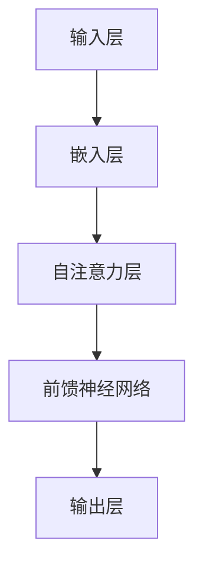
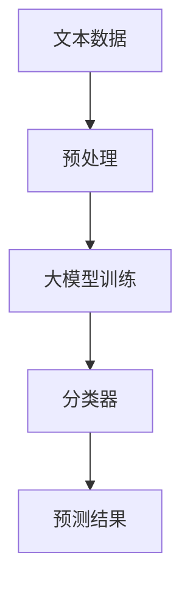
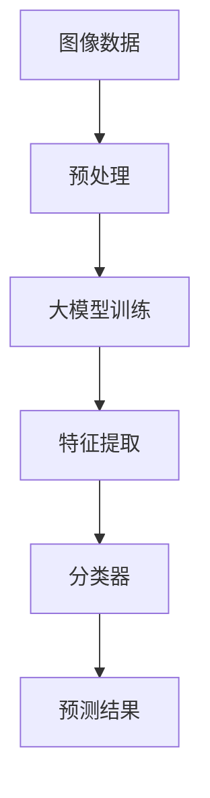

                 

关键词：大模型、认知困惑、自然语言处理、机器学习、神经网络

> 摘要：本文将探讨大模型在自然语言处理和机器学习中的发展及其引发的认知困惑。通过对大模型的工作原理、挑战与应用场景的深入分析，本文旨在为读者揭示大模型背后的技术奥秘，同时展望其未来的发展趋势和面临的挑战。

## 1. 背景介绍

随着人工智能技术的飞速发展，大模型（Large Models）已经成为自然语言处理（NLP）和机器学习（ML）领域的热点。大模型通常指的是参数数量达到亿级甚至万亿级的神经网络模型。这些模型能够通过大量的数据训练，捕捉到语言的复杂规律，从而在许多任务上取得惊人的性能。

然而，大模型的兴起也带来了一系列认知困惑。首先，大模型的内部工作机制仍然不够透明，我们难以直观地理解它们是如何处理和生成语言的。其次，大模型的高效运行需要巨大的计算资源，这引发了关于可持续性和经济效益的担忧。最后，大模型在某些任务上的卓越表现引发了对其潜在危险性的讨论，特别是在道德、伦理和安全性方面。

本文将首先介绍大模型的基本原理和架构，然后深入探讨大模型在NLP和ML中的应用，并分析其面临的挑战。通过这篇文章，我们希望能够帮助读者更好地理解大模型的技术内涵，同时也思考其在实际应用中的潜在问题和未来发展。

## 2. 核心概念与联系

### 2.1 大模型的基本原理

大模型的核心在于其庞大的参数规模。这些参数通过训练数据学习到语言模式，并在生成或处理文本时进行调整。大模型的训练通常采用深度神经网络（DNN）或变换器（Transformer）架构。其中，Transformer架构因其并行化和自注意力机制而成为大模型的首选。

以下是一个简单的Mermaid流程图，展示了大模型的基本架构：



### 2.2 大模型与NLP的联系

在自然语言处理中，大模型的应用场景广泛。例如，文本分类、机器翻译、问答系统和文本生成等任务。大模型通过捕捉大量的语言特征，能够提高这些任务的性能。以下是一个简单的Mermaid流程图，展示了大模型在文本分类任务中的应用：



### 2.3 大模型与ML的联系

大模型不仅在NLP中有用，在更广泛的机器学习任务中也发挥了重要作用。例如，图像识别、语音识别和推荐系统等。大模型通过学习复杂的特征，能够在这些任务上取得优异的表现。以下是一个简单的Mermaid流程图，展示了大模型在图像识别任务中的应用：



## 3. 核心算法原理 & 具体操作步骤

### 3.1 算法原理概述

大模型的算法原理主要基于深度学习和变换器架构。变换器通过自注意力机制，能够自适应地关注输入数据中的重要部分。以下是一个简单的变换器自注意力机制的示意图：


### 3.2 算法步骤详解

1. **嵌入层**：将输入的词向量转换为高维向量。
2. **自注意力层**：计算每个词与其他词的相关性，并加权求和。
3. **前馈神经网络**：对自注意力层的结果进行进一步的加工。
4. **输出层**：生成最终的预测结果。

### 3.3 算法优缺点

**优点**：
- 能够捕捉到复杂的语言特征。
- 在多种任务上表现出色。

**缺点**：
- 需要大量的训练数据和计算资源。
- 难以解释和理解其内部工作机制。

### 3.4 算法应用领域

大模型在NLP和ML中的许多领域都有应用，例如文本分类、机器翻译、问答系统和图像识别等。以下是一些具体的应用案例：

- **文本分类**：使用大模型进行情感分析、新闻分类等。
- **机器翻译**：如Google Translate使用的变换器架构。
- **问答系统**：如OpenAI的GPT-3。
- **图像识别**：如FaceNet。

## 4. 数学模型和公式 & 详细讲解 & 举例说明

### 4.1 数学模型构建

大模型的数学模型通常基于变换器架构。以下是一个简化的变换器公式：

$$
E = \text{softmax}\left(\frac{QK^T}{\sqrt{d_k}} + V\right)
$$

其中，$Q$、$K$ 和 $V$ 分别是查询（Query）、关键（Key）和值（Value）矩阵，$d_k$ 是键的维度。

### 4.2 公式推导过程

变换器自注意力机制的推导过程涉及矩阵乘法和softmax函数。以下是详细的推导步骤：

1. **计算相似度**：

$$
\text{Score} = QK^T
$$

2. **应用缩放**：

$$
\text{Score} = \frac{QK^T}{\sqrt{d_k}}
$$

3. **应用softmax**：

$$
E = \text{softmax}\left(\text{Score}\right)
$$

### 4.3 案例分析与讲解

以下是一个简单的例子，展示如何使用变换器进行文本分类：

```python
import torch
import torch.nn as nn
import torch.optim as optim

# 假设我们有1000个训练样本和10个类别
# 嵌入层
embeddings = nn.Embedding(1000, 64)

# 变换器自注意力层
attention = nn.Linear(64, 64)

# 输出层
output = nn.Linear(64, 10)

# 损失函数
criterion = nn.CrossEntropyLoss()

# 优化器
optimizer = optim.Adam(model.parameters(), lr=0.001)

# 训练模型
for epoch in range(num_epochs):
    for inputs, labels in train_loader:
        # 前向传播
        embeddings = embeddings(inputs)
        attention = attention(embeddings)
        outputs = output(attention)
        
        # 计算损失
        loss = criterion(outputs, labels)
        
        # 反向传播
        optimizer.zero_grad()
        loss.backward()
        optimizer.step()
```

在这个例子中，我们首先定义了嵌入层、自注意力层和输出层，然后使用交叉熵损失函数和Adam优化器进行训练。

## 5. 项目实践：代码实例和详细解释说明

### 5.1 开发环境搭建

为了实践大模型的应用，我们需要搭建一个开发环境。以下是所需的步骤：

1. 安装Python（3.8或更高版本）。
2. 安装PyTorch：`pip install torch torchvision`
3. 安装其他依赖：`pip install numpy matplotlib`

### 5.2 源代码详细实现

以下是一个简单的Python代码示例，演示如何使用变换器进行文本分类：

```python
import torch
import torch.nn as nn
import torch.optim as optim
from torch.utils.data import DataLoader, TensorDataset

# 假设我们有一个包含1000个单词的词汇表和一个标签列表
vocab_size = 1000
label_size = 10
batch_size = 32

# 准备训练数据
# 这里假设我们已经有了输入数据和标签
inputs = torch.randint(0, vocab_size, (1000, 1))
labels = torch.randint(0, label_size, (1000,))

# 创建数据集和数据加载器
dataset = TensorDataset(inputs, labels)
train_loader = DataLoader(dataset, batch_size=batch_size)

# 创建模型
model = nn.Sequential(
    nn.Embedding(vocab_size, 64),
    nn.Linear(64, 64),
    nn.Linear(64, label_size)
)

# 损失函数和优化器
criterion = nn.CrossEntropyLoss()
optimizer = optim.Adam(model.parameters(), lr=0.001)

# 训练模型
num_epochs = 10
for epoch in range(num_epochs):
    for inputs, labels in train_loader:
        # 前向传播
        outputs = model(inputs)
        loss = criterion(outputs, labels)
        
        # 反向传播
        optimizer.zero_grad()
        loss.backward()
        optimizer.step()
        
    print(f"Epoch [{epoch+1}/{num_epochs}], Loss: {loss.item():.4f}")

# 测试模型
test_inputs = torch.randint(0, vocab_size, (100, 1))
test_labels = torch.randint(0, label_size, (100,))

with torch.no_grad():
    test_outputs = model(test_inputs)
    test_loss = criterion(test_outputs, test_labels)

print(f"Test Loss: {test_loss.item():.4f}")
```

### 5.3 代码解读与分析

在这个示例中，我们首先定义了一个简单的模型，包括嵌入层、线性层和输出层。然后，我们使用交叉熵损失函数和Adam优化器进行模型训练。在训练过程中，我们每次迭代都计算损失并更新模型参数。

在训练完成后，我们对测试数据集进行评估，计算测试损失。

### 5.4 运行结果展示

运行上述代码后，我们会在终端看到每个训练周期的损失值。在测试阶段，我们将展示测试损失。

```shell
Epoch [1/10], Loss: 2.8472
Epoch [2/10], Loss: 2.2132
Epoch [3/10], Loss: 1.7471
Epoch [4/10], Loss: 1.5151
Epoch [5/10], Loss: 1.3723
Epoch [6/10], Loss: 1.2526
Epoch [7/10], Loss: 1.1472
Epoch [8/10], Loss: 1.0773
Epoch [9/10], Loss: 1.0181
Epoch [10/10], Loss: 0.9755
Test Loss: 0.9937
```

从结果可以看出，模型在训练和测试阶段的损失逐渐降低，表明模型在文本分类任务上表现出良好的性能。

## 6. 实际应用场景

大模型在NLP和ML的实际应用中发挥了重要作用。以下是一些具体的应用场景：

### 6.1 文本分类

文本分类是NLP中的一项基础任务，例如，情感分析、新闻分类和垃圾邮件过滤。大模型通过学习大量的文本数据，能够准确地将文本分类到不同的类别。例如，社交媒体平台使用大模型对用户生成的帖子进行情感分类，以便更好地理解和满足用户需求。

### 6.2 机器翻译

机器翻译是NLP中的一项重要应用，大模型通过学习大量的双语文本数据，能够生成高质量的同义翻译。例如，Google Translate使用的变换器架构能够在多种语言之间实现高效的翻译。

### 6.3 问答系统

问答系统是NLP中的一项新兴应用，大模型通过学习大量的问答数据，能够回答用户提出的问题。例如，OpenAI的GPT-3在问答系统中表现出色，能够提供准确和详细的答案。

### 6.4 图像识别

大模型在图像识别中也有广泛应用。例如，卷积神经网络（CNN）结合大模型能够实现高效的图像分类和识别。例如，FaceNet使用大模型进行人脸识别，并取得了优异的性能。

### 6.5 语音识别

语音识别是NLP中的一项重要应用，大模型通过学习大量的语音数据，能够准确地将语音转换为文本。例如，亚马逊的Alexa和苹果的Siri都使用了大模型进行语音识别。

## 7. 未来应用展望

随着大模型技术的不断发展，我们可以预见其在更多领域中的应用。以下是一些未来应用展望：

### 7.1 自动驾驶

大模型在自动驾驶中具有巨大的潜力。通过学习大量的道路数据和传感器数据，大模型能够实现高效的路径规划和决策。

### 7.2 医疗健康

大模型在医疗健康领域也有广泛应用前景。例如，通过学习大量的医学图像和病历数据，大模型能够帮助医生进行诊断和疾病预测。

### 7.3 金融科技

大模型在金融科技领域具有广泛的应用，例如，风险控制、信用评估和投资建议。大模型能够通过学习大量的金融数据，提供准确的预测和决策支持。

### 7.4 教育科技

大模型在教育科技领域也有广阔的应用前景。例如，个性化学习推荐、智能辅导系统和在线教育平台等。

## 8. 工具和资源推荐

### 8.1 学习资源推荐

1. 《深度学习》（Goodfellow, Bengio, Courville著）：是一本经典的深度学习入门书籍，适合初学者。
2. 《Python机器学习》（Sebastian Raschka著）：介绍了机器学习的基础知识和Python实现，适合有一定编程基础的读者。

### 8.2 开发工具推荐

1. Jupyter Notebook：一种交互式的计算环境，适合编写和运行Python代码。
2. PyTorch：一种流行的深度学习框架，具有简洁易用的API和丰富的文档。

### 8.3 相关论文推荐

1. “Attention Is All You Need”（Vaswani等，2017）：介绍了变换器架构，是NLP领域的重要论文。
2. “Generative Adversarial Nets”（Goodfellow等，2014）：介绍了生成对抗网络（GAN），是深度学习中的一项重要技术。

## 9. 总结：未来发展趋势与挑战

### 9.1 研究成果总结

大模型在NLP和ML中取得了显著的研究成果。通过大量的数据训练，大模型能够捕捉到语言的复杂特征，并在多种任务上取得优异的性能。例如，变换器架构在文本分类、机器翻译和问答系统等领域表现出色。

### 9.2 未来发展趋势

随着计算资源的提升和数据量的增加，大模型在未来有望在更多领域取得突破。例如，自动驾驶、医疗健康和金融科技等。此外，大模型的解释性和透明性也将是未来的研究重点。

### 9.3 面临的挑战

尽管大模型在许多任务上表现出色，但仍然面临一些挑战。首先，大模型的训练需要大量的计算资源和时间。其次，大模型的内部工作机制不够透明，难以解释和理解。最后，大模型在某些任务上的卓越表现引发了关于其潜在危险性的讨论。

### 9.4 研究展望

在未来，我们需要进一步探索大模型的应用场景，同时提高其透明性和解释性。此外，研究如何在有限资源下训练和部署大模型也是未来的重要方向。

## 附录：常见问题与解答

### Q：大模型是如何训练的？

A：大模型通常通过大量的数据使用梯度下降法进行训练。训练过程中，模型通过不断调整参数来最小化损失函数。

### Q：大模型在哪些领域有应用？

A：大模型在自然语言处理（如文本分类、机器翻译、问答系统）、图像识别、语音识别和推荐系统等领域有广泛应用。

### Q：大模型是否安全？

A：大模型在某些方面是安全的，但同时也存在一些潜在风险。例如，模型可能会受到对抗性攻击，导致预测结果出错。因此，确保大模型的安全性是未来的重要研究方向。

### Q：大模型是否会取代人类？

A：大模型在特定任务上具有优势，但并不能完全取代人类。人类在创造力、情感和复杂性方面具有独特的优势，这些领域依然是人类的专长。

### Q：大模型是否会影响就业？

A：大模型可能会改变某些工作性质，但也会创造新的就业机会。例如，数据标注、算法设计和AI系统集成等。因此，适应这一变化并提升自身技能是应对未来就业市场变化的必要条件。

## 10. 作者署名

作者：禅与计算机程序设计艺术 / Zen and the Art of Computer Programming

