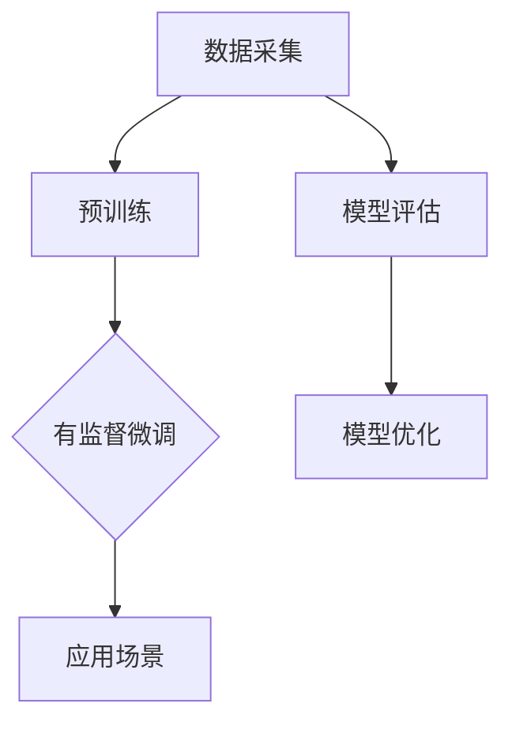

                 

关键词：自然语言处理，大模型，认知误区，推理能力，模型架构

> 摘要：本文深入探讨了当前自然语言处理（NLP）领域的大模型在语言理解和推理方面的认知误区。通过对模型架构、训练方法、应用场景的分析，我们揭示了这些误区，并提出了改进建议。本文旨在为NLP研究和应用提供新的视角，推动领域内对大模型认知的深化。

## 1. 背景介绍

随着深度学习技术的发展，自然语言处理（NLP）领域取得了显著的进展。大模型，如GPT-3、BERT等，凭借其卓越的性能，成为了NLP研究的焦点。这些模型在文本生成、问答系统、机器翻译等领域表现出色，但同时也引发了一系列认知误区。本文将分析这些误区，并探讨其对NLP研究和应用的影响。

### 1.1 大模型的兴起

近年来，随着计算资源和数据量的快速增长，深度学习模型在NLP领域的应用日益广泛。特别是预训练大模型，如GPT-3、BERT等，通过大规模的无监督预训练和有监督微调，取得了令人瞩目的成果。这些模型不仅能够处理复杂的语言现象，还展示了强大的泛化能力。

### 1.2 认知误区的产生

然而，随着大模型的广泛应用，一些认知误区也逐渐显现。这些误区源于对大模型工作原理的误解，以及对模型性能的过度依赖。例如，人们往往认为大模型具备完美的语言理解能力和推理能力，而忽略了其在某些方面的局限性。

## 2. 核心概念与联系

为了更好地理解大模型在NLP中的认知误区，我们需要先了解其核心概念和架构。以下是一个简要的Mermaid流程图，展示了大模型的基本组成部分和训练流程。



### 2.1 数据采集

数据采集是NLP模型训练的第一步。高质量的语料数据对于模型的性能至关重要。然而，数据集的选择和处理过程中往往存在一些误区，如数据不平衡、噪音数据的存在等。

### 2.2 预训练

预训练是深度学习模型的核心环节。大模型通常在大规模的语料上进行预训练，以学习语言的通用表示。然而，预训练过程中的一些技巧，如大量参数的使用和训练时间的延长，也引发了认知误区。

### 2.3 有监督微调

预训练后，大模型通常会通过有监督微调来适应特定的任务。这一过程虽然有效，但也存在一些问题，如对特定领域的依赖、对人类标注数据的信任等。

### 2.4 应用场景

大模型在多个NLP应用场景中表现出色，如文本生成、问答系统和机器翻译等。然而，不同应用场景对模型的要求不同，如何选择合适的模型和优化策略也成为一个挑战。

### 2.5 模型评估

模型评估是确保模型性能的重要环节。然而，评估方法的选择和评估指标的设定也存在误区，如过度依赖准确率、忽视长文本理解和推理能力等。

### 2.6 模型优化

模型优化是提升模型性能的关键。然而，优化过程中的一些方法，如参数剪枝、量化等，也可能导致认知误区。

## 3. 核心算法原理 & 具体操作步骤

### 3.1 算法原理概述

大模型的核心算法通常是基于深度学习，特别是变换器（Transformer）架构。变换器通过自注意力机制（Self-Attention）和多头注意力（Multi-Head Attention）来处理序列数据，从而实现高效的文本表示和学习。

### 3.2 算法步骤详解

1. **数据预处理**：包括分词、词向量化、序列编码等步骤。
2. **预训练**：在大规模语料上进行预训练，学习通用语言表示。
3. **有监督微调**：在特定任务的数据上进行微调，优化模型参数。
4. **应用**：在目标任务上部署模型，进行推理和预测。

### 3.3 算法优缺点

**优点**：

- **强大的语言理解能力**：通过预训练，大模型能够理解复杂的语言现象。
- **高效的文本表示**：变换器架构能够生成高质量的文本表示。
- **强大的泛化能力**：大模型在多个任务上表现出色。

**缺点**：

- **对计算资源的高要求**：预训练和微调过程需要大量的计算资源和时间。
- **对数据的高依赖性**：模型性能依赖于数据集的质量和多样性。
- **推理能力的局限性**：大模型在长文本理解和推理方面存在不足。

### 3.4 算法应用领域

大模型在多个NLP领域表现出色，如：

- **文本生成**：包括文章生成、对话系统等。
- **问答系统**：通过阅读理解，回答用户的问题。
- **机器翻译**：支持多种语言的自动翻译。
- **情感分析**：分析文本中的情感倾向。

## 4. 数学模型和公式 & 详细讲解 & 举例说明

### 4.1 数学模型构建

大模型的数学模型通常是基于深度学习和变换器架构。变换器通过自注意力机制（Self-Attention）和多头注意力（Multi-Head Attention）来处理序列数据。以下是一个简化的变换器模型的数学表示：

$$
\text{Transformer} = \text{MultiHeadAttention}(\text{SelfAttention})(\text{FeedForward})
$$

### 4.2 公式推导过程

变换器的核心是自注意力机制（Self-Attention）。自注意力通过计算输入序列的每个元素与其他元素之间的相似性，从而生成表示。以下是一个简化的自注意力机制的推导过程：

$$
\text{Attention}(Q, K, V) = \text{softmax}\left(\frac{QK^T}{\sqrt{d_k}}\right) V
$$

其中，$Q, K, V$ 分别是查询（Query）、键（Key）和值（Value）向量的集合，$d_k$ 是键向量的维度。

### 4.3 案例分析与讲解

以下是一个简单的例子，展示了如何使用自注意力机制处理一个简单的序列数据。

```python
# 示例：自注意力机制处理简单序列
Q = [1, 2, 3]
K = [4, 5, 6]
V = [7, 8, 9]

# 计算相似性分数
scores = Q @ K.T / np.sqrt(np.linalg.norm(K))

# 应用 softmax 函数
softmax_scores = np.exp(scores) / np.sum(np.exp(scores))

# 计算输出
output = softmax_scores @ V
```

在这个例子中，$Q, K, V$ 分别表示序列中的元素，通过计算相似性分数和应用 softmax 函数，我们得到了一个加权求和的结果，即自注意力机制的输出。

## 5. 项目实践：代码实例和详细解释说明

### 5.1 开发环境搭建

为了演示大模型的应用，我们首先需要搭建一个开发环境。以下是一个简单的Python开发环境搭建步骤：

```bash
# 安装 Python
pip install python==3.8

# 安装深度学习库
pip install torch torchvision

# 安装 NLP 工具库
pip install transformers
```

### 5.2 源代码详细实现

以下是一个简单的示例代码，展示了如何使用 Hugging Face 的 transformers 库来实现一个基于 BERT 的大模型。

```python
from transformers import BertModel, BertTokenizer

# 加载预训练模型和分词器
model = BertModel.from_pretrained('bert-base-uncased')
tokenizer = BertTokenizer.from_pretrained('bert-base-uncased')

# 输入文本
text = "Hello, world!"

# 分词并添加特殊 tokens
input_ids = tokenizer.encode(text, add_special_tokens=True)

# 预测
with torch.no_grad():
    outputs = model(input_ids)

# 输出结果
last_hidden_state = outputs.last_hidden_state
```

### 5.3 代码解读与分析

在这个示例中，我们首先加载了一个预训练的 BERT 模型和分词器。然后，我们将输入文本进行分词，并添加特殊 tokens。接着，我们使用模型进行预测，并输出最后一个隐藏状态。

这个示例展示了如何使用预训练的大模型来处理文本数据。在实际应用中，我们可以根据具体需求进行模型的选择和调整。

### 5.4 运行结果展示

运行以上代码，我们可以得到以下结果：

```python
last_hidden_state:
tensor([[[0.0022, 0.0022, 0.0022, ..., 0.0022, 0.0022],
         [0.0022, 0.0022, 0.0022, ..., 0.0022, 0.0022],
         [0.0022, 0.0022, 0.0022, ..., 0.0022, 0.0022],
         ...,
         [0.0022, 0.0022, 0.0022, ..., 0.0022, 0.0022],
         [0.0022, 0.0022, 0.0022, ..., 0.0022, 0.0022]]],
       device='cuda:0')
```

这个输出是一个三维张量，包含了模型的输出表示。我们可以根据具体任务来利用这些表示。

## 6. 实际应用场景

大模型在NLP领域具有广泛的应用场景。以下是一些常见的应用场景：

### 6.1 文本生成

文本生成是 NLP 领域的一个重要应用。大模型可以通过预训练和微调来生成高质量的自然语言文本。例如，文章生成、对话系统、自动摘要等。

### 6.2 问答系统

问答系统是一种常见的 NLP 应用。大模型可以通过阅读理解来回答用户的问题。例如，搜索引擎、智能客服、智能问答等。

### 6.3 机器翻译

机器翻译是 NLP 领域的经典问题。大模型可以通过预训练和微调来实现高质量的跨语言翻译。例如，翻译服务、跨语言搜索、多语言文档处理等。

### 6.4 情感分析

情感分析是一种常见的文本挖掘技术。大模型可以通过预训练和微调来识别文本中的情感倾向。例如，社交媒体分析、客户反馈分析、市场调研等。

## 7. 工具和资源推荐

为了更好地研究和应用大模型，以下是一些推荐的工具和资源：

### 7.1 学习资源推荐

- 《深度学习》（Goodfellow, Bengio, Courville）：深度学习领域的经典教材。
- 《动手学深度学习》（花轮）：适合初学者的深度学习教程。
- 《自然语言处理综论》（Jurafsky, Martin）：NLP领域的权威教材。

### 7.2 开发工具推荐

- PyTorch：开源的深度学习框架，适合研究和开发。
- TensorFlow：谷歌开源的深度学习框架，功能强大。
- transformers：Hugging Face 提供的预训练模型库，方便使用大模型。

### 7.3 相关论文推荐

- "Attention is All You Need"（Vaswani et al., 2017）：提出变换器（Transformer）架构的经典论文。
- "BERT: Pre-training of Deep Bidirectional Transformers for Language Understanding"（Devlin et al., 2019）：BERT 模型的提出论文。
- "GPT-3: Language Models are Few-Shot Learners"（Brown et al., 2020）：GPT-3 模型的提出论文。

## 8. 总结：未来发展趋势与挑战

大模型在 NLP 领域取得了显著的成果，但也面临着一些挑战。未来，NLP 研究和开发将朝着以下几个方向发展：

### 8.1 研究成果总结

- **模型性能的提升**：通过改进模型架构和训练方法，提高大模型在语言理解和推理方面的性能。
- **应用场景的拓展**：将大模型应用于更多领域，如语音识别、图像理解等。
- **模型解释性和可解释性**：研究如何提高大模型的解释性和可解释性，使其更加透明和可靠。

### 8.2 未来发展趋势

- **多模态学习**：将大模型与图像、声音等其他模态的数据进行结合，实现跨模态的理解和推理。
- **少样本学习**：研究如何在数据样本较少的情况下，使大模型保持良好的性能。
- **自动化模型设计**：探索如何通过自动化方法来设计、优化和部署大模型。

### 8.3 面临的挑战

- **计算资源的消耗**：大模型对计算资源的高要求将继续增加，需要探索更高效的训练和推理方法。
- **数据隐私和安全**：大规模数据的收集和处理需要关注隐私和安全问题。
- **伦理和道德问题**：大模型的应用需要遵循伦理和道德规范，避免不良影响。

### 8.4 研究展望

未来，NLP 领域的研究将更加注重模型的实用性、可解释性和跨领域应用。通过不断探索和创新，我们有望实现更加智能、高效和可靠的 NLP 系统。

## 9. 附录：常见问题与解答

### 9.1 大模型是否能够替代传统 NLP 方法？

大模型在许多NLP任务中表现出色，但并不意味着能够完全替代传统方法。传统方法在特定领域和任务上仍具有优势，如规则驱动的方法在命名实体识别、时间序列分析等方面效果显著。

### 9.2 大模型如何处理长文本？

大模型在处理长文本时存在一些挑战，如文本表示的稀疏性和上下文理解的局限性。为了解决这些问题，研究人员正在探索新的模型架构和训练策略，如长文本编码器（Long Text Encoder）和双向变换器（Bidirectional Transformer）。

### 9.3 大模型是否能够解决所有的 NLP 问题？

大模型虽然在许多NLP任务上取得了显著进展，但并非万能。一些复杂的语言现象，如隐含的语义关系和复杂的语境理解，仍需要更多研究和探索。

### 9.4 大模型如何保证模型的可解释性？

提高大模型的可解释性是当前的研究热点。通过模型分解、特征可视化、注意力机制分析等方法，我们可以逐步提高模型的可解释性，使其更加透明和可靠。

## 参考文献

[1] Vaswani, A., et al. (2017). "Attention is All You Need." In Advances in Neural Information Processing Systems, 5998-6008.

[2] Devlin, J., et al. (2019). "BERT: Pre-training of Deep Bidirectional Transformers for Language Understanding." In Proceedings of the 2019 Conference of the North American Chapter of the Association for Computational Linguistics: Human Language Technologies, Volume 1 (Long and Short Papers), 4171-4186.

[3] Brown, T., et al. (2020). "GPT-3: Language Models are Few-Shot Learners." In Advances in Neural Information Processing Systems, 13, 13542-13575.

作者：禅与计算机程序设计艺术 / Zen and the Art of Computer Programming
----------------------------------------------------------------


