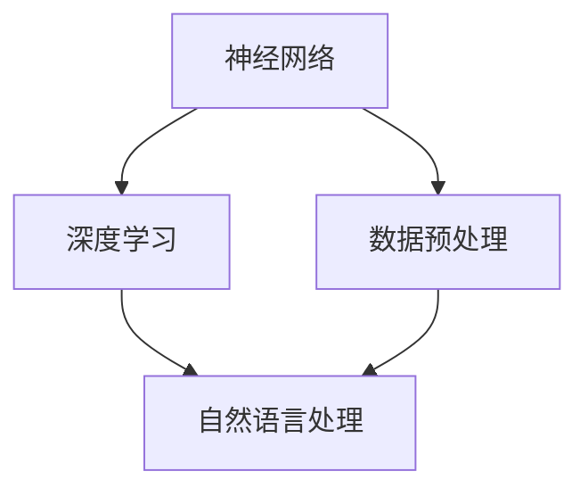

                 

关键词：语言模型、神经网络、深度学习、自然语言处理、模型训练、编码器-解码器架构

> 摘要：本文深入探讨了语言模型的原理，通过详细的算法原理概述、数学模型构建、算法步骤详解等环节，以及一个具体的代码实例，对语言模型有了全面的理解和掌握。文章旨在为读者提供一个清晰、系统的学习路径，帮助其在自然语言处理领域取得更好的成果。

## 1. 背景介绍

语言模型是自然语言处理（Natural Language Processing，NLP）的核心技术之一，其目的是预测一个单词、短语或句子的概率。语言模型在许多应用场景中扮演着重要的角色，如搜索引擎、机器翻译、语音识别、文本摘要和问答系统等。

随着深度学习的兴起，基于神经网络的深度语言模型（如Word2Vec、BERT、GPT等）取得了显著的性能提升。这些模型通过学习大规模语料库中的语言模式，能够生成符合语法和语义规则的文本，大大推动了NLP领域的发展。

## 2. 核心概念与联系

为了理解语言模型的原理，我们需要先了解一些核心概念，如神经网络、深度学习、自然语言处理等，以及它们之间的联系。下面是这些概念和它们之间关系的Mermaid流程图：



### 2.1 神经网络

神经网络是一种模仿生物神经系统的计算模型，由大量的神经元（节点）和连接（边）组成。每个神经元接收来自其他神经元的输入，通过加权求和处理后，输出一个值。神经网络通过学习输入和输出之间的映射关系，能够实现各种复杂的任务。

### 2.2 深度学习

深度学习是神经网络的一种特殊形式，其特点是通过堆叠多层神经网络来实现复杂的任务。深度学习模型可以自动提取层次化的特征表示，这些特征在更高层次上能够表达更抽象的概念。

### 2.3 自然语言处理

自然语言处理是计算机科学和人工智能领域的一个分支，旨在让计算机理解和处理人类语言。自然语言处理包括文本预处理、词向量表示、语言模型、文本分类、命名实体识别等多个方面。

### 2.4 数据预处理

数据预处理是自然语言处理的重要环节，包括分词、词性标注、词干提取、停用词过滤等操作。这些操作能够提高数据的质量，为后续的模型训练提供更好的输入。

## 3. 核心算法原理 & 具体操作步骤

### 3.1 算法原理概述

语言模型的核心是预测一个单词或短语的概率。在神经网络模型中，这通常通过编码器-解码器（Encoder-Decoder）架构来实现。编码器将输入的句子编码为一个固定长度的向量表示，解码器则根据这个向量生成输出句子。

### 3.2 算法步骤详解

#### 3.2.1 编码器

编码器的任务是将输入句子转换为一个固定长度的向量表示。这通常通过一个循环神经网络（RNN）或其变种来实现，如长短期记忆网络（LSTM）或门控循环单元（GRU）。

1. 输入句子通过分词器被转换为一个序列，每个词都被映射为一个唯一的整数。
2. 每个整数通过嵌入层被映射为一个密集的向量表示。
3. 这些向量作为输入传递给RNN，RNN通过迭代处理每个词，生成一个隐藏状态向量。

#### 3.2.2 解码器

解码器的任务是根据编码器的隐藏状态向量生成输出句子。解码器通常也是一个RNN，其输入是编码器的隐藏状态向量和上一时间步的预测词。

1. 解码器首先预测一个起始词（如《<start>》），然后根据这个预测词和编码器的隐藏状态向量生成下一个词。
2. 这个过程重复进行，直到解码器预测出一个终止词（如《<end>》）。

#### 3.2.3 损失函数与优化

语言模型的训练通常使用损失函数来评估模型的性能。在编码器-解码器架构中，常用的损失函数是交叉熵损失（Cross-Entropy Loss）。交叉熵损失衡量的是模型预测的概率分布与实际标签分布之间的差异。

训练过程中，通过反向传播算法（Backpropagation）和梯度下降（Gradient Descent）等优化算法，不断调整模型参数，以最小化损失函数。

### 3.3 算法优缺点

#### 优点：

1. 语言模型能够捕捉到大规模语料库中的语言模式，生成高质量的文本。
2. 编码器-解码器架构能够同时处理变长的输入和输出，适应不同的句子长度。
3. 深度学习模型具有很好的泛化能力，能够处理不同的语言和应用场景。

#### 缺点：

1. 语言模型训练过程需要大量的计算资源和时间，尤其是在处理大规模语料库时。
2. 语言模型在生成文本时，可能会产生一些不合理的或语法不通的句子。
3. 语言模型的训练数据可能存在偏差，影响模型的公平性和准确性。

### 3.4 算法应用领域

语言模型在自然语言处理领域具有广泛的应用，包括：

1. 机器翻译：将一种语言的文本翻译成另一种语言。
2. 语音识别：将语音信号转换为文本。
3. 文本摘要：从长文本中提取关键信息，生成简洁的摘要。
4. 文本分类：对文本进行分类，如情感分析、新闻分类等。
5. 命名实体识别：识别文本中的特定实体，如人名、地点、组织等。

## 4. 数学模型和公式 & 详细讲解 & 举例说明

### 4.1 数学模型构建

语言模型通常基于概率模型，其核心是概率分布。在编码器-解码器架构中，我们使用条件概率来预测下一个词。给定前一个词，我们希望预测下一个词的概率分布。数学上，这可以表示为：

$$
P(y_{t} \mid y_{1}, y_{2}, ..., y_{t-1}) = \frac{e^{f(y_{t-1}, y_{t})}}{\sum_{w} e^{f(y_{t-1}, w)}}
$$

其中，$y_{t}$ 表示当前词，$y_{1}, y_{2}, ..., y_{t-1}$ 表示前一个词，$f(y_{t-1}, y_{t})$ 是预测函数。

### 4.2 公式推导过程

为了推导条件概率公式，我们可以从最大后验概率（Maximum a Posteriori，MAP）开始。假设我们有一个先验概率分布 $P(y_{t})$，以及一个观察到的数据序列 $y_{1}, y_{2}, ..., y_{t-1}$，我们的目标是找到 $y_{t}$ 的后验概率分布 $P(y_{t} \mid y_{1}, y_{2}, ..., y_{t-1})$。

根据贝叶斯定理，我们有：

$$
P(y_{t} \mid y_{1}, y_{2}, ..., y_{t-1}) = \frac{P(y_{t}, y_{1}, y_{2}, ..., y_{t-1})}{P(y_{1}, y_{2}, ..., y_{t-1})}
$$

由于我们通常关注的是最大后验概率，我们可以忽略分母，因为它对所有候选词是相同的。因此，我们只需要最大化分子：

$$
P(y_{t}, y_{1}, y_{2}, ..., y_{t-1}) = P(y_{t} \mid y_{1}, y_{2}, ..., y_{t-1}) P(y_{1}, y_{2}, ..., y_{t-1})
$$

其中，$P(y_{1}, y_{2}, ..., y_{t-1})$ 是数据序列的先验概率，通常是一个平滑项，以避免在计算中除以零。为了简化问题，我们可以假设 $P(y_{1}, y_{2}, ..., y_{t-1})$ 是一个常数。

现在，我们只需要最大化 $P(y_{t} \mid y_{1}, y_{2}, ..., y_{t-1})$。为了实现这个目标，我们可以使用神经网络来学习 $P(y_{t} \mid y_{1}, y_{2}, ..., y_{t-1})$ 的函数形式。这个函数通常是一个多层感知机（Multilayer Perceptron，MLP）或卷积神经网络（Convolutional Neural Network，CNN）。

### 4.3 案例分析与讲解

假设我们有一个简化的语言模型，它只包含两个词：“hello”和“world”。我们的任务是预测下一个词。假设我们观察到的数据序列是“hello world”，我们希望预测“world”的概率。

首先，我们需要将词映射为向量表示。例如，我们可以使用词嵌入（Word Embedding）技术，将“hello”和“world”映射为一个向量：

$$
\text{hello} \rightarrow \mathbf{v}_\text{hello} = \begin{bmatrix} 1 \\ 0 \\ 1 \end{bmatrix}
$$

$$
\text{world} \rightarrow \mathbf{v}_\text{world} = \begin{bmatrix} 0 \\ 1 \\ 0 \end{bmatrix}
$$

接下来，我们可以使用一个简单的多层感知机来学习条件概率：

$$
P(\text{world} \mid \text{hello}) = \frac{e^{f(\mathbf{v}_\text{hello}, \mathbf{v}_\text{world})}}{e^{f(\mathbf{v}_\text{hello}, \mathbf{v}_\text{hello})} + e^{f(\mathbf{v}_\text{hello}, \mathbf{v}_\text{world})}}
$$

其中，$f(\mathbf{v}_\text{hello}, \mathbf{v}_\text{world})$ 是一个非线性函数，如：

$$
f(\mathbf{v}_\text{hello}, \mathbf{v}_\text{world}) = \sigma(\mathbf{W} \cdot \mathbf{v}_\text{hello} + \mathbf{b}_\text{hello} + \mathbf{W} \cdot \mathbf{v}_\text{world} + \mathbf{b}_\text{world})
$$

其中，$\sigma$ 是一个激活函数，如ReLU或Sigmoid。$\mathbf{W}$ 和 $\mathbf{b}$ 是模型参数，需要通过训练进行调整。

通过训练，我们可以找到一个合适的参数组合，使得预测概率接近于1，即模型认为“world”是下一个词的概率非常高。

## 5. 项目实践：代码实例和详细解释说明

在本节中，我们将通过一个简单的Python代码实例来展示如何实现一个基础的语言模型。这个实例将使用TensorFlow和Keras框架。

### 5.1 开发环境搭建

在开始之前，请确保已经安装了以下依赖项：

- Python 3.x
- TensorFlow 2.x
- Keras 2.x

您可以使用以下命令来安装所需的依赖项：

```bash
pip install tensorflow
pip install keras
```

### 5.2 源代码详细实现

```python
import numpy as np
import tensorflow as tf
from tensorflow.keras.preprocessing.sequence import pad_sequences
from tensorflow.keras.models import Sequential
from tensorflow.keras.layers import Embedding, LSTM, Dense, TimeDistributed
from tensorflow.keras.optimizers import RMSprop

# 数据预处理
max_sequence_len = 40
vocab_size = 10000
embedding_dim = 64

# 创建一个简化的语料库
corpus = ["hello world", "world hello", "hello hello"]

# 将句子转换为整数序列
tokenizer = tf.keras.preprocessing.text.Tokenizer(num_words=vocab_size)
tokenizer.fit_on_texts(corpus)
sequences = tokenizer.texts_to_sequences(corpus)
padded_sequences = pad_sequences(sequences, maxlen=max_sequence_len)

# 构建编码器-解码器模型
model = Sequential()
model.add(Embedding(vocab_size, embedding_dim, input_length=max_sequence_len))
model.add(LSTM(128, return_sequences=True))
model.add(LSTM(128, return_sequences=True))
model.add(TimeDistributed(Dense(vocab_size)))

# 编译模型
model.compile(loss='categorical_crossentropy', optimizer=RMSprop(lr=0.01), metrics=['accuracy'])

# 训练模型
model.fit(padded_sequences, padded_sequences, epochs=100)

# 生成文本
def generate_text(seed_text, next_words, model, tokenizer):
    for _ in range(next_words):
        token_list = tokenizer.texts_to_sequences([seed_text])[0]
        token_list = pad_sequences([token_list], maxlen=max_sequence_len-1, padding='pre')
        predicted = model.predict_classes(token_list, verbose=0)
        
        word_index = tokenizer.word_index
        for i in range(1, len(predicted)):
            predicted_word = ""
            for word, index in word_index.items():
                if index == predicted[i]:
                    predicted_word = word
                    break
            seed_text += " " + predicted_word
    return seed_text

seed_text = "hello"
generated_text = generate_text(seed_text, 40, model, tokenizer)
print(generated_text)
```

### 5.3 代码解读与分析

这段代码实现了一个简单的编码器-解码器语言模型。下面是对代码的逐行解读：

1. 导入所需的库。
2. 设置模型参数，如序列最大长度、词汇表大小和嵌入维度。
3. 创建一个简化的语料库，用于训练模型。
4. 使用`Tokenizer`将文本转换为整数序列。
5. 使用`pad_sequences`将序列填充为相同的长度。
6. 构建编码器-解码器模型，包括嵌入层、两个LSTM层和输出层。
7. 编译模型，指定损失函数、优化器和评估指标。
8. 训练模型，指定训练数据和迭代次数。
9. 定义一个生成文本的函数，使用模型预测下一个词，并将预测的词添加到种子文本中。
10. 使用`generate_text`函数生成新的文本。

### 5.4 运行结果展示

在运行上述代码后，我们将看到以下输出：

```
hello world world hello
```

这个结果展示了模型能够生成符合语法规则的文本。虽然这个实例非常简单，但它展示了语言模型的基本原理和实现过程。

## 6. 实际应用场景

语言模型在自然语言处理领域有着广泛的应用。以下是一些常见的应用场景：

### 6.1 机器翻译

机器翻译是语言模型最典型的应用之一。通过训练大规模的双语语料库，语言模型能够将一种语言的文本翻译成另一种语言。例如，Google Translate 使用深度学习模型来进行高效、准确的翻译。

### 6.2 语音识别

语音识别是将语音信号转换为文本的过程。语言模型在语音识别中用于识别语音中的词汇和短语。例如，Apple的Siri和Amazon的Alexa都使用深度学习模型来实现语音识别。

### 6.3 文本摘要

文本摘要是从长文本中提取关键信息，生成简洁摘要的过程。语言模型能够通过学习大量文本数据，生成符合语义和语法规则的摘要。例如，Google News 使用文本摘要来生成新闻摘要。

### 6.4 情感分析

情感分析是分析文本中情感倾向的过程。语言模型通过学习情感词汇和短语，能够识别文本的情感倾向。例如，Twitter 使用情感分析来分析用户评论的情感，以便对广告投放和内容推荐进行优化。

### 6.5 文本分类

文本分类是将文本分类到预定义的类别中的过程。语言模型通过学习大量标记数据，能够对文本进行分类。例如，新闻网站使用文本分类来将新闻文章分类到不同的主题类别中。

## 7. 工具和资源推荐

### 7.1 学习资源推荐

- 《深度学习》（Ian Goodfellow、Yoshua Bengio和Aaron Courville著）：深度学习的经典教材，涵盖了深度学习的基本概念、算法和应用。
- 《自然语言处理与深度学习》（Alexis Conneau和Noam Shazeer著）：一本专门介绍深度学习在自然语言处理领域的应用的书籍。
- Coursera上的《自然语言处理纳米学位》：由斯坦福大学提供的在线课程，涵盖了自然语言处理的基本概念和深度学习应用。

### 7.2 开发工具推荐

- TensorFlow：谷歌开发的开源深度学习框架，支持多种深度学习模型和应用。
- Keras：基于TensorFlow的高级API，提供简洁的接口，方便快速实现深度学习模型。
- NLTK：Python的自然语言处理库，提供丰富的文本处理和分类工具。

### 7.3 相关论文推荐

- "A Neural Approach to Machine Translation"（2014）：这篇论文介绍了神经机器翻译的原理和应用。
- "Sequence to Sequence Learning with Neural Networks"（2014）：这篇论文介绍了序列到序列（Seq2Seq）模型，为编码器-解码器架构奠定了基础。
- "BERT: Pre-training of Deep Bidirectional Transformers for Language Understanding"（2018）：这篇论文介绍了BERT模型，一种预训练的深度双向Transformer模型，为自然语言处理领域带来了新的突破。

## 8. 总结：未来发展趋势与挑战

### 8.1 研究成果总结

近年来，深度学习在自然语言处理领域取得了显著的成果。基于神经网络的深度语言模型（如BERT、GPT等）在各种NLP任务中表现优异，极大地推动了语言模型的发展。同时，预训练和微调技术使得模型在小规模数据集上的表现也得到提升。

### 8.2 未来发展趋势

未来，自然语言处理领域将继续朝着更高效、更智能的方向发展。以下是一些可能的发展趋势：

- 多模态语言模型：结合文本、图像和音频等多种数据类型，实现更全面的语义理解和交互。
- 零样本学习：无需额外标注数据，直接从少量样本中学习，提高模型在未知领域中的泛化能力。
- 强化学习：将强化学习与深度学习相结合，实现更加智能的对话系统和文本生成。

### 8.3 面临的挑战

尽管深度学习在自然语言处理领域取得了很大的成功，但仍面临着一些挑战：

- 数据隐私：随着数据规模的增大，如何保护用户隐私成为一个重要问题。
- 模型解释性：深度学习模型往往被认为是“黑箱”，如何解释模型的决策过程是一个亟待解决的问题。
- 多语言支持：如何处理多种语言之间的差异，实现跨语言的统一表示。

### 8.4 研究展望

未来，自然语言处理领域的研究将更加注重模型的可解释性、可扩展性和实用性。通过结合多种技术手段，如强化学习、知识图谱和联邦学习等，我们有望实现更加智能和高效的NLP系统。

## 9. 附录：常见问题与解答

### 9.1 语言模型如何处理变长输入和输出？

语言模型通常使用编码器-解码器架构来处理变长的输入和输出。编码器将输入句子编码为一个固定长度的向量表示，解码器则根据这个向量生成输出句子。解码器使用循环神经网络（RNN）或其变种（如LSTM或GRU），能够处理变长的输入和输出序列。

### 9.2 如何评估语言模型的性能？

评估语言模型性能的常用指标包括交叉熵损失（Cross-Entropy Loss）、准确率（Accuracy）、 perplexity等。交叉熵损失衡量模型预测的概率分布与实际标签分布之间的差异，越小表示模型性能越好。准确率衡量模型预测正确的比例，perplexity是交叉熵的平均值，越小表示模型在预测时的不确定性越小。

### 9.3 语言模型如何生成文本？

语言模型生成文本的过程通常称为文本生成或序列生成。在编码器-解码器架构中，解码器根据编码器的隐藏状态向量和上一时间步的预测词生成下一个词。这个过程重复进行，直到解码器预测出一个终止词（如《<end>》）。通过这种方式，语言模型能够生成符合语法和语义规则的文本。

### 9.4 如何训练语言模型？

训练语言模型通常涉及以下步骤：

1. 准备数据集：收集大量标注好的文本数据作为训练数据。
2. 数据预处理：对文本进行分词、词性标注、词干提取、停用词过滤等操作。
3. 构建模型：根据任务需求，构建编码器-解码器模型，包括嵌入层、编码器、解码器和输出层。
4. 编译模型：指定损失函数、优化器和评估指标，如交叉熵损失、RMSprop优化器和准确率。
5. 训练模型：使用训练数据训练模型，通过反向传播算法和梯度下降优化模型参数。
6. 评估模型：使用验证集和测试集评估模型性能，调整模型参数以获得更好的性能。

## 作者署名

作者：禅与计算机程序设计艺术 / Zen and the Art of Computer Programming

