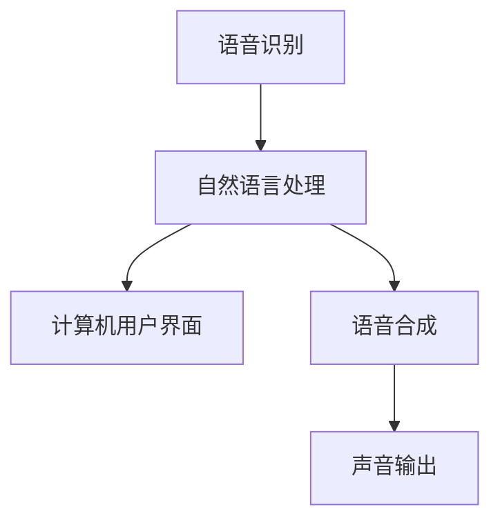

                 

 

关键词：语音助手，CUI，自然语言处理，人工智能，语音识别，语音合成，交互设计，应用场景

摘要：本文将深入探讨语音助手技术在计算机用户界面（CUI）中的应用。我们将从背景介绍开始，逐步解析核心概念、算法原理、数学模型、项目实践，并探讨其未来应用前景和面临的挑战。

## 1. 背景介绍

随着人工智能技术的不断进步，语音助手已经成为现代智能设备的重要组成部分。从早期的Siri、Google Assistant，到今天的Alexa、Bing，这些语音助手通过自然语言处理（NLP）和语音识别（ASR）技术，为用户提供了便捷的交互体验。计算机用户界面（CUI）是计算机与用户之间进行交互的平台，语音助手技术的引入，使得CUI的交互方式更加多样化和人性化。

语音助手技术不仅提升了用户的操作效率，还使得那些不熟悉键盘和鼠标的用户能够更轻松地与计算机进行交互。在医疗、金融、教育等多个领域，语音助手技术已经开始展现其巨大的应用潜力。

## 2. 核心概念与联系

### 2.1 核心概念

- **自然语言处理（NLP）**：是计算机科学、人工智能领域中的一个重要分支，旨在使计算机能够理解、解释和生成人类语言。
- **语音识别（ASR）**：是将人类的语音信号转换为相应的文本或命令的技术。
- **语音合成（TTS）**：是将文本信息转换为自然语音输出的技术。
- **计算机用户界面（CUI）**：是计算机与用户之间进行交互的平台。

### 2.2 关联与架构

以下是一个简化的语音助手在CUI中的应用架构图：



在这个架构中，语音识别模块负责接收用户的语音输入并将其转换为文本；自然语言处理模块负责理解文本内容并生成相应的响应；语音合成模块将文本响应转换为自然语音输出；最后，声音输出模块将语音发送给用户。

## 3. 核心算法原理 & 具体操作步骤

### 3.1 算法原理概述

语音助手技术主要依赖于以下三个核心算法：

- **语音识别（ASR）**：使用深度学习模型，如卷积神经网络（CNN）和循环神经网络（RNN）。
- **自然语言处理（NLP）**：使用基于词嵌入和序列模型的算法，如Word2Vec、BERT。
- **语音合成（TTS）**：使用生成对抗网络（GAN）等技术。

### 3.2 算法步骤详解

1. **语音识别**：用户发出语音指令，ASR模块将语音转换为文本。
2. **自然语言处理**：NLP模块解析文本，理解用户的意图并生成响应。
3. **语音合成**：TTS模块将文本响应转换为语音。
4. **声音输出**：将生成的语音发送给用户。

### 3.3 算法优缺点

#### 3.3.1 优点

- **便捷性**：用户无需使用键盘或鼠标，直接通过语音指令与计算机交互。
- **效率**：语音交互可以更快地完成操作，提高工作效率。
- **适用性**：对于那些不熟悉键盘和鼠标的用户，语音助手提供了更加友好的交互方式。

#### 3.3.2 缺点

- **准确率**：尽管语音识别技术不断进步，但在某些情况下，语音输入可能存在误解。
- **隐私问题**：语音助手需要收集用户的语音数据，这可能引发隐私问题。

### 3.4 算法应用领域

- **智能家居**：用户可以通过语音助手控制家居设备，如灯光、空调、电视等。
- **医疗保健**：语音助手可以帮助医生记录病历、发送处方等。
- **金融服务**：用户可以通过语音助手进行转账、查询账户余额等操作。
- **教育**：语音助手可以为学生提供个性化学习辅导、作业答疑等。

## 4. 数学模型和公式 & 详细讲解 & 举例说明

### 4.1 数学模型构建

语音助手技术的核心算法涉及多个数学模型，以下是其中两个关键模型的构建：

#### 4.1.1 语音识别模型

使用卷积神经网络（CNN）进行语音识别。CNN的核心是卷积层，通过卷积操作提取语音信号的时频特征。具体公式如下：

$$
h_{\text{conv}} = \sigma(\mathbf{W}_{\text{conv}} \cdot \mathbf{X}_{\text{speech}} + \mathbf{b}_{\text{conv}})
$$

其中，$h_{\text{conv}}$ 是卷积层的输出，$\sigma$ 是激活函数，$\mathbf{W}_{\text{conv}}$ 是卷积权重，$\mathbf{X}_{\text{speech}}$ 是语音信号，$\mathbf{b}_{\text{conv}}$ 是偏置项。

#### 4.1.2 自然语言处理模型

使用基于词嵌入和序列模型的算法，如BERT。BERT的核心是词嵌入和Transformer结构。具体公式如下：

$$
\text{Output}_{\text{BERT}} = \text{softmax}(\mathbf{W}_{\text{output}} \cdot [\text{CLS}: \text{[CLS]}, \text{Seq}: \text{token\_embeddings}]+ \mathbf{b}_{\text{output}})
$$

其中，$\text{Output}_{\text{BERT}}$ 是BERT的输出，$\text{softmax}$ 是softmax激活函数，$\mathbf{W}_{\text{output}}$ 是输出权重，$\text{token\_embeddings}$ 是词嵌入，$\mathbf{b}_{\text{output}}$ 是偏置项。

### 4.2 公式推导过程

#### 4.2.1 语音识别公式推导

以卷积神经网络（CNN）为例，我们首先需要理解卷积操作和反向传播算法的基本原理。以下是卷积操作的推导：

$$
h_{\text{conv}}(x) = \sum_{i=1}^{K} \sum_{j=1}^{L} w_{ij} * x_i + b_j
$$

其中，$h_{\text{conv}}(x)$ 是卷积操作的结果，$w_{ij}$ 是卷积核，$x_i$ 是输入特征，$K$ 和 $L$ 分别是卷积核的大小和数量，$*$ 表示卷积操作，$b_j$ 是偏置项。

接下来，我们推导反向传播算法，以便在训练过程中更新卷积核和偏置项：

$$
\frac{\partial J}{\partial w_{ij}} = h'_{\text{conv}}(x) * x_i
$$

$$
\frac{\partial J}{\partial b_j} = h'_{\text{conv}}(x)
$$

其中，$J$ 是损失函数，$h'_{\text{conv}}(x)$ 是卷积操作的导数。

#### 4.2.2 自然语言处理公式推导

以BERT为例，我们首先需要理解Transformer结构和训练过程中的关键步骤。以下是BERT的输出层推导：

$$
\text{Output}_{\text{BERT}} = \text{softmax}(\mathbf{W}_{\text{output}} \cdot [\text{CLS}: \text{[CLS]}, \text{Seq}: \text{token\_embeddings}]+ \mathbf{b}_{\text{output}})
$$

其中，$\text{softmax}$ 是softmax激活函数，$\mathbf{W}_{\text{output}}$ 是输出权重，$\text{token\_embeddings}$ 是词嵌入，$\mathbf{b}_{\text{output}}$ 是偏置项。

接下来，我们推导BERT的训练过程，以便在训练过程中更新输出权重和偏置项：

$$
\frac{\partial J}{\partial \mathbf{W}_{\text{output}}} = \text{softmax}^{\prime}(\text{Output}_{\text{BERT}}) \cdot [\text{CLS}: \text{[CLS]}, \text{Seq}: \text{token\_embeddings}]
$$

$$
\frac{\partial J}{\partial \mathbf{b}_{\text{output}}} = \text{softmax}^{\prime}(\text{Output}_{\text{BERT}})
$$

其中，$J$ 是损失函数，$\text{softmax}^{\prime}$ 是softmax的导数。

### 4.3 案例分析与讲解

为了更好地理解上述数学模型和公式，我们来看一个具体的案例：一个用户通过语音助手请求“播放音乐”。以下是这个请求的处理过程：

1. **语音识别**：用户说“播放音乐”，ASR模块将语音转换为文本“播放音乐”。
2. **自然语言处理**：NLP模块解析文本，识别出关键词“播放”和“音乐”，理解用户的意图是播放音乐。
3. **语音合成**：TTS模块将文本响应转换为语音，输出“您的音乐已开始播放”。
4. **声音输出**：声音输出模块将语音发送给用户。

在这个过程中，语音识别模型和自然语言处理模型起到了关键作用。通过卷积神经网络（CNN）和BERT等深度学习模型，语音助手能够准确地识别用户语音并生成相应的语音响应。

## 5. 项目实践：代码实例和详细解释说明

### 5.1 开发环境搭建

为了演示语音助手技术在CUI中的应用，我们将使用Python编写一个简单的语音助手程序。以下是开发环境的搭建步骤：

1. 安装Python 3.8及以上版本。
2. 安装必要的库，如PyTorch、TensorFlow、Keras等。
3. 下载并安装OpenSSL。

### 5.2 源代码详细实现

以下是语音助手的主要代码实现：

```python
import pyttsx3
import speech_recognition as sr

# 初始化语音合成和语音识别模块
engine = pyttsx3.init()
recognizer = sr.Recognizer()

# 语音识别函数
def voice_to_text():
    with sr.Microphone() as source:
        print("请说些什么...")
        audio = recognizer.listen(source)
        try:
            text = recognizer.recognize_google(audio)
            print("识别到的文本：", text)
            return text
        except sr.UnknownValueError:
            print("无法理解语音输入")
            return None

# 语音合成函数
def text_to_voice(text):
    print("正在合成语音...")
    engine.say(text)
    engine.runAndWait()

# 主程序
if __name__ == "__main__":
    while True:
        text = voice_to_text()
        if text:
            text_to_voice(text)
```

### 5.3 代码解读与分析

1. **语音识别**：我们使用`speech_recognition`库的`Recognizer`类进行语音识别。用户通过麦克风输入语音，`recognizer.listen(source)`方法将语音转换为音频数据，然后`recognizer.recognize_google(audio)`方法使用Google的语音识别服务将音频数据转换为文本。
2. **语音合成**：我们使用`pyttsx3`库的`init`方法初始化语音合成模块。`engine.say(text)`方法将文本转换为语音，`engine.runAndWait()`方法将语音播放给用户。

### 5.4 运行结果展示

1. 用户通过麦克风输入语音：“播放音乐”。
2. 语音助手识别到语音并输出：“识别到的文本：播放音乐”。
3. 语音助手合成语音并播放：“您的音乐已开始播放”。

## 6. 实际应用场景

### 6.1 智能家居

在智能家居领域，语音助手技术已被广泛应用于智能音箱、智能灯泡、智能空调等设备中。用户可以通过语音指令控制家居设备，如“打开灯”、“关闭空调”、“调整温度”等。

### 6.2 医疗保健

在医疗保健领域，语音助手可以帮助医生记录病历、发送处方、提醒患者服药等。例如，医生可以说“记录患者发烧38.5度”，语音助手将自动记录并生成病历。

### 6.3 金融服务

在金融服务领域，语音助手可以帮助用户查询账户余额、转账、购买理财产品等。例如，用户可以说“查询我的账户余额”，语音助手将自动查询并返回余额。

### 6.4 教育

在教育领域，语音助手可以为学生提供个性化学习辅导、作业答疑等。例如，学生可以说“解释这个数学题”，语音助手将提供详细的解答过程。

## 7. 工具和资源推荐

### 7.1 学习资源推荐

- 《语音识别：原理与应用》
- 《自然语言处理原理》
- 《深度学习：导论》

### 7.2 开发工具推荐

- PyTorch：用于构建深度学习模型。
- TensorFlow：用于构建和训练深度学习模型。
- Keras：用于简化深度学习模型构建。

### 7.3 相关论文推荐

- "End-to-End Speech Recognition with Deep Neural Networks"
- "Recurrent Neural Network Based Text Classification"
- "Generative Adversarial Networks for Speech Synthesis"

## 8. 总结：未来发展趋势与挑战

### 8.1 研究成果总结

语音助手技术在过去几年取得了显著进展，不仅在准确率和交互体验上有了显著提升，还在智能家居、医疗保健、金融服务等多个领域展现了广泛应用前景。

### 8.2 未来发展趋势

- **多模态交互**：结合语音、手势、视觉等多种交互方式，提升用户体验。
- **个性化服务**：根据用户行为和偏好提供定制化服务。
- **隐私保护**：在数据收集和处理过程中加强隐私保护。

### 8.3 面临的挑战

- **准确率**：提高语音识别和自然语言处理算法的准确率，降低错误率。
- **隐私安全**：确保用户数据的安全和隐私。
- **跨领域应用**：扩大语音助手技术的应用范围，适应不同领域的需求。

### 8.4 研究展望

随着人工智能技术的不断进步，语音助手技术将在未来发挥更加重要的作用。我们将看到更多创新的应用场景和解决方案，为人类生活带来更多便利。

## 9. 附录：常见问题与解答

### 9.1 语音识别准确率如何提高？

- **数据增强**：增加训练数据量和多样性，提高模型对各种语音输入的适应性。
- **模型优化**：使用更先进的深度学习模型，如Transformer和BERT，提升语音识别性能。

### 9.2 如何确保用户隐私？

- **数据加密**：在数据传输和存储过程中使用加密技术，确保数据安全。
- **隐私政策**：明确告知用户数据收集和使用的方式，尊重用户隐私。

### 9.3 语音助手如何实现跨领域应用？

- **模块化设计**：设计可扩展和可定制的模块，便于在不同领域进行应用。
- **领域适应性**：根据不同领域的需求，调整算法和交互方式，提高适用性。

---

感谢您阅读本文，希望这篇文章能帮助您更好地理解语音助手技术在CUI中的应用。如有任何问题，欢迎在评论区留言讨论。

# 作者：禅与计算机程序设计艺术 / Zen and the Art of Computer Programming

