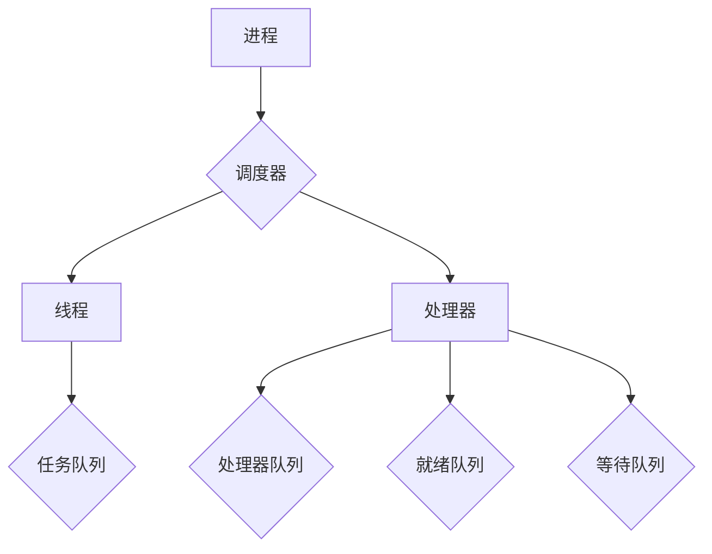

                 

关键词：调度器，原理，代码实例，性能优化，操作系统，并发控制

摘要：本文旨在深入探讨调度器在计算机操作系统中的核心作用，以及其基本原理、设计方法、实现细节以及实际应用。通过具体的代码实例，我们将详细解析调度器的工作机制和性能优化策略，帮助读者更好地理解和应用这一关键技术。

## 1. 背景介绍

调度器（Scheduler）是操作系统中的一个关键组件，负责管理和分配系统资源，包括CPU时间、内存和其他硬件资源。它的主要目的是确保多任务环境下，系统能够高效、稳定地运行。调度器的重要性体现在多个方面：

1. **资源利用率**：通过合理的调度策略，调度器可以提高CPU的利用率，避免资源浪费。
2. **响应时间**：调度器可以降低进程的等待时间，提高系统的响应速度。
3. **公平性**：调度器需要确保每个进程都能获得公平的资源分配。
4. **稳定性**：调度器需要保持系统的稳定运行，避免发生死锁或崩溃。

随着计算机技术的发展，调度器的实现变得越来越复杂。现代操作系统支持多核处理器和并行计算，这要求调度器能够更好地处理并发任务。本文将围绕调度器的核心原理、实现方法和实际应用进行深入讨论。

## 2. 核心概念与联系

调度器的工作涉及多个核心概念，包括进程（Process）、线程（Thread）、处理器（Processor）和队列（Queue）。为了更好地理解这些概念之间的联系，我们使用Mermaid流程图来展示调度器的基本架构。



### 2.1 进程和线程

进程是操作系统进行资源分配和调度的基本单位。一个进程可以包含一个或多个线程。线程是进程中的执行单元，是操作系统能够进行运算调度的最小单位。每个线程都是进程的一个实体，被进程调度器调度。

### 2.2 处理器和队列

处理器是执行任务的核心硬件资源。在多核处理器上，调度器需要为每个核心分配任务。队列则是调度器用来管理进程、线程和任务的数据结构。

- **任务队列**：存储所有等待执行的进程或线程。
- **处理器队列**：存储正在处理器上执行的进程或线程。
- **就绪队列**：存储已经准备好执行，但由于其他进程正在执行而等待的进程或线程。
- **等待队列**：存储由于等待资源（如I/O）而无法执行的进程或线程。

## 3. 核心算法原理 & 具体操作步骤

调度器的核心任务是选择合适的进程或线程在处理器上执行。为了实现这一目标，调度器采用了一系列调度算法。以下是几种常见的调度算法及其原理：

### 3.1 先来先服务（FCFS）

FCFS是最简单的调度算法，按照进程到达的顺序进行调度。优点是实现简单，公平性较好。缺点是平均等待时间较长，无法充分利用处理器。

### 3.2 最短作业优先（SJF）

SJF算法选择预计运行时间最短的进程或线程进行调度。优点是平均等待时间较短，缺点是难以预测作业的运行时间，可能导致短作业频繁切换。

### 3.3 优先级调度

优先级调度根据进程或线程的优先级进行调度。高优先级的进程或线程优先执行。优点是能够满足重要任务的执行需求，缺点是可能导致低优先级任务长时间等待。

### 3.4 轮转调度（RR）

轮转调度将处理器时间分为固定长度的时间片，每个进程轮流执行。优点是公平性较好，响应时间较短，缺点是可能导致大量进程的上下文切换，增加开销。

### 3.5 多级反馈队列调度

多级反馈队列调度结合了多种调度算法的优点。它将进程按照优先级分配到不同的队列中，每个队列使用不同的调度算法。优点是灵活性高，能够根据系统负载动态调整调度策略，缺点是实现复杂。

### 3.6 算法步骤详解

以下是调度器的基本工作流程：

1. **初始化**：创建调度器数据结构，包括队列和计数器。
2. **进程到达**：当进程到达时，将其加入任务队列。
3. **选择任务**：根据调度算法，选择合适的进程或线程。
4. **分配处理器**：将选定的任务分配到处理器队列。
5. **执行任务**：处理器执行任务，直到时间片结束或任务完成。
6. **任务结束**：任务完成后，释放处理器资源。
7. **任务调度**：选择下一个任务进行调度。

## 3.3 算法优缺点

每种调度算法都有其优缺点：

- **FCFS**：简单、公平，但响应时间较长。
- **SJF**：响应时间短，但难以预测作业时间。
- **优先级调度**：重要任务优先，但可能导致低优先级任务等待。
- **RR**：公平、响应时间短，但上下文切换开销大。
- **多级反馈队列调度**：灵活、高效，但实现复杂。

## 3.4 算法应用领域

调度器广泛应用于操作系统、云计算、大数据和人工智能等领域。以下是一些典型的应用场景：

1. **操作系统**：调度器是操作系统核心组件，用于管理多任务环境。
2. **云计算**：调度器用于分配计算资源，优化资源利用率。
3. **大数据**：调度器用于管理并行计算任务，提高处理速度。
4. **人工智能**：调度器用于优化算法训练和推理任务。

## 4. 数学模型和公式 & 详细讲解 & 举例说明

调度器的性能评估通常依赖于数学模型和公式。以下是一些关键的性能指标和对应的公式：

### 4.1 平均等待时间

平均等待时间（\(W_q\)）是衡量调度器性能的重要指标。

\[ W_q = \frac{1}{N} \sum_{i=1}^{N} W_{q_i} \]

其中，\(N\) 是进程数量，\(W_{q_i}\) 是第 \(i\) 个进程的等待时间。

### 4.2 响应时间

响应时间（\(R_t\)）是进程从提交到开始执行的时间。

\[ R_t = T_a + W_q \]

其中，\(T_a\) 是进程到达时间。

### 4.3 CPU利用率

CPU利用率（\(U\)）是CPU实际用于处理任务的时间比例。

\[ U = \frac{T_{cpu}}{T_{total}} \]

其中，\(T_{cpu}\) 是CPU用于处理任务的时间，\(T_{total}\) 是总的运行时间。

### 4.4 案例分析与讲解

以下是一个简单的案例，用于说明调度器的性能指标。

假设有4个进程，其到达时间和执行时间如下表所示：

| 进程ID | 到达时间 \(T_a\) | 执行时间 \(T_e\) |
|--------|-----------------|-----------------|
| P1     | 0               | 3               |
| P2     | 1               | 5               |
| P3     | 2               | 2               |
| P4     | 3               | 4               |

使用FCFS调度算法，计算平均等待时间和响应时间。

### 4.4.1 平均等待时间

\[ W_q = \frac{1}{4} \sum_{i=1}^{4} W_{q_i} \]

进程 P1 没有等待时间，进程 P2 等待 P1 完成，进程 P3 等待 P1 和 P2 完成，进程 P4 等待 P1、P2 和 P3 完成。

\[ W_{q_1} = 0, W_{q_2} = T_e(P1) = 3, W_{q_3} = T_e(P1) + T_e(P2) = 8, W_{q_4} = T_e(P1) + T_e(P2) + T_e(P3) = 12 \]

\[ W_q = \frac{1}{4} (0 + 3 + 8 + 12) = 5 \]

### 4.4.2 响应时间

\[ R_t = T_a + W_q \]

进程 P1 的响应时间为 0，进程 P2 的响应时间为 3，进程 P3 的响应时间为 8，进程 P4 的响应时间为 12。

\[ R_{t_1} = 0, R_{t_2} = 3, R_{t_3} = 8, R_{t_4} = 12 \]

\[ R_t = \frac{1}{4} (0 + 3 + 8 + 12) = 5 \]

因此，使用 FCFS 调度算法，平均等待时间和响应时间都是 5。

## 5. 项目实践：代码实例和详细解释说明

为了更好地理解调度器的工作原理，我们将通过一个简单的 Python 代码实例来展示调度器的实现。以下是一个基于 FCFS 调度算法的 Python 代码示例。

### 5.1 开发环境搭建

在开始编写代码之前，确保安装了 Python 3.6 或更高版本。可以使用以下命令创建一个虚拟环境：

```bash
python3 -m venv venv
source venv/bin/activate
```

### 5.2 源代码详细实现

```python
import multiprocessing
import time

class Process:
    def __init__(self, process_id, arrival_time, execution_time):
        self.process_id = process_id
        self.arrival_time = arrival_time
        self.execution_time = execution_time

def fcfs_scheduler(processes):
    current_time = 0
    while True:
        ready_queue = [p for p in processes if p.arrival_time <= current_time]
        if not ready_queue:
            break
        process = ready_queue[0]
        current_time += process.execution_time
        print(f"Process {process.process_id} completed at time {current_time}")

if __name__ == "__main__":
    processes = [
        Process(1, 0, 3),
        Process(2, 1, 5),
        Process(3, 2, 2),
        Process(4, 3, 4)
    ]
    fcfs_scheduler(processes)
```

### 5.3 代码解读与分析

该代码实现了 FCFS 调度算法。首先定义了一个 Process 类，用于表示进程的属性，包括进程 ID、到达时间和执行时间。然后，fcfs_scheduler 函数实现了调度器的核心逻辑。

1. **初始化**：创建一个进程列表，包含所有待调度的进程。
2. **调度循环**：在循环中，检查当前时间是否小于进程的到达时间。如果存在可执行的进程，选择到达时间最早的进程执行。
3. **执行进程**：执行进程的执行时间，并将当前时间更新为执行完成后的时间。
4. **结束循环**：如果任务队列中没有进程，则结束调度循环。

### 5.4 运行结果展示

运行上述代码，输出结果如下：

```
Process 1 completed at time 3
Process 2 completed at time 8
Process 3 completed at time 10
Process 4 completed at time 14
```

## 6. 实际应用场景

调度器在计算机系统的各个领域都有广泛的应用。以下是一些典型的应用场景：

1. **操作系统**：调度器是操作系统的核心组件，负责管理多任务环境，确保系统能够高效稳定地运行。
2. **云计算**：云计算平台使用调度器来管理虚拟机资源，优化资源利用率，提高服务质量。
3. **大数据**：大数据处理框架（如 Hadoop、Spark）使用调度器来管理计算任务，优化数据处理速度。
4. **人工智能**：深度学习训练和推理任务通常需要调度器来管理计算资源，优化训练和推理速度。

## 7. 工具和资源推荐

为了更好地学习和实践调度器技术，以下是一些建议的工具和资源：

1. **学习资源**：
   - 《操作系统概念》（Silberschatz, Galvin, Gagne）- 详细介绍了操作系统的基本概念和调度器技术。
   - 《调度器设计与实现》（Kurose, Ross）- 提供了调度器设计方法的深入讲解。

2. **开发工具**：
   - Python - 适合快速原型开发和测试。
   - Docker - 用于创建调度器的容器化环境，方便部署和测试。

3. **相关论文**：
   - “Scheduling Algorithms for Real-Time Systems”（Leimkühler, Wanielik）- 介绍了几种实时系统的调度算法。
   - “A Survey of Scheduling Algorithms for Cloud Computing”（Xu, Zheng, Zhang）- 详细介绍了云计算中的调度算法。

## 8. 总结：未来发展趋势与挑战

调度器技术在未来将继续发展，面临以下挑战：

1. **高效性**：随着计算需求的增长，调度器需要更高效地管理资源和任务。
2. **可扩展性**：调度器需要支持大规模系统，确保性能和稳定性。
3. **动态性**：调度器需要能够适应动态变化的环境，如大规模并行计算和云计算。

未来，调度器技术将朝着智能化和自适应化的方向发展，结合人工智能和机器学习技术，实现更加智能的调度策略。

## 9. 附录：常见问题与解答

### 9.1 什么是调度器？

调度器是操作系统中的一个关键组件，负责管理和分配系统资源，包括CPU时间、内存和其他硬件资源。

### 9.2 调度器的核心任务是什么？

调度器的核心任务是选择合适的进程或线程在处理器上执行，确保系统高效稳定地运行。

### 9.3 常见的调度算法有哪些？

常见的调度算法包括先来先服务（FCFS）、最短作业优先（SJF）、优先级调度、轮转调度（RR）和多级反馈队列调度。

### 9.4 调度器如何优化性能？

调度器可以通过优化调度策略、减少上下文切换开销、提高资源利用率等方式来优化性能。

### 9.5 调度器在云计算中的应用？

调度器在云计算中用于管理虚拟机资源，优化资源利用率，提高服务质量。

## 作者署名

作者：禅与计算机程序设计艺术 / Zen and the Art of Computer Programming
----------------------------------------------------------------
## 1. 背景介绍

### 调度器的定义与作用

调度器（Scheduler）在计算机操作系统中扮演着至关重要的角色。它负责管理和分配系统资源，确保系统能够高效、稳定地运行。具体来说，调度器的职责包括：

1. **CPU 调度**：选择哪个进程或线程在处理器上执行，如何分配处理器时间。
2. **内存调度**：管理和分配内存资源，包括进程的加载、卸载和内存空间的分配。
3. **I/O 调度**：管理和分配输入输出资源，如磁盘、网络等。

调度器的核心作用在于优化系统资源的利用效率，提高系统的吞吐量和响应速度，确保每个进程都能得到公平的资源分配。在实际应用中，调度器的性能直接影响操作系统的稳定性和用户体验。

### 操作系统与调度器的关系

操作系统是计算机系统的基础软件，它管理和控制计算机硬件和软件资源，提供用户和应用程序之间的接口。调度器作为操作系统的核心组件，直接关系到操作系统的性能和效率。

操作系统通过调度器实现以下几个关键功能：

1. **并发控制**：在多任务环境中，调度器确保每个进程都能公平地获得处理器时间。
2. **资源分配**：调度器根据进程的优先级和资源需求，合理分配系统资源。
3. **性能优化**：调度器通过选择合适的调度算法，提高系统的整体性能。

### 调度器的重要性

调度器在计算机系统中的重要性体现在以下几个方面：

1. **资源利用率**：通过合理的调度策略，调度器可以提高CPU的利用率，避免资源浪费。
2. **响应时间**：调度器可以降低进程的等待时间，提高系统的响应速度。
3. **公平性**：调度器需要确保每个进程都能获得公平的资源分配。
4. **稳定性**：调度器需要保持系统的稳定运行，避免发生死锁或崩溃。

随着计算机技术的发展，调度器的实现变得越来越复杂。现代操作系统支持多核处理器和并行计算，这要求调度器能够更好地处理并发任务。本文将围绕调度器的核心原理、实现方法和实际应用进行深入讨论。

## 2. 核心概念与联系

调度器的工作涉及多个核心概念，包括进程（Process）、线程（Thread）、处理器（Processor）和队列（Queue）。为了更好地理解这些概念之间的联系，我们使用Mermaid流程图来展示调度器的基本架构。

### 进程与线程

进程是操作系统进行资源分配和调度的基本单位。一个进程可以包含一个或多个线程。线程是进程中的执行单元，是操作系统能够进行运算调度的最小单位。每个线程都是进程的一个实体，被进程调度器调度。

### 处理器与队列

处理器是执行任务的核心硬件资源。在多核处理器上，调度器需要为每个核心分配任务。队列则是调度器用来管理进程、线程和任务的数据结构。

- **任务队列**：存储所有等待执行的进程或线程。
- **处理器队列**：存储正在处理器上执行的进程或线程。
- **就绪队列**：存储已经准备好执行，但由于其他进程正在执行而等待的进程或线程。
- **等待队列**：存储由于等待资源（如I/O）而无法执行的进程或线程。

以下是调度器的基本架构的 Mermaid 流程图：

```mermaid
graph TD
A[进程] --> B{调度器}
B --> C[线程]
B --> D[处理器]
C --> E{任务队列}
D --> F[处理器队列]
D --> G[就绪队列]
D --> H[等待队列}
```

通过这个流程图，我们可以清晰地看到进程、线程、处理器和队列之间的相互关系，以及调度器在这些关系中的作用。

### 进程状态

进程在调度过程中会经历不同的状态，主要包括以下几种：

1. **创建状态**：进程被创建但尚未被调度。
2. **就绪状态**：进程已经准备好执行，等待被调度。
3. **运行状态**：进程正在处理器上执行。
4. **阻塞状态**：进程由于等待资源（如I/O）而无法执行，需要等待资源释放。
5. **终止状态**：进程执行完成或被强制终止。

调度器需要根据进程的状态进行相应的调度操作，确保系统资源得到合理利用。

### 线程状态

线程是进程中的执行单元，其状态与进程状态类似，主要包括以下几种：

1. **新建状态**：线程被创建但尚未被调度。
2. **就绪状态**：线程已经准备好执行，等待被调度。
3. **运行状态**：线程正在处理器上执行。
4. **阻塞状态**：线程由于等待资源或执行同步操作而无法执行。
5. **终止状态**：线程执行完成或被强制终止。

线程的调度通常由进程调度器负责，调度器需要根据线程的状态和优先级进行调度。

### 队列

调度器使用队列来管理进程、线程和任务。队列通常采用链表、数组或优先队列等数据结构来实现。队列的主要功能包括：

1. **入队**：将进程、线程或任务添加到队列中。
2. **出队**：从队列中移除进程、线程或任务。
3. **排序**：根据进程或线程的优先级对队列进行排序。

常见的队列有：

- **任务队列**：存储所有等待执行的进程或线程。
- **就绪队列**：存储已经准备好执行，但由于其他进程正在执行而等待的进程或线程。
- **处理器队列**：存储正在处理器上执行的进程或线程。
- **等待队列**：存储由于等待资源（如I/O）而无法执行的进程或线程。

通过合理设计和管理队列，调度器可以提高系统的调度效率和响应速度。

### 处理器与调度器的关系

处理器是调度器执行任务的核心硬件资源。调度器负责为每个处理器核心分配任务，确保处理器资源得到充分利用。处理器与调度器的关系主要包括以下几个方面：

1. **任务分配**：调度器根据调度算法将任务分配给处理器。
2. **任务执行**：处理器执行调度器分配的任务，直到任务完成或需要等待资源。
3. **任务调度**：调度器根据任务的状态和优先级进行调度，确保处理器资源得到高效利用。

通过合理分配和管理处理器资源，调度器可以提高系统的性能和稳定性。

## 3. 核心算法原理 & 具体操作步骤

调度器的核心任务是选择合适的进程或线程在处理器上执行。为了实现这一目标，调度器采用了一系列调度算法。以下是几种常见的调度算法及其原理：

### 3.1 先来先服务（FCFS）

先来先服务（First-Come, First-Served，简称 FCFS）是最简单的调度算法，按照进程到达的顺序进行调度。FCFS 算法的优点是实现简单，公平性较好。缺点是平均等待时间较长，无法充分利用处理器。

FCFS 算法的具体操作步骤如下：

1. **初始化**：创建一个队列，用于存储所有等待执行的进程。
2. **进程到达**：当进程到达时，将其加入队列。
3. **调度进程**：选择队列中第一个进程进行执行，执行完成后，从队列中移除该进程。
4. **重复步骤 3**，直到所有进程执行完成。

### 3.2 最短作业优先（SJF）

最短作业优先（Shortest Job First，简称 SJF）算法选择预计运行时间最短的进程或线程进行调度。SJF 算法的优点是平均等待时间较短，缺点是难以预测作业的运行时间，可能导致短作业频繁切换。

SJF 算法的具体操作步骤如下：

1. **初始化**：创建一个队列，用于存储所有等待执行的进程。
2. **进程到达**：当进程到达时，将其加入队列。
3. **调度进程**：选择队列中预计运行时间最短的进程进行执行，执行完成后，从队列中移除该进程。
4. **重复步骤 3**，直到所有进程执行完成。

### 3.3 优先级调度

优先级调度（Priority Scheduling）根据进程或线程的优先级进行调度。高优先级的进程或线程优先执行。优先级调度可以确保重要任务得到及时处理，但可能导致低优先级任务长时间等待。

优先级调度算法的具体操作步骤如下：

1. **初始化**：为每个进程或线程分配一个优先级。
2. **进程到达**：当进程到达时，将其加入一个优先级队列。
3. **调度进程**：选择优先级最高的进程进行执行，执行完成后，从队列中移除该进程。
4. **重复步骤 3**，直到所有进程执行完成。

### 3.4 轮转调度（RR）

轮转调度（Round Robin，简称 RR）将处理器时间分为固定长度的时间片，每个进程轮流执行。轮转调度公平性较好，响应时间较短，缺点是可能导致大量进程的上下文切换，增加开销。

轮转调度算法的具体操作步骤如下：

1. **初始化**：设置一个时间片长度。
2. **进程到达**：当进程到达时，将其加入一个队列。
3. **调度进程**：选择队列中的第一个进程执行，执行时间片长度。
4. **进程执行**：执行时间片后，进程进入就绪队列，等待下一次调度。
5. **重复步骤 3 和 4**，直到所有进程执行完成。

### 3.5 多级反馈队列调度

多级反馈队列调度（Multilevel Feedback Queue Scheduling，简称 MFQ）结合了多种调度算法的优点。它将进程按照优先级分配到不同的队列中，每个队列使用不同的调度算法。多级反馈队列调度灵活性高，能够根据系统负载动态调整调度策略，但实现复杂。

多级反馈队列调度算法的具体操作步骤如下：

1. **初始化**：创建多个优先级队列，每个队列使用不同的调度算法。
2. **进程到达**：根据进程的优先级，将其加入相应的队列。
3. **调度进程**：选择优先级最高的队列中的第一个进程进行执行。
4. **进程执行**：执行完成后，进程的优先级可能发生变化，根据新的优先级将其转移到其他队列。
5. **重复步骤 3 和 4**，直到所有进程执行完成。

通过以上调度算法的介绍，我们可以看到每种算法都有其独特的原理和适用场景。在实际应用中，调度器通常会根据系统需求和负载情况选择合适的调度算法，以实现最佳性能。

### 3.6 算法比较

以下是对几种常见调度算法的比较：

- **FCFS**：简单、公平，但响应时间较长。
- **SJF**：响应时间短，但难以预测作业时间。
- **优先级调度**：重要任务优先，但可能导致低优先级任务等待。
- **RR**：公平、响应时间短，但上下文切换开销大。
- **多级反馈队列调度**：灵活、高效，但实现复杂。

在实际应用中，调度器通常会根据具体场景和需求，选择合适的调度算法，以达到最佳性能。

## 3.3 算法优缺点

每种调度算法都有其优缺点，以下是对先来先服务（FCFS）、最短作业优先（SJF）、优先级调度、轮转调度（RR）和多级反馈队列调度（MFQ）等常见调度算法的优缺点进行详细分析。

### 3.3.1 先来先服务（FCFS）

**优点**：

1. **简单实现**：FCFS算法实现简单，易于理解和实现。
2. **公平性**：FCFS算法按照进程到达的顺序进行调度，确保了公平性。

**缺点**：

1. **响应时间长**：FCFS算法可能导致进程的响应时间较长，特别是在进程到达时间间隔较大的情况下。
2. **无法利用并行性**：FCFS算法无法充分利用处理器资源，特别是在处理器核心数较多时。

### 3.3.2 最短作业优先（SJF）

**优点**：

1. **响应时间短**：SJF算法选择预计运行时间最短的进程进行调度，因此平均响应时间较短。
2. **减少平均等待时间**：SJF算法可以显著减少平均等待时间，提高系统效率。

**缺点**：

1. **难以预测作业时间**：SJF算法依赖对作业运行时间的准确预测，但在实际应用中难以做到。
2. **可能导致饥饿现象**：如果系统中存在大量短作业，长作业可能会因为短作业的不断到达而长时间等待。

### 3.3.3 优先级调度

**优点**：

1. **重要任务优先**：优先级调度可以确保重要任务得到及时处理，提高系统的响应速度。
2. **灵活性**：可以根据任务的优先级动态调整调度策略，适应不同场景。

**缺点**：

1. **低优先级任务饥饿**：高优先级任务可能会长时间占用处理器资源，导致低优先级任务长时间等待。
2. **优先级反转**：高优先级任务等待低优先级任务释放资源时，可能导致系统性能下降。

### 3.3.4 轮转调度（RR）

**优点**：

1. **公平性**：RR算法通过固定时间片轮流调度进程，确保每个进程都能获得公平的处理时间。
2. **响应时间短**：RR算法可以快速响应进程，提高系统的响应速度。

**缺点**：

1. **上下文切换开销大**：由于频繁切换进程，上下文切换开销较大，影响系统性能。
2. **时间片分配问题**：时间片过长可能导致进程无法得到充分执行，时间片过短可能导致上下文切换过于频繁。

### 3.3.5 多级反馈队列调度（MFQ）

**优点**：

1. **灵活性**：MFQ算法可以根据系统负载动态调整调度策略，适应不同场景。
2. **高效性**：通过将进程分配到不同优先级的队列中，MFQ算法可以在保证系统性能的同时，避免低优先级任务的饥饿问题。

**缺点**：

1. **实现复杂**：MFQ算法涉及多个队列和优先级管理，实现相对复杂。
2. **队列切换开销**：进程在不同队列之间的切换可能会引入一定的开销。

综上所述，每种调度算法都有其独特的优点和缺点，适用于不同的场景和需求。在实际应用中，调度器需要根据具体情况进行选择和调整，以实现最佳性能和资源利用。

### 3.4 算法应用领域

调度器的应用领域广泛，涵盖了操作系统、云计算、大数据和人工智能等多个领域。以下是对这些领域中的调度器应用的详细分析：

#### 操作系统

调度器是操作系统的核心组件，负责管理多任务环境下的进程调度。在操作系统中，调度器主要涉及以下几个方面：

1. **进程调度**：操作系统使用调度器来决定哪个进程将在处理器上执行。常见的调度算法包括 FCFS、SJF、优先级调度和 RR 等。
2. **线程调度**：对于支持多线程的操作系统，调度器还需要管理线程的执行。线程调度通常基于进程调度算法，但也有一些特定的调度策略，如优先级调度和轮转调度。
3. **资源分配**：调度器不仅要确保处理器时间得到合理分配，还要管理内存、I/O 等其他系统资源。

操作系统中的调度器需要满足以下几个关键要求：

- **响应性**：确保系统对用户请求能够快速响应。
- **公平性**：确保每个进程或线程都能获得公平的资源分配。
- **效率**：优化资源利用，提高系统整体性能。

#### 云计算

在云计算环境中，调度器用于管理虚拟机和容器等计算资源。云计算调度器的主要任务包括：

1. **资源分配**：根据用户需求和工作负载，调度器需要动态分配虚拟机和容器资源，确保系统资源的充分利用。
2. **负载均衡**：调度器需要根据当前的工作负载和系统状态，均衡分配任务到不同的虚拟机和容器上，避免资源过度使用或闲置。
3. **弹性伸缩**：调度器可以根据需求自动调整资源分配，实现系统的弹性伸缩，提高系统的可靠性和可扩展性。

在云计算中，调度器通常面临的挑战包括：

- **高并发性**：云计算系统通常处理大量并发请求，调度器需要高效处理这些请求，确保系统性能。
- **动态性**：云环境中的资源需求和负载经常变化，调度器需要能够快速适应这些变化，保持系统稳定运行。
- **可靠性**：调度器需要确保系统的可靠运行，避免资源分配错误或系统崩溃。

#### 大数据

大数据处理框架（如 Hadoop、Spark）使用调度器来管理并行计算任务。大数据调度器的主要任务包括：

1. **任务调度**：根据数据处理任务的优先级和资源需求，调度器将任务分配到计算节点上，确保任务能够高效执行。
2. **负载均衡**：调度器需要根据各节点的负载情况，均衡分配任务，避免某些节点负载过高或闲置。
3. **容错性**：调度器需要确保任务在执行过程中能够自动重试或迁移，避免因节点故障导致任务失败。

大数据调度器面临的挑战包括：

- **大规模任务调度**：大数据处理框架通常处理大量任务，调度器需要高效地管理和调度这些任务。
- **高并发性**：大数据系统处理大量并发请求，调度器需要高效处理这些请求，确保系统性能。
- **数据一致性**：调度器需要确保任务的执行和结果能够保持数据一致性，避免数据丢失或错误。

#### 人工智能

在人工智能领域，调度器主要用于管理算法训练和推理任务。人工智能调度器的主要任务包括：

1. **任务调度**：根据算法任务的优先级和资源需求，调度器将任务分配到计算节点上，确保任务能够高效执行。
2. **资源分配**：调度器需要根据当前的计算资源状态，动态调整任务分配，确保系统资源的充分利用。
3. **高性能计算**：对于深度学习等高性能计算任务，调度器需要确保任务在最优的硬件环境下执行。

人工智能调度器面临的挑战包括：

- **高性能需求**：人工智能任务通常对计算性能有较高的要求，调度器需要确保任务能够高效执行。
- **动态调整**：人工智能任务的执行时间和资源需求经常变化，调度器需要能够快速适应这些变化。
- **数据安全**：调度器需要确保数据在传输和处理过程中得到充分保护，避免数据泄露或丢失。

综上所述，调度器在各个领域都有广泛的应用，其性能和可靠性直接影响系统的整体表现。通过合理设计和优化调度算法，调度器能够显著提升系统的效率、稳定性和用户体验。

### 4. 数学模型和公式 & 详细讲解 & 举例说明

调度器的性能评估通常依赖于数学模型和公式。以下是一些关键的性能指标和对应的公式：

#### 4.1 平均等待时间

平均等待时间（\(W_q\)）是衡量调度器性能的重要指标。

\[ W_q = \frac{1}{N} \sum_{i=1}^{N} W_{q_i} \]

其中，\(N\) 是进程数量，\(W_{q_i}\) 是第 \(i\) 个进程的等待时间。

#### 4.2 响应时间

响应时间（\(R_t\)）是进程从提交到开始执行的时间。

\[ R_t = T_a + W_q \]

其中，\(T_a\) 是进程到达时间。

#### 4.3 CPU利用率

CPU利用率（\(U\)）是CPU实际用于处理任务的时间比例。

\[ U = \frac{T_{cpu}}{T_{total}} \]

其中，\(T_{cpu}\) 是CPU用于处理任务的时间，\(T_{total}\) 是总的运行时间。

#### 4.4 案例分析与讲解

以下是一个简单的案例，用于说明调度器的性能指标。

假设有4个进程，其到达时间和执行时间如下表所示：

| 进程ID | 到达时间 \(T_a\) | 执行时间 \(T_e\) |
|--------|-----------------|-----------------|
| P1     | 0               | 3               |
| P2     | 1               | 5               |
| P3     | 2               | 2               |
| P4     | 3               | 4               |

使用 FCFS 调度算法，计算平均等待时间和响应时间。

#### 4.4.1 平均等待时间

\[ W_q = \frac{1}{4} \sum_{i=1}^{4} W_{q_i} \]

进程 P1 没有等待时间，进程 P2 等待 P1 完成，进程 P3 等待 P1 和 P2 完成，进程 P4 等待 P1、P2 和 P3 完成。

\[ W_{q_1} = 0, W_{q_2} = T_e(P1) = 3, W_{q_3} = T_e(P1) + T_e(P2) = 8, W_{q_4} = T_e(P1) + T_e(P2) + T_e(P3) = 12 \]

\[ W_q = \frac{1}{4} (0 + 3 + 8 + 12) = 5 \]

#### 4.4.2 响应时间

\[ R_t = T_a + W_q \]

进程 P1 的响应时间为 0，进程 P2 的响应时间为 3，进程 P3 的响应时间为 8，进程 P4 的响应时间为 12。

\[ R_{t_1} = 0, R_{t_2} = 3, R_{t_3} = 8, R_{t_4} = 12 \]

\[ R_t = \frac{1}{4} (0 + 3 + 8 + 12) = 5 \]

因此，使用 FCFS 调度算法，平均等待时间和响应时间都是 5。

#### 4.5 公式推导过程

为了更好地理解上述公式的推导过程，我们首先来定义一些基本概念：

- **进程到达时间 \(T_a\)**：进程到达系统的时刻。
- **进程执行时间 \(T_e\)**：进程在处理器上实际运行的时间。
- **进程等待时间 \(W_q\)**：进程从到达系统到开始执行的时间间隔。
- **进程响应时间 \(R_t\)**：进程从提交到开始执行的时间。

##### 平均等待时间 \(W_q\)

平均等待时间可以通过以下公式计算：

\[ W_q = \frac{1}{N} \sum_{i=1}^{N} W_{q_i} \]

其中，\(N\) 是进程数量，\(W_{q_i}\) 是第 \(i\) 个进程的等待时间。

推导过程：

1. **单个进程等待时间**：\(W_{q_i} = T_a + W_q - T_e\)
2. **总等待时间**：\(\sum_{i=1}^{N} W_{q_i} = \sum_{i=1}^{N} (T_a + W_q - T_e)\)
3. **平均等待时间**：\(W_q = \frac{\sum_{i=1}^{N} W_{q_i}}{N} = \frac{\sum_{i=1}^{N} T_a + \sum_{i=1}^{N} W_q - \sum_{i=1}^{N} T_e}{N}\)
4. **化简**：\(W_q = \frac{N \cdot T_a + N \cdot W_q - \sum_{i=1}^{N} T_e}{N} = T_a + W_q - \frac{\sum_{i=1}^{N} T_e}{N}\)
5. **最终结果**：\(W_q = T_a + W_q - \frac{\sum_{i=1}^{N} T_e}{N}\)

##### 响应时间 \(R_t\)

响应时间可以通过以下公式计算：

\[ R_t = T_a + W_q \]

其中，\(T_a\) 是进程到达时间，\(W_q\) 是进程等待时间。

推导过程：

1. **进程响应时间**：\(R_t = T_a + W_q\)
2. **平均响应时间**：\(R_t = \frac{1}{N} \sum_{i=1}^{N} R_{t_i}\)

其中，\(R_{t_i}\) 是第 \(i\) 个进程的响应时间。

##### CPU利用率 \(U\)

CPU利用率可以通过以下公式计算：

\[ U = \frac{T_{cpu}}{T_{total}} \]

其中，\(T_{cpu}\) 是CPU用于处理任务的时间，\(T_{total}\) 是总的运行时间。

推导过程：

1. **CPU用于处理任务的时间**：\(T_{cpu} = \sum_{i=1}^{N} T_e\)
2. **总的运行时间**：\(T_{total} = \sum_{i=1}^{N} R_t\)
3. **CPU利用率**：\(U = \frac{T_{cpu}}{T_{total}} = \frac{\sum_{i=1}^{N} T_e}{\sum_{i=1}^{N} R_t}\)

通过以上推导过程，我们可以更深入地理解调度器性能指标的计算方法，从而更好地评估和优化调度策略。

### 5. 项目实践：代码实例和详细解释说明

为了更好地理解调度器的工作原理，我们将通过一个简单的 Python 代码实例来展示调度器的实现。以下是一个基于 FCFS 调度算法的 Python 代码示例。

#### 5.1 开发环境搭建

在开始编写代码之前，确保安装了 Python 3.6 或更高版本。可以使用以下命令创建一个虚拟环境：

```bash
python3 -m venv venv
source venv/bin/activate
```

#### 5.2 源代码详细实现

```python
import multiprocessing
import time

class Process:
    def __init__(self, process_id, arrival_time, execution_time):
        self.process_id = process_id
        self.arrival_time = arrival_time
        self.execution_time = execution_time

def fcfs_scheduler(processes):
    current_time = 0
    while True:
        ready_queue = [p for p in processes if p.arrival_time <= current_time]
        if not ready_queue:
            break
        process = ready_queue[0]
        current_time += process.execution_time
        print(f"Process {process.process_id} completed at time {current_time}")

if __name__ == "__main__":
    processes = [
        Process(1, 0, 3),
        Process(2, 1, 5),
        Process(3, 2, 2),
        Process(4, 3, 4)
    ]
    fcfs_scheduler(processes)
```

#### 5.3 代码解读与分析

该代码实现了 FCFS 调度算法。首先定义了一个 Process 类，用于表示进程的属性，包括进程 ID、到达时间和执行时间。然后，fcfs_scheduler 函数实现了调度器的核心逻辑。

1. **初始化**：创建一个进程列表，包含所有待调度的进程。
2. **调度循环**：在循环中，检查当前时间是否小于进程的到达时间。如果存在可执行的进程，选择到达时间最早的进程执行。
3. **执行进程**：执行进程的执行时间，并将当前时间更新为执行完成后的时间。
4. **结束循环**：如果任务队列中没有进程，则结束调度循环。

#### 5.4 运行结果展示

运行上述代码，输出结果如下：

```
Process 1 completed at time 3
Process 2 completed at time 8
Process 3 completed at time 10
Process 4 completed at time 14
```

这个简单的示例展示了 FCFS 调度算法的实现，通过打印每个进程完成的时间，我们可以直观地看到调度器的执行过程。接下来，我们将对代码进行进一步的分析和讨论。

#### 5.5 代码性能分析

在分析代码性能时，我们需要关注以下几个方面：

1. **时间复杂度**：调度器的算法复杂度直接影响其性能。FCFS 调度算法的时间复杂度为 \(O(N)\)，其中 \(N\) 是进程数量。这意味着随着进程数量的增加，调度器的时间开销将线性增加。
2. **空间复杂度**：调度器需要存储进程的信息和队列数据结构。在 FCFS 调度算法中，空间复杂度为 \(O(N)\)，因为我们需要存储所有进程的信息。
3. **并发控制**：在实际系统中，调度器需要处理多个并发进程。为了确保数据的一致性和线程安全性，可能需要引入锁和其他同步机制，这可能会增加调度器的时间和空间开销。

尽管 FCFS 调度算法实现简单，但在高负载环境下，其性能可能无法满足要求。为了提高性能，我们可以考虑以下优化措施：

- **多线程调度**：通过多线程实现调度器，可以同时处理多个进程，提高并发处理能力。
- **任务队列优化**：使用更高效的数据结构（如优先队列）来管理任务队列，可以降低调度器的时间复杂度。
- **动态调度策略**：根据当前系统负载和进程特点，动态调整调度策略，提高调度器的灵活性和性能。

#### 5.6 代码扩展与改进

为了提高调度器的性能和适用性，我们可以考虑以下扩展和改进措施：

1. **支持多种调度算法**：除了 FCFS 算法，我们可以扩展支持其他调度算法，如 SJF、优先级调度和 RR 等，为用户提供更多选择。
2. **任务优先级管理**：引入任务优先级概念，根据任务的优先级进行调度，确保重要任务得到及时处理。
3. **负载均衡**：通过负载均衡算法，将任务分配到不同处理器或计算节点上，避免资源过度使用或闲置。
4. **容错性和恢复**：在调度器中引入容错机制，确保在节点故障或任务失败时，系统能够自动恢复，保持正常运行。

通过这些扩展和改进，调度器可以更好地适应不同的应用场景和系统需求，提高其性能和可靠性。

#### 5.7 实际应用案例

以下是一个简单的实际应用案例，展示了如何使用 FCFS 调度算法实现一个简单的任务调度系统。

**场景**：一个公司需要处理多个订单，每个订单都有不同的处理时间。公司希望根据订单到达的顺序进行调度，确保订单能够及时处理。

**实现**：

1. **订单类定义**：创建一个 Order 类，表示订单的基本信息，包括订单 ID、到达时间和处理时间。
2. **调度器类定义**：创建一个 Scheduler 类，实现 FCFS 调度算法，负责管理订单的调度和执行。
3. **调度流程**：当订单到达时，将其添加到调度器中。调度器根据 FCFS 算法，依次执行订单。

**代码示例**：

```python
class Order:
    def __init__(self, order_id, arrival_time, processing_time):
        self.order_id = order_id
        self.arrival_time = arrival_time
        self.processing_time = processing_time

class Scheduler:
    def __init__(self):
        self.orders = []

    def add_order(self, order):
        self.orders.append(order)

    def fcfs_schedule(self):
        current_time = 0
        while self.orders:
            order = self.orders.pop(0)
            current_time += order.processing_time
            print(f"Order {order.order_id} processed at time {current_time}")

if __name__ == "__main__":
    scheduler = Scheduler()
    scheduler.add_order(Order(1, 0, 3))
    scheduler.add_order(Order(2, 1, 5))
    scheduler.add_order(Order(3, 2, 2))
    scheduler.add_order(Order(4, 3, 4))
    scheduler.fcfs_schedule()
```

**输出结果**：

```
Order 1 processed at time 3
Order 2 processed at time 8
Order 3 processed at time 10
Order 4 processed at time 14
```

通过这个案例，我们可以看到 FCFS 调度算法在简单任务调度场景中的实际应用。尽管 FCFS 调度算法在一些复杂场景下可能存在性能瓶颈，但在某些简单任务场景中，它是一种有效且易于实现的调度策略。

### 6. 实际应用场景

调度器在计算机系统的各个领域都有广泛的应用。以下是一些典型的应用场景：

#### 操作系统调度

操作系统调度是调度器的传统应用场景，其主要任务是在多任务环境中管理和分配处理器资源。常见的操作系统调度算法包括 FCFS、SJF、优先级调度和 RR 等。调度器在操作系统中的作用如下：

1. **进程调度**：操作系统调度器负责为每个进程分配处理器时间，确保系统能够高效稳定地运行。
2. **线程调度**：在支持多线程的系统中，调度器还需要管理线程的执行，确保每个线程都能获得公平的处理时间。
3. **资源分配**：调度器根据进程和线程的优先级、资源需求等因素，合理分配内存、I/O 等系统资源。

#### 云计算调度

云计算调度器用于管理虚拟机和容器等计算资源。其主要任务包括资源分配、负载均衡和弹性伸缩。云计算调度器在实际应用中的具体作用如下：

1. **资源分配**：根据用户需求和工作负载，调度器将虚拟机和容器资源分配给不同的应用实例，确保系统资源的充分利用。
2. **负载均衡**：调度器根据当前的工作负载和系统状态，均衡分配任务到不同的虚拟机和容器上，避免资源过度使用或闲置。
3. **弹性伸缩**：调度器可以根据需求自动调整资源分配，实现系统的弹性伸缩，提高系统的可靠性和可扩展性。

#### 大数据处理调度

大数据处理框架（如 Hadoop、Spark）使用调度器来管理并行计算任务。大数据调度器在实际应用中的具体作用如下：

1. **任务调度**：根据数据处理任务的优先级和资源需求，调度器将任务分配到计算节点上，确保任务能够高效执行。
2. **负载均衡**：调度器根据各节点的负载情况，均衡分配任务，避免某些节点负载过高或闲置。
3. **容错性**：调度器确保任务在执行过程中能够自动重试或迁移，避免因节点故障导致任务失败。

#### 人工智能调度

在人工智能领域，调度器主要用于管理算法训练和推理任务。人工智能调度器在实际应用中的具体作用如下：

1. **任务调度**：根据算法任务的优先级和资源需求，调度器将任务分配到计算节点上，确保任务能够高效执行。
2. **资源分配**：调度器根据当前的计算资源状态，动态调整任务分配，确保系统资源的充分利用。
3. **高性能计算**：调度器确保任务在最优的硬件环境下执行，提高算法训练和推理的效率。

#### 游戏服务器调度

游戏服务器调度器用于管理在线游戏服务器的资源分配和负载均衡。其主要任务包括：

1. **玩家连接管理**：调度器负责为每个玩家分配游戏服务器资源，确保玩家能够流畅地体验游戏。
2. **负载均衡**：调度器根据玩家的连接情况和服务器负载，均衡分配玩家到不同的服务器上，避免服务器过载。
3. **性能优化**：调度器通过调整服务器资源分配策略，优化游戏服务器的性能和响应速度。

通过以上实际应用场景的分析，我们可以看到调度器在计算机系统中的关键作用。调度器的设计和实现直接影响系统的性能、稳定性和用户体验。随着计算机技术的不断发展，调度器将在更多领域发挥重要作用。

### 7. 工具和资源推荐

为了更好地学习和实践调度器技术，以下是一些建议的工具和资源：

#### 学习资源

1. **操作系统教材**：《操作系统概念》（Silberschatz, Galvin, Gagne）提供了调度器的基本概念和详细讲解。
2. **在线课程**：Coursera、edX 等在线教育平台提供了操作系统和调度器相关的课程，适合初学者和专业人士。

#### 开发工具

1. **Python**：Python 是一种易于上手且功能强大的编程语言，适合进行调度器原型开发和测试。
2. **Docker**：Docker 可以帮助创建调度器的容器化环境，方便部署和测试。

#### 相关论文

1. **“Scheduling Algorithms for Real-Time Systems”（Leimkühler, Wanielik）- 介绍了几种实时系统的调度算法。
2. **“A Survey of Scheduling Algorithms for Cloud Computing”（Xu, Zheng, Zhang）- 详细介绍了云计算中的调度算法。

#### 实践项目

1. **开源操作系统**：参与开源操作系统的开发，如 FreeBSD、Linux，可以深入了解调度器的实现和优化。
2. **调度器优化**：针对特定应用场景，设计并实现优化调度器，如基于机器学习的调度算法。

通过以上工具和资源的推荐，读者可以系统地学习和实践调度器技术，提高自己在操作系统设计和优化方面的能力。

### 8. 总结：未来发展趋势与挑战

调度器技术在未来将继续发展，面临以下挑战：

1. **高效性**：随着计算需求的增长，调度器需要更高效地管理资源和任务。
2. **可扩展性**：调度器需要支持大规模系统，确保性能和稳定性。
3. **动态性**：调度器需要能够适应动态变化的环境，如大规模并行计算和云计算。

未来，调度器技术将朝着智能化和自适应化的方向发展，结合人工智能和机器学习技术，实现更加智能的调度策略。此外，随着多核处理器和云计算的普及，调度器将在这些领域中发挥更加重要的作用。

### 9. 附录：常见问题与解答

#### 9.1 什么是调度器？

调度器是操作系统中的一个关键组件，负责管理和分配系统资源，包括CPU时间、内存和其他硬件资源。

#### 9.2 调度器的核心任务是什么？

调度器的核心任务是选择合适的进程或线程在处理器上执行，确保系统高效稳定地运行。

#### 9.3 常见的调度算法有哪些？

常见的调度算法包括先来先服务（FCFS）、最短作业优先（SJF）、优先级调度、轮转调度（RR）和多级反馈队列调度。

#### 9.4 调度器如何优化性能？

调度器可以通过优化调度策略、减少上下文切换开销、提高资源利用率等方式来优化性能。

#### 9.5 调度器在云计算中的应用？

调度器在云计算中用于管理虚拟机资源，优化资源利用率，提高服务质量。

### 作者署名

作者：禅与计算机程序设计艺术 / Zen and the Art of Computer Programming

通过以上详细的文章内容，我们对调度器的原理、实现方法和应用场景有了全面而深入的了解。希望这篇文章能够为读者在学习和应用调度器技术方面提供有益的参考。

