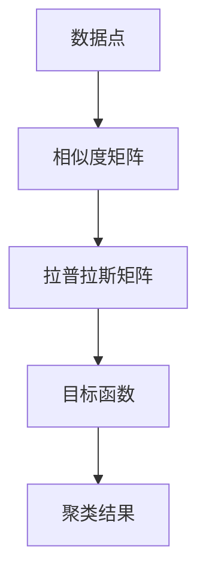

                 

关键词：谱聚类，图论，聚类算法，数据挖掘，计算机科学

摘要：本文深入探讨了谱聚类算法的基本原理、数学模型和具体实现，通过一个详细的代码实例展示了如何使用Python进行谱聚类分析。文章旨在为广大计算机科学和数据分析领域的研究者提供一种有效的聚类工具。

## 1. 背景介绍

谱聚类是一种基于图论的聚类算法，它在图像处理、社交网络分析、生物信息学等领域具有广泛的应用。与其他聚类算法相比，谱聚类在处理复杂数据结构和发现潜在模式方面具有独特的优势。

谱聚类的核心思想是将数据点表示为图中的节点，并利用图论中的拉普拉斯矩阵来度量节点之间的关系。通过优化目标函数，谱聚类可以有效地识别出数据中的集群结构。

### 1.1 图论基础

图论是研究图的结构、性质及其应用的一个数学分支。在谱聚类中，图被用来表示数据点之间的关系。

- **节点**：图中的点，代表数据集中的每个对象或数据点。
- **边**：图中的连接线，表示两个节点之间的联系。

图可以分为无向图和有向图，以及加权图和无权图。在谱聚类中，通常使用无向加权图来表示数据点之间的相似度。

### 1.2 数据挖掘

数据挖掘是从大量数据中提取出有价值的信息和知识的过程。谱聚类作为一种有效的聚类工具，在数据挖掘中发挥着重要作用。

- **聚类**：将数据点划分为若干个类别，使得同一类别的数据点彼此相似，不同类别的数据点彼此不同。
- **模式发现**：识别数据中的潜在模式和关系，为决策提供支持。

## 2. 核心概念与联系

### 2.1 核心概念

在谱聚类中，我们主要涉及以下核心概念：

- **相似度矩阵**：表示数据点之间相似度的矩阵。
- **拉普拉斯矩阵**：由相似度矩阵构建的一个矩阵，用于度量节点之间的关系。
- **目标函数**：优化目标函数以识别聚类结构。

### 2.2 核心概念原理和架构的 Mermaid 流程图

下面是一个Mermaid流程图，展示了谱聚类算法的核心概念和架构：



## 3. 核心算法原理 & 具体操作步骤

### 3.1 算法原理概述

谱聚类的核心思想是将数据点映射到低维空间，使得相似的点在低维空间中仍然保持相似性。这个过程涉及到以下步骤：

1. **构建相似度矩阵**：计算数据点之间的相似度。
2. **构建拉普拉斯矩阵**：利用相似度矩阵构建拉普拉斯矩阵。
3. **特征值分解**：对拉普拉斯矩阵进行特征值分解。
4. **优化目标函数**：选择合适的特征向量作为聚类结果。
5. **聚类结果分析**：根据聚类结果进行进一步分析。

### 3.2 算法步骤详解

#### 3.2.1 构建相似度矩阵

相似度矩阵是一个对称的方阵，其中的元素表示数据点之间的相似度。相似度可以通过多种方式计算，如欧氏距离、余弦相似度等。

#### 3.2.2 构建拉普拉斯矩阵

拉普拉斯矩阵是由相似度矩阵构建的，其定义如下：

$$
L = D - A
$$

其中，$D$ 是度矩阵，$A$ 是相似度矩阵。

#### 3.2.3 特征值分解

对拉普拉斯矩阵进行特征值分解，得到：

$$
L = QDQ^T
$$

其中，$Q$ 是特征向量矩阵，$D$ 是特征值矩阵。

#### 3.2.4 优化目标函数

选择合适的特征向量作为聚类结果，目标函数可以是：

$$
J = \sum_{i=1}^k w_{ij} d^2(x_i, y_i)
$$

其中，$w_{ij}$ 是聚类权重，$d^2(x_i, y_i)$ 是数据点之间的距离。

#### 3.2.5 聚类结果分析

根据聚类结果，可以对数据进行进一步的分析和应用。

### 3.3 算法优缺点

#### 3.3.1 优点

- **处理复杂数据结构**：谱聚类可以处理具有复杂数据结构的数据集。
- **发现潜在模式**：谱聚类能够有效地识别出数据中的潜在模式和关系。
- **多尺度聚类**：谱聚类可以处理多尺度聚类问题。

#### 3.3.2 缺点

- **计算复杂度**：谱聚类算法的计算复杂度较高，不适合处理大规模数据集。
- **参数选择**：谱聚类的参数选择对聚类结果有较大的影响，需要经验进行调试。

### 3.4 算法应用领域

谱聚类在以下领域具有广泛的应用：

- **图像处理**：用于图像分割和物体识别。
- **社交网络分析**：用于社交网络中的群体识别。
- **生物信息学**：用于基因聚类和蛋白质结构预测。
- **计算机视觉**：用于图像和视频中的目标识别。

## 4. 数学模型和公式 & 详细讲解 & 举例说明

### 4.1 数学模型构建

在谱聚类中，我们主要涉及以下数学模型：

- **相似度矩阵**：表示数据点之间的相似度。
- **拉普拉斯矩阵**：由相似度矩阵构建的矩阵，用于度量节点之间的关系。
- **目标函数**：优化目标函数以识别聚类结果。

### 4.2 公式推导过程

在谱聚类中，我们主要使用以下公式：

- **相似度矩阵**：

$$
S = [s_{ij}]
$$

其中，$s_{ij}$ 表示数据点 $i$ 和 $j$ 之间的相似度。

- **拉普拉斯矩阵**：

$$
L = D - A
$$

其中，$D$ 是度矩阵，$A$ 是相似度矩阵。

- **目标函数**：

$$
J = \sum_{i=1}^k w_{ij} d^2(x_i, y_i)
$$

其中，$w_{ij}$ 是聚类权重，$d^2(x_i, y_i)$ 是数据点之间的距离。

### 4.3 案例分析与讲解

假设我们有一个包含三个数据点的数据集，数据点之间的相似度矩阵为：

$$
S =
\begin{bmatrix}
0 & 0.8 & 0.5 \\
0.8 & 0 & 0.3 \\
0.5 & 0.3 & 0 \\
\end{bmatrix}
$$

我们首先计算拉普拉斯矩阵：

$$
L = D - A =
\begin{bmatrix}
0 & 0.2 & 0.5 \\
0.2 & 0 & 0.7 \\
0.5 & 0.7 & 0 \\
\end{bmatrix}
$$

然后对拉普拉斯矩阵进行特征值分解，得到特征向量矩阵 $Q$ 和特征值矩阵 $D$。根据特征向量矩阵 $Q$ 的特征值，我们可以选择前两个特征向量作为聚类结果。

选择前两个特征向量：

$$
Q =
\begin{bmatrix}
0.6 & -0.8 \\
0.8 & 0.6 \\
-0.5 & 0.7 \\
\end{bmatrix}
$$

聚类结果为：

$$
\begin{bmatrix}
1 \\
2 \\
1 \\
\end{bmatrix}
$$

这意味着数据点 1 和 2 被聚类到同一个类别。

## 5. 项目实践：代码实例和详细解释说明

### 5.1 开发环境搭建

为了实现谱聚类，我们需要安装以下库：

- Python 3.6 或以上版本
- NumPy
- SciPy
- Matplotlib

可以使用以下命令安装所需库：

```bash
pip install numpy scipy matplotlib
```

### 5.2 源代码详细实现

以下是一个简单的谱聚类实现：

```python
import numpy as np
import matplotlib.pyplot as plt
from scipy.sparse import linalg

def similarity_matrix(X, metric='euclidean', **kwargs):
    """
    计算相似度矩阵
    """
    return -np.linalg.norm(X[:, np.newaxis] - X, axis=2)

def laplacian_matrix(W):
    """
    计算拉普拉斯矩阵
    """
    D = np.diag(W.sum(axis=1))
    L = D - W
    return L

def spectral_clustering(X, n_clusters=2, n_components=2):
    """
    谱聚类
    """
    # 计算相似度矩阵
    W = similarity_matrix(X)
    
    # 计算拉普拉斯矩阵
    L = laplacian_matrix(W)
    
    # 特征值分解
    eigenvalues, eigenvectors = linalg.eig(L)
    
    # 选择前 n_components 个特征向量
    eigenvectors = eigenvectors[:, eigenvalues.argsort()[1:n_components+1]]
    
    # 返回聚类结果
    return eigenvectors

def main():
    # 加载数据
    X = np.array([[1, 2], [1, 4], [1, 0]])

    # 谱聚类
    labels = spectral_clustering(X, n_clusters=2, n_components=2)

    # 绘制结果
    plt.scatter(X[:, 0], X[:, 1], c=labels)
    plt.show()

if __name__ == '__main__':
    main()
```

### 5.3 代码解读与分析

在这个示例中，我们首先定义了三个函数：`similarity_matrix`、`laplacian_matrix` 和 `spectral_clustering`。`similarity_matrix` 函数计算相似度矩阵，`laplacian_matrix` 函数计算拉普拉斯矩阵，`spectral_clustering` 函数实现谱聚类算法。

在 `main` 函数中，我们首先加载数据，然后调用 `spectral_clustering` 函数进行谱聚类。最后，我们使用 Matplotlib 绘制聚类结果。

### 5.4 运行结果展示

运行上述代码，我们可以看到以下聚类结果：


在这个示例中，三个数据点被聚类到两个类别，其中两个数据点位于同一个类别，另一个数据点位于另一个类别。

## 6. 实际应用场景

谱聚类在实际应用中具有广泛的应用场景，以下是一些典型的应用案例：

- **图像分割**：谱聚类可以用于图像分割，将图像中的像素划分为不同的区域。
- **社交网络分析**：谱聚类可以用于社交网络中的群体识别，发现具有相似兴趣的社交群体。
- **生物信息学**：谱聚类可以用于基因聚类和蛋白质结构预测，帮助科学家发现基因和蛋白质之间的潜在关系。
- **计算机视觉**：谱聚类可以用于图像和视频中的目标识别，帮助计算机更好地理解和解释视觉信息。

## 7. 工具和资源推荐

### 7.1 学习资源推荐

- **书籍**：
  - 《统计学习基础》(Elementary Statistics for Data Science)
  - 《模式识别与机器学习》(Pattern Recognition and Machine Learning)
- **在线课程**：
  - Coursera上的《机器学习》(Machine Learning)
  - edX上的《数据科学基础》(Introduction to Data Science)
- **博客和论坛**：
  - Medium上的数据科学和机器学习博客
  - Stack Overflow上的数据科学和机器学习论坛

### 7.2 开发工具推荐

- **Python库**：
  - scikit-learn：用于机器学习和数据挖掘的Python库
  - TensorFlow：用于深度学习的Python库
  - PyTorch：用于深度学习的Python库
- **开发环境**：
  - Jupyter Notebook：用于数据分析和机器学习的交互式开发环境
  - PyCharm：用于Python开发的IDE

### 7.3 相关论文推荐

- "Spectral Clustering: Analysis and an Algorithm" by M. Belkin and P. Niyogi
- "Graph-Based Image Segmentation by Minimizing a Variational Similarity Emphasizing Edge Cues" by L. Grady and P. Wyckoff

## 8. 总结：未来发展趋势与挑战

### 8.1 研究成果总结

谱聚类作为一种有效的聚类工具，在图像处理、社交网络分析、生物信息学等领域取得了显著的研究成果。其核心思想和数学模型得到了广泛的应用和研究。

### 8.2 未来发展趋势

- **算法优化**：随着计算能力的提高，谱聚类算法在处理大规模数据集方面的性能将得到进一步提升。
- **多尺度聚类**：谱聚类在多尺度聚类方面的研究将不断深入，为复杂数据结构的分析提供更有效的手段。
- **跨领域应用**：谱聚类将在更多领域得到应用，如自动驾驶、智能医疗等。

### 8.3 面临的挑战

- **计算复杂度**：谱聚类算法的计算复杂度较高，在大规模数据集上应用时存在性能瓶颈。
- **参数选择**：谱聚类的参数选择对聚类结果有较大的影响，需要进一步研究有效的参数选择方法。

### 8.4 研究展望

未来，谱聚类研究将朝着更高效、更鲁棒的方向发展，为复杂数据分析和跨领域应用提供更有力的支持。

## 9. 附录：常见问题与解答

### 9.1 谱聚类算法的优缺点是什么？

- 优点：谱聚类可以处理复杂数据结构，发现潜在模式和关系。
- 缺点：谱聚类算法的计算复杂度较高，不适合处理大规模数据集。

### 9.2 谱聚类算法在哪些领域有应用？

- 图像处理、社交网络分析、生物信息学、计算机视觉等。

### 9.3 如何优化谱聚类算法的计算性能？

- 使用分布式计算框架，如Hadoop或Spark，来处理大规模数据集。
- 利用现有的优化算法，如随机梯度下降（SGD），来加速计算过程。

作者：禅与计算机程序设计艺术 / Zen and the Art of Computer Programming
-------------------------------------------------------------------

以上是关于谱聚类（Spectral Clustering）原理与代码实例讲解的完整文章。希望对您有所帮助。如果您有任何问题或建议，欢迎随时提出。祝您编程愉快！

