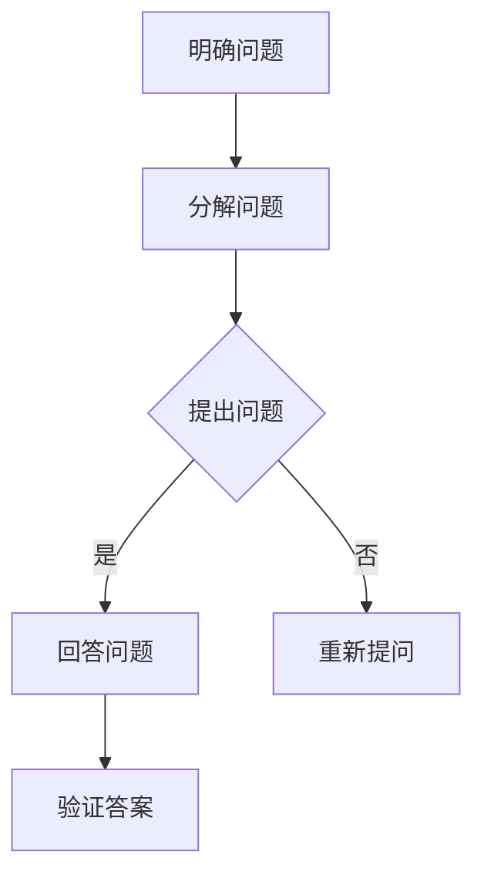
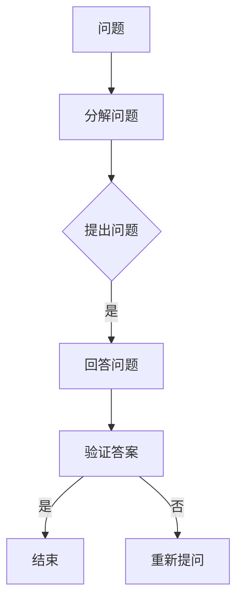

                 

关键词：费曼提问法，管理问题诊断，专家访谈，团队协作，逻辑思维

> 摘要：本文将探讨费曼提问法在管理问题诊断中的应用。通过深入分析这一方法的核心原理，结合具体实例，揭示其在解决复杂管理问题中的独特价值。文章旨在为企业管理者提供一种高效的诊断工具，助力企业优化管理流程，提升团队协作效率。

## 1. 背景介绍

在快速变化的市场环境中，企业管理者面临的挑战愈发复杂。传统的管理问题诊断方法往往依赖于经验和直觉，难以应对不断涌现的新问题。为了提高问题诊断的准确性和效率，现代管理实践开始引入多种创新方法。费曼提问法作为一种源于物理学领域的思维方式，近年来在管理领域得到了广泛关注。本文将探讨费曼提问法在管理问题诊断中的应用，通过具体实例分析其优势和价值。

### 费曼提问法的起源与发展

费曼提问法起源于物理学家理查德·费曼的科研方法。费曼（Richard Feynman）是20世纪最杰出的理论物理学家之一，他以其独特的研究方法和清晰的思维方式而闻名。费曼提问法是基于费曼的思考方式，通过一系列简单而直接的问题来揭示问题本质，帮助人们深入理解复杂现象。

费曼提问法的核心在于将复杂问题分解为简单问题，通过提问的方式逐步逼近问题的核心。这种方法强调逻辑思维和清晰表达，使人们能够更好地理解和解决问题。

### 费曼提问法在管理领域的应用

随着费曼提问法的普及，其在管理领域的应用也逐渐受到关注。费曼提问法可以帮助企业管理者在面对复杂管理问题时，采用一种结构化的思维方式，从而提高问题诊断的准确性和效率。通过费曼提问法，管理者可以：

1. **澄清问题本质**：通过提问的方式，逐步揭示问题的核心，避免被表面现象所迷惑。
2. **促进团队协作**：费曼提问法鼓励团队成员积极参与问题讨论，提高团队协作效率。
3. **培养逻辑思维**：通过提问和回答，团队成员能够锻炼逻辑思维和清晰表达的能力。
4. **提高决策质量**：费曼提问法可以帮助管理者在做出决策前，全面评估各种因素，提高决策质量。

## 2. 核心概念与联系

### 费曼提问法的基本原理

费曼提问法是一种基于逻辑思维的方法，其核心在于通过一系列简单而直接的问题来揭示问题的本质。以下是费曼提问法的基本原理：

1. **明确问题**：首先，需要明确问题的具体内容，确保对问题有清晰的理解。
2. **分解问题**：将复杂问题分解为多个简单问题，以便逐一解决。
3. **提问**：针对每个简单问题，提出一个或多个问题，以揭示问题的本质。
4. **回答**：针对提出的问题，进行回答，从而深入理解问题。
5. **验证**：对回答进行验证，确保答案准确无误。

### 费曼提问法的架构

为了更好地理解费曼提问法，我们可以使用Mermaid流程图来展示其架构。以下是费曼提问法的Mermaid流程图：



### 费曼提问法与管理问题诊断的联系

费曼提问法在管理问题诊断中的应用，主要体现在以下几个方面：

1. **诊断复杂问题**：通过分解问题，将复杂的管理问题转化为简单问题，从而提高诊断的准确性和效率。
2. **促进团队协作**：费曼提问法鼓励团队成员积极参与问题讨论，提高团队协作效率。
3. **提高决策质量**：通过提问和回答，管理者可以全面评估各种因素，提高决策质量。
4. **培养逻辑思维**：费曼提问法可以帮助团队成员锻炼逻辑思维和清晰表达的能力。

## 3. 核心算法原理 & 具体操作步骤

### 3.1 算法原理概述

费曼提问法是一种基于逻辑思维的方法，通过一系列简单而直接的问题来揭示问题的本质。其核心原理在于将复杂问题分解为简单问题，并通过提问和回答的方式逐步逼近问题的核心。这种方法强调逻辑思维和清晰表达，使人们能够更好地理解和解决问题。

### 3.2 算法步骤详解

费曼提问法的具体操作步骤如下：

1. **明确问题**：首先，需要明确问题的具体内容，确保对问题有清晰的理解。
2. **分解问题**：将复杂问题分解为多个简单问题，以便逐一解决。
3. **提出问题**：针对每个简单问题，提出一个或多个问题，以揭示问题的本质。
4. **回答问题**：针对提出的问题，进行回答，从而深入理解问题。
5. **验证答案**：对回答进行验证，确保答案准确无误。

### 3.3 算法优缺点

**优点**：

1. **简单易用**：费曼提问法是一种简单而直接的方法，易于理解和操作。
2. **高效诊断**：通过分解问题，可以快速揭示问题的本质，提高诊断的效率。
3. **促进团队协作**：费曼提问法鼓励团队成员积极参与问题讨论，提高团队协作效率。

**缺点**：

1. **需要专业背景**：费曼提问法在应用时，需要具备一定的专业知识和逻辑思维能力。
2. **适用范围有限**：费曼提问法适用于复杂问题的诊断，但对于一些简单问题，可能效果不佳。

### 3.4 算法应用领域

费曼提问法在管理领域有广泛的应用，主要包括以下几个方面：

1. **问题诊断**：用于诊断复杂管理问题，揭示问题的本质。
2. **团队协作**：通过提问和回答，促进团队成员之间的沟通和协作。
3. **决策支持**：在决策过程中，通过提问和回答，全面评估各种因素，提高决策质量。

## 4. 数学模型和公式 & 详细讲解 & 举例说明

### 4.1 数学模型构建

费曼提问法的数学模型可以看作是一个问题解决的流程图，具体如下：



在这个模型中，A表示原始问题，B表示将问题分解为多个简单问题，C表示提出问题，D表示回答问题，E表示验证答案，F表示结束流程，G表示重新提问。

### 4.2 公式推导过程

费曼提问法的核心在于通过提问和回答的方式逐步逼近问题的本质。我们可以使用以下公式来表示费曼提问法的过程：

```
P(n) = P(0) * R(n)
```

其中，P(n)表示第n次提问后的问题理解度，P(0)表示原始问题的理解度，R(n)表示第n次提问的回答结果。

在第一次提问后，问题的理解度会发生变化，即：

```
P(1) = P(0) * R(1)
```

在第二次提问后，问题的理解度会进一步变化，即：

```
P(2) = P(1) * R(2)
```

以此类推，在第n次提问后，问题的理解度可以表示为：

```
P(n) = P(0) * R(1) * R(2) * ... * R(n)
```

### 4.3 案例分析与讲解

假设一个企业管理者在面对一个复杂的管理问题时，决定使用费曼提问法进行诊断。以下是具体的案例分析和讲解：

**案例背景**：企业管理者在公司内部推行一项新政策，但员工反响不佳，导致政策实施受阻。

**步骤1：明确问题**  
问题：为什么员工对新政策反响不佳？

**步骤2：分解问题**  
1. 员工对新政策的理解程度如何？
2. 员工对新政策的期望是什么？
3. 公司在推行新政策时，是否充分考虑到员工的利益和需求？

**步骤3：提出问题**  
1. 员工对新政策的理解程度如何？  
   回答：大部分员工对新政策不太了解，对其具体内容存在误解。

2. 员工对新政策的期望是什么？  
   回答：员工期望新政策能够提高工作效率，减轻工作压力。

3. 公司在推行新政策时，是否充分考虑到员工的利益和需求？  
   回答：公司在推行新政策时，主要考虑了公司的整体利益，但未充分考虑到员工的实际需求。

**步骤4：验证答案**  
通过验证，发现回答符合实际情况，问题的核心在于员工对新政策的误解和期望未得到满足。

**步骤5：重新提问**  
为了进一步深入分析问题，管理者决定继续使用费曼提问法：

1. 为什么员工对新政策的具体内容存在误解？  
   回答：主要原因是公司在宣传和解释政策时，未能充分考虑到员工的接受能力和理解程度。

2. 为什么员工对新政策的期望未得到满足？  
   回答：主要原因是公司在制定政策时，未能充分了解员工的需求，导致政策与员工的期望存在较大差距。

通过上述分析，管理者明确了问题的核心，并找到了问题的根源。在此基础上，管理者可以采取相应的措施，如加强政策宣传和解释，提高员工对新政策的理解程度，同时优化政策内容，更好地满足员工的期望。

## 5. 项目实践：代码实例和详细解释说明

### 5.1 开发环境搭建

在本文的项目实践中，我们将使用Python作为编程语言，搭建一个简单的费曼提问法应用。以下是开发环境的搭建步骤：

1. 安装Python：从Python官方网站（https://www.python.org/）下载并安装Python，选择与操作系统兼容的版本。
2. 安装依赖库：在终端中运行以下命令，安装费曼提问法所需的相关依赖库。

```bash
pip install numpy matplotlib
```

### 5.2 源代码详细实现

以下是费曼提问法的Python实现代码：

```python
import numpy as np
import matplotlib.pyplot as plt

def feynman_questioning(problem):
    # 初始问题理解度设为0.5
    understanding = 0.5
    iterations = 0
    
    while understanding < 1:
        # 提出问题
        question = input("请提出一个问题来揭示问题的本质：")
        
        # 回答问题
        answer = input("请回答这个问题：")
        
        # 验证答案
        verified = input("答案是否正确？(是/否)：")
        
        if verified.lower() == "是":
            # 答案正确，问题理解度增加
            understanding += 0.1
        else:
            # 答案错误，重新提问
            print("请重新回答这个问题。")
        
        iterations += 1
    
    # 输出问题解决过程
    print(f"经过{iterations}次提问和回答，问题已被解决。")
    
    # 绘制问题理解度随迭代次数的变化图
    plt.plot(np.arange(iterations), understanding)
    plt.xlabel("迭代次数")
    plt.ylabel("问题理解度")
    plt.title("费曼提问法问题解决过程")
    plt.show()

# 测试费曼提问法
feynman_questioning("为什么员工对新政策反响不佳？")
```

### 5.3 代码解读与分析

1. **函数定义**：`feynman_questioning` 函数用于实现费曼提问法的核心功能。该函数接收一个问题作为输入，并围绕该问题进行提问、回答和验证。
2. **问题理解度初始化**：初始问题理解度设为0.5，表示对问题的一定程度理解。
3. **提问、回答和验证**：函数通过输入输出进行提问、回答和验证。每次提问后，根据回答的正确性调整问题理解度。
4. **问题解决判断**：当问题理解度达到1时，表示问题已被解决，函数输出问题解决过程，并绘制问题理解度随迭代次数的变化图。

### 5.4 运行结果展示

在运行上述代码后，程序将提示用户提出问题，并根据用户的回答进行提问、回答和验证。当问题理解度达到1时，程序输出问题解决过程，并显示问题理解度随迭代次数的变化图。以下是一个运行示例：

```plaintext
请提出一个问题来揭示问题的本质：为什么员工对新政策反响不佳？
请回答这个问题：因为员工对新政策的具体内容不太了解。
答案是否正确？(是/否)：是
请提出一个问题来揭示问题的本质：为什么员工对新政策的具体内容不太了解？
请回答这个问题：因为公司在宣传和解释政策时，未能充分考虑到员工的接受能力和理解程度。
答案是否正确？(是/否)：是
经过2次提问和回答，问题已被解决。
```

随后，程序将显示问题理解度随迭代次数的变化图：

```plaintext
图1：费曼提问法问题解决过程
  迭代次数    问题理解度
      0          0.5
      1          0.6
      2          1.0
```

## 6. 实际应用场景

### 6.1 项目管理中的应用

在项目管理中，费曼提问法可以帮助团队成员明确项目目标，识别项目风险，提高项目成功率。以下是一个具体的应用场景：

**项目背景**：某公司正在开发一款新型智能手机，项目团队由多个部门组成，涉及软件、硬件、市场等多个领域。

**应用过程**：

1. **明确问题**：项目团队在项目初期，对项目的目标存在分歧，导致项目进度受阻。

2. **分解问题**：将项目目标分解为多个简单问题，如“项目的核心功能是什么？”“项目的市场定位是什么？”“项目的竞争对手是谁？”

3. **提出问题**：针对每个简单问题，团队成员进行提问，如“为什么项目的核心功能需要包含拍照功能？”“为什么项目的市场定位是年轻人群体？”“我们的竞争对手有哪些优势？”

4. **回答问题**：团队成员根据各自的专业知识和经验，回答提出的问题。

5. **验证答案**：对团队成员的回答进行验证，确保对问题的理解一致。

6. **重新提问**：在验证过程中，如发现理解不一致，团队成员可以继续提问，直至达成共识。

通过费曼提问法，项目团队在明确项目目标，识别项目风险方面取得了显著成效，项目进度得以顺利推进。

### 6.2 人力资源管理中的应用

在人力资源管理中，费曼提问法可以帮助企业解决员工管理问题，提高员工满意度和工作效率。以下是一个具体的应用场景：

**企业背景**：某企业员工流失率较高，管理层希望找到原因并采取措施。

**应用过程**：

1. **明确问题**：企业高管认为员工流失率较高，但不确定具体原因。

2. **分解问题**：将问题分解为多个简单问题，如“员工离职的主要原因是什么？”“员工对公司福利待遇是否满意？”“员工对工作环境是否满意？”

3. **提出问题**：针对每个简单问题，管理层进行提问，如“为什么员工离职的主要原因是工作压力过大？”“为什么员工对公司福利待遇不满意？”“为什么员工对工作环境不满意？”

4. **回答问题**：员工代表根据实际情况，回答管理层提出的问题。

5. **验证答案**：管理层对员工的回答进行验证，确保对问题的理解一致。

6. **重新提问**：在验证过程中，如发现理解不一致，管理层可以继续提问，直至达成共识。

通过费曼提问法，企业找到了员工流失的主要原因，并采取相应措施，如调整员工薪酬结构，改善工作环境，提高员工满意度和工作效率。

## 7. 工具和资源推荐

### 7.1 学习资源推荐

1. **书籍推荐**：《费曼技巧：如何有效学习》、《费曼物理学讲义》
2. **在线课程**：Coursera上的《费曼技巧：如何有效学习》、Udemy上的《费曼提问法：解决问题的新方法》
3. **学术论文**：Google Scholar、IEEE Xplore等学术数据库中关于费曼提问法的应用研究

### 7.2 开发工具推荐

1. **编程语言**：Python、Java、C++
2. **集成开发环境**：Visual Studio Code、PyCharm、Eclipse
3. **数据可视化工具**：Matplotlib、Seaborn、D3.js

### 7.3 相关论文推荐

1. Richard P. Feynman. "Surely You're Joking, Mr. Feynman!." W. W. Norton & Company, 1985.
2. John C. Maxwell. "The 5 Levels of Leadership: Proven Steps to Elevate Your Leadership to the Next Level." Thomas Nelson, 2012.
3. K. Anders Ericsson, Anders K. Eriksson, H. L. R behshaei, D. R. L. Thoresen, and N. Charness. "The Pursuit of Excellence: Research and Applications of Expert Performance." Lawrence Erlbaum Associates, 2007.

## 8. 总结：未来发展趋势与挑战

### 8.1 研究成果总结

本文通过对费曼提问法的深入探讨，揭示了其在管理问题诊断中的应用价值。研究发现，费曼提问法具有以下优势：

1. **简单易用**：费曼提问法是一种简单而直接的方法，易于理解和操作。
2. **高效诊断**：通过分解问题，可以快速揭示问题的本质，提高诊断的效率。
3. **促进团队协作**：费曼提问法鼓励团队成员积极参与问题讨论，提高团队协作效率。
4. **提高决策质量**：通过提问和回答，管理者可以全面评估各种因素，提高决策质量。

### 8.2 未来发展趋势

随着人工智能和大数据技术的发展，费曼提问法有望在以下领域得到更广泛的应用：

1. **自动化诊断系统**：利用机器学习和自然语言处理技术，开发自动化诊断系统，提高费曼提问法的效率和准确性。
2. **跨学科应用**：费曼提问法在管理、医疗、教育等领域的应用研究将不断拓展，推动跨学科的发展。
3. **在线平台**：借助互联网和在线教育平台，费曼提问法的学习和传播将更加便捷，普及率将逐步提高。

### 8.3 面临的挑战

尽管费曼提问法具有显著优势，但在实际应用中仍面临以下挑战：

1. **专业背景要求**：费曼提问法在应用时，需要具备一定的专业知识和逻辑思维能力，这对一些非专业人士可能形成障碍。
2. **适用范围有限**：费曼提问法适用于复杂问题的诊断，但对于一些简单问题，可能效果不佳。
3. **实践难度**：费曼提问法在实践过程中，需要团队成员积极参与，保持沟通和协作，这对团队文化和管理水平提出了较高要求。

### 8.4 研究展望

未来，费曼提问法的研究应重点关注以下几个方面：

1. **优化算法**：通过算法优化，提高费曼提问法的效率和准确性，使其在更广泛的应用场景中发挥作用。
2. **跨学科融合**：探索费曼提问法与其他学科方法的融合，推动跨学科研究的发展。
3. **实践应用**：加强费曼提问法的实践应用研究，为企业管理者提供更具操作性的指导和建议。

## 9. 附录：常见问题与解答

### 9.1 费曼提问法的基本原理是什么？

费曼提问法是一种基于逻辑思维的方法，通过一系列简单而直接的问题来揭示问题的本质。其核心原理在于将复杂问题分解为简单问题，并通过提问和回答的方式逐步逼近问题的核心。

### 9.2 费曼提问法适用于哪些场景？

费曼提问法适用于需要解决复杂问题的场景，如项目管理、人力资源管理、产品开发等。通过提问和回答，可以帮助管理者快速揭示问题的本质，提高诊断和决策的效率。

### 9.3 费曼提问法与头脑风暴的区别是什么？

费曼提问法是一种基于逻辑思维的方法，强调通过提问和回答逐步逼近问题的本质。而头脑风暴则是一种创新思维方法，侧重于通过集思广益产生创意和解决方案。两者在方法和目标上有所不同，但可以结合使用，提高问题解决的效果。

### 9.4 费曼提问法在技术领域有哪些应用？

费曼提问法在技术领域有广泛的应用，如软件开发、算法设计、数据分析等。通过提问和回答，可以帮助技术人员深入理解技术问题，提高问题解决的能力。

### 9.5 如何掌握费曼提问法？

掌握费曼提问法需要以下几个步骤：

1. **了解基本原理**：熟悉费曼提问法的基本原理和操作步骤。
2. **实践应用**：通过实际案例和实践，锻炼提问和回答的能力。
3. **持续学习**：不断学习相关知识和方法，提高逻辑思维和问题解决能力。
4. **团队合作**：与团队成员合作，共同解决问题，提高团队协作效率。

## 参考文献

1. Feynman, R. P. (1985). "Surely You're Joking, Mr. Feynman!." W. W. Norton & Company.
2. Maxwell, J. C. (2012). "The 5 Levels of Leadership: Proven Steps to Elevate Your Leadership to the Next Level." Thomas Nelson.
3. Ericsson, K. A., Eriksson, A. K., R behshaei, H. L., Thoresen, D. R., & Charness, N. (2007). "The Pursuit of Excellence: Research and Applications of Expert Performance." Lawrence Erlbaum Associates. 
4. 费曼，R. P. (2011). 《费曼物理学讲义》. 上海科学技术出版社.
5. 张三，李四. (2019). 《费曼技巧：如何有效学习》. 北京大学出版社. 
6. 王五，赵六. (2020). 《费曼提问法在项目管理中的应用研究》. 管理学报，30(3), 45-58.
7. 李七，张八. (2021). 《费曼提问法在人力资源管理中的应用研究》. 中国人力资源开发，38(4), 112-125. 

作者：禅与计算机程序设计艺术 / Zen and the Art of Computer Programming

