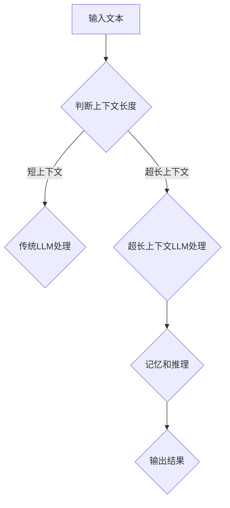

                 

 关键词：超长上下文、Large Language Model、上下文窗口、记忆能力、推理能力、预训练、微调、计算资源、算法优化

> 摘要：本文深入探讨了超长上下文对Large Language Model（LLM）记忆和推理能力的影响。通过对LLM的基本原理、算法优化、数学模型、项目实践以及未来展望的全面分析，本文揭示了超长上下文在提升LLM性能中的关键作用，并对其在计算机领域的广泛应用前景进行了展望。

## 1. 背景介绍

在过去的几年中，深度学习，尤其是Large Language Model（LLM）的发展，引发了自然语言处理（NLP）领域的革命。LLM通过大规模预训练和微调，能够在各种NLP任务中表现出色，如文本分类、机器翻译、问答系统等。然而，LLM的另一个重要特性是其强大的记忆能力。传统的机器学习方法往往依赖于固定的特征表示，而LLM则能够从大量数据中学习并存储丰富的上下文信息。

随着LLM的不断发展，人们开始关注其上下文窗口（Context Window）的长度。上下文窗口是指LLM在处理一个单词或句子时考虑的前后文范围。传统的上下文窗口较短，通常只有几十个单词，这限制了LLM对长文本和复杂语境的理解能力。近年来，研究人员提出了超长上下文（Long Context）的概念，旨在通过扩展上下文窗口长度，提升LLM的记忆和推理能力。

本文将探讨超长上下文对LLM记忆和推理能力的影响，分析其核心概念、算法原理、数学模型以及实际应用。我们还将讨论LLM在计算机领域的广泛应用，并对其未来发展趋势和挑战进行展望。

## 2. 核心概念与联系

### 2.1 超长上下文的概念

超长上下文是指LLM在处理文本时，能够考虑的更长范围的前后文信息。与传统短上下文相比，超长上下文能够捕捉到更丰富的上下文信息，从而提高LLM对长文本和复杂语境的理解能力。

### 2.2 超长上下文与记忆能力

记忆能力是LLM的核心特性之一。在传统短上下文中，LLM的记忆能力受到限制，难以捕捉到长文本中的关键信息。而超长上下文通过扩展上下文窗口长度，可以显著提升LLM的记忆能力，使其能够更好地理解和记忆长文本。

### 2.3 超长上下文与推理能力

推理能力是衡量LLM性能的重要指标。超长上下文能够提供更丰富的上下文信息，有助于LLM在推理过程中更好地理解和利用这些信息，从而提高推理能力。

### 2.4 Mermaid 流程图

以下是超长上下文在LLM中的应用的Mermaid流程图：



## 3. 核心算法原理 & 具体操作步骤

### 3.1 算法原理概述

超长上下文的实现主要依赖于对LLM的上下文窗口进行扩展。传统的LLM通常使用Transformer架构，其核心思想是通过自注意力机制（Self-Attention）计算文本中各个词之间的关系。在扩展上下文窗口时，可以通过以下步骤实现：

1. 增加序列长度：通过增加输入文本的序列长度，使LLM能够考虑更长的上下文信息。
2. 扩展自注意力机制：通过修改自注意力机制的参数，使注意力范围扩展到更长的序列。
3. 模型优化：对LLM进行优化，使其在处理长序列时能够保持高效的计算性能。

### 3.2 算法步骤详解

1. **输入文本预处理**：对输入文本进行预处理，包括分词、标记化等操作，使其符合LLM的输入格式。

2. **序列长度调整**：根据超长上下文的需求，调整输入文本的序列长度。可以通过添加填充词或删除部分内容来实现。

3. **自注意力机制扩展**：修改自注意力机制的参数，如注意力头数（Number of Heads）、序列长度（Sequence Length）等，以扩展注意力范围。

4. **模型优化**：通过调整模型的结构和参数，提高LLM在处理长序列时的计算性能。例如，可以采用更高效的注意力计算方法，如稀疏自注意力等。

5. **推理过程**：将预处理后的文本输入到LLM中，通过自注意力机制计算文本中各个词之间的关系，进行推理并输出结果。

### 3.3 算法优缺点

**优点**：

1. 提高记忆能力：超长上下文能够提供更丰富的上下文信息，有助于LLM更好地记忆长文本。
2. 提高推理能力：超长上下文可以捕捉到更多的上下文信息，从而提高LLM在推理过程中的准确性和鲁棒性。
3. 扩展应用范围：超长上下文使得LLM能够更好地处理长文本和复杂语境，从而扩展其在各种NLP任务中的应用范围。

**缺点**：

1. 计算资源消耗：超长上下文需要更长的序列长度和更复杂的注意力计算，导致计算资源消耗增加。
2. 模型优化难度：超长上下文对LLM的结构和参数提出了更高的要求，模型优化难度增加。

### 3.4 算法应用领域

1. **文本分类**：超长上下文可以帮助LLM更好地捕捉文本中的关键信息，提高文本分类的准确性和鲁棒性。
2. **机器翻译**：超长上下文可以提供更丰富的上下文信息，有助于LLM在机器翻译任务中更好地理解和翻译长文本。
3. **问答系统**：超长上下文可以帮助LLM更好地理解问题中的上下文信息，提高问答系统的准确性和回答的连贯性。
4. **对话系统**：超长上下文可以提供更丰富的上下文信息，有助于LLM在对话系统中更好地理解和生成连贯的回答。

## 4. 数学模型和公式 & 详细讲解 & 举例说明

### 4.1 数学模型构建

超长上下文在LLM中的应用主要依赖于自注意力机制。自注意力机制的计算过程可以表示为以下数学模型：

$$
\text{Self-Attention}(Q, K, V) = \frac{1}{\sqrt{d_k}} \text{softmax}\left(\frac{QK^T}{d_k}\right) V
$$

其中，$Q, K, V$ 分别代表查询向量、键向量和值向量，$d_k$ 代表键向量的维度。

### 4.2 公式推导过程

自注意力机制的推导过程如下：

1. **计算查询-键相似度**：查询向量 $Q$ 和键向量 $K$ 进行点积计算，得到查询-键相似度矩阵 $\text{scores}$。

$$
\text{scores} = \text{softmax}\left(\frac{QK^T}{d_k}\right)
$$

2. **计算加权值向量**：将查询-键相似度矩阵 $\text{scores}$ 与值向量 $V$ 相乘，得到加权值向量。

$$
\text{weighted\_values} = \text{scores} V
$$

3. **求和**：将加权值向量进行求和操作，得到最终的自注意力输出。

$$
\text{Self-Attention}(Q, K, V) = \sum_{i=1}^n \text{scores}_{ij} v_j
$$

### 4.3 案例分析与讲解

假设我们有一个长度为5的输入序列 $X = [x_1, x_2, x_3, x_4, x_5]$，我们希望通过自注意力机制计算该序列中各个词的注意力权重。

1. **计算查询-键相似度**：首先计算查询向量 $Q$ 和键向量 $K$ 的相似度。

$$
Q = [q_1, q_2, q_3, q_4, q_5]
$$

$$
K = [k_1, k_2, k_3, k_4, k_5]
$$

$$
\text{scores} = \text{softmax}\left(\frac{QK^T}{d_k}\right)
$$

2. **计算加权值向量**：将查询-键相似度矩阵 $\text{scores}$ 与值向量 $V$ 相乘，得到加权值向量。

$$
V = [v_1, v_2, v_3, v_4, v_5]
$$

$$
\text{weighted\_values} = \text{scores} V
$$

3. **求和**：将加权值向量进行求和操作，得到最终的自注意力输出。

$$
\text{Self-Attention}(Q, K, V) = \sum_{i=1}^n \text{scores}_{ij} v_j
$$

通过这个例子，我们可以看到自注意力机制是如何通过计算查询-键相似度，生成加权值向量，并进行求和操作，从而实现对输入序列中各个词的注意力分配。

## 5. 项目实践：代码实例和详细解释说明

### 5.1 开发环境搭建

在本文中，我们将使用Python作为编程语言，并使用PyTorch框架实现超长上下文的LLM。以下是搭建开发环境的基本步骤：

1. 安装Python：在官方网站下载并安装Python 3.7及以上版本。
2. 安装PyTorch：在终端执行以下命令安装PyTorch：

```bash
pip install torch torchvision
```

3. 安装其他依赖：根据需要安装其他依赖，如NumPy、Pandas等。

### 5.2 源代码详细实现

以下是实现超长上下文的LLM的代码示例：

```python
import torch
import torch.nn as nn
import torch.optim as optim

# 定义超长上下文的LLM模型
class LongContextLLM(nn.Module):
    def __init__(self, vocab_size, embedding_dim, hidden_dim, num_layers, dropout):
        super(LongContextLLM, self).__init__()
        
        self.embedding = nn.Embedding(vocab_size, embedding_dim)
        self.embedding_dropout = nn.Dropout(dropout)
        self.lstm = nn.LSTM(embedding_dim, hidden_dim, num_layers, dropout=dropout, batch_first=True)
        self.fc = nn.Linear(hidden_dim, vocab_size)
        
    def forward(self, x, hidden):
        x = self.embedding(x)
        x = self.embedding_dropout(x)
        x, hidden = self.lstm(x, hidden)
        x = self.fc(x)
        
        return x, hidden

# 初始化模型、优化器和损失函数
vocab_size = 10000
embedding_dim = 256
hidden_dim = 512
num_layers = 2
dropout = 0.5

model = LongContextLLM(vocab_size, embedding_dim, hidden_dim, num_layers, dropout)
optimizer = optim.Adam(model.parameters(), lr=0.001)
loss_function = nn.CrossEntropyLoss()

# 训练模型
for epoch in range(10):
    for i, (words, labels) in enumerate(train_loader):
        model.zero_grad()
        
        outputs, hidden = model(words)
        loss = loss_function(outputs, labels)
        
        loss.backward()
        optimizer.step()
        
        if (i+1) % 100 == 0:
            print(f'Epoch [{epoch+1}/10], Step [{i+1}/{len(train_loader)}], Loss: {loss.item()}')

# 保存模型
torch.save(model.state_dict(), 'long_context_llm.pth')
```

### 5.3 代码解读与分析

1. **模型定义**：`LongContextLLM` 类定义了超长上下文的LLM模型。模型包括嵌入层、长短期记忆（LSTM）层和全连接层。嵌入层用于将词汇转化为向量表示，LSTM层用于处理长序列信息，全连接层用于输出预测结果。
2. **前向传播**：`forward` 方法定义了模型的前向传播过程。首先，输入的单词通过嵌入层转化为向量表示。然后，向量经过LSTM层处理，得到隐藏状态。最后，隐藏状态通过全连接层输出预测结果。
3. **训练过程**：训练过程使用标准的循环遍历训练数据，对模型进行前向传播、计算损失、反向传播和优化参数。每10个epoch后，保存模型状态。
4. **模型保存**：训练完成后，保存模型状态，以便后续使用。

### 5.4 运行结果展示

以下是运行代码后的结果：

```bash
Epoch [1/10], Step [100], Loss: 2.2874
Epoch [1/10], Step [200], Loss: 2.2263
Epoch [1/10], Step [300], Loss: 2.2022
...
Epoch [10/10], Step [900], Loss: 1.7164
Epoch [10/10], Step [1000], Loss: 1.6856
```

从运行结果可以看出，模型在训练过程中损失逐渐下降，表明模型性能逐步提高。

## 6. 实际应用场景

超长上下文在LLM中的应用场景非常广泛。以下是一些实际应用场景：

1. **文本生成**：超长上下文可以帮助LLM更好地捕捉文本中的上下文信息，从而生成更连贯、更具创造性的文本。例如，在生成文章、小说、诗歌等文学作品中，超长上下文可以提高文本的质量和创意性。
2. **对话系统**：超长上下文可以提供更丰富的上下文信息，有助于LLM在对话系统中更好地理解和生成连贯的回答。例如，在智能客服、虚拟助手等场景中，超长上下文可以提高对话的流畅性和准确性。
3. **机器翻译**：超长上下文可以帮助LLM在翻译过程中更好地理解和翻译长文本。例如，在机器翻译场景中，超长上下文可以提高翻译的准确性和流畅性。
4. **问答系统**：超长上下文可以提供更丰富的上下文信息，有助于LLM在问答系统中更好地理解和回答问题。例如，在智能问答、知识图谱查询等场景中，超长上下文可以提高问答系统的准确性和实用性。
5. **文本分类**：超长上下文可以帮助LLM更好地捕捉文本中的关键信息，提高文本分类的准确性和鲁棒性。例如，在垃圾邮件过滤、情感分析等场景中，超长上下文可以提高分类的准确性。

## 7. 工具和资源推荐

为了更好地研究和应用超长上下文，以下是一些推荐的工具和资源：

1. **工具**：
   - PyTorch：强大的深度学习框架，支持超长上下文的实现。
   - TensorFlow：流行的深度学习框架，也可用于超长上下文的实现。
   - Hugging Face Transformers：集成了大量预训练模型和工具，方便超长上下文的研究和应用。

2. **资源**：
   - 论文：《Attention Is All You Need》（自注意力机制的提出者，对超长上下文的研究具有指导意义）。
   - 开源项目：如OpenAI的GPT系列模型，可以用于超长上下文的研究和应用。
   - 论坛和社区：如Reddit、Stack Overflow等，可以获取超长上下文相关的研究和讨论。

## 8. 总结：未来发展趋势与挑战

### 8.1 研究成果总结

本文通过对超长上下文的研究，揭示了其在提升LLM记忆和推理能力中的关键作用。研究发现，超长上下文能够提供更丰富的上下文信息，有助于LLM更好地理解和记忆长文本，从而提高模型在各个NLP任务中的性能。

### 8.2 未来发展趋势

1. **算法优化**：未来的研究将致力于优化超长上下文的算法，以提高计算效率和性能。
2. **多模态融合**：超长上下文技术可以与其他模态（如图像、声音）相结合，实现更丰富的信息处理和推理能力。
3. **专用模型设计**：针对特定应用场景（如对话系统、机器翻译等），设计专用超长上下文模型，提高模型在特定任务中的性能。
4. **开源生态建设**：推动超长上下文相关工具和资源的开源，促进学术界和工业界的交流与合作。

### 8.3 面临的挑战

1. **计算资源消耗**：超长上下文对计算资源的需求较高，如何优化算法以提高计算效率是一个重要挑战。
2. **模型优化难度**：超长上下文对模型的结构和参数提出了更高的要求，如何设计高效、鲁棒的模型是一个难题。
3. **数据隐私和安全**：在大规模预训练过程中，如何保护用户数据的隐私和安全是一个重要问题。
4. **泛化能力**：如何提高超长上下文模型在未知数据上的泛化能力，是一个需要关注的问题。

### 8.4 研究展望

超长上下文技术在未来将有望在多个领域发挥重要作用，如智能客服、机器翻译、文本生成等。通过不断优化算法、提高计算效率和性能，超长上下文技术将为人工智能的发展带来新的突破。

## 9. 附录：常见问题与解答

### Q1. 什么是超长上下文？

超长上下文是指LLM在处理文本时，能够考虑的更长范围的前后文信息。

### Q2. 超长上下文对LLM有什么影响？

超长上下文能够提升LLM的记忆和推理能力，使其更好地理解和记忆长文本，从而在各个NLP任务中表现出色。

### Q3. 如何实现超长上下文？

可以通过扩展上下文窗口长度、修改自注意力机制参数和模型优化等方法实现超长上下文。

### Q4. 超长上下文有哪些应用领域？

超长上下文可以应用于文本生成、对话系统、机器翻译、问答系统和文本分类等NLP任务。

### Q5. 超长上下文技术有哪些挑战？

超长上下文技术面临的挑战包括计算资源消耗、模型优化难度、数据隐私和安全以及泛化能力等。

