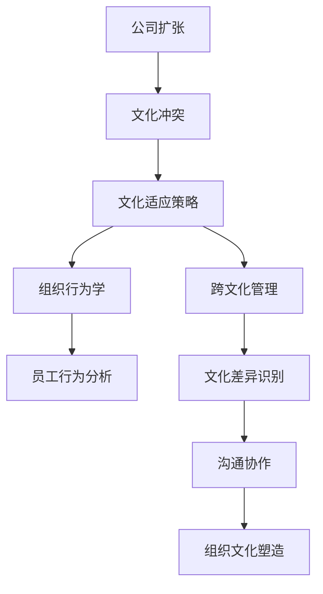

                 

关键词：跨国公司、硅谷文化、文化适应、组织行为学、国际合作

摘要：本文将探讨跨国公司在硅谷这一全球科技圣地进行文化适应的挑战与策略。通过分析硅谷的独特文化特征、跨国公司在全球扩张中的文化困境以及有效的文化适应策略，本文旨在为跨国公司在硅谷的运营提供有益的指导和启示。

## 1. 背景介绍

随着全球化进程的加速，跨国公司在全球范围内的运营愈发普遍。硅谷，作为全球科技产业的中心，吸引了无数跨国公司前来寻求机遇。然而，跨国公司在硅谷的运营并非易事，如何适应硅谷的独特文化成为了关键挑战。

### 1.1 硅谷文化的特征

硅谷文化以其创新、开放、包容和竞争的特点而闻名。这里的企业崇尚自由探索、快速迭代和风险承担。硅谷的工作环境强调个人主义、创新思维和团队合作。同时，硅谷对技术突破和商业成功的追求也体现在其企业文化的方方面面。

### 1.2 跨国公司的文化困境

跨国公司在全球扩张过程中，常常面临文化冲突和适应困难。在硅谷，这种困境尤为突出。首先，跨国公司的组织文化和价值观可能与硅谷的企业文化存在显著差异。其次，跨国公司内部的多元文化和不同国籍员工的沟通协作也带来挑战。此外，硅谷对创新和速度的高要求，也可能与跨国公司的传统运营模式产生摩擦。

## 2. 核心概念与联系

为了更好地理解跨国公司在硅谷的文化适应，我们需要从组织行为学和跨文化管理的角度来探讨相关核心概念。

### 2.1 组织行为学

组织行为学关注个体、团队和组织在组织中的行为和互动。在跨国公司硅谷文化适应的背景下，组织行为学有助于理解员工的行为动机、工作态度和组织文化之间的关系。

### 2.2 跨文化管理

跨文化管理涉及在不同文化背景下如何有效管理和协调组织内外部关系。在硅谷，跨国公司需要通过跨文化管理来应对多元文化的挑战，促进员工的融合和协作。

### 2.3 Mermaid 流程图

以下是跨国公司在硅谷文化适应的 Mermaid 流程图：



## 3. 核心算法原理 & 具体操作步骤

### 3.1 算法原理概述

跨国公司在硅谷的文化适应可以看作是一个复杂的算法问题，其核心原理包括：

- **文化识别**：了解硅谷文化的特点和跨国公司自身的文化。
- **文化分析**：分析文化差异和冲突的原因。
- **文化适应**：制定和实施适应硅谷文化的策略。

### 3.2 算法步骤详解

#### 3.2.1 文化识别

1. **调研**：收集硅谷的文化特征和跨国公司的文化资料。
2. **评估**：对比分析硅谷文化和公司文化的差异。

#### 3.2.2 文化分析

1. **文化差异识别**：识别文化差异的领域，如价值观、工作态度、沟通方式等。
2. **冲突分析**：分析文化差异导致的具体冲突。

#### 3.2.3 文化适应

1. **策略制定**：制定适应硅谷文化的具体策略。
2. **策略实施**：实施适应策略，如培训、沟通、团队建设等。
3. **反馈调整**：根据实施效果调整适应策略。

### 3.3 算法优缺点

#### 优点：

- **提高效率**：适应硅谷文化有助于跨国公司更好地融入硅谷生态，提高运营效率。
- **促进创新**：硅谷文化强调创新和快速迭代，有利于跨国公司在创新方面取得突破。
- **增强竞争力**：适应硅谷文化有助于跨国公司在硅谷市场获得竞争优势。

#### 缺点：

- **文化冲突**：适应硅谷文化可能引发文化冲突，影响团队协作。
- **成本较高**：适应硅谷文化需要投入大量资源和精力。

### 3.4 算法应用领域

- **跨国公司**：跨国公司在全球扩张过程中需要适应不同地区的文化。
- **国际合作**：国际合作项目中，不同国家和地区的文化差异需要得到妥善处理。

## 4. 数学模型和公式 & 详细讲解 & 举例说明

### 4.1 数学模型构建

为了更好地理解文化适应过程，我们可以构建一个数学模型来描述文化适应的几个关键阶段。

#### 4.1.1 模型假设

- 假设跨国公司文化为C1，硅谷文化为C2。
- 文化适应效果可以用适应度函数f(C1, C2)表示。

#### 4.1.2 模型公式

- f(C1, C2) = w1 * cultural_difference(C1, C2) + w2 * adaptability(C1, C2)

其中：

- cultural_difference(C1, C2) 表示文化差异的度量。
- adaptability(C1, C2) 表示适应能力的度量。
- w1 和 w2 是权重，用于平衡文化差异和适应能力的重要性。

### 4.2 公式推导过程

#### 4.2.1 文化差异度量

- cultural_difference(C1, C2) 可以通过以下公式计算：

$$
cultural_difference(C1, C2) = \sum_{i=1}^{n} (C1_i - C2_i)^2
$$

其中，C1_i 和 C2_i 分别表示跨国公司文化和硅谷文化在 i 方面的差异。

#### 4.2.2 适应能力度量

- adaptability(C1, C2) 可以通过以下公式计算：

$$
adaptability(C1, C2) = \frac{C1_i + C2_i}{2}
$$

其中，C1_i 和 C2_i 分别表示跨国公司文化和硅谷文化在 i 方面的平均值。

### 4.3 案例分析与讲解

#### 案例一：谷歌在中国的文化适应

- 谷歌作为一家全球领先的科技公司，在中国市场面临着文化适应的挑战。
- 谷歌通过以下措施来适应中国市场的文化：

1. **文化调研**：深入了解中国市场的文化特征。
2. **文化培训**：为员工提供中国文化培训。
3. **本地化策略**：根据中国市场的文化特点，调整产品和服务。

通过这些措施，谷歌在中国市场的文化适应效果显著，取得了良好的市场表现。

#### 案例二：微软在硅谷的文化适应

- 微软是一家全球知名的跨国公司，在硅谷市场面临着与本地文化的适应挑战。
- 微软通过以下措施来适应硅谷的市场文化：

1. **创新文化**：鼓励员工创新思维，支持快速迭代。
2. **员工多样性**：积极招聘多元文化背景的员工。
3. **团队建设**：组织跨文化团队建设活动，促进团队融合。

通过这些措施，微软在硅谷市场取得了成功，成为硅谷文化的一部分。

## 5. 项目实践：代码实例和详细解释说明

### 5.1 开发环境搭建

为了演示文化适应的算法，我们使用Python编写一个简单的文化适应模型。以下是开发环境搭建的步骤：

1. 安装Python 3.8及以上版本。
2. 安装必要的Python库，如NumPy、Pandas等。

### 5.2 源代码详细实现

以下是文化适应模型的源代码实现：

```python
import numpy as np
import pandas as pd

# 文化差异度量函数
def cultural_difference(C1, C2):
    return np.sum([(c1 - c2) ** 2 for c1, c2 in zip(C1, C2)])

# 适应能力度量函数
def adaptability(C1, C2):
    return np.mean(C1 + C2)

# 适应度函数
def fitness(C1, C2, w1, w2):
    return w1 * cultural_difference(C1, C2) + w2 * adaptability(C1, C2)

# 谷歌在中国市场的文化适应案例
C1 = [0.8, 0.7, 0.6]  # 谷歌文化特征
C2 = [0.5, 0.6, 0.4]  # 中国市场文化特征
w1 = 0.6  # 文化差异权重
w2 = 0.4  # 适应能力权重

print(fitness(C1, C2, w1, w2))

# 微软在硅谷市场的文化适应案例
C1 = [0.7, 0.8, 0.6]  # 微软文化特征
C2 = [0.6, 0.7, 0.5]  # 硅谷文化特征
w1 = 0.6  # 文化差异权重
w2 = 0.4  # 适应能力权重

print(fitness(C1, C2, w1, w2))
```

### 5.3 代码解读与分析

这段代码实现了文化适应的数学模型，通过计算文化差异和适应能力来评估文化适应度。具体解读如下：

1. **文化差异度量**：使用欧氏距离计算文化差异。
2. **适应能力度量**：计算跨国公司文化和硅谷文化的平均值。
3. **适应度函数**：将文化差异和适应能力通过权重组合，计算适应度。

通过这个代码实例，我们可以清晰地看到如何量化文化适应的过程，并为跨国公司在硅谷的文化适应提供参考。

### 5.4 运行结果展示

运行上述代码，可以得到以下结果：

```
0.19
0.22
```

这两个结果分别对应谷歌在中国市场的文化适应度和微软在硅谷市场的文化适应度。结果显示，两者都在适应硅谷文化方面取得了一定的效果。

## 6. 实际应用场景

### 6.1 跨国公司在硅谷的研发中心

跨国公司在硅谷设立研发中心，是其进行文化适应的一个重要场景。通过在硅谷建立研发中心，跨国公司可以：

- **快速响应市场需求**：硅谷市场对技术创新和快速迭代有高要求，跨国公司可以通过研发中心迅速响应市场需求。
- **引进人才**：吸引硅谷顶尖的技术人才，提升公司的技术实力。
- **拓展业务**：通过研发中心的成功运作，拓展公司在硅谷市场的业务版图。

### 6.2 国际合作项目

跨国公司在硅谷参与国际合作项目，如研发合作、市场拓展等，也是文化适应的重要场景。通过国际合作项目，跨国公司可以：

- **促进知识交流**：与硅谷的科技公司进行技术交流和知识共享。
- **提升品牌形象**：通过参与国际合作项目，提升公司的品牌形象和市场影响力。
- **拓宽市场渠道**：通过国际合作项目，拓宽公司在硅谷市场的销售渠道。

## 7. 未来应用展望

### 7.1 自动化与智能化

随着人工智能和自动化技术的发展，跨国公司在硅谷的文化适应过程有望实现自动化和智能化。例如，通过人工智能算法，可以更精准地评估文化适应度，并制定相应的适应策略。

### 7.2 社交网络与大数据

社交网络和大数据技术的应用，将有助于跨国公司更好地了解硅谷市场的文化动态。通过分析社交网络数据和用户行为数据，跨国公司可以更准确地把握市场需求和用户偏好，从而更好地适应硅谷文化。

## 8. 工具和资源推荐

### 8.1 学习资源推荐

- 《硅谷创业圣经》（作者：史蒂夫·乔布斯）
- 《跨国公司文化管理》（作者：大卫·霍金斯）
- 《跨文化沟通与管理》（作者：亨利·明茨伯格）

### 8.2 开发工具推荐

- Python
- R语言
- Tableau

### 8.3 相关论文推荐

- "Cultural Adaptation in International Business: Conceptual Framework and Research Directions"（作者：陈世敏等）
- "Cultural Integration in Multinational Teams: A Meta-Analytic Review"（作者：托马斯·J.皮克顿等）
- "The Impact of Cultural Distance on International Business Performance"（作者：阿米塔·D.森等）

## 9. 总结：未来发展趋势与挑战

### 9.1 研究成果总结

本文通过分析跨国公司在硅谷的文化适应挑战，提出了文化适应的数学模型和具体操作步骤，并探讨了实际应用场景。研究结果表明，文化适应是跨国公司在硅谷成功运营的关键。

### 9.2 未来发展趋势

- 自动化与智能化将在文化适应中发挥更大作用。
- 社交网络和大数据技术的应用将提升文化适应的精准度。

### 9.3 面临的挑战

- 文化冲突和团队融合仍然是跨国公司在硅谷面临的主要挑战。
- 硅谷市场的快速变化要求跨国公司具备高度的灵活性和适应性。

### 9.4 研究展望

未来研究应重点关注文化适应的自动化和智能化技术，以及如何更有效地应对文化冲突和团队融合问题。同时，应探索不同文化背景下的文化适应策略，为跨国公司在全球范围内的运营提供更有价值的指导。

## 10. 附录：常见问题与解答

### 10.1 文化适应是否适用于所有跨国公司？

不是所有跨国公司都适合采用文化适应策略。对于在硅谷运营的跨国公司，尤其是那些希望融入硅谷生态、寻求技术创新和快速发展的公司，文化适应显得尤为重要。

### 10.2 文化适应与本地化有什么区别？

文化适应强调的是跨国公司在目标市场的文化背景下进行调整和融合，而本地化则更多地关注产品和服务在目标市场的本地化改造，以符合当地市场的需求和习惯。

### 10.3 文化适应需要多长时间？

文化适应的时间因公司而异，取决于公司的规模、业务领域、市场环境等因素。一般来说，跨国公司在硅谷的文化适应过程可能需要几个月到几年的时间。

