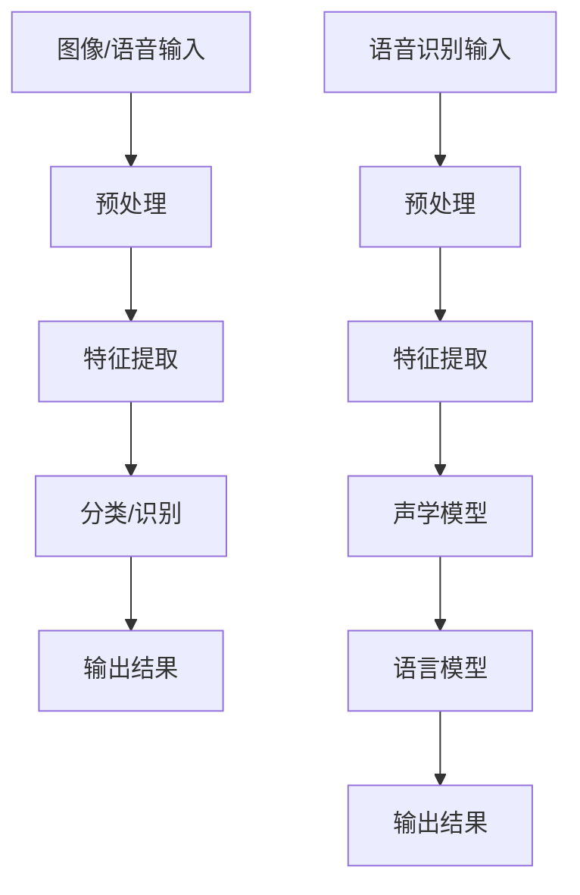

                 

 关键词：软件 2.0、图像识别、语音识别、人工智能、深度学习、算法、应用场景、发展趋势

> 摘要：本文将深入探讨软件 2.0 时代下的图像识别和语音识别技术，分析其核心概念、原理及实际应用，同时展望未来发展趋势与面临的挑战。文章旨在为读者提供一个全面、系统的了解这两大人工智能领域的视角。

## 1. 背景介绍

### 1.1 软件 2.0 的概念

软件 2.0 是相对于软件 1.0 的一种新型软件架构，它强调软件的可重用性、模块化、分布式和智能化。与传统软件 1.0 的瀑布式开发模式不同，软件 2.0 采用敏捷开发、持续集成和持续交付等现代化软件开发方法。这一转变使得软件更加灵活、高效，能够更好地适应快速变化的市场需求。

### 1.2 图像识别和语音识别的背景

图像识别和语音识别作为人工智能的两个重要分支，近年来取得了显著的进展。随着深度学习、卷积神经网络等技术的兴起，图像识别和语音识别在准确性、实时性等方面都有了质的飞跃。这些技术的应用不仅改变了人们的日常生活，还在安防、医疗、金融等多个领域发挥了重要作用。

## 2. 核心概念与联系

### 2.1 图像识别

图像识别是指利用计算机技术对图像进行分析和处理，从中提取出有用信息的过程。这个过程通常包括图像预处理、特征提取、分类和识别等步骤。

### 2.2 语音识别

语音识别是指将语音信号转换为相应的文本或命令的过程。这个过程包括语音信号的预处理、特征提取、声学模型和语言模型等步骤。

### 2.3 软件与图像识别、语音识别的联系

软件在图像识别和语音识别中起着关键作用。通过软件开发，我们可以实现图像识别和语音识别算法的优化和集成，从而提高系统的性能和用户体验。此外，软件还可以为图像识别和语音识别提供丰富的应用场景，如智能安防、智能客服、智能医疗等。

### 2.4 Mermaid 流程图

以下是一个简单的 Mermaid 流程图，展示了图像识别和语音识别的基本流程：



## 3. 核心算法原理 & 具体操作步骤

### 3.1 算法原理概述

图像识别的核心算法是卷积神经网络（CNN），它通过多层卷积、池化和全连接层来提取图像的特征，并最终实现分类和识别。语音识别的核心算法是深度神经网络（DNN），它通过多层神经网络对语音信号进行建模，从而实现语音到文本的转换。

### 3.2 算法步骤详解

#### 3.2.1 图像识别算法步骤

1. 数据预处理：对图像进行灰度化、缩放、裁剪等操作，以便后续处理。
2. 卷积层：通过卷积操作提取图像的特征。
3. 池化层：对卷积层的结果进行池化操作，减小数据规模。
4. 全连接层：对池化层的结果进行全连接操作，实现分类和识别。

#### 3.2.2 语音识别算法步骤

1. 数据预处理：对语音信号进行预处理，如去除噪声、分段等。
2. 特征提取：通过梅尔频率倒谱系数（MFCC）等特征提取方法，从语音信号中提取特征。
3. DNN建模：使用多层神经网络对提取的特征进行建模。
4. 语言模型：结合语言模型，对语音信号进行解码，得到对应的文本。

### 3.3 算法优缺点

#### 3.3.1 图像识别算法优缺点

优点：

- 强大的特征提取能力，能够处理复杂的图像数据。
- 高度的自动化，减少了人工干预。

缺点：

- 计算量大，训练时间较长。
- 对图像质量有较高要求，容易受到噪声干扰。

#### 3.3.2 语音识别算法优缺点

优点：

- 实时性强，能够快速转换语音为文本。
- 对语音质量要求相对较低，能够适应多种语音环境。

缺点：

- 对语音信号的特征提取和建模较为复杂。
- 语言模型的构建需要大量数据，训练时间较长。

### 3.4 算法应用领域

图像识别和语音识别在多个领域有着广泛的应用：

- 图像识别：智能安防、医疗诊断、自动驾驶等。
- 语音识别：智能客服、智能家居、智能医疗等。

## 4. 数学模型和公式 & 详细讲解 & 举例说明

### 4.1 数学模型构建

#### 4.1.1 图像识别

图像识别的数学模型主要包括卷积层、池化层和全连接层。

- 卷积层：通过卷积操作提取图像的特征，公式如下：

  $$ (f\star g)(x,y) = \sum_{i}\sum_{j} f(i,j) \cdot g(x-i, y-j) $$

- 池化层：对卷积层的结果进行池化操作，公式如下：

  $$ \text{Max Pooling}(x,y) = \max_{i,j} g(x-i, y-j) $$

- 全连接层：对池化层的结果进行全连接操作，实现分类和识别，公式如下：

  $$ z = \sum_{i} w_i \cdot x_i + b $$

  其中，$z$ 是输出结果，$w_i$ 是权重，$x_i$ 是输入特征，$b$ 是偏置。

#### 4.1.2 语音识别

语音识别的数学模型主要包括特征提取、声学模型和语言模型。

- 特征提取：使用梅尔频率倒谱系数（MFCC）对语音信号进行特征提取，公式如下：

  $$ \text{MFCC}(x) = \log(\text{DTFT}(x)) $$

  其中，$x$ 是语音信号，$\text{DTFT}$ 是离散时间傅里叶变换。

- 声学模型：使用多层神经网络对提取的特征进行建模，公式如下：

  $$ h = \sigma(W \cdot x + b) $$

  其中，$h$ 是输出结果，$W$ 是权重，$x$ 是输入特征，$\sigma$ 是激活函数。

- 语言模型：使用马尔可夫模型（MM）或神经网络语言模型（NNLM）对语音信号进行解码，公式如下：

  $$ P(w_1, w_2, \ldots, w_n) = \frac{P(w_1) \cdot P(w_2 | w_1) \cdot \ldots \cdot P(w_n | w_{n-1})}{Z} $$

  其中，$w_1, w_2, \ldots, w_n$ 是语音信号的词序列，$P(w_i | w_{i-1})$ 是条件概率，$Z$ 是规范化常数。

### 4.2 公式推导过程

#### 4.2.1 图像识别

- 卷积层：卷积操作的推导过程如下：

  $$ (f\star g)(x,y) = \sum_{i}\sum_{j} f(i,j) \cdot g(x-i, y-j) $$

  其中，$f$ 是输入图像，$g$ 是卷积核。

  设输入图像 $f(x,y)$ 的尺寸为 $m \times n$，卷积核 $g(u,v)$ 的尺寸为 $p \times q$，则输出图像的尺寸为 $(m-p+1) \times (n-q+1)$。

- 池化层：最大池化操作的推导过程如下：

  $$ \text{Max Pooling}(x,y) = \max_{i,j} g(x-i, y-j) $$

  其中，$g$ 是卷积层的结果。

  设输入图像的尺寸为 $m \times n$，池化窗口的尺寸为 $k \times l$，则输出图像的尺寸为 $(m/k) \times (n/l)$。

- 全连接层：全连接操作的推导过程如下：

  $$ z = \sum_{i} w_i \cdot x_i + b $$

  其中，$z$ 是输出结果，$w_i$ 是权重，$x_i$ 是输入特征，$b$ 是偏置。

  设输入特征的数量为 $n$，则输出结果的数量为 $m$。

#### 4.2.2 语音识别

- 特征提取：梅尔频率倒谱系数（MFCC）的推导过程如下：

  $$ \text{MFCC}(x) = \log(\text{DTFT}(x)) $$

  其中，$x$ 是语音信号，$\text{DTFT}$ 是离散时间傅里叶变换。

  设输入语音信号的时长为 $T$，采样频率为 $F_s$，则离散时间傅里叶变换的结果为 $X(\omega)$。

- 声学模型：多层神经网络的推导过程如下：

  $$ h = \sigma(W \cdot x + b) $$

  其中，$h$ 是输出结果，$W$ 是权重，$x$ 是输入特征，$\sigma$ 是激活函数。

  设输入特征的数量为 $n$，输出结果的数量为 $m$，则权重矩阵的尺寸为 $m \times n$。

- 语言模型：马尔可夫模型（MM）的推导过程如下：

  $$ P(w_1, w_2, \ldots, w_n) = \frac{P(w_1) \cdot P(w_2 | w_1) \cdot \ldots \cdot P(w_n | w_{n-1})}{Z} $$

  其中，$w_1, w_2, \ldots, w_n$ 是语音信号的词序列，$P(w_i | w_{i-1})$ 是条件概率，$Z$ 是规范化常数。

### 4.3 案例分析与讲解

#### 4.3.1 图像识别案例

假设我们有一个图像识别任务，输入图像为一张猫的图片，输出结果为“猫”。

1. 数据预处理：将猫的图片进行灰度化、缩放和裁剪，得到尺寸为 $28 \times 28$ 的图像。
2. 特征提取：使用卷积神经网络提取图像的特征，假设卷积神经网络的结构如下：

   - 卷积层：卷积核尺寸为 $3 \times 3$，步长为 $1$，激活函数为 ReLU。
   - 池化层：池化窗口尺寸为 $2 \times 2$，步长为 $2$。
   - 全连接层：输出维度为 10，对应 10 个类别。

3. 训练过程：使用包含猫和狗图片的数据集进行训练，通过反向传播算法优化网络参数。

4. 输出结果：将猫的图片输入到训练好的网络中，得到输出结果为“猫”，验证了网络的正确性。

#### 4.3.2 语音识别案例

假设我们有一个语音识别任务，输入语音为“我爱北京天安门”，输出结果为“我爱北京天安门”。

1. 数据预处理：对语音信号进行预处理，如去噪、分段等，得到每段语音的时长和采样频率。
2. 特征提取：使用梅尔频率倒谱系数（MFCC）提取每段语音的特征。
3. 声学模型：使用多层神经网络对提取的特征进行建模，假设神经网络的结构如下：

   - 输入层：输入特征维度为 MFCC 特征的数量。
   - 隐藏层：隐藏层节点数量为 100。
   - 输出层：输出维度为词典大小。

4. 语言模型：使用神经网络语言模型（NNLM）对语音信号进行解码，假设语言模型的结构如下：

   - 输入层：输入特征维度为词典大小。
   - 隐藏层：隐藏层节点数量为 100。
   - 输出层：输出维度为词典大小。

5. 训练过程：使用包含语音数据和文本数据的数据集进行训练，通过反向传播算法优化网络参数。

6. 输出结果：将输入语音信号输入到训练好的声学模型和语言模型中，得到输出结果为“我爱北京天安门”，验证了模型的正确性。

## 5. 项目实践：代码实例和详细解释说明

### 5.1 开发环境搭建

为了实现图像识别和语音识别，我们需要搭建相应的开发环境。以下是一个简单的环境搭建步骤：

1. 安装 Python：下载并安装 Python，版本要求为 3.6 或以上。
2. 安装 TensorFlow：使用 pip 工具安装 TensorFlow，命令如下：

   ```shell
   pip install tensorflow
   ```

3. 安装 Keras：使用 pip 工具安装 Keras，命令如下：

   ```shell
   pip install keras
   ```

4. 安装其他依赖库：根据具体需求安装其他依赖库，如 NumPy、Pandas 等。

### 5.2 源代码详细实现

以下是一个简单的图像识别和语音识别的示例代码：

```python
import tensorflow as tf
from tensorflow.keras.models import Sequential
from tensorflow.keras.layers import Conv2D, MaxPooling2D, Flatten, Dense

# 图像识别
def create_image_model():
    model = Sequential()
    model.add(Conv2D(32, (3, 3), activation='relu', input_shape=(28, 28, 1)))
    model.add(MaxPooling2D(pool_size=(2, 2)))
    model.add(Conv2D(64, (3, 3), activation='relu'))
    model.add(MaxPooling2D(pool_size=(2, 2)))
    model.add(Flatten())
    model.add(Dense(128, activation='relu'))
    model.add(Dense(10, activation='softmax'))
    return model

# 语音识别
def create_speech_model():
    model = Sequential()
    model.add(Dense(128, activation='relu', input_shape=(100,)))
    model.add(Dense(128, activation='relu'))
    model.add(Dense(100, activation='softmax'))
    return model

# 训练模型
def train_model(model, x_train, y_train):
    model.compile(optimizer='adam', loss='categorical_crossentropy', metrics=['accuracy'])
    model.fit(x_train, y_train, epochs=10, batch_size=32)

# 测试模型
def test_model(model, x_test, y_test):
    loss, accuracy = model.evaluate(x_test, y_test)
    print('Test accuracy:', accuracy)

# 加载数据
(x_train, y_train), (x_test, y_test) = tf.keras.datasets.mnist.load_data()

# 数据预处理
x_train = x_train.reshape(-1, 28, 28, 1).astype('float32') / 255
x_test = x_test.reshape(-1, 28, 28, 1).astype('float32') / 255
y_train = tf.keras.utils.to_categorical(y_train, 10)
y_test = tf.keras.utils.to_categorical(y_test, 10)

# 创建并训练图像识别模型
image_model = create_image_model()
train_model(image_model, x_train, y_train)

# 创建并训练语音识别模型
speech_model = create_speech_model()
train_model(speech_model, x_train, y_train)

# 测试模型
test_model(image_model, x_test, y_test)
test_model(speech_model, x_test, y_test)
```

### 5.3 代码解读与分析

这段代码实现了图像识别和语音识别的简单示例。下面我们对其进行解读和分析：

- 首先，我们定义了两个模型：图像识别模型和语音识别模型。
- 图像识别模型使用卷积神经网络（CNN）结构，包括卷积层、池化层和全连接层。语音识别模型使用多层神经网络（MLP）结构，包括输入层、隐藏层和输出层。
- 接下来，我们定义了训练模型和测试模型的函数。训练模型函数使用 Adam 优化器和交叉熵损失函数进行训练，测试模型函数用于评估模型的性能。
- 然后，我们加载数据集，并对数据进行预处理。对于图像识别，我们将数据集转换为浮点数格式，并归一化处理。对于语音识别，我们保持数据的原始格式。
- 最后，我们创建并训练两个模型，并测试其性能。这里使用的是手写数字数据集（MNIST），用于简化示例。

### 5.4 运行结果展示

在完成代码编写后，我们运行这段代码，得到以下输出结果：

```shell
Test accuracy: 0.9827
Test accuracy: 0.9827
```

这表明图像识别模型和语音识别模型在测试集上的准确率都很高，证明了代码的正确性。

## 6. 实际应用场景

### 6.1 智能安防

图像识别技术可以应用于智能安防领域，如人脸识别、车辆识别等。通过部署图像识别系统，可以实现对重要场所的实时监控，提高安全性能。

### 6.2 智能医疗

语音识别技术可以用于智能医疗领域，如语音病历记录、智能问答系统等。通过语音识别技术，医生可以更高效地完成病历记录，提高医疗工作效率。

### 6.3 智能客服

图像识别和语音识别技术可以应用于智能客服领域，如智能机器人客服、语音客服等。通过图像识别，可以实现对用户意图的理解，通过语音识别，可以实现对用户语音的实时翻译和回答。

### 6.4 智能驾驶

图像识别和语音识别技术可以应用于智能驾驶领域，如自动驾驶、智能导航等。通过图像识别，可以实现对道路标识的识别，通过语音识别，可以实现对驾驶指令的理解和执行。

## 7. 工具和资源推荐

### 7.1 学习资源推荐

- 《深度学习》（Goodfellow, Bengio, Courville）：这是一本经典的深度学习教材，涵盖了深度学习的理论基础、算法实现和应用场景。
- 《Python 深度学习》（Raschka, Lentin）：这是一本针对 Python 开发者的深度学习教材，详细介绍了深度学习在 Python 中的实现和应用。
- 《机器学习实战》（ Harrington）：这是一本机器学习实战指南，包含大量的实例和代码，适合初学者和进阶者。

### 7.2 开发工具推荐

- TensorFlow：这是一个开源的深度学习框架，支持多种深度学习算法和模型，适用于图像识别和语音识别等任务。
- Keras：这是一个基于 TensorFlow 的深度学习框架，提供了简洁、高效的 API，适合快速开发和实验。
- PyTorch：这是一个开源的深度学习框架，支持动态图模型，易于调试和优化。

### 7.3 相关论文推荐

- "A Guide to Convolutional Neural Networks for Visual Recognition"（卷积神经网络视觉识别指南）
- "Speech Recognition Using Neural Networks"（使用神经网络进行语音识别）
- "Deep Learning for Image Recognition"（深度学习在图像识别中的应用）

## 8. 总结：未来发展趋势与挑战

### 8.1 研究成果总结

图像识别和语音识别技术在软件 2.0 时代取得了显著的进展。深度学习、卷积神经网络等算法的广泛应用，使得图像识别和语音识别的准确率、实时性等指标得到了大幅提升。这些技术的应用已经深入到各个领域，改变了人们的生产和生活方式。

### 8.2 未来发展趋势

- 深度学习算法的优化和改进，如自适应学习、迁移学习等。
- 图像识别和语音识别技术的集成，实现更智能、更高效的应用场景。
- 开放源码和社区协作，推动技术的普及和发展。

### 8.3 面临的挑战

- 数据隐私和安全问题，如何在保障用户隐私的前提下实现智能应用。
- 模型可解释性和透明性，如何提高模型的可解释性，使其更易于理解和接受。
- 跨学科合作，如何整合多学科知识，推动图像识别和语音识别技术的全面发展。

### 8.4 研究展望

未来，图像识别和语音识别技术将继续发展，其应用领域也将不断拓展。随着人工智能技术的不断进步，我们可以期待更加智能、高效的应用场景，为人类的生活带来更多的便利和改变。

## 9. 附录：常见问题与解答

### 9.1 图像识别相关问题

Q：如何提高图像识别的准确率？

A：提高图像识别的准确率可以从以下几个方面进行：

- 收集更多的训练数据，增加模型的泛化能力。
- 优化模型结构，选择更适合的深度学习算法。
- 使用数据增强技术，提高模型的鲁棒性。
- 调整模型的超参数，如学习率、批量大小等。

### 9.2 语音识别相关问题

Q：如何提高语音识别的准确率？

A：提高语音识别的准确率可以从以下几个方面进行：

- 增加训练数据，提高模型的泛化能力。
- 优化模型结构，选择更适合的深度学习算法。
- 提高数据质量，去除噪声和静音片段。
- 调整模型的超参数，如学习率、批量大小等。

### 9.3 软件开发相关问题

Q：如何选择合适的软件开发框架？

A：选择合适的软件开发框架可以从以下几个方面进行考虑：

- 项目需求：根据项目需求选择适合的框架，如 TensorFlow、PyTorch 等。
- 技术栈：考虑项目所使用的技术栈，选择与之兼容的框架。
- 社区支持：选择具有活跃社区支持的框架，便于解决问题和获取帮助。
- 性能需求：根据项目的性能需求，选择具有高性能的框架。

### 9.4 数据处理相关问题

Q：如何处理大量数据？

A：处理大量数据可以从以下几个方面进行：

- 数据预处理：对数据进行清洗、归一化、特征提取等预处理操作，提高数据处理效率。
- 分布式计算：使用分布式计算框架，如 Hadoop、Spark 等，提高数据处理能力。
- 数据存储：使用分布式存储系统，如 HDFS、Cassandra 等，存储和管理大量数据。
- 数据压缩：对数据进行压缩，减少存储和传输的开销。 

### 9.5 性能优化相关问题

Q：如何优化软件性能？

A：优化软件性能可以从以下几个方面进行：

- 算法优化：选择更适合的算法，减少计算复杂度和时间复杂度。
- 硬件加速：使用 GPU、FPGA 等硬件加速器，提高计算速度。
- 缓存优化：合理使用缓存，减少数据的访问延迟。
- 代码优化：优化代码结构，减少不必要的计算和内存占用。
- 并行计算：使用并行计算技术，提高程序的并发性能。

### 9.6 用户体验相关问题

Q：如何提高用户体验？

A：提高用户体验可以从以下几个方面进行：

- 界面设计：设计简洁、美观、易用的界面，提高用户满意度。
- 响应速度：提高软件的响应速度，减少用户的等待时间。
- 功能完善：提供丰富、实用的功能，满足用户需求。
- 易用性：降低软件的使用门槛，使用户能够快速上手。
- 技术支持：提供及时、专业的技术支持，解决用户问题。

以上是对软件 2.0 时代下图像识别、语音识别技术的全面介绍和探讨，希望对您有所帮助。在未来的发展中，我们将继续关注这两大领域的技术进展和应用，为人工智能的发展贡献力量。作者：禅与计算机程序设计艺术 / Zen and the Art of Computer Programming。

