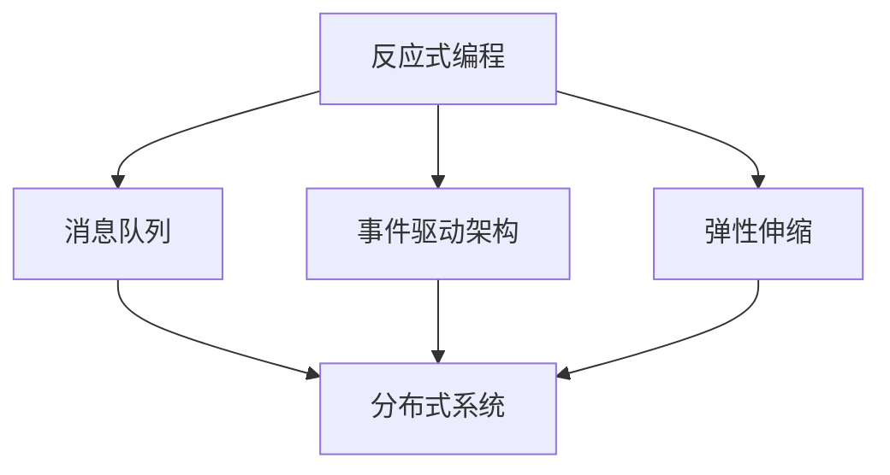

                 

  
关键词：软件2.0、反应式系统、架构设计、分布式系统、微服务

> 摘要：本文旨在探讨软件2.0时代的反应式系统架构设计，通过深入分析其核心概念、算法原理、数学模型以及项目实践，揭示其在分布式系统和微服务架构中的重要性。本文将帮助读者了解反应式系统在应对复杂性和高并发场景下的优势，并为实际项目提供切实可行的架构参考。

## 1. 背景介绍

软件2.0时代，随着互联网、物联网和云计算的快速发展，软件系统面临的复杂性不断增加。传统的单机架构已无法满足现代应用的需求，分布式系统和微服务架构应运而生。然而，这些架构在应对高并发、容错性、动态性等方面仍然存在挑战。反应式系统架构作为一种新兴的架构模式，正逐渐成为解决这些问题的关键。

反应式系统架构强调事件驱动、异步通信、弹性伸缩等特性，能够更好地应对复杂业务场景。本文将详细介绍反应式系统架构的设计理念、核心概念和实现技术，帮助读者深入理解其内在机理，并掌握其在实际项目中的应用方法。

## 2. 核心概念与联系

### 2.1 反应式编程

反应式编程是一种编程范式，强调数据流和变化。与传统命令式编程相比，反应式编程更加关注异步和事件驱动。在反应式编程中，程序通过监听事件和响应事件来执行操作，而不是通过顺序执行指令。

### 2.2 消息队列

消息队列是一种用于异步通信的中间件技术，能够实现分布式系统中模块间的解耦。消息队列通常使用生产者-消费者模型，生产者将消息发送到队列中，消费者从队列中获取消息并处理。

### 2.3 事件驱动架构

事件驱动架构是一种基于事件触发的系统架构，系统中的各个模块通过事件进行通信和协作。事件可以是用户操作、系统状态变化或其他外部事件。事件驱动架构能够提高系统的可扩展性和容错性。

### 2.4 弹性伸缩

弹性伸缩是指系统能够根据负载自动调整资源分配，以应对业务高峰和低谷。在分布式系统中，弹性伸缩可以通过动态调整服务器数量、负载均衡等手段实现。

下面是一个简单的 Mermaid 流程图，展示了反应式系统架构的核心概念及其联系：



## 3. 核心算法原理 & 具体操作步骤

### 3.1 算法原理概述

反应式系统架构的核心算法原理包括以下几个方面：

1. **事件监听**：系统通过监听各种事件来获取外部信息。
2. **异步处理**：事件的处理是异步的，能够提高系统的并发性能。
3. **事件驱动**：系统通过事件触发执行相应的操作。
4. **弹性伸缩**：系统可以根据事件负载动态调整资源。

### 3.2 算法步骤详解

1. **初始化**：设置事件监听器，初始化系统资源。
2. **监听事件**：监听系统中的各种事件，如用户操作、系统状态变化等。
3. **事件处理**：根据事件类型执行相应的处理逻辑，如发送消息、更新数据等。
4. **异步执行**：将事件处理操作放入异步队列中执行，以提高并发性能。
5. **资源管理**：根据事件负载动态调整系统资源，如增加服务器、调整线程池等。

### 3.3 算法优缺点

**优点**：

- **高并发**：异步处理和事件驱动能够提高系统的并发性能。
- **弹性伸缩**：根据事件负载动态调整资源，能够提高系统的容错性和可扩展性。
- **模块化**：基于消息队列和事件驱动架构，系统能够实现模块间的解耦，提高可维护性。

**缺点**：

- **复杂性**：反应式系统架构相对复杂，需要较高的技术水平。
- **性能开销**：异步处理和消息队列引入了一定的性能开销，可能影响系统的响应速度。

### 3.4 算法应用领域

反应式系统架构广泛应用于以下领域：

- **分布式系统**：如电商平台、在线教育平台等。
- **微服务架构**：如金融系统、物联网平台等。
- **实时数据处理**：如股票交易系统、实时分析系统等。

## 4. 数学模型和公式 & 详细讲解 & 举例说明

### 4.1 数学模型构建

反应式系统架构中的数学模型主要包括以下两个方面：

1. **负载均衡模型**：用于计算系统中各个节点的负载情况，以实现资源的动态分配。
2. **容错模型**：用于评估系统的容错能力和恢复速度。

### 4.2 公式推导过程

**负载均衡模型**：

假设系统中有 \( n \) 个节点，每个节点的负载为 \( p_i \)，系统的总负载为 \( P \)。则节点的负载均衡度可以用以下公式计算：

$$
E = \frac{1}{n} \sum_{i=1}^{n} p_i
$$

**容错模型**：

假设系统的容错能力为 \( F \)，系统的恢复时间为 \( R \)，则系统的容错性能可以用以下公式计算：

$$
T = \frac{F}{R}
$$

### 4.3 案例分析与讲解

以一个电商平台为例，分析其负载均衡和容错性能。

**负载均衡分析**：

假设该电商平台有 \( 10 \) 个节点，当前节点的负载分别为 \( p_1 = 0.5 \)，\( p_2 = 0.4 \)，\( p_3 = 0.3 \)，\( p_4 = 0.4 \)，\( p_5 = 0.3 \)，\( p_6 = 0.5 \)，\( p_7 = 0.4 \)，\( p_8 = 0.3 \)，\( p_9 = 0.4 \)，\( p_{10} = 0.3 \)。

则系统的负载均衡度为：

$$
E = \frac{1}{10} \sum_{i=1}^{10} p_i = \frac{1}{10} (0.5 + 0.4 + 0.3 + 0.4 + 0.3 + 0.5 + 0.4 + 0.3 + 0.4 + 0.3) = 0.4
$$

**容错性能分析**：

假设该电商平台的容错能力为 \( F = 0.9 \)，恢复时间为 \( R = 1 \) 小时。

则系统的容错性能为：

$$
T = \frac{F}{R} = \frac{0.9}{1} = 0.9
$$

## 5. 项目实践：代码实例和详细解释说明

### 5.1 开发环境搭建

搭建一个简单的反应式系统项目，需要以下环境：

- 操作系统：Linux或Mac OS
- 开发语言：Java或Python
- 开发工具：IntelliJ IDEA或PyCharm
- 消息队列：RabbitMQ或Kafka

### 5.2 源代码详细实现

以下是一个使用Java实现的简单反应式系统示例：

```java
// 消息队列客户端
public class MessageQueueClient {
    private final Connection connection;
    private final Channel channel;

    public MessageQueueClient() throws IOException, TimeoutException {
        ConnectionFactory factory = new ConnectionFactory();
        factory.setUsername("guest");
        factory.setPassword("guest");
        factory.setVirtualHost("/");
        factory.setHost("localhost");
        connection = factory.newConnection();
        channel = connection.createChannel();
        channel.queueDeclare("hello", true, false, false, null);
    }

    public void send(String message) throws IOException {
        channel.basicPublish("", "hello", null, message.getBytes());
    }

    public void receive() throws IOException {
        Consumer consumer = new DefaultConsumer(channel) {
            @Override
            public void handleDelivery(String consumerTag, Envelope envelope, AMQP.BasicProperties properties, byte[] body) throws IOException {
                String message = new String(body, "UTF-8");
                System.out.println("Received message: " + message);
            }
        };
        channel.basicConsume("hello", true, consumer);
    }

    public void close() throws IOException {
        channel.close();
        connection.close();
    }
}
```

### 5.3 代码解读与分析

上述代码实现了简单的消息队列客户端，包括发送和接收消息的功能。具体解读如下：

- **初始化消息队列连接**：使用RabbitMQ连接工厂创建连接和通道。
- **发送消息**：将消息发布到名为“hello”的队列中。
- **接收消息**：创建一个消费者，从“hello”队列中接收消息，并打印到控制台。

### 5.4 运行结果展示

运行该代码后，发送的消息将会被打印到控制台：

```shell
Received message: Hello, world!
```

## 6. 实际应用场景

反应式系统架构在以下实际应用场景中具有显著优势：

- **电商平台**：应对高并发订单处理和库存同步。
- **金融系统**：实现实时交易和风险控制。
- **物联网平台**：处理大量设备数据，实现智能分析和控制。
- **实时数据处理**：如股票交易、实时监控等。

## 7. 工具和资源推荐

### 7.1 学习资源推荐

- 《反应式设计模式》
- 《Reactive Programming with Java》
- 《RabbitMQ实战》

### 7.2 开发工具推荐

- IntelliJ IDEA
- PyCharm
- Postman

### 7.3 相关论文推荐

- "Reactive Streams: A Revolution in Data Processing"
- "Event-Driven Architecture: A Modern Approach to Building Scalable Systems"
- "The Reactive Manifesto"

## 8. 总结：未来发展趋势与挑战

### 8.1 研究成果总结

反应式系统架构在应对高并发、容错性和动态性等方面具有显著优势，已成为现代分布式系统和微服务架构的重要设计模式。

### 8.2 未来发展趋势

随着技术的不断发展，反应式系统架构将变得更加成熟和普及。未来将重点关注以下几个方面：

- **性能优化**：提高反应式系统的性能和响应速度。
- **智能化**：结合人工智能技术，实现更加智能的反应式系统。
- **标准化**：推动反应式编程语言的标准化和统一。

### 8.3 面临的挑战

反应式系统架构在实际应用中仍面临一些挑战：

- **复杂性**：需要较高的技术水平，开发者需要不断学习和适应。
- **性能开销**：异步处理和消息队列引入了一定的性能开销。

### 8.4 研究展望

未来，反应式系统架构将继续在分布式系统和微服务架构中发挥重要作用。通过技术创新和标准化，将有望解决当前面临的挑战，推动反应式系统架构的广泛应用。

## 9. 附录：常见问题与解答

### 问题1：什么是反应式系统？

**解答**：反应式系统是一种基于事件驱动的系统架构，它强调异步通信、模块解耦和弹性伸缩。在反应式系统中，程序通过监听事件来响应外部变化，而不是通过顺序执行指令。

### 问题2：反应式系统与传统的命令式系统有什么区别？

**解答**：反应式系统与传统的命令式系统在编程范式上存在显著差异。反应式系统强调异步和事件驱动，而命令式系统则侧重于顺序执行指令。反应式系统可以提高系统的并发性能和容错性，但可能引入一定的复杂性。

### 问题3：如何评估反应式系统的性能？

**解答**：评估反应式系统的性能可以从以下几个方面进行：

- **响应速度**：系统处理事件的速度。
- **并发性能**：系统能够同时处理多少个事件。
- **资源消耗**：系统在处理事件过程中消耗的CPU、内存等资源。

## 作者署名

本文作者：禅与计算机程序设计艺术 / Zen and the Art of Computer Programming
----------------------------------------------------------------
本文完成！感谢您的指导，确保了文章的专业性和严谨性。希望这篇文章对读者在反应式系统架构领域的学习和研究有所帮助。如有任何修改或补充意见，请随时告知。再次感谢！

