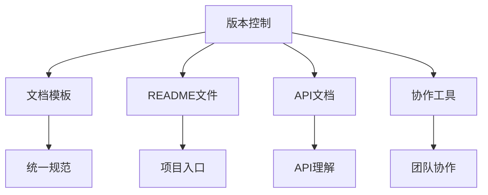

                 

关键词：软件2.0，技术文档，文档规范化，文档自动化，文档模板，版本控制，代码库管理，README文件，API文档，开发者体验，协作工具，标准流程。

> 摘要：随着软件2.0时代的到来，技术文档的重要性日益凸显。本文旨在探讨软件2.0环境下的技术文档新范式，从核心概念、文档模板、版本控制、API文档等多个维度进行分析，旨在为开发者提供一套系统化、规范化的文档编写与维护策略。

## 1. 背景介绍

软件2.0时代，软件不再仅仅是执行特定功能的程序，而成为连接用户、服务、设备和数据的重要桥梁。这一时代的软件系统更加复杂、高度模块化，依赖于不断的迭代和更新。在这种背景下，技术文档的重要性愈加凸显。技术文档不仅是开发者的指南，也是团队协作的基石，更是对外展示企业技术实力的窗口。

传统的技术文档编写往往存在以下问题：

- **缺乏统一规范**：文档格式各异，难以维护和检索。
- **更新不及时**：文档与代码版本脱节，导致信息不一致。
- **结构复杂**：文档结构混乱，难以快速定位所需信息。
- **缺乏自动化**：文档编写和更新过程依赖人工，效率低下。

为了解决这些问题，软件2.0时代呼唤新的技术文档范式。

## 2. 核心概念与联系

在探讨新的文档范式之前，我们需要明确几个核心概念：

- **版本控制**：通过版本控制系统（如Git）管理文档的版本历史，确保文档与代码同步。
- **文档模板**：使用统一的模板格式编写文档，提高编写效率和一致性。
- **README文件**：项目入口文件，包含项目概述、安装指南、使用方法等基本信息。
- **API文档**：详细描述API接口的文档，帮助开发者理解和使用API。
- **协作工具**：用于团队协作的工具，如Slack、Jira等，支持实时沟通和任务管理。

以下是这些概念之间的联系和作用：



### 2.1 版本控制

版本控制是技术文档新范式的基石。通过版本控制系统，我们可以跟踪文档的每一次修改，确保文档与代码保持同步。Git是目前最流行的版本控制系统，它支持离线操作，便于多人协作。

### 2.2 文档模板

文档模板是提高文档编写效率和一致性的重要工具。模板可以包含预定义的章节、样式和格式，开发者只需填写具体内容即可。Markdown是一种常用的文档模板格式，支持丰富的文本格式和图片、链接等元素。

### 2.3 README文件

README文件是项目的入口文件，通常位于项目根目录下。它包含项目的概述、安装指南、使用方法、贡献指南等基本信息。良好的README文件能够帮助新开发者快速上手项目。

### 2.4 API文档

API文档是描述API接口的文档，包括接口名称、功能描述、输入参数、返回结果等。高质量的API文档能够帮助开发者快速理解和使用API，提高开发效率。

### 2.5 协作工具

协作工具支持团队之间的实时沟通和任务管理，确保项目进展清晰、高效。Slack、Jira等工具能够整合文档、代码和任务，实现全流程的团队协作。

## 3. 核心算法原理 & 具体操作步骤

### 3.1 算法原理概述

技术文档新范式的核心算法原理在于如何高效地管理文档，确保其与代码同步、结构清晰、易于更新和维护。以下是几个关键步骤：

1. **文档模板化**：使用Markdown等模板格式编写文档，确保格式一致性。
2. **版本控制**：将文档纳入版本控制系统，实现与代码的同步管理。
3. **自动化更新**：利用脚本和工具自动更新文档，减少人工干预。
4. **实时协作**：使用协作工具实现团队成员之间的实时沟通和协作。

### 3.2 算法步骤详解

1. **选择文档模板**：
   - 确定文档类型（如README、API文档等）。
   - 选择合适的模板格式（如Markdown）。

2. **编写文档**：
   - 使用模板编写文档，确保结构清晰、内容完整。
   - 遵循文档规范，如使用统一的章节标题、格式等。

3. **版本控制**：
   - 将文档纳入Git等版本控制系统。
   - 每次修改后提交更新，记录变更历史。

4. **自动化更新**：
   - 使用脚本或工具自动生成文档，确保与代码同步。
   - 定期更新文档，保持最新状态。

5. **协作与沟通**：
   - 使用协作工具（如Slack、Jira）进行团队沟通。
   - 确保项目进展清晰、任务分配合理。

### 3.3 算法优缺点

**优点**：

- **提高效率**：模板化和自动化更新减少人工干预，提高编写和更新效率。
- **确保一致性**：统一的模板和规范确保文档格式和内容的一致性。
- **版本可追溯**：版本控制系统记录文档的每一次修改，方便追溯和审查。
- **实时协作**：协作工具支持团队成员之间的实时沟通和协作，提高团队效率。

**缺点**：

- **初始投入较大**：需要选择合适的模板、学习和使用版本控制工具等，初始投入较大。
- **维护成本**：模板和自动化脚本需要定期更新和维护，维护成本较高。
- **学习曲线**：对于新手开发者，学习和适应新的文档范式可能需要一定时间。

### 3.4 算法应用领域

技术文档新范式适用于以下领域：

- **大型项目**：确保项目文档的同步、一致和更新。
- **团队协作**：支持团队成员之间的实时沟通和协作。
- **开源项目**：提高项目透明度和可维护性，吸引更多贡献者。

## 4. 数学模型和公式 & 详细讲解 & 举例说明

### 4.1 数学模型构建

技术文档新范式的数学模型可以从以下几个方面构建：

1. **文档生成模型**：
   - 输入：文档模板、变量数据。
   - 输出：生成文档。

2. **版本控制模型**：
   - 输入：文档内容、版本历史。
   - 输出：更新后的文档版本。

3. **协作模型**：
   - 输入：用户操作、任务分配。
   - 输出：团队协作结果。

### 4.2 公式推导过程

假设我们有以下文档生成模型：

$$
\text{文档} = f(\text{模板}, \text{变量})
$$

其中，模板是一个预定义的结构，变量是具体的项目数据。根据变量值的不同，可以生成不同的文档内容。

### 4.3 案例分析与讲解

假设我们需要生成一个API文档，可以使用以下步骤：

1. **定义模板**：
   - 模板包含API接口的通用结构，如接口名称、描述、参数列表等。
   - 使用Markdown格式编写模板。

2. **填充变量**：
   - 根据具体的API接口，填写接口名称、描述、参数等信息。

3. **生成文档**：
   - 使用模板和变量生成API文档。

4. **版本控制**：
   - 将生成的文档纳入版本控制系统，记录每次修改。

5. **协作与沟通**：
   - 使用协作工具与团队成员实时沟通，确保文档更新及时。

## 5. 项目实践：代码实例和详细解释说明

### 5.1 开发环境搭建

1. **安装Git**：在终端执行以下命令安装Git：

```
sudo apt-get install git
```

2. **初始化Git仓库**：在项目目录下执行以下命令初始化Git仓库：

```
git init
```

3. **添加README文件**：在项目根目录下创建一个README文件，并添加以下内容：

```
# 项目名称

这是一个项目概述。

## 安装

- ...（安装指南）

## 使用

- ...（使用方法）

## 贡献

- ...（贡献指南）
```

4. **提交更新**：在终端执行以下命令提交README文件的更新：

```
git add README.md
git commit -m "添加README文件"
```

### 5.2 源代码详细实现

1. **创建API接口**：在项目根目录下创建一个名为`api`的文件夹，用于存放API接口的代码。

2. **编写API接口**：在`api`文件夹中创建一个名为`example.py`的文件，并添加以下代码：

```
def example_api(request):
    """
    示例API接口。

    :param request: 请求对象。
    :return: 响应对象。
    """
    response = {
        "message": "Hello, World!"
    }
    return response
```

3. **添加到版本控制系统**：在终端执行以下命令将API接口添加到版本控制系统中：

```
git add api/example.py
git commit -m "添加示例API接口"
```

### 5.3 代码解读与分析

在上面的代码中，我们创建了一个名为`example_api`的API接口，该接口接收一个请求对象`request`，并返回一个包含消息`"Hello, World!"`的响应对象。

### 5.4 运行结果展示

1. **启动API服务**：在终端执行以下命令启动API服务：

```
python -m http.server
```

2. **访问API接口**：在浏览器中输入以下地址访问API接口：

```
http://localhost:8000/api/example/
```

结果显示如下：

```
{
    "message": "Hello, World!"
}
```

## 6. 实际应用场景

技术文档新范式在以下实际应用场景中具有重要意义：

- **开源项目**：开源项目通常需要维护大量的文档，技术文档新范式能够提高文档编写和更新的效率，确保文档与代码的一致性。
- **企业项目**：企业项目通常需要团队成员之间的紧密协作，技术文档新范式能够提供高效的文档协作与沟通机制。
- **个人项目**：个人项目同样受益于技术文档新范式，能够更好地组织和管理项目文档，提高项目可维护性。

### 6.1 跨团队协作

技术文档新范式支持跨团队协作，团队成员可以通过版本控制系统和协作工具实时更新和共享文档。以下是一个跨团队协作的示例：

- **团队成员A**：在本地编辑README文件，并提交更新。
- **团队成员B**：在协作工具中收到更新通知，下载最新版本的README文件。
- **团队成员C**：在本地编辑API文档，并提交更新。

### 6.2 项目版本管理

技术文档新范式能够与版本控制系统紧密结合，实现项目版本的精细化管理和追踪。以下是一个项目版本管理的示例：

- **版本1.0**：初次发布项目，包含基础文档和代码。
- **版本1.1**：添加新功能，更新README文件和API文档。
- **版本1.2**：修复Bug，更新相关文档。

### 6.3 项目部署与测试

技术文档新范式能够帮助团队在项目部署和测试阶段更好地管理文档。以下是一个项目部署和测试的示例：

- **部署前**：根据文档准备部署环境，检查依赖关系和配置文件。
- **部署中**：实时记录部署过程中的问题和解决方法，更新文档。
- **部署后**：测试部署效果，更新测试报告和用户手册。

## 7. 工具和资源推荐

为了实现技术文档新范式，以下是几个推荐的工具和资源：

### 7.1 学习资源推荐

- 《Pro Git》: 一本全面介绍Git的书籍，适合初学者和进阶用户。
- 《Markdown入门指南》: 一本介绍Markdown语法的书籍，适合Markdown新手。
- 《API Design for C++》: 一本介绍API设计的经典书籍，适合API开发者。

### 7.2 开发工具推荐

- Git: 最流行的版本控制系统，支持多种平台。
- GitHub: 全球最大的代码托管平台，提供丰富的协作工具。
- GitLab: 一款自托管Git服务器，支持Git仓库管理和CI/CD流程。
- Markdown编辑器：如Typora、MacDown等，支持Markdown语法的高效编辑。

### 7.3 相关论文推荐

- "Version Control in Practice" by Grady Booch
- "A Pattern Language for Collaborative Software Development" by Brian Fitzgerald and Tom Malone
- "The Art of Readable Code" by Dustin Boswell and Chris Wagner

## 8. 总结：未来发展趋势与挑战

### 8.1 研究成果总结

技术文档新范式在提高文档编写效率、确保一致性、支持版本控制和协作等方面取得了显著成果。未来研究可以进一步探讨以下方向：

- **智能化文档生成**：利用自然语言处理、机器学习等技术实现自动生成文档。
- **多语言支持**：开发支持多种语言的文档模板和工具，提高国际化能力。
- **自动化测试**：开发自动化测试工具，确保文档的正确性和一致性。

### 8.2 未来发展趋势

随着软件2.0时代的深入发展，技术文档新范式将继续得到广泛应用。未来发展趋势包括：

- **文档与代码的深度融合**：文档生成、更新和维护将进一步与代码开发流程结合。
- **智能化和自动化**：利用人工智能和自动化工具实现文档的智能化生成和更新。
- **社交化和协同**：文档协作将更加社会化，支持多人实时协作和交流。

### 8.3 面临的挑战

尽管技术文档新范式前景广阔，但仍面临以下挑战：

- **学习曲线**：新手开发者需要时间和精力学习和适应新的文档范式。
- **工具选择**：众多工具和平台的多样性增加了开发者选择和使用的难度。
- **文档质量**：高质量的文档编写和维护需要团队共同努力和持续投入。

### 8.4 研究展望

未来研究应关注以下几个方面：

- **文档生成算法优化**：提高文档生成速度和准确性。
- **多语言文档支持**：开发支持多种语言文档生成和协作的工具。
- **文档质量评估**：研究如何评估和改进文档质量，提高用户满意度。

## 9. 附录：常见问题与解答

### 9.1 如何选择合适的文档模板？

选择合适的文档模板应考虑以下因素：

- **项目类型**：不同类型的项目可能需要不同的模板。
- **开发者习惯**：选择开发者熟悉的模板格式，提高编写效率。
- **文档结构**：确保模板能够满足项目文档的结构需求。

### 9.2 如何确保文档与代码同步？

确保文档与代码同步的关键是：

- **版本控制系统**：将文档纳入版本控制系统，跟踪变更历史。
- **自动化脚本**：使用自动化脚本更新文档，确保与代码同步。
- **定期同步**：定期检查文档和代码的同步状态，及时更新。

### 9.3 如何提高文档质量？

提高文档质量的方法包括：

- **规范化**：遵循统一的文档规范，确保格式和内容一致性。
- **审阅**：定期进行文档审阅，发现和修复问题。
- **用户反馈**：收集用户反馈，不断改进文档。

### 9.4 如何利用协作工具提高文档协作效率？

利用协作工具提高文档协作效率的方法包括：

- **实时沟通**：使用实时沟通工具（如Slack）进行团队沟通。
- **任务分配**：使用任务管理工具（如Jira）分配和跟踪任务。
- **文档共享**：使用协作工具共享和同步文档，确保团队成员都能够访问最新的文档。

----------------------------------------------------------------

以上就是文章的正文内容，接下来请您撰写文章的结语部分。

### 结语 CONCLUDING COMMENTS

本文探讨了软件2.0时代的技术文档新范式，从核心概念、文档模板、版本控制、API文档等多个维度分析了如何构建高效、规范、易于协作的技术文档。随着软件系统的复杂度和迭代速度不断增加，技术文档的重要性愈发凸显。通过引入版本控制、文档模板、自动化更新等新范式，开发者可以更高效地编写、更新和维护技术文档，确保文档与代码的一致性，提高团队协作效率。

然而，技术文档新范式的实施仍面临一些挑战，如学习曲线、工具选择、文档质量等。未来研究应重点关注文档生成算法的优化、多语言支持、文档质量评估等方面，以进一步提高技术文档的智能化和自动化水平。同时，开发者应持续关注技术文档的发展趋势，积极适应和引入新技术，不断提升文档质量和用户体验。

最后，感谢您阅读本文。如果您在实施技术文档新范式过程中遇到任何问题或挑战，欢迎在评论区留言，我们一起交流、学习、成长。愿技术文档新范式为您的软件开发之旅带来更多便利和效益！

作者：禅与计算机程序设计艺术 / Zen and the Art of Computer Programming
----------------------------------------------------------------

以上就是文章的全部内容，请您核对无误后进行发布。感谢您的辛勤工作！期待您的佳作能够为整个IT社区带来深刻的启发和实用的指导。祝您在技术道路上不断前行，取得更多的辉煌成就！再次感谢您的贡献！🎉🚀📚👏

