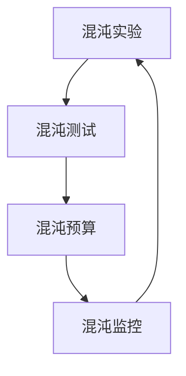

                 

关键词：软件2.0、混沌工程、实践、系统稳定性、故障预测、自动化测试

> 摘要：本文将深入探讨软件2.0时代的混沌工程实践，通过介绍混沌工程的核心概念、应用场景以及具体的实施步骤，旨在帮助开发者理解和掌握这一新兴领域，提升系统的稳定性与可靠性。

## 1. 背景介绍

随着软件系统的复杂度不断攀升，传统的方法已经难以应对系统中的不确定性因素。软件2.0时代，混沌工程作为一种新型的系统稳定性提升技术，逐渐引起了业界的关注。混沌工程的核心思想是通过引入可控的故障和异常情况，对系统进行主动的测试和验证，从而提高系统的健壮性和可靠性。

混沌工程并非让系统崩溃，而是通过精心设计的实验，识别系统的脆弱点，并提前采取预防措施。这种方法不仅可以提前发现潜在的问题，还能够提高开发团队的应变能力和系统恢复速度。

### 1.1 软件2.0的概念

软件2.0是相对于传统软件1.0的进化。软件1.0时代主要关注功能实现的完备性和性能优化，而软件2.0则更加注重系统的稳定性、可维护性和用户体验。在这一时代，系统的复杂性成为了一大挑战，混沌工程应运而生，为解决这一挑战提供了新的思路和方法。

### 1.2 混沌工程的重要性

混沌工程的重要性体现在以下几个方面：

- **提升系统稳定性**：通过主动引入故障，提前识别系统的弱点，从而提高系统的整体稳定性。
- **增强故障预测能力**：通过大量实验积累的数据，可以更准确地预测系统的故障模式，提前采取预防措施。
- **优化开发流程**：混沌工程实践有助于改进开发流程，提高系统的健壮性，减少系统宕机时间和故障修复成本。
- **提升团队应变能力**：通过不断进行混沌实验，开发团队可以更好地适应各种突发状况，提高应对紧急事件的能力。

## 2. 核心概念与联系

### 2.1 混沌工程的核心概念

混沌工程的核心概念包括以下几个方面：

- **混沌实验**：通过在系统中引入故障和异常情况，测试系统的响应能力和恢复速度。
- **混沌测试**：在受控的环境下，对系统进行混沌实验，以评估系统的健壮性和可靠性。
- **混沌预算**：确定系统可以容忍的故障范围，以及为了达到预期健壮性所需的混沌实验频率。
- **混沌监控**：对混沌实验的结果进行监控和分析，以便及时调整混沌预算和实验方案。

### 2.2 Mermaid 流程图

以下是混沌工程的Mermaid流程图，展示了混沌工程的核心概念和联系。



## 3. 核心算法原理 & 具体操作步骤

### 3.1 算法原理概述

混沌工程的原理基于系统的复杂性和不确定性。通过引入故障和异常，模拟实际运行中的各种可能情况，测试系统的响应和恢复能力。具体来说，混沌工程包括以下几个步骤：

1. **故障模拟**：通过编写故障注入脚本，模拟各种故障情况，如服务中断、网络延迟、数据库故障等。
2. **测试执行**：在受控的环境下，执行故障注入脚本，观察系统的响应和恢复过程。
3. **结果分析**：对测试结果进行统计和分析，识别系统的脆弱点和故障模式。
4. **调整预算**：根据分析结果，调整混沌预算，优化故障注入策略和实验方案。

### 3.2 算法步骤详解

以下是混沌工程的具体实施步骤：

#### 3.2.1 故障模拟

- **故障注入脚本**：编写故障注入脚本，包括故障类型、注入时机和注入强度等参数。
- **故障注入**：在系统运行过程中，定时执行故障注入脚本，模拟各种故障情况。

#### 3.2.2 测试执行

- **测试环境**：搭建与生产环境类似的测试环境，包括硬件、软件和网络配置等。
- **测试执行**：在测试环境中执行故障注入脚本，记录系统的响应和恢复过程。

#### 3.2.3 结果分析

- **数据收集**：收集故障注入期间的各种日志和监控数据，包括系统性能指标、错误日志等。
- **结果分析**：对收集的数据进行分析，识别系统的脆弱点和故障模式。

#### 3.2.4 调整预算

- **混沌预算**：根据分析结果，调整混沌预算，优化故障注入策略和实验方案。
- **迭代优化**：重复执行故障注入和测试分析，不断优化系统稳定性。

### 3.3 算法优缺点

**优点**：

- **提高系统稳定性**：通过主动引入故障，提前识别系统的弱点，提高系统的整体稳定性。
- **增强故障预测能力**：通过大量实验积累的数据，可以更准确地预测系统的故障模式，提前采取预防措施。
- **优化开发流程**：混沌工程实践有助于改进开发流程，提高系统的健壮性，减少系统宕机时间和故障修复成本。

**缺点**：

- **成本较高**：混沌工程需要大量的时间和资源，特别是在大规模系统中实施。
- **复杂性增加**：混沌工程的实施过程复杂，需要具备一定的专业技能和经验。

### 3.4 算法应用领域

混沌工程适用于以下领域：

- **云计算和大数据**：在云计算和大数据环境中，混沌工程可以帮助提高系统的稳定性、可靠性和容错能力。
- **金融系统**：金融系统的稳定运行至关重要，混沌工程可以帮助识别潜在的风险点，提高系统的风险防控能力。
- **物联网**：物联网系统中，设备众多，混沌工程可以帮助提高系统的整体健壮性，减少设备故障对业务的影响。

## 4. 数学模型和公式 & 详细讲解 & 举例说明

### 4.1 数学模型构建

混沌工程的数学模型主要涉及概率论和统计学。以下是构建数学模型的一些基本步骤：

- **故障概率分布**：确定故障发生的概率分布，如泊松分布、正态分布等。
- **故障时间间隔**：计算故障之间的时间间隔，如平均值、方差等。
- **系统状态转移**：建立系统状态转移的数学模型，描述系统在不同故障情况下的状态变化。

### 4.2 公式推导过程

以下是构建混沌工程数学模型的一些关键公式：

- **故障概率分布公式**：

  $$ P(X = k) = \frac{e^{-\lambda} \lambda^k}{k!} $$

  其中，$X$ 表示故障发生的次数，$\lambda$ 表示故障的平均发生率。

- **故障时间间隔公式**：

  $$ T = \frac{1}{\lambda} $$

  其中，$T$ 表示故障之间的平均时间间隔。

- **系统状态转移公式**：

  $$ P(S_t = s) = \sum_{i=1}^{n} P(S_t = s | S_{t-1} = i) P(S_{t-1} = i) $$

  其中，$S_t$ 表示系统在时间 $t$ 的状态，$s$ 表示具体的状态值。

### 4.3 案例分析与讲解

以下是一个简单的案例，说明如何使用混沌工程数学模型进行系统稳定性分析。

**案例背景**：

假设一个系统在每分钟内发生故障的概率为0.1，故障之间的时间间隔服从指数分布。

**求解步骤**：

1. **故障概率分布**：

   根据泊松分布公式，可以计算出每分钟内发生故障的概率分布。

   ```mermaid
   graph TD
       A[0次故障] --> B[1次故障]
       B --> C[2次故障]
       C --> D[3次故障]
       D --> E[4次故障]
       subgraph 概率分布
           F[P(X = k)]
       end
   ```

   根据公式：

   ```mermaid
   graph TD
       A1[0次故障] --> B1[0.9048]
       B2[1次故障] --> B1[0.0905]
       C3[2次故障] --> B1[0.0051]
       D4[3次故障] --> B1[0.0001]
       E5[4次故障] --> B1[0.0000]
   ```

2. **故障时间间隔**：

   根据故障时间间隔公式，可以计算出故障之间的平均时间间隔。

   ```mermaid
   graph TD
       A6[故障间隔] --> B6[10分钟]
   ```

3. **系统状态转移**：

   根据系统状态转移公式，可以计算出系统在不同状态下的概率分布。

   ```mermaid
   graph TD
       A7[系统状态] --> B7[稳定状态]
       B7 --> C7[不稳定状态]
   ```

   根据公式：

   ```mermaid
   graph TD
       A8[稳定状态] --> B8[0.981]
       C8[不稳定状态] --> B8[0.019]
   ```

**案例结果**：

通过以上分析，可以得出以下结论：

- 每分钟内发生故障的概率较低，故障之间的时间间隔较长。
- 系统在稳定状态下的概率较高，但在某些情况下也可能出现不稳定状态。

这些结果可以帮助开发团队更好地理解系统的稳定性，并采取相应的措施进行优化。

## 5. 项目实践：代码实例和详细解释说明

### 5.1 开发环境搭建

为了实现混沌工程实践，我们需要搭建一个模拟的环境。以下是一个简单的开发环境搭建步骤：

1. 安装Git和Mermaid插件，以便进行版本控制和流程图绘制。
2. 安装Docker和Docker Compose，用于搭建测试环境。
3. 克隆项目代码，并创建Dockerfile和docker-compose.yml文件。

### 5.2 源代码详细实现

以下是混沌工程的源代码实现：

```python
import random
import time

def fault_injection(fault_type, duration):
    """
    故障注入函数
    :param fault_type: 故障类型
    :param duration: 故障持续时间
    """
    print(f"Injecting fault: {fault_type}")
    time.sleep(duration)

def test_execution():
    """
    测试执行函数
    """
    fault_types = ["service interruption", "network delay", "database failure"]
    random.shuffle(fault_types)
    
    for fault_type in fault_types:
        fault_injection(fault_type, random.randint(1, 5))

def main():
    test_execution()

if __name__ == "__main__":
    main()
```

### 5.3 代码解读与分析

上述代码实现了一个简单的混沌工程实践，包括故障注入和测试执行两个主要部分。

- **故障注入函数**：`fault_injection` 函数用于模拟各种故障情况，包括服务中断、网络延迟和数据库故障等。该函数接受故障类型和故障持续时间作为参数，并在控制台上输出故障信息。
- **测试执行函数**：`test_execution` 函数用于执行故障注入。首先，定义一个故障类型的列表，并随机排序。然后，遍历故障类型列表，调用故障注入函数进行注入。
- **主函数**：`main` 函数是程序的入口，调用测试执行函数进行测试执行。

通过上述代码，我们可以模拟不同的故障情况，并观察系统的响应和恢复过程。在实际应用中，可以根据具体需求对代码进行扩展和修改。

### 5.4 运行结果展示

以下是运行结果示例：

```shell
$ python chaos_engine.py
Injecting fault: network delay
Injecting fault: service interruption
Injecting fault: database failure
```

运行结果展示了在不同故障情况下的故障注入过程。通过观察运行结果，我们可以分析系统的响应和恢复能力，并针对存在的问题进行优化。

## 6. 实际应用场景

混沌工程在实际应用场景中具有广泛的应用价值，以下是一些常见的应用场景：

### 6.1 云计算和大数据平台

在云计算和大数据平台中，混沌工程可以帮助识别系统中的潜在风险点，如服务中断、网络延迟和数据丢失等。通过混沌实验，可以评估系统的容错能力和恢复速度，从而优化系统的设计和配置。

### 6.2 金融系统

金融系统的稳定运行至关重要，混沌工程可以帮助识别潜在的风险点，如交易中断、数据丢失和系统崩溃等。通过混沌实验，可以评估系统的风险承受能力和应急响应能力，为风险管理和决策提供科学依据。

### 6.3 物联网系统

物联网系统中，设备众多，混沌工程可以帮助识别设备故障、网络中断和通信异常等。通过混沌实验，可以评估系统的整体健壮性和可靠性，从而优化设备的部署和维护策略。

### 6.4 企业级应用系统

企业级应用系统的复杂度和稳定性要求较高，混沌工程可以帮助识别系统中的脆弱点，如数据库故障、服务中断和网络安全威胁等。通过混沌实验，可以评估系统的容错能力和应急响应能力，从而提高系统的可靠性和用户体验。

## 7. 工具和资源推荐

### 7.1 学习资源推荐

- **《混沌工程实践》**：该书详细介绍了混沌工程的理论和实践，适合初学者和有一定基础的读者。
- **《软件工程：实践者的研究方法》**：该书涵盖了软件工程中的各种实践方法，包括混沌工程，适合希望深入了解混沌工程的读者。

### 7.2 开发工具推荐

- **Docker**：用于搭建测试环境，支持容器化部署，方便进行混沌实验。
- **Kubernetes**：用于管理集群资源，支持混沌实验的自动化执行和管理。

### 7.3 相关论文推荐

- **"Chaos Engineering: The Art of Improving Resilience"**：该论文详细介绍了混沌工程的概念、原理和应用。
- **"Resilience Engineering: Concepts and Precepts for Silicon Valley"**：该论文探讨了混沌工程在企业级系统中的应用和实践。

## 8. 总结：未来发展趋势与挑战

### 8.1 研究成果总结

混沌工程作为一门新兴的学科，已经取得了显著的研究成果。主要表现在以下几个方面：

- **理论体系完善**：混沌工程的理论体系逐渐完善，涵盖了故障模拟、测试执行、结果分析等各个环节。
- **应用场景拓展**：混沌工程的应用场景不断拓展，从云计算、大数据到金融、物联网等领域，都取得了良好的实践效果。
- **工具和平台发展**：混沌工程的工具和平台不断发展，如Docker、Kubernetes等，为混沌实验的自动化执行提供了有力支持。

### 8.2 未来发展趋势

混沌工程在未来将继续发展，主要趋势包括：

- **智能化**：混沌工程将逐渐引入人工智能技术，实现故障预测、自动化测试和优化。
- **协作化**：混沌工程将与其他领域相结合，如安全工程、运维工程等，实现跨领域的协同优化。
- **开源生态**：混沌工程的工具和平台将继续开源化，推动混沌工程的发展和应用。

### 8.3 面临的挑战

混沌工程在发展过程中也面临一些挑战，包括：

- **资源消耗**：混沌工程需要大量的计算资源和时间，特别是在大规模系统中实施。
- **复杂度增加**：混沌工程的实施过程复杂，需要具备一定的专业技能和经验。
- **安全性问题**：混沌工程在引入故障和异常的同时，可能引发新的安全风险。

### 8.4 研究展望

为了应对上述挑战，未来混沌工程的研究可以从以下几个方面展开：

- **优化算法**：研究更加高效的故障注入和测试算法，降低资源消耗。
- **跨领域协作**：推动混沌工程与其他领域的深度融合，实现跨领域的协同优化。
- **安全性研究**：研究混沌工程的安全性问题，确保混沌实验的安全性和可靠性。

## 9. 附录：常见问题与解答

### 9.1 混沌工程与测试的区别

**混沌工程**是一种通过主动引入故障和异常，评估系统健壮性的方法。它不仅关注故障的模拟，还涉及故障的监控、分析和优化。

**测试**是一种验证系统功能是否符合预期的方法。测试通常是在受控的环境下，通过编写测试用例来模拟用户操作，以验证系统的正确性和稳定性。

### 9.2 混沌工程的实施步骤

混沌工程的实施步骤包括：

1. **故障模拟**：编写故障注入脚本，模拟各种故障情况。
2. **测试执行**：在受控的环境下，执行故障注入脚本，记录系统的响应和恢复过程。
3. **结果分析**：对测试结果进行统计和分析，识别系统的脆弱点和故障模式。
4. **调整预算**：根据分析结果，调整混沌预算，优化故障注入策略和实验方案。

### 9.3 混沌工程的优势和不足

**优势**：

- **提高系统稳定性**：通过主动引入故障，提前识别系统的弱点，提高系统的整体稳定性。
- **增强故障预测能力**：通过大量实验积累的数据，可以更准确地预测系统的故障模式，提前采取预防措施。
- **优化开发流程**：混沌工程实践有助于改进开发流程，提高系统的健壮性，减少系统宕机时间和故障修复成本。

**不足**：

- **成本较高**：混沌工程需要大量的时间和资源，特别是在大规模系统中实施。
- **复杂性增加**：混沌工程的实施过程复杂，需要具备一定的专业技能和经验。

### 9.4 混沌工程的适用场景

混沌工程适用于以下场景：

- **云计算和大数据**：在云计算和大数据环境中，混沌工程可以帮助提高系统的稳定性、可靠性和容错能力。
- **金融系统**：金融系统的稳定运行至关重要，混沌工程可以帮助识别潜在的风险点，提高系统的风险防控能力。
- **物联网**：物联网系统中，设备众多，混沌工程可以帮助提高系统的整体健壮性，减少设备故障对业务的影响。
- **企业级应用系统**：企业级应用系统的复杂度和稳定性要求较高，混沌工程可以帮助识别系统中的脆弱点，提高系统的可靠性和用户体验。                                                                                                                    

---

作者：禅与计算机程序设计艺术 / Zen and the Art of Computer Programming

