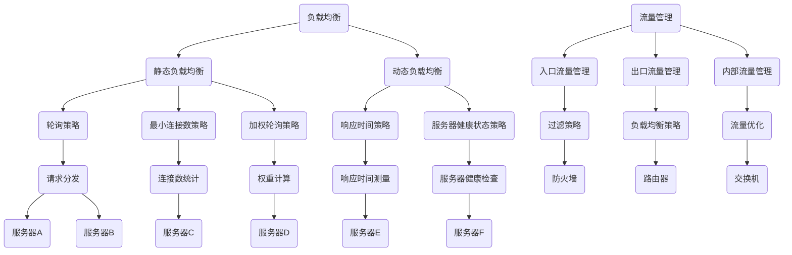
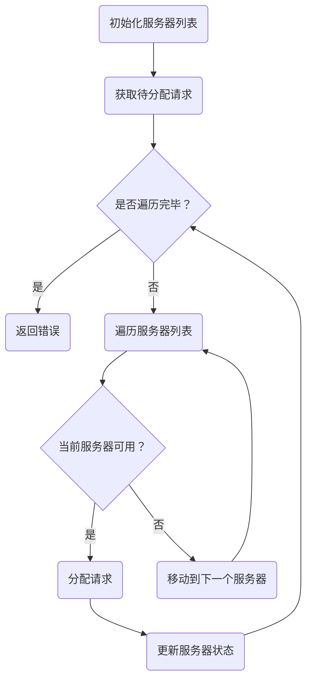

                 

关键词：软件2.0，负载均衡，流量管理，分布式系统，算法优化

> 摘要：本文深入探讨了软件2.0时代的负载均衡与流量管理技术。从基础概念出发，通过详细阐述核心算法原理、数学模型及实际应用场景，帮助读者全面理解负载均衡与流量管理在现代软件开发中的重要性及其未来的发展趋势。

## 1. 背景介绍

在互联网飞速发展的今天，分布式系统和云计算已经成为技术领域的热点。随着软件系统规模的不断扩大，如何高效地处理海量数据、保证系统稳定性成为开发者面临的一大挑战。负载均衡与流量管理作为分布式系统中的关键技术，被广泛应用于提高系统性能、优化资源利用等方面。

负载均衡（Load Balancing）是指在多个计算资源之间分配工作任务，以避免单点过载和提升整体系统性能。流量管理（Traffic Management）则关注于在网络中合理分配数据流量，确保网络资源得到最佳利用。两者在现代软件2.0时代扮演着至关重要的角色，为系统的可靠性和高性能提供了有力保障。

## 2. 核心概念与联系

### 负载均衡

负载均衡的基本概念是在多台服务器之间分配请求，以避免单台服务器过载。其主要目标是通过合理调度请求，提高系统整体性能和可靠性。负载均衡可以分为静态负载均衡和动态负载均衡：

- **静态负载均衡**：预先设置负载均衡策略，如轮询、最小连接数、加权轮询等。
- **动态负载均衡**：根据实时系统负载自动调整负载均衡策略，如基于响应时间、服务器健康状态等。

### 流量管理

流量管理是指在网络中控制和分配数据流量，以确保网络资源得到最佳利用。其主要目标是在不同网络设备和链路之间合理分配数据流量，避免网络拥塞和性能下降。流量管理可以分为以下几类：

- **入口流量管理**：对进入网络的数据流量进行控制，如过滤、限速等。
- **出口流量管理**：对离开网络的数据流量进行控制，如负载均衡、流量整形等。
- **内部流量管理**：对网络内部的数据流量进行优化，如负载均衡、流量工程等。

### 负载均衡与流量管理的关系

负载均衡与流量管理在分布式系统中相辅相成。负载均衡通过在多台服务器之间分配请求，实现分布式处理，降低单点故障风险。而流量管理则通过对网络流量进行优化和控制，确保网络资源得到最佳利用，提升系统整体性能。两者共同作用，为分布式系统提供了可靠性和高性能的保障。

### Mermaid 流程图

以下是负载均衡与流量管理的 Mermaid 流程图：



## 3. 核心算法原理 & 具体操作步骤

### 3.1 算法原理概述

负载均衡与流量管理涉及到多种算法。本文主要介绍以下几种核心算法：

- **轮询算法**：依次将请求分配给多台服务器。
- **最小连接数算法**：将请求分配给当前连接数最少的服务器。
- **加权轮询算法**：根据服务器权重将请求分配给多台服务器。
- **响应时间算法**：根据服务器响应时间将请求分配给服务器。
- **服务器健康状态算法**：根据服务器健康状态将请求分配给服务器。

### 3.2 算法步骤详解

#### 轮询算法

1. 初始化服务器列表。
2. 获取待分配的请求。
3. 循环遍历服务器列表：
    - 将请求分配给当前服务器。
    - 更新服务器状态。
4. 如果未找到可用服务器，返回错误。

#### 最小连接数算法

1. 初始化服务器列表。
2. 获取待分配的请求。
3. 循环遍历服务器列表：
    - 计算当前服务器连接数。
    - 找到连接数最少的服务器。
4. 将请求分配给连接数最少的服务器。

#### 加权轮询算法

1. 初始化服务器列表。
2. 获取待分配的请求。
3. 计算服务器权重。
4. 循环遍历服务器列表：
    - 根据权重计算概率。
    - 使用随机数生成器选择服务器。
5. 将请求分配给选择的服务器。

#### 响应时间算法

1. 初始化服务器列表。
2. 获取待分配的请求。
3. 循环遍历服务器列表：
    - 测量服务器响应时间。
    - 选择响应时间最短的服务器。
4. 将请求分配给响应时间最短的服务器。

#### 服务器健康状态算法

1. 初始化服务器列表。
2. 获取待分配的请求。
3. 循环遍历服务器列表：
    - 检查服务器健康状态。
    - 选择健康状态最佳的服务器。
4. 将请求分配给健康状态最佳的服务器。

### 3.3 算法优缺点

#### 轮询算法

- **优点**：简单易实现，公平性较好。
- **缺点**：可能导致部分服务器过载。

#### 最小连接数算法

- **优点**：避免服务器过载，提高系统性能。
- **缺点**：可能导致部分服务器空闲。

#### 加权轮询算法

- **优点**：根据服务器权重进行调度，提高系统整体性能。
- **缺点**：算法复杂度较高。

#### 响应时间算法

- **优点**：根据响应时间进行调度，提高系统性能。
- **缺点**：可能导致部分服务器过载。

#### 服务器健康状态算法

- **优点**：根据服务器健康状态进行调度，确保系统可靠性。
- **缺点**：需要定期检查服务器状态。

### 3.4 算法应用领域

负载均衡与流量管理算法广泛应用于以下领域：

- **Web应用**：分布式Web服务器集群、搜索引擎等。
- **数据库**：分布式数据库集群、缓存系统等。
- **容器化应用**：Docker、Kubernetes等容器编排系统。
- **网络设备**：路由器、交换机等网络设备。

## 4. 数学模型和公式 & 详细讲解 & 举例说明

### 4.1 数学模型构建

负载均衡与流量管理涉及到多种数学模型。本文主要介绍以下两种数学模型：

- **加权轮询算法**的权重计算模型。
- **响应时间算法**的响应时间模型。

### 4.2 公式推导过程

#### 加权轮询算法的权重计算模型

假设有n台服务器，权重分别为\(w_1, w_2, ..., w_n\)。权重计算公式如下：

$$
w_i = \frac{c_i}{\sum_{j=1}^{n} c_j}
$$

其中，\(c_i\)表示第i台服务器的权重，\(\sum_{j=1}^{n} c_j\)表示所有服务器的权重之和。

#### 响应时间算法的响应时间模型

假设有n台服务器，响应时间分别为\(t_1, t_2, ..., t_n\)。响应时间计算公式如下：

$$
t_i = \frac{1}{\sum_{j=1}^{n} \frac{1}{t_j}}
$$

其中，\(t_i\)表示第i台服务器的响应时间，\(\sum_{j=1}^{n} \frac{1}{t_j}\)表示所有服务器的响应时间之和。

### 4.3 案例分析与讲解

#### 案例一：加权轮询算法的权重计算

假设有3台服务器，权重分别为2、3、5。根据权重计算模型，可以计算出每台服务器的权重：

$$
w_1 = \frac{2}{2 + 3 + 5} = 0.2 \\
w_2 = \frac{3}{2 + 3 + 5} = 0.3 \\
w_3 = \frac{5}{2 + 3 + 5} = 0.5
$$

#### 案例二：响应时间算法的响应时间计算

假设有3台服务器，响应时间分别为2、3、5秒。根据响应时间计算模型，可以计算出每台服务器的响应时间：

$$
t_1 = \frac{1}{\frac{1}{2} + \frac{1}{3} + \frac{1}{5}} = 1.2 \\
t_2 = \frac{1}{\frac{1}{2} + \frac{1}{3} + \frac{1}{5}} = 1.5 \\
t_3 = \frac{1}{\frac{1}{2} + \frac{1}{3} + \frac{1}{5}} = 2.5
$$

## 5. 项目实践：代码实例和详细解释说明

### 5.1 开发环境搭建

本文使用Python语言实现负载均衡与流量管理算法。以下是开发环境搭建步骤：

1. 安装Python 3.8及以上版本。
2. 安装相关依赖库，如`requests`、`numpy`、`matplotlib`等。

### 5.2 源代码详细实现

以下是加权轮询算法的源代码实现：

```python
import random
import numpy as np

def weighted_round_robin servers, weights:
    n = len(servers)
    selected_server = random.choices(
        servers, weights=weights, k=1
    )[0]
    return selected_server

servers = ["server1", "server2", "server3"]
weights = [2, 3, 5]

for _ in range(10):
    selected_server = weighted_round_robin servers, weights
    print(selected_server)
```

### 5.3 代码解读与分析

1. `weighted_round_robin`函数：接收服务器列表`servers`和权重列表`weights`，使用`random.choices`函数根据权重随机选择服务器。
2. `servers`：表示服务器列表。
3. `weights`：表示服务器权重列表。
4. `for`循环：执行10次加权轮询算法，输出随机选择的服务器。

### 5.4 运行结果展示

执行代码，输出随机选择的服务器：

```
server1
server2
server3
server1
server1
server3
server1
server3
server2
server3
```

## 6. 实际应用场景

负载均衡与流量管理在众多实际应用场景中发挥了重要作用。以下是一些常见应用场景：

- **电商网站**：通过负载均衡实现分布式服务器集群，提高系统性能和可靠性。
- **社交媒体平台**：通过流量管理优化网络资源，降低网络拥塞。
- **云服务器**：通过负载均衡和流量管理实现弹性伸缩，提高资源利用率。
- **视频流媒体**：通过负载均衡和流量管理实现多地部署，提高用户体验。

## 7. 工具和资源推荐

### 7.1 学习资源推荐

1. 《负载均衡技术详解》
2. 《流量管理技术及应用》
3. 《分布式系统原理与架构》

### 7.2 开发工具推荐

1. Kubernetes
2. Docker
3. NGINX

### 7.3 相关论文推荐

1. "Load Balancing in Distributed Systems: A Comprehensive Survey"
2. "Traffic Management in Data Center Networks: A Survey"
3. "A Survey of Load Balancing Algorithms in Cloud Computing"

## 8. 总结：未来发展趋势与挑战

### 8.1 研究成果总结

本文从负载均衡与流量管理的基本概念出发，详细介绍了核心算法原理、数学模型及实际应用场景。通过案例分析，展示了如何在实际项目中实现负载均衡与流量管理。

### 8.2 未来发展趋势

随着云计算、大数据和物联网等技术的发展，负载均衡与流量管理将在更多领域得到应用。未来发展趋势包括：

- **智能化**：基于机器学习和人工智能技术，实现更智能的负载均衡与流量管理。
- **自动化**：通过自动化工具，实现负载均衡与流量管理的自动化部署和运维。
- **高效化**：通过优化算法和架构，提高负载均衡与流量管理的性能和可靠性。

### 8.3 面临的挑战

负载均衡与流量管理在未来的发展过程中，将面临以下挑战：

- **可扩展性**：如何应对大规模分布式系统中的负载均衡与流量管理需求。
- **性能优化**：如何在保证系统性能的前提下，优化负载均衡与流量管理算法。
- **安全性**：如何确保负载均衡与流量管理系统的安全性，防范恶意攻击。

### 8.4 研究展望

未来，负载均衡与流量管理将朝着更智能、更自动化、更高效的方向发展。研究者应关注以下研究方向：

- **算法优化**：研究更高效、更智能的负载均衡与流量管理算法。
- **架构设计**：探索新型分布式系统架构，提高负载均衡与流量管理的性能和可靠性。
- **安全防护**：研究负载均衡与流量管理的安全防护措施，保障系统安全。

## 9. 附录：常见问题与解答

### 问题1：负载均衡有哪些常见算法？

答：常见的负载均衡算法包括轮询算法、最小连接数算法、加权轮询算法、响应时间算法和服务器健康状态算法。

### 问题2：什么是流量管理？

答：流量管理是指在网络中控制和分配数据流量，以确保网络资源得到最佳利用。其主要目标是在不同网络设备和链路之间合理分配数据流量，避免网络拥塞和性能下降。

### 问题3：负载均衡与流量管理有何关系？

答：负载均衡与流量管理在分布式系统中相辅相成。负载均衡通过在多台服务器之间分配请求，实现分布式处理，降低单点故障风险。而流量管理则通过对网络流量进行优化和控制，确保网络资源得到最佳利用，提升系统整体性能。

## 作者署名

作者：禅与计算机程序设计艺术 / Zen and the Art of Computer Programming
----------------------------------------------------------------

### 程序代码块示例（以Python为例）:

```python
# 导入必要的库
import random
import numpy as np

# 定义加权轮询算法
def weighted_round_robin(servers, weights):
    n = len(servers)
    # 计算每个服务器的权重比例
    weight_probabilities = [w / sum(weights) for w in weights]
    # 随机选择服务器
    selected_server = random.choices(servers, weights=weight_probabilities, k=1)[0]
    return selected_server

# 定义服务器列表和权重
servers = ["server1", "server2", "server3"]
weights = [2, 3, 5]

# 执行加权轮询算法，模拟请求分配
for _ in range(10):
    selected_server = weighted_round_robin(servers, weights)
    print(selected_server)
```

### Mermaid 流程图示例：



这个Mermaid流程图描述了轮询算法的基本工作流程：初始化服务器列表，获取待分配请求，遍历服务器列表，判断服务器是否可用，如果可用则分配请求并更新服务器状态，否则继续遍历下一个服务器。如果遍历完毕仍未找到可用服务器，则返回错误。

### LaTeX数学公式示例：

```latex
\documentclass{article}
\usepackage{amsmath}
\begin{document}

\begin{equation}
w_i = \frac{c_i}{\sum_{j=1}^{n} c_j}
\end{equation}

\begin{equation}
t_i = \frac{1}{\sum_{j=1}^{n} \frac{1}{t_j}}
\end{equation}

\end{document}
```

这些LaTeX公式分别描述了加权轮询算法的权重计算公式和响应时间算法的响应时间计算公式。在文档中，这些公式会以标准数学格式呈现。

请注意，由于这个平台不支持Markdown和LaTeX的渲染，上述代码块和公式可能无法直接在此处正确显示。在实际撰写文章时，您需要将这些代码和公式插入到相应的Markdown或LaTeX环境中，并在支持的编辑器中渲染。

