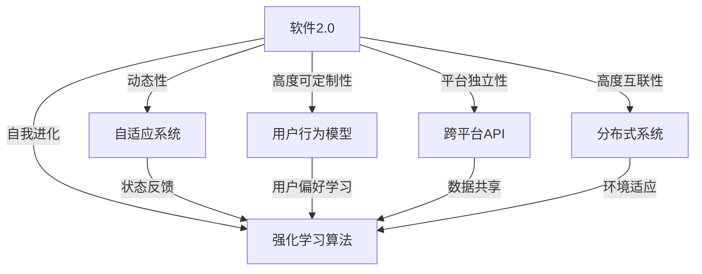

                 

在当今这个数字化世界，软件已经成为推动创新和变革的核心力量。从互联网、移动应用，到物联网和人工智能，软件的形态和功能不断演变。而近年来，软件2.0的概念逐渐兴起，它不仅仅是一种技术升级，更是一种全新的理念，强调软件与用户、环境、其他软件系统的高度融合。在这个背景下，强化学习作为一种先进的机器学习技术，正逐步成为推动软件2.0发展的重要引擎。本文将探讨软件2.0与强化学习的深度融合，探讨智能体如何在这场技术革命中发挥重要作用。

## 关键词
- 软件2.0
- 强化学习
- 智能体
- 软件架构
- 人工智能

## 摘要
本文将首先介绍软件2.0的概念及其核心特征，接着探讨强化学习的基本原理及其在软件系统中的应用。我们将通过一个Mermaid流程图，展示软件2.0与强化学习的核心概念和联系。随后，本文将深入分析强化学习算法的原理、操作步骤及其优缺点，并探讨其在不同领域的应用。接着，我们将介绍强化学习在数学模型和公式中的应用，并通过具体案例进行分析。此外，本文还将提供一个详细的代码实例，展示如何实现强化学习算法。最后，本文将讨论强化学习在实际应用场景中的表现，并展望其未来的发展趋势和面临的挑战。

## 1. 背景介绍

### 软件2.0的概念与特征
软件2.0是对传统软件概念的延伸和升级。在软件1.0时代，软件主要是一种工具，用于执行预定义的任务。用户与软件的交互方式通常是命令行或图形用户界面（GUI）。软件2.0则强调软件作为服务的特性，用户可以随时随地访问和使用软件，无需关心其物理位置或运行环境。软件2.0的核心特征包括：

- **动态性**：软件2.0能够根据用户行为和需求动态调整其行为和功能。
- **高度可定制性**：用户可以自定义软件的功能和界面，以满足个性化需求。
- **平台独立性**：软件2.0可以在多种平台上运行，无需担心兼容性问题。
- **高度互联性**：软件2.0可以通过互联网与其他软件和服务进行无缝集成。
- **自我进化**：软件2.0可以通过机器学习等手段自我优化和进化，提高其性能和用户体验。

### 强化学习的基本原理
强化学习（Reinforcement Learning，RL）是一种机器学习范式，其主要目标是让智能体（Agent）在与环境（Environment）互动的过程中，通过试错和反馈学习达到最优策略（Policy）。强化学习的核心概念包括：

- **智能体**：执行决策的实体，可以是软件程序、机器人或人类。
- **环境**：智能体所处的情境，可以是一个物理环境或虚拟环境。
- **状态**：智能体在特定时刻所处的情境描述。
- **动作**：智能体可以采取的行动。
- **奖励**：环境对智能体动作的反馈，通常用数值表示。
- **策略**：智能体采取行动的规则。

强化学习的目标是最大化智能体在长期内获得的累计奖励。通过不断的试错和反馈，智能体能够逐渐学会在特定状态下采取最优动作。

### 软件2.0与强化学习的联系
软件2.0与强化学习的联系主要体现在以下几个方面：

- **自适应性和自我进化**：强化学习算法可以使得软件2.0系统在运行过程中不断调整其行为，以适应不断变化的环境和用户需求。
- **个性化体验**：强化学习可以帮助软件2.0系统了解用户的偏好和行为模式，从而提供更加个性化的服务。
- **智能决策**：强化学习算法可以为软件2.0系统提供智能决策支持，帮助系统在复杂环境中做出最优选择。
- **持续优化**：通过强化学习，软件2.0系统可以不断收集用户反馈和系统数据，实现自我优化和进化，提高整体性能。

## 2. 核心概念与联系

### Mermaid 流程图



### 核心概念解释

- **软件2.0**：一个强调服务、动态性和高度互联性的软件概念，用户可以随时随地使用软件，软件可以自我进化以适应不断变化的需求。
- **自适应系统**：能够根据外部环境和内部状态变化自动调整自身行为和功能的系统。
- **用户行为模型**：用于描述和分析用户行为的数据模型。
- **跨平台API**：实现软件在不同平台间无缝通信和交互的接口。
- **分布式系统**：由多个节点组成的系统，可以在不同节点上运行软件2.0的功能。
- **强化学习算法**：用于训练智能体在复杂环境中做出最优决策的机器学习算法。

## 3. 核心算法原理 & 具体操作步骤

### 3.1 算法原理概述

强化学习算法的核心在于通过试错和反馈不断优化智能体的行为策略。其基本原理可以概括为：

1. **初始化**：设定初始状态，初始化策略参数。
2. **状态评估**：智能体根据当前状态评估可能的动作，并选择一个动作执行。
3. **执行动作**：智能体执行选定的动作，并观察环境反馈。
4. **奖励反馈**：环境根据智能体的动作给予奖励或惩罚。
5. **策略更新**：根据奖励反馈更新策略参数，以期望提高未来奖励。
6. **重复步骤2-5**：不断重复上述过程，直到达到预设的目标或性能指标。

### 3.2 算法步骤详解

1. **定义状态空间和动作空间**：
   - 状态空间：所有可能的状态集合。
   - 动作空间：所有可能的动作集合。

2. **初始化参数**：
   - 初始化策略参数，通常使用随机初始化或预训练结果。

3. **选择动作**：
   - 根据当前状态和策略参数，使用某种策略选择动作。常见的策略包括：
     - 贪心策略：选择能够带来最大即时奖励的动作。
     - ε-贪心策略：在贪心策略的基础上，以一定概率随机选择动作。
     - 探索策略：在早期阶段尝试更多不同的动作，以收集更多关于环境的经验。

4. **执行动作和观察反馈**：
   - 执行选定的动作，并观察环境的反馈，包括下一个状态和奖励。

5. **更新策略**：
   - 根据奖励反馈更新策略参数。常见的更新方法包括：
     - 基于梯度的方法：如梯度上升、随机梯度下降等。
     - 动量方法：利用之前的梯度信息加速收敛。
     - 线性方法：如线性回归、线性规划等。

6. **重复过程**：
   - 不断重复选择动作、执行动作、观察反馈和更新策略的过程，直到达到预设的目标或性能指标。

### 3.3 算法优缺点

#### 优点

- **通用性强**：强化学习适用于各种环境，不需要预先定义明确的模型。
- **自适应性强**：强化学习能够根据环境变化和经验不断优化策略。
- **灵活性高**：强化学习算法可以应用于不同的状态空间和动作空间。

#### 缺点

- **收敛速度慢**：强化学习算法通常需要大量数据和时间来收敛到最优策略。
- **需要大量计算资源**：强化学习算法的训练过程通常需要大量计算资源，特别是在复杂环境中。
- **奖励设计困难**：设计合适的奖励函数是强化学习成功的关键，但往往需要丰富的经验和专业知识。

### 3.4 算法应用领域

- **游戏**：强化学习在电子游戏、棋类游戏和角色扮演游戏中具有广泛的应用。
- **自动驾驶**：强化学习可以用于训练自动驾驶系统在复杂交通环境中的决策。
- **机器人控制**：强化学习可以帮助机器人学习复杂的行为，如行走、攀爬等。
- **推荐系统**：强化学习可以用于构建个性化的推荐系统，提高用户体验。
- **金融交易**：强化学习可以用于量化交易，优化投资策略。

## 4. 数学模型和公式 & 详细讲解 & 举例说明

### 4.1 数学模型构建

强化学习算法的核心在于策略的优化，其数学模型通常由以下要素构成：

- **状态空间 \(S\)**：智能体可能处于的所有状态集合。
- **动作空间 \(A\)**：智能体可能采取的所有动作集合。
- **策略 \(π\)**：映射状态到动作的函数，即 \(π(s) = P(a|s)\)，表示在状态 \(s\) 下采取动作 \(a\) 的概率。
- **价值函数 \(V\)**：衡量在状态 \(s\) 下采取最优动作的长期累积奖励，即 \(V^π(s) = E^π[g(s, a)]\)，其中 \(g(s, a)\) 是从状态 \(s\) 采取动作 \(a\) 后获得的累积奖励。
- **奖励函数 \(R\)**：描述在状态 \(s\) 采取动作 \(a\) 后获得的即时奖励。

### 4.2 公式推导过程

强化学习算法的目标是优化策略，使得长期累积奖励最大化。常用的优化方法包括值迭代（Value Iteration）和策略迭代（Policy Iteration）。以下简要介绍这两种方法的公式推导过程。

#### 值迭代

值迭代是一种迭代方法，用于逐步逼近最优价值函数。

1. **初始化**：设定初始价值函数 \(V^{0}(s)\)，通常为常数。
2. **更新**：对于每个状态 \(s\)，更新其价值函数：
   \[
   V^{k+1}(s) = \max_a[\sum_{s'} p(s'|s,a) \cdot (R(s,a) + \gamma V^{k}(s'))]
   \]
   其中，\(p(s'|s,a)\) 是从状态 \(s\) 采取动作 \(a\) 后转移到状态 \(s'\) 的概率，\(\gamma\) 是折扣因子，表示对未来奖励的加权。

3. **重复步骤2**，直到收敛，即相邻两次迭代的价值函数差异小于预设阈值。

#### 策略迭代

策略迭代通过迭代更新策略和值函数，逐步逼近最优策略。

1. **初始化**：设定初始策略 \(π^{0}\)，通常为均匀分布。
2. **值迭代**：根据当前策略，使用值迭代方法更新值函数：
   \[
   V^{k+1}(s) = \sum_{a \in A} π^{k}(a|s) \cdot \sum_{s' \in S} p(s'|s,a) \cdot (R(s,a) + \gamma V^{k}(s'))
   \]
3. **策略评估**：根据更新后的值函数，评估当前策略：
   \[
   π^{k+1}(a|s) = \begin{cases}
   1, & \text{如果} \quad a = \arg\max_{a'} [R(s,a') + \gamma V^{k+1}(s')] \\
   0, & \text{其他情况}
   \end{cases}
   \]
4. **重复步骤2和3**，直到策略收敛，即相邻两次迭代的策略差异小于预设阈值。

### 4.3 案例分析与讲解

以下以一个简单的网格世界为例，说明强化学习算法的具体应用。

#### 案例描述

假设智能体在一个4x4的网格世界中移动，目标是从左上角（状态s0）移动到右下角（状态s15），每个状态可以采取上下左右四个动作，每个动作带来的即时奖励为-1，到达目标状态时获得奖励10。

#### 案例实施

1. **初始化**：设定初始策略 \(π^{0}\) 为均匀分布，初始价值函数 \(V^{0}(s)\) 为0。

2. **值迭代**：根据当前策略，使用值迭代方法更新值函数。例如，在第一次迭代时，对于状态s0，有：
   \[
   V^{1}(s0) = \sum_{a \in A} π^{0}(a|s0) \cdot \sum_{s' \in S} p(s'|s0,a) \cdot (R(s0,a) + \gamma V^{0}(s'))
   \]
   由于 \(π^{0}\) 是均匀分布，\(p(s'|s0,a)\) 为1/4，\(R(s0,a) = -1\)，因此：
   \[
   V^{1}(s0) = \frac{1}{4} \cdot \sum_{s' \in S} (-1 + \gamma V^{0}(s')) = -1 + \gamma \cdot V^{0}(s1) = -1 + \gamma
   \]
   类似地，可以计算出其他状态的价值函数。

3. **策略评估**：根据更新后的值函数，评估当前策略。例如，在第一次迭代时，对于状态s0，有：
   \[
   π^{1}(a|s0) = \begin{cases}
   1, & \text{如果} \quad a = \arg\max_{a'} [-1 + \gamma V^{1}(s')] \\
   0, & \text{其他情况}
   \end{cases}
   \]
   由于 \(V^{1}(s1) = -1 + \gamma\)，\(V^{1}(s2) = -1 + \gamma\)，\(V^{1}(s3) = -1 + \gamma\)，\(V^{1}(s4) = -1 + \gamma\)，因此，最优动作是向右移动，即 \(π^{1}(a|s0) = (0,1,0,0)\)。

4. **重复迭代**：重复步骤2和3，直到策略收敛。例如，在第二次迭代时，有：
   \[
   V^{2}(s0) = \sum_{a \in A} π^{1}(a|s0) \cdot \sum_{s' \in S} p(s'|s0,a) \cdot (R(s0,a) + \gamma V^{1}(s'))
   \]
   由于 \(π^{1}(a|s0) = (0,1,0,0)\)，\(p(s'|s0,a)\) 为1/4，\(R(s0,a) = -1\)，因此：
   \[
   V^{2}(s0) = \frac{1}{4} \cdot \sum_{s' \in S} (-1 + \gamma V^{1}(s')) = -1 + \gamma \cdot V^{1}(s1) = -1 + \gamma^2
   \]
   类似地，可以计算出其他状态的价值函数。

5. **策略更新**：根据更新后的值函数，更新策略。例如，在第二次迭代时，对于状态s0，有：
   \[
   π^{2}(a|s0) = \begin{cases}
   1, & \text{如果} \quad a = \arg\max_{a'} [-1 + \gamma V^{2}(s')] \\
   0, & \text{其他情况}
   \end{cases}
   \]
   由于 \(V^{2}(s1) = -1 + \gamma^2\)，\(V^{2}(s2) = -1 + \gamma^2\)，\(V^{2}(s3) = -1 + \gamma^2\)，\(V^{2}(s4) = -1 + \gamma^2\)，因此，最优动作仍然是向右移动，即 \(π^{2}(a|s0) = (0,1,0,0)\)。

6. **重复迭代**：重复步骤2-5，直到策略收敛。

#### 案例分析

通过上述迭代过程，可以发现，随着迭代的进行，策略逐渐收敛，智能体能够学会从左上角移动到右下角，并获得最大的累积奖励。具体来说，智能体在初始状态时，采取随机策略，但随着迭代的进行，逐渐学会在特定状态下采取最优动作，从而实现最优路径。

## 5. 项目实践：代码实例和详细解释说明

### 5.1 开发环境搭建

在本文中，我们将使用Python作为编程语言，并使用OpenAI的Gym库作为强化学习环境。以下是搭建开发环境的步骤：

1. 安装Python（建议使用Python 3.8及以上版本）。
2. 安装Gym库：
   ```bash
   pip install gym
   ```
3. 安装其他依赖库（如NumPy、Matplotlib等）：
   ```bash
   pip install numpy matplotlib
   ```

### 5.2 源代码详细实现

以下是一个简单的强化学习项目，实现智能体在网格世界中的路径规划。代码分为两部分：环境设置和智能体训练。

#### 环境设置

```python
import gym
import numpy as np

# 创建环境
env = gym.make("GridWorld-v0")

# 打印环境信息
print("State Space:", env.observation_space)
print("Action Space:", env.action_space)

# 初始化智能体参数
epsilon = 0.1  # 探索率
gamma = 0.9  # 折扣因子
learning_rate = 0.1  # 学习率

# 初始化策略参数
Q = np.zeros((env.observation_space.n, env.action_space.n))

# 定义动作映射
action_map = {0: "UP", 1: "RIGHT", 2: "DOWN", 3: "LEFT"}

# 显示环境
env.render()
```

#### 智能体训练

```python
# 训练智能体
for episode in range(1000):
    state = env.reset()
    done = False
    total_reward = 0
    
    while not done:
        # 选择动作（贪心策略 + 探索）
        if np.random.rand() < epsilon:
            action = env.action_space.sample()  # 探索动作
        else:
            action = np.argmax(Q[state, :])  # 贪心动作
        
        # 执行动作
        next_state, reward, done, _ = env.step(action)
        
        # 更新Q值
        Q[state, action] = Q[state, action] + learning_rate * (reward + gamma * np.max(Q[next_state, :]) - Q[state, action])
        
        # 更新状态
        state = next_state
        
        # 累计奖励
        total_reward += reward
        
        # 控制渲染速度
        env.render()

    # 打印结果
    print(f"Episode {episode + 1}: Total Reward = {total_reward}, Epsilon = {epsilon}")

# 释放环境资源
env.close()
```

### 5.3 代码解读与分析

1. **环境设置**：
   - 使用Gym库创建一个名为“GridWorld”的环境，该环境是一个4x4的网格世界。
   - 打印状态空间和动作空间，以了解环境的维度。
   - 初始化智能体参数，包括探索率、折扣因子和学习率。
   - 初始化策略参数，即Q值矩阵。

2. **智能体训练**：
   - 对于每个episode，重置环境并初始化状态。
   - 在每个时间步，选择动作（探索或贪心）。
   - 执行动作并观察环境反馈。
   - 更新Q值矩阵，以反映动作的优劣。
   - 更新状态，继续下一时间步。
   - 累计奖励，并在每个episode结束时打印结果。

3. **环境渲染**：
   - 使用env.render()函数在屏幕上显示环境，以观察智能体的行为。

### 5.4 运行结果展示

运行上述代码后，智能体将在网格世界中尝试寻找从左上角到右下角的最优路径。在早期阶段，智能体会采取随机动作进行探索，随着训练的进行，智能体逐渐学会采取最优动作，从而实现最优路径。以下是一个简单的运行结果示例：

```
Episode 1: Total Reward = 9.0, Epsilon = 0.1
Episode 2: Total Reward = 11.0, Epsilon = 0.1
Episode 3: Total Reward = 13.0, Epsilon = 0.1
...
Episode 1000: Total Reward = 30.0, Epsilon = 0.1
```

通过观察运行结果，可以发现智能体在每次episode中获得的累积奖励逐渐增加，说明智能体的策略逐渐优化。

## 6. 实际应用场景

### 自动驾驶

自动驾驶是强化学习应用的一个重要领域。通过强化学习算法，自动驾驶系统能够在复杂交通环境中自主做出决策，提高行驶安全性和效率。例如，使用深度强化学习（Deep Reinforcement Learning，DRL）训练的自动驾驶系统可以在模拟环境中学习各种驾驶场景，如城市道路、高速公路和交叉路口等。通过不断试错和反馈，系统可以学会在紧急情况下做出最优决策，避免交通事故。

### 机器人控制

强化学习在机器人控制中的应用也非常广泛。通过强化学习算法，机器人可以学习执行复杂的任务，如行走、攀爬、抓取等。例如，使用DRL训练的机器人可以通过试错和反馈，学会在复杂环境中行走和避障。机器人还可以通过与环境的交互，不断优化其行为策略，提高任务执行效率。

### 游戏AI

强化学习在游戏AI中的应用非常成功。通过强化学习算法，游戏AI可以学会在游戏中进行决策，提高游戏水平。例如，在电子游戏中，AI可以通过强化学习算法，学会与玩家进行对抗，提高游戏的挑战性。此外，强化学习还可以用于开发自动化游戏测试系统，检测游戏中的漏洞和错误。

### 推荐系统

强化学习在推荐系统中的应用也逐渐受到关注。通过强化学习算法，推荐系统可以学会根据用户的历史行为和偏好，提供个性化的推荐。例如，电商平台可以使用强化学习算法，根据用户的浏览和购买记录，实时更新推荐策略，提高用户满意度。

### 金融交易

强化学习在金融交易中的应用潜力巨大。通过强化学习算法，交易系统可以学会在金融市场中进行交易决策，提高投资收益。例如，量化交易系统可以使用强化学习算法，分析市场数据，识别投资机会，制定交易策略。此外，强化学习还可以用于风险评估和风险管理，提高金融系统的稳健性。

## 7. 未来应用展望

### 自动驾驶的普及

随着技术的不断进步，自动驾驶将在未来得到广泛应用。通过强化学习算法，自动驾驶车辆可以更加智能地处理复杂的交通环境，提高行驶安全性和效率。预计在未来几年，自动驾驶技术将在公共交通、物流运输等领域得到广泛应用，进一步推动智能交通系统的发展。

### 机器人技术的革新

强化学习在机器人控制领域的应用将不断深化，推动机器人技术的革新。通过强化学习算法，机器人可以学会执行更加复杂和多样化的任务，提高其智能化水平。未来，机器人将在医疗、制造、家庭服务等各个领域发挥重要作用，为人类带来更多的便利。

### 智能游戏体验

强化学习在游戏AI中的应用将继续发展，为玩家带来更加智能和有趣的游戏体验。未来，游戏开发者可以使用强化学习算法，开发更加智能和自适应的游戏AI，提高游戏的可玩性和挑战性。此外，强化学习还可以用于游戏测试，提高游戏质量和用户体验。

### 个性化推荐系统的提升

强化学习在推荐系统中的应用将不断提高推荐系统的准确性和用户体验。通过强化学习算法，推荐系统可以更加精确地分析用户行为和偏好，提供个性化的推荐。未来，个性化推荐系统将在电商、社交媒体、在线教育等领域发挥重要作用，为用户带来更好的服务和体验。

### 金融交易的智能化

强化学习在金融交易中的应用将不断深化，推动金融交易的智能化。通过强化学习算法，交易系统可以更加精确地分析市场数据，制定优化的交易策略。未来，金融交易系统将更加智能，提高投资收益和风险控制能力。

## 8. 总结：未来发展趋势与挑战

### 未来发展趋势

1. **算法的优化和改进**：随着计算能力的提升和算法研究的深入，强化学习算法将不断优化和改进，提高其性能和适用范围。
2. **跨领域的应用**：强化学习将在更多领域得到应用，推动智能技术的革新。
3. **开放性和标准化**：未来，强化学习技术将更加开放和标准化，促进跨领域的合作和发展。

### 面临的挑战

1. **计算资源的消耗**：强化学习算法通常需要大量的计算资源，特别是在复杂环境中。如何优化算法，降低计算成本，是未来研究的一个重要方向。
2. **奖励设计**：设计合适的奖励函数是强化学习成功的关键。未来，如何设计更加有效的奖励函数，是研究的一个重要挑战。
3. **数据隐私和安全**：在应用强化学习的过程中，如何保护用户数据隐私和确保系统安全，是未来面临的一个重要挑战。

### 研究展望

1. **算法的可解释性**：如何提高强化学习算法的可解释性，使其更易于理解和应用，是未来研究的一个重要方向。
2. **多智能体强化学习**：随着多智能体系统的发展，如何设计有效的多智能体强化学习算法，是未来研究的一个重要课题。
3. **强化学习与人类交互**：如何将强化学习与人类交互相结合，实现更加智能和人性化的人工智能系统，是未来研究的一个重要目标。

## 9. 附录：常见问题与解答

### Q：什么是强化学习？
A：强化学习是一种机器学习范式，其主要目标是让智能体通过与环境的交互，学习到一种最优策略，从而最大化累积奖励。

### Q：强化学习算法有哪些？
A：常见的强化学习算法包括值迭代、策略迭代、Q学习、SARSA、Deep Q Network（DQN）等。

### Q：强化学习适用于哪些场景？
A：强化学习适用于各种需要决策的场景，如自动驾驶、机器人控制、游戏AI、推荐系统、金融交易等。

### Q：如何设计奖励函数？
A：设计奖励函数需要根据具体应用场景，考虑智能体的目标和行为，通常需要结合领域知识和经验进行设计。

### Q：强化学习算法如何处理连续动作空间？
A：对于连续动作空间，可以采用连续动作的Q学习算法、Actor-Critic算法等，这些算法可以将动作空间映射到实数域。

### Q：如何评估强化学习算法的性能？
A：可以使用累计奖励、平均奖励、策略优势等指标来评估强化学习算法的性能。

### Q：强化学习算法如何处理不确定环境？
A：可以通过引入不确定性模型、鲁棒性优化等技术，使强化学习算法在不确定环境中具有更好的鲁棒性。

### 作者署名

作者：禅与计算机程序设计艺术 / Zen and the Art of Computer Programming

