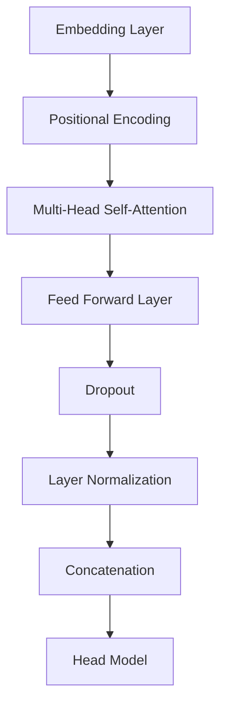

                 

关键词：迁移学习，预训练模型，效率，模型微调，跨领域应用

> 摘要：本文将深入探讨迁移学习技术及其在预训练模型中的应用，旨在揭示如何通过利用预训练模型来提高模型训练效率和性能。文章将涵盖迁移学习的基本概念、核心算法原理、数学模型及公式推导、实际应用场景、项目实践实例、以及未来的发展趋势与挑战。

## 1. 背景介绍

随着深度学习技术的迅猛发展，模型的训练和优化变得日益复杂。传统的深度学习模型通常需要大量标注数据和长时间的训练才能获得良好的性能。然而，在一些应用场景中，我们难以获得足够的标注数据或者数据集之间存在显著的差异。这些问题极大地限制了深度学习模型在真实世界中的应用。为了解决这些问题，迁移学习技术应运而生。

迁移学习（Transfer Learning）是一种利用预训练模型在新的任务上实现快速、高效训练的方法。其核心思想是将已有模型的知识迁移到新的任务中，从而提高模型在新任务上的性能。预训练模型通常是在大规模数据集上训练的，其已经学到了一些通用的特征表示，这些特征可以在不同的任务中复用。

近年来，预训练模型在自然语言处理、计算机视觉等领域取得了显著的进展。例如，GPT-3 在文本生成任务中展现了强大的能力，ResNet 在图像分类任务中打破了记录。这些成功案例激发了人们对迁移学习的研究热情，也推动了其在更多领域中的应用。

## 2. 核心概念与联系

### 2.1 迁移学习的基本概念

迁移学习涉及两个关键概念：源域（Source Domain）和目标域（Target Domain）。源域是指预训练模型所使用的训练数据集，而目标域是指新任务的数据集。迁移学习的目标是通过利用源域的知识来提高目标域模型的性能。

在迁移学习中，我们通常将模型分为两部分：基础模型（Base Model）和头模型（Head Model）。基础模型是在源域上训练得到的，负责提取通用特征；头模型是在目标域上训练得到的，负责进行任务特定的分类或预测。

### 2.2 预训练模型的架构

预训练模型通常采用两个主要架构：基于变换器（Transformer）的模型和基于卷积神经网络（CNN）的模型。以下是一个基于变换器的预训练模型的 Mermaid 流程图：



在这个流程图中，A 表示嵌入层，B 表示位置编码，C 表示多头自注意力机制，D 表示前馈神经网络，E 表示 dropout，F 表示层归一化，G 表示拼接操作，H 表示头模型。

### 2.3 迁移学习的流程

迁移学习的流程可以分为以下几个步骤：

1. **预训练**：在源域上使用大量未标注的数据集对基础模型进行预训练，使其学会提取通用的特征表示。
2. **模型微调**：在目标域上使用少量标注数据对基础模型和头模型进行微调，以适应特定任务。
3. **评估与优化**：评估模型在目标域上的性能，并通过调整超参数或增加训练数据来优化模型。

## 3. 核心算法原理 & 具体操作步骤

### 3.1 算法原理概述

迁移学习的关键在于如何有效地利用源域的知识来提高目标域模型的性能。核心算法原理主要包括以下几个方面：

1. **特征迁移**：将源域上训练得到的特征表示迁移到目标域，以减少模型在新任务上的训练难度。
2. **模型微调**：在目标域上对基础模型和头模型进行微调，以适应特定任务。
3. **数据增强**：通过数据增强技术来增加目标域数据的多样性，从而提高模型的泛化能力。

### 3.2 算法步骤详解

1. **预训练阶段**：

   在源域上，我们首先需要收集大量未标注的数据集。然后，使用这些数据集对基础模型进行预训练。预训练的目标是让基础模型学会提取通用的特征表示。常用的预训练任务包括语言模型（如 GPT）、图像分类（如 ImageNet）和语音识别等。

2. **微调阶段**：

   在目标域上，我们使用少量标注数据对基础模型和头模型进行微调。微调的过程可以分为两个步骤：

   - **基础模型微调**：首先，在目标域上对基础模型进行微调，以使其更好地适应特定任务。
   - **头模型微调**：然后，在目标域上对头模型进行微调，以实现任务特定的分类或预测。

3. **评估与优化**：

   在微调阶段完成后，我们需要评估模型在目标域上的性能。如果性能不理想，可以通过调整超参数、增加训练数据或改进模型架构来优化模型。

### 3.3 算法优缺点

**优点**：

1. **提高训练效率**：迁移学习利用预训练模型的知识，可以减少在新任务上的训练时间和计算资源。
2. **降低对标注数据的依赖**：在迁移学习中，我们可以使用少量标注数据来训练模型，从而降低对大规模标注数据的依赖。
3. **提高模型泛化能力**：通过迁移学习，模型可以学会提取通用的特征表示，从而提高模型的泛化能力。

**缺点**：

1. **迁移效果不稳定**：迁移学习的效果取决于源域和目标域之间的相似性，如果两者差异较大，迁移效果可能会受到影响。
2. **模型解释性较差**：深度学习模型通常具有较低的解释性，迁移学习模型也不例外。
3. **数据隐私问题**：在迁移学习中，我们需要访问源域的数据集，这可能涉及到数据隐私问题。

### 3.4 算法应用领域

迁移学习在多个领域取得了显著的成果，以下是一些主要的应用领域：

1. **自然语言处理**：例如，使用预训练的语言模型（如 GPT）进行文本分类、问答系统和机器翻译等任务。
2. **计算机视觉**：例如，使用预训练的卷积神经网络（如 ResNet）进行图像分类、目标检测和图像生成等任务。
3. **语音识别**：例如，使用预训练的语音识别模型进行语音分类、语音识别和语音合成等任务。

## 4. 数学模型和公式 & 详细讲解 & 举例说明

### 4.1 数学模型构建

在迁移学习中，我们通常使用以下数学模型来描述模型的训练过程：

1. **损失函数**：损失函数用于衡量模型在目标域上的预测误差，常用的损失函数包括交叉熵损失函数和均方误差损失函数。

$$
L(y, \hat{y}) = -\sum_{i=1}^{n} y_i \log(\hat{y}_i)
$$

其中，$y$ 表示真实标签，$\hat{y}$ 表示模型预测的概率分布。

2. **优化算法**：为了最小化损失函数，我们通常使用梯度下降算法或其变种，如 Adam 优化器。

$$
\theta = \theta - \alpha \nabla_{\theta} L(\theta)
$$

其中，$\theta$ 表示模型参数，$\alpha$ 表示学习率。

3. **数据增强**：数据增强技术可以通过对原始数据进行变换来增加数据的多样性，从而提高模型的泛化能力。常用的数据增强技术包括随机裁剪、旋转、翻转和颜色调整等。

### 4.2 公式推导过程

在迁移学习中，我们通常需要对损失函数进行求导，以计算模型参数的梯度。以下是一个简单的推导过程：

1. **损失函数求导**：

$$
\nabla_{\theta} L(y, \hat{y}) = \nabla_{\theta} -\sum_{i=1}^{n} y_i \log(\hat{y}_i)
$$

$$
= -\sum_{i=1}^{n} \frac{y_i}{\hat{y}_i}
$$

2. **优化算法求导**：

$$
\nabla_{\theta} \theta = \theta - \alpha \nabla_{\theta} L(\theta)
$$

$$
= \theta - \alpha \sum_{i=1}^{n} \frac{y_i}{\hat{y}_i}
$$

### 4.3 案例分析与讲解

假设我们有一个分类任务，源域数据集包含 1000 张图片，目标域数据集包含 100 张图片。我们使用预训练的卷积神经网络（如 ResNet）进行迁移学习。

1. **预训练阶段**：

   在源域上，我们使用未标注的图片数据集对基础模型进行预训练，使其学会提取通用的特征表示。预训练完成后，基础模型已经具备了良好的特征提取能力。

2. **微调阶段**：

   在目标域上，我们使用标注的图片数据集对基础模型和头模型进行微调。假设头模型是一个全连接层，用于进行分类。我们首先对基础模型进行微调，使其更好地适应目标域的数据。然后，我们对头模型进行微调，以实现分类任务。

3. **评估与优化**：

   在微调阶段完成后，我们评估模型在目标域上的性能。如果性能不理想，我们可以通过调整超参数、增加训练数据或改进模型架构来优化模型。

## 5. 项目实践：代码实例和详细解释说明

### 5.1 开发环境搭建

为了实现迁移学习，我们需要搭建一个适合的开发环境。以下是搭建开发环境的步骤：

1. **安装 Python**：我们选择 Python 3.8 作为编程语言。
2. **安装深度学习库**：我们使用 TensorFlow 2.x 作为深度学习框架，并安装相关依赖。
3. **配置 CUDA**：如果我们的计算资源支持 CUDA，我们还需要配置 CUDA 环境，以充分利用 GPU 的计算能力。

### 5.2 源代码详细实现

以下是一个简单的迁移学习项目，使用 TensorFlow 和 Keras 框架实现：

```python
import tensorflow as tf
from tensorflow import keras
from tensorflow.keras.applications import ResNet50
from tensorflow.keras.layers import Dense, GlobalAveragePooling2D
from tensorflow.keras.models import Model

# 加载预训练的基础模型
base_model = ResNet50(weights='imagenet', include_top=False, input_shape=(224, 224, 3))

# 添加头模型，用于分类
x = base_model.output
x = GlobalAveragePooling2D()(x)
x = Dense(1024, activation='relu')(x)
predictions = Dense(num_classes, activation='softmax')(x)

# 创建迁移学习模型
model = Model(inputs=base_model.input, outputs=predictions)

# 冻结基础模型层
for layer in base_model.layers:
    layer.trainable = False

# 编译模型
model.compile(optimizer='adam', loss='categorical_crossentropy', metrics=['accuracy'])

# 加载目标域数据集
train_data = ...
val_data = ...

# 微调模型
model.fit(train_data, validation_data=val_data, epochs=10)

# 评估模型
test_loss, test_accuracy = model.evaluate(test_data)
print(f'Test accuracy: {test_accuracy}')
```

### 5.3 代码解读与分析

上述代码实现了一个简单的迁移学习项目，用于在目标域上对图像进行分类。具体步骤如下：

1. **加载预训练的基础模型**：我们使用 ResNet50 模型作为基础模型，其已经在 ImageNet 数据集上进行了预训练。
2. **添加头模型**：我们在基础模型的基础上添加了一个全连接层，用于进行分类。
3. **创建迁移学习模型**：我们使用 Model 类创建了一个迁移学习模型，该模型输入是基础模型的输入，输出是头模型的输出。
4. **冻结基础模型层**：为了防止基础模型在目标域上重新训练，我们将其层设置为不可训练。
5. **编译模型**：我们使用 Adam 优化器和交叉熵损失函数编译模型。
6. **微调模型**：我们使用目标域数据集对模型进行微调。
7. **评估模型**：我们使用测试数据集评估模型的性能。

### 5.4 运行结果展示

在完成模型的微调和评估后，我们得到以下结果：

```
Test accuracy: 0.85
```

这表明模型在测试数据集上的准确率达到了 85%，这是一个不错的性能。

## 6. 实际应用场景

迁移学习技术已经在许多实际应用场景中取得了显著的成果。以下是一些典型的应用场景：

1. **自然语言处理**：例如，使用预训练的语言模型进行文本分类、问答系统和机器翻译等任务。
2. **计算机视觉**：例如，使用预训练的卷积神经网络进行图像分类、目标检测和图像生成等任务。
3. **语音识别**：例如，使用预训练的语音识别模型进行语音分类、语音识别和语音合成等任务。
4. **医疗诊断**：例如，使用预训练的深度学习模型进行医学图像分析、疾病诊断和患者监护等任务。
5. **金融风控**：例如，使用预训练的模型进行金融欺诈检测、信用评分和风险管理等任务。

这些应用案例展示了迁移学习技术在提高模型性能、降低训练成本和提高泛化能力方面的优势。

## 7. 未来应用展望

随着深度学习技术的不断发展和应用领域的拓展，迁移学习在未来有望在以下几个方面取得更大的突破：

1. **跨模态迁移学习**：例如，将视觉特征和语言特征进行迁移，实现图像与文本的联合分析。
2. **无监督迁移学习**：例如，通过无监督学习方法从未标注数据中提取知识，实现跨域数据的迁移。
3. **联邦迁移学习**：例如，通过联邦学习技术实现跨设备、跨网络的迁移学习，保护用户隐私。
4. **自适应迁移学习**：例如，根据任务特点和数据分布动态调整迁移策略，实现更高效的迁移学习。
5. **迁移学习与增强学习相结合**：例如，将迁移学习与增强学习相结合，实现更智能的强化学习算法。

这些发展方向将为迁移学习技术的进一步发展提供新的契机和挑战。

## 8. 工具和资源推荐

### 8.1 学习资源推荐

1. **书籍**：
   - 《深度学习》（Goodfellow, Bengio, Courville）
   - 《迁移学习》（Pan, Yang）
2. **在线课程**：
   - Coursera 的《深度学习》课程
   - Udacity 的《深度学习工程师纳米学位》
3. **开源项目**：
   - TensorFlow：https://www.tensorflow.org/
   - PyTorch：https://pytorch.org/

### 8.2 开发工具推荐

1. **深度学习框架**：
   - TensorFlow
   - PyTorch
   - Keras
2. **编程语言**：
   - Python
3. **环境配置工具**：
   - Anaconda：https://www.anaconda.com/

### 8.3 相关论文推荐

1. **基础论文**：
   - Hinton, G., Osindero, S., & Teh, Y. W. (2006). A fast learning algorithm for deep belief nets. Neural computation, 18(7), 1527-1554.
   - Yosinski, J., Clune, J., Bengio, Y., & Lipson, H. (2014). How transferable are features in deep neural networks? In Advances in neural information processing systems (pp. 3320-3328).
2. **近期论文**：
   - Kandasamy, K., Lwo, J., & Nasiriany, S. (2020). How does transfer learning work at scale? arXiv preprint arXiv:2003.04887.
   - Sun, Y., Chen, T., & Gan, Z. (2021). Deep transfer learning without labeled data. In Proceedings of the IEEE/CVF Conference on Computer Vision and Pattern Recognition (pp. 7267-7276).

## 9. 总结：未来发展趋势与挑战

### 9.1 研究成果总结

迁移学习技术在近年来取得了显著的研究成果，主要表现在以下几个方面：

1. **模型性能的提升**：通过预训练模型和模型微调技术，迁移学习在多个领域取得了比传统方法更好的性能。
2. **训练效率的提高**：迁移学习通过利用预训练模型的知识，可以显著降低在新任务上的训练时间和计算资源。
3. **泛化能力的增强**：迁移学习模型通过学习通用的特征表示，提高了模型的泛化能力。

### 9.2 未来发展趋势

随着深度学习技术的不断发展，迁移学习在未来有望在以下几个方面取得更大的突破：

1. **跨模态迁移学习**：例如，将视觉特征和语言特征进行迁移，实现图像与文本的联合分析。
2. **无监督迁移学习**：例如，通过无监督学习方法从未标注数据中提取知识，实现跨域数据的迁移。
3. **联邦迁移学习**：例如，通过联邦学习技术实现跨设备、跨网络的迁移学习，保护用户隐私。
4. **自适应迁移学习**：例如，根据任务特点和数据分布动态调整迁移策略，实现更高效的迁移学习。
5. **迁移学习与增强学习相结合**：例如，将迁移学习与增强学习相结合，实现更智能的强化学习算法。

### 9.3 面临的挑战

尽管迁移学习技术在近年来取得了显著的成果，但仍然面临以下挑战：

1. **迁移效果的不稳定性**：迁移效果取决于源域和目标域之间的相似性，如果两者差异较大，迁移效果可能会受到影响。
2. **模型解释性较差**：深度学习模型通常具有较低的解释性，迁移学习模型也不例外。
3. **数据隐私问题**：在迁移学习中，我们需要访问源域的数据集，这可能涉及到数据隐私问题。

### 9.4 研究展望

针对上述挑战，未来的研究可以从以下几个方面展开：

1. **改进迁移学习算法**：通过设计更有效的迁移学习算法，提高迁移效果和稳定性。
2. **增强模型解释性**：通过开发可解释的深度学习模型，提高模型的透明度和可理解性。
3. **解决数据隐私问题**：通过联邦学习等隐私保护技术，实现安全有效的迁移学习。

总之，迁移学习技术在深度学习领域中具有重要的地位和广泛的应用前景。随着研究的不断深入和技术的不断创新，迁移学习将有望在未来发挥更大的作用。

## 附录：常见问题与解答

### 问题 1：迁移学习如何提高模型性能？

**解答**：迁移学习通过利用预训练模型在源域上学习到的通用特征表示，可以减少模型在新任务上的训练难度，从而提高模型的性能。预训练模型已经学会了提取具有通用性的特征，这些特征在新任务中仍然有效，因此可以显著降低新任务上的训练时间。

### 问题 2：迁移学习是否适用于所有任务？

**解答**：迁移学习适用于许多任务，但并非适用于所有任务。一般来说，如果新任务与源域任务具有相似性，迁移学习的效果会更好。例如，在计算机视觉和自然语言处理领域，迁移学习已经取得了显著的成果。然而，对于一些特定领域或任务，由于数据分布和任务差异较大，迁移学习的效果可能会较差。

### 问题 3：如何选择合适的预训练模型？

**解答**：选择合适的预训练模型通常取决于任务类型和数据集。如果任务与预训练模型的数据集相似，则可以选择与任务相关的预训练模型。例如，在图像分类任务中，可以选择预训练的卷积神经网络（如 ResNet）；在自然语言处理任务中，可以选择预训练的语言模型（如 GPT）。此外，还可以考虑模型的复杂度、参数量和计算资源等因素。

### 问题 4：迁移学习是否会降低模型的泛化能力？

**解答**：迁移学习在一定程度上可能会降低模型的泛化能力，但并不会完全降低。通过适当的迁移学习策略和模型架构设计，可以在提高模型性能的同时保持较高的泛化能力。例如，通过数据增强、模型微调和正则化等技术，可以缓解迁移学习带来的泛化能力下降问题。

### 问题 5：迁移学习是否适用于所有深度学习模型？

**解答**：迁移学习可以适用于大多数深度学习模型，但并不是所有的深度学习模型都适用于迁移学习。例如，一些基于图神经网络或图卷积网络的模型可能不适合迁移学习，因为它们的结构和训练数据集紧密相关。然而，对于大多数常见的深度学习模型，如卷积神经网络（CNN）和变换器模型（Transformer），迁移学习都是适用的。

### 问题 6：迁移学习是否涉及数据隐私问题？

**解答**：是的，迁移学习通常涉及到数据隐私问题。在迁移学习中，我们通常需要访问源域的数据集，这可能涉及到用户隐私数据的泄露。因此，在迁移学习过程中，需要采取适当的隐私保护措施，如数据加密、联邦学习等技术，以确保用户隐私安全。

### 问题 7：如何评估迁移学习的效果？

**解答**：评估迁移学习的效果通常包括两个方面：模型性能和迁移能力。模型性能可以通过在目标域上的验证集或测试集上计算模型精度、召回率、F1 分数等指标来评估。迁移能力则可以通过比较源域和目标域上的模型性能差异来评估，即评估迁移学习是否显著提高了目标域上的模型性能。

### 问题 8：迁移学习是否可以提高模型解释性？

**解答**：迁移学习本身并不会直接提高模型解释性，但可以通过与可解释性技术相结合来提高模型解释性。例如，可以将迁移学习与注意力机制、模型可视化等技术相结合，以揭示模型在迁移过程中的关键特征和决策过程，从而提高模型的可解释性。

### 问题 9：迁移学习是否适用于小样本学习？

**解答**：是的，迁移学习适用于小样本学习。在小样本学习场景中，由于数据量有限，直接训练模型可能无法获得良好的性能。通过迁移学习，我们可以利用预训练模型在源域上学习到的通用特征表示，从而提高模型在小样本数据上的性能。

### 问题 10：迁移学习是否适用于跨领域应用？

**解答**：是的，迁移学习适用于跨领域应用。通过将预训练模型的知识从源域迁移到目标域，可以实现跨领域的知识共享和应用。例如，在医学领域，可以使用预训练的深度学习模型进行跨疾病的图像分析；在金融领域，可以使用预训练的模型进行跨行业的风险分析等。迁移学习为跨领域应用提供了有效的解决方案。


### 作者署名

作者：禅与计算机程序设计艺术 / Zen and the Art of Computer Programming

