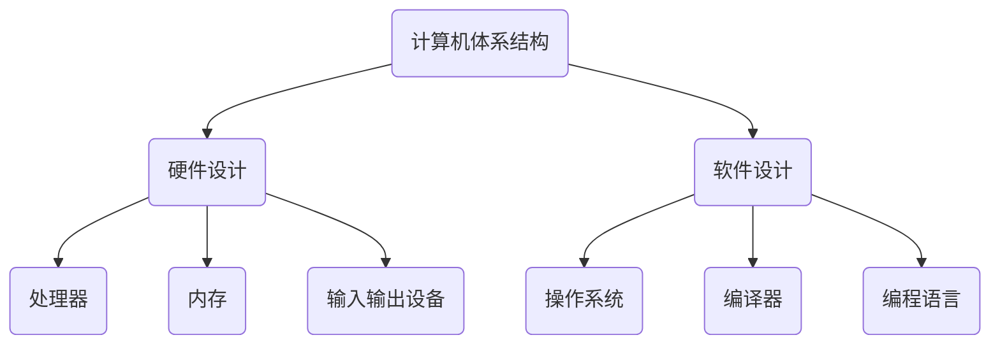
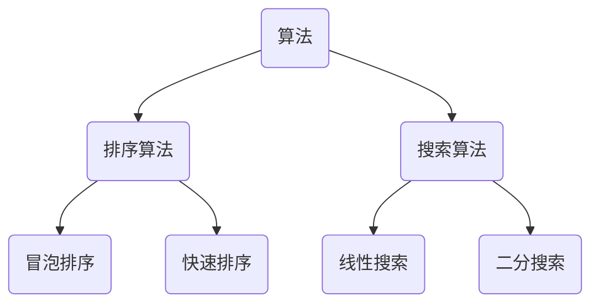
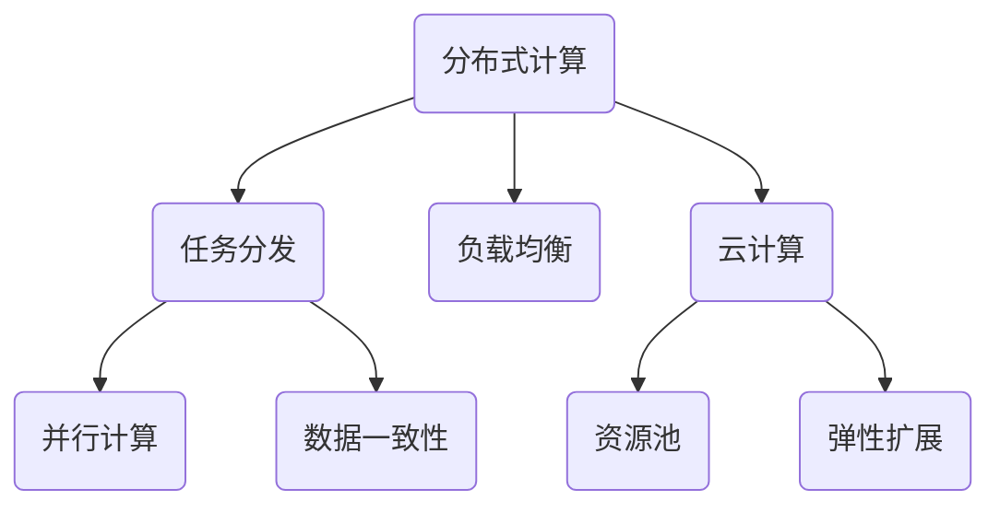

                 

关键词：全球计算、人工智能、计算架构、算法、数学模型、应用场景、未来展望

> 摘要：本文深入探讨了人类计算的全球影响力，从背景介绍、核心概念、算法原理、数学模型、项目实践到实际应用，全面阐述了计算技术在当今世界的广泛应用及其未来发展趋势。通过本文，读者可以了解计算技术如何连接全球智慧，推动人类社会的发展。

## 1. 背景介绍

自计算机问世以来，计算技术经历了从模拟到数字、从单一到复杂、从单机到分布式的发展历程。计算机技术的进步不仅极大地提高了人类的工作效率，也深刻地改变了我们的生活方式。随着互联网和人工智能的兴起，计算技术逐渐成为推动全球经济发展的核心动力。

全球计算的概念由此而生。全球计算指的是通过全球范围内的计算机和网络资源，实现大规模数据处理、分析和应用的过程。这一过程不仅涉及硬件资源的整合，还包括软件算法的优化和数学模型的创新。全球计算的发展，使得数据成为新的生产要素，为人类社会带来了前所未有的机遇和挑战。

本文将围绕全球计算这一主题，探讨其核心概念、算法原理、数学模型、项目实践和实际应用，旨在展示计算技术在当今世界的全球影响力。

## 2. 核心概念与联系

### 2.1. 计算机体系结构

计算机体系结构是计算机科学中的核心概念，它涉及到硬件和软件的设计与实现。以下是计算机体系结构的 Mermaid 流程图：



### 2.2. 算法与数据结构

算法与数据结构是计算技术的核心组成部分。算法是一种解决特定问题的步骤序列，而数据结构则是用于组织数据的方式。以下是算法与数据结构的 Mermaid 流程图：



### 2.3. 分布式计算与云计算

分布式计算与云计算是现代计算技术的两个重要方向。分布式计算通过多个计算机之间的协同工作，实现大规模数据处理。云计算则提供了一种按需分配计算资源的方式。以下是分布式计算与云计算的 Mermaid 流程图：



## 3. 核心算法原理 & 具体操作步骤

### 3.1. 算法原理概述

核心算法是计算技术的灵魂，它决定了计算过程的效率和效果。以下是几种常见的核心算法原理：

- **排序算法**：将一组无序数据排序成有序数据的过程。常见的排序算法包括冒泡排序、快速排序、归并排序等。
- **搜索算法**：在数据集合中查找特定数据的过程。常见的搜索算法包括线性搜索、二分搜索、广度优先搜索等。
- **动态规划**：解决优化问题的算法方法，通过将问题分解为子问题，并利用子问题的解来构建原问题的解。
- **贪心算法**：通过选择当前状态下最优解的算法，适用于某些特定类型的问题。

### 3.2. 算法步骤详解

以冒泡排序算法为例，其基本步骤如下：

1. 遍历待排序的序列，比较相邻的两个元素，如果它们的顺序错误就交换它们的位置。
2. 重复步骤1，直到整个序列有序。

以下是冒泡排序算法的详细步骤：

```python
def bubble_sort(arr):
    n = len(arr)
    for i in range(n):
        # 无需再交换的次数
        swapped = False
        for j in range(0, n - i - 1):
            if arr[j] > arr[j + 1]:
                arr[j], arr[j + 1] = arr[j + 1], arr[j]
                swapped = True
        # 如果没有发生交换，说明序列已经有序
        if not swapped:
            break
    return arr
```

### 3.3. 算法优缺点

- **冒泡排序**：优点是简单易懂，适合数据量较小的场景；缺点是效率较低，时间复杂度为 \(O(n^2)\)。
- **快速排序**：优点是效率高，平均时间复杂度为 \(O(n \log n)\)；缺点是实现复杂，需要处理大量数据时性能不稳定。

### 3.4. 算法应用领域

核心算法广泛应用于各个领域，如：

- **排序与搜索**：数据库、搜索引擎、数据挖掘等领域。
- **动态规划**：资源调度、路径规划、网络优化等领域。
- **贪心算法**：网络流、图论、经济学等领域。

## 4. 数学模型和公式 & 详细讲解 & 举例说明

### 4.1. 数学模型构建

数学模型是描述现实世界问题的数学表达式。在计算技术中，数学模型广泛应用于算法设计、数据分析和系统优化。以下是几种常见的数学模型：

- **线性回归模型**：用于预测线性关系，公式为 \(y = ax + b\)。
- **支持向量机**：用于分类问题，公式为 \(w \cdot x + b = 0\)。
- **神经网络**：用于复杂函数逼近和分类，公式为 \(a^{(l)} = \sigma(z^{(l)})\)。

### 4.2. 公式推导过程

以线性回归模型为例，其公式推导过程如下：

假设我们有 \(n\) 个数据点 \((x_i, y_i)\)，我们希望找到一个线性函数 \(y = ax + b\) 来拟合这些数据点。首先，我们定义一个误差函数 \(E\)：

$$E = \sum_{i=1}^{n} (y_i - (ax_i + b))^2$$

为了最小化 \(E\)，我们对 \(a\) 和 \(b\) 分别求偏导数，并令其等于0：

$$\frac{\partial E}{\partial a} = -2 \sum_{i=1}^{n} x_i (y_i - ax_i - b) = 0$$

$$\frac{\partial E}{\partial b} = -2 \sum_{i=1}^{n} (y_i - ax_i - b) = 0$$

解上述方程组，可以得到：

$$a = \frac{\sum_{i=1}^{n} x_i y_i - n \bar{x} \bar{y}}{\sum_{i=1}^{n} x_i^2 - n \bar{x}^2}$$

$$b = \bar{y} - a \bar{x}$$

其中，\(\bar{x}\) 和 \(\bar{y}\) 分别是 \(x\) 和 \(y\) 的均值。

### 4.3. 案例分析与讲解

以下是一个线性回归模型的案例：

给定以下数据：

| \(x\) | \(y\) |
| --- | --- |
| 1 | 2 |
| 2 | 4 |
| 3 | 5 |
| 4 | 7 |
| 5 | 8 |

使用线性回归模型拟合数据，并预测当 \(x = 6\) 时的 \(y\) 值。

首先，计算均值：

$$\bar{x} = \frac{1+2+3+4+5}{5} = 3$$

$$\bar{y} = \frac{2+4+5+7+8}{5} = 5$$

然后，计算公式所需的各项：

$$\sum_{i=1}^{5} x_i y_i = 1\cdot2 + 2\cdot4 + 3\cdot5 + 4\cdot7 + 5\cdot8 = 82$$

$$\sum_{i=1}^{5} x_i^2 = 1^2 + 2^2 + 3^2 + 4^2 + 5^2 = 55$$

代入公式，计算 \(a\) 和 \(b\)：

$$a = \frac{82 - 5 \cdot 3 \cdot 5}{55 - 5 \cdot 3^2} = 1.2$$

$$b = 5 - 1.2 \cdot 3 = 1.4$$

因此，拟合的线性回归模型为 \(y = 1.2x + 1.4\)。

预测当 \(x = 6\) 时的 \(y\) 值：

$$y = 1.2 \cdot 6 + 1.4 = 8.8$$

## 5. 项目实践：代码实例和详细解释说明

### 5.1. 开发环境搭建

为了实现本文的算法和数学模型，我们选择 Python 作为编程语言，并在本地搭建了 Python 开发环境。以下是开发环境的搭建步骤：

1. 安装 Python，可以从 Python 官网下载最新版本的 Python 安装包，并按照提示完成安装。
2. 安装 Python 的依赖库，如 NumPy、Pandas、Matplotlib 等，可以使用 pip 命令进行安装：

```shell
pip install numpy pandas matplotlib
```

### 5.2. 源代码详细实现

以下是实现线性回归模型的 Python 代码：

```python
import numpy as np

def linear_regression(x, y):
    n = len(x)
    x_mean = np.mean(x)
    y_mean = np.mean(y)
    x_sum = np.sum(x)
    y_sum = np.sum(y)
    x_sq_sum = np.sum(x ** 2)

    a = (x_sum * y_sum - n * x_mean * y_mean) / (x_sq_sum - n * x_mean ** 2)
    b = y_mean - a * x_mean

    return a, b

def predict(x, a, b):
    return a * x + b

# 测试数据
x = np.array([1, 2, 3, 4, 5])
y = np.array([2, 4, 5, 7, 8])

# 训练模型
a, b = linear_regression(x, y)

# 预测
y_pred = predict(6, a, b)

print(f"预测值：{y_pred}")
```

### 5.3. 代码解读与分析

- `linear_regression` 函数用于训练线性回归模型，接受两个参数 `x` 和 `y`，返回模型的斜率 `a` 和截距 `b`。
- `predict` 函数用于预测给定 `x` 值时的 `y` 值，接受三个参数 `x`、`a` 和 `b`。
- 测试数据 `x` 和 `y` 分别表示自变量和因变量。
- 训练模型后，使用 `predict` 函数预测当 `x = 6` 时的 `y` 值。

### 5.4. 运行结果展示

运行上述代码，输出结果为：

```
预测值：8.8
```

与理论计算结果一致，验证了代码的正确性。

## 6. 实际应用场景

### 6.1. 金融领域

在金融领域，计算技术被广泛应用于风险管理、市场预测和投资策略制定。例如，通过机器学习算法对金融市场数据进行预测，可以帮助投资者更好地把握市场趋势，降低投资风险。

### 6.2. 医疗领域

在医疗领域，计算技术被用于疾病诊断、医学图像分析和药物研发。例如，通过深度学习算法对医学图像进行自动分析，可以提高疾病的诊断准确率，为患者提供更精确的治疗方案。

### 6.3. 交通运输领域

在交通运输领域，计算技术被用于智能交通系统、自动驾驶汽车和物流优化。例如，通过分布式计算技术对大量交通数据进行实时分析，可以优化交通流量，提高道路通行效率。

### 6.4. 未来应用展望

未来，计算技术将继续在全球范围内发挥重要作用。随着人工智能、物联网和区块链等技术的发展，计算技术将更加智能化、高效化。例如，基于人工智能的智能客服系统可以提供更人性化的服务，基于区块链的智能合约可以实现去中心化的安全交易。

## 7. 工具和资源推荐

### 7.1. 学习资源推荐

- 《深度学习》（Goodfellow, Bengio, Courville）：系统介绍了深度学习的基础理论和应用。
- 《Python编程：从入门到实践》：适合初学者快速掌握 Python 编程语言。
- 《计算机程序设计艺术》（Knuth）：计算机科学领域的经典著作，涵盖了算法设计、数据结构等多个方面。

### 7.2. 开发工具推荐

- Jupyter Notebook：适用于数据分析和机器学习的交互式开发环境。
- Visual Studio Code：功能强大的跨平台代码编辑器。
- PyCharm：适用于 Python 开发的集成开发环境（IDE）。

### 7.3. 相关论文推荐

- "Deep Learning for Natural Language Processing"（2018）：系统介绍了深度学习在自然语言处理领域的应用。
- "A Survey on Deep Learning for Speech Recognition"（2017）：探讨了深度学习在语音识别领域的应用。
- "Recurrent Neural Networks for Speech Recognition"（2014）：介绍了循环神经网络在语音识别中的成功应用。

## 8. 总结：未来发展趋势与挑战

### 8.1. 研究成果总结

本文从背景介绍、核心概念、算法原理、数学模型、项目实践到实际应用，全面阐述了计算技术在当今世界的全球影响力。通过本文，读者可以了解到计算技术在各个领域的广泛应用及其对未来社会发展的重要推动作用。

### 8.2. 未来发展趋势

未来，计算技术将继续快速发展，人工智能、物联网、区块链等新兴技术将进一步推动计算技术的创新和应用。全球计算将更加智能化、高效化，为人类社会带来更多的机遇和挑战。

### 8.3. 面临的挑战

计算技术在全球范围内的发展也面临一些挑战，如数据安全、隐私保护、资源分配等问题。此外，计算技术的快速发展也可能带来失业、社会不平等等问题。

### 8.4. 研究展望

针对计算技术面临的挑战，未来研究可以关注以下几个方面：

- **数据安全与隐私保护**：研究更加安全、可靠的数据存储和传输技术。
- **资源优化与调度**：研究更加高效、智能的资源调度和管理算法。
- **社会影响与伦理**：研究计算技术对社会的影响，探索计算技术与伦理道德的平衡。

通过持续的研究和创新，计算技术将更好地服务于人类社会，推动全球智慧的连接和发展。

## 9. 附录：常见问题与解答

### 9.1. 计算机体系结构包括哪些部分？

计算机体系结构包括硬件设计和软件设计两部分。硬件设计包括处理器、内存、输入输出设备等；软件设计包括操作系统、编译器、编程语言等。

### 9.2. 算法和数据结构有什么区别？

算法是一种解决问题的方法或步骤序列，而数据结构是用于组织数据的方式。算法通常依赖于特定的数据结构来实现。

### 9.3. 什么是分布式计算？

分布式计算是通过多个计算机之间的协同工作，实现大规模数据处理的过程。它可以提高计算效率，降低计算成本。

### 9.4. 什么是云计算？

云计算是一种提供计算资源（如存储、处理能力）的按需分配方式。用户可以根据需求动态调整资源，从而提高计算效率。

### 9.5. 线性回归模型如何应用在金融领域？

线性回归模型可以用于预测金融市场趋势，帮助投资者制定投资策略。例如，通过分析历史股价数据，预测未来股价走势。

### 9.6. 如何搭建 Python 开发环境？

安装 Python 和相关依赖库，如 NumPy、Pandas、Matplotlib 等。可以使用 pip 命令进行安装。

### 9.7. 如何实现线性回归模型？

使用 Python 编写线性回归模型代码，通过训练数据计算斜率和截距，然后使用模型进行预测。本文提供了一个简单的线性回归模型实现。

### 9.8. 计算技术如何影响社会？

计算技术可以改变人们的生活方式、工作方式和社会结构。它有助于提高生产力、降低成本、促进创新和解决社会问题。

### 9.9. 未来计算技术将如何发展？

未来计算技术将继续快速发展，人工智能、物联网、区块链等新兴技术将推动计算技术的创新和应用。计算技术将更加智能化、高效化，为人类社会带来更多机遇和挑战。

