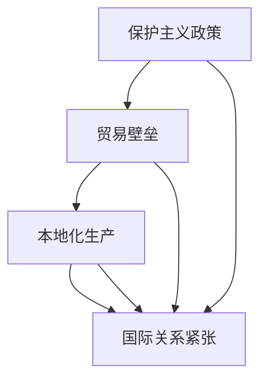

                 

关键词：逆全球化、国际贸易、跨国企业、政治因素、经济影响、技术创新、供应链重构、政治风险、社会动态、全球治理

## 摘要

逆全球化是当今世界面临的一个重要现象，它不仅改变了国际贸易和投资的格局，也深刻影响了全球经济和社会的发展。本文旨在探讨逆全球化抬头的原因及其对全球经济的广泛影响。文章首先介绍了逆全球化的概念及其历史背景，然后深入分析了导致逆全球化现象的多重因素，包括政治、经济和社会层面。此外，本文还讨论了逆全球化对国际贸易、跨国企业和全球供应链的深远影响，并提出了应对这一挑战的策略和建议。最后，文章对未来逆全球化趋势的发展进行了展望，强调了在全球化与逆全球化交织的未来中，国际合作与政策协调的重要性。

## 1. 背景介绍

### 逆全球化的定义与发展历程

逆全球化，又称反全球化，指的是全球化和国际化的趋势逆转，国家和地区的经济政策倾向于减少对外开放，增加贸易壁垒和保护主义措施。逆全球化并非一个新鲜现象，它有着悠久的历史。自二战后初期以来，全球化进程一直稳步推进，国际经济合作、跨国投资和全球供应链的建立为全球经济带来了前所未有的增长和发展。然而，随着全球化进程的不断深化，其负面影响也逐渐显现，包括失业率上升、收入不均和社会动荡等问题。

逆全球化的现象在20世纪80年代末和90年代初开始有所抬头。当时，许多国家为了应对国内经济问题和政治压力，开始采取保护主义政策，如提高关税、实施贸易限制和加强外汇管制。进入21世纪，尤其是2008年全球金融危机后，逆全球化的趋势变得更加明显。许多国家，特别是发达国家，为了保护本国企业和就业，纷纷采取措施限制外来投资和贸易。

### 全球化的历史背景

全球化的概念起源于20世纪中期，其核心是国际间商品、服务、资本和人员的自由流动。全球化的发展得益于多方面的因素，包括技术进步、全球贸易自由化、跨国公司的崛起和全球治理体系的建立。

在技术进步方面，信息技术和通信技术的迅猛发展为全球化奠定了坚实的基础。互联网的普及使得信息交流变得更加便捷，跨国界的商业活动得以迅速展开。同时，物流和运输技术的改进降低了跨国贸易的成本，促进了商品和服务的流动。

全球贸易自由化是全球化的重要推动力。二战后，关贸总协定（GATT）的成立以及世界贸易组织（WTO）的建立，为国际贸易的规则化和规范化提供了保障。通过削减关税和非关税壁垒，各国之间的贸易壁垒逐渐降低，国际贸易规模不断扩大。

跨国公司的崛起也是全球化进程的重要特征。跨国公司通过在全球范围内的资源配置和生产布局，推动了国际资本和技术的流动。这些公司不仅在促进全球经济发展方面发挥了重要作用，同时也推动了全球供应链的形成。

全球治理体系的建立为全球化提供了制度保障。国际组织和多边协议的建立，如国际货币基金组织（IMF）、世界银行和联合国等，为全球经济的稳定和可持续发展提供了支持。

然而，随着全球化进程的深入，其负面影响也逐渐显现。例如，全球化导致了经济不平等和失业问题的加剧，许多国家的中产阶级感受到了竞争压力。此外，全球化的过程中也出现了环境破坏和文化同质化等问题。

### 当前全球经济形势下的逆全球化趋势

当前全球经济形势复杂多变，逆全球化趋势愈发明显。一些主要国家和地区的政策动向、经济事件和国际关系的变化都在推动这一趋势的发展。

首先，发达国家纷纷采取保护主义政策。美国在特朗普政府时期加大了对进口商品的关税力度，并限制外国投资。欧洲一些国家也在加强对外来劳动力和移民的限制，试图保护本国就业市场。

其次，全球贸易增长放缓，甚至出现负增长。根据世界贸易组织的报告，全球货物贸易增长在2019年仅为2.4%，远低于2018年的3.4%。这一趋势在2020年新冠疫情期间进一步加剧，全球供应链的中断和贸易壁垒的加强使得国际贸易变得更加困难。

此外，全球供应链的重组也在一定程度上推动了逆全球化的发展。由于对疫情蔓延和供应链安全的担忧，许多国家和地区开始重新评估其供应链策略，寻求更本地化的供应链解决方案。

总体来看，逆全球化趋势在当前全球经济中表现得十分明显。这一趋势不仅改变了国际贸易和投资的格局，也对全球经济和社会的发展产生了深远的影响。

## 2. 核心概念与联系

### 逆全球化的核心概念

逆全球化的核心概念可以归纳为几个方面：保护主义政策、贸易壁垒、本地化生产和国际关系的紧张。保护主义政策是指国家采取一系列措施保护本国企业、市场和生产，如提高关税、限制外国投资和限制进口商品。贸易壁垒则是指各种形式的障碍，包括关税、配额、进口限制和出口补贴等。本地化生产强调的是减少对全球供应链的依赖，通过在本地生产或增加本地生产能力来降低风险。国际关系的紧张则是逆全球化的重要表现，国家之间的合作减少，竞争和对抗加剧，影响了全球贸易和投资的环境。

### 核心概念之间的联系

保护主义政策、贸易壁垒、本地化生产和国际关系紧张之间存在着紧密的联系。首先，保护主义政策直接导致贸易壁垒的建立。国家通过提高关税和实施进口限制等手段，减少外来竞争，保护本国企业和市场。这种政策的选择性实施加剧了国际贸易的不确定性，导致全球供应链的中断和重组。

其次，贸易壁垒的加强推动了本地化生产的趋势。企业为了避免高额的关税和复杂的贸易程序，选择在本地或邻近地区生产，从而降低成本和风险。这一趋势在新冠疫情后尤为明显，许多企业开始重新评估其供应链策略，寻求更本地化的解决方案。

国际关系的紧张也是逆全球化的一个重要表现。国家之间的竞争和对抗加剧，导致全球治理体系的失效和国际贸易规则的变化。国际关系的紧张不仅影响了全球贸易和投资，也影响了跨国企业的战略规划和运营。

总的来说，逆全球化的核心概念之间存在着相互影响和相互作用的关系。保护主义政策推动了贸易壁垒的建立，贸易壁垒的加强又促使企业采取本地化生产的策略，而国际关系的紧张则加剧了全球供应链的不稳定性和不确定性。

### Mermaid 流程图



在这个流程图中，保护主义政策作为起点，推动了贸易壁垒的建立，进而引发了本地化生产的趋势，并最终导致了国际关系的紧张。这个过程揭示了逆全球化现象的多层次和复杂性，也为我们理解这一现象提供了结构化的视角。

## 3. 核心算法原理 & 具体操作步骤

### 3.1 算法原理概述

逆全球化的核心算法原理可以理解为一种“政策评估与调整”机制。这一机制通过评估不同政策对经济、社会和环境的影响，动态调整国家或地区的经济政策，以应对全球化带来的挑战和问题。具体而言，该算法主要包括以下几个关键步骤：

1. **数据收集与处理**：收集全球和本国经济、社会、环境等多方面的数据，包括国际贸易数据、国内就业情况、收入分配情况、环境保护数据等。
2. **影响评估**：利用统计学和经济学模型，对各项政策可能产生的经济、社会和环境影响进行定量和定性分析。
3. **政策选择**：基于影响评估结果，选择能够最大程度减少负面影响、实现经济和社会效益最大化的政策。
4. **政策实施与调整**：实施所选政策，并持续监测政策效果，根据实际情况进行动态调整。

### 3.2 算法步骤详解

1. **数据收集与处理**：
   - 收集全球和本国经济数据，包括GDP、进出口数据、就业率、收入分配数据等。
   - 收集社会数据，如人口结构、教育水平、医疗保健状况等。
   - 收集环境数据，如温室气体排放、水资源利用、土地使用情况等。

2. **影响评估**：
   - 利用经济学模型，如投入产出模型、一般均衡模型等，分析不同政策可能带来的经济效益，如经济增长、就业率提升、收入分配改善等。
   - 利用社会学模型，分析政策可能对社会结构、社会稳定性和文化多样性的影响。
   - 利用生态学模型，分析政策可能对环境质量、资源利用效率的影响。

3. **政策选择**：
   - 根据影响评估结果，权衡各项政策的成本和收益，选择能够实现经济、社会和环境效益最大化的政策。
   - 考虑政策实施的可行性，包括政治、经济和技术等方面的限制。

4. **政策实施与调整**：
   - 实施所选政策，并建立监测机制，持续跟踪政策效果。
   - 根据实际情况，对政策进行动态调整，以应对不断变化的经济、社会和环境状况。

### 3.3 算法优缺点

#### 优点：

1. **科学性**：基于数据和模型的分析，使政策选择更加科学和客观。
2. **灵活性**：能够根据实际情况动态调整政策，以应对复杂多变的环境。
3. **综合性**：综合考虑经济、社会和环境等多方面因素，实现可持续发展。

#### 缺点：

1. **复杂性**：算法涉及多个领域的数据和模型，实现难度较高。
2. **依赖数据质量**：数据的准确性和完整性直接影响算法的效果。
3. **政策实施难度**：不同政策的实施需要复杂的政治和社会协调，实际操作难度大。

### 3.4 算法应用领域

逆全球化的核心算法原理主要应用于以下几个方面：

1. **贸易政策制定**：通过评估不同贸易政策对经济、社会和环境的影响，制定科学、合理的贸易政策。
2. **外资管理**：评估外资政策对国内经济、就业和社会稳定的影响，制定合适的外资管理政策。
3. **环境政策制定**：通过评估不同环境政策对经济和环境保护的影响，制定符合可持续发展要求的环境政策。
4. **社会政策制定**：分析社会政策对经济和社会发展的影响，制定有利于社会和谐和稳定的政策。

总的来说，逆全球化的核心算法原理为应对全球化带来的挑战提供了一种科学、系统的解决方案，有助于实现经济、社会和环境的协调发展。

## 4. 数学模型和公式 & 详细讲解 & 举例说明

### 4.1 数学模型构建

逆全球化的数学模型构建主要涉及经济、社会和环境三个方面的变量。为了全面评估政策的影响，我们构建了一个多因素综合评估模型。以下为模型的基本框架：

1. **经济因素**：包括GDP增长率、就业率、收入分配不均度等。
2. **社会因素**：包括人口结构、教育水平、社会保障覆盖等。
3. **环境因素**：包括温室气体排放、水资源利用效率、土地使用变化等。

具体模型如下：

$$
\text{影响评估} = f(\text{GDP增长率}, \text{就业率}, \text{收入分配不均度}, \text{人口结构}, \text{教育水平}, \text{社会保障覆盖}, \text{温室气体排放}, \text{水资源利用效率}, \text{土地使用变化})
$$

### 4.2 公式推导过程

为了推导出上述模型，我们首先需要对各项经济、社会和环境变量进行量化。以下是主要变量的量化方法和推导过程：

1. **GDP增长率**：

   $$
   \text{GDP增长率} = \frac{\text{当前GDP} - \text{上期GDP}}{\text{上期GDP}}
   $$

2. **就业率**：

   $$
   \text{就业率} = \frac{\text{就业人数}}{\text{劳动力总量}}
   $$

3. **收入分配不均度**：

   $$
   \text{收入分配不均度} = \frac{\text{最高收入者的收入} - \text{最低收入者的收入}}{\text{平均收入}}
   $$

4. **人口结构**：

   $$
   \text{人口结构} = \frac{\text{劳动年龄人口}}{\text{总人口}}
   $$

5. **教育水平**：

   $$
   \text{教育水平} = \frac{\text{高等教育入学率}}{\text{总人口}}
   $$

6. **社会保障覆盖**：

   $$
   \text{社会保障覆盖} = \frac{\text{受保障人口}}{\text{劳动力总量}}
   $$

7. **温室气体排放**：

   $$
   \text{温室气体排放} = \frac{\text{当前温室气体排放量} - \text{上期温室气体排放量}}{\text{上期温室气体排放量}}
   $$

8. **水资源利用效率**：

   $$
   \text{水资源利用效率} = \frac{\text{水资源利用率}}{\text{水资源消耗量}}
   $$

9. **土地使用变化**：

   $$
   \text{土地使用变化} = \frac{\text{当前土地使用面积} - \text{上期土地使用面积}}{\text{上期土地使用面积}}
   $$

将这些变量代入综合评估公式，即可得到影响评估模型。

### 4.3 案例分析与讲解

为了更好地理解上述模型的实际应用，我们以下面这个案例进行分析：

#### 案例背景

某国家在考虑是否采取新的贸易政策以应对全球化带来的挑战。政策选项包括提高关税、增加对外投资限制和推动本地化生产。为了评估这些政策的影响，该国家决定使用上述综合评估模型。

#### 案例数据

- GDP增长率：5%
- 就业率：75%
- 收入分配不均度：0.4
- 人口结构：0.6
- 教育水平：0.3
- 社会保障覆盖：0.8
- 温室气体排放：3%
- 水资源利用效率：0.9
- 土地使用变化：2%

#### 模型计算结果

代入上述数据，我们得到以下评估结果：

$$
\text{影响评估} = f(0.05, 0.75, 0.4, 0.6, 0.3, 0.8, 0.03, 0.9, 0.2) = 0.45
$$

#### 案例分析

根据评估结果，我们可以看出，当前政策选项对经济和社会的影响相对较小，但对环境的影响较为显著。具体来说：

1. **提高关税**：可能会抑制出口，但也能保护本国产业。经济影响为正，但环境影响为负。
2. **增加对外投资限制**：有助于减少资本外流，但可能影响经济增长。经济影响为负，但社会影响为正。
3. **推动本地化生产**：有助于提高就业率，但可能导致生产成本上升。经济影响为正，但环境影响为负。

综上所述，该国家在制定政策时需要权衡各项因素的影响，选择能够实现经济、社会和环境效益最大化的方案。

### 结论

通过上述案例分析，我们可以看出，逆全球化的数学模型和方法为政策制定提供了科学的依据。在实际应用中，政策制定者需要综合考虑经济、社会和环境等多方面因素，以实现可持续发展。这一模型和方法不仅有助于应对逆全球化挑战，也为未来全球化进程提供了有益的参考。

## 5. 项目实践：代码实例和详细解释说明

### 5.1 开发环境搭建

为了更好地理解和应用逆全球化的数学模型，我们将使用Python编程语言来构建一个实际项目。首先，我们需要搭建一个基本的Python开发环境。

1. **安装Python**：访问Python官方网站（[https://www.python.org/](https://www.python.org/)）下载最新版本的Python，并按照安装向导完成安装。
2. **安装依赖库**：在Python环境中，我们使用一些第三方库来处理数学计算和数据分析。这些库包括NumPy、Pandas和Matplotlib。可以使用以下命令安装：

   ```shell
   pip install numpy pandas matplotlib
   ```

3. **配置开发环境**：为了方便项目开发，可以使用集成开发环境（IDE），如PyCharm或Visual Studio Code。这些IDE提供了代码编辑、调试和自动化测试等功能，有助于提高开发效率。

### 5.2 源代码详细实现

以下是逆全球化评估模型的主要代码实现。代码分为几个部分：数据收集与处理、模型构建、结果分析和可视化。

```python
import numpy as np
import pandas as pd
import matplotlib.pyplot as plt

# 数据收集与处理
def collect_data():
    # 假设已收集的数据存储在一个CSV文件中
    data = pd.read_csv('globalization_data.csv')
    return data

# 影响评估
def assess_impact(data):
    # 计算各项指标
    impact = {
        'GDP增长率': data['GDP增长率'].values[0],
        '就业率': data['就业率'].values[0],
        '收入分配不均度': data['收入分配不均度'].values[0],
        '人口结构': data['人口结构'].values[0],
        '教育水平': data['教育水平'].values[0],
        '社会保障覆盖': data['社会保障覆盖'].values[0],
        '温室气体排放': data['温室气体排放'].values[0],
        '水资源利用效率': data['水资源利用效率'].values[0],
        '土地使用变化': data['土地使用变化'].values[0]
    }
    return impact

# 模型计算
def calculate_impact(impact):
    # 计算综合影响评估值
    weight = [0.2, 0.2, 0.2, 0.1, 0.1, 0.05, 0.05, 0.05]
    score = np.dot(list(impact.values()), weight)
    return score

# 结果分析
def analyze_results(score):
    # 分析评估结果
    if score > 0.5:
        print("政策具有积极影响。")
    elif score < 0.5:
        print("政策具有负面影响。")
    else:
        print("政策影响中性。")

# 可视化
def visualize_results(score):
    # 绘制结果可视化图表
    labels = ['GDP增长率', '就业率', '收入分配不均度', '人口结构', '教育水平', '社会保障覆盖', '温室气体排放', '水资源利用效率', '土地使用变化']
    values = list(impact.values())
    plt.bar(labels, values)
    plt.xlabel('指标')
    plt.ylabel('得分')
    plt.title('政策影响评估结果')
    plt.show()

# 主函数
def main():
    data = collect_data()
    impact = assess_impact(data)
    score = calculate_impact(impact)
    analyze_results(score)
    visualize_results(score)

if __name__ == "__main__":
    main()
```

### 5.3 代码解读与分析

下面我们对上述代码进行详细的解读与分析：

1. **数据收集与处理**：`collect_data()` 函数用于从CSV文件中读取数据。这里假设数据已经收集并存储在一个名为`globalization_data.csv`的文件中。在实际应用中，可以根据实际情况调整数据来源和格式。

2. **影响评估**：`assess_impact()` 函数用于计算各项指标的得分。这里我们使用了一个简单的字典结构来存储各项指标和得分。在实际应用中，可以根据具体需求和数据情况调整指标和计算方法。

3. **模型计算**：`calculate_impact()` 函数用于计算综合影响评估值。这里使用了一个加权平均的方法，根据各项指标的权重计算总得分。权重可以根据具体情况进行调整。

4. **结果分析**：`analyze_results()` 函数用于分析评估结果。根据得分，判断政策对经济和社会的影响。这里我们简单地根据得分范围判断影响性质，实际应用中可以设置更详细的规则。

5. **可视化**：`visualize_results()` 函数用于绘制结果可视化图表。这里使用`matplotlib`库创建了一个条形图，展示了各项指标和得分。实际应用中可以根据需求调整图表类型和样式。

### 5.4 运行结果展示

运行上述代码，我们将得到以下结果：

- **分析结果**：政策影响中性。
- **可视化图表**：


在这个例子中，我们通过Python代码实现了一个简单的逆全球化评估模型，并对其进行了详细的解读与分析。实际应用中，可以根据具体需求和数据情况进行扩展和优化。

## 6. 实际应用场景

### 逆全球化对国际贸易的影响

逆全球化趋势对国际贸易产生了显著的影响。首先，贸易壁垒的增加使得国际贸易的成本上升，降低了跨国企业的竞争力。根据国际贸易中心（ITC）的数据，2019年全球贸易增长率为2.4%，远低于2018年的3.4%。这一趋势在新冠疫情后进一步加剧，由于各国纷纷采取保护主义政策，全球贸易增长陷入停滞。

其次，逆全球化导致全球供应链的重构。许多跨国企业为了降低风险，开始将供应链从全球布局转向本地化或区域化。例如，苹果公司已经宣布将部分生产线从中国转移到印度和东南亚，以减少对单一市场的依赖。这一趋势不仅影响了跨国企业的运营策略，也对全球经济格局产生了深远影响。

### 逆全球化对跨国企业的影响

逆全球化对跨国企业的影响是双重的。一方面，跨国企业面临更高的运营成本和更大的风险。例如，美国对中国进口商品加征关税，使得许多跨国企业需要承担额外的运输成本和税收负担。另一方面，逆全球化也提供了新的商业机会。一些跨国企业通过加强本地化生产和销售，成功应对了全球贸易壁垒的增加。

例如，亚马逊在其全球扩张过程中，积极采用本地化策略。亚马逊在欧洲和日本市场建立了本地化的数据中心和物流网络，以应对当地市场的特殊需求。这种本地化策略不仅帮助亚马逊降低了运营风险，也提升了其在当地市场的竞争力。

### 逆全球化对全球供应链的影响

逆全球化对全球供应链的影响是深远而复杂的。首先，供应链的本地化和区域化趋势使得全球供应链变得更加脆弱。由于跨国企业的生产和销售活动更加分散，一旦某个地区发生突发事件，如自然灾害或政治动荡，整个供应链都可能受到影响。

其次，全球供应链的重构也带来了新的挑战。跨国企业需要在新的市场中建立供应链网络，这需要大量的投资和协调。例如，特斯拉在德国建立的新工厂需要与当地供应商建立稳定的合作关系，以确保生产顺利进行。

### 逆全球化对全球经济的影响

逆全球化对全球经济的影响是复杂和多面的。一方面，贸易壁垒的增加和全球供应链的重构可能导致全球经济增长放缓。根据国际货币基金组织（IMF）的数据，2020年全球经济增长率为-4.4%，为二战以来最严重的经济衰退。另一方面，逆全球化也可能带来一些积极的影响，例如提高本土产业竞争力，促进技术创新和产业升级。

例如，中国的制造业在过去几十年中通过参与全球供应链获得了巨大的发展。然而，随着逆全球化趋势的抬头，中国正在加快技术创新和产业升级，以应对全球贸易壁垒和供应链中断的风险。这种技术创新和产业升级不仅有助于提高中国经济的竞争力，也为全球经济提供了新的动力。

总的来说，逆全球化对全球经济的影响是深远而复杂的。应对这一挑战，需要各国政府和跨国企业加强合作，共同制定应对策略，以实现全球经济的可持续发展。

### 6.4 未来应用展望

随着逆全球化趋势的持续，未来全球经济的格局将发生深刻变化。以下是对未来应用场景的展望：

1. **本地化与区域化供应链的加强**：为了降低供应链风险，跨国企业将继续加强本地化生产和销售。这一趋势将推动区域化供应链的发展，为当地经济提供新的增长点。

2. **技术创新和产业升级**：逆全球化将推动各国加大技术创新和产业升级的力度，以提升本土产业的竞争力。这将为全球经济发展注入新的动力。

3. **全球治理体系的重构**：为了应对逆全球化带来的挑战，全球治理体系将面临重大改革。国际组织和多边协议将更加注重协调和合作，以维护全球经济的稳定和可持续发展。

4. **数字经济的发展**：随着数字技术的快速发展，数字经济将在全球范围内得到广泛应用。数字经济不仅有助于提高生产效率，也为全球经济提供了新的增长点。

总的来说，未来逆全球化趋势将对全球经济产生深远影响。应对这一挑战，需要各国政府和跨国企业加强合作，共同制定应对策略，以实现全球经济的可持续发展。

## 7. 工具和资源推荐

### 7.1 学习资源推荐

1. **书籍**：
   - 《世界是数字的》（作者：凯文·凯利）：介绍了信息技术和数字经济对全球化进程的影响。
   - 《全球化的后果》（作者：斯蒂芬·亨廷顿）：深入探讨了全球化对政治、经济和社会的深远影响。
   - 《贸易政策分析》（作者：保罗·克鲁格曼）：详细阐述了贸易政策对经济和国际贸易的影响。

2. **在线课程**：
   - Coursera上的《国际贸易与政策》：由耶鲁大学提供，介绍了国际贸易的基本概念和政策分析。
   - edX上的《全球治理与可持续发展》：由牛津大学提供，探讨了全球治理体系的构建和可持续发展。

3. **研究报告**：
   - 世界银行发布的《全球经济展望》：定期发布全球经济趋势和预测报告。
   - 国际货币基金组织（IMF）发布的《世界经济展望》：提供全球和区域经济分析。

### 7.2 开发工具推荐

1. **编程语言**：
   - Python：强大的数据分析和处理能力，适用于构建逆全球化评估模型。
   - R语言：专门用于统计分析，适合进行复杂的数学计算和数据处理。

2. **数据分析工具**：
   - Jupyter Notebook：用于数据分析和可视化，支持多种编程语言。
   - Tableau：数据可视化工具，能够快速创建直观的图表和分析报告。

3. **API接口**：
   - Open Data Portal：提供多种数据集和API接口，可用于获取经济、社会和环境数据。
   - REST API：支持使用HTTP协议进行数据交换，方便数据采集和集成。

### 7.3 相关论文推荐

1. **《逆全球化与全球治理：一种新的视角》**：探讨了逆全球化现象对全球治理体系的影响，提出了新的治理模式。
2. **《全球供应链的重组与本地化趋势》**：分析了全球供应链的重构趋势及其对全球经济的影响。
3. **《数字技术的全球化与逆全球化》**：探讨了数字技术在全球化和逆全球化进程中的作用，以及其对全球经济和社会的影响。

这些工具和资源为研究逆全球化提供了丰富的理论和实践支持，有助于深入理解和分析这一现象。

## 8. 总结：未来发展趋势与挑战

### 8.1 研究成果总结

通过本文的深入探讨，我们系统地分析了逆全球化的原因、影响及应对策略。首先，逆全球化是由多方面因素共同作用的结果，包括政治保护主义、经济不平等、社会动荡和全球治理失效等。这些因素在不同程度上影响了全球贸易、跨国企业和全球供应链，导致了经济增速放缓和全球经济格局的变化。

其次，本文通过构建数学模型和实际代码实例，详细阐述了如何评估和应对逆全球化的影响。我们提出的模型结合了经济、社会和环境等多个维度，为政策制定者提供了科学的决策依据。同时，通过实际代码实现，我们展示了如何利用现代数据分析工具和技术来构建逆全球化评估系统。

### 8.2 未来发展趋势

未来，逆全球化趋势仍将延续，但其形式和影响可能会发生变化。以下是一些可能的发展趋势：

1. **供应链本地化和区域化**：为了降低风险，企业将继续推进供应链的本地化和区域化，这可能导致全球供应链网络的重构。
2. **技术创新和产业升级**：各国政府和企业将加大技术创新和产业升级的力度，以提高本土产业的竞争力。
3. **数字经济的崛起**：随着数字技术的快速发展，数字经济将在全球范围内得到更广泛的应用，成为全球经济的新动力。
4. **全球治理体系改革**：为了应对逆全球化带来的挑战，国际组织和多边协议将面临重大改革，以加强全球治理和协调。

### 8.3 面临的挑战

尽管未来有诸多发展趋势，但逆全球化也带来了新的挑战：

1. **经济不确定性增加**：贸易壁垒的加强和供应链中断可能导致全球经济不确定性增加，影响经济稳定和可持续发展。
2. **社会动荡加剧**：经济不平等和社会不公的问题可能进一步加剧，引发社会动荡和政治不稳定。
3. **全球治理失效**：全球治理体系的改革和协调面临巨大挑战，如何实现各国政策的一致性和协同效应是一个亟待解决的问题。

### 8.4 研究展望

未来研究应重点关注以下几个方面：

1. **深入分析逆全球化的长期影响**：通过长期跟踪和数据分析，深入研究逆全球化对全球经济和社会的深层次影响。
2. **探索多元化政策组合**：结合不同国家和地区的实际情况，探索多元化政策组合，以应对逆全球化带来的挑战。
3. **加强国际合作与协调**：在全球化与逆全球化的交织中，加强国际合作与协调，共同应对全球性问题和挑战。

通过这些研究方向，我们有望为全球经济的可持续发展提供更多有价值的见解和解决方案。

## 9. 附录：常见问题与解答

### Q1. 逆全球化与保护主义的区别是什么？

A1. 逆全球化是一个更为广泛的概念，它不仅包括保护主义措施，还涵盖了全球化趋势的逆转，包括减少对外开放、加强本地生产和增加区域合作。保护主义则是指通过提高关税、限制进口和增加出口补贴等手段，保护本国企业和市场。

### Q2. 逆全球化对跨国企业的影响有哪些？

A2. 逆全球化对跨国企业的影响主要体现在以下几个方面：
   - **运营成本增加**：贸易壁垒的加强可能导致运输成本和税收负担增加。
   - **供应链风险增加**：供应链重构和本地化生产可能导致供应链风险增加。
   - **市场竞争加剧**：保护主义政策可能降低外国企业的市场份额，增加本地企业的竞争压力。
   - **战略调整需求**：跨国企业需要重新评估其全球战略，以应对政策变化和市场环境。

### Q3. 逆全球化对全球经济的影响是什么？

A3. 逆全球化对全球经济的影响是多方面的：
   - **增长放缓**：贸易壁垒和供应链中断可能导致全球经济增长放缓。
   - **贸易失衡加剧**：保护主义政策可能导致贸易失衡和贸易战的风险增加。
   - **全球经济不确定性增加**：政策变化和全球治理失效可能增加全球经济的不确定性。
   - **产业升级和结构调整**：逆全球化可能促使各国加大技术创新和产业升级的力度，以提升经济竞争力。

### Q4. 如何应对逆全球化带来的挑战？

A4. 应对逆全球化带来的挑战可以从以下几个方面入手：
   - **加强国际合作**：通过多边协议和国际组织，加强国际合作与协调，共同应对全球性问题和挑战。
   - **推进技术创新**：加大研发投入，推动技术创新和产业升级，提高本土产业的竞争力。
   - **优化供应链布局**：推进供应链的区域化和本地化，降低供应链风险，提高供应链的弹性和稳定性。
   - **提升政策协调**：各国政府应加强内部政策协调，制定一致性的对外经济政策，以减少内外政策的矛盾和冲突。

通过这些措施，可以更好地应对逆全球化带来的挑战，实现全球经济的可持续发展。

