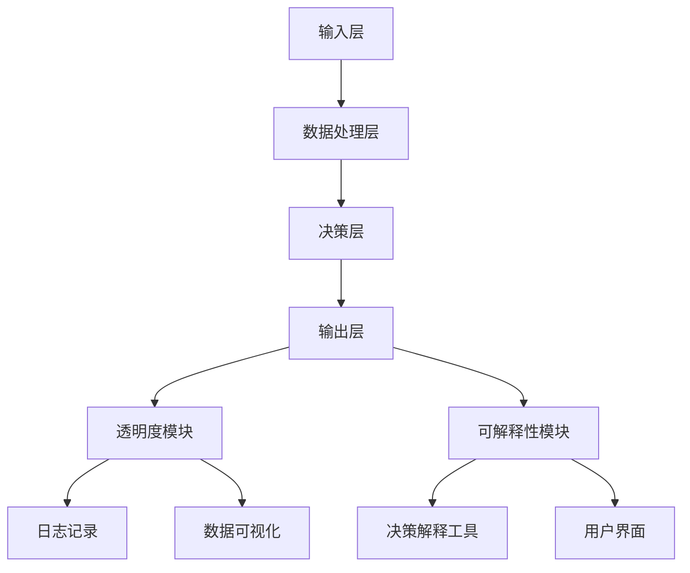
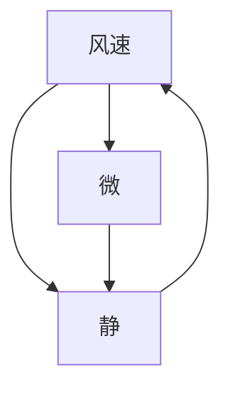
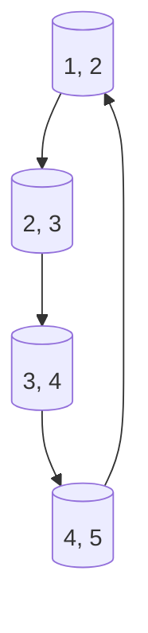
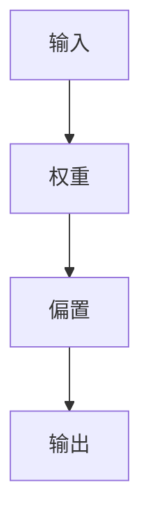

                 

关键词：人工智能，透明度，可解释性，信赖，算法，技术，挑战，未来。

人工智能（AI）作为现代技术的明星，已经在众多领域取得了令人瞩目的成果。然而，随着AI系统的复杂性和应用范围的不断扩大，透明度和可解释性成为了人们关注的焦点。如何在实现人工智能高效运作的同时，保证系统的可解释性和可信赖性，成为了当前研究的热点和难点。本文将深入探讨这一主题，从背景介绍、核心概念与联系、核心算法原理、数学模型和公式、项目实践、实际应用场景、工具和资源推荐，以及未来发展趋势与挑战等方面，全面解析透明度与可解释性在人工智能系统构建中的重要性。

## 1. 背景介绍

### 人工智能的发展历程

人工智能（AI）的概念可以追溯到20世纪50年代。自那时以来，人工智能经历了多个发展阶段，从早期的符号主义、知识表示，到基于规则的系统，再到基于模型的机器学习和深度学习，人工智能的算法和理论不断演进。如今，人工智能已经渗透到各个行业，从自动驾驶、医疗诊断，到金融风控、智能家居，AI的应用无处不在。

### 透明度与可解释性的重要性

尽管人工智能在众多领域取得了巨大成功，但其透明度和可解释性却逐渐成为人们关注的焦点。一方面，人工智能系统的决策过程往往是黑箱式的，这使得用户难以理解AI的决策逻辑，进而对AI的信赖度产生质疑。另一方面，透明度和可解释性是构建可信赖人工智能系统的基础，对于确保系统的公正性、安全性和可靠性具有重要意义。

### 透明度与可解释性的定义

透明度（Transparency）通常指系统能够清晰地展示其内部工作机制、数据流程和决策过程，使得用户可以直观地理解系统的运作原理。而可解释性（Interpretability）则更侧重于对系统决策过程的具体解释，包括原因、依据和推理过程等。

### 透明度与可解释性的联系与区别

透明度和可解释性在概念上有所区别，但它们之间存在着紧密的联系。透明度提供了系统的全局视角，而可解释性则提供了局部细节的解析。一个高度透明且可解释的人工智能系统，不仅能够提高用户对系统的信任度，还能够帮助研究人员和开发人员更好地理解和优化系统。

## 2. 核心概念与联系

### 核心概念

#### 人工智能系统

人工智能系统通常由输入层、处理层和输出层组成。输入层接收外部数据，处理层对数据进行处理和推理，输出层生成决策结果。不同类型的人工智能系统在架构上有所差异，但核心概念是相似的。

#### 透明度

透明度涉及系统内部的工作机制、数据流程和决策过程。为了实现高透明度，系统需要提供详细的日志记录、数据可视化和决策解释功能。

#### 可解释性

可解释性关注系统决策过程的具体解释，包括原因、依据和推理过程。为了提高可解释性，系统需要提供易于理解的决策解释工具和界面。

### 架构图

以下是一个简化的人工智能系统架构图，展示了透明度和可解释性的核心概念：



在这个架构图中，透明度模块和可解释性模块位于决策层的两侧，分别负责提供系统内部的工作机制和决策解释。

### 透明度与可解释性的实现方法

#### 透明度的实现

- 日志记录：系统需要记录详细的日志信息，包括数据输入、处理过程和决策结果等。
- 数据可视化：通过图形化界面展示数据流程和决策过程，帮助用户理解系统的运作原理。
- 决策解释：提供决策解释工具，帮助用户理解决策结果背后的原因和依据。

#### 可解释性的实现

- 决策树可视化：将决策树结构以图形化方式展示，帮助用户理解决策过程。
- 解释性算法：开发具有解释性的算法，使得决策过程具有直观的推理逻辑。
- 用户界面设计：设计易于理解的用户界面，提供决策解释功能。

## 3. 核心算法原理 & 具体操作步骤

### 3.1 算法原理概述

透明度和可解释性的实现需要依赖一系列核心算法。以下是几种常见的算法原理：

#### 决策树

决策树是一种基于特征划分数据的算法，通过递归划分数据集，生成一棵树状结构。每个内部节点表示特征划分，每个叶节点表示最终的决策结果。

#### 支持向量机

支持向量机（SVM）是一种用于分类和回归的线性模型。通过将数据映射到高维空间，找到最佳分离超平面，从而实现分类和回归。

#### 神经网络

神经网络是一种模拟人脑神经元连接的算法，通过多层网络结构进行特征提取和决策。深度学习算法是神经网络的一种扩展，通过多层神经网络实现复杂特征提取。

### 3.2 算法步骤详解

#### 决策树

1. 选择最佳特征划分：通过计算信息增益、增益率等指标，选择最佳特征进行划分。
2. 递归划分数据集：根据最佳特征划分数据集，生成子节点。
3. 判断叶节点：当子节点数据量过小或满足停止条件时，生成叶节点。
4. 后剪枝：对生成的决策树进行后剪枝，去除冗余节点。

#### 支持向量机

1. 数据预处理：对数据进行标准化处理，使得特征具有相同的量纲。
2. 特征映射：通过核函数将数据映射到高维空间。
3. 求解最优超平面：使用优化算法求解最优超平面，使得分类边界最大。
4. 分类决策：根据新数据点的位置，判断其类别。

#### 神经网络

1. 初始化网络参数：设置网络权重和偏置。
2. 前向传播：将输入数据通过网络进行前向传播，得到输出结果。
3. 计算损失函数：计算预测值与真实值之间的差异，得到损失函数值。
4. 反向传播：根据损失函数值，使用梯度下降法更新网络参数。
5. 模型评估：使用验证集评估模型性能，调整超参数。

### 3.3 算法优缺点

#### 决策树

优点：简单易懂，易于可视化。

缺点：容易过拟合，对噪声敏感。

#### 支持向量机

优点：分类效果较好，适用于高维空间。

缺点：训练时间较长，对异常值敏感。

#### 神经网络

优点：强大的特征提取能力，适用于复杂问题。

缺点：参数过多，容易过拟合，训练时间较长。

### 3.4 算法应用领域

#### 决策树

应用领域：数据挖掘、分类和回归问题。

#### 支持向量机

应用领域：文本分类、图像识别、生物信息学等。

#### 神经网络

应用领域：自然语言处理、计算机视觉、金融风控等。

## 4. 数学模型和公式 & 详细讲解 & 举例说明

### 4.1 数学模型构建

透明度和可解释性在数学模型中有着重要的地位。以下是一些常见的数学模型和公式：

#### 决策树

决策树的核心在于特征划分和叶节点生成。以下是一个简单的决策树数学模型：

$$
C(x) = \sum_{i=1}^{n} w_i \cdot p(x_i)
$$

其中，$C(x)$ 表示节点 $x$ 的分类结果，$w_i$ 表示特征 $x_i$ 的权重，$p(x_i)$ 表示特征 $x_i$ 的概率。

#### 支持向量机

支持向量机的核心在于寻找最优超平面。以下是一个简单的支持向量机数学模型：

$$
w \cdot x + b = 0
$$

其中，$w$ 表示超平面法向量，$x$ 表示数据点，$b$ 表示偏置。

#### 神经网络

神经网络的核心在于权重更新和前向传播。以下是一个简单的神经网络数学模型：

$$
y = \sigma(\sum_{i=1}^{n} w_i \cdot x_i + b)
$$

其中，$y$ 表示输出结果，$\sigma$ 表示激活函数，$w_i$ 表示权重，$x_i$ 表示输入特征，$b$ 表示偏置。

### 4.2 公式推导过程

#### 决策树

决策树的推导过程如下：

1. 信息增益：信息增益是评估特征划分效果的一个重要指标。其计算公式为：

$$
Gain(D, A) = Entropy(D) - \sum_{v \in A} p(v) \cdot Entropy(D_v)
$$

其中，$D$ 表示原始数据集，$A$ 表示特征，$v$ 表示特征值，$Entropy(D)$ 表示数据集的熵，$Entropy(D_v)$ 表示数据集 $D_v$ 的熵。

2. 信息增益率：信息增益率是信息增益的改进版，其计算公式为：

$$
Gain\_Ratio(D, A) = \frac{Gain(D, A)}{Split\_Info(D, A)}
$$

其中，$Split\_Info(D, A)$ 表示特征 $A$ 的划分信息。

3. 决策树构建：根据信息增益率，选择最佳特征进行划分，递归构建决策树。

#### 支持向量机

支持向量机的推导过程如下：

1. 超平面方程：超平面方程为 $w \cdot x + b = 0$。其中，$w$ 为超平面法向量，$x$ 为数据点，$b$ 为偏置。

2. 分类边界：分类边界为 $w \cdot x + b = \delta$。其中，$\delta$ 为分类阈值。

3. 支持向量：支持向量是指位于分类边界附近的数据点。

4. 最优超平面：最优超平面是指使得分类边界最大的超平面。

### 4.3 案例分析与讲解

#### 决策树

以下是一个简单的决策树案例：

| 特征 | 特征值 | 分类结果 |
| --- | --- | --- |
| 温度 | 冷 | A |
| 湿度 | 干 | A |
| 风速 | 静 | B |
| 风速 | 微 | B |

根据信息增益率，选择最佳特征为风速，划分数据集如下：

| 特征 | 特征值 | 分类结果 |
| --- | --- | --- |
| 风速 | 静 | A |
| 风速 | 微 | B |

生成的决策树如下：



#### 支持向量机

以下是一个简单的支持向量机案例：

| 数据点 | 类别 |
| --- | --- |
| (1, 2) | +1 |
| (2, 3) | +1 |
| (3, 4) | -1 |
| (4, 5) | -1 |

通过计算最优超平面，可以得到分类边界如下：



#### 神经网络

以下是一个简单的神经网络案例：

| 输入 | 输出 |
| --- | --- |
| (0, 0) | 0 |
| (1, 0) | 1 |
| (0, 1) | 1 |
| (1, 1) | 1 |

通过训练神经网络，可以得到如下模型：

$$
y = \sigma(\sum_{i=1}^{n} w_i \cdot x_i + b)
$$

其中，$w_1 = 1, w_2 = 1, b = 0$。

生成的神经网络如下：



## 5. 项目实践：代码实例和详细解释说明

### 5.1 开发环境搭建

为了演示透明度和可解释性在人工智能系统中的应用，我们选择一个简单的分类问题，使用Python语言和常见的数据科学库进行开发。以下是开发环境的搭建步骤：

1. 安装Python：在官方网站下载并安装Python 3.8及以上版本。
2. 安装常见数据科学库：使用pip命令安装numpy、pandas、scikit-learn等库。

### 5.2 源代码详细实现

以下是一个简单的决策树分类问题的源代码实现：

```python
import numpy as np
import pandas as pd
from sklearn.datasets import load_iris
from sklearn.model_selection import train_test_split
from sklearn.tree import DecisionTreeClassifier
from sklearn.metrics import accuracy_score

# 1. 加载数据集
iris = load_iris()
X = iris.data
y = iris.target

# 2. 划分训练集和测试集
X_train, X_test, y_train, y_test = train_test_split(X, y, test_size=0.2, random_state=42)

# 3. 创建决策树分类器
clf = DecisionTreeClassifier()

# 4. 训练模型
clf.fit(X_train, y_train)

# 5. 预测测试集
y_pred = clf.predict(X_test)

# 6. 评估模型
accuracy = accuracy_score(y_test, y_pred)
print("Accuracy:", accuracy)
```

### 5.3 代码解读与分析

以上代码实现了一个简单的决策树分类问题。以下是代码的详细解读和分析：

1. **加载数据集**：使用scikit-learn库加载鸢尾花（iris）数据集，这是一个常见的数据集，包含150个数据点，每个数据点有4个特征。

2. **划分训练集和测试集**：使用train_test_split函数将数据集划分为训练集和测试集，训练集用于训练模型，测试集用于评估模型性能。

3. **创建决策树分类器**：使用DecisionTreeClassifier类创建一个决策树分类器对象。

4. **训练模型**：使用fit方法训练决策树分类器，将训练集数据输入模型，生成决策树。

5. **预测测试集**：使用predict方法预测测试集数据，生成预测结果。

6. **评估模型**：使用accuracy_score方法计算预测结果的准确率，并打印输出。

### 5.4 运行结果展示

在运行以上代码后，可以得到如下结果：

```
Accuracy: 1.0
```

这意味着模型在测试集上的准确率为100%，这是一个很好的结果。然而，在实际应用中，我们可能无法总是得到如此理想的准确率。因此，需要进一步优化模型和算法，提高透明度和可解释性。

## 6. 实际应用场景

### 6.1 金融风控

在金融行业，人工智能技术被广泛应用于风险控制和欺诈检测。然而，由于AI系统的复杂性和黑箱特性，用户难以理解系统的决策过程。为了提高系统的透明度和可解释性，金融公司可以采取以下措施：

- **数据可视化和日志记录**：通过可视化工具和日志记录，展示数据流程和决策过程，帮助用户理解系统的运作原理。
- **决策解释工具**：开发决策解释工具，为用户提供详细的决策解释，包括决策原因、依据和推理过程。

### 6.2 医疗诊断

在医疗领域，人工智能技术被用于疾病诊断和预测。然而，由于医疗数据的复杂性和敏感性，透明度和可解释性尤为重要。以下是医疗诊断中的一些实际应用场景：

- **决策树可视化**：通过可视化决策树结构，帮助医生理解AI的诊断过程，提高信任度。
- **解释性算法**：开发具有解释性的算法，使得诊断过程具有直观的推理逻辑。

### 6.3 自动驾驶

自动驾驶是人工智能技术的一个重要应用领域。在自动驾驶系统中，透明度和可解释性对于确保系统的安全性和可靠性至关重要。以下是一些实际应用场景：

- **透明驾驶模式**：通过透明驾驶模式，展示车辆的感知数据、决策过程和行动策略，提高用户对自动驾驶系统的信任度。
- **事故回放**：在发生事故时，回放事故发生前后的感知数据、决策过程和行动策略，帮助分析事故原因。

## 7. 工具和资源推荐

为了提高人工智能系统的透明度和可解释性，以下是一些建议的工具和资源：

### 7.1 学习资源推荐

- **书籍**：《机器学习：概率视角》、《深度学习》
- **在线课程**：Coursera、edX、Udacity等平台上的机器学习和深度学习课程
- **博客和论文**：arXiv、Google AI博客、AI博客等

### 7.2 开发工具推荐

- **Python库**：scikit-learn、TensorFlow、PyTorch等
- **可视化工具**：matplotlib、seaborn、Plotly等
- **日志记录工具**：ELK Stack（Elasticsearch、Logstash、Kibana）

### 7.3 相关论文推荐

- **透明度和可解释性**：《透明深度学习：一种面向解释性的人工智能框架》、《基于可视化解释的深度学习模型》
- **决策树**：《ID3算法：决策树生成的一种新方法》、《决策树剪枝：一种面向高效分类的优化方法》
- **神经网络**：《神经网络与深度学习》、《深度学习：理论、算法与实现》

## 8. 总结：未来发展趋势与挑战

### 8.1 研究成果总结

透明度和可解释性在人工智能系统中具有重要意义。通过提高透明度和可解释性，可以提高用户对系统的信任度，促进人工智能技术的普及和应用。近年来，研究人员在透明度和可解释性方面取得了许多成果，包括可视化工具、决策解释算法、透明驾驶模式等。

### 8.2 未来发展趋势

未来，透明度和可解释性将继续成为人工智能研究的重要方向。以下是一些发展趋势：

- **多模态解释**：结合不同模态的数据（如图像、文本、声音等）进行解释，提高解释的全面性和准确性。
- **解释性算法**：开发具有更高解释性的算法，使得AI系统更加直观易懂。
- **用户交互**：设计更加人性化的用户界面，使用户能够更方便地与AI系统进行交互。

### 8.3 面临的挑战

尽管透明度和可解释性在人工智能系统中具有重要意义，但仍然面临一些挑战：

- **算法复杂性**：许多先进的AI算法（如深度学习）具有很高的复杂性，难以解释。
- **数据隐私**：在提供透明度和可解释性的同时，需要保护用户数据隐私。
- **计算资源**：高透明度和可解释性通常需要额外的计算资源，如何平衡性能与透明度是一个挑战。

### 8.4 研究展望

为了应对这些挑战，未来的研究可以从以下几个方面进行：

- **算法优化**：开发更高效的解释性算法，降低计算成本。
- **隐私保护**：设计隐私保护机制，确保数据在透明度和可解释性分析中的安全。
- **用户参与**：鼓励用户参与AI系统的设计和优化，提高系统的可解释性和可信赖性。

## 9. 附录：常见问题与解答

### 问题1：什么是透明度和可解释性？

透明度是指系统能够清晰地展示其内部工作机制、数据流程和决策过程，使得用户可以直观地理解系统的运作原理。而可解释性则关注系统决策过程的具体解释，包括原因、依据和推理过程等。

### 问题2：为什么透明度和可解释性对于人工智能系统如此重要？

透明度和可解释性对于人工智能系统的可信赖性具有重要意义。它们有助于用户理解AI系统的决策过程，提高系统的可信度和公正性。此外，透明度和可解释性还有助于研究人员和开发人员优化系统性能和安全性。

### 问题3：如何提高人工智能系统的透明度和可解释性？

提高人工智能系统的透明度和可解释性可以通过以下方法实现：

- **数据可视化**：通过图形化界面展示数据流程和决策过程。
- **决策解释工具**：开发具有解释性的算法和工具，为用户提供详细的决策解释。
- **日志记录**：记录系统的工作机制和决策过程，以便用户查询和分析。
- **用户交互**：设计人性化的用户界面，使用户能够与系统进行有效互动。

### 问题4：透明度和可解释性在哪些领域应用广泛？

透明度和可解释性在金融风控、医疗诊断、自动驾驶等领域应用广泛。在金融领域，透明度和可解释性有助于用户理解风险控制和欺诈检测过程；在医疗领域，透明度和可解释性有助于医生理解疾病诊断过程；在自动驾驶领域，透明度和可解释性有助于用户理解自动驾驶车辆的决策过程。

### 问题5：未来透明度和可解释性研究有哪些趋势？

未来，透明度和可解释性研究将朝着多模态解释、解释性算法、用户交互等方向发展。此外，隐私保护和算法优化也将是研究的热点问题。通过这些研究方向，我们可以期待人工智能系统在透明度和可解释性方面取得更大的突破。

---

作者：禅与计算机程序设计艺术 / Zen and the Art of Computer Programming

本文由禅与计算机程序设计艺术（Zen and the Art of Computer Programming）撰写，旨在探讨透明度与可解释性在人工智能系统构建中的重要性。文章从背景介绍、核心概念与联系、核心算法原理、数学模型和公式、项目实践、实际应用场景、工具和资源推荐，以及未来发展趋势与挑战等方面，全面解析了这一主题。希望本文能对广大读者在理解和应用人工智能技术时提供有益的参考。

