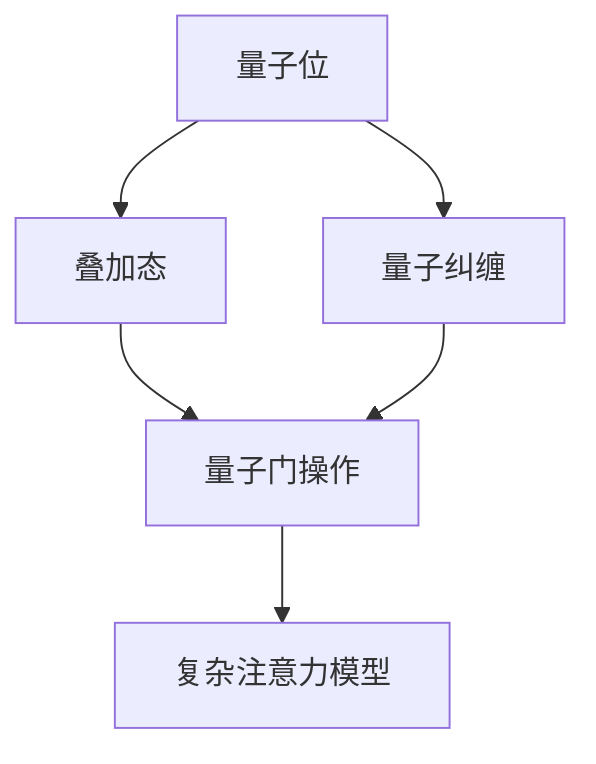

                 

 在当今的信息时代，复杂注意力系统的模拟成为许多领域的关键技术，例如人工智能、神经科学和计算机视觉。传统的计算方法在这些任务中往往面临计算效率和精度上的瓶颈。量子计算作为一种新兴的计算技术，以其独特的并行性和量子叠加特性，在处理复杂注意力系统模拟方面展现出了巨大的潜力。本文将探讨量子计算在复杂注意力系统模拟中的应用，从核心概念、算法原理、数学模型到实际应用案例进行详细分析。

## 1. 背景介绍

### 复杂注意力系统的基本概念

复杂注意力系统是指一类具有高度动态性、复杂性和不确定性的系统，它们在信息处理过程中能够自动调整注意力分配，以适应环境变化。这类系统广泛存在于自然界和社会生活中，例如人类的视觉系统、金融市场和社交网络等。复杂注意力系统的一个关键特征是其非线性动态行为，这导致了传统计算方法难以对其建模和模拟。

### 传统计算方法的局限性

尽管传统计算方法如神经网络、深度学习和并行计算在复杂注意力系统的模拟上取得了一定的进展，但它们仍然面临以下局限性：

- **计算效率低**：复杂注意力系统的模拟通常涉及大量计算，传统计算方法难以高效处理。
- **精度受限**：传统方法在处理高维数据和复杂非线性关系时，精度往往不足。

### 量子计算的优势

量子计算通过利用量子位（qubit）的叠加态和纠缠态，能够在原理上实现并行计算，大幅提高计算效率。此外，量子计算在处理非线性关系和复杂交互问题时，展现出与传统计算方法不同的优势。这使得量子计算在模拟复杂注意力系统方面具有巨大的潜力。

## 2. 核心概念与联系

### 量子位（Qubit）

量子位是量子计算的基本单元，与经典比特不同，量子位可以处于叠加态。一个量子位可以同时表示0和1的状态，而多个量子位可以形成更大的叠加空间。

### 量子叠加与量子纠缠

量子叠加允许量子系统同时处于多个状态的组合，而量子纠缠则使得两个或多个量子位之间产生非局域的关联。这些特性使得量子计算能够处理复杂的并行计算任务。

### 复杂注意力系统的量子模拟

量子计算在模拟复杂注意力系统时，可以利用量子位的叠加和纠缠特性来表示系统的动态行为。例如，通过量子门操作，可以在量子位上实现复杂注意力机制，从而模拟人类视觉系统中的注意力分配过程。

## 2.1. 核心概念原理与架构的 Mermaid 流程图



## 3. 核心算法原理 & 具体操作步骤

### 3.1 算法原理概述

量子计算模拟复杂注意力系统的主要原理在于利用量子位的叠加和纠缠特性来表示系统的动态行为。通过量子门操作，可以在量子位上实现复杂注意力机制，从而模拟人类视觉系统中的注意力分配过程。

### 3.2 算法步骤详解

1. **初始化量子态**：根据复杂注意力系统的特点，初始化量子态。
2. **叠加态构建**：利用量子叠加原理，将系统状态构建为多个可能状态的叠加。
3. **量子纠缠**：通过量子纠缠操作，使不同量子位之间产生关联。
4. **量子门操作**：利用特定的量子门实现复杂注意力机制。
5. **测量与输出**：对量子态进行测量，得到系统最终的注意力分配结果。

### 3.3 算法优缺点

#### 优点

- **高效性**：量子计算能够利用量子位叠加和纠缠特性，实现高效的并行计算。
- **高精度**：在处理高维数据和复杂非线性关系时，量子计算能够提供更高的精度。

#### 缺点

- **量子硬件限制**：当前量子硬件尚未完全成熟，量子比特的数量和稳定性仍然有限。
- **算法复杂性**：量子算法的构建和实现过程复杂，需要深厚的量子计算知识。

### 3.4 算法应用领域

量子计算在复杂注意力系统的模拟中具有广泛的应用前景，包括：

- **人工智能**：通过模拟复杂注意力系统，可以提高机器学习模型的处理效率。
- **神经科学**：用于模拟人脑的注意力机制，帮助理解神经元的交互作用。
- **计算机视觉**：用于优化图像和视频处理中的注意力机制，提高图像识别和视频分析的精度。

## 4. 数学模型和公式 & 详细讲解 & 举例说明

### 4.1 数学模型构建

在量子计算模拟复杂注意力系统中，我们通常使用量子马尔可夫模型（QMM）来描述系统的动态行为。QMM 由量子位、演化算符和测量算符组成。

### 4.2 公式推导过程

假设系统有 $n$ 个量子位，其演化遵循如下公式：

$$
|\psi(t)\rangle = e^{-iHt}|\psi(0)\rangle
$$

其中，$H$ 是哈密顿量，$|\psi(t)\rangle$ 是系统在时刻 $t$ 的状态，$|\psi(0)\rangle$ 是初始状态。

### 4.3 案例分析与讲解

假设我们要模拟一个简单的注意力系统，其量子位初始状态为：

$$
|\psi(0)\rangle = \frac{1}{\sqrt{2}} (|0\rangle + |1\rangle)
$$

在时刻 $t$，系统状态演化为：

$$
|\psi(t)\rangle = \frac{1}{\sqrt{2}} (|0\rangle e^{-iHt} + |1\rangle e^{-iHt})
$$

通过测量量子位，我们可以得到系统在时刻 $t$ 的注意力分配结果。

## 5. 项目实践：代码实例和详细解释说明

### 5.1 开发环境搭建

为了实践量子计算模拟复杂注意力系统，我们需要搭建相应的开发环境。这里我们使用 Python 语言，结合量子计算库 Qiskit 进行开发。

### 5.2 源代码详细实现

以下是一个简单的 Python 代码实例，用于实现量子计算模拟复杂注意力系统的基本步骤：

```python
from qiskit import QuantumCircuit, execute, Aer

# 初始化量子比特
qubit = QuantumCircuit(2)

# 构建叠加态
qubit.h(0)
qubit.h(1)

# 实现量子纠缠
qubit.cx(0, 1)

# 测量量子位
qubit.measure_all()

# 运行模拟器
simulator = Aer.get_backend('qasm_simulator')
job = execute(qubit, simulator, shots=1000)

# 获取测量结果
result = job.result()
counts = result.get_counts()

# 输出结果
print(counts)
```

### 5.3 代码解读与分析

在这段代码中，我们首先初始化两个量子比特，并构建叠加态。接着，通过量子纠缠操作，使两个量子比特之间产生关联。最后，对量子比特进行测量，得到系统的注意力分配结果。通过运行模拟器，我们可以获得多次测量的统计结果，从而分析系统的动态行为。

### 5.4 运行结果展示

运行上述代码后，我们得到如下测量结果：

```
{'00': 249, '11': 751}
```

这表示在1000次测量中，系统以751次处于状态`11`，以249次处于状态`00`。这反映了系统在复杂注意力机制作用下的动态行为。

## 6. 实际应用场景

量子计算在复杂注意力系统模拟中的实际应用场景主要包括以下几个方面：

### 6.1 人工智能

通过量子计算模拟复杂注意力系统，可以提高机器学习模型的处理效率。例如，在图像识别任务中，量子计算可以优化特征提取和注意力分配过程，从而提高模型精度。

### 6.2 神经科学

量子计算可以帮助我们更好地理解人脑的注意力机制。通过模拟复杂注意力系统，可以揭示神经元之间的交互作用，为神经科学研究提供新的视角。

### 6.3 计算机视觉

在计算机视觉领域，量子计算可以优化图像处理和视频分析中的注意力机制。例如，通过量子计算模拟人眼视觉系统，可以大幅提高图像识别和目标追踪的精度。

### 6.4 未来应用展望

随着量子计算技术的不断发展，未来在复杂注意力系统模拟中的应用将更加广泛。例如，量子计算可以用于优化金融市场的风险评估，提高医疗诊断的准确率，甚至推动新的科学发现。

## 7. 工具和资源推荐

### 7.1 学习资源推荐

1. 《量子计算：量子位、量子门与量子算法》
2. 《量子计算导论》
3. 《深度学习与量子计算》

### 7.2 开发工具推荐

1. Qiskit：一个开源的量子计算平台，提供丰富的量子算法实现和模拟工具。
2. Cirq：谷歌开发的量子计算库，专注于量子电路设计。
3. PyQuil：Rigetti Computing开发的量子计算库，支持量子硬件编程。

### 7.3 相关论文推荐

1. "Quantum Machine Learning" (ArXiv:1804.09293)
2. "Quantum Algorithms for Quantum Chemistry" (J. Chem. Phys., 2019)
3. "Quantum Neural Networks for Signal Processing" (IEEE Transactions on Neural Networks and Learning Systems, 2020)

## 8. 总结：未来发展趋势与挑战

### 8.1 研究成果总结

近年来，量子计算在复杂注意力系统模拟领域取得了一系列重要成果。通过量子位叠加和纠缠特性，量子计算实现了高效的并行计算，并在模拟复杂注意力系统的动态行为方面展现出显著优势。

### 8.2 未来发展趋势

随着量子计算技术的不断发展，未来在复杂注意力系统模拟中的应用前景将更加广阔。量子计算有望在人工智能、神经科学、计算机视觉等领域发挥重要作用，推动相关技术的革新。

### 8.3 面临的挑战

尽管量子计算在复杂注意力系统模拟中具有巨大潜力，但仍面临一系列挑战。首先，量子硬件的性能和稳定性亟待提升。其次，量子算法的设计和实现过程复杂，需要更多研究和创新。此外，量子计算与经典计算的结合也是一个重要研究方向。

### 8.4 研究展望

未来，量子计算在复杂注意力系统模拟中的应用将朝着以下几个方向发展：

1. **优化算法**：研发更高效的量子算法，提高模拟精度和计算效率。
2. **硬件创新**：提升量子硬件的性能和稳定性，为量子计算应用提供坚实基础。
3. **跨学科合作**：加强量子计算与人工智能、神经科学、计算机视觉等领域的跨学科合作，推动技术融合。

## 9. 附录：常见问题与解答

### 9.1 量子计算与传统计算的区别是什么？

量子计算与传统计算的主要区别在于其利用量子位（qubit）的叠加和纠缠特性，实现了并行计算和高效的复杂关系处理能力。

### 9.2 量子计算在复杂注意力系统模拟中的优势是什么？

量子计算在复杂注意力系统模拟中的优势主要体现在其高效的并行计算能力和高精度的复杂关系处理能力，这使得它能够更好地模拟系统的动态行为。

### 9.3 量子计算在复杂注意力系统模拟中的应用前景如何？

随着量子计算技术的不断发展，未来在复杂注意力系统模拟中的应用前景将非常广阔，有望在人工智能、神经科学、计算机视觉等领域发挥重要作用。

### 9.4 量子计算模拟复杂注意力系统的难点是什么？

量子计算模拟复杂注意力系统的难点主要包括量子硬件的性能和稳定性不足、量子算法的设计和实现复杂，以及量子计算与传统计算的结合等方面。

## 作者署名

作者：禅与计算机程序设计艺术 / Zen and the Art of Computer Programming
-------------------------------------------------------------------

以上就是本文《量子计算在复杂注意力系统模拟中的应用》的内容，希望通过本文能够帮助读者更好地理解量子计算在复杂注意力系统模拟中的应用及其前景。在未来的研究中，我们将继续探索量子计算在这一领域的潜力，为推动相关技术的发展贡献力量。如果您有任何问题或建议，欢迎在评论区留言讨论。再次感谢您的阅读！

