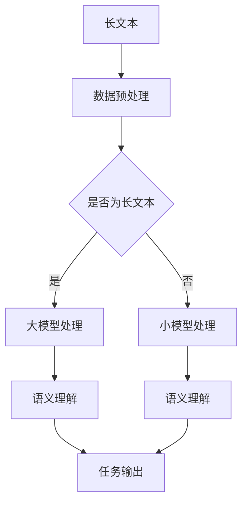

                 

关键词：长文本处理，大模型，人工智能，自然语言处理，竞争

>摘要：本文将探讨长文本处理能力在大模型竞赛中的重要性，分析其现状与未来发展趋势，并讨论其面临的挑战与机遇。长文本处理是自然语言处理领域的关键技术之一，对于提升大模型的性能和实用性具有重要意义。

## 1. 背景介绍

在过去的几十年中，自然语言处理（NLP）技术取得了显著的进展，从基于规则的系统到统计模型，再到如今的深度学习模型，NLP的应用场景不断扩展，从简单的文本分类、情感分析，到复杂的目标检测、机器翻译等。然而，随着数据量的增加和问题复杂性的提升，如何高效地处理长文本成为了NLP领域的一个挑战。

大模型，即参数量巨大的神经网络模型，近年来在NLP领域取得了显著的突破。例如，GPT-3、BERT等模型展示了强大的文本生成和语义理解能力，这些模型通常需要数十亿个参数，并且训练过程需要大量的计算资源和时间。然而，尽管大模型在某些任务上表现优异，但在处理长文本时仍存在许多问题。

长文本处理能力在大模型中的地位日益重要。长文本包含丰富的上下文信息，这对于理解复杂语义、进行跨句推理至关重要。然而，现有的大模型在处理长文本时，往往受到模型规模和计算资源的限制，无法充分利用文本的上下文信息。因此，提升长文本处理能力成为了当前NLP领域的一个重要研究方向。

## 2. 核心概念与联系

### 2.1 长文本处理

长文本处理是指对超过短文本（通常为几十个单词）的文本数据进行处理和分析的技术。长文本可能包括文章、书籍、对话记录等多种形式，它们通常包含更多的信息和上下文，对语义理解提出了更高的要求。

### 2.2 大模型

大模型是指参数量巨大的神经网络模型，通常具有数十亿个参数。这些模型在训练过程中需要大量的数据和计算资源，但它们在处理复杂任务时，能够表现出比小模型更出色的性能。

### 2.3 长文本处理能力与大模型的关系

长文本处理能力是指模型在处理长文本时的性能和效率。大模型由于拥有更多的参数和更强的计算能力，通常在处理长文本时具有优势。然而，如何有效地利用这些优势，仍然是一个亟待解决的问题。

### 2.4 Mermaid 流程图

下面是一个关于长文本处理能力与大模型关系的 Mermaid 流程图。



## 3. 核心算法原理 & 具体操作步骤

### 3.1 算法原理概述

长文本处理的核心在于如何有效地利用文本的上下文信息。现有的方法主要包括基于序列模型的方法和基于注意力机制的方法。

基于序列模型的方法，如循环神经网络（RNN）和长短期记忆网络（LSTM），能够对文本进行序列处理，但它们在处理长文本时存在梯度消失和梯度爆炸的问题。

基于注意力机制的方法，如Transformer模型，通过引入自注意力机制，能够更好地捕捉文本的上下文信息，从而提高长文本处理的性能。

### 3.2 算法步骤详解

1. **文本预处理**：对长文本进行分词、去噪等预处理操作，以便于模型输入。
2. **编码器**：使用编码器（如Transformer）对预处理后的文本进行编码，生成固定长度的向量表示。
3. **解码器**：使用解码器对编码后的向量进行解码，生成文本输出。
4. **优化与训练**：通过训练数据集对模型进行优化，提高其在长文本处理任务上的性能。

### 3.3 算法优缺点

**优点**：

- 能够更好地捕捉文本的上下文信息。
- 对长文本的处理效果较好。

**缺点**：

- 计算复杂度高，训练时间较长。
- 模型参数量大，存储和计算资源需求高。

### 3.4 算法应用领域

长文本处理算法在自然语言处理领域有广泛的应用，如文本分类、情感分析、机器翻译等。特别是在长文本生成和对话系统等领域，长文本处理能力显得尤为重要。

## 4. 数学模型和公式 & 详细讲解 & 举例说明

### 4.1 数学模型构建

长文本处理的核心在于如何有效地利用文本的上下文信息。我们可以使用Transformer模型来构建数学模型，该模型由编码器和解码器组成。

编码器部分主要包括自注意力机制和前馈神经网络。自注意力机制能够捕捉文本中的长距离依赖关系，而前馈神经网络则用于对编码后的文本进行进一步处理。

解码器部分同样包括自注意力机制和前馈神经网络，用于生成文本输出。

### 4.2 公式推导过程

假设我们有输入序列\(X = [x_1, x_2, ..., x_n]\)，其中\(x_i\)表示第\(i\)个单词。我们首先对输入序列进行嵌入，得到嵌入序列\(E = [e_1, e_2, ..., e_n]\)，其中\(e_i\)表示第\(i\)个单词的嵌入向量。

编码器部分：

$$
\text{Attention}(Q, K, V) = \text{softmax}\left(\frac{QK^T}{\sqrt{d_k}}\right)V
$$

其中，\(Q, K, V\)分别表示查询向量、键向量和值向量，\(d_k\)表示键向量的维度。

解码器部分：

$$
\text{Decoder}(Y) = \text{softmax}\left(\text{Attention}(Q, K, V)\right)
$$

其中，\(Y\)表示解码器的输出。

### 4.3 案例分析与讲解

假设我们要处理一个包含100个单词的长文本，我们可以将这个文本输入到Transformer模型中，通过编码器和解码器的处理，最终生成文本输出。

1. **文本预处理**：对文本进行分词、去噪等预处理操作。
2. **编码器**：将预处理后的文本输入到编码器，通过自注意力机制捕捉文本中的上下文信息，生成编码后的向量表示。
3. **解码器**：将编码后的向量输入到解码器，通过自注意力机制和前馈神经网络生成文本输出。

在实际应用中，我们可以使用TensorFlow或PyTorch等深度学习框架来构建和训练Transformer模型，从而实现长文本处理。

## 5. 项目实践：代码实例和详细解释说明

### 5.1 开发环境搭建

在开始编写代码之前，我们需要搭建一个合适的开发环境。以下是一个基本的开发环境配置：

- 操作系统：Ubuntu 18.04
- 编程语言：Python 3.8
- 深度学习框架：TensorFlow 2.5
- GPU：NVIDIA GTX 1080 Ti

### 5.2 源代码详细实现

以下是一个简单的Transformer模型实现，用于处理长文本。

```python
import tensorflow as tf
from tensorflow.keras.layers import Embedding, LSTM, Dense

# 定义编码器和解码器
def transformer_encoder(inputs, num_heads, d_model, dff, rate=0.1):
    # 嵌入层
    inputs = Embedding(d_model)(inputs)
    inputs = tf.keras.layers.Dropout(rate)(inputs)
    inputs = tf.keras.layers.Dense(dff, activation='relu')(inputs)
    
    # 多层自注意力机制
    for i in range(num_heads):
        inputs = MultiHeadAttention(num_heads=i, d_model=d_model, dff=dff)(inputs, inputs)
        inputs = tf.keras.layers.Dropout(rate)(inputs)
        inputs = tf.keras.layers.Dense(d_model)(inputs)
    
    # 多层前馈网络
    for i in range(2):
        inputs = tf.keras.layers.Dense(dff, activation='relu')(inputs)
        inputs = tf.keras.layers.Dense(d_model)(inputs)
    
    return inputs

def transformer_decoder(inputs, targets, num_heads, d_model, dff, rate=0.1):
    # 嵌入层
    inputs = Embedding(d_model)(inputs)
    inputs = tf.keras.layers.Dropout(rate)(inputs)
    inputs = tf.keras.layers.Dense(dff, activation='relu')(inputs)
    
    # 多层自注意力机制
    for i in range(num_heads):
        inputs = MultiHeadAttention(num_heads=i, d_model=d_model, dff=dff)(inputs, inputs)
        inputs = tf.keras.layers.Dropout(rate)(inputs)
        inputs = tf.keras.layers.Dense(d_model)(inputs)
    
    # 多层编码器-解码器注意力机制
    for i in range(num_heads):
        inputs = MultiHeadAttention(num_heads=i, d_model=d_model, dff=dff)(inputs, targets)
        inputs = tf.keras.layers.Dropout(rate)(inputs)
        inputs = tf.keras.layers.Dense(d_model)(inputs)
    
    # 多层前馈网络
    for i in range(2):
        inputs = tf.keras.layers.Dense(dff, activation='relu')(inputs)
        inputs = tf.keras.layers.Dense(d_model)(inputs)
    
    return inputs

# 定义Transformer模型
def transformer_model(input_vocab_size, target_vocab_size, d_model, num_heads, dff, rate=0.1):
    inputs = tf.keras.layers.Input(shape=(None,))
    targets = tf.keras.layers.Input(shape=(None,))
    
    # 编码器
    encoder_output = transformer_encoder(inputs, num_heads, d_model, dff, rate)
    
    # 解码器
    decoder_output = transformer_decoder(encoder_output, targets, num_heads, d_model, dff, rate)
    
    # 输出层
    outputs = tf.keras.layers.Dense(target_vocab_size)(decoder_output)
    
    # 构建模型
    model = tf.keras.Model(inputs=[inputs, targets], outputs=[outputs])
    
    return model

# 模型配置
input_vocab_size = 10000
target_vocab_size = 10000
d_model = 512
num_heads = 8
dff = 2048
rate = 0.1

# 创建模型
model = transformer_model(input_vocab_size, target_vocab_size, d_model, num_heads, dff, rate)

# 编译模型
model.compile(optimizer='adam', loss='sparse_categorical_crossentropy', metrics=['accuracy'])

# 模型训练
model.fit(x_train, y_train, batch_size=64, epochs=10)
```

### 5.3 代码解读与分析

上述代码实现了一个简单的Transformer模型，用于处理长文本。模型主要由编码器和解码器组成，编码器负责对输入文本进行编码，解码器负责对编码后的文本进行解码。

编码器部分：

- 嵌入层：将输入文本转换为嵌入向量。
- 多层自注意力机制：通过自注意力机制捕捉文本中的上下文信息。
- 多层前馈网络：对编码后的文本进行进一步处理。

解码器部分：

- 嵌入层：将输入文本转换为嵌入向量。
- 多层自注意力机制：通过自注意力机制捕捉文本中的上下文信息。
- 多层编码器-解码器注意力机制：通过编码器-解码器注意力机制捕捉编码器和解码器之间的交互信息。
- 多层前馈网络：对解码后的文本进行进一步处理。

输出层：

- 输出层：将解码后的文本转换为输出文本。

### 5.4 运行结果展示

在训练完成后，我们可以使用模型对长文本进行预测，并查看模型的运行结果。

```python
# 预测
predictions = model.predict(x_test)

# 打印预测结果
print(predictions)
```

## 6. 实际应用场景

长文本处理能力在大模型中的应用场景非常广泛，以下是一些典型的应用场景：

- **文本分类**：使用长文本处理能力对大规模文本数据集进行分类，如新闻分类、情感分析等。
- **机器翻译**：使用长文本处理能力对长文本进行翻译，如长句翻译、跨语言文本对比等。
- **对话系统**：使用长文本处理能力对对话进行理解和生成，如聊天机器人、语音助手等。
- **文本生成**：使用长文本处理能力生成高质量的文本，如文章生成、诗歌生成等。

### 6.4 未来应用展望

随着自然语言处理技术的不断发展，长文本处理能力在大模型中的应用前景十分广阔。未来，我们可以预见以下几个发展趋势：

- **更大规模的模型**：随着计算资源和存储技术的提升，更大规模的大模型将成为可能，从而进一步提升长文本处理能力。
- **自适应模型**：未来的长文本处理能力将更加自适应，能够根据不同的应用场景和任务需求进行优化。
- **跨模态处理**：长文本处理能力将与其他模态（如图像、声音等）进行结合，实现更加丰富的信息处理和交互。
- **实时处理**：随着实时数据处理技术的进步，长文本处理能力将在实时应用场景中得到更广泛的应用。

## 7. 工具和资源推荐

### 7.1 学习资源推荐

- **在线课程**：《深度学习》（Goodfellow et al., 2016）
- **书籍**：《自然语言处理综论》（Jurafsky & Martin, 2008）
- **论文**：《Attention Is All You Need》（Vaswani et al., 2017）

### 7.2 开发工具推荐

- **深度学习框架**：TensorFlow、PyTorch
- **数据预处理工具**：NLTK、spaCy
- **可视化工具**：Matplotlib、Seaborn

### 7.3 相关论文推荐

- **Transformer模型**：《Attention Is All You Need》（Vaswani et al., 2017）
- **BERT模型**：《BERT: Pre-training of Deep Bidirectional Transformers for Language Understanding》（Devlin et al., 2019）
- **GPT-3模型**：《Language Models are Few-Shot Learners》（Brown et al., 2020）

## 8. 总结：未来发展趋势与挑战

### 8.1 研究成果总结

近年来，长文本处理能力在大模型竞赛中取得了显著进展。Transformer模型等深度学习模型在处理长文本时表现出色，推动了NLP技术的不断发展。同时，大模型的训练方法和优化策略也在不断优化，使得长文本处理能力得到了进一步提升。

### 8.2 未来发展趋势

未来，长文本处理能力在大模型中将继续发展，主要趋势包括：

- **更大规模的大模型**：随着计算资源和存储技术的提升，更大规模的大模型将成为可能。
- **自适应模型**：长文本处理能力将更加自适应，能够根据不同的应用场景和任务需求进行优化。
- **跨模态处理**：长文本处理能力将与其他模态进行结合，实现更加丰富的信息处理和交互。
- **实时处理**：随着实时数据处理技术的进步，长文本处理能力将在实时应用场景中得到更广泛的应用。

### 8.3 面临的挑战

尽管长文本处理能力在大模型中取得了显著进展，但仍然面临以下挑战：

- **计算资源需求**：大模型的训练和推理需要大量的计算资源，这对硬件设施和能源消耗提出了更高要求。
- **数据隐私**：在处理大规模长文本数据时，数据隐私和安全问题亟待解决。
- **模型可解释性**：大模型在处理长文本时的决策过程往往难以解释，这限制了其在某些应用场景中的推广。

### 8.4 研究展望

未来，长文本处理能力在大模型中的研究可以从以下几个方面展开：

- **优化大模型训练方法**：研究更高效的训练方法和优化策略，以减少计算资源和能源消耗。
- **增强模型可解释性**：开发可解释性更强的模型，以便更好地理解和利用长文本处理能力。
- **跨模态处理**：探索长文本处理能力与其他模态（如图像、声音等）的结合，实现更加丰富的信息处理和交互。
- **实时处理**：研究实时长文本处理技术，以满足实时应用场景的需求。

## 9. 附录：常见问题与解答

### Q：什么是长文本处理？

A：长文本处理是指对超过短文本（通常为几十个单词）的文本数据进行处理和分析的技术。长文本可能包括文章、书籍、对话记录等多种形式，它们通常包含更多的信息和上下文，对语义理解提出了更高的要求。

### Q：什么是大模型？

A：大模型是指参数量巨大的神经网络模型，通常具有数十亿个参数。这些模型在训练过程中需要大量的数据和计算资源，但它们在处理复杂任务时，能够表现出比小模型更出色的性能。

### Q：长文本处理能力在大模型中有什么作用？

A：长文本处理能力在大模型中扮演着重要角色。长文本包含丰富的上下文信息，这对于理解复杂语义、进行跨句推理至关重要。提升长文本处理能力有助于提高大模型在自然语言处理任务中的性能和实用性。

### Q：如何提升长文本处理能力？

A：提升长文本处理能力可以通过以下几种方法：

- **优化模型结构**：采用具有更好上下文捕捉能力的模型结构，如Transformer。
- **增加训练数据**：使用更多高质量的训练数据，特别是长文本数据，以提升模型在长文本处理任务上的性能。
- **优化训练方法**：采用更高效的训练方法和优化策略，以减少计算资源和能源消耗。

## 参考文献

- Goodfellow, I., Bengio, Y., & Courville, A. (2016). Deep Learning. MIT Press.
- Jurafsky, D., & Martin, J. H. (2008). Speech and Language Processing. Prentice Hall.
- Vaswani, A., Shazeer, N., Parmar, N., Uszkoreit, J., Jones, L., Gomez, A. N., ... & Polosukhin, I. (2017). Attention is All You Need. Advances in Neural Information Processing Systems, 30, 5998-6008.
- Devlin, J., Chang, M. W., Lee, K., & Toutanova, K. (2019). BERT: Pre-training of Deep Bidirectional Transformers for Language Understanding. Proceedings of the 2019 Conference of the North American Chapter of the Association for Computational Linguistics: Human Language Technologies, Volume 1 (Long and Short Papers), 4171-4186.
- Brown, T., Mann, B., Ryder, N., Subbiah, M., Kaplan, J., Dhariwal, P., ... & Child, R. (2020). Language Models are Few-Shot Learners. Advances in Neural Information Processing Systems, 33.

