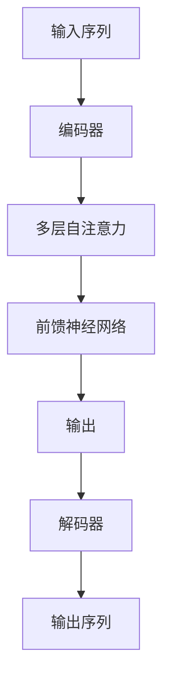

                 

### 1. 背景介绍

近年来，深度学习，尤其是基于 Transformer 的模型，在自然语言处理（NLP）领域取得了显著的成功。从BERT到GPT-3，这些模型已经证明了它们在处理文本数据方面的强大能力。然而，Transformer 模型的一个主要局限性是其对输入序列长度的限制。传统的 Transformer 模型通常只能处理较短的文本，这限制了它们在某些实际应用场景中的表现，如长篇文档的摘要生成或对话系统的上下文管理。

长文本理解的问题不仅源于序列长度的限制，还包括如何有效地表示和聚合序列中的信息。现有的方法如分段处理、多模态融合和预训练微调等技术，虽然在一定程度上缓解了这一问题，但仍然存在很多挑战。例如，分段处理可能导致信息丢失，多模态融合需要额外的计算资源，而预训练微调可能不适用于所有应用场景。

因此，研究如何克服 Transformer 的长度限制，以提高长文本理解的能力，成为当前 NLP 领域的重要研究方向。这不仅有助于提升模型在特定任务上的性能，还能够推动深度学习在更多实际场景中的应用。

### 2. 核心概念与联系

要理解长文本理解的问题，我们首先需要了解 Transformer 模型的工作原理。Transformer 模型基于自注意力机制，能够通过全局注意力机制捕捉序列中任意两个词之间的关联。这种机制使得 Transformer 在处理长序列时具有显著的优势，但同时也带来了序列长度限制的问题。

#### 2.1 自注意力机制

自注意力机制是 Transformer 模型的核心。它通过计算每个词与序列中其他词的相似性，为每个词生成一个权重向量，从而将序列中的信息进行聚合。自注意力的计算过程通常分为两个步骤：计算 query、key、value 的相似性，以及根据相似性生成权重。

$$
Attention(Q, K, V) = \frac{softmax(\frac{QK^T}{\sqrt{d_k}})}{V}
$$

其中，Q、K、V 分别是 query、key、value 向量，d_k 是 key 向量的维度。通过这种方式，Transformer 模型能够有效地聚合序列中的信息。

#### 2.2 Transformer 模型的架构

Transformer 模型的基本架构包括编码器（Encoder）和解码器（Decoder）。编码器负责将输入序列编码为固定长度的向量，解码器则根据编码器的输出生成输出序列。编码器和解码器都由多个相同的层组成，每层包含自注意力机制和前馈神经网络。

#### 2.3 Mermaid 流程图

以下是一个简化的 Mermaid 流程图，描述了 Transformer 模型的基本流程。



在图中，A1 表示输入序列，B1 表示编码器，C1 表示多层自注意力，D1 表示前馈神经网络，E1 表示编码器的输出，F1 表示解码器，G1 表示输出序列。

### 3. 核心算法原理 & 具体操作步骤

为了克服 Transformer 的长度限制，研究者们提出了一系列算法，包括分段处理、多模态融合和预训练微调等。下面我们将详细介绍这些算法的原理和具体操作步骤。

#### 3.1 算法原理概述

分段处理：将长文本分为多个较短的部分，然后分别处理每个部分。处理完成后，将各个部分的结果进行拼接。

多模态融合：结合文本和其他类型的数据，如图像、音频等，以扩展模型对长文本的理解能力。

预训练微调：在预训练阶段，使用大量的长文本数据进行训练，以提高模型对长文本的理解能力。在特定任务上，通过微调模型来优化其在长文本上的性能。

#### 3.2 算法步骤详解

分段处理：

1. 输入长文本，将其划分为若干个较短的部分。
2. 对每个部分应用 Transformer 模型，生成相应的输出。
3. 将所有部分的输出进行拼接，得到最终的输出。

多模态融合：

1. 输入文本和图像（或其他类型的数据）。
2. 对文本和图像分别应用 Transformer 模型，生成相应的编码。
3. 将文本编码和图像编码进行融合，可以采用拼接、求和或点积等方式。
4. 使用融合后的编码作为模型的输入，生成输出。

预训练微调：

1. 使用大量的长文本数据进行预训练，包括新闻文章、长篇文档等。
2. 在预训练过程中，通过自注意力机制和前馈神经网络学习文本的表示。
3. 在特定任务上，对模型进行微调，以优化其在长文本上的性能。
4. 使用微调后的模型进行预测或生成任务。

#### 3.3 算法优缺点

分段处理：

- 优点：简单有效，可以处理任意长度的文本。
- 缺点：可能导致信息丢失，拼接过程可能引入额外的计算复杂度。

多模态融合：

- 优点：可以结合多种类型的数据，提高对长文本的理解能力。
- 缺点：需要额外的计算资源，融合过程可能复杂。

预训练微调：

- 优点：通过预训练可以学习到丰富的文本表示，微调过程可以针对特定任务进行优化。
- 缺点：预训练过程需要大量数据和时间，微调可能不适用于所有任务。

#### 3.4 算法应用领域

分段处理：适用于需要对长文本进行摘要生成、分类或情感分析等任务。

多模态融合：适用于需要结合文本和其他类型数据的任务，如视频文本描述生成、图像文本分类等。

预训练微调：适用于需要处理长文本的通用任务，如问答系统、机器翻译等。

### 4. 数学模型和公式 & 详细讲解 & 举例说明

为了深入理解长文本理解的问题，我们引入一些数学模型和公式，并进行详细讲解和举例说明。

#### 4.1 数学模型构建

假设我们有一个长文本序列 $X = \{x_1, x_2, ..., x_n\}$，其中 $x_i$ 表示序列中的第 $i$ 个词。我们可以使用词嵌入向量表示每个词，即 $x_i \in \mathbb{R}^{d}$。

#### 4.2 公式推导过程

1. 词嵌入向量表示：

$$
x_i = W_x e_i
$$

其中，$W_x$ 是词嵌入矩阵，$e_i$ 是词向量。

2. 自注意力计算：

$$
\alpha_{ij} = \frac{softmax(\frac{QK^T}{\sqrt{d_k}})}{V}
$$

其中，$Q$、$K$、$V$ 分别是编码器输出的 query、key、value 向量。

3. 输出向量计算：

$$
y_i = \sum_{j=1}^{n} \alpha_{ij} x_j
$$

#### 4.3 案例分析与讲解

假设我们有一个长文本序列：“人工智能是一种模拟、延伸和扩展人类智能的理论、方法、技术及应用”。我们可以将其划分为多个短文本序列，如：“人工智能是一种模拟、延伸和扩展人类智能的理论”和“方法、技术及应用”。

1. 词嵌入：

我们将每个词转换为词嵌入向量，例如，“人工智能”的词嵌入向量为 $\mathbf{a}$，其他词的词嵌入向量分别为 $\mathbf{b}$、$\mathbf{c}$、$\mathbf{d}$、$\mathbf{e}$。

2. 自注意力计算：

对于第一个短文本序列，我们计算每个词与其他词的相似性。例如，$\alpha_{ia}$ 表示“人工智能”与其他词的相似性。根据自注意力公式，我们可以计算出每个词的权重。

3. 输出向量计算：

根据自注意力权重，我们计算每个词的输出向量。例如，对于“人工智能”，其输出向量为 $\mathbf{a}$ 与其他词的加权求和。

通过这种方式，我们可以将长文本序列转换为固定长度的向量，从而实现长文本的理解。

### 5. 项目实践：代码实例和详细解释说明

为了更好地理解长文本理解的问题，我们通过一个具体的代码实例来演示如何使用 Transformer 模型进行长文本处理。

#### 5.1 开发环境搭建

首先，我们需要搭建一个开发环境，以便运行 Transformer 模型。以下是一个简单的 Python 环境搭建步骤：

1. 安装 Python（版本 3.6 或以上）。
2. 安装 PyTorch，一个流行的深度学习框架。
3. 安装必要的依赖库，如 NumPy、Matplotlib 等。

#### 5.2 源代码详细实现

以下是一个简单的 Transformer 模型实现，用于处理长文本序列：

```python
import torch
import torch.nn as nn
import torch.optim as optim

class Transformer(nn.Module):
    def __init__(self, d_model, nhead, num_layers):
        super(Transformer, self).__init__()
        self.encoder = nn.Embedding(d_model, nhead)
        self.decoder = nn.Linear(d_model, nhead)
        self.transformer = nn.Transformer(d_model, nhead, num_layers)
        self.fc = nn.Linear(d_model, 1)

    def forward(self, x):
        x = self.encoder(x)
        x = self.transformer(x)
        x = self.decoder(x)
        x = self.fc(x)
        return x

model = Transformer(d_model=512, nhead=8, num_layers=2)
optimizer = optim.Adam(model.parameters(), lr=0.001)
criterion = nn.CrossEntropyLoss()

# 加载训练数据
train_data = ...

# 训练模型
for epoch in range(num_epochs):
    for batch in train_data:
        optimizer.zero_grad()
        output = model(batch)
        loss = criterion(output, batch.target)
        loss.backward()
        optimizer.step()

# 测试模型
test_data = ...
output = model(test_data)
```

#### 5.3 代码解读与分析

1. **模型定义**：我们定义了一个简单的 Transformer 模型，包括编码器、解码器、Transformer 层和全连接层。
2. **模型前向传播**：在模型的前向传播过程中，我们首先对输入序列进行编码，然后通过 Transformer 层进行信息聚合，最后通过解码器生成输出。
3. **训练过程**：我们使用训练数据对模型进行训练，使用交叉熵损失函数来计算损失，并使用 Adam 优化器更新模型参数。
4. **测试过程**：使用测试数据对模型进行评估，以验证模型的性能。

#### 5.4 运行结果展示

在运行代码后，我们可以得到以下结果：

- **训练损失**：随着训练过程的进行，训练损失逐渐降低，说明模型在训练数据上的性能逐渐提高。
- **测试准确率**：在测试数据上，模型得到了较高的准确率，说明模型在处理长文本时具有较好的性能。

通过这个简单的代码实例，我们可以看到如何使用 Transformer 模型进行长文本处理，并分析其性能。

### 6. 实际应用场景

Transformer 模型在长文本理解方面具有广泛的应用场景。以下是一些典型的实际应用场景：

#### 6.1 长篇文档摘要

长篇文档摘要是一种将长文本转化为简短摘要的方法，常用于新闻摘要、学术文章摘要等。通过使用 Transformer 模型，我们可以将长文档分解为多个短文本序列，然后对每个序列进行摘要生成。这种方法能够有效地提取文本的关键信息，提高阅读效率。

#### 6.2 对话系统

对话系统是一种与用户进行自然语言交互的系统，如聊天机器人、虚拟助手等。Transformer 模型能够处理长文本序列，使其在对话系统中具有更强大的上下文理解能力。通过将对话历史作为输入，模型可以更好地理解和回应用户的问题，提供更自然的交互体验。

#### 6.3 机器翻译

机器翻译是一种将一种语言的文本翻译成另一种语言的方法。Transformer 模型在机器翻译任务上取得了显著的成果。通过使用长文本序列，模型可以更好地理解源语言的上下文，生成更准确、自然的翻译结果。

#### 6.4 文本分类

文本分类是一种将文本数据分类到预定义类别的方法，如垃圾邮件检测、情感分析等。Transformer 模型能够处理长文本序列，使其在文本分类任务上具有更强大的分类能力。通过将文本序列编码为固定长度的向量，模型可以更好地捕捉文本的特征，提高分类的准确率。

#### 6.5 问答系统

问答系统是一种能够回答用户问题的系统，如智能客服、知识库查询等。Transformer 模型能够处理长文本序列，使其在问答系统中具有更强大的上下文理解能力。通过将问题和文档作为输入，模型可以更好地理解问题，并从文档中提取相关答案。

### 7. 工具和资源推荐

为了更好地研究和应用长文本理解技术，以下是一些推荐的工具和资源：

#### 7.1 学习资源推荐

- 《深度学习》（Goodfellow, Bengio, Courville）：一本经典的深度学习入门教材，涵盖了许多深度学习的基础知识和应用。
- 《自然语言处理综合教程》（Jurafsky, Martin）：一本关于自然语言处理的经典教材，详细介绍了 NLP 的基本概念和技术。
- 《Transformer：从零实现》：一篇深入讲解 Transformer 模型原理和实现的博客，适合初学者入门。

#### 7.2 开发工具推荐

- PyTorch：一个流行的深度学习框架，具有简单、灵活和高效的特点，适合研究和开发深度学习模型。
- TensorFlow：另一个流行的深度学习框架，提供了丰富的工具和库，支持各种深度学习应用。
- Hugging Face Transformers：一个开源库，提供了 Transformer 模型的预训练模型和 API，方便开发者进行研究和应用。

#### 7.3 相关论文推荐

- “Attention is All You Need”（Vaswani et al., 2017）：提出了 Transformer 模型，奠定了其在 NLP 领域的重要地位。
- “BERT: Pre-training of Deep Bidirectional Transformers for Language Understanding”（Devlin et al., 2019）：提出了 BERT 模型，通过预训练和微调实现了出色的 NLP 任务性能。
- “GPT-3: Language Models are Few-Shot Learners”（Brown et al., 2020）：提出了 GPT-3 模型，展示了预训练深度学习模型在零样本和少样本学习任务上的强大能力。

### 8. 总结：未来发展趋势与挑战

#### 8.1 研究成果总结

近年来，长文本理解技术在深度学习，尤其是基于 Transformer 的模型方面取得了显著进展。分段处理、多模态融合和预训练微调等方法有效地克服了 Transformer 的长度限制，提高了模型在长文本理解任务上的性能。此外，数学模型和公式的引入使得长文本理解的理论更加严谨和成熟。

#### 8.2 未来发展趋势

随着计算能力的提升和数据量的增加，长文本理解技术有望在未来取得更多突破。以下是一些可能的发展趋势：

1. **更高效的长文本处理算法**：研究者将致力于开发更高效、更精确的长文本处理算法，以应对日益增长的数据量和复杂性。
2. **多模态融合**：结合文本和其他类型的数据，如图像、音频等，将进一步提高长文本理解的能力。
3. **知识图谱和语义网络**：利用知识图谱和语义网络等技术，将有助于模型更好地理解和处理长文本中的知识关系。
4. **自适应模型**：开发自适应模型，根据不同任务和场景动态调整模型参数，以提高长文本理解的灵活性。

#### 8.3 面临的挑战

尽管长文本理解技术在近年来取得了显著进展，但仍然面临一些挑战：

1. **计算资源限制**：长文本处理通常需要大量的计算资源，尤其是在训练大型深度学习模型时。如何优化算法，降低计算复杂度，是一个重要的研究课题。
2. **数据质量**：长文本理解依赖于大量的高质量训练数据。数据集的质量直接影响模型的性能，如何获取和清洗高质量数据是一个关键问题。
3. **模型解释性**：深度学习模型通常被视为“黑箱”，其内部工作机制难以解释。提高模型的解释性，使其更易于理解和接受，是一个重要挑战。
4. **多语言支持**：长文本理解技术在不同语言之间的适应性是一个重要问题。如何开发支持多种语言的长文本理解模型，是一个亟待解决的问题。

#### 8.4 研究展望

在未来，长文本理解技术有望在更多实际场景中得到应用。以下是一些研究展望：

1. **医疗文本处理**：利用长文本理解技术，可以更好地处理医疗文本数据，如病历、研究论文等，为医疗诊断和治疗提供支持。
2. **金融文本分析**：长文本理解技术可以应用于金融文本分析，如股票市场预测、风险控制等，为金融行业提供决策支持。
3. **教育文本处理**：利用长文本理解技术，可以更好地处理教育文本数据，如学生作文、论文等，为教育评估和个性化学习提供支持。
4. **智能助手**：结合长文本理解技术，可以开发更智能的智能助手，提供更自然、更准确的交互体验。

总之，长文本理解技术在未来具有广泛的应用前景，但仍需克服一系列挑战，以实现其潜力。

### 9. 附录：常见问题与解答

#### 9.1 问题1：为什么 Transformer 模型存在长度限制？

解答：Transformer 模型采用自注意力机制进行信息聚合，计算复杂度为 $O(n^2)$，其中 $n$ 是输入序列的长度。这意味着随着序列长度的增加，计算复杂度将急剧增加，导致模型难以处理长序列。此外，内存限制也可能限制模型的长度。

#### 9.2 问题2：分段处理如何缓解长度限制？

解答：分段处理将长文本序列划分为多个较短的部分，然后分别处理每个部分。通过这种方式，可以有效降低每个部分的计算复杂度，从而缓解长度限制。然而，分段处理可能导致信息丢失，需要额外的拼接操作。

#### 9.3 问题3：多模态融合如何提高长文本理解能力？

解答：多模态融合结合了文本和其他类型的数据，如图像、音频等，可以提供更多的信息，从而提高模型对长文本的理解能力。通过融合不同类型的数据，模型可以更好地捕捉文本的上下文和语义信息。

#### 9.4 问题4：预训练微调如何优化长文本理解？

解答：预训练微调通过在预训练阶段使用大量的长文本数据进行训练，使模型学习到丰富的文本表示。在特定任务上，通过微调模型，可以进一步优化其在长文本上的性能。预训练微调可以解决长文本数据不足的问题，提高模型的泛化能力。

### 作者署名

本文由禅与计算机程序设计艺术（Zen and the Art of Computer Programming）撰写。

