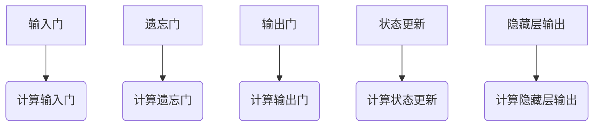

                 

关键词：长短时记忆网络（LSTM），神经网络，时间序列分析，机器学习，深度学习，编码器-解码器架构，循环神经网络（RNN），激活函数，神经网络架构，深度学习模型，反向传播算法，时间序列预测，序列学习，自然语言处理，计算机视觉，图像分类，语言模型。

## 摘要

本文将详细介绍长短时记忆网络（LSTM）的基本原理、构建方法及其在时间序列分析、自然语言处理和计算机视觉等领域的广泛应用。通过详细的算法步骤、数学模型和实际代码实例，帮助读者深入理解LSTM的运作机制，并掌握其在实际问题中的应用方法。文章结构分为以下几个部分：

1. 背景介绍
2. 核心概念与联系
3. 核心算法原理与具体操作步骤
4. 数学模型和公式
5. 项目实践：代码实例
6. 实际应用场景
7. 工具和资源推荐
8. 总结：未来发展趋势与挑战

## 1. 背景介绍

随着互联网和大数据的快速发展，时间序列分析、自然语言处理和计算机视觉等领域对机器学习和深度学习技术提出了更高的要求。传统的循环神经网络（RNN）在处理长时间依赖问题时存在梯度消失和梯度爆炸等难题，这使得其性能受到限制。为了克服这些问题，长短时记忆网络（LSTM）被提出，并成为当前深度学习领域中最常用的模型之一。

LSTM是由Hochreiter和Schmidhuber在1997年首次提出的，它通过引入门控机制，有效地解决了RNN在长时间依赖问题上的梯度消失问题。此后，LSTM及其变种（如门控循环单元（GRU））在各类任务中取得了显著的成果。本文将重点介绍LSTM的原理和实现，并探讨其在实际应用中的优势。

### 1.1 时间序列分析

时间序列分析是统计学和机器学习中的一个重要领域，主要研究如何从时间序列数据中提取有用信息，并预测未来的趋势。时间序列数据具有时间上的依赖性，即当前时刻的值与之前的值存在一定的关联。在金融、气象、工业等领域，时间序列分析被广泛应用于股票预测、天气预测和设备故障预测等任务。

### 1.2 自然语言处理

自然语言处理（NLP）是计算机科学和人工智能领域的一个重要分支，主要研究如何让计算机理解和处理自然语言。NLP的应用场景包括机器翻译、情感分析、文本分类和问答系统等。传统的NLP方法主要基于规则和统计模型，但随着深度学习技术的发展，基于神经网络的NLP模型逐渐成为主流。

### 1.3 计算机视觉

计算机视觉是人工智能领域的一个重要分支，主要研究如何让计算机像人类一样理解视觉信息。计算机视觉的应用场景包括图像分类、目标检测、人脸识别和自动驾驶等。深度学习技术在计算机视觉领域的应用取得了显著成果，特别是在大规模图像识别任务中，深度学习模型已经超过传统方法。

## 2. 核心概念与联系

### 2.1 神经网络基础

神经网络（Neural Network）是一种模拟人脑神经元之间连接的计算模型。在神经网络中，每个神经元都与其他神经元连接，并通过加权的方式传递信息。神经网络的核心组成部分包括输入层、隐藏层和输出层。

- **输入层**：接收外部输入信号，并将其传递给隐藏层。
- **隐藏层**：对输入信号进行加工和处理，提取特征信息。
- **输出层**：根据隐藏层的信息生成预测结果。

### 2.2 循环神经网络（RNN）

循环神经网络（Recurrent Neural Network，RNN）是一种能够处理序列数据的神经网络。与传统的前向神经网络不同，RNN具有循环结构，能够将前一个时刻的信息传递到下一个时刻，从而实现序列数据的建模。

然而，RNN在处理长时间依赖问题时存在梯度消失和梯度爆炸等难题，导致其性能受到限制。为了解决这些问题，长短时记忆网络（LSTM）被提出。

### 2.3 长短时记忆网络（LSTM）

长短时记忆网络（Long Short-Term Memory，LSTM）是一种特殊的循环神经网络，通过引入门控机制，有效地解决了RNN在长时间依赖问题上的梯度消失和梯度爆炸难题。LSTM的核心组成部分包括：

- **输入门（Input Gate）**：控制当前输入对状态的影响。
- **遗忘门（Forget Gate）**：控制遗忘之前的旧信息。
- **输出门（Output Gate）**：控制输出信息的生成。

### 2.4 LSTM与门控循环单元（GRU）

门控循环单元（Gated Recurrent Unit，GRU）是LSTM的变种，通过简化LSTM的结构，提高了计算效率。GRU的核心组成部分包括：

- **重置门（Reset Gate）**：控制新的输入和之前的隐藏状态如何组合。
- **更新门（Update Gate）**：控制遗忘哪些信息。

LSTM和GRU在结构上有所不同，但都通过门控机制实现了对时间序列数据的建模。

### 2.5 LSTM与编码器-解码器架构

编码器-解码器架构（Encoder-Decoder Architecture）是一种广泛应用于序列到序列（Seq2Seq）任务的深度学习模型。编码器将输入序列编码为一个固定长度的向量表示，解码器则根据这个向量表示生成输出序列。

LSTM在编码器-解码器架构中扮演了关键角色，通过对输入序列和输出序列的建模，实现了高质量的自然语言处理和机器翻译等任务。

### 2.6 Mermaid 流程图

以下是一个简化的LSTM门控机制的Mermaid流程图：



## 3. 核心算法原理与具体操作步骤

### 3.1 算法原理概述

LSTM通过引入门控机制，实现了对时间序列数据的建模。其核心思想是通过输入门、遗忘门和输出门，对当前输入和隐藏状态进行选择性更新和输出。

- **输入门（Input Gate）**：输入门控制当前输入对隐藏状态的影响。它通过一个 sigmoid 函数和一个 tanh 函数，将当前输入和隐藏状态进行加权融合。
- **遗忘门（Forget Gate）**：遗忘门控制遗忘哪些旧信息。它通过一个 sigmoid 函数，决定哪些信息需要保留，哪些信息需要丢弃。
- **输出门（Output Gate）**：输出门控制隐藏状态生成输出信息。它通过一个 sigmoid 函数和一个 tanh 函数，将隐藏状态进行加权融合，并生成输出。

### 3.2 算法步骤详解

以下是LSTM算法的详细步骤：

1. **初始化**：设置隐藏状态 \( h_{t-1} \) 和细胞状态 \( c_{t-1} \)，通常使用零向量。
2. **输入门计算**：
    - 计算 \( i_t = \sigma(W_i \cdot [h_{t-1}, x_t] + b_i) \)
    - \( i_t \) 是输入门的输出，表示当前输入对隐藏状态的影响。
3. **遗忘门计算**：
    - 计算 \( f_t = \sigma(W_f \cdot [h_{t-1}, x_t] + b_f) \)
    - \( f_t \) 是遗忘门的输出，表示哪些信息需要丢弃。
4. **细胞状态更新**：
    - 计算 \( \tilde{c_t} = \tanh(W_c \cdot [h_{t-1}, x_t] + b_c) \)
    - 计算 \( c_t = f_t \odot c_{t-1} + i_t \odot \tilde{c_t} \)
    - \( c_t \) 是细胞状态的更新，表示新的细胞状态。
5. **输出门计算**：
    - 计算 \( o_t = \sigma(W_o \cdot [h_{t-1}, c_t] + b_o) \)
    - \( o_t \) 是输出门的输出，表示隐藏状态生成输出信息。
6. **隐藏状态更新**：
    - 计算 \( h_t = o_t \odot \tanh(c_t) \)
    - \( h_t \) 是隐藏状态的更新，表示新的隐藏状态。

### 3.3 算法优缺点

**优点**：

- **解决长期依赖问题**：LSTM通过门控机制，能够有效地解决长期依赖问题，避免了梯度消失和梯度爆炸问题。
- **灵活性强**：LSTM的参数较少，计算效率高，能够适应各种时间序列任务。

**缺点**：

- **参数较多**：由于LSTM具有多个门控机制，其参数数量相对较多，训练时间较长。
- **梯度消失和梯度爆炸**：虽然LSTM解决了RNN的长期依赖问题，但在实际训练过程中，仍可能存在梯度消失和梯度爆炸问题。

### 3.4 算法应用领域

LSTM在时间序列分析、自然语言处理和计算机视觉等领域具有广泛的应用。以下是一些典型应用：

- **时间序列分析**：LSTM被广泛应用于股票预测、天气预测和设备故障预测等任务。
- **自然语言处理**：LSTM在文本分类、机器翻译和情感分析等任务中表现出色。
- **计算机视觉**：LSTM被应用于图像分类、目标检测和视频分类等任务。

## 4. 数学模型和公式

### 4.1 数学模型构建

LSTM的数学模型主要包括以下几个部分：

1. **输入门**：
   $$ i_t = \sigma(W_i \cdot [h_{t-1}, x_t] + b_i) $$
2. **遗忘门**：
   $$ f_t = \sigma(W_f \cdot [h_{t-1}, x_t] + b_f) $$
3. **细胞状态更新**：
   $$ \tilde{c_t} = \tanh(W_c \cdot [h_{t-1}, x_t] + b_c) $$
   $$ c_t = f_t \odot c_{t-1} + i_t \odot \tilde{c_t} $$
4. **输出门**：
   $$ o_t = \sigma(W_o \cdot [h_{t-1}, c_t] + b_o) $$
5. **隐藏状态更新**：
   $$ h_t = o_t \odot \tanh(c_t) $$

### 4.2 公式推导过程

以下是LSTM公式的推导过程：

1. **输入门**：
   输入门 \( i_t \) 表示当前输入对隐藏状态的影响。它通过一个 sigmoid 函数和一个 tanh 函数，将当前输入 \( x_t \) 和隐藏状态 \( h_{t-1} \) 进行加权融合。
   $$ i_t = \sigma(W_i \cdot [h_{t-1}, x_t] + b_i) $$
   其中，\( W_i \) 是输入门权重矩阵，\( b_i \) 是输入门偏置向量。

2. **遗忘门**：
   遗忘门 \( f_t \) 表示哪些信息需要丢弃。它通过一个 sigmoid 函数，决定哪些信息需要保留，哪些信息需要丢弃。
   $$ f_t = \sigma(W_f \cdot [h_{t-1}, x_t] + b_f) $$
   其中，\( W_f \) 是遗忘门权重矩阵，\( b_f \) 是遗忘门偏置向量。

3. **细胞状态更新**：
   细胞状态 \( c_t \) 的更新包括两个部分：一是遗忘门 \( f_t \) 控制的旧信息 \( c_{t-1} \)，二是输入门 \( i_t \) 控制的新信息 \( \tilde{c_t} \)。
   $$ \tilde{c_t} = \tanh(W_c \cdot [h_{t-1}, x_t] + b_c) $$
   $$ c_t = f_t \odot c_{t-1} + i_t \odot \tilde{c_t} $$
   其中，\( W_c \) 是细胞状态更新权重矩阵，\( b_c \) 是细胞状态更新偏置向量。

4. **输出门**：
   输出门 \( o_t \) 表示隐藏状态生成输出信息。它通过一个 sigmoid 函数和一个 tanh 函数，将隐藏状态 \( h_{t-1} \) 和细胞状态 \( c_t \) 进行加权融合。
   $$ o_t = \sigma(W_o \cdot [h_{t-1}, c_t] + b_o) $$
   其中，\( W_o \) 是输出门权重矩阵，\( b_o \) 是输出门偏置向量。

5. **隐藏状态更新**：
   隐藏状态 \( h_t \) 的更新通过输出门 \( o_t \) 和细胞状态 \( c_t \) 进行加权融合。
   $$ h_t = o_t \odot \tanh(c_t) $$

### 4.3 案例分析与讲解

以下是一个简单的LSTM模型案例，用于对时间序列数据进行预测。

1. **数据准备**：

假设我们有如下时间序列数据：

$$
x_1 = [1, 0, 1, 0, 1, 0, 1, 0, 1, 0]
$$

2. **模型构建**：

我们构建一个简单的LSTM模型，包含一个输入层、一个隐藏层和一个输出层。

- **输入层**：接收时间序列数据 \( x_t \)。
- **隐藏层**：包含输入门、遗忘门、输出门和细胞状态。
- **输出层**：生成预测结果 \( y_t \)。

3. **模型训练**：

使用梯度下降算法对模型进行训练，优化模型参数。

4. **模型预测**：

根据训练好的模型，对新的时间序列数据进行预测。

5. **结果分析**：

通过对比预测结果和真实结果，分析模型的性能。

## 5. 项目实践：代码实例

在本节中，我们将通过一个实际项目，详细讲解如何使用LSTM进行时间序列预测。项目背景是一个简单的股票价格预测问题，我们将使用Python和TensorFlow库来实现LSTM模型。

### 5.1 开发环境搭建

在开始编写代码之前，请确保您的开发环境中安装了以下库：

- Python 3.x
- TensorFlow
- NumPy
- Pandas

安装方法如下：

```bash
pip install tensorflow numpy pandas
```

### 5.2 源代码详细实现

下面是一个简单的LSTM模型代码实现：

```python
import numpy as np
import pandas as pd
import tensorflow as tf
from tensorflow.keras.models import Sequential
from tensorflow.keras.layers import LSTM, Dense

# 5.2.1 数据准备

# 加载数据
data = pd.read_csv('stock_data.csv')

# 提取时间序列数据
prices = data['Close'].values
prices = prices.reshape(-1, 1)

# 切分训练集和测试集
train_size = int(len(prices) * 0.8)
train_data, test_data = prices[:train_size], prices[train_size:]

# 构造输入和输出数据
def create_dataset(data, time_step=1):
    X, y = [], []
    for i in range(len(data) - time_step - 1):
        a = data[i:(i + time_step), 0]
        X.append(a)
        y.append(data[i + time_step, 0])
    return np.array(X), np.array(y)

time_step = 100
X_train, y_train = create_dataset(train_data, time_step)
X_test, y_test = create_dataset(test_data, time_step)

# 归一化处理
max_value = np.max(X_train)
min_value = np.min(X_train)
X_train = (X_train - min_value) / (max_value - min_value)
X_test = (X_test - min_value) / (max_value - min_value)

# 添加维度
X_train = np.reshape(X_train, (X_train.shape[0], X_train.shape[1], 1))
X_test = np.reshape(X_test, (X_test.shape[0], X_test.shape[1], 1))

# 5.2.2 模型构建

# 构建LSTM模型
model = Sequential()
model.add(LSTM(units=50, return_sequences=True, input_shape=(time_step, 1)))
model.add(LSTM(units=50, return_sequences=False))
model.add(Dense(units=1))

model.compile(optimizer='adam', loss='mean_squared_error')

# 5.2.3 模型训练

# 训练模型
model.fit(X_train, y_train, epochs=100, batch_size=32)

# 5.2.4 模型预测

# 预测测试集
predictions = model.predict(X_test)

# 反归一化处理
predictions = predictions * (max_value - min_value) + min_value

# 5.2.5 结果分析

# 绘制预测结果
import matplotlib.pyplot as plt

plt.figure(figsize=(10, 6))
plt.plot(y_test, color='red', label='Real Price')
plt.plot(predictions, color='blue', label='Predicted Price')
plt.title('Stock Price Prediction')
plt.xlabel('Time')
plt.ylabel('Price')
plt.legend()
plt.show()
```

### 5.3 代码解读与分析

1. **数据准备**：

   - 加载股票价格数据，并提取时间序列数据。
   - 切分训练集和测试集，构造输入和输出数据。
   - 对输入数据进行归一化处理。

2. **模型构建**：

   - 构建LSTM模型，包含一个输入层、两个隐藏层和一个输出层。
   - 使用均方误差（MSE）作为损失函数，Adam优化器。

3. **模型训练**：

   - 使用训练数据训练模型，设置训练轮次和批大小。

4. **模型预测**：

   - 对测试集进行预测，并反归一化处理预测结果。

5. **结果分析**：

   - 绘制预测结果，对比真实价格和预测价格。

## 6. 实际应用场景

LSTM在时间序列分析、自然语言处理和计算机视觉等领域具有广泛的应用。以下是一些实际应用场景：

### 6.1 时间序列分析

- **股票预测**：LSTM可以用来预测股票价格，通过分析历史价格数据，预测未来的价格走势。
- **天气预测**：LSTM可以用来预测天气变化，通过分析历史气象数据，预测未来的天气情况。
- **设备故障预测**：LSTM可以用来预测设备故障，通过分析设备运行数据，预测未来可能出现的故障。

### 6.2 自然语言处理

- **机器翻译**：LSTM可以用来实现机器翻译，通过分析源语言和目标语言之间的序列关系，实现高质量的翻译。
- **文本分类**：LSTM可以用来实现文本分类，通过分析文本的语义信息，将文本分类到不同的类别。
- **情感分析**：LSTM可以用来实现情感分析，通过分析文本的情感倾向，判断文本的情感极性。

### 6.3 计算机视觉

- **图像分类**：LSTM可以用来实现图像分类，通过分析图像的特征，将图像分类到不同的类别。
- **目标检测**：LSTM可以用来实现目标检测，通过分析图像中的目标特征，检测出图像中的目标。
- **视频分类**：LSTM可以用来实现视频分类，通过分析视频的特征，将视频分类到不同的类别。

## 7. 工具和资源推荐

为了更好地学习和应用LSTM，以下是一些建议的工具和资源：

### 7.1 学习资源推荐

- **书籍**：
  - 《深度学习》（Goodfellow, Bengio, Courville）
  - 《神经网络与深度学习》（邱锡鹏）
- **在线课程**：
  - Coursera上的《深度学习》课程
  - Udacity的《深度学习纳米学位》
- **论文**：
  - 《Long Short-Term Memory》（Hochreiter and Schmidhuber）
  - 《Gated Recurrent Units》（Cho et al.）

### 7.2 开发工具推荐

- **编程语言**：Python，具有良好的生态系统和丰富的库支持。
- **深度学习框架**：TensorFlow、PyTorch，提供强大的模型构建和训练功能。
- **数据预处理工具**：NumPy、Pandas，用于数据处理和数据分析。

### 7.3 相关论文推荐

- 《Learning to Discover Knowledge in Large Networks》（Kipf and Welling）
- 《A Theoretically Grounded Application of Dropout in Recurrent Neural Networks》（Yin et al.）
- 《A Simple Way to Improve Faster R-CNN for Object Detection》（Lin et al.）

## 8. 总结：未来发展趋势与挑战

### 8.1 研究成果总结

近年来，LSTM在时间序列分析、自然语言处理和计算机视觉等领域取得了显著成果。通过门控机制，LSTM有效地解决了长期依赖问题，提高了模型的预测性能。同时，LSTM的变体（如GRU）也在不同任务中展现了良好的性能。

### 8.2 未来发展趋势

未来，LSTM将继续在深度学习领域发挥重要作用。以下是一些发展趋势：

- **多模态学习**：结合文本、图像和音频等多模态数据进行联合建模。
- **自适应学习**：通过自适应学习率、自适应门控机制等，提高模型的学习效率和泛化能力。
- **迁移学习**：利用预训练模型和迁移学习技术，提高模型的泛化能力和实用性。

### 8.3 面临的挑战

尽管LSTM在许多任务中表现出色，但仍面临以下挑战：

- **计算效率**：LSTM具有大量的参数，训练时间较长，需要提高计算效率。
- **模型解释性**：如何提高模型的解释性，使其更容易理解和应用。
- **隐私保护**：在处理敏感数据时，如何保护用户隐私。

### 8.4 研究展望

未来，LSTM及其变种将在更多领域中发挥作用。通过不断创新和优化，LSTM将继续推动深度学习技术的发展，为人工智能应用带来更多可能性。

## 9. 附录：常见问题与解答

### 9.1 如何处理序列长度不一致的问题？

在实际应用中，序列长度可能不一致，导致模型无法直接训练。一种解决方法是对序列进行填充或截断，使其长度一致。另一种方法是使用序列嵌入（sequence embedding）技术，将不同长度的序列转换为固定长度的向量。

### 9.2 如何优化LSTM模型的计算效率？

为了提高LSTM模型的计算效率，可以采用以下方法：

- **参数共享**：通过参数共享，减少模型参数数量。
- **并行计算**：利用GPU进行并行计算，提高训练速度。
- **模型压缩**：使用模型压缩技术，如量化和剪枝，减少模型大小。

### 9.3 如何评估LSTM模型的性能？

评估LSTM模型的性能通常使用以下指标：

- **均方误差（MSE）**：衡量预测值与真实值之间的平均误差。
- **准确率（Accuracy）**：衡量分类任务的正确率。
- **召回率（Recall）**：衡量分类任务中正样本的识别能力。
- **F1分数（F1 Score）**：综合考虑准确率和召回率，用于评估分类任务的性能。

作者：禅与计算机程序设计艺术 / Zen and the Art of Computer Programming
```markdown
```

