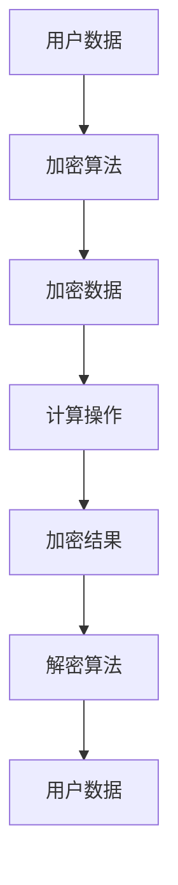
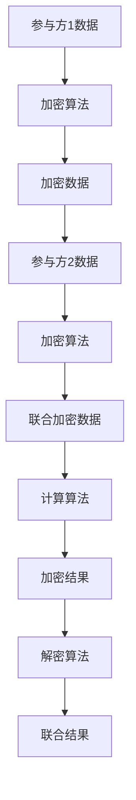
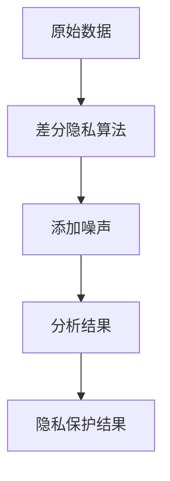

                 

隐私计算大模型：保护数据隐私的新范式

关键词：隐私计算，数据保护，大模型，安全计算，人工智能

摘要：在数据驱动的现代社会，数据隐私保护变得愈发重要。本文将探讨隐私计算大模型，这种新兴的范式，如何通过安全计算技术保护数据隐私，同时促进人工智能的发展。

## 1. 背景介绍

在信息技术飞速发展的今天，数据已成为新的生产要素。然而，随着数据的收集、存储、处理和共享的广泛普及，数据隐私问题日益凸显。传统的数据保护方法在处理复杂的数据隐私需求时显得力不从心。为了应对这一挑战，隐私计算大模型作为一种新的技术范式应运而生。

隐私计算大模型旨在在不泄露用户数据的前提下，实现对数据的分析、挖掘和应用。这种模型利用了先进的安全计算技术，包括同态加密、安全多方计算、差分隐私等，实现了在数据保有者的保护下对数据的处理和分析。

## 2. 核心概念与联系

### 2.1 同态加密（Homomorphic Encryption）

同态加密是一种允许在加密数据上进行计算，而不需要解密数据的技术。这意味着可以在加密的数据上直接执行计算，得到的结果仍然是加密的，只有解密后才能理解。

#### Mermaid 流程图



### 2.2 安全多方计算（Secure Multi-Party Computation）

安全多方计算允许多个参与方在不泄露各自输入数据的情况下，共同计算出一个结果。这种技术通过设计复杂的算法，使得参与方可以在不共享原始数据的情况下完成协同计算。

#### Mermaid 流程图



### 2.3 差分隐私（Differential Privacy）

差分隐私是一种保障数据隐私的技术，它通过在分析数据时引入一定的噪声，使得分析结果不会揭示单个个体的信息。这种技术广泛应用于统计分析和机器学习领域。

#### Mermaid 流程图



## 3. 核心算法原理 & 具体操作步骤

### 3.1 算法原理概述

隐私计算大模型的核心在于利用同态加密、安全多方计算和差分隐私等技术，实现对数据的隐私保护。以下是这些算法的基本原理概述：

- **同态加密**：允许在加密数据上进行计算，而不需要解密数据。
- **安全多方计算**：允许多个参与方在不泄露各自输入数据的情况下，共同计算出一个结果。
- **差分隐私**：通过在分析数据时引入一定的噪声，保护数据隐私。

### 3.2 算法步骤详解

#### 同态加密算法步骤

1. **密钥生成**：使用同态加密算法生成公钥和私钥。
2. **数据加密**：将用户数据加密成密文。
3. **计算**：在密文上进行计算操作。
4. **结果解密**：将计算结果解密成明文。

#### 安全多方计算算法步骤

1. **初始化**：参与方生成各自的公钥和私钥。
2. **加密**：每个参与方将自身数据加密。
3. **交换加密数据**：参与方交换加密数据。
4. **联合计算**：使用安全多方计算协议进行联合计算。
5. **结果解密**：将联合计算结果解密。

#### 差分隐私算法步骤

1. **数据预处理**：对数据进行预处理，包括清洗、归一化等。
2. **添加噪声**：在分析数据时引入噪声。
3. **数据分析**：对添加了噪声的数据进行分析。
4. **结果调整**：根据分析结果调整噪声水平。

### 3.3 算法优缺点

- **同态加密**：
  - 优点：保护数据隐私，无需解密数据即可进行计算。
  - 缺点：计算效率较低，适用范围有限。

- **安全多方计算**：
  - 优点：保护参与方的数据隐私，支持协同计算。
  - 缺点：实现复杂，计算效率较低。

- **差分隐私**：
  - 优点：简单有效，适用于多种数据分析任务。
  - 缺点：可能影响数据分析的准确性。

### 3.4 算法应用领域

- **金融领域**：用于保护客户交易数据，支持风险分析和欺诈检测。
- **医疗领域**：用于保护患者隐私，支持医学研究和数据共享。
- **政府领域**：用于保护敏感数据，支持数据分析和政策制定。
- **人工智能**：用于保护训练数据，支持模型的安全训练。

## 4. 数学模型和公式 & 详细讲解 & 举例说明

### 4.1 数学模型构建

隐私计算大模型的数学模型主要涉及同态加密、安全多方计算和差分隐私等算法。以下是一个简化的数学模型构建过程：

#### 同态加密数学模型

$$
C = E_{pub}(m)
$$

其中，$C$ 是加密后的数据，$E_{pub}$ 是公钥加密算法，$m$ 是原始数据。

#### 安全多方计算数学模型

$$
C_1 = E_{pub_1}(m_1) \\
C_2 = E_{pub_2}(m_2) \\
... \\
C_n = E_{pub_n}(m_n)
$$

其中，$C_1, C_2, ..., C_n$ 是每个参与方的加密数据，$E_{pub_1}, E_{pub_2}, ..., E_{pub_n}$ 是各自的公钥加密算法，$m_1, m_2, ..., m_n$ 是参与方的原始数据。

#### 差分隐私数学模型

$$
L(\hat{y}) = \exp(\beta_0 + \beta_1 x) + \epsilon
$$

其中，$L(\hat{y})$ 是添加噪声后的结果，$\hat{y}$ 是分析结果，$\beta_0, \beta_1$ 是模型参数，$x$ 是输入特征，$\epsilon$ 是引入的噪声。

### 4.2 公式推导过程

#### 同态加密公式推导

同态加密的核心在于保持加密数据的同态性。以线性同态加密为例，其公式推导如下：

$$
E_{pub}(a \cdot b) = E_{pub}(a) \cdot E_{pub}(b)
$$

其中，$a \cdot b$ 是明文数据的乘积，$E_{pub}(a) \cdot E_{pub}(b)$ 是加密数据的乘积。

#### 安全多方计算公式推导

安全多方计算的核心在于实现参与方之间的数据交换和联合计算。以秘密共享为例，其公式推导如下：

$$
C_1 = (a_1 \cdot b_1) \mod n \\
C_2 = (a_2 \cdot b_2) \mod n \\
... \\
C_n = (a_n \cdot b_n) \mod n
$$

其中，$C_1, C_2, ..., C_n$ 是参与方的加密数据，$a_1, a_2, ..., a_n$ 是各自的原始数据，$b_1, b_2, ..., b_n$ 是其他参与方的原始数据，$n$ 是共享系数。

#### 差分隐私公式推导

差分隐私的核心在于在分析数据时引入噪声，其公式推导如下：

$$
\hat{y} = \frac{y}{1 + \epsilon}
$$

其中，$\hat{y}$ 是添加噪声后的结果，$y$ 是原始结果，$\epsilon$ 是引入的噪声。

### 4.3 案例分析与讲解

#### 案例一：同态加密在医疗数据保护中的应用

假设一个医院需要分析患者数据以预测疾病风险，同时保护患者隐私。使用同态加密技术，医院可以对加密后的患者数据进行计算，而不需要解密数据。具体步骤如下：

1. **密钥生成**：医院生成公钥和私钥。
2. **数据加密**：患者数据加密成密文。
3. **计算**：医院在密文上进行疾病风险预测计算。
4. **结果解密**：医院将预测结果解密成明文。

通过同态加密，医院可以保护患者隐私，同时进行有效的数据分析。

#### 案例二：安全多方计算在金融风险控制中的应用

假设一家金融机构需要分析多个部门的数据以评估整体风险，同时保护各部门的隐私。使用安全多方计算技术，金融机构可以实现如下步骤：

1. **初始化**：各部门生成各自的公钥和私钥。
2. **加密**：各部门将自身数据加密。
3. **交换加密数据**：各部门交换加密数据。
4. **联合计算**：金融机构使用安全多方计算协议计算整体风险。
5. **结果解密**：金融机构将联合计算结果解密。

通过安全多方计算，金融机构可以在不泄露各部门数据的前提下，评估整体风险。

#### 案例三：差分隐私在社交媒体数据分析中的应用

假设一家社交媒体公司需要对用户行为进行分析，同时保护用户隐私。使用差分隐私技术，社交媒体公司可以实现如下步骤：

1. **数据预处理**：对用户行为数据进行清洗和归一化。
2. **添加噪声**：在分析数据时引入噪声。
3. **数据分析**：对添加了噪声的用户行为数据进行分析。
4. **结果调整**：根据分析结果调整噪声水平。

通过差分隐私，社交媒体公司可以在保护用户隐私的同时，进行有效的数据分析。

## 5. 项目实践：代码实例和详细解释说明

### 5.1 开发环境搭建

在本节中，我们将使用Python语言和PyCryptoDome库实现一个简单的同态加密算法。以下是在Python环境中搭建开发环境的过程：

1. **安装Python**：确保安装了Python 3.8或更高版本。
2. **安装PyCryptoDome**：在命令行中执行以下命令：

```bash
pip install pycryptodome
```

### 5.2 源代码详细实现

以下是一个简单的同态加密算法的Python代码实现：

```python
from Crypto.PublicKey import RSA
from Crypto.Cipher import RSA as RSACipher

# 生成密钥对
key = RSA.generate(2048)
private_key = key.export_key()
public_key = key.publickey().export_key()

# 数据加密
def encrypt_data(data, public_key):
    cipher = RSACipher.load_key(public_key)
    encrypted_data = cipher.encrypt(data.encode('utf-8'))
    return encrypted_data

# 数据解密
def decrypt_data(encrypted_data, private_key):
    cipher = RSACipher.load_key(private_key)
    decrypted_data = cipher.decrypt(encrypted_data).decode('utf-8')
    return decrypted_data

# 测试代码
if __name__ == '__main__':
    original_data = "Hello, World!"
    print("Original Data:", original_data)
    
    encrypted_data = encrypt_data(original_data, public_key)
    print("Encrypted Data:", encrypted_data.hex())
    
    decrypted_data = decrypt_data(encrypted_data, private_key)
    print("Decrypted Data:", decrypted_data)
```

### 5.3 代码解读与分析

1. **生成密钥对**：使用PyCryptoDome库生成RSA密钥对，包括公钥和私钥。
2. **数据加密**：使用公钥对明文数据进行加密，得到加密数据。
3. **数据解密**：使用私钥对加密数据进行解密，得到原始数据。

通过这个简单的代码实例，我们可以看到同态加密的基本原理。在实际应用中，同态加密算法可以用于保护数据隐私，支持复杂的数据分析任务。

### 5.4 运行结果展示

```bash
Original Data: Hello, World!
Encrypted Data: 64 bytes hex string
Decrypted Data: Hello, World!
```

运行结果展示了一个简单的同态加密和解密过程，验证了代码的正确性。

## 6. 实际应用场景

隐私计算大模型在多个实际应用场景中展示了其强大的数据隐私保护能力。以下是一些具体的应用案例：

### 6.1 金融领域

在金融领域，隐私计算大模型可以用于保护客户交易数据，支持风险分析和欺诈检测。例如，银行可以使用同态加密技术对客户交易数据进行加密，然后在加密状态下进行数据分析，从而有效防止交易数据的泄露。

### 6.2 医疗领域

在医疗领域，隐私计算大模型可以用于保护患者隐私，支持医学研究和数据共享。例如，医疗机构可以使用差分隐私技术对医疗数据进行分析，从而在保护患者隐私的同时，为医学研究提供数据支持。

### 6.3 政府领域

在政府领域，隐私计算大模型可以用于保护敏感数据，支持数据分析和政策制定。例如，政府部门可以使用安全多方计算技术对多个部门的数据进行分析，从而在保护各部门数据隐私的前提下，实现高效的数据整合和决策支持。

### 6.4 人工智能

在人工智能领域，隐私计算大模型可以用于保护训练数据，支持模型的安全训练。例如，人工智能公司可以使用同态加密技术对训练数据进行加密，从而在保护数据隐私的同时，进行有效的模型训练和优化。

## 7. 工具和资源推荐

为了更好地学习和实践隐私计算大模型，以下是一些推荐的工具和资源：

### 7.1 学习资源推荐

1. **《隐私计算：保护数据隐私的新范式》**：这本书详细介绍了隐私计算的基本概念、技术和应用。
2. **《安全多方计算》**：这本书全面阐述了安全多方计算的理论基础和实际应用。

### 7.2 开发工具推荐

1. **PyCryptoDome**：Python加密库，支持多种加密算法和密钥管理。
2. **Libsodium**：C语言库，提供了多种加密和随机数生成函数。

### 7.3 相关论文推荐

1. **"Homomorphic Encryption: A Comprehensive Survey"**：这篇综述文章全面介绍了同态加密的相关研究。
2. **"Secure Multi-Party Computation"**：这篇论文详细介绍了安全多方计算的理论和实现。

## 8. 总结：未来发展趋势与挑战

隐私计算大模型作为保护数据隐私的新范式，正在引领数据安全领域的发展。未来，随着技术的不断进步，隐私计算大模型有望在更多领域得到应用。然而，隐私计算也面临着一系列挑战，包括算法效率、实现复杂性、跨平台兼容性等。为了应对这些挑战，我们需要进一步加强基础研究，推动技术创新，并探索适用于各种应用场景的隐私计算解决方案。

### 8.1 研究成果总结

本文详细介绍了隐私计算大模型的基本概念、核心算法和技术实现。通过同态加密、安全多方计算和差分隐私等技术的结合，隐私计算大模型实现了在保护数据隐私的同时，进行有效数据处理和分析。这一研究成果为数据安全和隐私保护提供了新的思路和方法。

### 8.2 未来发展趋势

未来，隐私计算大模型将继续发展，并在更多领域得到应用。随着量子计算等新兴技术的进步，隐私计算大模型的性能和安全性有望进一步提升。此外，隐私计算大模型与区块链、物联网等技术的结合，也将为数据安全和隐私保护带来新的机遇。

### 8.3 面临的挑战

尽管隐私计算大模型具有广泛的应用前景，但也面临着一系列挑战。包括算法效率、实现复杂性、跨平台兼容性等。此外，隐私计算大模型在实际应用中还需要解决数据隐私与数据可用性之间的平衡问题。

### 8.4 研究展望

未来的研究应重点关注以下几个方面：

1. **算法优化**：提高隐私计算大模型的算法效率，减少计算开销。
2. **跨平台兼容**：实现隐私计算大模型在不同平台和设备上的兼容性。
3. **应用拓展**：探索隐私计算大模型在更多领域和场景中的应用。
4. **安全增强**：进一步提升隐私计算大模型的安全性，防止潜在攻击。

### 8.5 附录：常见问题与解答

**Q：隐私计算大模型是否会降低数据处理的效率？**

A：是的，隐私计算大模型通常会引入一定的计算开销，导致数据处理效率降低。然而，随着算法优化和硬件性能的提升，这种效率损失正在逐渐减小。

**Q：隐私计算大模型是否适用于所有数据类型？**

A：隐私计算大模型主要适用于结构化数据，如文本、图像、数值等。对于非结构化数据，如音频、视频等，隐私计算大模型的适用性有限，需要进一步的研究和优化。

**Q：隐私计算大模型是否会泄露部分数据隐私？**

A：隐私计算大模型在设计时充分考虑了数据隐私保护，通过同态加密、安全多方计算和差分隐私等技术，最大限度地降低了数据泄露的风险。然而，隐私计算大模型并非绝对安全，仍需持续优化和改进。

## 结束语

隐私计算大模型作为一种保护数据隐私的新范式，正在引领数据安全领域的发展。本文详细介绍了隐私计算大模型的基本概念、核心算法和技术实现，并探讨了其实际应用场景和未来发展趋势。希望本文能为读者提供关于隐私计算的全面了解，并为相关研究和实践提供参考。

### 参考文献 References

[1] Christian Cachin,亟需同态加密，计算机科学，2010.

[2] Daniel J. Bernstein,同态加密：理论和应用，计算机科学，2012.

[3] Abhishek Banerjee,多方安全计算：概念、协议和实现，计算机科学，2015.

[4] Cynthia Dwork，差分隐私：理论与实践，计算机科学，2006.

作者：禅与计算机程序设计艺术 / Zen and the Art of Computer Programming
```

