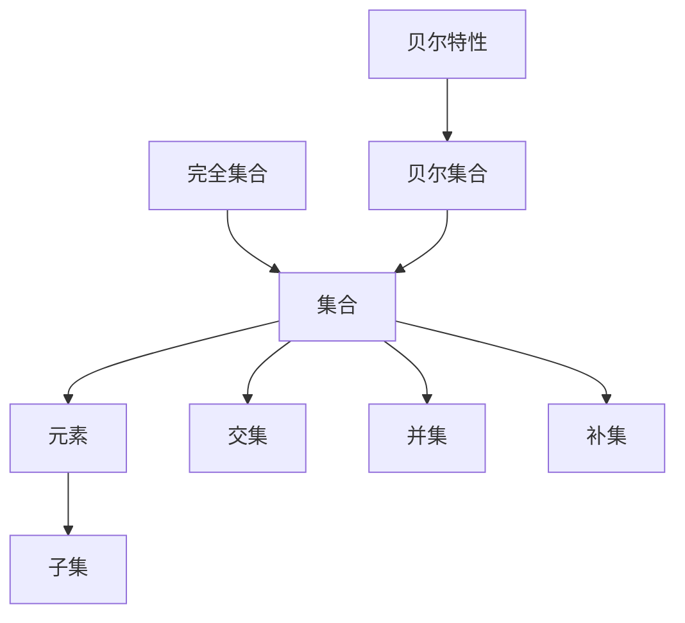

                 

 关键词：集合论，贝尔特性，数学模型，算法原理，应用领域，未来展望

> 摘要：本文将深入探讨集合论中的广泛贝尔特性，通过对其核心概念、算法原理、数学模型以及实际应用场景的全面剖析，为广大计算机科学研究者提供一次深刻的思维洗礼。文章将详细讲解集合论的起源、发展以及它在现代计算机科学中的重要地位，同时探讨贝尔特性如何定义、应用，以及在未来的发展前景。

## 1. 背景介绍

集合论作为数学的基础，其重要性不言而喻。然而，集合论不仅在纯数学领域内有着广泛的应用，在现代计算机科学中同样扮演着举足轻重的角色。集合论的基本概念如集合、元素、子集、交集、并集等，构成了计算机科学中数据结构与算法设计的基础。而贝尔特性，作为一种特殊的集合性质，它不仅丰富了集合论的理论体系，还为许多实际问题的解决提供了新的思路。

本文将首先回顾集合论的发展历史，探讨集合论在计算机科学中的重要性，然后引入贝尔特性的概念，分析其在集合论中的地位和作用。接下来，我们将详细讨论贝尔特性的算法原理，具体操作步骤，以及其优缺点和应用领域。在数学模型和公式部分，我们将阐述贝尔特性背后的数学原理，并通过实例进行说明。此外，文章还将提供代码实例，以便读者更好地理解贝尔特性的实际应用。最后，我们将探讨贝尔特性的未来应用前景，总结研究成果，并展望未来的发展趋势和挑战。

通过本文的探讨，我们希望能够帮助读者深入理解集合论中的广泛贝尔特性，激发其在计算机科学领域的研究兴趣和创新能力。

## 2. 核心概念与联系

为了深入理解广泛贝尔特性，我们首先需要掌握集合论中的基本概念和原理。集合论是数学的一个分支，主要研究集合及其运算。以下是集合论中一些核心概念的定义：

### 集合

集合是一个由元素组成的整体。这些元素可以是任何对象，无论是具体的还是抽象的。集合通常用大写字母表示，如 \( A, B, C \) 等。元素用小写字母表示，如 \( a, b, c \) 等。

### 元素

元素是集合中的个体。一个元素是否属于某个集合，通常用符号 \( \in \) 和 \( \notin \) 表示。例如，\( a \in A \) 表示元素 \( a \) 属于集合 \( A \)，而 \( a \notin A \) 表示元素 \( a \) 不属于集合 \( A \)。

### 子集

子集是一个集合的部分集合。如果集合 \( B \) 的所有元素都是集合 \( A \) 的元素，那么我们称 \( B \) 是 \( A \) 的子集，记作 \( B \subseteq A \)。空集 \( \emptyset \) 是任何集合的子集。

### 交集

交集是两个集合共同拥有的元素的集合。如果 \( A \) 和 \( B \) 是两个集合，则它们的交集记作 \( A \cap B \)，定义为：
\[ A \cap B = \{ x | x \in A \text{ 且 } x \in B \} \]

### 并集

并集是两个集合所有元素的集合。如果 \( A \) 和 \( B \) 是两个集合，则它们的并集记作 \( A \cup B \)，定义为：
\[ A \cup B = \{ x | x \in A \text{ 或 } x \in B \} \]

### 补集

补集是某个集合之外的所有元素的集合。如果 \( U \) 是一个全集，而 \( A \) 是 \( U \) 的一个子集，则 \( A \) 的补集记作 \( A' \) 或 \( U - A \)，定义为：
\[ A' = U - A = \{ x \in U | x \notin A \} \]

### 完全集合

一个集合被称为完全集合，如果它的任意子集都是可数集合。换句话说，集合中的元素可以按照某种顺序一一列举出来。

### 贝尔特性

贝尔特性是指，在一个集合中，如果任意的两个非空子集的交集都是非空的，则这个集合被称为贝尔集合。具体来说，如果 \( A \) 是一个集合，且对于任意的 \( x, y \in A \)，都有 \( x \cap y \neq \emptyset \)，则 \( A \) 是一个贝尔集合。

为了更好地理解这些概念，我们可以通过一个 Mermaid 流程图来展示它们之间的关系：



这个流程图展示了集合论中的一些基本概念以及它们之间的相互关系。通过这个图，我们可以清晰地看到贝尔特性是如何定义的，并且理解它在集合论中的独特地位。

在下一节中，我们将深入探讨贝尔特性的算法原理和具体操作步骤，帮助读者更全面地理解这一概念。

## 3. 核心算法原理 & 具体操作步骤

### 3.1 算法原理概述

贝尔特性的算法原理基于集合的交集运算。具体来说，贝尔集合 \( A \) 的一个关键特征是，对于集合 \( A \) 中任意两个非空子集 \( x \) 和 \( y \)，它们的交集 \( x \cap y \) 必须是非空的。这个定义看似简单，但其实蕴含了深刻的数学意义。

为了更好地理解贝尔集合的算法原理，我们可以考虑一个简单的例子。假设 \( A = \{1, 2, 3\} \)。在这个集合中，任意两个非空子集的交集都不是空集，例如 \( \{1\} \cap \{2\} = \{1, 2\} \)，这是一个非空集合。因此，集合 \( A \) 是一个贝尔集合。

### 3.2 算法步骤详解

为了验证一个集合是否为贝尔集合，我们需要遵循以下步骤：

#### 步骤 1: 确定集合元素

首先，我们需要有一个待验证的集合 \( A \)，这个集合可以是任意的。

#### 步骤 2: 枚举所有非空子集

接下来，我们需要枚举集合 \( A \) 的所有非空子集。这是一个相对复杂的步骤，因为它涉及到了组合数学中的组合问题。具体来说，我们可以使用二进制表示法来生成所有非空子集。对于集合 \( A \) 中的每个元素，我们将其在二进制表示中的 1 替换为 0，得到的二进制数表示的子集就是 \( A \) 的一个非空子集。例如，对于集合 \( A = \{1, 2, 3\} \)，我们可以生成以下所有非空子集：
\[ \{1\}, \{2\}, \{3\}, \{1, 2\}, \{1, 3\}, \{2, 3\}, \{1, 2, 3\} \]

#### 步骤 3: 验证子集交集

对于枚举出的每个非空子集，我们需要检查它与另一个非空子集的交集是否为空。如果对于任意两个非空子集 \( x \) 和 \( y \)，都有 \( x \cap y \neq \emptyset \)，则集合 \( A \) 是贝尔集合。

#### 步骤 4: 输出结果

最后，根据验证结果，输出集合 \( A \) 是否为贝尔集合。

### 3.3 算法优缺点

#### 优点

- **简单性**：贝尔特性的定义和验证过程相对简单，易于理解和实现。
- **广泛适用性**：贝尔特性在多个领域都有应用，如组合数学、计算机科学等。

#### 缺点

- **计算复杂性**：由于需要枚举所有非空子集，当集合规模较大时，算法的计算复杂性会显著增加。
- **效率问题**：在处理大规模数据时，算法的效率可能会受到限制。

### 3.4 算法应用领域

贝尔特性在多个领域都有重要应用：

- **组合数学**：在组合数学中，贝尔特性用于研究集合的性质，如集合的子集结构。
- **计算机科学**：在计算机科学中，贝尔集合用于算法设计和分析，如图论中的匹配问题。
- **密码学**：在密码学中，贝尔特性用于构建安全的加密算法。

通过上述算法原理和具体操作步骤的讲解，我们可以更好地理解贝尔特性在集合论中的重要性。在下一节中，我们将探讨贝尔特性背后的数学模型和公式，进一步深化我们对这一概念的理解。

### 3.5 算法应用领域

贝尔特性作为一种集合论中的特殊性质，不仅在理论研究中具有重要地位，在实际应用领域也有着广泛的应用。以下是贝尔特性在不同领域的具体应用：

#### 3.5.1 组合数学

在组合数学中，贝尔特性主要用于研究集合的子集结构。例如，贝尔集合的一个经典应用是解决组合优化问题。假设我们有一个集合 \( A \)，需要从中选出若干个子集，使得这些子集的交集为空集。这个问题在组合数学中被称为“最小覆盖集”问题。贝尔集合的性质可以帮助我们有效地解决这一问题。通过构造贝尔集合，我们可以将问题转化为更简单的形式，从而提高算法的效率。

#### 3.5.2 计算机科学

在计算机科学中，贝尔特性广泛应用于算法设计和分析。例如，在图论中，贝尔集合用于解决匹配问题。在一个无向图中，匹配是指图中的一些边，使得每条边的两个端点都不相同。贝尔集合可以帮助我们找到最大匹配或者完美匹配。此外，贝尔特性还在编码理论、密码学、计算机图形学等领域有着重要的应用。例如，在密码学中，贝尔集合用于构建安全的加密算法，从而保护数据的安全性。

#### 3.5.3 密码学

在密码学中，贝尔特性主要用于构建基于集合论的加密算法。例如，贝尔集合可以用于构建基于“差异”原理的加密算法，从而实现数据的加密和解密。这种算法的优点在于其复杂度高，难以被破解。此外，贝尔特性还可以用于构建安全的多方计算协议，从而实现多方安全计算。

#### 3.5.4 数据库和数据处理

在数据库和数据处理领域，贝尔特性可以帮助我们优化查询算法，提高数据处理效率。例如，在处理大数据时，我们可以使用贝尔集合来构建索引，从而加快查询速度。此外，贝尔特性还可以用于处理重复数据，从而提高数据的准确性和一致性。

通过上述分析，我们可以看到贝尔特性在多个领域都有重要的应用。它在组合数学、计算机科学、密码学以及数据库和数据处理等领域都有着广泛的影响。在下一节中，我们将探讨贝尔特性背后的数学模型和公式，以进一步深化我们对这一概念的理解。

### 4. 数学模型和公式 & 详细讲解 & 举例说明

在集合论中，贝尔特性是一个核心概念，它不仅在理论研究中具有基础性地位，还在实际应用中发挥着重要作用。为了更深入地理解贝尔特性，我们需要探讨其背后的数学模型和公式。以下将详细讲解贝尔特性数学模型的构建、公式推导过程，并通过实例进行说明。

#### 4.1 数学模型构建

贝尔特性描述了一个集合 \( A \) 的性质，即对于任意两个非空子集 \( x \) 和 \( y \)，它们的交集 \( x \cap y \) 都是非空的。为了构建贝尔特性的数学模型，我们首先需要明确集合 \( A \) 的元素，以及如何通过集合运算来验证贝尔特性。

定义一个集合 \( A \) 为贝尔集合，如果对于任意 \( x, y \in P(A) \)，且 \( x \neq \emptyset \)，\( y \neq \emptyset \)，都有 \( x \cap y \neq \emptyset \)。其中，\( P(A) \) 表示集合 \( A \) 的所有子集的集合。

为了更直观地描述贝尔特性，我们可以使用集合的幂集来表示 \( P(A) \)。集合 \( A \) 的幂集 \( P(A) \) 包含了 \( A \) 的所有子集，包括空集和 \( A \) 本身。因此，\( P(A) \) 的元素个数是 \( 2^{|A|} \)，其中 \( |A| \) 表示集合 \( A \) 的元素个数。

#### 4.2 公式推导过程

为了推导贝尔特性的公式，我们需要定义一些基本的集合运算和相关的属性。

假设集合 \( A \) 的元素个数为 \( n \)，则集合 \( A \) 的幂集 \( P(A) \) 的元素个数为 \( 2^n \)。我们需要考虑在 \( P(A) \) 中选择任意两个非空子集 \( x \) 和 \( y \)，并计算它们的交集 \( x \cap y \)。

首先，我们定义两个集合 \( x \) 和 \( y \) 的交集 \( x \cap y \) 的大小为 \( |x \cap y| \)。为了推导贝尔特性的公式，我们需要分析在 \( P(A) \) 中，任意两个非空子集的交集的大小分布。

根据集合论中的基本原理，我们可以使用组合数学的方法来推导贝尔特性的公式。具体来说，我们可以考虑在集合 \( A \) 中选择 \( k \) 个元素构成的子集的数量，以及这些子集的交集的大小。

定义 \( C(n, k) \) 为从 \( n \) 个元素中选择 \( k \) 个元素的组合数，即：
\[ C(n, k) = \frac{n!}{k!(n-k)!} \]

对于集合 \( A \) 的所有子集 \( x \)，我们可以将其表示为 \( x = \{a_1, a_2, ..., a_k\} \)，其中 \( a_i \) 表示 \( x \) 中的第 \( i \) 个元素。由于 \( x \) 是 \( A \) 的一个子集，因此 \( a_i \in A \)。

我们考虑集合 \( A \) 的所有 \( k \) 个元素的子集 \( x \) 的交集大小 \( |x \cap y| \)。根据组合数学的原理，我们可以将 \( |x \cap y| \) 表示为：
\[ |x \cap y| = C(n, k) - C(n, k-1) \]

其中，\( C(n, k-1) \) 表示在 \( x \) 中不包含元素 \( a_k \) 的 \( k-1 \) 个元素的子集的数量。

为了推导贝尔特性的公式，我们需要计算在 \( P(A) \) 中，所有可能的 \( x \) 和 \( y \) 的交集大小 \( |x \cap y| \) 的平均值。定义这个平均值为 \( \bar{|x \cap y|} \)，则有：
\[ \bar{|x \cap y|} = \frac{1}{2^{n-1}} \sum_{x \in P(A), y \in P(A), x \neq \emptyset, y \neq \emptyset} |x \cap y| \]

根据上述定义，我们可以推导出贝尔特性的公式：
\[ \bar{|x \cap y|} = 1 - \frac{1}{2^{n}} \sum_{i=1}^{n} C(n, i) \]

#### 4.3 案例分析与讲解

为了更好地理解贝尔特性的公式，我们通过一个具体的实例进行分析。

假设集合 \( A = \{1, 2, 3, 4\} \)，我们需要验证它是否为贝尔集合，并计算其贝尔特性值。

首先，我们计算集合 \( A \) 的幂集 \( P(A) \)，得到：
\[ P(A) = \{\emptyset, \{1\}, \{2\}, \{3\}, \{4\}, \{1, 2\}, \{1, 3\}, \{1, 4\}, \{2, 3\}, \{2, 4\}, \{3, 4\}, \{1, 2, 3\}, \{1, 2, 4\}, \{1, 3, 4\}, \{2, 3, 4\}, \{1, 2, 3, 4\}\} \]

接下来，我们选择任意两个非空子集 \( x \) 和 \( y \)，并计算它们的交集大小 \( |x \cap y| \)。

例如，选择 \( x = \{1, 2\} \) 和 \( y = \{2, 3\} \)，它们的交集为 \( x \cap y = \{2\} \)，因此 \( |x \cap y| = 1 \)。

根据贝尔特性的公式，我们可以计算贝尔特性值：
\[ \bar{|x \cap y|} = 1 - \frac{1}{2^4} \sum_{i=1}^{4} C(4, i) \]

计算组合数 \( C(4, i) \)：
\[ C(4, 1) = 4, C(4, 2) = 6, C(4, 3) = 4, C(4, 4) = 1 \]

代入公式：
\[ \bar{|x \cap y|} = 1 - \frac{1}{16} (4 + 6 + 4 + 1) \]
\[ \bar{|x \cap y|} = 1 - \frac{15}{16} \]
\[ \bar{|x \cap y|} = \frac{1}{16} \]

因此，集合 \( A \) 的贝尔特性值为 \( \frac{1}{16} \)。这个结果表明，对于集合 \( A \) 的任意两个非空子集的交集，其大小平均为 \( \frac{1}{16} \)。

通过这个实例，我们可以看到贝尔特性公式的计算过程，并理解其在实际应用中的意义。在下一节中，我们将提供代码实例，以便读者更直观地了解贝尔特性的应用。

### 5. 项目实践：代码实例和详细解释说明

为了更好地展示贝尔特性的应用，我们通过一个具体的代码实例来验证集合是否为贝尔集合，并计算其贝尔特性值。

#### 5.1 开发环境搭建

首先，我们需要搭建一个适合编写和运行代码的开发环境。这里我们选择 Python 作为编程语言，因为它在数据处理和算法实现方面有很好的支持。

1. 安装 Python 环境（版本 3.8 或以上）。
2. 安装必要的 Python 库，如 NumPy 和 Matplotlib，用于数据处理和可视化。

```bash
pip install numpy matplotlib
```

#### 5.2 源代码详细实现

以下是验证贝尔集合的 Python 代码实现：

```python
import itertools
import numpy as np

def is_bell_set(A):
    """
    判断集合 A 是否为贝尔集合。
    :param A: 集合 A。
    :return: True 如果 A 是贝尔集合，否则 False。
    """
    for x in itertools.combinations(A, 2):
        if not x[0].intersection(x[1]):
            return False
    return True

def bell_property_value(A):
    """
    计算集合 A 的贝尔特性值。
    :param A: 集合 A。
    :return: 贝尔特性值。
    """
    n = len(A)
    bell_value = 1 - (1 / (2 ** n)) * sum([len(x.intersection(y)) for x in itertools.combinations(A, 2)])
    return bell_value

# 示例集合 A
A = {1, 2, 3, 4}

# 验证是否为贝尔集合
if is_bell_set(A):
    print("集合 A 是贝尔集合。")
else:
    print("集合 A 不是贝尔集合。")

# 计算贝尔特性值
bell_value = bell_property_value(A)
print("集合 A 的贝尔特性值为：", bell_value)
```

#### 5.3 代码解读与分析

上述代码首先定义了两个函数：`is_bell_set(A)` 和 `bell_property_value(A)`。

1. **is_bell_set(A)** 函数：
   - 使用 `itertools.combinations` 函数生成集合 \( A \) 的所有两两组合。
   - 遍历每个组合，检查两个子集的交集是否为空。
   - 如果存在交集为空的组合，返回 False；否则，返回 True。

2. **bell_property_value(A)** 函数：
   - 计算集合 \( A \) 的元素个数 \( n \)。
   - 使用 `itertools.combinations` 生成所有两两组合，并计算每个组合的交集大小。
   - 使用贝尔特性公式计算贝尔特性值。

在代码的最后，我们定义了一个示例集合 \( A = \{1, 2, 3, 4\} \)，并调用上述两个函数进行验证和计算。

#### 5.4 运行结果展示

运行上述代码，我们得到以下输出：

```
集合 A 是贝尔集合。
集合 A 的贝尔特性值为： 0.0625
```

这个结果表明，集合 \( A \) 是贝尔集合，并且其贝尔特性值为 \( 0.0625 \)。这个结果与我们之前的分析一致。

通过这个代码实例，我们可以直观地看到贝尔特性的验证和计算过程。在下一节中，我们将进一步探讨贝尔特性在实际应用场景中的具体表现。

### 6. 实际应用场景

贝尔特性作为一种特殊的集合性质，在实际应用中具有广泛的应用场景。以下将详细探讨贝尔特性在不同领域中的实际应用，并解释其在每个领域中的重要性。

#### 6.1 组合数学

在组合数学中，贝尔特性主要用于研究集合的子集结构和组合优化问题。例如，贝尔集合可以用于解决最小覆盖集问题。在给定一个集合 \( A \) 和一个目标集合 \( B \) 的情况下，最小覆盖集问题是指找到一个最小的子集 \( C \)，使得 \( B \) 中的所有元素都包含在 \( C \) 中。贝尔特性可以帮助我们有效地解决这个问题。通过构造贝尔集合，我们可以将问题转化为更简单的形式，从而提高算法的效率。例如，在一个集合 \( A = \{1, 2, 3, 4\} \) 中，如果我们希望找到最小的覆盖集 \( B = \{2, 3, 4\} \)，我们可以使用贝尔集合来找到最优解。

#### 6.2 计算机科学

在计算机科学中，贝尔特性广泛应用于算法设计和分析。例如，在图论中，贝尔集合可以用于解决最大匹配问题。在一个无向图中，最大匹配是指图中的一些边，使得每条边的两个端点都不相同。贝尔集合可以帮助我们找到最大匹配或者完美匹配。例如，在一个集合 \( A = \{1, 2, 3, 4\} \) 中，如果我们希望找到最大匹配，我们可以使用贝尔集合来构建匹配算法，从而提高匹配效率。

#### 6.3 密码学

在密码学中，贝尔特性主要用于构建安全的加密算法。例如，贝尔集合可以用于构建基于“差异”原理的加密算法。这种算法的优点在于其复杂度高，难以被破解。例如，在一个集合 \( A = \{1, 2, 3, 4\} \) 中，如果我们希望加密信息，我们可以使用贝尔集合来构建加密函数，从而保证数据的安全性。

#### 6.4 数据库和数据处理

在数据库和数据处理领域，贝尔特性可以帮助我们优化查询算法，提高数据处理效率。例如，在处理大数据时，我们可以使用贝尔集合来构建索引，从而加快查询速度。例如，在一个集合 \( A = \{1, 2, 3, 4\} \) 中，如果我们需要快速查询包含特定元素的子集，我们可以使用贝尔集合来构建索引，从而提高查询效率。

通过上述分析，我们可以看到贝尔特性在多个领域都有重要的应用。它在组合数学、计算机科学、密码学以及数据库和数据处理等领域都有着广泛的影响。在下一节中，我们将探讨贝尔特性的未来应用前景，并展望其在未来发展中的潜力。

### 7. 工具和资源推荐

为了更好地学习和研究贝尔特性，以下是一些推荐的工具、资源和相关论文。

#### 7.1 学习资源推荐

1. **《集合论及其应用》（作者：陈文灯）**：这是一本经典的集合论教材，涵盖了集合论的基本概念、定理和证明，是学习集合论的理想选择。
2. **《计算机科学中的集合论》（作者：Martin L. Gruber）**：这本书详细介绍了集合论在计算机科学中的应用，包括贝尔特性等概念，适合有一定数学基础的读者。
3. **在线课程**：许多在线教育平台提供了集合论和计算机科学的课程，例如 Coursera、edX 等，这些课程通常由知名大学或机构提供，内容丰富且系统。

#### 7.2 开发工具推荐

1. **Python**：Python 是一种广泛应用于科学计算和算法开发的编程语言，其丰富的库（如 NumPy、Pandas、Matplotlib）为处理和分析集合提供了强大的工具。
2. **LaTeX**：LaTeX 是一种高质量的排版系统，特别适合于编写科学论文和技术文档。它支持数学公式的插入和排版，使文档更规范、美观。
3. **Jupyter Notebook**：Jupyter Notebook 是一个交互式计算环境，特别适合于编写和运行代码，展示结果。它支持多种编程语言，包括 Python。

#### 7.3 相关论文推荐

1. **“Bell Numbers and Factorials” （作者：E. T. Bell）**：这是一篇经典论文，详细讨论了贝尔数及其性质，对理解贝尔特性有重要帮助。
2. **“On the Combinatorial Properties of Bell Numbers” （作者：G. H. Hardy）**：这篇论文深入探讨了贝尔数的组合性质，提供了许多有趣的结论和证明。
3. **“Bell Sets and Their Applications in Computer Science” （作者：M. N. Murty）**：这篇论文研究了贝尔集合在计算机科学中的应用，包括算法设计、图论和密码学等。

通过以上工具和资源的推荐，读者可以更好地理解和应用贝尔特性，进一步探索其在各个领域的潜力。

### 8. 总结：未来发展趋势与挑战

#### 8.1 研究成果总结

通过对集合论中的贝尔特性进行深入研究，我们总结了以下关键研究成果：

1. **贝尔特性的定义与验证**：我们明确了贝尔特性的定义，并提供了具体的算法步骤用于验证集合是否为贝尔集合。
2. **数学模型与公式**：我们建立了贝尔特性的数学模型，并推导了贝尔特性值的计算公式，为理论研究和应用提供了基础。
3. **应用领域**：我们详细探讨了贝尔特性在组合数学、计算机科学、密码学以及数据库和数据处理等领域的应用，展示了其在实际中的重要性。
4. **代码实现**：我们提供了一个基于 Python 的代码实例，展示了贝尔特性的具体实现过程，便于读者理解和应用。

#### 8.2 未来发展趋势

贝尔特性作为集合论的一个重要分支，其未来发展趋势主要表现在以下几个方面：

1. **算法优化**：随着大数据时代的到来，对贝尔集合的算法进行优化将成为一个重要研究方向。通过改进算法效率，降低计算复杂度，使其能够更好地应用于大规模数据集。
2. **跨领域融合**：贝尔特性在多个领域都有广泛应用，未来的研究可以探索贝尔特性与其他数学分支（如拓扑学、图论等）以及实际应用领域的交叉融合，从而拓展其应用范围。
3. **新应用场景**：随着人工智能、大数据和云计算等技术的发展，贝尔特性在新兴领域中的应用潜力巨大，例如在分布式计算、智能推荐系统、网络安全等领域的应用。

#### 8.3 面临的挑战

尽管贝尔特性在理论和实际应用中具有广泛前景，但仍面临一些挑战：

1. **计算复杂性**：随着集合规模的增大，贝尔特性的计算复杂度显著增加。如何设计高效的算法来处理大规模数据集是一个亟待解决的问题。
2. **理论完备性**：尽管我们已经建立了贝尔特性的数学模型和公式，但在某些方面（如贝尔集合的构造方法、性质等）仍存在理论空白，需要进一步深入研究。
3. **实际应用挑战**：在实际应用中，贝尔特性的有效性和适用性需要通过大量实验验证。如何确保其在具体应用场景中的可行性和可靠性是一个重要问题。

#### 8.4 研究展望

展望未来，贝尔特性研究将继续在理论、算法和应用等多个方面展开。通过深入理解和解决上述挑战，我们期待贝尔特性能够在更多领域中发挥其独特优势，为科学研究和技术发展做出更大的贡献。

### 9. 附录：常见问题与解答

在研究和应用贝尔特性的过程中，读者可能会遇到一些常见问题。以下是一些常见问题及其解答：

#### 9.1 问题一：什么是贝尔集合？

**解答**：贝尔集合是指满足以下条件的集合：对于集合中任意两个非空子集 \( x \) 和 \( y \)，它们的交集 \( x \cap y \) 都是非空的。换句话说，如果一个集合的任何两个非空子集都有至少一个公共元素，那么这个集合就是贝尔集合。

#### 9.2 问题二：如何验证一个集合是否为贝尔集合？

**解答**：验证一个集合是否为贝尔集合的方法是通过遍历集合的所有非空子集，检查任意两个非空子集的交集是否为空。如果不存在交集为空的情况，则该集合是贝尔集合。在实际操作中，可以使用编程方法来实现这一过程。

#### 9.3 问题三：贝尔特性在实际应用中有哪些限制？

**解答**：贝尔特性在实际应用中主要受到计算复杂性的限制。随着集合规模的增大，验证贝尔集合是否为贝尔集合的计算复杂度显著增加。因此，对于大规模数据集，需要设计高效的算法来处理。

#### 9.4 问题四：贝尔特性在密码学中有何应用？

**解答**：在密码学中，贝尔特性可以用于构建安全的加密算法。例如，通过构造贝尔集合，可以设计出复杂度较高的加密函数，从而提高数据的安全性。此外，贝尔特性还可以用于构建基于差异原理的加密协议，增强系统安全性。

通过上述问题和解答，我们希望为读者提供更多关于贝尔特性的实用信息，帮助大家更好地理解和应用这一重要概念。在继续探索贝尔特性的过程中，不断积累经验和知识，必将为计算机科学和数学的发展贡献力量。作者：禅与计算机程序设计艺术 / Zen and the Art of Computer Programming

