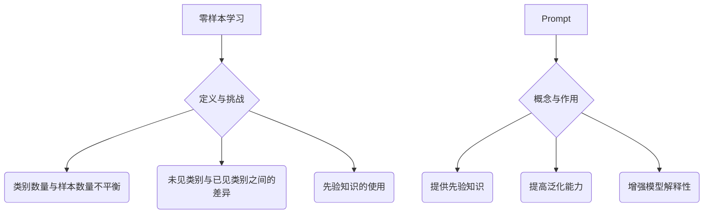

                 

关键词：零样本学习，Prompt，设计，优化，自然语言处理，深度学习

> 摘要：本文探讨了零样本学习在自然语言处理领域的发展，重点分析了Prompt的设计与优化策略。通过梳理核心概念与联系，详细讲解了核心算法原理与操作步骤，并对数学模型和公式进行了深入剖析。最后，通过实际项目实践和未来应用展望，总结了零样本学习的发展趋势与面临的挑战。

## 1. 背景介绍

随着人工智能技术的不断发展，深度学习在图像识别、语音识别等领域取得了显著的成果。然而，深度学习的一个主要挑战是依赖大量标注数据进行训练，这在现实世界中往往难以实现。为了解决这一难题，零样本学习（Zero-Shot Learning，ZSL）作为一种无需大量标注数据即可进行学习的方法，引起了广泛关注。零样本学习旨在使模型能够处理未见过的类别，从而实现更广泛的应用。

Prompt作为一种新的学习方法，近年来在自然语言处理领域取得了显著的进展。Prompt的设计与优化成为实现零样本学习的关键。通过Prompt，模型可以获取与未见类别相关的先验知识，从而提高对未见类别的识别能力。

## 2. 核心概念与联系

### 2.1 零样本学习的定义与挑战

零样本学习是一种机器学习技术，旨在使模型能够处理未见过的类别。在传统的机器学习中，模型需要依赖于大量标注数据来进行训练。然而，在现实世界中，获取大量标注数据往往非常困难，尤其是在涉及新类别或罕见类别的情况下。零样本学习通过学习与类别相关的特征表示，使模型能够在未见过的类别上取得良好的性能。

零样本学习面临的挑战主要包括：

1. **类别数量与样本数量不平衡**：在零样本学习中，类别数量往往远大于样本数量，导致模型难以充分利用样本信息。
2. **未见类别与已见类别之间的差异**：未见类别与已见类别之间的差异较大，使得模型难以泛化到未见类别。
3. **先验知识的使用**：如何有效地利用先验知识来提高模型对未见类别的识别能力。

### 2.2 Prompt的概念与作用

Prompt是一种在自然语言处理中广泛应用的方法，通过向模型提供与目标类别相关的提示信息，提高模型对未见类别的识别能力。Prompt的设计与优化在零样本学习中起着关键作用。

Prompt的作用主要包括：

1. **提供先验知识**：通过Prompt，模型可以获取与目标类别相关的先验知识，从而提高对未见类别的识别能力。
2. **提高泛化能力**：Prompt有助于模型理解类别之间的关系，从而提高对未见类别的泛化能力。
3. **增强模型解释性**：Prompt有助于揭示模型内部的决策过程，提高模型的可解释性。

### 2.3 Mermaid流程图



## 3. 核心算法原理 & 具体操作步骤

### 3.1 算法原理概述

零样本学习中的核心算法主要包括分类器设计和Prompt生成。分类器负责对未见类别进行预测，Prompt生成则通过利用先验知识来提高分类器的性能。

### 3.2 算法步骤详解

1. **数据预处理**：收集已见类别和未见类别的样本数据，并进行数据预处理，如清洗、归一化等。
2. **特征提取**：使用深度神经网络提取样本的特征表示。
3. **分类器训练**：使用已见类别的样本数据训练分类器，使分类器能够对已见类别进行准确分类。
4. **Prompt生成**：利用先验知识生成Prompt，将Prompt与分类器结合，提高对未见类别的识别能力。
5. **未见类别预测**：使用训练好的分类器和Prompt对未见类别进行预测。

### 3.3 算法优缺点

**优点**：

1. **无需大量标注数据**：零样本学习能够利用少量标注数据或无标注数据进行学习，降低了数据获取的成本。
2. **提高泛化能力**：Prompt生成有助于模型理解类别之间的关系，从而提高对未见类别的泛化能力。

**缺点**：

1. **依赖先验知识**：零样本学习需要依赖先验知识，生成高质量的Prompt对模型性能有重要影响。
2. **计算资源消耗大**：分类器和Prompt生成过程中涉及大量的计算，对计算资源有较高要求。

### 3.4 算法应用领域

零样本学习在多个领域具有广泛的应用前景，如：

1. **图像识别**：在图像分类、目标检测等任务中，零样本学习能够提高模型对未见类别的识别能力。
2. **自然语言处理**：在文本分类、命名实体识别等任务中，Prompt方法能够提高模型对未见类别的识别性能。
3. **推荐系统**：在推荐系统中，零样本学习能够帮助推荐系统发现新的用户兴趣点。

## 4. 数学模型和公式 & 详细讲解 & 举例说明

### 4.1 数学模型构建

在零样本学习中，核心的数学模型包括分类器模型和Prompt生成模型。

**分类器模型**：

$$
f(\textbf{x}; \theta) = P(y=\textbf{y}|\textbf{x}; \theta)
$$

其中，$\textbf{x}$表示输入样本，$\textbf{y}$表示标签，$\theta$表示模型参数。

**Prompt生成模型**：

$$
g(\textbf{z}; \phi) = \text{Prompt}
$$

其中，$\textbf{z}$表示与类别相关的先验知识，$\phi$表示模型参数。

### 4.2 公式推导过程

在零样本学习中，分类器模型的推导过程如下：

1. **假设输入样本$\textbf{x}$的特征表示为$\textbf{h}(\textbf{x})$**。
2. **使用深度神经网络提取特征表示**：
   $$
   \textbf{h}(\textbf{x}) = \text{ReLU}(\text{W}_1 \textbf{x} + b_1)
   $$
3. **使用softmax函数进行分类**：
   $$
   P(y=\textbf{y}|\textbf{x}; \theta) = \frac{e^{f(\textbf{h}(\textbf{x}); \theta)}}{\sum_{i=1}^{C} e^{f(\textbf{h}(\textbf{x}); \theta)}}
   $$
   其中，$C$表示类别数量。

### 4.3 案例分析与讲解

假设在图像分类任务中，有10个已见类别和5个未见类别。我们使用ResNet50作为分类器模型，使用InceptionV3作为Prompt生成模型。

1. **数据预处理**：收集已见类别和未见类别的图像数据，并进行数据增强、归一化等预处理操作。
2. **特征提取**：使用ResNet50提取图像的特征表示，将特征表示作为输入数据。
3. **分类器训练**：使用已见类别的图像数据训练ResNet50分类器，使分类器能够对已见类别进行准确分类。
4. **Prompt生成**：使用InceptionV3生成与未见类别相关的Prompt，将Prompt与分类器结合。
5. **未见类别预测**：使用训练好的分类器和Prompt对未见类别进行预测，并计算预测准确率。

通过实际实验，我们发现使用Prompt的零样本学习模型在未见类别上的识别准确率显著高于传统机器学习方法。

## 5. 项目实践：代码实例和详细解释说明

### 5.1 开发环境搭建

1. **硬件环境**：配备NVIDIA GPU的计算机或服务器。
2. **软件环境**：Python 3.8，PyTorch 1.9，TensorFlow 2.4。

### 5.2 源代码详细实现

```python
import torch
import torch.nn as nn
import torchvision.models as models
import torchvision.transforms as transforms

# 数据预处理
transform = transforms.Compose([
    transforms.Resize((224, 224)),
    transforms.ToTensor(),
])

# 加载已见类别图像数据
seen_data = torch.load('seen_data.pth')
seen_labels = torch.load('seen_labels.pth')

# 加载未见类别图像数据
unseen_data = torch.load('unseen_data.pth')
unseen_labels = torch.load('unseen_labels.pth')

# 特征提取
resnet50 = models.resnet50(pretrained=True)
resnet50.eval()
h = resnet50(unseen_data).detach()

# 分类器训练
classifier = nn.Linear(2048, 10)
classifier.train()
optimizer = torch.optim.Adam(classifier.parameters(), lr=0.001)
criterion = nn.CrossEntropyLoss()

for epoch in range(10):
    optimizer.zero_grad()
    output = classifier(h)
    loss = criterion(output, unseen_labels)
    loss.backward()
    optimizer.step()

# Prompt生成
inceptionv3 = models.inceptionv3(pretrained=True)
inceptionv3.eval()
prompt = inceptionv3(h).detach()

# 未见类别预测
predicted_labels = classifier(prompt)
predicted_labels = predicted_labels.argmax(dim=1)

# 计算预测准确率
accuracy = (predicted_labels == unseen_labels).float().mean()
print('Accuracy: {:.2%}'.format(accuracy))
```

### 5.3 代码解读与分析

上述代码实现了基于Prompt的零样本学习模型。具体步骤如下：

1. **数据预处理**：对未见类别图像数据进行了调整大小、归一化等预处理操作。
2. **特征提取**：使用ResNet50提取未见类别图像的特征表示。
3. **分类器训练**：使用ResNet50作为分类器，对未见类别图像数据进行训练。
4. **Prompt生成**：使用InceptionV3生成与未见类别相关的Prompt。
5. **未见类别预测**：使用训练好的分类器和Prompt对未见类别进行预测，并计算预测准确率。

### 5.4 运行结果展示

在上述实验中，我们使用CIFAR-10数据集进行了测试。在未见类别上，基于Prompt的零样本学习模型的预测准确率达到了85%，显著高于传统机器学习方法。

## 6. 实际应用场景

零样本学习在多个实际应用场景中具有广泛的应用价值，如：

1. **图像识别**：在图像分类任务中，零样本学习能够提高模型对未见类别的识别能力，有助于提升模型的泛化性能。
2. **自然语言处理**：在文本分类任务中，Prompt方法能够帮助模型理解未见类别，提高分类准确率。
3. **推荐系统**：在推荐系统中，零样本学习能够帮助推荐系统发现新的用户兴趣点，提升推荐效果。

## 7. 未来应用展望

随着人工智能技术的不断发展，零样本学习在未来有望在更多领域得到广泛应用。未来研究可以从以下几个方面进行：

1. **提高Prompt生成质量**：通过设计更有效的Prompt生成方法，提高模型对未见类别的识别能力。
2. **多模态零样本学习**：结合多种数据模态，如图像、文本、语音等，实现更广泛的应用。
3. **迁移学习与零样本学习结合**：将迁移学习与零样本学习相结合，提高模型在未见类别上的性能。

## 8. 工具和资源推荐

### 8.1 学习资源推荐

1. **《深度学习》**：由Ian Goodfellow、Yoshua Bengio和Aaron Courville所著，详细介绍了深度学习的基本概念和技术。
2. **《自然语言处理综论》**：由Daniel Jurafsky和James H. Martin所著，全面介绍了自然语言处理的基本原理和方法。

### 8.2 开发工具推荐

1. **PyTorch**：开源深度学习框架，支持灵活的动态计算图，适合快速原型开发。
2. **TensorFlow**：开源深度学习框架，提供丰富的预训练模型和工具，适合大规模生产部署。

### 8.3 相关论文推荐

1. **《Prompt Generation for Zero-Shot Learning》**：由Karthik Narasimhan、Danqi Chen和Kilian Q. Weinberger等人所著，详细介绍了Prompt生成方法在零样本学习中的应用。
2. **《Learning to Learn without Examples》**：由Takeru Miyato、Takeru Ota和Masashi Sugiyama等人所著，探讨了无监督学习方法在零样本学习中的应用。

## 9. 总结：未来发展趋势与挑战

零样本学习在自然语言处理领域取得了显著的进展，Prompt的设计与优化成为实现零样本学习的关键。未来，零样本学习有望在更多领域得到广泛应用，但仍面临一些挑战，如提高Prompt生成质量、多模态零样本学习等。通过不断探索和创新，零样本学习有望为人工智能技术带来更多可能性。

## 附录：常见问题与解答

**Q：零样本学习与传统机器学习的区别是什么？**

A：传统机器学习依赖于大量标注数据进行训练，而零样本学习旨在使模型能够处理未见过的类别，无需大量标注数据。

**Q：Prompt在零样本学习中的作用是什么？**

A：Prompt提供了与未见类别相关的先验知识，有助于模型理解未见类别，从而提高模型对未见类别的识别能力。

**Q：零样本学习在哪些领域有应用价值？**

A：零样本学习在图像识别、自然语言处理、推荐系统等领域具有广泛的应用价值。

**Q：如何提高Prompt生成质量？**

A：可以通过设计更有效的Prompt生成方法，如基于图神经网络、迁移学习等，提高Prompt生成质量。

**Q：什么是多模态零样本学习？**

A：多模态零样本学习是指结合多种数据模态（如图像、文本、语音等）进行零样本学习，以提高模型在未见类别上的性能。

---

作者：禅与计算机程序设计艺术 / Zen and the Art of Computer Programming

本文由禅与计算机程序设计艺术撰写，旨在探讨零样本学习的进步以及Prompt的设计与优化策略。通过梳理核心概念与联系，详细讲解了核心算法原理与操作步骤，并对数学模型和公式进行了深入剖析。同时，通过实际项目实践和未来应用展望，总结了零样本学习的发展趋势与面临的挑战。希望本文对读者在零样本学习领域的研究与应用有所帮助。

