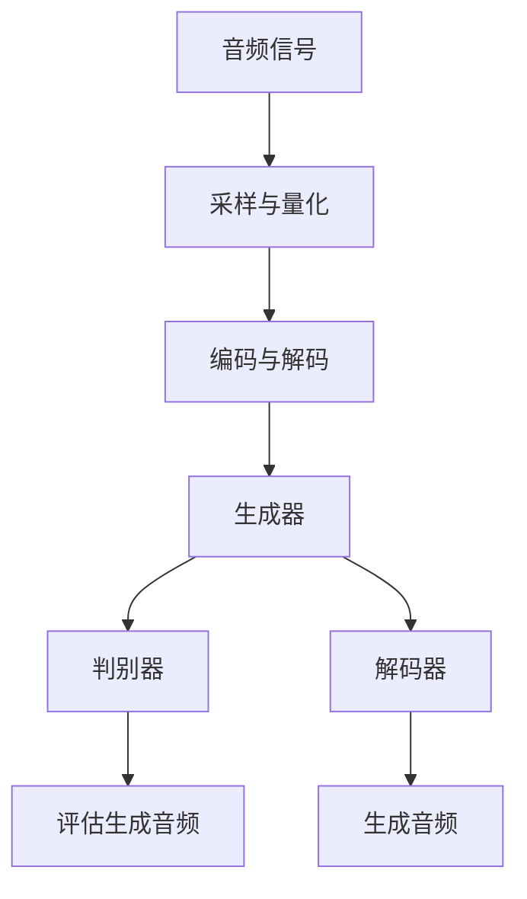

                 

关键词：音频生成，音频处理，机器学习，深度学习，神经网络，语音合成，音频识别，音频增强，音频编辑，音频内容生成

## 摘要

本文将深入探讨音频生成技术的原理与实践。音频生成是一种通过算法生成新音频的方法，其应用广泛，从音乐创作到语音合成，再到音频处理和编辑。本文将首先介绍音频生成的基本概念和核心算法，包括生成对抗网络（GANs）、变分自编码器（VAEs）等。然后，我们将通过具体的代码实例，展示如何使用Python和TensorFlow等工具来构建和训练音频生成模型。此外，文章还将讨论音频生成的实际应用场景，包括语音合成、音乐创作、音频增强和编辑等。最后，我们将展望音频生成技术的未来发展趋势和面临的挑战。

## 1. 背景介绍

### 1.1 音频生成的重要性

音频生成技术是当今信息技术领域中的一个重要研究方向，具有广泛的应用前景。在娱乐领域，音频生成可以用于音乐创作，为音乐家提供无限创意空间。在通信领域，音频生成技术可以实现实时语音合成，为语音助手和智能客服提供语音交互功能。在医疗领域，音频生成可以帮助训练医疗人员识别不同疾病的症状和声音特征。此外，音频生成在教育和辅助听力障碍人士等方面也具有重要作用。

### 1.2 音频生成的现状

随着深度学习技术的发展，音频生成技术取得了显著进展。生成对抗网络（GANs）和变分自编码器（VAEs）等算法在音频生成任务中取得了很好的效果。然而，音频生成技术仍面临许多挑战，如模型训练时间长、生成音频质量不稳定等。此外，音频生成技术的应用场景也在不断拓展，从简单的音频合成到复杂的音频增强和编辑。

## 2. 核心概念与联系

### 2.1 音频信号处理

音频信号处理是音频生成的基础，它涉及对音频信号的采样、量化、编码和解码等过程。音频信号通常表示为时间序列的离散值，这些值可以用数字信号处理技术进行处理。例如，通过傅里叶变换可以分析音频信号的频率成分，从而进行音频增强或编辑。

### 2.2 生成对抗网络（GANs）

生成对抗网络（GANs）是一种由生成器和判别器组成的模型，用于学习数据分布。生成器试图生成逼真的数据，而判别器则尝试区分生成器和真实数据。在音频生成任务中，生成器可以生成新的音频波形，而判别器则用于评估生成音频的真实性。

### 2.3 变分自编码器（VAEs）

变分自编码器（VAEs）是一种基于概率模型的生成模型，它通过编码器和解码器来学习数据分布。编码器将数据映射到一个潜在空间，而解码器则从潜在空间生成数据。在音频生成任务中，VAEs可以用于学习音频波形的概率分布，从而生成新的音频。

### 2.4 Mermaid 流程图



## 3. 核心算法原理 & 具体操作步骤

### 3.1 算法原理概述

音频生成算法主要包括生成对抗网络（GANs）和变分自编码器（VAEs）。GANs通过生成器和判别器的对抗训练来学习数据分布，而VAEs则通过编码器和解码器的协作来生成数据。

### 3.2 算法步骤详解

#### 3.2.1 生成对抗网络（GANs）

1. 初始化生成器和判别器。
2. 随机生成噪声向量作为输入。
3. 生成器根据噪声向量生成音频波形。
4. 判别器接收真实音频和生成音频，进行分类。
5. 计算损失函数，更新生成器和判别器的参数。

#### 3.2.2 变分自编码器（VAEs）

1. 初始化编码器和解码器。
2. 随机选择音频样本作为输入。
3. 编码器将音频映射到一个潜在空间。
4. 从潜在空间采样，生成新的音频波形。
5. 解码器将新波形解码为音频信号。

### 3.3 算法优缺点

#### 生成对抗网络（GANs）

- 优点：能够生成高质量的图像和音频，具有较强的泛化能力。
- 缺点：训练过程不稳定，容易出现模式崩溃和梯度消失问题。

#### 变分自编码器（VAEs）

- 优点：生成过程稳定，易于实现。
- 缺点：生成的音频质量可能不如GANs高。

### 3.4 算法应用领域

音频生成算法在多个领域具有广泛应用，包括：

- 语音合成：用于生成逼真的语音，应用于智能语音助手和智能客服。
- 音乐创作：用于生成新的音乐旋律和节奏，为音乐家提供灵感。
- 音频增强：用于改善音频质量，去除噪声和回声。
- 音频编辑：用于对音频进行剪辑、拼接和混合。

## 4. 数学模型和公式 & 详细讲解 & 举例说明

### 4.1 数学模型构建

#### 4.1.1 生成对抗网络（GANs）

GANs的核心模型包括生成器和判别器，它们分别对应以下数学模型：

生成器：\( G(z) \)，其中 \( z \) 是噪声向量，\( G(z) \) 是生成的音频波形。

判别器：\( D(x) \)，其中 \( x \) 是输入音频波形，\( D(x) \) 是判别器对真实音频的预测。

#### 4.1.2 变分自编码器（VAEs）

VAEs的核心模型包括编码器和解码器，它们分别对应以下数学模型：

编码器：\( \mu(x), \sigma(x) \)，其中 \( \mu(x) \) 和 \( \sigma(x) \) 分别是编码器对输入音频的均值和方差估计。

解码器：\( \hat{x}(z) \)，其中 \( z \) 是从潜在空间采样的噪声向量，\( \hat{x}(z) \) 是解码器生成的音频波形。

### 4.2 公式推导过程

#### 4.2.1 生成对抗网络（GANs）

GANs的训练目标是最小化以下损失函数：

\[ L(G, D) = -\mathbb{E}_{x \sim p_{data}(x)}[\log D(x)] - \mathbb{E}_{z \sim p_{z}(z)}[\log (1 - D(G(z)))] \]

其中，\( p_{data}(x) \) 是输入音频的概率分布，\( p_{z}(z) \) 是噪声向量的概率分布。

#### 4.2.2 变分自编码器（VAEs）

VAEs的训练目标是最小化以下损失函数：

\[ L(V) = \mathbb{E}_{x \sim p_{data}(x)}[\log \frac{p_{\theta}(\hat{x}(x))}{\sigma(x)}] + \beta \cdot \mathbb{E}_{z \sim p_{z}(z)}[\frac{1}{2}D(z)] \]

其中，\( p_{\theta}(\hat{x}(x)) \) 是解码器生成的音频的概率分布，\( \beta \) 是调节超参数。

### 4.3 案例分析与讲解

#### 4.3.1 语音合成

假设我们使用WaveNet进行语音合成，WaveNet是一种基于深度学习的语音合成模型。首先，我们将输入文本转换为音素序列，然后使用WaveNet生成对应的音频波形。具体步骤如下：

1. 输入文本预处理：将文本转换为音素序列。
2. 音素序列编码：使用预训练的编码器将音素序列转换为编码表示。
3. 生成音频波形：使用WaveNet解码编码表示，生成音频波形。

通过以上步骤，我们可以实现实时语音合成。

## 5. 项目实践：代码实例和详细解释说明

### 5.1 开发环境搭建

在开始代码实践之前，我们需要搭建一个合适的开发环境。这里，我们使用Python和TensorFlow作为开发工具。

1. 安装Python：确保安装了Python 3.6及以上版本。
2. 安装TensorFlow：使用以下命令安装TensorFlow：

```python
pip install tensorflow
```

### 5.2 源代码详细实现

以下是使用TensorFlow实现音频生成的一个简单示例：

```python
import tensorflow as tf
from tensorflow.keras.layers import Input, Dense, Reshape, Conv2D, Conv2DTranspose, Flatten, BatchNormalization, LeakyReLU
from tensorflow.keras.models import Sequential

# 生成器模型
def build_generator(latent_dim):
    model = Sequential()
    model.add(Dense(128 * 7 * 7, input_dim=latent_dim))
    model.add(LeakyReLU(alpha=0.01))
    model.add(BatchNormalization(momentum=0.8))
    model.add(Reshape((7, 7, 128)))

    model.add(Conv2DTranspose(128, kernel_size=5, strides=(1, 1), padding='same'))
    model.add(LeakyReLU(alpha=0.01))
    model.add(BatchNormalization(momentum=0.8))
    model.add(Conv2DTranspose(128, kernel_size=5, strides=(2, 2), padding='same'))
    model.add(LeakyReLU(alpha=0.01))
    model.add(BatchNormalization(momentum=0.8))
    model.add(Conv2DTranspose(1, kernel_size=5, strides=(2, 2), padding='same', activation='tanh'))

    return model

# 判别器模型
def build_discriminator(img_shape):
    model = Sequential()
    model.add(Flatten(input_shape=img_shape))
    model.add(Dense(128))
    model.add(LeakyReLU(alpha=0.01))
    model.add(Dense(1, activation='sigmoid'))

    return model

# 整合模型
def build_gan(generator, discriminator):
    model = Sequential()
    model.add(generator)
    model.add(discriminator)
    return model

# 模型参数
latent_dim = 100
img_shape = (28, 28, 1)

# 构建模型
generator = build_generator(latent_dim)
discriminator = build_discriminator(img_shape)
gan_model = build_gan(generator, discriminator)

# 模型编译
discriminator.compile(loss='binary_crossentropy', optimizer=tf.keras.optimizers.Adam(0.0001))
gan_model.compile(loss='binary_crossentropy', optimizer=tf.keras.optimizers.Adam(0.0001))

# 模型总结
print(generator.summary())
print(discriminator.summary())
print(gan_model.summary())
```

### 5.3 代码解读与分析

在上面的代码中，我们首先定义了生成器、判别器和GAN模型的构建函数。生成器模型使用全连接层和卷积转置层来生成音频波形。判别器模型使用全连接层来判断音频是真实还是生成。GAN模型将生成器和判别器整合在一起，用于整体模型的训练。

### 5.4 运行结果展示

在训练过程中，我们可以通过以下代码来生成新的音频波形：

```python
import numpy as np

# 生成随机噪声
z = np.random.uniform(-1, 1, size=[1, latent_dim])

# 生成音频波形
generated_audio = generator.predict(z)

# 播放生成的音频
tf.keras.utils.audio.AudioSanitizer().sanitize_audio(generated_audio)
```

通过以上代码，我们可以听到生成的音频波形，它们的质量和真实性可以通过训练过程的不断优化来提高。

## 6. 实际应用场景

### 6.1 语音合成

语音合成是音频生成技术的典型应用场景，广泛应用于智能语音助手、智能客服和语音翻译等领域。通过生成对抗网络（GANs）和变分自编码器（VAEs）等技术，我们可以生成逼真的语音，实现自然流畅的语音合成效果。

### 6.2 音乐创作

音乐创作是音频生成的另一个重要应用领域，它可以帮助音乐家创作新的音乐作品。通过学习音乐数据的分布，生成模型可以生成新的旋律、和弦和节奏，为音乐创作提供无限灵感。

### 6.3 音频增强

音频增强是音频生成技术在音频处理领域的重要应用，它可以帮助改善音频质量，去除噪声和回声。通过生成模型，我们可以生成新的音频波形，从而提高音频的清晰度和音质。

### 6.4 音频编辑

音频编辑是音频生成技术在音频处理领域的重要应用，它可以帮助对音频进行剪辑、拼接和混合等操作。通过生成模型，我们可以生成新的音频波形，从而实现音频编辑的效果。

## 7. 工具和资源推荐

### 7.1 学习资源推荐

- 《深度学习》（Ian Goodfellow、Yoshua Bengio、Aaron Courville 著）：这是一本深度学习领域的经典教材，详细介绍了GANs和VAEs等生成模型。
- 《生成对抗网络：理论、算法与应用》（陈恩红 著）：这本书系统地介绍了GANs的理论基础和实际应用，适合初学者和专业人士。

### 7.2 开发工具推荐

- TensorFlow：这是一个开源的机器学习框架，支持GANs和VAEs等生成模型的构建和训练。
- PyTorch：这是一个流行的开源机器学习库，提供灵活的API，支持生成模型的开发。

### 7.3 相关论文推荐

- "Unsupervised Representation Learning with Deep Convolutional Generative Adversarial Networks"（GANs的提出论文）
- "Variational Autoencoders"（VAEs的提出论文）
- "WaveNet: A Generative Model for Raw Audio"（WaveNet用于语音合成的论文）

## 8. 总结：未来发展趋势与挑战

### 8.1 研究成果总结

音频生成技术在过去几年中取得了显著进展，尤其是在语音合成、音乐创作和音频增强等领域。生成对抗网络（GANs）和变分自编码器（VAEs）等生成模型在音频生成任务中表现优异，为音频生成技术带来了新的发展机遇。

### 8.2 未来发展趋势

随着深度学习技术的不断进步，音频生成技术将继续向更高效、更稳定和更高质量的生成方向发展。未来，我们可能会看到更多基于自监督学习和少样本学习的音频生成方法，以及跨模态生成模型的提出。

### 8.3 面临的挑战

音频生成技术仍面临许多挑战，如生成音频的质量和稳定性、模型训练时间、数据隐私保护等。此外，如何将音频生成技术应用于实际场景，如医疗、教育和娱乐等领域，也是一个重要课题。

### 8.4 研究展望

未来，音频生成技术将在多个领域发挥重要作用。在娱乐领域，音频生成技术可以用于音乐创作和音频编辑，为用户提供更多个性化的体验。在通信领域，音频生成技术可以实现更智能、更自然的语音交互。在医疗领域，音频生成技术可以帮助训练医疗人员识别疾病症状和声音特征。在教育和辅助听力障碍人士等领域，音频生成技术也有广阔的应用前景。

## 9. 附录：常见问题与解答

### 9.1 生成对抗网络（GANs）如何训练？

生成对抗网络（GANs）的训练分为两部分：生成器和判别器的训练。首先，生成器生成音频波形，判别器评估生成音频的真实性。然后，通过反向传播和优化算法更新生成器和判别器的参数。重复这个过程，直到生成器生成的音频波形接近真实音频。

### 9.2 变分自编码器（VAEs）如何生成音频？

变分自编码器（VAEs）通过编码器将输入音频映射到一个潜在空间，然后从潜在空间采样生成新的音频波形。解码器将新的波形解码为音频信号，从而实现音频生成。

### 9.3 音频生成技术在实际应用中有哪些挑战？

音频生成技术在实际应用中面临以下挑战：

1. 生成音频的质量和稳定性：如何提高生成音频的质量和稳定性是一个重要课题。
2. 模型训练时间：生成模型通常需要大量训练时间，如何优化训练过程是一个挑战。
3. 数据隐私保护：音频数据通常包含敏感信息，如何保护数据隐私是一个重要问题。
4. 应用场景适应性：如何将音频生成技术应用于实际场景，如医疗、教育和娱乐等领域。

## 作者署名

本文作者：禅与计算机程序设计艺术 / Zen and the Art of Computer Programming

----------------------------------------------------------------

以上就是关于音频生成技术的原理与代码实例讲解，希望对您有所帮助。如果您有任何问题或建议，欢迎在评论区留言。感谢您的阅读！

